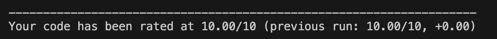
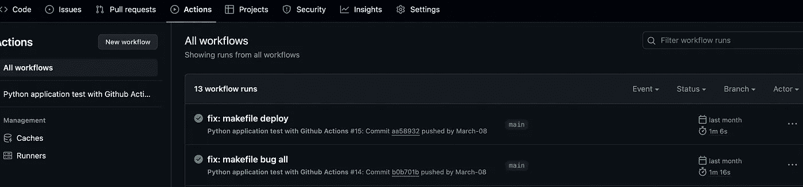

# 一个简单的 ML 项目 CI/CD 设置

> 原文：[`towardsdatascience.com/a-simple-ci-cd-setup-for-ml-projects-604de7fd64cd`](https://towardsdatascience.com/a-simple-ci-cd-setup-for-ml-projects-604de7fd64cd)


图片由 [vackground.com](https://unsplash.com/@vackground?utm_source=medium&utm_medium=referral) 提供，来源于 [Unsplash](https://unsplash.com/?utm_source=medium&utm_medium=referral)

## 应用最佳实践并学习使用 GitHub Actions 来构建稳健的代码

[](https://medium.com/@marcellopoliti?source=post_page-----604de7fd64cd--------------------------------)[](https://towardsdatascience.com/?source=post_page-----604de7fd64cd--------------------------------) [Marcello Politi](https://medium.com/@marcellopoliti?source=post_page-----604de7fd64cd--------------------------------)

·发表于 [Towards Data Science](https://towardsdatascience.com/?source=post_page-----604de7fd64cd--------------------------------) ·7 分钟阅读·2023 年 12 月 20 日

--

## 介绍

处理**集成、部署、可扩展性**以及所有那些使机器学习项目成为真正产品的主题本身就是一项工作。这就是为什么从数据科学家到 ML 工程师和 MLOps 之间存在不同职位的原因。尽管你不需要成为这些领域的专家，但**拥有一些标准的明确定义的实践来帮助你启动项目是很好的**。确实如此！在这篇文章中，我概述了我开发的最佳实践——在代码质量和实施时间之间的平衡。我在 [Deepnote](https://deepnote.com/) 上运行我的代码，这是一款基于云的笔记本，非常适合协作数据科学项目。

## 从简单开始 — README

这看起来可能很琐碎，但**尽量保持 README 文件的更新**。如果花费时间不多，并且你喜欢这样做，尝试让 README 也看起来好看。包括想象中的标题图标或其他内容。这个文件必须**清晰易懂**。记住，在实际项目中，你不仅仅是与其他开发者合作，还会与销售人员和项目经理合作，他们可能需要阅读 README 以了解你在做什么。

你可以在[这里](https://github.com/othneildrew/Best-README-Template)找到一个非常棒的 README 模板！

[](https://github.com/othneildrew/Best-README-Template?source=post_page-----604de7fd64cd--------------------------------) [## GitHub - othneildrew/Best-README-Template: 一个极好的 README 模板，助力你的项目启动！

### 一个极好的 README 模板，可以帮助你快速启动项目！ - GitHub - othneildrew/Best-README-Template: 一个极好的 README…

github.com](https://github.com/othneildrew/Best-README-Template?source=post_page-----604de7fd64cd--------------------------------)

## 使用虚拟环境，你的笔记本电脑会很高兴。

你可能比我更清楚，为了开发一个酷炫的项目，我们需要外部库。通常需要很多这些库！这些**库可能有依赖关系或冲突**。这就是**创建虚拟环境的好主意**。虚拟环境可以帮助你**让项目相互隔离**，拥有完全不同的开发环境。通常，在 Python 中你**使用 pip 或 conda** 来做到这一点。

[](https://pypi.org/project/pip/?source=post_page-----604de7fd64cd--------------------------------) [## pip

### PyPA 推荐的 Python 包安装工具。

pypi.org](https://pypi.org/project/pip/?source=post_page-----604de7fd64cd--------------------------------)

我个人是 pip 的粉丝。这是如何创建和激活虚拟环境。

```py
#create virtual env
python3 -m venv .venv
```

```py
#activate virtual env
source .venv/bin/activate
```

现在你可以安装所有你想要的库了！

## 创建一个 Requirements 文件，你的同事会很高兴。

在机器学习这样的领域，如果**不允许代码和实验的可重复性**，那么**编写代码是没有意义的**。**开始的地方应该是创建一个 requirements.txt 文件**。

[## Requirements 文件格式 - pip 文档 v23.3.2

### Requirements 文件作为 pip 安装的项目列表，当使用 pip install 时。使用这种格式的文件…

pip.pypa.io](https://pip.pypa.io/en/stable/reference/requirements-file-format/?source=post_page-----604de7fd64cd--------------------------------)

我**不能运行其他人编写的代码，如果我不知道那个人安装了什么库**来运行代码。因此，你应该保留一个名为 ***requirements.txt*** 的文本文件，其中**输入所有库的名称**。你可以手动编辑这个文件，也就是说，每次使用 pip 安装库时，你也将库的名称输入到 requirements 文件中。或者你可以使用一个**有用的 pip 命令，自动将所有已安装的库**直接输入到 requirements 文件中。让我们看看如何做。

如果你运行以下命令

```py
pip freeze
```

你会看到终端中出现所有已安装库的列表。现在只需使用终端技巧将此命令的输出重定向到 requirements.txt 文件，而不是终端显示。

```py
pip freeze > requirements.txt
```

如果你现在检查你的 requirements，你会看到它们已自动更新！

如果你想在新的虚拟环境中自动安装所有要求，你可以运行以下命令：

```py
pip intall -r requirements.txt
```

## 使用 Black 格式化你的代码。

我在这篇文章中使用的许多库做的事情比我描述的要多。但是正如我预期的那样，我的目的仅仅是有一个开发时遵循的例程。

[## black](https://pypi.org/project/black/?source=post_page-----604de7fd64cd--------------------------------)

### 无妥协的代码格式化工具。

[pypi.org](https://pypi.org/project/black/?source=post_page-----604de7fd64cd--------------------------------)

**我使用 Black 来清晰地格式化代码** 和整洁地排列。这里是你可以用来运行 black 的命令：

```py
find src -name '*.py' -exec black {} +
```

在命令中，我们指定了编辑 src 目录下所有的 python 文件（*.py）。

## 使用 PyLint 分析你的代码

PyLint 是另一个非常有用的库，我建议你开始使用。

[## pylint

### python 代码静态检查器

[pypi.org](https://pypi.org/project/pylint/?source=post_page-----604de7fd64cd--------------------------------)

**PyLint 自动检查代码中的错误，强制使用标准，并检查代码气味**，例如从未使用过的导入。PyLint 还会给你的代码质量打分，范围从 1 到 10。

```py
pylint --disable=R,C src/*.py
```

你会注意到我修改了命令，禁用了两个标志（R 和 C）。这样，PyLint 将不会发出有关重构和约定的问题的警告或提示。

输出应该如下所示：



图片由作者提供

## 运行测试，确保你的代码正常工作

**如果你不使用测试，怎么知道你的代码总是有效的？** 养成 **创建简单单元测试的习惯**，你可以在编写函数时随时扩展。单元测试不过是一个函数，它会将一系列输入传递给你想测试的函数，并查看输出是否符合预期。

你可以通过多种方式实现单元测试；在 Python 中广泛使用的库是 [PyTest](https://docs.pytest.org/en/7.4.x/)。

[## pytest: helps you write better programs - pytest documentation

### pytest 和其他成千上万的包的维护者正在与 Tidelift 合作，提供商业支持和…

[docs.pytest.org 我通常创建一个名为 test 的 src 姐妹文件夹，在其中收集所有的单元测试。](https://docs.pytest.org/en/7.4.x/?source=post_page-----604de7fd64cd--------------------------------)

我通常创建一个 *src* 姐妹文件夹，叫做 *test*，在其中收集所有的单元测试。

要启动所有自动生成的测试，我们运行以下命令

```py
python -m pytest -vv --cov=test
```

## 我很懒，我会使用 Makefile

到此为止，我们已经看到许多文件和许多命令。我觉得作为例行操作有点繁重。我希望有一些更简单的东西，我的记忆不好😅

好的，那么我们可以创建一个 **Makefile，这是一种我们可以在其中写入一些指令的文件**，并且 **这将为我们启动之前看到的命令**。在 Makefile 中，我想写指令以 **安装需求、使用 black 格式化代码、使用 PyLint 检查代码气味，并使用 PyTest 启动测试**。下面是我们的 Makefile 将是什么样子：

```py
install:
 #install
 pip install --upgrade pip&&\
  pip install -r requirements.txt
format:
 #format
 find src -name '*.py' -exec black {} +
lint:
 #lint
 pylint --disable=R,C src/*.py
test:
 #test
 python -m pytest -vv --cov=test 
```

这样，每次我们从终端使用这个命令时：

```py
make test
```

实际上，它将被执行

```py
python -m pytest -vv --cov=test
```

当然，所有其他命令也适用相同的方法。

现在我们的仓库看起来更专业了！

## **通过 GitHub Actions 在每次推送时运行所有内容**

我希望到目前为止一切都清楚。此时，每当我们想要对代码进行更改时，在提交和推送到 GitHub 之前，我们会运行以下命令，以确保一切顺利进行：*make install, make format, make lint, make test*。

但开发者喜欢自动化一切。那么，**难道没有一种方法可以在每次 git 推送时自动运行整个过程吗？** 当然有，只需使用**GitHub Actions**即可！

使用 GitHub actions，我们可以**设置触发器**，即指定触发命令的事件，在我们的例子中，这些命令都在 Makefile 中。

为了创建 GitHub actions，我们需要在工作目录中**创建 .github/workflows 文件夹**。在这个新目录中，我们**创建一个 YML 文件**，例如可以命名为**mlops.yml**。

在这个文件中，我们可以指定几个内容。首先是我们想要的任何名字。

然后，我们指定将触发命令的事件（或事件），在这种情况下是[push]。接着，我们处理*steps*（其中第一部分我甚至不记得是什么，但幸运的是有 Google 和 ChatGPT，我们可以从中复制粘贴😅）。

```py
name: Python application with Github Actions

on: [push]
jobs:
  build:
    runs-on: ubuntu-latest

    steps:
      - uses: actions/checkout@v4
      - uses: actions/setup-python@v4
        with:
          python-version: "3.10"

      - name: Install dependencies
        run: |
          make install

      - name: Lint with pyLint
        run: |
          make lint

      - name: Test with pytest
        run: |
          make test

      - name: Format code
        run: |
          make format

      - name: Build container
        run: |
          make build
```

这应该是整个项目的代码结构

```py
-.github/workflows
  - mlops.yml
-.venv
-src
-test
-requirements.txt
-Makefile
-Readme.md
```

就这样！

现在你应该能够在 GitHub 的*actions*标签下查看每次推送时运行的所有命令。



图片由作者提供

# **最终思考**

在这篇文章中，我展示了一些我在开发 Python 项目时使用的最佳实践，以确保代码质量，并保护我的 GitHub 仓库免受不太实用的提交。虽然每个主题仍然可以深入探讨，但能够至少以某种方式快速轻松地构建你的代码，我认为对提高你的工作是很有帮助的！

如果你对这篇文章感兴趣，可以在 Medium 上关注我！😁

💼 [Linkedin](https://www.linkedin.com/in/marcello-politi/) ️| 🐦 [Twitter](https://twitter.com/_March08_) | [💻](https://emojiterra.com/laptop-computer/) [Website](https://marcello-politi.super.site/)
