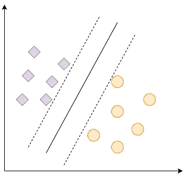
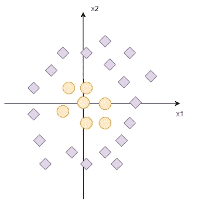
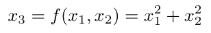
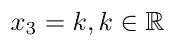
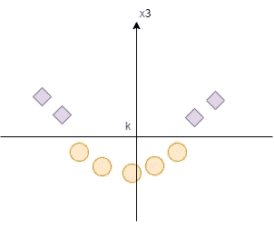
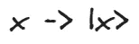
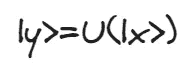
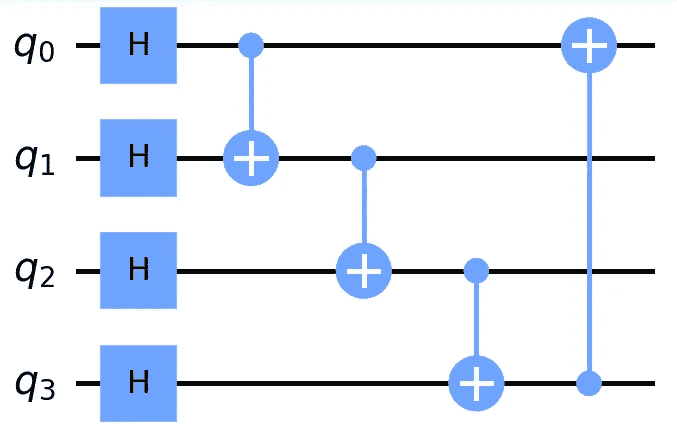
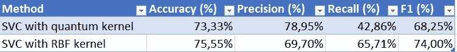

# 对量子增强支持向量机的简单介绍

> 原文：[`towardsdatascience.com/a-simple-introduction-to-quantum-enhanced-svm-bee893a4377c?source=collection_archive---------3-----------------------#2023-10-03`](https://towardsdatascience.com/a-simple-introduction-to-quantum-enhanced-svm-bee893a4377c?source=collection_archive---------3-----------------------#2023-10-03)

## 如何将有趣的量子计算属性与经典机器学习技术相结合

[](https://matheuscammarosanohidalgo.medium.com/?source=post_page-----bee893a4377c--------------------------------)[](https://towardsdatascience.com/?source=post_page-----bee893a4377c--------------------------------) [Matheus Cammarosano Hidalgo](https://matheuscammarosanohidalgo.medium.com/?source=post_page-----bee893a4377c--------------------------------)

·

[关注](https://medium.com/m/signin?actionUrl=https%3A%2F%2Fmedium.com%2F_%2Fsubscribe%2Fuser%2F2d8a0d1399be&operation=register&redirect=https%3A%2F%2Ftowardsdatascience.com%2Fa-simple-introduction-to-quantum-enhanced-svm-bee893a4377c&user=Matheus+Cammarosano+Hidalgo&userId=2d8a0d1399be&source=post_page-2d8a0d1399be----bee893a4377c---------------------post_header-----------) 发布于 [数据科学前沿](https://towardsdatascience.com/?source=post_page-----bee893a4377c--------------------------------) ·7 分钟阅读·2023 年 10 月 3 日[](https://medium.com/m/signin?actionUrl=https%3A%2F%2Fmedium.com%2F_%2Fvote%2Ftowards-data-science%2Fbee893a4377c&operation=register&redirect=https%3A%2F%2Ftowardsdatascience.com%2Fa-simple-introduction-to-quantum-enhanced-svm-bee893a4377c&user=Matheus+Cammarosano+Hidalgo&userId=2d8a0d1399be&source=-----bee893a4377c---------------------clap_footer-----------)

--

[](https://medium.com/m/signin?actionUrl=https%3A%2F%2Fmedium.com%2F_%2Fbookmark%2Fp%2Fbee893a4377c&operation=register&redirect=https%3A%2F%2Ftowardsdatascience.com%2Fa-simple-introduction-to-quantum-enhanced-svm-bee893a4377c&source=-----bee893a4377c---------------------bookmark_footer-----------)

# 介绍

尽管量子计算机尚未普及，**量子机器学习**（QML）仍然是一个有前景的研究领域，因为它利用了量子系统固有的概率性质来开发模型。目前，全球的数据科学家们正在尝试理解如何利用量子范式来生成更好、可扩展的模型。无法量化这一进展何时会发生，因为这还取决于量子硬件的发展，但这一领域的增长速度正在加快。

在我的最新研究中，我尝试设计变分量子分类器（VQC），正如你可以在我写的[上一篇文章](https://medium.com/@matheuscammarosanohidalgo/a-very-simple-variational-quantum-classifier-vqc-64e8ec26589d)中看到的。如果你像我一样开始学习 QML，这将是一个有趣的研究案例。

然而，最近我也开始研究支持向量机（SVM）的量子方法，我对 SVM 如何转化为量子世界感到非常好奇。

当我研究 VQC 时，我非常有偏见地尝试猜测 SVM 如何转化为一个可参数化的量子电路，但我发现量子增强在这里的作用不同，这让我感到惊喜，并帮助我开阔了对这一主题的思路。

在这篇文章中，我首先简要介绍 SVM，然后讲述如何用量子机器学习（QML）方法处理这种技术，并以使用泰坦尼克号数据集的量子增强 SVM（QSVM）示例结束。

# SVM 和核方法

我在这里介绍专注于分类问题的 SVM，即支持向量分类器（SVC）。SVC 的目标是找到一个超平面，以最佳的边际分离不同类别的数据。一开始这似乎并不太有帮助，对吧？

那么，这个分离类别的超平面是什么呢？假设我们在一个二维向量空间中工作，并且有两个类别，如图 1 所示。



图 1— 具有非常明确线性分隔符的 2D 数据 — 图像由作者提供

在这个例子中，我们有来自 2 个不同类别的数据点，我们可以很容易地画一条直线分离它们。我们的实线是将数据以最佳边际分开的超平面，如虚线所示。因此，SVM 试图找到最佳的分隔符。

你可能会认为我的例子过于幼稚，而直线是超平面的一个非常特例，这一点是有效的。如果我们的二维数据看起来像图 2 那样呢？



图 2— 具有非线性分隔符的 2D 数据 — 图像由作者提供

在这种情况下，我们无法画出正确分离数据的直线。如果我们看这张图，我们可以画一个圆作为好的分隔器。然而，这种形状既不是直线也不是平面，所以 SVM 无法直接解决这个问题。然而，这就是最酷的 SVM 技巧和高维超平面出现的地方！

如果我们将这些数据转化为更高维度的向量空间会怎样？如：



（方程图由作者提供）

所以我们可以画一个平面：



（方程图由作者提供）

哪个能如图 3 所示最佳地分离两个类别：



图 3— 在更高维空间中分离我们数据的平面 — 图像由作者提供

在我们的情况下，函数 f 就是我们所谓的核，它将数据投影到更高维空间，这使得更容易找到一个可以正确识别不同类别数据的超平面。

这是关于核和支持向量机（SVM）的非常简要介绍，如果你对 SVM 的更多解释感兴趣，我建议你阅读这两篇文章（1 和 2），它们都是关于 SVM 的很好的介绍，并且我在这篇文章中都用作了参考。

你现在可能在想，我的例子很方便地解释了核概念，但在现实生活中，我们如何找到解决问题的合适核呢？有些核非常灵活，非常有助于解决大量问题，比如径向基函数（RBF），这是 scikit-learn 的 SVC 的默认选项。如果你有兴趣了解更多关于这个核的信息，我推荐阅读这篇文章。关于诸如 RBF 的核的一个重要细节是，它们不是由解析函数描述的，而是基于核的数据点之间的相似性矩阵。

不过，如果我们想更有创意呢？如果你曾经阅读过[我的之前的文章](https://medium.com/@matheuscammarosanohidalgo/why-you-should-start-studying-quantum-machine-learning-418bb5e0ad14)，你可能还记得量子计算最有趣的特性之一是量子比特和量子态之间的指数关系。因此，量子系统是一个非常有趣的核候选者，因为它倾向于将我们的系统驱向高维向量空间，这取决于我们使用的量子比特数量。

# 量子核

量子核通常由基于量子电路的相似性矩阵定义，这可能是可参数化的，也可能不是。Pennylane 和 Qiskit 都有内置函数，可以创建可以在 scikit-learn 的 SVC 中使用的核。

量子核项目有一些步骤：

**将数据嵌入量子态中**



（作者提供的方程图像）

**设计一个可能可参数化的量子电路**



（作者提供的方程图像）

在这个阶段，强烈建议在量子计算中采用一定程度的叠加和态的纠缠，以获取量子计算能提供的最佳效果。

**构建相似性矩阵**

在这里，我们使用我们在上一步中构建的幺正 U（|x>）及其伴随来设计一个相似性矩阵。

# **示例**

我们在 Pennylane 中设计了一个简单的量子核，以便与 scikit-learn 的 Titanic 分类数据集中的 SVC 一起使用，我们希望基于诸如年龄、性别和登船类别等变量来预测一个人是否在泰坦尼克号悲剧中幸存。

在我们的例子中，我们使用以下变量：

+   is_child: 如果年龄小于 12 岁（布尔值）

+   Pclass_1: 如果此人乘坐的是头等舱（布尔值）

+   Pclass_2: 如果此人乘坐的是二等舱（布尔值）

+   Sex_female: 如果此人的性别是女性（布尔值）

如你所见，这只是一个具有四个布尔变量的非常简单的模型。我们通过量子嵌入（Basis Embedding）将数据嵌入量子态，应用 Hadamard 门来实现量子位的叠加，使用 CNOT 门生成纠缠。



图 4— 我们的核示例的 Ansatz — 作者提供的图像

这是一个简单且不可参数化的 Ansatz，但它生成了变量之间的叠加和纠缠。

创建核和 SVM 的代码如下：

```py
import pennylane as qml
from pennylane import numpy as np

from sklearn.model_selection import train_test_split
import pandas as pd

from sklearn.metrics import accuracy_score
from sklearn.metrics import f1_score, precision_score, recall_score

from sklearn.svm import SVC

num_qubits = 4

def layer(x):

    qml.BasisEmbedding(x, wires=range(num_qubits))

    for j, wire in enumerate(wires):
        qml.Hadamard(wires=[wire])
        if j != num_qubits-1:
            qml.CNOT(wires=[j, j+1])
        else:
            qml.CNOT(wires=[j, 0])

def ansatz(x, wires):
    layer(x)

adjoint_ansatz = qml.adjoint(ansatz)

dev = qml.device("default.qubit", wires=num_qubits, shots=None)
wires = dev.wires.tolist()

@qml.qnode(dev, interface="autograd")
def kernel_circuit(x1, x2):
    ansatz(x1, wires=wires)
    adjoint_ansatz(x2, wires=wires)
    return qml.probs(wires=wires)

def kernel(x1, x2):
    return kernel_circuit(x1, x2)[0]

df_train = pd.read_csv('train.csv')

df_train['Pclass'] = df_train['Pclass'].astype(str)

df_train = pd.concat([df_train, pd.get_dummies(df_train[['Pclass', 'Sex', 'Embarked']])], axis=1)

X_train, X_test, y_train, y_test = train_test_split(df_train.drop(columns=['Survived']), df_train['Survived'], test_size=0.10, random_state=42, stratify=df_train['Survived'])

X_train['Age'] = X_train['Age'].fillna(X_train['Age'].median())
X_test['Age'] = X_test['Age'].fillna(X_test['Age'].median())

X_train['is_child'] = X_train['Age'].map(lambda x: 1 if x < 12 else 0)
X_test['is_child'] = X_test['Age'].map(lambda x: 1 if x < 12 else 0)

cols_model = ['is_child', 'Pclass_1', 'Pclass_2', 'Sex_female']

X_train = X_train[cols_model]
X_test = X_test[cols_model]

X_train = np.array(X_train.values, requires_grad=False)

init_kernel = lambda x1, x2: kernel(x1, x2)
K = qml.kernels.square_kernel_matrix(X_train, init_kernel, assume_normalized_kernel=True)

svm = SVC(kernel=lambda X1, X2: qml.kernels.kernel_matrix(X1, X2, init_kernel)).fit(X_train, y_train)

X_test = np.array(X_test.values, requires_grad=False)

predictions = svm.predict(X_test)

accuracy_score(y_test, predictions)
precision_score(y_test, predictions)
recall_score(y_test, predictions)
f1_score(y_test, predictions, average='macro')

svm1 = SVC(gamma='auto', kernel='rbf')
svm1.fit(X_train, y_train)

y_pred = svm1.predict(X_test)

accuracy_score(y_test, y_pred)
precision_score(y_test, y_pred)
recall_score(y_test, y_pred)
f1_score(y_test, y_pred, average='macro')
```

结果如下：



图 5— 测试结果打印 — 作者提供的图像

如你所见，RBF 核的 SVC 表现优于我们的量子核 SVC。我们的量子方法具有良好的精确度，这意味着我们成功避免了较多的假阳性，但召回率不佳，意味着我们有显著数量的假阴性。

如果你想深入了解量子核的 SVM，这些帖子是很好的参考：[1](https://medium.com/mit-6-s089-intro-to-quantum-computing/quantum-support-vector-machine-qsvm-134eff6c9d3b)，[2](https://medium.com/@patrick.huembeli/introduction-into-quantum-support-vector-machines-727f3ccfa2b4)，以及 Pennylane 关于这一主题的这些文本：[3](https://pennylane.ai/qml/demos/tutorial_kernel_based_training) 和 [4](https://pennylane.ai/qml/demos/tutorial_kernels_module)。

# 结论

量子核可以是提高 SVM 性能的强大工具。然而，正如我们在例子中所见，具有简单量子核的 SVM 无法超越具有 RBF 核的 SVM。量子核需要精心设计才能与经典技术竞争。

我一直在深入研究设计可参数化的量子核，希望很快有好消息。
