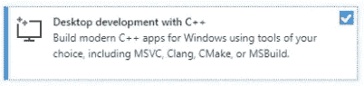
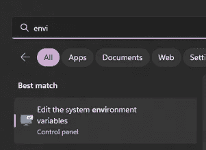
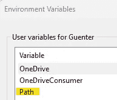
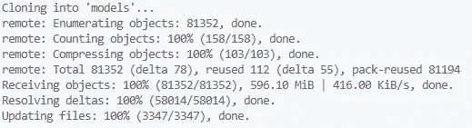
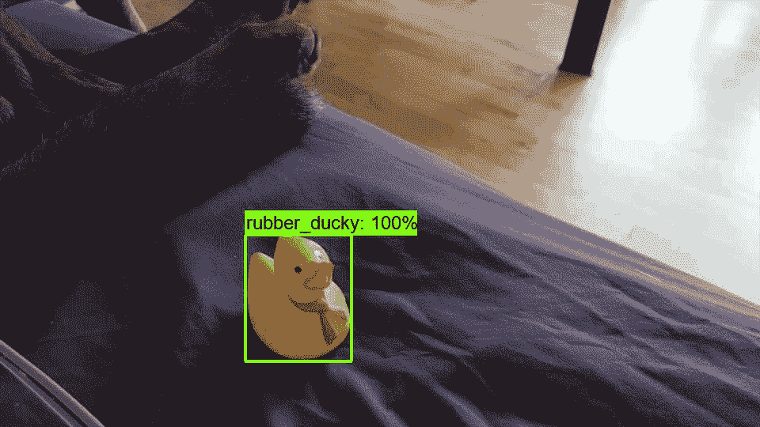

# 一个简单的 TensorFlow 和 TensorFlow 对象检测 API 的逐步安装指南

> 原文：[`towardsdatascience.com/a-simple-step-by-step-installation-guide-for-tensorflow-tensorflow-object-detection-api-c1660d4ae533`](https://towardsdatascience.com/a-simple-step-by-step-installation-guide-for-tensorflow-tensorflow-object-detection-api-c1660d4ae533)

## 安装 TensorFlow 和 TensorFlow 对象检测 API 可能会很繁琐和耗时。这个指南将帮助你快速完成整个设置过程。

[](https://guenterroehrich.medium.com/?source=post_page-----c1660d4ae533--------------------------------)[](https://towardsdatascience.com/?source=post_page-----c1660d4ae533--------------------------------) [Günter Röhrich](https://guenterroehrich.medium.com/?source=post_page-----c1660d4ae533--------------------------------)

·发布于 [Towards Data Science](https://towardsdatascience.com/?source=post_page-----c1660d4ae533--------------------------------) ·阅读时间 8 分钟·2023 年 2 月 15 日

--

尽管有一个[官方指南](https://tensorflow-object-detection-api-tutorial.readthedocs.io/en/latest/install.html)来安装 TensorFlow 及其对象检测 API，但你仍然可能遇到许多问题（特别是当你希望安装 GPU 支持时）。这篇文章不会做任何假设，而是会详细指导你完成整个过程，以帮助你快速上手。

这些逐步说明分为几个主要部分，但在我们开始之前，我想指出一个重要的说明：虽然在普通的新电脑上进行计算机视觉任务是可行的，但我强烈建议使用安装了 NVIDIA GPU（显卡）的机器。附带说明，AMD 显卡通常不被 TensorFlow 或 PyTorch 支持。


一个相当复杂的 TensorFlow 安装 — 图片由 Dall-E 提供，提示由作者编写。

在现代深度学习框架的支持下，特别是针对 NVIDIA GPU 进行优化，你可以 1) 快速训练模型，并且 2) 迅速进行预测。如果你使用的是仅有 CPU 的配置，我建议你不要 (重新) 训练模型，而是仅安装一个模型并通过该预训练模型进行预测。

**也就是说，这个指南将适应你的需求，无论你的硬件要求是什么。** 以下的说明比较通用，但针对 Windows 用户指出了关键步骤。

让我们跳过以下步骤，准备好你的机器进行对象检测：

1.  *安装 VS Code（和 GIT）*

1.  *获取 Anaconda 或继续使用你的通用环境*

1.  *获取 CUDA 和 CUDNN 驱动程序以支持你的 GPU*

1.  获取 C++构建工具和 MS Visual Studio 安装

1.  *安装 Protoc*

1.  *从 TensorFlow 下载预训练模型*

1.  *运行演示笔记本以测试安装*

## 1\. 安装你选择的编辑器和 GIT

虽然你可以使用任何文本编辑器或 IDE，但我喜欢使用 VS Code（特别是因为 Atom 现在被认为是过时的），原因很简单：它易于使用，提供了各种扩展，具有很好的同步功能，最重要的是，与**Jupyter 笔记本**一起使用非常棒。

[](https://code.visualstudio.com/?source=post_page-----c1660d4ae533--------------------------------) [## Visual Studio Code - 重新定义代码编辑

### Visual Studio Code 是一个重新定义并优化了的代码编辑器，适用于构建和调试现代 Web 和云…

[code.visualstudio.com](https://code.visualstudio.com/?source=post_page-----c1660d4ae533--------------------------------)

如前所述，你还应该安装 GIT（版本控制）。如果尚未安装，请从以下链接安装**GIT** bash：

[](https://git-scm.com/downloads?source=post_page-----c1660d4ae533--------------------------------) [## 下载

### Git 附带内置的 GUI 工具（git-gui, gitk），但也有一些第三方工具供用户使用…

[git-scm.com](https://git-scm.com/downloads?source=post_page-----c1660d4ae533--------------------------------)

## 2\. 启动并运行你的 Anaconda 安装

虽然你可以使用“全局 Python 安装”，但在 Anaconda 环境中工作是一个好习惯。Anaconda 环境的巨大优势在于，它使管理当前项目的工作依赖关系变得容易。从这里下载并安装你的 Anaconda 安装程序：

[](https://docs.anaconda.com/anaconda/install/windows/?source=post_page-----c1660d4ae533--------------------------------#) [## 在 Windows 上安装 - Anaconda 文档

### 更喜欢视觉学习？观看下面链接中的视频以了解如何在 Windows 上安装 Anaconda！下载 Anaconda…

[docs.anaconda.com](https://docs.anaconda.com/anaconda/install/windows/?source=post_page-----c1660d4ae533--------------------------------#)

安装后，确保打开“anaconda 提示符”并使你的环境运行起来：

```py
conda create -n MyEnvironment python=3.10
conda activate MyEnvironment

# find more here:
# https://conda.io/projects/conda/en/latest/user-guide/tasks/manage-environments.html
```

## 3\. 安装 NVIDIA 的 GPU 驱动程序

为了使你的模型能够正确使用 GPU，你需要直接从 NVIDIA 安装驱动程序。需要下载以下两个资源：

+   CUDA 工具包 ([`developer.nvidia.com/cuda-downloads`](https://developer.nvidia.com/cuda-downloads))

+   CUDNN ([`developer.nvidia.com/rdp/cudnn-archive`](https://developer.nvidia.com/rdp/cudnn-archive))

确保选择正确的操作系统（Windows、Linux 或 MacOS）——你需要注册一个帐户以触发下载。**第一步**，确保你已经**正确安装了 CUDA Toolkit**。这是必要的，因为 CUDNN 下载的是一个 zip 文件，而不是安装文件。

安装 CUDA 后，确保导航到以下安装路径（你的路径可能略有不同，但本质上，这是你需要去的地方）：

```py
>> C:/Program Files/NVIDIA GPU Computing Toolkit/CUDA/v1X.X/
```

在这个文件夹中，你会找到子文件夹**bin**、**include**和**lib**。这些文件夹在解压后的 CUDNN 文件夹中也存在。确保将每个 CUDNN 文件夹的内容复制到相应的 CUDA 文件夹中（路径如上所示）。

> 这只会添加文件，确保你**不要替换**任何文件夹！

## 4. 安装 C++ Build Tools 和微软的© Visual Studio©

为了使 TensorFlow 正常工作，必须在你的计算机上安装 C++ Build Tools。这个步骤不可绕过，即使这个安装文件较大（大约 2GB），也请继续进行。

[## Visual Studio 2022 Community Edition - Download Latest Free Version](https://visualstudio.microsoft.com/vs/community/?source=post_page-----c1660d4ae533--------------------------------)

### 尝试我们的免费、功能齐全且可扩展的 IDE，创建适用于 Windows、Android 和 iOS 的现代开发者应用程序……

[visualstudio.microsoft.com](https://visualstudio.microsoft.com/vs/community/?source=post_page-----c1660d4ae533--------------------------------)

安装完上述 Visual Studio 后，你将被引导到可能的“**工作负载**”。



这个步骤的关键部分

完成这些步骤后，我们接近结束这个安装过程！在下一步中，我们需要安装另一个 TensorFlow 的依赖项，称为 Protoc。

## 5. 安装 Protoc

下载适用于你的设备和操作系统的最新 Protoc 版本——再次说明，可以是 Windows、Linux 或 Mac。同时确保选择适合你处理器架构的文件。

[## Releases · protocolbuffers/protobuf](https://github.com/protocolbuffers/protobuf/releases?source=post_page-----c1660d4ae533--------------------------------)

### Protocol Buffers - Google 的数据交换格式 - Releases · protocolbuffers/protobuf

[github.com](https://github.com/protocolbuffers/protobuf/releases?source=post_page-----c1660d4ae533--------------------------------)

将解压后的文件夹内容存储到你能够再次找到的地方，并且这个地方应该适合长期保存（理想情况下，不是下载文件夹）。

在这个文件夹中，确保找到包含*protoc.exe*文件的“bin”文件夹——*exe*仅适用于 Windows 用户，你在其他操作系统上会看到不同的文件格式。在我的情况下，我有以下路径，请确保高亮并**复制到剪贴板**。

```py
D:\Program Files\protoc-3.12.4-win64\bin
```

按下 Windows 按钮，开始输入“环境”，这应该会显示以下结果：



从这里选择环境变量并获取刚刚弹出窗口中的“路径”：



将上述链接添加到 Path 变量中，以确保你可以直接从命令行执行“*protoc*”。如果路径设置正确，你也可以通过 CMD 命令“*where protoc*”来测试结果。

## 6\. 在你的计算机上安装 TensorFlow 及其预训练模型

为了将 TensorFlow 模型安装到你的计算机上，你需要从 TensorFlow GitHub 仓库中下载它们。为此，打开你选择的文件夹，右击并选择“Git Bash here”（再次假设你已经按照本指南第 1 步操作）。

**输入以下语句：**

```py
# install TF as:
conda install -c conda-forge tensorflow

# download the detection models
git clone https://github.com/tensorflow/models
```

这又是一个大约 1GB 的下载，需要加载到你的计算机上，以便选择不同的检测器。



在模型正确下载后，使用命令行导航到研究文件夹，逐步完成对象检测的安装——更具体地说，是 TensorFlow、对象检测 API 以及像 open CV2 等辅助依赖项。

```py
# https://tensorflow-object-detection-api-tutorial.readthedocs.io/en/latest/install.html#protobuf-installation-compilation

cd reasearch
protoc object_detection/protos/*.proto --python_out=.

# From within TensorFlow/models/research/
cp object_detection/packages/tf2/setup.py .
python -m pip install --use-feature=2020-resolver .
```

为了完整性，你现在还可以测试 CUDA/CUDNN 安装是否成功，使用以下 Python 代码：

```py
import tensorflow as tf
print(tf.config.list_physical_devices())

## Results in:
[PhysicalDevice(name='/physical_device:CPU:0', device_type='CPU'), \
 PhysicalDevice(name='/physical_device:GPU:0', device_type='GPU')] # yay

# to explicitly run on CPU or GPU, you can always do the following:
with tf.device('GPU') as gpu:
    print('This is executed on the GPU')
```

## 7\. 运行演示检测模型

成功！此时你已安装好使用预训练 TensorFlow 模型进行对象检测所需的一切。在下面的链接中，你可以下载一个 Jupyter 笔记本以测试安装：

[](https://github.com/tensorflow/models/blob/master/research/object_detection/colab_tutorials/eager_few_shot_od_training_tf2_colab.ipynb?source=post_page-----c1660d4ae533--------------------------------) [## models/eager_few_shot_od_training_tf2_colab.ipynb at master · tensorflow/models

### 你现在不能执行该操作。你在另一个标签页或窗口中登录了。你在另一个标签页或窗口中注销了…

github.com](https://github.com/tensorflow/models/blob/master/research/object_detection/colab_tutorials/eager_few_shot_od_training_tf2_colab.ipynb?source=post_page-----c1660d4ae533--------------------------------)

链接中的 Colab 笔记本使用了几张橡皮鸭的图片，以提升模型检测对象的能力。只需将笔记本下载到你的计算机（不再需要使用 Colab），并逐步执行单元格。确保注释掉所有关于 Colab 的引用（加载库和函数调用）。

结果令人惊叹，通过迁移学习和仅仅 5 张橡皮鸭的新图像，*ssd_resnet50 基础检测器*能够识别视频中的对象，如下所示：



基于预训练的 ssd_resnet50 模型的目标检测器结果

## 结论

设置 TensorFlow 及其依赖项的“基础设施”可能会很麻烦。尤其是在漏掉一步或另一部时，找到源头或最终的错误信息往往会令人非常沮丧。通过本指南，用户可以按照最基本的步骤，仅需几分钟即可让 TensorFlow 及其检测 API 正常运行。

如果你觉得这篇文章有帮助，我会很感激你的“关注” 🫀，直到那时：

*{照顾好自己，如果可能的话，也照顾好其他人}*

*— 借用自 Stephen Dubner*

链接到官方安装说明（这不包括 NVIDIA 驱动程序的安装步骤）：

[## 安装 - TensorFlow 2 目标检测 API 教程文档

### 虽然安装和使用 TensorFlow 并不需要 Anaconda，但我建议这样做，因为它的…

tensorflow-object-detection-api-tutorial.readthedocs.io](https://tensorflow-object-detection-api-tutorial.readthedocs.io/en/latest/install.html?source=post_page-----c1660d4ae533--------------------------------)
