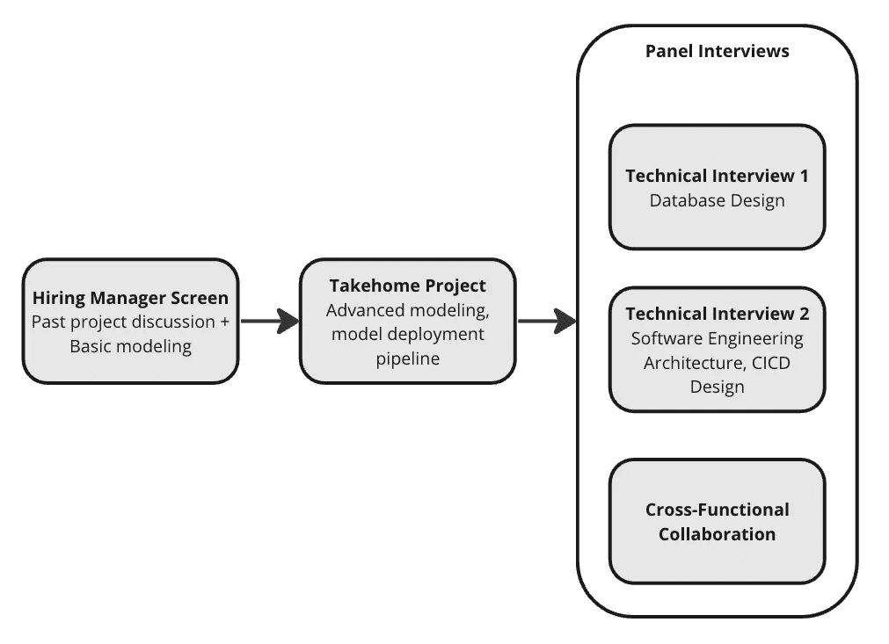
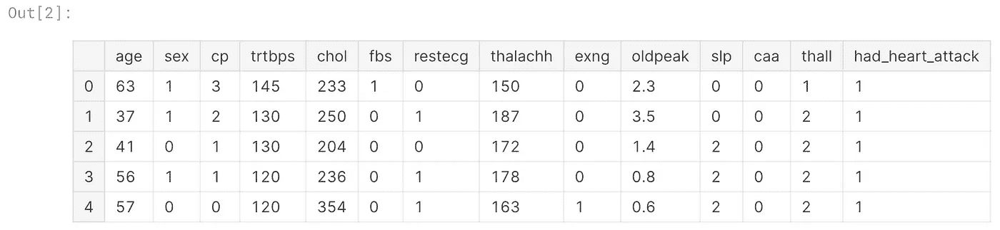
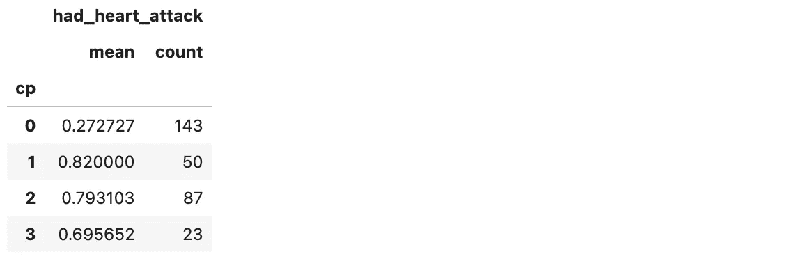

# 改善数据科学面试的简单方法

> 原文：[`towardsdatascience.com/a-simple-way-to-improve-data-science-interviews-5d07838d6632?source=collection_archive---------3-----------------------#2023-07-13`](https://towardsdatascience.com/a-simple-way-to-improve-data-science-interviews-5d07838d6632?source=collection_archive---------3-----------------------#2023-07-13)

## 通过技术问题框架识别前 5%的候选人

[](https://medium.com/@jackblandin?source=post_page-----5d07838d6632--------------------------------)[](https://towardsdatascience.com/?source=post_page-----5d07838d6632--------------------------------) [Jack Blandin](https://medium.com/@jackblandin?source=post_page-----5d07838d6632--------------------------------)

·

[关注](https://medium.com/m/signin?actionUrl=https%3A%2F%2Fmedium.com%2F_%2Fsubscribe%2Fuser%2F4bbca0afc68f&operation=register&redirect=https%3A%2F%2Ftowardsdatascience.com%2Fa-simple-way-to-improve-data-science-interviews-5d07838d6632&user=Jack+Blandin&userId=4bbca0afc68f&source=post_page-4bbca0afc68f----5d07838d6632---------------------post_header-----------) 发表在 [Towards Data Science](https://towardsdatascience.com/?source=post_page-----5d07838d6632--------------------------------) · 13 分钟阅读 · 2023 年 7 月 13 日[](https://medium.com/m/signin?actionUrl=https%3A%2F%2Fmedium.com%2F_%2Fvote%2Ftowards-data-science%2F5d07838d6632&operation=register&redirect=https%3A%2F%2Ftowardsdatascience.com%2Fa-simple-way-to-improve-data-science-interviews-5d07838d6632&user=Jack+Blandin&userId=4bbca0afc68f&source=-----5d07838d6632---------------------clap_footer-----------)

--

[](https://medium.com/m/signin?actionUrl=https%3A%2F%2Fmedium.com%2F_%2Fbookmark%2Fp%2F5d07838d6632&operation=register&redirect=https%3A%2F%2Ftowardsdatascience.com%2Fa-simple-way-to-improve-data-science-interviews-5d07838d6632&source=-----5d07838d6632---------------------bookmark_footer-----------)

图片由 [pine watt](https://unsplash.com/@pinewatt?utm_source=medium&utm_medium=referral) 提供，来源于 [Unsplash](https://unsplash.com/?utm_source=medium&utm_medium=referral)

在这篇文章中，我分享了一个关于我作为一个缺乏经验的数据科学招聘经理所犯的错误的故事，以及这个错误如何改变了我进行技术面试的方式。我还会讲解一个示例数据科学面试题，并展示更强的候选人与较弱的候选人在解决问题时的不同方法。虽然我将讨论重点放在数据科学上，但我大部分的见解和建议对任何技术角色，包括软件工程、数据工程等，都具有相关性。

不过，首先，简要介绍一下我自己。

我已经在软件工程和数据科学/机器学习领域工作了大约九年。我在各种规模的公司工作过——最大的公司是 Wayfair（13k 员工），最小的公司是我目前的雇主 Fi（约 100 员工），我在 Fi 担任数据副总裁。我现在正接近一个拐点，我的职业生涯一半时间是作为个人贡献者（IC），另一半时间则作为经理/总监/副总裁。在后半段时间里，我建立或继承了从两个人到 15 个人的团队。在这段时间里，我招聘了大约 20 人，进行了数百次面试，并设计了无数的面试流程。

在我担任招聘经理期间，我做了许多成功的招聘，但也犯过一些错误。例如，在我刚开始担任招聘经理并负责从零开始构建面试流程时，我犯了一个最大的招聘错误。我花了另一两年时间才完全理解我犯的错误。但一旦我能够明确表达出来，我知道这是可以避免的，并采取了措施确保不再发生。

这篇文章是关于那个错误的，以及我怎么做才能避免再次犯错。

# 我的招聘错误


由 [Eastman Childs](https://unsplash.com/@eternalseconds?utm_source=medium&utm_medium=referral) 提供的照片，来源于 [Unsplash](https://unsplash.com/?utm_source=medium&utm_medium=referral)

在 2019 年，我从高级机器学习工程师晋升为首席数据科学家，这是一项管理职位。我的团队希望建立新的建模应用程序，这需要不同于我之前构建的模型和集成。由于我最近刚刚担任管理职位，所以没有时间自己构建所有必要的基础设施。因此，我开始招聘一名高级数据科学家来帮助构建和维护新的模型和集成。

## 面试过程

我设计了一个面试流程，包括一个招聘经理筛选、一个家庭作业项目和几个面试小组。除了跨职能面试外，所有面试都具有技术性质，涉及某种形式的机器学习、数据工程或软件工程挑战和设计问题。在几个月内，我们找到了理想的候选人。



我的 2019 年数据科学面试流程

新员工的前几周进展顺利。当他们掌握了技术栈、团队成员和工作流程后，我给他们分配了一个更大的项目。

## 症状出现

在他们被分配到项目几周后，我注意到他们的任务花费的时间比预期的要长。因此，我每周花额外的时间与他们一起工作，以确保进度保持正常。但不幸的是，情况没有改善。几乎每次我们开会讨论进展和下一步时，似乎都没有取得进展。相反，他们会提出新的技术障碍，从他们的角度来看，这些障碍需要解决才能继续前进。我记得我感到沮丧，因为我很难理解他们提出的所有技术障碍是如何如此相关的，因为它们似乎是凭空出现的。

我记得我们已经在这个项目上工作了两个月，而我们预计这个项目需要两周才能完成，但我们仍然没有一个可行的解决方案。更糟糕的是，我们甚至没有一个明确的完成时间表。

# 根本问题


图片由[Alexander Hafemann](https://unsplash.com/@mlenny?utm_source=medium&utm_medium=referral)拍摄，来源于[Unsplash](https://unsplash.com/?utm_source=medium&utm_medium=referral)

现在，我已经管理和招聘了多年，并且经历了许多新员工的成功与失败，我能够准确地阐述潜在的问题是什么，以及我哪里做错了。

根本问题是，他们缺乏在其角色中取得成功所必需的技能集。表面上看，他们似乎缺乏技术能力，因为他们经常遇到无法迅速解决的技术障碍。但事实并非如此。实际上，他们的技术能力非常出色。

> 实际上，他们缺乏理解技术应用与业务需求之间联系的能力，这阻碍了他们知道何时以及如何进行权衡。这表现为无法克服的技术障碍，每一个都可以通过简化问题陈述来避免。

例如，他们不断遇到的一个挑战是由于他们处理的数据集的大小。但每次他们将此作为问题时，我都会建议将数据集缩减到仅包括我们感兴趣的前三或四个特征，然后过滤掉可能相关的记录。这样做会将整个数据集的总体量减少到原始大小的不到 0.5%，这将避免因数据量而产生的问题，并能提供整个数据集 80%的附加价值。但每次我提出这个建议时，很明显他们没有考虑过，尽管我一再提到这一点。

## 技术问题框架

总结一下——新员工在同时维持对业务背景和技术背景的强有力理解方面遇到困难，因此他们着手解决的技术任务通常比实际需要的复杂。换句话说，他们在*技术问题框架*方面存在问题，即将商业目标构建为技术目标的能力，以及理解一组需求如何代表一个潜在商业目标的能力。

对于那些不熟悉技术问题框架或数据团队典型工作流程的人来说——通常，需求由产品经理（PM）或经理/技术负责人提供。但即使在需求提供给个人贡献者（IC）的情况下，需求也从未完全详尽。因此，IC 必须能够理解导致这些需求的目标。如果他们不能自己做到这一点，那么他们将需要由经理或 PM 密切观察。这限制了团队的扩展性，并通常会造成 IC 与其经理/PM 之间的摩擦。

当我反思这种情况时，很明显我哪里出错了——我没有构建一个评估技术问题框架的面试，而这项技能对于他们在角色中成功是必需的。一旦意识到这一点，我开始尝试将其融入我的面试过程中。幸运的是，我发现最有效的方法只需进行小的调整。

# 调整面试

这是我不同之处。

> 在至少一个技术面试中，我将技术任务嵌入到一个实际的商业场景中，在这个场景中，需要充分理解额外的背景才能适当地解决问题。

除了评估技术能力之外，这个调整后的面试还评估候选人从需求中推断出项目实际意图的能力，并确保在设计技术解决方案时实现这一意图。

接下来，我将通过一个不评估技术问题框架的面试示例，并讨论什么是强有力的解决方案。然后，我将展示同一个面试，但加入技术问题框架调整，展示它如何改变对强有力解决方案的定义。

你可以在[这里](https://archive.ics.uci.edu/dataset/45/heart+disease)找到我用于这个面试的原始数据集。你还可以在[这里](https://www.kaggle.com/code/jackblandin/er-fast-track-template)找到配置为 Kaggle 笔记本的面试提示。

# 示例 1：没有技术问题框架评估的数据科学建模面试

这是一个没有技术问题框架评估的面试提示。

```py
###############################################
# Interview WITHOUT technical problem framing #
# as part of the assessment.                  #
###############################################

# We have provided you with a dataset
# consisting of patient health information
# related to cardiac arrest (heart-attacks).
# Each record represents a patient that
# visited the Emergency Room (ER) because they
# were experiencing chest pains. Each column
# corresponds to a measurement that was taken
# at the time they arrived at the ER, including
# the type of chest pain they were
# experiencing. The dataset also contains a
# binary column that indicates whether or not
# the patient ended up having a heart-attack
# within 48 hours of their ER visit.

import pandas as pd

df = pd.read_csv(f"{filepath}/heart.csv")
display(df.head(5)

# Your task is to construct a model that
# predicts whether a candidate will have a
# heart-attack based on the provided inputs.

def predict_heart_attack(row):
  """
  Accepts one row of heart-attack dataset.
  Returns 0 or 1 as the prediction.
  """
  # TODO
  pass
```



[心脏病数据集](https://www.kaggle.com/datasets/imnikhilanand/heart-attack-prediction)的前五行数据。

我曾经在现场进行此面试，那时方便使用一个小而干净的数据集。数据集很小（303 行和 13 个输入），且相对干净，因此任何有一定 ML 经验的候选人都可以在没有太大困难的情况下构建分类器。

## 评估

较弱的候选人很容易被识别，因为他们通常在分配的时间内甚至难以建立一个基本模型，更不用说一个好的模型了。面试官更微妙的任务是从“好”的候选人中识别出“优秀”的候选人。除了展示在短时间内建立一个有效分类器的能力外，较强的候选人通常通过（1）采取迭代方法——他们迅速使某些东西有效，然后加以改进，以及（2）做出深思熟虑的决策来区分自己。例如，当我询问他们为何选择特定的性能度量来评估模型表现时，他们会给出具体的答案。较弱或经验较少的候选人会给出答案，但没有任何真正的理由。

# 示例 2：数据科学建模面试，具有技术问题框架评估

这是相同的面试问题，但嵌入了业务场景，因此它将技术问题框架作为评估的一部分。

```py
###############################################
# Interview WITH technical problem framing as #
# part of the assessment.                     #
###############################################

# An Emergency Room (ER) is receiving an
# overwhelming number of patients experiencing
# chest pains, which are a symptom of heart
# attacks. Patients who are showing other
# symptoms of heart attacks should be
# prioritized (fast-tracked) upon entering the
# ER waiting room in order to mitigate the
# effects of the heart-attack, or avoid it
# altogether.
#
# On average, the ER is equipped to fast-track
# 20% of patients who are experiencing chest
# pain, allowing them to skip the patient
# queue. Currently, the ER's policy is to
# fast-track any patients who are
# experiencing Type 2 chest pain (atypical
# angina). This corresponds to a value of
# `df['cp'] == 1` in the dataset. The ER staff
# thinks that their existing policy is
# suboptimal, and is requesting that you
# perform an analysis on this patient data in
# order to develop a policy that better
# prioritizes high-risk patients.
# 
# We have provided you with a dataset
# consisting of patient health information
# related to heart-attacks. Each record
# represents a patient that visited the ER
# because they were experiencing chest pains.
# Each column corresponds to a measurement that
# was taken at the time they arrived at the ER,
# including the type of chest pain they were
# experiencing. The dataset also contains a
# binary column that indicates whether or not
# the patient ended up having a heart-attack
# within 48 hours of their ER visit.

import pandas as pd

df = pd.read_csv(f"{filepath}/heart.csv")
display(df.head(5)

# Your task is to use the dataset to construct
# a fast-track policy that is better than the
# ER's current policy.

def fast_track(row):
  """
  Accepts one row of heart-attack dataset.
  Returns 0 or 1 as the decision to
  fast-track.
  """
  # TODO
  pass
```


[心脏病数据集](https://www.kaggle.com/datasets/imnikhilanand/heart-attack-prediction)的前五行。

注意，问题的技术方面保持不变——使用完全相同的数据集，解决方案签名也相同。但现在有额外的信息改变了理想解决方案的特征。

## 新问题陈述

增加的业务背景引入了两个候选人在开始解决方案之前需要理解的新信息。第一个是只有 20%的患者可以被快速处理。这对应于 60.6 名患者，如果我们四舍五入，则为 61 名：

```py
.20 * len(df)  # Outputs 60.6
```

因此，我们可以通过快速处理“挽救”的最大患者数量是 61，因为 ER 不能快速处理更多。

ER 背景提供的第二个新信息是 ER 有一个基准策略，需要超越该策略才能考虑新政策。这个基准策略导致正确预测 41 次心脏病发作：

```py
# The ER baseline policiy is to fast-track
# any patient with Type 2 chest pain,
# which corresponds to
# `df['cp'] == 1`. So the ER baseline
# strategy is to return 1 when
# df['cp'] == 1, and 0 otherwise.
(
  df.groupby(['cp'])[['had_heart_attack']]
  .agg(['mean', 'count'])
)
```



`groupby`的输出，显示了每种胸痛类型的心脏病发作率的细分。

```py
.82 * 50  # outputs 41
```

将添加的约束（总共 61 次快速处理）与超越基准（41 次正确预测）的目标结合，我们可以将新目标制定为：*找到一个召回率@k（k=61）大于 41 的分类器。*

## 较弱的候选人

技术问题构建能力较弱的候选人通常会忽略这两条信息，直接进入解决方案阶段。这通常会导致两种次优解：一种是高精度但召回率等于或低于 41 的解，另一种是高召回率但精度极差，导致前 61 名快速处理的患者心脏病发作不会超过 41 例。作为面试官，如果我看到候选人走错了方向，我会给出提示来引导他们。一些候选人能够注意到我的提示并正确调整方向，而其他人则仍然难以确定要解决的正确问题。

## 强有力的候选人

擅长技术问题构建的候选人会以不同的方式处理问题。他们不会从一开始就跳入解决方案模式，而是花时间彻底阅读提示，通常会阅读多次，以确保理解上下文。

接下来，他们会做一些与成功密切相关的事情，这也是我特别关注的：

> 最好的候选人在开始之前会写出他们的方案，然后询问我（面试官）这是否合理。

当我观察到这一点时，这对我来说是如音乐般悦耳。为什么？因为这*正是*我希望他们做的，如果他们加入我的团队。我希望有人能够在开始之前提前阐明他们的计划，并且具有在开始之前与我讨论的意识。尽管这在前期需要更多时间，但可以减少面试中途反复调整方案的需求，从而确保剩余时间的有效利用。

能够明确表达正确问题的候选人通常也能解决挑战。这不应该让人惊讶，因为超越基准并不难。例如，以下简单的基于规则的解决方案就超越了基准：

```py
def fast_track(row):
  """
  A very simple solution that still beats the
  baseline.
  """
  # "cp" is the column for chest pain.
  if row['cp'] == 2 and row['sex'] == 0:
    return 1
  elif row['cp'] == 1 and row['sex'] == 0:
    return 1
  else:
    return 0

# Check the performance
df['pred'] = df.apply(
  lambda row: fast_track(row),
  axis=1)
top_k_preds = df.sort_values('pred').tail(61)
recall_at_k = len(
  top_k_preds
  .query('had_heart_attack == 1')
  .query(pred == 1))
print(f"Recall@61 = {recall_at_k}")
# Outputs Recall@61 = 50
```

但是，如果候选人能够清楚地陈述问题*并*将其解决到最大程度（完美召回率为 k=61），那么绝对会获得额外的分数。

# 技术问题构建面试的好处

技术问题构建面试的主要好处是，能够通过面试并因此被录用的人能够更加独立地操作。因为他们能够内化他们被要求改进的目标，他们可以减少来自经理和产品负责人的额外工作量。这对于扩展技术团队的影响至关重要，尤其是在支持较少的小型组织中，经理还需承担 IC 的职责，因而有限的精力无法监督大量项目。

例如，我们能够保持 Fi 的数据团队非常小巧灵活，这很大程度上是因为我们只招聘具有强大技术问题框定能力的个人。我们目前的团队只有四个人（不久将增加到五个），但我们满足了一个拥有 100+员工的企业的所有数据相关需求，掌握了所有 ETL 流程、数据仓库设计和维护、Tableau 报告、深度分析和根本原因分析、机器学习和预测建模，以及最近的新特性研发。我们覆盖的领域几乎包括了业务的每个方面——财务、市场营销、客户体验、工程、硬件、固件、运营和产品。我们能够承担如此多的工作并覆盖如此多的领域，是因为团队中的每个人都擅长将一个模糊定义的问题映射到一个技术问题陈述上。

# 敬请期待

敬请关注未来的帖子，我将讨论如何提升自己框定技术问题的能力，以及如果你是经理的话，如何提升团队的能力。
