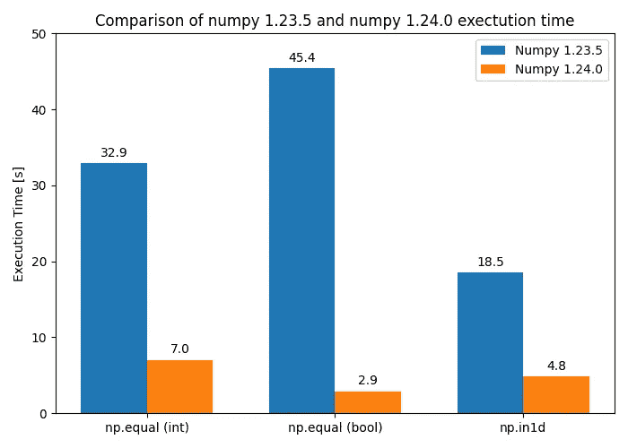

# 加速你的 Python 代码的简单方法 — 保持更新

> 原文：[`towardsdatascience.com/a-simple-way-to-speed-up-your-python-code-stay-up-to-date-e633b73619f9`](https://towardsdatascience.com/a-simple-way-to-speed-up-your_python_code-stay-up-to-date-e633b73619f9)

## 优化

## 仅通过更新库即可提高最多 15 倍的速度

[](https://medium.com/@maclayton?source=post_page-----e633b73619f9--------------------------------)[](https://towardsdatascience.com/?source=post_page-----e633b73619f9--------------------------------) [Mike Clayton](https://medium.com/@maclayton?source=post_page-----e633b73619f9--------------------------------)

·发表于 [Towards Data Science](https://towardsdatascience.com/?source=post_page-----e633b73619f9--------------------------------) ·阅读时长 13 分钟·2023 年 1 月 10 日

--


图片由 [Gerd Altmann](https://pixabay.com/users/geralt-9301/?utm_source=link-attribution&amp%3Butm_medium=referral&amp%3Butm_campaign=image&amp%3Butm_content=1672346) 提供，来自 [Pixabay](https://pixabay.com//?utm_source=link-attribution&amp%3Butm_medium=referral&amp%3Butm_campaign=image&amp%3Butm_content=1672346)

**很多时间和金钱都花在尝试优化代码，以便其尽可能快速和高效，在数据科学领域，这一点变得更加重要，因为现在需要处理的数据集非常庞大。**

**一个简单且经常被忽视的代码优化方法是确保你选择的编程语言及相关库尽可能地保持最新。**

**你可能会惊讶于相对较少的时间和精力，可以带来一些显著的好处。**

# 介绍

说保持更新可以帮助“优化”代码是一种相当显而易见的说法，但盲目更新软件或库而不了解其变化，可能会引发灾难。

在阅读完本文后，你应该对为什么应该保持更新有一个清晰的了解。你将会有一个切实可行的计划，确保在优化与不浪费宝贵时间之间找到平衡。此外，你还将了解可能出现的陷阱以及如何避免它们。

总结一下，使用最新版本的 NumPy（1.24.0）来展示保持软件和库最新的实际好处。

# 为什么我应该保持更新？


图片来源：[Ann H](https://www.pexels.com/photo/why-text-on-a-pink-surface-11141733/) 来自 [Pexels](https://www.pexels.com/)

简单的答案是，你可以从以下项目中受益：

1.  崭新的功能

1.  优化

1.  错误修复

所有这些都是由了解软件的人员为你实现的，记住……

## 你不是软件开发专家

如果你是数据科学专业人士（或爱好者），我假设你是，那么你主要关注的是处理、操控和分析数据，以获得洞察和预测。

尽管你在软件开发和一般编码方面可能有一定的能力，但公平地说，这并不是你的专长。

因此，你依赖于高级直观语言（Python、R、Matlab 等）和大量库，这些库提供了与你的工作领域相关的各种功能和优化是完全合理的。让你可以专注于**你的**专业。

## 依赖专家，他们更懂

如果你能将优化融入你的代码中，那很好！但这不应是占用你时间的事。

事实证明，还有一大批其他专业人士，他们非常了解软件开发。他们努力确保你使用的语言和库得到优化，并不断改进。为你提供所需的准确工具，应用于你的工作中。

然而，为了利用这些优化，你需要留意，否则你可能会错过。

# 阅读发布说明，这很重要


图片来源：[Pixabay](https://www.pexels.com/photo/background-beverage-blank-brown-459458/)

语言及相关库的新版本以惊人的频率发布。然而，如果你不关注实际发生的变化，你可能会错过潜在的好处，或者引入错误/不合理的参数。

一个很好的例子是，NumPy 1.24.0 中对 NumPy `np.in1d` 函数的算法更新，这也被广泛使用的 `np.isin` 函数所利用。

> `np.in1d`（由 `np.isin` 使用）在传递两个整数数组时现在可以切换到更快的算法（速度提高超过 10 倍）。这通常会自动使用，但你可以使用 `kind="sort"` 或 `kind="table"` 分别强制使用旧的方法或新方法。
> 
> -[numpy.org](https://numpy.org/doc/stable/release/1.24.0-notes.html#faster-version-of-np-isin-and-np-in1d-for-integer-arrays)

## 错过收益

上述引文中需要注意的是，`kind="table"` “通常会自动使用”，这意味着**并非总是如此**。

> 你可能会错过 10 倍的速度提升

你可能会因为未满足开发者设定的自动使用新方法的要求，而错过 10 倍的速度提升：

> 如果为 None，将自动选择‘table’，如果所需的内存分配小于或等于*ar1*和*ar2*大小之和的 6 倍，否则将使用‘sort’。这样做是为了避免默认情况下使用大量内存，**尽管‘table’在大多数情况下可能更快**。
> 
> -[numpy.org](https://numpy.org/doc/stable/reference/generated/numpy.in1d.html)

如果你阅读了发行说明，那么只需在方法参数中添加`kind=”table”`，就是确保执行速度显著提升的简单更改，无论内存分配如何。

***注意：*** *这种自动选择可能是为了确保新方法不会在你的代码中引发错误。在某些情况下，它可能比以前的方法使用更多的内存，这在内存受限的环境中可能是一个问题。开发人员对边界情况的覆盖非常明智。*

## 引入错误或混乱的代码

如果你没有设置新参数（因为你没有阅读发行说明），那么开发人员非常明智地设置了一个默认值。

> 如果为 None，将自动选择‘table’，如果所需的内存分配小于或等于*ar1*和*ar2*大小之和的 6 倍。
> 
> -[numpy.org](https://numpy.org/doc/stable/reference/generated/numpy.in1d.html)

很好！这样你可能会自动获得 10 倍的加速。然而：

> 如果选择了‘table’，*assume_unique* 将没有效果。
> 
> [-numpy.org](https://numpy.org/doc/stable/reference/generated/numpy.in1d.html)

在这种情况下，“assume_unique”没有效果是一个小问题，因为开发人员似乎已经考虑了边界情况，以确保如果你之前分配了“assume_unique”，它将被忽略。

然而，这很混乱，因为你的代码指定了一个不相关的参数，这可能会在未来导致其他人（甚至你自己）感到困惑。

还值得注意的是，可能存在开发人员不够彻底的情况，或无法避免的破坏性更改。如果发生这种情况，你将突然遇到无法运行的代码。

## 新方法

除了可能错过你已经在代码中使用的方法的改进之外，你还可能错过对你的项目或工作流程可能有用的全新方法。

在上一篇关于一热编码数据的文章中，我提到了最近发布的 Pandas 1.5.0 中实现的一种新方法，即`[from_dummies()](https://pandas.pydata.org/docs/reference/api/pandas.from_dummies.html)`，它是 Pandas 常用的一热编码方法`[get_dummies()](https://pandas.pydata.org/docs/reference/api/pandas.get_dummies.html#pandas.get_dummies)`的反向操作：

[](/the-best-methods-for-one-hot-encoding-your-data-c29c78a153fd?source=post_page-----e633b73619f9--------------------------------) ## 一热编码数据的最佳方法

### OneHotEncoder vs get_dummies vs to_categorical

[towardsdatascience.com

在这种方法发布之前，反向一热编码将是一项手动操作。

在你使用的库中创建了大量的新方法，但了解它们何时出现的唯一方法是查看发布说明。

> 无论开发人员实施了什么方法，都将得到优化，并且减少错误的可能性

…并且记住，*很可能*开发人员实施的任何方法都会比你自己编写的代码经过优化，并且不容易出现错误。他们毕竟是专业的软件开发人员，编写无错误且经过良好测试的代码并非易事。

# 保持更新的策略


图片由 [Patrick Perkins](https://unsplash.com/@patrickperkins?utm_source=unsplash&utm_medium=referral&utm_content=creditCopyText) 拍摄，刊登在 [Unsplash](https://unsplash.com/photos/ETRPjvb0KM0?utm_source=unsplash&utm_medium=referral&utm_content=creditCopyText)

时间就是金钱，正如那句名言所说。

现实情况是，典型项目可能包含大量的库，因此不切实际逐一阅读每个库每次小更新的发布说明，所以明智的做法是优先排序。

## 关于特定发布点的更新

常见的编号惯例包括由点分隔的三个数字。例如，目前的 NumPy 发布版本是 1.24.0。

了解这些数字（一般而言）表示的含义可以帮助规划何时需要关注：

+   **主版本号** (**1**.24.0)：软件或库的重大和显著变化。**可能包括不向后兼容的更改。** 这需要在升级前仔细审查。

+   **次版本号** (1.**24**.0)：通常是小功能变化/改动或更大范围的错误修复。

+   **修补版本号** (1.24.**0**)：通常是较小范围的错误修复。

如果主版本号发生变化，则**绝对必要**查看发布说明，因为可能会有破坏性更改（即在某些情况下你的代码可能会完全停止工作）。

次版本号的变化是你应该关注的内容，因为它在潜在收益、新方法或改进方法方面是最优的。

如果没有时间，通常可以忽略修补版本号，除非你在等待已知错误的修复。

## 选择最重要的库

如果时间紧迫，你应该选择使用最频繁或对项目最相关的库（即那些影响最大的库），并在更新到来时跟上任何相关变化。正如前一节所述，这主要涉及关注主版本号和次版本号的变化。

并不是每个补丁版本发布时都必须更新库，但跟踪发布的更改会给你提供在对项目有利时更新的机会。

实际上，更新越小，发生错误时确定错误的难度越小，减少缓解所需的时间，并降低风险。

## 更新策略 - 总结

1.  关注**所有**库的主要版本号更改。

1.  关注最常用或对项目最相关的库的次要版本号更改。

1.  补丁版本号更改通常可以忽略，除非你在积极等待修复某个错误。

# 升级的潜在危险


照片由 [Raúl Nájera](https://unsplash.com/@reinf?utm_source=unsplash&utm_medium=referral&utm_content=creditCopyText) 拍摄，来自 [Unsplash](https://unsplash.com/photos/MggK54YixfU?utm_source=unsplash&utm_medium=referral&utm_content=creditCopyText)

如前所述，保持更新可以带来实际的好处，但也可能导致不必要的问题和因调试新错误而浪费的时间。

再次提醒，通过关注发布说明，大多数情况下可以避免这些问题。

我将参考 NumPy 1.24.0 版本的发布说明作为预期内容的示例。它布局清晰，信息丰富（并非所有库/软件都是如此）：

[## 发布说明 - NumPy v1.24 手册

### 编辑描述

[numpy.org](https://numpy.org/doc/stable/release.html?source=post_page-----e633b73619f9--------------------------------)

你将面临的主要问题通常是由于以下原因之一。

## 弃用 / 已过期的弃用

这可能是最需要关注的事项。当方法被弃用时，它最终会被移除（时间尺度各不相同）。这非常好，因为假设你知道弃用的情况，它会给你时间实施解决方法，或切换到库中的更新方法。

然而，如果你查看发布说明并注意到你的某个方法被列为过期弃用，则在升级之前需要立即修复，否则你的代码将会停止工作。

## 兼容性说明 / 更改

这比弃用要轻微，但可能很棘手，因为它们可能会改变函数的行为和/或输出。如果你没有意识到这一点，可能不会立即注意到。

> **array.fill(scalar) 的行为可能略有不同**
> 
> 由于逻辑与项分配对齐，`numpy.ndarray.fill` 在某些情况下现在可能会略有不同。
> 
> 之前的类型转换在使用无法在目标`dtype`中表示的值或目标具有`object` dtype 时，可能会产生略微不同的结果。
> 
> -[numpy.org](https://numpy.org/doc/stable/release/1.24.0-notes.html#array-fill-scalar-may-behave-slightly-different)

“可能会稍有不同”这句话确实很模糊！如果这与你的代码相关，这可能会导致“有趣”的错误。如果你有非常敏感的实现使用了这个函数，值得关注一下上述情况。

# 如果我不能升级怎么办？


图片来自 [Towfiqu barbhuiya](https://www.pexels.com/photo/possible-written-on-a-chalkboard-9755375/) 的 [Pexels](https://www.pexels.com/)

在工业界，现实是你可能会面临超出你控制范围的升级过程限制。这可能是由于选择的基础操作系统/容器，或由于你正在处理的项目中的其他领域的限制，需要非常特定的版本。

> 记住，没有可靠的信息，无法做出决策。

然而，仍然值得跟进关键包和库的发展。如果没有其他，至少这是一种推动可能相当复杂和/或昂贵的升级过程实施的 ammunition，因为好处可能超过升级成本。记住，没有可靠的信息，无法做出真正的决策。

# 保持最新的好处的一个具体例子


图片来自 [Rodolfo Quirós](https://www.pexels.com/photo/selective-focus-photography-cement-2219024/) 的 [Pexels](https://www.pexels.com/)

最近，NumPy 的小版本号从 1.23.5 更改为 1.24.0。正如本文早些时候解释的那样，小版本号的更改可能会导致“轻微功能变化”，而不仅仅是补丁更新所带来的简单错误修复。

几个这些“小功能变化”声称会使其原始函数的版本显著加快：

***np.in1d***

> `np.in1d`（由 `np.isin` 使用）现在可以切换到更快的算法（速度提升超过 10 倍）
> 
> [-numpy.org](https://numpy.org/doc/stable/release/1.24.0-notes.html#faster-version-of-np-isin-and-np-in1d-for-integer-arrays)

***NumPy 比较函数***

> 比较函数（`numpy.equal`、`numpy.not_equal`、`numpy.less`、`numpy.less_equal`、`numpy.greater` 和 `numpy.greater_equal`）现在更快了，因为它们已经用通用内部函数进行了向量化。对于具有 SIMD 扩展 AVX512BW 的 CPU，整数、浮点和布尔数据类型的性能提升分别达到 2.57 倍、1.65 倍和 19.15 倍（以 N=50000 为例）。
> 
> -[numpy.org](https://numpy.org/doc/stable/release/1.24.0-notes.html#faster-version-of-np-isin-and-np-in1d-for-integer-arrays)

## 测试声明

尽管我没有理由怀疑这些数据，但我认为实际测试一下可能会很有趣，因此接下来的部分将对旧版本和新版本进行基准测试，以查看实际世界中的速度提升。

## 笔记本

以下所有代码都可以在 jupyter 笔记本中找到。

本节详细说明了笔记本的位置，以及在线环境（如 [Colab](https://colab.research.google.com/) 和 [Deepnote](https://deepnote.com/)）的环境设置要求。

原始笔记本可以在这里找到，适用于本地环境：

[](https://github.com/thetestspecimen/notebooks/tree/main/python-libraries-update?source=post_page-----e633b73619f9--------------------------------) [## notebooks/python-libraries-update at main · thetestspecimen/notebooks

### 你现在无法执行该操作。你在另一个标签或窗口中登录。你在另一个标签中注销了…

github.com](https://github.com/thetestspecimen/notebooks/tree/main/python-libraries-update?source=post_page-----e633b73619f9--------------------------------)

…或在 Deepnote 或 Colab 中快速启动。

Python 1.24.0:


Python 1.23.5:


## 环境设置 — 本地或 Deepnote

无论是使用本地环境还是 Deepnote，只需确保安装了适当版本的 NumPy。实现这一点的最简单方法是将其添加到你的“requirements.txt”文件中。

对于 Deepnote，你可以在右侧窗格的文件部分创建一个名为“requirements.txt”的文件，并添加以下行：

```py
numpy==1.24.0
```

（根据需要更改版本号）。

## 环境设置 — Colab

由于 Colab 中无法访问类似“requirements.txt”文件的内容，你需要显式地安装正确版本的 NumPy。为此，请在空白单元格中运行以下代码以安装适当版本：

```py
!pip install numpy==1.24.0
```

（根据需要更改版本号）。

然后在尝试运行任何代码之前刷新网页。

## 测试

进行以下速度测试，以概述在使用最新 NumPy 版本（1.24.0）与之前版本（1.23.5）时对 `np.in1d` 和 `np.equal` 方法的改进：

1.  使用 `np.equal` 方法创建两个长度为 50000 的整数数组（方法运行 100 万次） — **根据文档，numpy 1.24.0 速度应提升至 2.75 倍**

1.  使用 `np.equal` 方法创建两个长度为 50000 的布尔数组（方法运行 100 万次） — **根据文档，numpy 1.24.0 速度应提升至 19.15 倍**

1.  使用`np.in1d`和`kind="sort"`比较两个整数数组（方法运行了 1 万次）——该方法在 numpy 1.23.5 和 1.24.0 中均可用——**在 numpy 1.23.5 和 1.24.0 中速度应该相同（这是一个很好的交叉检查，可以确保其他测试的结果可以直接比较）**

1.  使用新`kind="table"`方法比较两个整数数组（方法运行了 1 万次）——该方法仅在 numpy 1.24.0 中可用——**根据文档，速度应该比“sort”方法快最多 10 倍**

***输入数据***

***时间测试设置***

## 结果 —— NumPy 1.23.5

## 结果——NumPy 1.24.0

## 总结



结果比较 —— 作者提供的图片

从结果部分可以看出，所获得的结果大致符合预期，所有方法都实现了执行速度的提升：

1.  使用方法`np.equal`的两个整数数组 —— 使用 numpy 1.24.0 时**快 4.67 倍**

1.  使用方法`np.equal`的两个布尔数组 —— 使用 numpy 1.24.0 时**快 15.56 倍**

1.  使用`np.in1d`和`kind="sort"`方法比较两个整数数组 —— 使用 numpy 1.23.5 和 1.24.0 的执行时间**基本相同**（10,000 次迭代需要 18.5 秒）

1.  使用新`kind="table"`方法比较两个整数数组 —— 使用 numpy 1.24.0 和新引入的`kind="table"`方法**快 3.84 倍**

# 结论

软件开发者不断改进我们日常使用的语言和库的努力不应被忽视。这是提高项目代码效率、速度和可靠性的最简单、最直接的方法之一。

从本文中列出的非常小的示例可以看出，收益可能非常显著。只需要一点组织，并愿意花时间审阅你最重要的库/软件的版本说明。

如果你觉得这篇文章有趣或有用，请记得关注我，或[订阅我的新闻通讯](https://medium.com/@maclayton/subscribe)以获取更多类似内容。

如果你还没有，考虑[订阅 Medium](https://medium.com/@maclayton/membership)。你的会员费不仅直接支持我，还支持你阅读的其他作者。你还将获得对 Medium 上所有故事的全面无限制访问。

使用我的推荐链接注册将会让我获得少量佣金，不会对你的会员资格产生任何影响，因此如果你选择这样做，我会很感激。

[## 通过我的推荐链接加入 Medium - Mike Clayton](https://medium.com/@maclayton/membership?source=post_page-----e633b73619f9--------------------------------)

### 阅读 Mike Clayton 的每一篇故事（以及 Medium 上的其他成千上万位作者的故事）。你的会员费直接支持…

[medium.com](https://medium.com/@maclayton/membership?source=post_page-----e633b73619f9--------------------------------)
