# 准确检测峰值和谷值的逐步指南。

> 原文：[`towardsdatascience.com/a-step-by-step-guide-to-accurately-detect-peaks-and-valleys-9abc49a2eac3`](https://towardsdatascience.com/a-step-by-step-guide-to-accurately-detect-peaks-and-valleys-9abc49a2eac3)

## 峰值检测是许多应用中的一个挑战步骤。阅读并了解如何在 1D 向量和 2D 数组（图像）中准确检测峰值和谷值。

[](https://erdogant.medium.com/?source=post_page-----9abc49a2eac3--------------------------------)[](https://towardsdatascience.com/?source=post_page-----9abc49a2eac3--------------------------------) [Erdogan Taskesen](https://erdogant.medium.com/?source=post_page-----9abc49a2eac3--------------------------------)

·发表于 [Towards Data Science](https://towardsdatascience.com/?source=post_page-----9abc49a2eac3--------------------------------) ·13 分钟阅读·2023 年 9 月 25 日

--


照片由 [Willian Justen de Vasconcellos](https://unsplash.com/@willianjusten?utm_source=unsplash&utm_medium=referral&utm_content=creditCopyText) 提供，来源于 [Unsplash](https://unsplash.com/photos/GZLY-0kPG3M?utm_source=unsplash&utm_medium=referral&utm_content=creditCopyText)

我们的人脑在峰值检测方面相对于其上下文非常出色。眼睛看似简单的任务，对于机器来说却可能是一项具有挑战性的任务。一般来说，峰值和谷值表示（重要的）事件，例如价格/交易量的突然增加或减少，或需求的急剧上升。挑战之一是峰值/谷值的定义，这在不同的应用和领域中可能有所不同。其他挑战可能更具技术性，例如噪声信号可能导致许多误报，或单一阈值可能无法准确检测局部事件。*在本博客中，我将描述如何在不对峰值形状做假设的情况下准确检测一维向量或二维数组（图像）中的峰值和谷值。此外，我还将演示如何处理信号中的噪声。* 分析使用***findpeaks 库***进行，并提供了动手示例以供实验。

# 峰值和谷值简要介绍。

检测信号中的（突发）变化是许多应用中的重要任务，需要进行报告或监控。大致上有两种类型的“突发变化”，即所谓的*异常值*和*关注峰值*，这两者在概念上是不同的。*异常值是指显著偏离数据集中正常值的数据点，而关注峰值是信号中具有分析或领域相关性的特定数据点或区域。* 如果您需要深入了解并有实际示例的异常值检测，可以参考这些博客 [1, 2]。

[outlier-detection-using-principal-component-analysis-and-hotellings-t2-and-spe-dmodx-methods-625b3c90897?source=post_page-----9abc49a2eac3--------------------------------] ## 使用主成分分析和 Hotelling’s T2 及 SPE/DmodX 方法检测异常值

### 由于 PCA 的灵敏度，它可以用于检测多变量数据集中的异常值。

[towardsdatascience.com [outlier-detection-using-distribution-fitting-in-univariate-data-sets-ac8b7a14d40e?source=post_page-----9abc49a2eac3--------------------------------] ## 使用分布拟合在单变量数据集中检测异常值

### 了解如何使用概率密度函数检测异常值，以便快速轻量化模型并提供可解释性……

[towardsdatascience.com

## ***但什么是关注峰值？***

> 峰值是指大于其周围点的点或区域。这可以是局部最大值或全局最大值，也可以是重复的数据点，这些点不一定需要偏离正常或预期值。

这种定义的弹性使得峰值检测成为一项具有挑战性的任务。换句话说，*“峰值应该比其周围点高多少？”* 和 *“如何定义局部最大值？”* 这更加复杂的是，信号通常不免受到噪声的干扰。峰值检测有多种技术，包括简单的阈值设定，但也包括使用导数、小波分析和/或卷积。峰值检测方法的吸引力在于处理噪声的能力，并且不会对信号-峰值做出（过于强烈的）假设。推理是你需要检测局部最大值，这些最大值可能会根据应用和背景发生变化。例如，ECG 信号在形状和幅度上与服务器负载测量不同。一个知名的具有峰值检测功能的 Python 库是*S*ciPy 中的*find_peaks* *［3］*。然而，该函数不能对检测到的峰值进行排序或优先处理，也没有内置的噪声处理功能。*在接下来的部分中，我将演示如何检测峰值和谷值，处理信号噪声，测量峰值强度，并对结果进行排序。我将使用 findpeaks 库为 1D 向量和 2D 数组演示这一过程。*

# Findpeaks 库包含四种专门用于峰值检测的方法。

Findpeaks 库旨在检测 1 维向量和 2 维数组（图像）中的峰值和谷值，而不对峰值形状或基线噪声做出假设。该库实现了四种不同的方法用于峰值和谷值的检测与排序。每种方法都有其独特的优势，使其适用于特定应用。在下一部分中，我将通过实际的 Python 示例介绍每种方法。如果你想自己试验这些示例，请首先 pip 安装[*Findpeaks package*](https://erdogant.github.io/findpeaks)。

```py
pip install findpeaks
```

# 拓扑方法（1）。

拓扑方法是基于持久同源性的思想的高效解决方案*［4］*。该方法在函数值内部排序后以线性时间运行——实际上是一个单一循环。持久同源性的思想是直观的。在接下来的代码部分，我们将导入 Findpeaks 库并加载一个示例数据集：

```py
import matplotlib.pyplot as plt
# Import library
from findpeaks import findpeaks
# Initialize
fp = findpeaks(method='topology')
# Example 1d-vector
X = fp.import_example('1dpeaks')

# Plot
plt.figure(figsize=(15, 8), dpi=100)
plt.plot(X)
plt.grid(True)
plt.xlabel('Time')
plt.ylabel('Value')
```

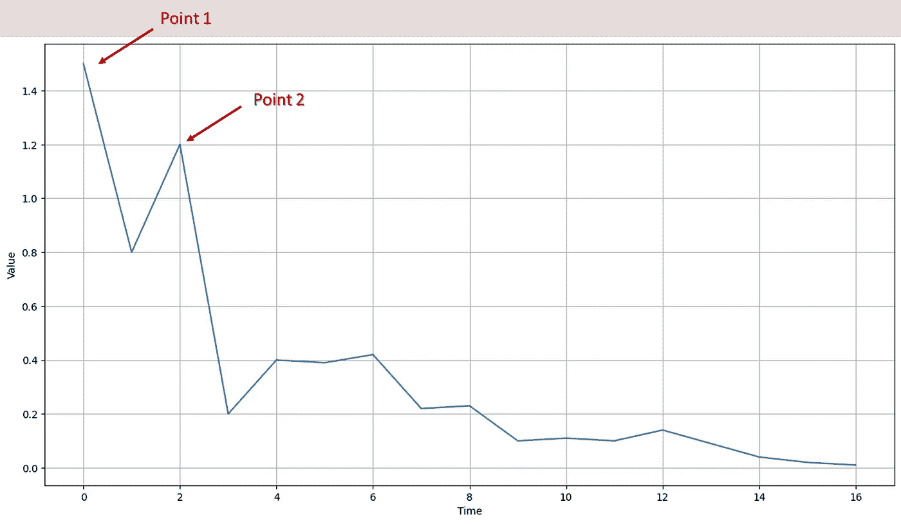

图 1：示例信号，包含一些局部峰值和谷值。（图像来自作者）

我们可以清楚地看到图 1 中最强（或最高）的峰是点 1，其次是点 2，等等。为了检测这些峰，我们可以考虑一个持续下降到更低水平的水位。在顶部（局部最大值）有一个岛屿的*诞生*。当水位降低时，两个岛屿可以合并。当较低的岛屿再次与较高的岛屿合并时，称为*死亡*。通过这种方式，每个候选峰可以用*诞生与死亡*点进行标注。候选峰可以绘制在所谓的***持久性图***中，如图 2 所示。

```py
# Fit topology method on the 1D vector
results = fp.fit(X)

# Plot the results
fp.plot_persistence(figsize=(25,8))
```

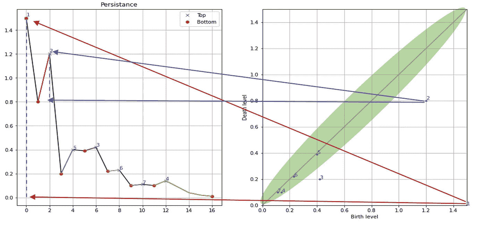

*图 2：持久性图的示例*，显示出生与死亡水平。（图片来源于作者）

右面板中的对角线（左下角到右上角）代表出生和死亡水平相同的点。换句话说，位于对角线上的点是平坦的信号或没有峰值或其他变化的水平线。***感兴趣的峰值应该位于对角线的右侧。***

让我们逐步分析图 2。对于第一个点（右下角），我们看到出生于`score=1.5`，死亡于`score=0`。对于第二个峰值，我们看到`score=1.2`，死亡水平为`score=0.8`（蓝色箭头）。这种方法将每个峰值相对量化，因此可以排除低持久性（即接近对角线）的峰值。感兴趣的峰值可以被排序/优先考虑并选择。此方法的优点在于它可以应用于 1D 向量和 2D 数组（图像）。另一个优点是它返回可解释的结果，错误的阳性结果可以通过在持久性评分上剪裁结果来移除。缺点是嘈杂的信号可能导致成千上万的结果，并可能变得计算密集。然而，我们可以通过排名轻松选择顶级结果。*我将在本博客的后续章节中演示这一点。*

# Mask 方法（2）。

Mask 方法接受一个 2D 数组（图像），并使用滑动的`8x8 窗口`通过局部最大值滤波器检测峰值。它比简单的阈值处理稍微复杂，因为阈值处理是在滑动窗口内使用局部最大值滤波器进行的。尽管这是一个直接的方法，但在背景稳定的情况下效果很好。其优点在于直观、可解释且计算速度快。缺点是可能需要密集的预处理步骤。然而，许多预处理步骤都由*Findpeaks 库*处理。在接下来的代码部分中，我们将加载一个示例图像，执行预处理，并检测峰值：

```py
# Import library
from findpeaks import findpeaks

# Initialize
fp = findpeaks(method='mask')

# Example 2d image
X = fp.import_example('2dpeaks')

# Plot RAW input image
plt.imshow(X)

# Fit using mask method
results = fp.fit(X)

# Plot the pre-processing steps
fp.plot_preprocessing()
```

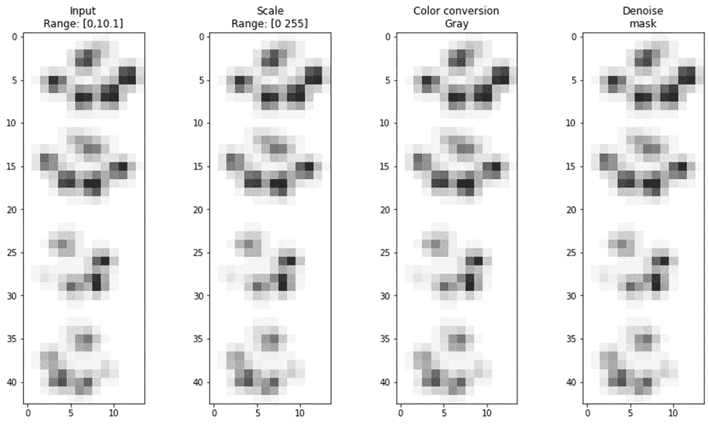

图 3。Mask 方法应用于具有自动预处理的图像。从左到右显示了输入图像到缩放、颜色转换和去噪。（图片来源于作者）

输出包括`Xraw`、`Xprocessed`和`Xdetect`，它们的尺寸与输入图像相同`NxM`。最终检测到的峰值存储在`Xdetect`中，可以使用`plot`功能进行绘制：

```py
# The output contains multiple variables
print(results.keys())
# dict_keys(['Xraw', 'Xproc', 'Xdetect'])

# Plot detected peaks
fp.plot()
```

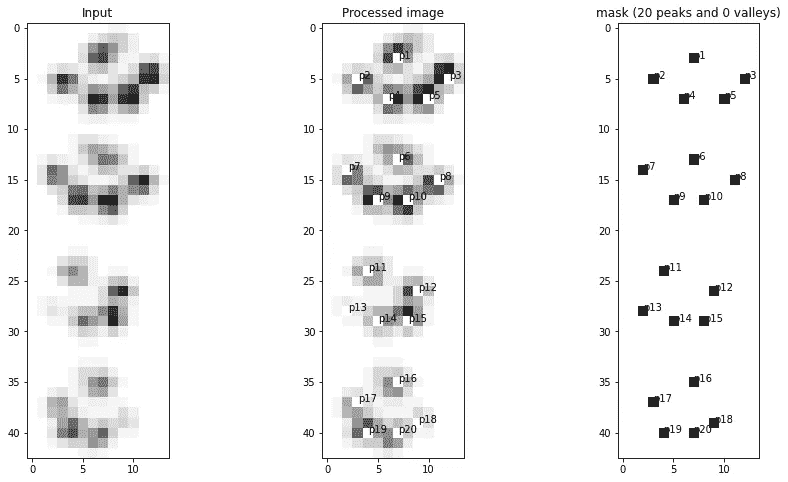

图 4。使用 Findpeaks 库中的 Mask 方法检测到的峰值。数字表示峰值的强度（图片来源于作者）

*Findpeaks 库* 还包含将 2D 图像转换为 3D 网格图的 `plot_mesh` 功能。这些视觉效果有助于更好地理解峰值的强度。例如，当我们查看图 4 时，可能很难看到哪些峰值最强，而图 5 中的网格图提供了更好的见解。

```py
# Create mesh plot from 2D image.
fp.plot_mesh()

# Rotate to make a top view
fp.plot_mesh(view=(90,0))
```

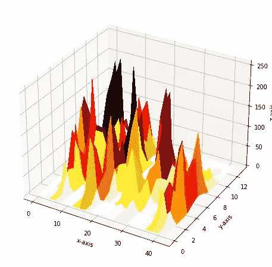

图 5\. 由 Findpeaks 生成的网格图。(图片来源：作者)。

# Peakdetect 方法 (3)。

*Findpeaks* 库中的第三种方法是 `peakdetect` 方法。该方法基于 *Billauer 的研究* [2, 3]，其优点在于能够在嘈杂信号中找到局部最大值和最小值。噪声非常常见，通常的解决方案是用某种低通滤波器来平滑曲线。然而，信号平滑的代价是原始信号中的峰值可能会丢失或被压制。此方法需要设置 `lookahead` 参数，该参数是从峰值候选点向前看的距离，以确定它是否为实际峰值。默认值设置为 200，但对于较小的数据集（即 <50 数据点）可调整。在接下来的代码部分，我们将创建一个包含 10,000 个数据点的一维向量，并检测峰值和谷值。我们可以使用绘图功能绘制检测到的峰值和谷值，如图 6 所示。首先，确切的峰值和谷值用交叉和点突出显示，而整个区域也被提取并用不同的颜色标记。

```py
# Import libraries
import numpy as np
from findpeaks import findpeaks

# Create example data set
i = 10000
xs = np.linspace(0,3.7*np.pi,i)
X = (0.3*np.sin(xs) + np.sin(1.3 * xs) + 0.9 * np.sin(4.2 * xs) + 0.06 * np.random.randn(i))

# Initialize
fp = findpeaks(method='peakdetect', lookahead=200, interpolate=None)
# Fit peakdetect method
results = fp.fit(X)
# Plot
fp.plot()
```

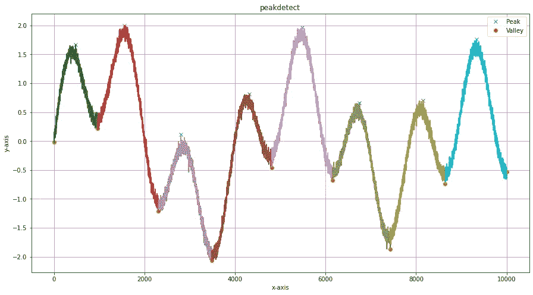

图 6\. 使用 Findpeaks 中的 peakdetect 方法检测峰值和谷值。(图片来源：作者)

# Caerus 方法 (4)。

Caerus 方法旨在检测一维信号中的峰值和谷值。它确定局部最小值和对应的局部最大值，而不受时间框架、尺度或趋势的影响。该方法基于前向滚动窗口，迭代评分成千上万的窗口。对于每个窗口，计算从起始到结束位置的百分比。生成的矩阵是 `windowxlength dataframe`，其中最高评分的百分比，即高于最低百分比的百分比，被使用。然后汇总评分最好的百分比。最终区域基于 *距离* 和 *百分比* 的起始位置变化确定。该方法在发现波动数据（如股市数据）中的峰值和谷值方面具有强大的优势。

要查看此方法的实际效果，我们需要设置最小百分比 `minperc` 参数和窗口大小。`minperc` 声明了一个起始位置，窗口用于确定从起始点开始的信号是否有百分比变化。使用较小的窗口大小（例如 50）可以检测局部最小值，而较大的窗口大小（例如 1000）将关注全局最小值。在以下代码部分中，我们将用 `caerus` 方法初始化，并检测至少有 5%变化的峰值。

```py
# Import library
from findpeaks import findpeaks

# Initialize findpeaks with cearus method.
# The default setting is that it only return peaks-vallyes with at least 5% difference.
fp = findpeaks(method='caerus', params={'minperc':5, 'window':50})

# Import example data
X = fp.import_example('facebook')

# Fit
results = fp.fit(X)

# Make the plot
fp.plot()
```

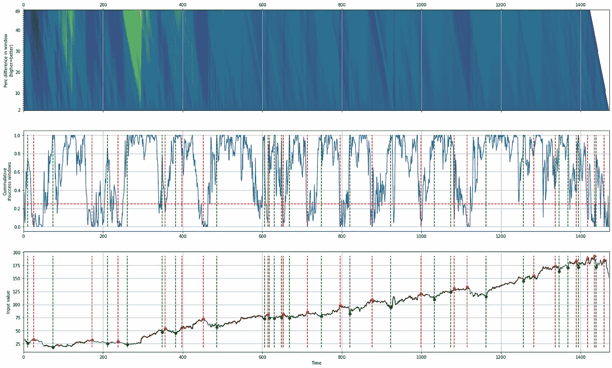

图 7\. Cearus 方法的结果。底部面板是股票数据，红色垂直线表示峰值，绿色垂直线表示谷值。中间面板是处理后的数据，显示了窗口内的累计成功次数。顶部面板是窗口中的百分比差异。（图片来自作者）

除了检测确切的峰值和谷值位置外，我们还可以标记整个区域，如下所示。标记的区域也直观地合理，因为它们正确标记了*随时间增长的区域*。

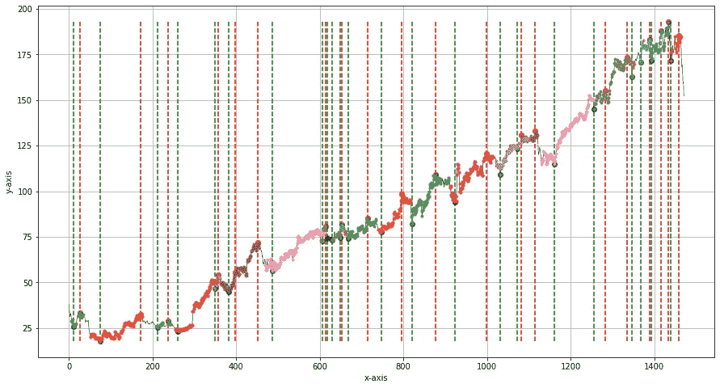

图 8\. Cearus 方法的结果。除了峰值和谷值（红色和绿色垂直线）外，还可以提取和标记区域。（图片来自作者）

# 预处理是一个重要的任务。

之前描述的每种峰值检测方法都有其自身的优缺点。一个重要的任务是对输入信号进行预处理，以防止检测到假阳性结果。现实世界的数据通常是不完整的、嘈杂的，并且需要归一化或缩放。*Findpeaks 库包含各种预处理功能，以帮助完成这些步骤，如去噪、插值、缩放、归一化和缩放。在下一节中，我们将深入了解可用的预处理功能，特别是针对 2D 数组的功能。*

# 图像预处理步骤。

findpeaks 库执行 4 个*预处理*步骤，这些步骤按照下面所示的特定顺序执行。每个步骤都可以通过设置输入参数来控制。最后一步后，应用峰值检测方法。

1.  ***图像缩放*** 可以帮助提高峰值检测的效果，并显著减少计算时间。

1.  ***缩放像素值*** 在[0-255]之间是使图像可比和峰值检测更稳健的重要步骤。

1.  ***转换为灰度*** 减少了计算负担，并使图像具有可比性。当图像是 RGB 颜色时，它将被转换为 2D 数组。

1.  ***噪声过滤*** 是一个关键步骤。有关更多细节，请参见下一节。

## 峰值检测前的噪声去除。

噪声是不受欢迎的附加到输入信号上的成分，通常是测量信号的干扰。噪声遵循特定分布，并且通常依赖于应用（图 9）。换句话说，为某些应用有效去除/过滤噪声可能需要不同的技术。下图展示了不同类型的噪声及其分布。例如，去除盐和胡椒噪声的方法与去除高斯噪声的方法不同。

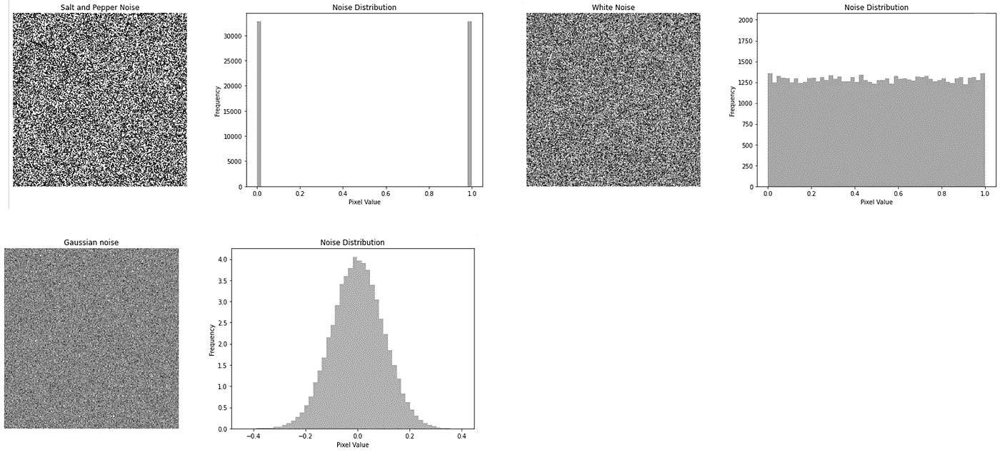

图 9\. 三种不同类型的噪声及其分布。（图像来自作者）

一个明显的例子是处理来自 Sentinel-1 卫星的 SAR 图像。这些图像已知会受到斑点噪声的影响，从而降低图像质量。它是由多个分布目标的回波波动造成的，局部强度高，并增加了局部区域的平均灰度级。*Findpeaks 库包含各种噪声去除滤波器：*

+   ***fastnl***

+   ***双边***

+   ***李***

+   ***李增强***

+   ***李 Sigma***

+   ***宽***

+   ***霜冻***

+   ***中值滤波***

+   ***均值滤波器***

所有滤波器在特定条件下都可以去除或过滤噪声，目的是保留原始信号不变。例如，`双边滤波器`使用高斯滤波器来保持边缘。`Lee Sigma`和`fastnl`滤波器非常适合去除 SAR 图像中的斑点噪声。我们将加载一个带有斑点噪声的示例图像，并直观检查噪声过滤和峰值检测的性能。为了演示，我们将首先在不进行噪声过滤预处理的情况下执行峰值检测，如下一个代码段、图 10 和图 11 所示。

```py
# Import library
from findpeaks import findpeaks
# Initializatie
fp = findpeaks(scale=None, denoise=None, togray=True, imsize=(300, 300))
# Import image example
img = fp.import_example('2dpeaks_image')
# Fit
fp.fit(img)
# Tens of thousands of peaks are detected at this point.
fp.plot()
fp.plot_mesh()
```

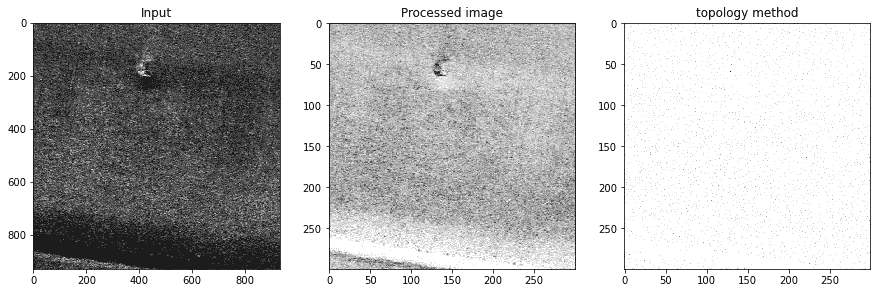

图 10\. 左侧面板展示了原始输入图像。中间面板展示了灰度化后的图像。右侧面板展示了检测到的峰值。检测到了成千上万的假阳性结果。（图像来自作者）

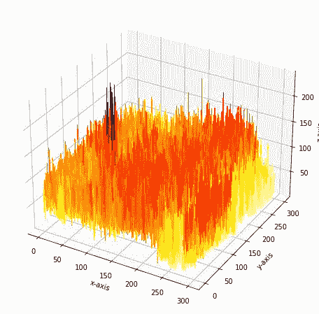

图 11\. 网格图可以帮助直观地查看噪声水平与感兴趣信号的比较。我们可以看到峰值（左中），但很难将其与噪声区分开来。（图像来自作者）

从此时起，我们将通过`缩放`像素值、执行`灰度化`转换和`fastnl`噪声过滤来*预处理*图像。下图展示了预处理的步骤。最后一步是用于峰值检测的*拓扑*方法。

```py
# Import library
from findpeaks import findpeaks
# Initializatie
fp = findpeaks(method='topology',
               togray=True,
               imsize=(300, 300),
               scale=True,
               denoise='fastnl',
               params={'window': 31})

# Import image example
img = fp.import_example('2dpeaks_image')

# Fit
fp.fit(img)

# Plot
fp.plot_preprocessing()

[findpeaks] >Import [.\findpeaks\data\2dpeaks_image.png]
[findpeaks] >Finding peaks in 2d-array using topology method..
[findpeaks] >Resizing image to (300, 300).
[findpeaks] >Scaling image between [0-255] and to uint8
[findpeaks] >Conversion to gray image.
[findpeaks] >Denoising with [fastnl], window: [31].
[findpeaks] >Detect peaks using topology method with limit at None.
[findpeaks] >Fin. 
```

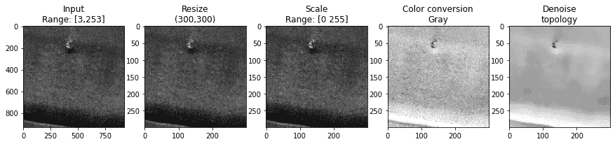

图 12\. 从原始输入图像（左侧面板）到预处理和去噪图像（右侧面板）。（图像来自作者）

如图 12 所示，最终的去噪图像清晰地去除了斑点噪声。但它是否足够好以检测正确的峰值？在下一步中，我们可以检查检测到的峰值（见下文）。现在我们可以绘制图像，并叠加上检测到的峰值，如图 13 所示。我们可以清楚地看到正确的区域被检测到。通过网格图，我们可以更好地直观感受感兴趣的峰值（图 14）。

```py
# Plot the top 15 peaks that are detected and examine the scores
fp.results['persistence'][1:5]

#      x    y  birth_level  death_level  score  peak  valley
# 2  131   52        166.0        103.0   63.0  True   False
# 3  132   61        223.0        167.0   56.0  True   False
# 4  129   60        217.0        194.0   23.0  True   False
# 5   40  288        113.0         92.0   21.0  True   False
# 6   45  200        104.0         87.0   17.0  True   False
# 7   87  293        112.0         97.0   15.0  True   False
# 8  165  110         93.0         78.0   15.0  True   False
# 9  140   45        121.0        107.0   14.0  True   False

# Take the minimum score for the top peaks off the diagonal.
limit = fp.results['persistence'][0:5]['score'].min()

# Plot
fp.plot(limit=limit)

# Mesh plot
fp.plot_mesh()
```

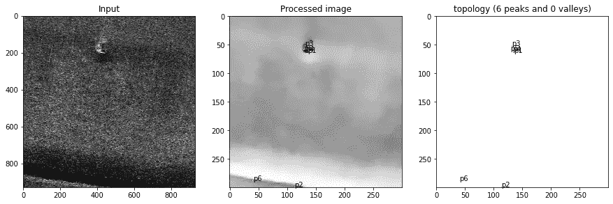

图 13\. 顶部的 5 个峰值被突出显示，并正确地检测为感兴趣的峰值。 （图像来自作者）

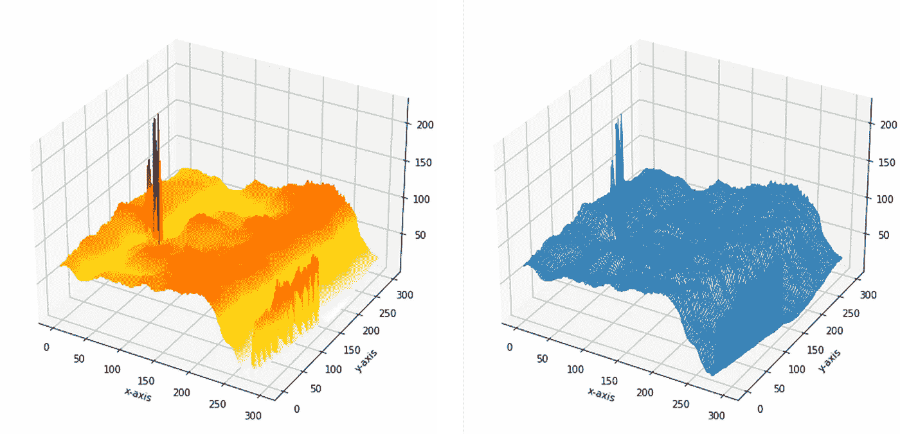

图 14\. 预处理步骤以及去噪结果清晰地减少了噪声，并保持了感兴趣的信号完整。 （图像来自作者）

# 结语。

我探讨了 1D 向量和 2D 数组（图像）的峰值检测概念。使用 ***Findpeaks 库***，可以轻松地使用四种不同的方法检测峰值和谷值。它将插值、归一化、缩放、噪声过滤以及峰值和谷值的检测过程进行了流水线处理。输出是一个包含候选峰值和谷值及其位置和类别标签的数据框。结果可以通过各种绘图功能进行探索。

*保持安全，保持警觉。*

干杯，E。

*如果你觉得这篇文章对你有帮助，欢迎* [*关注我*](http://erdogant.medium.com/)*。如果你考虑购买 Medium 会员，可以通过使用我的* [*推荐链接*](https://medium.com/@erdogant/membership)*来支持我的工作。这与购买一杯咖啡的价格相同，但允许你每月阅读无限的文章。*

# 软件

+   [Findpeaks Github/Documentation](https://erdogant.github.io/findpeaks/)

# 让我们联系吧！

+   [在 LinkedIn 上与我联系](https://www.linkedin.com/in/erdogant/)

+   [在 Github 上关注我](https://github.com/erdogant)

+   [在 Medium 上关注我](https://erdogant.medium.com/)

# 参考文献

1.  E. Taskesen, *使用主成分分析和 Hotelling 的 T2 以及 SPE/DmodX 方法进行异常值检测*, Medium

1.  E. Taskesen, *使用分布拟合进行单变量数据集的异常值检测**,* Medium

1.  [*根据峰值属性在信号中查找峰值*](https://docs.scipy.org/doc/scipy/reference/generated/scipy.signal.find_peaks.html), Scipy.

1.  *H. Edelsbrunner 和 J. Harer，《计算拓扑学：入门》，2010 年，ISBN 0–8218–4925–5。*
