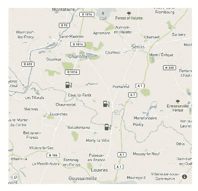

# 开发基于地图的应用程序的逐步指南（第一部分）

> 原文：[`towardsdatascience.com/a-step-by-step-guide-to-develop-a-map-based-application-part-i-757766b04f77`](https://towardsdatascience.com/a-step-by-step-guide-to-develop-a-map-based-application-part-i-757766b04f77)

## 概念验证 — 构建一个极简的演示

[](https://medium.com/@jacky.kaub?source=post_page-----757766b04f77--------------------------------)[](https://towardsdatascience.com/?source=post_page-----757766b04f77--------------------------------) [Jacky Kaub](https://medium.com/@jacky.kaub?source=post_page-----757766b04f77--------------------------------)

·发表于 [Towards Data Science](https://towardsdatascience.com/?source=post_page-----757766b04f77--------------------------------) ·19 分钟阅读·2023 年 1 月 24 日

--


图片来源于 [GeoJango Maps](https://unsplash.com/@geojango_maps?utm_source=medium&utm_medium=referral) 在 [Unsplash](https://unsplash.com/?utm_source=medium&utm_medium=referral)

地图是可视化和理解地理数据的强大工具，但需要特定的技能来有效设计。

在本步骤指南中，我们将深入探讨如何构建一个基于地图的应用程序，展示客户周围加油站的价格。我们将涵盖从原始概念验证（POC）到最小可行产品（MVP）的不同关键步骤。

## 系列文章：

第一部分：概念验证 — 构建一个极简的演示

第二部分：如何使用 React 构建网页应用（静态布局）

第三部分：使用 React 为你的网页应用添加互动性

[第四部分：使用 PostgreSQL、FastAPI 和 Docker 构建后端](https://medium.com/towards-data-science/build-a-back-end-with-postgresql-fastapi-and-docker-7ebfe59e4f06)

## 本文涵盖内容

在本系列的第一篇文章中，我们正在准备我们的应用程序的概念验证。

我们刚刚有了一个想法，希望将其转化为有价值的东西，但我们还不知道这是否可行。我们需要寻找数据，评估其相关性，并构建一些基本内容，以展示原始想法是否可行。

此外，更重要的是，我们需要向决策者（可能不是技术人员）展示项目的价值。


从概念验证到最小可行产品，作者插图

特别地，由于该项目的特殊性，我们将在本文中讨论以下主题：

+   如何将 .xml 文件解析为表格数据

+   根据点之间的距离筛选和组合 DataFrames

+   使用 Plotly 构建基础地图

+   使用 ipywidgets 为地图添加交互功能

在文章结束时，我们将拥有一个互动地图，可以在决定进一步产品开发之前用于 POC 演示。


POC 阶段结束时的产品示例，作者插图

本次 POC 的完整代码可以在[我的 GitHub](https://github.com/jkaub/fuel-station-viewer-poc)上找到。

## 关于应用的一些背景

在当前经济形势下，我们观察到加油站的油价波动剧烈。我们还看到——至少在我来自法国的地方——因罢工和一些恶意的加油站老板趁机抬高价格而导致的短缺。考虑到这一点，加油站的价格对许多需要加油的人来说可能成为一个重要的标准。

好消息是：在法国，通过实施的开放数据政策，可以实时访问加油站价格。原始格式的数据对许多人来说没有直接的价值，因为难以立即理解。相反，需要通过适当的用户界面将其展示，以便信息能够迅速过滤和理解。

我们将构建这个用户界面：一个网页应用程序，允许用户检索周围加油站的油价。我这里专注于法国市场（因为数据公开且易于访问），但我们的工作可以轻松适用于全球其他地方的数据。

## 关于使用的数据集的简要说明

在其开放数据政策中，法国维护了许多免费访问的数据集。特别地，我们将使用[法国燃油价格——即时流数据集](https://www.data.gouv.fr/fr/datasets/prix-des-carburants-en-france-flux-instantane/)，其使用遵循[*开放许可证 V2*](https://www.etalab.gouv.fr/wp-content/uploads/2018/11/open-licence.pdf)，并可以用于商业目的。

我们还将使用[市镇行政区划 API](https://geo.api.gouv.fr/decoupage-administratif/communes)来获取与城市相关的信息，该 API 也遵循[*开放许可证 V2*](https://www.etalab.gouv.fr/wp-content/uploads/2018/11/open-licence.pdf)*。*

# 访问数据

我们的冒险从这里开始：在开放数据的丛林中，我们发现了这个有趣的燃油价格数据集。我们还不知道它的具体内容和包含的数据。

如下所示，有多个文件可以下载：


包含数据集的页面的翻译版本，作者插图

这里需要避免的第一个错误是让我们的项目充满过多的数据：并不是因为数据是可用的，我们就需要它。

在这里，我们通常只想展示“即时”价格的可能性给用户，并不打算进行历史价格分析。因此，探索历史数据至少在现在看来是浪费时间，我们将专注于即时数据集。

*时间是宝贵的资源，许多想法永远不会变成实际的产品。重要的是要高效，并确保我们只关注我们想展示的概念。*

根据文档，数据集包含诸如地址、邮政编码、坐标和价格等信息，还有其他对 POC 不太有用的信息（如提供的其他服务）。

## 数据提取

可以通过下载链接获取即时数据源，该链接会下载一个包含本地计算机文件的 zip 文件。

[`donnees.roulez-eco.fr/opendata/instantane`](https://donnees.roulez-eco.fr/opendata/instantane)

这很好，但即使我们处于 POC 阶段，我们也需要预见项目中可能出现的一些“致命”约束。特别是这里，假设我们每天至少更新一次数据，我们不希望手动更新，并且需要评估一种自动访问数据的方法。

希望我们可以直接在 Python 中加载 zip，结合 **urllib** 和 **zipfile** 库直接从 URL 对 .zip 文件进行操作。

```py
def load_from_url_in_memory(url):
    '''This function load the xml file from the url in memory after unziping it
       It assume only one file with a .xml extention is available in the zip
    '''

    with urllib.request.urlopen(url) as url:
        s = io.BytesIO(url.read())
        z = zipfile.ZipFile(s)

    return z
```

## 探索 .xml 文件

XML 是一种常用于数据存储和数据交换的标记语言。即使像 JSON 这样的新格式越来越受欢迎，XML 在许多应用和行业中仍然被广泛使用，了解它的工作原理仍然是有意义的。

.xml 文件形成树状结构，从“根”开始，分支到子元素。每个元素都有自己的属性和可能的子元素。

让我们通过在一个简单的文本编辑器中打开文件来查看它。

文件的第一行提供了一些元数据，例如使用的编码：

```py
<?xml version="1.0" encoding="ISO-8859-1" standalone="yes"?>
```

这里提到，要读取文件，我们需要使用 ISO-8859–1 编码，这在我们解析文件时会很有用。

.xml 文件由多个具有不同深度的元素组成：

```py
<pdv_liste>
  <pdv id="40140005" latitude="4374653.865" longitude="-132117.12497344" cp="40140" pop="R">
    <adresse>9 AVENUE DE CRAMAT</adresse>
    <ville>SOUSTONS</ville>
    <horaires automate-24-24="1">
      <jour id="1" nom="Lundi" ferme=""/>
      <jour id="2" nom="Mardi" ferme=""/>
      <jour id="3" nom="Mercredi" ferme=""/>
      <jour id="4" nom="Jeudi" ferme=""/>
      <jour id="5" nom="Vendredi" ferme=""/>
      <jour id="6" nom="Samedi" ferme=""/>
      <jour id="7" nom="Dimanche" ferme=""/>
    </horaires>
    <services>
      <service>Laverie</service>
      <service>Station de gonflage</service>
      <service>Automate CB 24/24</service>
    </services>
    <prix nom="Gazole" id="1" maj="2023-01-18 07:27:47" valeur="1.891"/>
    <prix nom="E85" id="3" maj="2023-01-14 08:15:44" valeur="1.059"/>
    <prix nom="E10" id="5" maj="2023-01-18 07:27:47" valeur="1.839"/>
  </pdv>
  <pdv>
    ...
  </pdv>
</pdv_liste> 
```

这里的 pdv 元素代表我们的加油站。在标签内部，有多个参数，这些是元素的属性（id、纬度、经度、邮政编码……）

```py
<pdv id="40140005" latitude="4374653.865" longitude="-132117.12497344" cp="40140" pop="R">
```

每个 pdv 也有多个子元素：

+   adresse: 车站的地址

+   ville: 车站所在的城市

+   horaires: 车站的开放时间

+   services: 代表提供的额外服务，如洗车、自动取款机等……

+   prix: 每种燃料类型的价格（作为属性提供）

这个数据结构可以通过下面的树形图表示：


我们的 .xml 文件的数据结构，作者插图

## 从.xml 到表格数据

这种树状数据结构不适合进行简单操作，我们希望将其解析为表格版本，这将更方便以后进行过滤和聚合操作。

为了高效存储数据，我们将创建两个表：

+   用于表示加油站及其元数据（地址、城市等）的表格。

+   用于表示燃料、其站点及其价格的表格

你可以使用如[`dbdiagram.io/`](https://dbdiagram.io/)这样的工具来设计你的数据结构。


数据结构的示例视图，作者插图。

在这个 POC 阶段，我们不会设置 SQL 服务器，而是将数据存储在 pandas DataFrame 中以加快速度。我们也可以将其作为起点存储在.csv 中，但文件很轻，所以目前没有必要这样做。

当我们探索应用程序的 MVP 时，我们将以更清晰的方式设置数据库。

## 解析.xml 文件

到这一步我们知道我们想要的 数据结构，我们只需正确解析文件。

在继续之前，我想提醒你注意使用自动解析器时要特别小心，因为它们可能会忽略文件中可用的部分数据。

例如，使用内置的`pandas.read_xml()`方法，未进行任何特定调整，将返回一个不完整的 DataFrame。

```py
url = f'https://donnees.roulez-eco.fr/opendata/instantane'
xml_file = load_from_url_in_memory(url)
pd.read_xml(z.open(xml_file), encoding="ISO-8859-1")
```

上面的代码会产生下面的 DataFrame，其中大部分信息丢失：


使用`pd.read_xml`和默认参数快速解析不会产生相关结果。

相反，我们将编写自己的数据提取器，这将为我们提供回顾递归函数的机会，并且基于 python **xml**库。

*注意：即使我们处于 POC 阶段，保持代码结构清晰也是重要的。我们将为数据加载模块构建一组适当的函数，这些函数可以在后续过程中少量调整后重复使用。这不会额外消耗时间，但将为 MVP 节省大量工作。*

为了正确解析文件，我们使用**xml**库。让我们从访问根元素开始，*pdv_list*。

```py
import xml.etree.ElementTree as ET

#Link of instant data feed
url = f'https://donnees.roulez-eco.fr/opendata/instantane'
#from the function defined earlier
xml_file = load_from_url_in_memory(url)

with z.open(xml_file, "r") as file:
    #Create the tree using xml parser
    tree = ET.parse(file)
    #Access the root node
    root = tree.getroot()
```

根变量包含元素`pdv_list`。

```py
<Element 'pdv_liste' at 0x0000019EAEF3B400>
```

子元素可以通过迭代简单访问（在我们的例子中，每个子元素将是一个“pdv”元素）。

```py
for child in root:
    #Do something
```

为了处理无论顺序如何的数据，我们将创建一个站点字典，包含我们想要保留的所有“站点”表的元数据，以及一个用于“油品类型”数据集的`oil_type`字典。

为了保持整洁，根据每个节点的复杂程度，我们将设计自定义函数。下面的代码展示了我们的自定义解析器如何工作。

```py
def parse_pdv(pdv, stations, oil_types):
    '''This function retrieve all the data available in a pdv element'''

    station = {}
    #Get attributes of the pdv
    station.update(pdv.attrib)

    #It is precised in the doc that lats and longs have to be divided by 100 000
    station['latitude'] = float(station['latitude'])/100000
    station['longitude'] = float(station['longitude'])/100000

    #Rename the id key
    station["station_id"] = station["id"]
    del station["id"]

    #Explore children, by type of children
    for element in pdv:
        if element.tag == "adresse":
            station["adress"] = element.text
        if element.tag == "ville":
            station["city"] = element.text
        if element.tag == "horaires":
            #Some children, more complicated to parse, have their own subfunctions
            station = parse_schedules(element, station)
        if element.tag == 'prix':
            #Some children, more complicated to parse, have their own subfunctions
            oil_types = parse_oil(element, station, oil_types)

    stations.append(station)
    return stations, oil_types

def parse_xml(z):
    '''Parse the whole xml'''
    xml_file = [file for file in z.namelist() if file.endswith('.xml')][0]
    with z.open(xml_file, "r") as file:
        #Create the tree using xml parser
        tree = ET.parse(file)
        #Access the root node
        root = tree.getroot()

        #Initiate stations and oil_types
        stations = []
        oil_types = []

        for pdv in root:
            stations, oil_types = parse_pdv(pdv, stations, oil_types)

    stations_df = pd.DataFrame(stations)
    oil_types_df = pd.DataFrame(oil_types)

    return stations_df, gas_types_df
```

这一组函数将返回这两个 DataFrame，并且如果我们想要使用 SQL 表，将来应该相对容易修改。


关于 oil_type 的示例 DataFrame，作者插图


关于车站的示例 DataFrame，作者插图

# 过滤函数

到目前为止，我们拥有所有加油站的纬度、经度和价格。我们不希望向用户展示所有信息，只展示其周围提供相关气体类型的加油站。

在接下来的部分，我们将开发所有功能，以将原始数据集转换为过滤后的数据集。

## 计算两点之间的纬度/经度坐标距离

纬度和经度以度为单位表示，且由于距离是计算在地球表面上的，简单的欧几里得几何不能应用。

为了计算两点之间的距离，我们将使用[哈弗辛公式](https://en.wikipedia.org/wiki/Haversine_formula)：

```py
def haversine_distance(lat1, lon1, lat2, lon2):
    '''Calculate the distance between two points (lat1,lon1) and (lat2, lon2) in km'''
    R = 6371 

    lat1, lon1, lat2, lon2 = map(np.radians, [lat1, lon1, lat2, lon2])
    dlat = lat2 - lat1
    dlon = lon2 - lon1

    a = np.sin(dlat / 2)**2 + np.cos(lat1) * np.cos(lat2) * np.sin(dlon / 2)**2
    c = 2 * np.arctan2(np.sqrt(a), np.sqrt(1 - a))

    distance = R * c
    return distance
```

无论函数来自你还是其他开发人员，都不要忘记测试它以验证结果输出是否正确。

在我的情况下，我正在使用 Google Earth 距离功能来检查两个我知道纬度和经度的城市之间的距离，并确认该函数返回预期的输出。

## 根据标识为纬度/经度的点过滤数据集

我们现在可以创建一个基于源纬度/经度的哈弗辛距离过滤加油站数据集的函数。

```py
def filter_dataset_from_source_point(stations_df, lat_point, lon_point, distance = 20):

    return stations_df.loc[haversine_distance(stations_df.latitude, stations_df.longitude, lat_point, lon_point)<=distance]
```

我在我周围的地方测试了这个函数，以检查我是否能正确检索到周围的加油站，结果确实如此。

```py
filter_dataset_from_source_point(stations_df, lat_point = 49.131, lon_point = 2.521, distance = 5)
```


过滤我所在村庄周围的示例数据集，作者插图

## 按气体类型过滤

用户只对销售其汽车所用气体类型的加油站感兴趣。我们现在可以在 station_id 和我们的气体类型之间进行连接，以根据气体类型检索和过滤行。

```py
def filter_dataset_by_gas_type(sub_station_df, gas_types_df, gas_type):

    joined_df = sub_station_df.set_index("station_id") \
          .join(
              gas_types_df.set_index("station_id"), how = 'left'
          )
    return joined_df.loc[joined_df.nom==gas_type]

filter_dataset_by_gas_type(sub_station_df, gas_types_df, "SP98").dropna(axis=1)
```


应用 filter_dataset_by_gas_type 后的结果示意图，仅显示一些相关列。作者插图

## 获取法国城市的坐标和邮政编码

目前我们拥有的情况还不错，但还不够好：我们不希望用户自己输入其位置的纬度和经度，因为这些信息不容易获取。

相反，我们希望提供一个尽可能简单获取纬度/经度的功能。实现这一点的方法有很多，许多 API（如 Google Map API）已经提供了以不同复杂度（和不同价格）可访问的信息。为了进行概念验证，我们希望保持简单，所以我们将寻找一个基于邮政编码的城市中心坐标数据集。

*注意：我们有一个包含坐标和邮政编码信息的车站数据集，但仅限于有加油站的城市。我们的目标是使数据集尽可能全面。*

经过一些研究，我找到了另一个开放的数据集，可以通过 API 快速检索所需的数据。如介绍中所提，这些数据也在开放许可证下，可以自由使用。

```py
url = f"https://geo.api.gouv.fr/communes?fields=codesPostaux,nom,centre"
req = requests.get(url).json()

#We need to unpack the json via a loop as we want duplicated lines for each postal code
city_data = []
for elmt in req:
    for code_postal in elmt['codesPostaux']:
        city = {}
        city["postal_code"] = code_postal
        city["name"] = elmt['nom']
        city["lat"] = elmt['centre']['coordinates'][1]
        city["lon"] = elmt['centre']['coordinates'][0]
        city_data.append(city)

cities_df = pd.DataFrame(city_data)
```


我们的 cities_df 的示例 DataFrame，作者插图

我们现在可以开发最终的模块：一个函数，它将接受 3 个参数（邮政编码、距离和气体类型），并返回周围加油站的价格（我暂时假设 `stations_df`、`cities_df` 和 `gas_type_df` 为全局变量，但我将在文章末尾将其打包到一个类中）。

```py
from builtins import ValueError

def get_close_gas_prices(postal_code, distance_km, gas_type):

    global cities_df
    global stations_df
    global gas_types_df

    sub_cities = cities_df.loc[cities_df.postal_code==postal_code]

    #If the postal code is not value, raise a value error
    if len(sub_cities)==0:
        raise BadInputError("Postal code is not a valid code")

    lat_point, lon_point = sub_cities.iloc[0][["lat","lon"]]
    sub_station_df = filter_dataset_from_source_point(stations_df, lat_point, lon_point, distance_km)
    return filter_dataset_by_gas_type(sub_station_df, gas_types_df, gas_type)[["latitude" ,"longitude" ,"cp" ,"city","nom", "valeur"]]
```

在我的城市再次测试（注意这里有一个额外的站点，可能由于邮政编码 -> 纬度/经度的微小差异）：

```py
get_close_gas_prices(postal_code='60560', distance_km=5, gas_type='SP98')
```


CP 数据集示例，作者插图

这里还有一个重要的注意事项：虽然气体类型将通过有限的下拉列表进行选择，但用户有责任填写正确的邮政编码。如果邮政编码不正确，`sub_cities` DataFrame 将为空，访问其第一个元素将引发错误。

我们更倾向于通过捕获错误来处理这种情况，使用我们自定义的异常，这将更容易在 MVP 中集成。

```py
from builtins import Exception

class BadInputError(Exception):
    def __init__(self, message):
        self.message = message
```

使用格式错误或不在我们数据库中的邮政编码将生成此错误消息：


我们自定义异常的插图，作者插图

# 构建一个简单的演示器

到目前为止，一切顺利，我们展示了通过简单地使用邮政编码、距离和燃料类型快速访问数据库中的相关信息的可能性。

我们仍然在使用一些 Python 函数，这些函数展示给管理层或投资者可能会显得不够美观。为了向他们证明推动项目进入下一个开发阶段的价值，我们希望将其集成到一个小型演示器中。

我们可以创建一个在本地运行的小型仪表板，使用**plotly**和**dash**，但最快的方法是简单地 [在笔记本中创建一个小组件](https://medium.com/@jacky.kaub/build-custom-widgets-with-ipywidgets-and-plotly-a454cb3b2b4f)。更高级的仪表板将在原型阶段演示。

## 在笔记本中显示地图

在 Jupyter Notebook 中有多种显示地图的方法，比如优秀的**folium**库（如果你想了解更多关于这个库的信息，可以查看[这篇文章](https://medium.com/datasciencearth/map-visualization-with-folium-d1403771717)）。

在我的情况下，我更愿意使用 plotly，以便为下一阶段的开发做好准备，我们将在用户界面中直接嵌入 [plotly 地图](https://plotly.com/python/maps/)。

这一部分在我们的开发中非常重要：如果你想在后续开发阶段获得机会，它必须给你展示的人留下“哇”的感觉。你可能有世界上最好的想法，但如果包装难看，人们是不会买的。

为了让内容清晰，这是我们想在地图上展示的信息：

+   使用的城市中心坐标

+   显示研究范围的透明圆圈

+   提供所请求燃料类型的站点坐标

+   为了更清晰，我们还将映射站点的颜色与价格偏离平均值的情况

## 使用 Scattermapbox 的简单地图

Plotly 集成了 [Mapbox GL JS](https://www.mapbox.com/)，允许我们构建一个 [瓦片地图](https://en.wikipedia.org/wiki/Tiled_web_map)，该地图可以处理如地图导航和缩放等操作，同时不会占用过多的 CPU 资源。

构建地图需要两个要素：

+   包含要可视化数据的轨迹，并与地图兼容（此处为 go.Scattermapbox）

+   一个包含地图图层的布局。这通过指定一个 Mapbox 字典来完成。注意：你需要一个免费的 Mapbox 令牌来访问用于地图背景的 Mapbox 瓦片。

下面的示例显示了一个简单的地图（我们使用 FigureWidget 而不是 Figure 来将该地图直接集成到我们的部件中）

```py
import plotly.graph_objects as go

#I hardcode my lat/lon for now, we integrate this in a proper class later
lat,lon = cities_df.loc[cities_df.postal_code=='60560'][["lat","lon"]].iloc[0]

stations = go.Scattermapbox(
    lat= station_df.latitude,
    lon= station_df.longitude,
    mode='markers',
    marker = dict(
        size = 14,
        symbol = 'fuel',
    ),
    showlegend = False
)

#create the layout
layout = go.Layout(
    height = 700,
    width = 700,
    mapbox = dict(
        accesstoken = token,
        style ='streets',
        center = dict(
            lat = lat,
            lon = lon
        ),
        zoom = 10,
    ),
)

fig = go.FigureWidget(data=[stations], layout=layout)
fig.show()
```

这段代码应用于我们预筛选的数据集后，将得到：



来自 plotly 地图的输出，作者插图

目前还不算特别花哨，但这是一个很好的开始。

## 添加价格指示器

我们可以简单地向地图添加其他轨迹，以在基础地图上添加更多信息。

由于无法直接更改图标的颜色，我们将添加一个额外的 ScatterMapBox，其中包含我们可以修改颜色的圆形点。

```py
prices = go.Scattermapbox(
    lat = station_df.latitude,
    lon = station_df.longitude,
    mode ='markers',
    marker = dict(
        size = 30,
        color = station_df.valeur.astype(float),
        colorscale = 'PiYG_r'
    ),
    opacity = 0.5,
    text = station_df.valeur+' €/L',
    showlegend = False
)

#This is a bit hacky, but it allows us to add a solid border around the circle
solid_price_border = go.Scattermapbox(
    lat= station_df.latitude,
    lon= station_df.longitude,
    mode='markers',
    marker=dict(
        size=45,
        color='black',
    ),
    opacity = 0.8,
    text=station_df.valeur+' €/L',
    showlegend = False,
)
```


带价格映射的 plotly 地图输出，作者插图

不要低估你选择的颜色映射的重要性。你可以用多种方式来表示信息，传达的消息可能不尽相同。我们这里使用了一个 [分歧色彩图](https://www.kennethmoreland.com/color-maps/)，它适合展示价格相对于样本平均值的相对差异。我还利用了经典的心理偏差，将红色调与负面事物（这里是高价格）相关联，而绿色与正面事物（低价格）相关联。

作为示例，这里是使用默认颜色映射获得的结果：


关于将颜色映射到价格的一个不应跟随的示例，作者插图

## 添加用户位置和研究范围

添加用户位置是最简单的部分，我们可以简单地添加一个红点，象征研究的中心位置**t**。

研究范围稍微复杂一些。我们将使用另一个 Scattermapbox 通过纬度和经度在圆的边缘表示圆形。为此，我们首先需要一个函数来计算从坐标和半径得到的圆周坐标。

```py
def points_on_circle(lat, lon, radius, num_points):
    '''This function return a list of coordinates as lat/lon of size num_points forming a circle of a certain radius centered on a 
       a point of coordinate lat,lon. Thanks internet :)
    '''
    points = []
    R = 6371
    for i in range(num_points):
        bearing = 360/num_points*i
        lat2 = np.arcsin(np.sin(np.radians(lat))*np.cos(radius/R) +
                    np.cos(np.radians(lat))*np.sin(radius/R)*np.cos(np.radians(bearing)))
        lon2 = np.radians(lon) + np.arctan2(np.sin(np.radians(bearing))*np.sin(radius/R)*np.cos(np.radians(lat)),
                                   np.cos(radius/R)-np.sin(np.radians(lat))*np.sin(lat2))
        points.append((np.degrees(lat2), np.degrees(lon2)))
    points = np.array(points)
    points = np.vstack([points, points[0]])

    return points[:,0], points[:,1] 
```

现在我们可以生成一个要点列表，并将它们作为新的轨迹添加到我们的图表中。

```py
circle_lats, circle_longs = points_on_circle(lat,lon, 5, 50)

research_zone = go.Scattermapbox(
    lat= circle_lats,
    lon= circle_longs,
    mode='lines',
    fill='toself',
    fillcolor = "rgba(1,1,1,0.2)",
    marker=dict(
        size=45,
        color='black',
    ),
    opacity = 0.8,
    showlegend = False,
)
```


添加研究参数区域和用户位置，作者插图

## 在小部件中的最终打包

我们的演示几乎完成了，只需要添加一点互动性。为此，我将把我们到目前为止做的所有工作打包，并包括 3 个组件来控制燃料类型、研究距离和邮政编码。

我将跳过完整的打包过程，只将我们迄今为止看到的内容放入一个通用类中，以处理不同的状态。如果你不熟悉使用 **ipywidgets** 的互动笔记本，可以查看 [这份文章列表](https://medium.com/@jacky.kaub/list/jupyter-notebook-widgets-bad265ffc7bf)。

```py
URL = f'https://donnees.roulez-eco.fr/opendata/instantane'
CITY_PATH = 'cities_coordinates.csv'
INIT_POST_CODE = '75001'
INIT_FUEL = 'SP98'
INIT_DIST = 3

import plotly.graph_objects as go

class FuelWidget:

    def __init__(self):
        '''We initiate the instance of our class with the functions we saw so far
           1\. We download the latest data from the stations price and gen our 2 dataframe
           2\. We load the postal code -> lat/lon .csv 
           3\. We filter the dataset based on initial values
           4\. We initiate the layout with the figure we saw before and some UI components
        '''

        self._distance = INIT_DIST
        self._fuel = INIT_FUEL
        self._post_code = INIT_POST_CODE

        #Load the stations data
        z = load_from_url_in_memory(URL)
        self._stations_df , self._gas_types_df = parse_xml(z)

        #Load the cities data
        self._cities_df = pd.read_csv(CITY_PATH, index_col=0, dtype={"postal_code":str})

        #Filter the dataset with the initial constants
        self._filter_by_postal_code(self._post_code, self._distance, self._fuel)

        #Initialise the layout
        self._init_layout()

    def _init_layout(self):
        '''This function initiate the widget layout and the different callbacks'''
        #Select fuel dropdown
        fuel_type_dropdown = Dropdown(options  = self._gas_types_df.nom.unique(), 
                                      value = INIT_FUEL, 
                                      description = "Fuel type")
        fuel_type_dropdown.observe(self._on_fuel_change, names='value')

        #Select max distance dropdown
        distance_dropdrown = Dropdown(options  = [*range(1,30)], 
                                      value = INIT_DIST, 
                                      description = "distance (km)")
        distance_dropdrown.observe(self._on_distance, names='value')

        #Select postal code from text
        postal_code_text= Text(placeholder="Postal Code")
        postal_code_text.observe(self._on_change_text, names='value')

        #Create the figure based on initial value
        self._fig = init_chart(self._sub_station_with_prices, 
                               self._lat_pos, 
                               self._lon_pos, 
                               self._distance)

        #Create the widget 
        self._widget = VBox([postal_code_text,
                            HBox([fuel_type_dropdown, 
                                  distance_dropdrown]), 
                            self._fig])
```

回调函数将执行相同的操作：观察变化、更新过滤后的数据集，并更新图形。例如，这里是 _on_distance 回调：

```py
 def _on_distance(self, change):
        '''This callback is called when the distance dropdown change, refilter the dataset,
           and update the figure
        '''
        self._distance = change["new"]
        done = self._filter_by_postal_code(self._post_code, self._distance, self._fuel)
        if done:
            self._update_fig()
```

最后，让我们看看更新图形的方法。一旦数据集被过滤，我们将生成一个新图形，并用生成的新轨迹更新当前图形的关键元素。

```py
def _update_fig(self):
    #Initialize a new figure
    new_fig = init_chart(self._sub_station_with_prices, self._lat_pos, self._lon_pos, self._distance)
    with self._fig.batch_update():
        #Update all the lat longs for our 5 traces
        for k in range(5):
            self._fig.data[k].lat = new_fig.data[k].lat
            self._fig.data[k].lon = new_fig.data[k].lon

        #Update the color markers of the prices
        self._fig.data[2].marker = new_fig.data[2].marker

        #Update the overlayed text
        for k in [1,2,3]:
            self._fig.data[k].text = new_fig.data[k].text

        #Update the new center of the map
        center = {"lat":self._lat_pos, "lon":self._lon_pos}
        self._fig.layout.mapbox.center = center 
```

就这样！我们只需添加一个“public”方法 display，该方法将在笔记本中调用以显示小部件，我们的演示就准备好了。

```py
def display(self):
    display(self._widget)
```


我们的 POC 演示正在运行，作者插图

# 结论

本章结束了我们产品开发的第一部分，也就是概念验证。

我们一步一步地构建了第一个演示，用以展示我们想法的潜力。这个演示在短时间内完成，仍然是简约的，我们将在下一个开发阶段——原型制作中进一步发展这个概念。

在下一个开发阶段，我们将修改这个简约的小部件，使其成为一个真正的 Web 应用程序，具有更多功能，并可以在你的计算机上本地使用。
