# 使用 React 为你的网页应用添加互动性

> 原文：[`towardsdatascience.com/a-step-by-step-guide-to-develop-a-map-based-application-part-iii-ad501c4aa35b`](https://towardsdatascience.com/a-step-by-step-guide-to-develop-a-map-based-application-part-iii-ad501c4aa35b)

## 《逐步指南：开发基于地图的应用程序（第三部分）》

[](https://medium.com/@jacky.kaub?source=post_page-----ad501c4aa35b--------------------------------)[](https://towardsdatascience.com/?source=post_page-----ad501c4aa35b--------------------------------) [Jacky Kaub](https://medium.com/@jacky.kaub?source=post_page-----ad501c4aa35b--------------------------------)

·发表在[Towards Data Science](https://towardsdatascience.com/?source=post_page-----ad501c4aa35b--------------------------------) ·阅读时间 24 分钟·2023 年 2 月 20 日

--


照片由[Edgar](https://unsplash.com/@ymoran?utm_source=medium&utm_medium=referral)拍摄，[Unsplash](https://unsplash.com/?utm_source=medium&utm_medium=referral)提供

地图是可视化和理解地理数据的强大工具，但设计地图需要特定的技能以提高效率。

在这篇逐步指南中，我们将深入探讨构建基于地图的应用程序，以展示客户周围加油站的价格。我们将涵盖从最初的概念验证（POC）到最小可行产品（MVP）的不同关键步骤。

## 系列文章：

第一部分：概念验证—构建一个极简演示

第二部分：如何使用 React 构建网页应用（静态布局）

第三部分：使用 React 为你的网页应用添加互动性

第四部分：使用 PostgreSQL、FastAPI 和 Docker 构建后端

## 关于这篇文章的一些背景信息

本文是第二部分的直接延续，其中我们开始使用 React 构建网页应用的用户界面。

在上一篇文章中，我们开始探索 React 构建网页应用的潜力，特别是用于我们的加油站查找器。我们得到了一个不错的应用布局，可以在本地测试服务器上运行，但尚未具备真正导航数据的互动功能。我不会重述第二部分的内容，强烈建议先阅读第二部分，因为它们是整体的一部分。

在这篇文章中，我们将完成 React 组件的开发，并总结我们产品的客户端部分。特别地，我们将涵盖以下主题：

+   管理和传递组件间的状态

+   从 API 端点导入并使用数据

+   使用新数据动态更新页面

+   构建一些交互组件（滑块、特殊文本框……）

+   处理 API 错误

到文章结尾时，我们的应用将完全具有反应性，下一步将是查看应用的服务器端。


Web 应用的最终渲染，作者插图

和往常一样，你可以在[相关 GitHub 页面](https://github.com/jkaub/fuel-station-viewer-react-interactive)找到本文涵盖的完整代码。

*附注：事情变化很快。我在 2023 年 3 月写了这篇文章，并使用的是* ***React 18.2.0\.*** *如果你在文章发布多年后阅读它，可能会有些过时。所以要小心你下面所读的内容。*

# 关于 React 状态管理的一些理论

在现代 React 中，我们将组件定义为“花哨”的异步函数。这些函数会不断运行，并“监听”某些事件（例如，用户点击它、鼠标经过它等），以在事件发生时执行操作（例如修改一个变量，从而更新屏幕上显示的内容——我们称这些为回调函数）。

为了使魔法发生，所有意图通过回调函数修改的变量必须以一种特殊方式定义，我们称之为“状态”变量（它们管理应用的状态）。当这些变量被修改时，组件内部的所有代码都会重新执行，这可能导致用户屏幕上的变化。

## 定义“状态”变量

让我们看看如何定义这些状态变量。

我们从一个非常简单的例子开始，这个例子创建了一个按钮，当用户点击它时按钮的颜色会改变：


一个简单的颜色变化组件，作者插图

```py
import { useState } from "react";

export default function App() {

  const colors = ["green", "red"];
  const [colorIdx, setColorIdx] = useState(0);

  const onClickCallBack = () => setColorIdx(1 - colorIdx);

  return (
    <div className="App">
      <button
        onClick={onClickCallBack}
        style={{
          background: colors[colorIdx],
        }}
      >
        Click me
      </button>
    </div>
  );
}
```

让我们逐行检查代码。

首先，我们导入“useState”钩子，它将用于创建可以被回调函数修改的状态变量。我不会详细介绍，但“钩子”仅仅是一种特殊的功能，有助于通过函数构建 React 交互组件。我们将在本文中涵盖两个“钩子”，但还有许多其他钩子适用于不同的用例…

```py
import { useState } from "react";
```

然后，我们使用 useState 钩子创建我们的状态变量。当你以这种方式创建变量时，实际上是创建了两样东西：

+   变量本身（在我们的例子中：colorIdx）

+   一个“setter”：一个函数，它将允许你正确修改变量（setColorIdx）

useState(0) 意味着我们将变量 colorIdx 初始化为 0。

```py
const [colorIdx, setColorIdx] = useState(0);
```

然后，我们可以在 React 中创建一个“**箭头函数**”来定义将修改变量 colorIdx 的回调函数。箭头函数只是具有更简单语法的函数，这对于定义回调函数特别方便。其等效于 Python 中的 lambda 函数。

```py
const onClickCallBack = () => setColorIdx(1 - colorIdx);
```

放入 setColorIdx 中的值将成为 colorIdx 的新值。在上述情况下，每次我们调用 onClickCallBack 时，我们都会将 colorIdx 的值从 1 改为 0 或从 0 改为 1。

然后，我们将回调函数绑定到按钮的“onClick”事件上，这样每次用户点击按钮时，就会导致 colorIdx 索引发生变化。

```py
<button onClick={onClickCallBack} ...>
```

然后使用这个 colorIdx 直接修改按钮的颜色样式，使其在每次点击时从“红色”变为“绿色”。

## useEffect 钩子

上述逻辑在大多数情况下会正常工作。变量的状态在特定事件后被修改时，它会重新触发组件内部的所有代码，并刷新屏幕上的显示。

然而，在某些情况下，你不希望每次状态变量被修改时，所有代码都重新执行。例如，当你在小部件首次渲染时进行 API 调用并下载数据时。这些数据可能只需要下载一次，但一旦小部件第一次渲染后，你不希望每次状态变量修改时都进行多次调用。

再次以我们的按钮为例，我简单地添加了一个日志来说明每次点击时代码被重新运行的情况：

```py
export default function App() {

  ... 

  console.log("click");
  console.log(colors[colorIdx]);

  return (...)
```

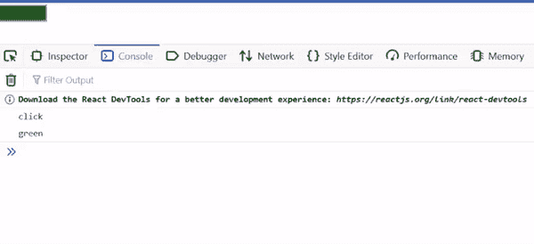

当变量状态被修改时，所有代码都会重新运行，作者插图

为了避免这个问题，React 提出了 useEffect 钩子。这个钩子的思路是，定义在其中的每一行代码只会在组件初始化时执行，或者当观察列表中的状态变量更新时执行。

useEffect 接受两个参数：

+   一个函数：在初始化期间以及某些状态变量被修改时会执行的代码

+   一个数组（“观察列表”）用于控制函数内部代码的重新运行。

在下面的例子中，console.log(“click”) 只会在小部件初始化时执行，因为观察列表为空。

```py
import { useState, useEffect } from "react";

export default function App() {

  ...

  useEffect(() => {console.log("click")}, [])

  console.log(colors[colorIdx]);
  return (...)
```

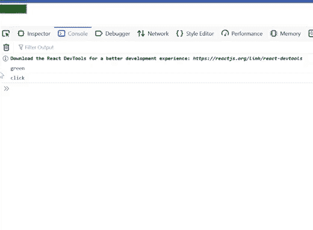

日志“click”只在初始化时触发，作者插图

# 为我们的加油站查找应用程序检索数据

我们现在拥有了为组件添加反应性的所有理论材料。

我们首先要做的是根据给定的邮政编码和特定的气体类型检索过滤后的数据。为此，我们需要几个步骤：

+   创建一个状态变量，该变量将包含所有车站的信息，表格和图表都可以使用这些信息

+   创建一个回调函数来触发 API 调用并更新相关的状态变量

## 下拉菜单

我们从下拉菜单开始。在上一篇文章中，该组件是静态的，当用户选择另一个燃料类型时没有任何反应。

```py
<select
  value="SP95"
  className="general-input"
>
  {fuelTypes.map((e) => (
    <option value={e}>{e}</option>
  ))}
</select>
```

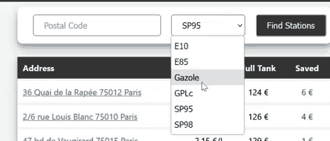

目前，<select>标签中的值被硬编码为“SP95”。我们将使用 useState 替换它：

```py
const [gasType, setGasType] = useState("SP95");

<select  value={selectedValue}  className="general-input">...</select>
```

我们现在需要在“onChange”事件在下拉菜单中触发时修改值：

```py
const handleChangeDropdown = (event) => {
  setGasType(event.target.value);
};

<select value={gasType} className="general-input" onChange={handleChangeDropdown}>
```

onChange 回调有一个输入“event”，其中包含与更改相关的信息。在我们的例子中，我们对“event.target.value”中访问的新下拉值感兴趣。

作为第一个交互式组件之一，让我们详细说明一下这里发生了什么：

+   组件初始化时，gasType 变量由初始化为“SP95”的 useState 定义，因此这将首先出现在下拉菜单框中。

+   当用户更改值时，它触发“onChange”回调，这将调用我们的 handleChange 函数。

+   在 handleChange 中，我们用通过`event.target.value`访问的新变量值来触发 gasType 的 setter，这将修改 gasType 及应用的渲染。

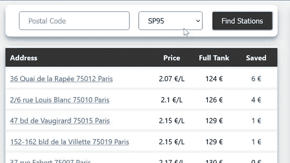

下拉菜单现在显示最新的点击值，作者插图

## 邮政编码文本区域

对于邮政编码的文本区域，逻辑非常类似，只是有一个不同之处：我们会强制“onChange”函数，只接受最多 5 位的数字。为此，我们只需通过正则表达式（仅数字，最多 5 位）测试下一个值，并仅在匹配正则表达式时更新 postalCode 值。

```py
const [postalCode, setPostalCode] = useState("");

const handleChangeTextArea = (event) => {
  const newValue = event.target.value;
  if (/^\d{0,5}$/.test(newValue)) {
    setPostalCode(newValue);
  }
};

<input
  type="text"
  placeholder="Postal Code"
  className="general-input"
  onChange={handleChangeTextArea}
  value={postalCode}
/>
```

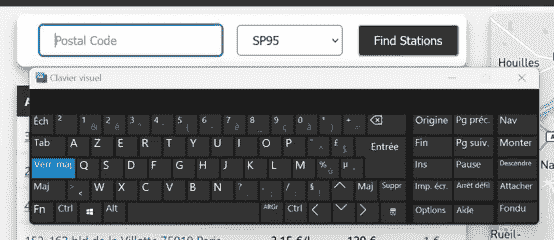

带有控制器的文本区域插图，作者插图

## 按钮“查找车站”

当按钮被点击时，我们想将下拉菜单和文本区域的信息传递给一个 API，该 API 将返回感兴趣城市 30 公里半径内的车站、价格和元数据。

点击按钮可以通过名为 onClick 的回调访问，当左键点击时触发。

现在我们准备函数，只需记录 postalCode 和 gasType。

```py
const handleButtonClick = () => {
  console.log(`Postal Code: ${postalCode}, Gas Type: ${gasType}`)
}

<button className="send-request-button" onClick={handleButtonClick}>
  Find Stations
</button>
```

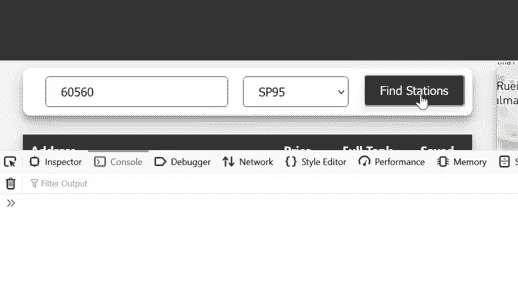

当我们点击“查找车站”时，我们从两个字段中检索最新信息，作者插图

## 关于 API 的一句话

在接下来的文章中，我们将更详细地讨论如何使用 Python + FastAPI 设置服务器端 API。现在假设服务已经可用，并且提供一个 GET 端点，提供从邮政编码和燃料类型获取的所有数据。

例如，使用下面的 URL：

> [`API_URL/stations?oil_type=SP95&postal_code=60560`](http://api_url/stations?oil_type=SP95&postal_code=60560)

将发送所有车站的元数据，30 公里半径内的经纬度，以及用于生成图表和表格的圆圈坐标。

```py
{
  "lat": 49.1414,
  "lon": 2.5087,
  "city": "Orry-la-Ville",
  "circle_lat": [49.411,49.410,...],
  "circle_lon": [2.5087,2.5347,...],
  "station_infos": [
    {
      "address": "Centre Commercial Villevert 60300 Senlis",
      "price_per_L": 1.88,
      "price_tank": 113,
      "delta_average": 7,
      "better_average": 1,
      "google_map_link": "https://www.google.com/maps/search/?api=1&query=Centre+Commercial+Villevert+60300+Senlis",
      "distance": 10,
      "latitude": 49.221,
      "longitude": 2.591
    },
    {
      "address": "Rue de Pontoise 95540 Méry-Sur-Oise",
      "price_per_L": 1.9,
      "price_tank": 114,
      "delta_average": 6,
      "better_average": 1,
      "google_map_link": "https://www.google.com/maps/search/?api=1&query=Rue+de+Pontoise+95540+Méry-Sur-Oise",
      "distance": 26,
      "latitude": 49.061,
      "longitude": 2.17
    },
    ...
  ]
}
```

## 传递信息从一个组件到另一个组件

另一个在继续之前需要讨论的事情是如何将信息从我们的 StationsFilter 组件传递到我们的 App 组件。

在 React 中，信息可以通过“props”从父组件传递到子组件。这个“props”是一个对象（键/值），其中包含作为标签属性传递的不同元素。

在下面的示例中，我们通过 props.childVariable 访问子组件中的一个变量。

```py
// A parent component, made of a state variable and a Child component
export default function Parent() {

  [variable, setVariable] = useState(0)
  return ( 
    <Child childVariable={variable} /> 
  )
}

// We pass "props" as parameter of our children component
// This props is an Object (key/value) which contains all the attributes passed
// in the parent component
export default function Child(props) {
  //We access the variable via props.childVariable
  //It will return the current value stored in childVariable, which is in this case 0
  console.log(props.childVariable)
}
```

通过这种方式，我们可以从父组件向子组件传播值。但反过来怎么样？如果你在子组件中修改了一个值，并希望将其传递给父组件，你可以像上面一样做，但不是传递变量，而是传递设置器。这样，当子组件中触发回调时，它可以触发来自父组件的设置器，从而修改父组件中定义的变量。

```py
export default function Parent() {

  [variable, setVariable] = useState(0)

  return ( 
    <Child childVariable={variable} setVariable={(newVal) => setVariable(newVal)}/> 
  )
}

export default function Child(props) {
  <button onClick={() => props.setVariable(props.childVariable+1)} />
}
```

在上面的代码片段中，每次点击时，我们会触发一个函数，该函数获取当前变量（在 props.childVariable 中），加 1，然后触发设置器，以便将“变量”在父组件中设置为变量+1。

## 完成我们的 API 调用

记住这点理论后，让我们完成我们的组件。我们首先在 App.js 中创建多个状态变量，用于存储来自 API 的信息。

```py
const [stationsData, setStationsData] = useState([]);
const [latCity, setLatCity] = useState(0);
const [lonCity, setLonCity] = useState(0);
const [latCircle, setLatCircle] = useState([]);
const [lonCircle, setLonCircle] = useState([]);
```

然后我们将设置器传递给我们的 StationsFilter 组件，在那里我们将从 API 加载数据。

```py
<StationsFilter
  setStationsData={setStationsData}
  setLatCity={setLatCity}
  setLonCity={setLonCity}
  setLatCircle={setLatCircle}
  setLonCircle={setLonCircle}
/>

//And don't forget to modify the definition of StationsFilter in StationsFilter.js 
//to include the props object !

//In StationsFilter.js:
export default function StationsFilter(props) {...}
```

现在我们需要准备 API 调用。在 React 中，这可以通过使用“fetch”方法完成，该方法接受一个 URL（用于请求）以及额外的参数，如头信息或其他请求参数。让我们直接在之前使用的“HandleClick”函数中实现它。

```py
const handleButtonClick = () => {
  fetch(`${APIURL}/stations?oil_type=${gasType}&postal_code=${postalCode}`)
    .then((res) => {
      return res.json();
    })
    .then((data) => {
      props.setStationsData([...data["station_infos"]]);
      props.setLonCity(data["lon"]);
      props.setLatCity(data["lat"]);
      props.setLonCircle([...data["circle_lon"]]);
      props.setLatCircle([...data["circle_lat"]]);
    });
};
```

一行一行地解释：

+   我们首先使用“fetch”，默认情况下，它对传递的 URL 进行 GET 调用。在我们的例子中，我们形成 URL 以包含状态变量 gasType 和 postalCode。

+   fetch 是一个异步函数，我们需要等待它完成后再处理 API 发送的数据。为此，我们使用回调 .then()，将其链式连接到我们的 API 调用。当 fetch 调用完成时，它将自动运行 .then() 中的代码。在这种情况下，我们接收到一个响应（来自 API），我们使用 res.json() 将其转换为 JSON。这也是一个异步函数，因此处理其结果必须通过链式调用另一个 .then() 回调来完成。

+   在最后的 .then() 中，我们检索数据并将其解析为 JSON，然后简单地解包为 lat、lon 和 stations_infos。然后我们触发在 App.js 中定义的不同设置器，以更新不同的状态变量。请注意，在 stationsData 的情况下，我们使用扩展操作 [**…**someArray]，这将创建 someArray 的副本。这是为了确保我们创建一个新的数组传递给 stationsData，而不是仅仅引用 someArray，这可能会导致一些意外的行为。

点击按钮现在将触发 API 调用，最终更新 App.js 中的状态变量。

## 连接 StationsTable 组件

如果你还记得之前的文章，我们通过使用一个预加载的 JSON 构建了 StationsTable 的预览，这个 JSON 的格式与当前存储在 stationsData 变量中的完全一致。

从 API 下载数据并将其存储在 stationsData 中是困难的部分。现在我们只需稍微修改我们的 StationsTable 组件，以便使用 stationsData 替代预加载的 JSON。

首先，我们在 StationsTable 中添加了一个名为 stationsData 的状态变量。

```py
<StationsTable stationsData={stationsData} />
```

然后我们向 StationsTable.js 中的函数声明添加 props。

```py
export default function StationsTable(props) {...}
```

最后，我们用包含在对象 props 中的 stationsData 替换预加载的 JSON。

```py
 <tbody>
     {props.stationsData.map((row) => {...})}
 </tbody>
```

就这样，每次我们点击按钮时，表格中的数据将会被我们感兴趣的城市周边的站点价格替代。

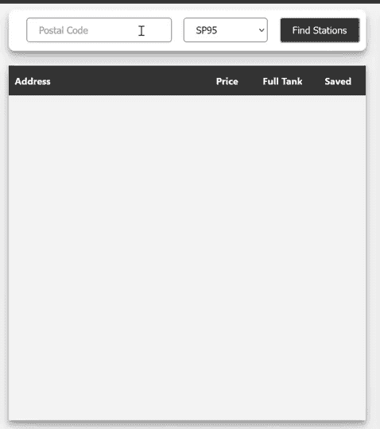

表格更新中的实际操作，作者插图。

## 使用状态变量生成地图。

你应该现在已经习惯了，我们将按照之前的步骤进行：通过标签的属性将数据从 App 传递到 StationsMap，向 StationsMap 添加 props，并修改我们在上一篇文章中预生成的每个轨迹的相关部分。

```py
<StationsMap
  stationsData={stationsData}
  latCircle={latCircle}
  lonCircle={lonCircle}
  lonCity={lonCity}
  latCity={latCity}
/>
```

现在在 StationsMap.js 中，我们将逐一创建不同的轨迹，按照 Python figure 提供的模板（本系列的第一部分），并在需要时替换相关数据。

我在这里展示两个示例，然后变得有些冗余。

研究周边的圆圈轨迹：

```py
const circleTrace = {
  fill:"toself",
  fillcolor:"rgba(1,1,1,0.2)",
  lat:props.latCircle,
  lon:props.lonCircle,
  marker:{"color":"black","size":45},
  mode:"lines",
  opacity:0.8,
  showlegend:false,
  type:"scattermapbox",
  uid: uuidv4()
}
```

石油站的黑色边框：

```py
const stationsBorder = {
  lat: props.stationsData.map((e) => e["latitude"]),
  lon: props.stationsData.map((e) => e["longitude"]),
  marker: { color: "black", size: 45 },
  mode: "markers",
  opacity: 0.8,
  showlegend: false,
  text: props.stationsData.map((e) => e["price_per_L"].toString() + "€/L"),
  type: "scattermapbox",
  uid: uuidv4()
};
```

注意：Mapbox 轨迹需要每个轨迹的唯一标识符。为此，我们可以使用一个非常方便的工具包 **uuid**，它可以为我们生成随机 id。

```py
npm install uuid
```

```py
import { v4 as uuidv4 } from "uuid";
```

当我们定义好所有轨迹后，我们可以将它们放入一个列表中，该列表将作为我们 plotly 组件的属性。

```py
const data = [circleTrace,stationsBorder,stationsPriceColor,
              stationIconsTrace,pointLocation];
```

现在我们可以处理图表布局，使用相同的方法：我们获取由 Python figure 暴露的字典，并用我们的状态变量替换“硬编码”的属性，使布局具有互动性。特别是，我们需要修改布局中心的“lat”和“lon”，以确保每次用户发起请求时，地图会自动重新聚焦到该请求的城市。

```py
const { REACT_APP_API_KEY } = process.env;

const layout = {
  mapbox: {
    accesstoken: REACT_APP_API_KEY,
    center: { lat: props.latCity, lon: props.lonCity },
    style: "streets",
    zoom: 11,
  },
  margin: { b: 0, l: 0, r: 0, t: 0 },
  autosize: true,
};
```

此外，注意这里一个非常重要的事项：我们在布局中传递了我们的 **Mapbox 访问令牌**。这是你不想公开暴露的内容，所以你绝对不要将其硬编码在任何地方，否则其他人可能会将其用于其他目的。

要在项目中添加任何秘密变量，你应该在项目根目录中添加一个 .env 文件：

```py
fuel-station-front/
  |-- node_modules/
  |-- public/
  |-- src/
  |-- package.json
  |-- package-lock.json
  |-- README.md
  |-- .env
```

.env 应该被添加到你的 .gitignore 文件中，以防你意外将其推送到公共地方。

在 React 中，你需要遵守前缀 REACT_APP_，这将是框架读取的唯一变量。

在我们的例子中，.env 看起来很简单，如下所示：

```py
REACT_APP_API_KEY=pk.auek...
```

使用我们直接连接到 states 变量的“data”和“layout”，我们可以像在上一篇文章中一样简单地生成我们的 plotly 图表。

```py
 return (
    <div className="component-embbeder">
      <Plot
        data={data}
        layout={layout}
        style={{ height: "100%", width: "100%" }}
        useResizeHandler={true}
      />
    </div>
  );
```

让我们来看看网页应用的实际效果！

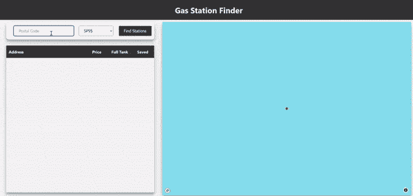

API 调用现在可以交互地修改地图和表格，作者插图

# 改进细节

我们的应用现在满足了主要的“用户故事”：通过一种油的类型和一个邮政编码，我们能够检索并显示周围加油站的价格信息。这已经是一个很大的进步。我们现在希望通过一些改进来进一步提升用户体验，这些改进将在本节中详细介绍。

## 通过 API 调用启动应用程序

我们当前版本的应用程序在一个毫无标记的地方启动，即在海洋中央。这对于首次到达的用户可能会有点困扰。为了解决这个问题，我们将通过一个 API 调用在巴黎附近为 SP98 启动应用程序。

为此，我们将使用在本文第一部分中描述的 useEffect “hook”。

为此，我们首先在 App.js 中传递 API 调用逻辑：

```py
const ApiCallAndUpdateState = (gasType, postalCode) => {
  fetch(`${APIURL}/stations?oil_type=${gasType}&postal_code=${postalCode}`)
  .then((res) => {
    return res.json();
  })
  .then((data) => {
    setStationsData([...data["station_infos"]]);
    setLonCity(data["lon"]);
    setLatCity(data["lat"]);
    setLonCircle([...data["circle_lon"]]);
    setLatCircle([...data["circle_lat"]]);
  });
}
```

然后我们将这个函数包装在一个 useEffect hook 中，使用 gasType=”SP98" 和 postalCode = “75001”，这对应于巴黎市中心。

```py
useEffect(() => {
  ApiCallAndUpdateState("SP98","75001")
}, [])
```

由于我在 useEffect 的第二个参数中传递了一个空列表，这段代码将只在组件初始化时执行，这正是我们所期望的。

最后，现在我们将所有更新调用逻辑嵌入到一个函数中，我们可以对 StationsFilter 组件进行一些重构，将这个函数传递而不是所有状态变量的设置函数。

```py
<StationsFilter
    ApiCallAndUpdateState={ApiCallAndUpdateState}
/>
```

在 StationsFilter.js 中，我们只需在“HandleButtonClick”回调中触发这个新函数：

```py
const handleButtonClick = () => {
  props.ApiCallAndUpdateState(gasType, postalCode)
};
```

## 添加一个距离滑块

在应用程序的当前版本中，我们在屏幕上显示了 30 公里范围内的所有加油站，这在低密度区域可能有意义，但在高密度区域可能会非常繁重。

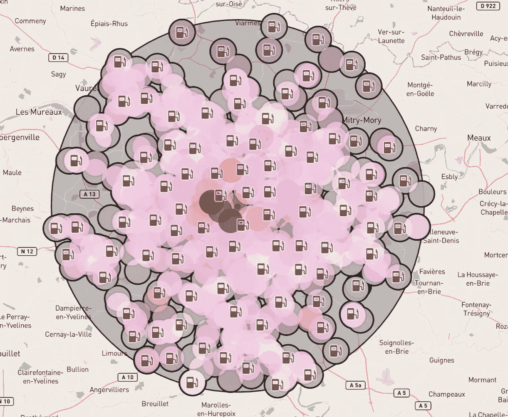

30 公里范围的搜索……其中显示了太多信息，作者插图

为了解决这个问题，我们将使用一个滑块来控制搜索范围，从 1 公里到 30 公里。借助 React，我们可以访问大量的库和工具，在一些研究之后，我发现一个适合 Gas Finder 应用的滑块组件 [这里](https://www.npmjs.com/package/react-slider)。我不会在这里详细描述样式，只关注交互部分。

首先安装 react 库：

```py
npm i react-slider
```

我们可以简单地将组件导入到我们的项目中：

```py
import ReactSlider from "react-slider";
```

滑块将控制另一个状态变量（过滤距离）。让我们将其添加到我们的 App.py 中。我将其初始值设置为 5 公里作为起点。

```py
const [distanceFilter, setDistanceFilter] = useState(5);
```

我们将把滑块集成到 StationsFilter 和 StationsTable 之间。

```py
<StationsFilter ApiCallAndUpdateState={ApiCallAndUpdateState} />
<ReactSlider
  className="horizontal-slider"
  markClassName="example-mark"
  thumbClassName="example-thumb"
  trackClassName="example-track"
  min={1}
  max={30}
  value={distanceFilter}
  renderThumb={(props, state) => (
    <div {...props}>{state.valueNow}</div>
  )}
  onAfterChange={(e) => setDistanceFilter(e)}
/>
<StationsTable stationsData={stationsData} />
```

我不会在这里详细说明 .css，组件接受许多参数，例如带有滑块和轨道的类，最小值和最大值。我根据 [文档](https://zillow.github.io/react-slider/) 的示例修改了这些值。

两点值得注意：

+   至于我们的下拉菜单，我们可以通过状态变量控制滑块的值。

+   我们将通过使用另一个回调函数 onAfterChange 来修改距离过滤器，它将在用户停止移动滑块后触发。

此时，我们的滑块控制距离过滤器，我们现在需要使用它来过滤数据点。为此，我们需要创建另一个数组，它将是 stationsData（从 API 获取的数据）的过滤版本。

```py
const filteredData = stationsData.filter(stationPrice => stationPrice.distance <= distanceFilter);
```

我们现在可以将这个 filteredData 传递给我们的组件，而不是 stationsData，它将根据距离自动更新可见的站点。

还有最后一件事要做：控制显示研究范围周边的圆圈的轨迹。目前，圆圈是基于 API 发送的 30km 距离。

有两种方法可以进行修改：我们可以创建一个新的 API 端点，它会根据纬度/经度/半径向我们发送点数组，并将创建圆形的逻辑保留在后端，特别是如果你更熟悉 Python。这种解决方案有一个巨大的缺点，就是每次用户稍微调整滑块时都会增加 API 调用的次数，我们希望避免这种情况以提高性能。

另一种解决方案是将我们的 Python 函数转置为 JavaScript 中计算圆形的函数，这将在客户端直接计算。出于性能原因，我们将选择第二种方案。

让我们首先创建一个新的 utils 文件夹，位于 StationsMap 中，并包含一个 drawCircle.js 文件：

```py
 |-- StationsMap/
      |-- StationsMap.js
      |-- StationsMap.css
      |-- utils/
        |-- drawCircle.js
```

我将精确地转置我们在第一部分中使用的 Python 函数，但这次是在 JavaScript 中：

```py
function calcPointsOnCircle(lat, lon, radius, numPoints) {
  const points = [];
  const R = 6371;

  for (let i = 0; i < numPoints; i++) {
    const bearing = (360 / numPoints) * i;
    const lat2 = Math.asin(
      Math.sin(toRadians(lat)) * Math.cos(radius / R) +
        Math.cos(toRadians(lat)) *
          Math.sin(radius / R) *
          Math.cos(toRadians(bearing))
    );
    const lon2 =
      toRadians(lon) +
      Math.atan2(
        Math.sin(toRadians(bearing)) *
          Math.sin(radius / R) *
          Math.cos(toRadians(lat)),
        Math.cos(radius / R) - Math.sin(toRadians(lat)) * Math.sin(lat2)
      );
    points.push([toDegrees(lat2), toDegrees(lon2)]);
  }

  points.push(points[0]);

  return points;
}

function toRadians(degrees) {
  return (degrees * Math.PI) / 180;
}

function toDegrees(radians) {
  return (radians * 180) / Math.PI;
}
```

我不会详细说明那个公式，它是一个基本的数学操作，与本文无关。主要函数 calcPointsOnCircle 接受表示圆心的纬度/经度、半径和所需的点数。它返回一个由 (lat, lon) 元组组成的数组。

尽管如此，如果你是 JavaScript 新手，一个重要的点是，为了使你的函数可供其他文件使用，你需要在文件末尾导出它。

```py
export { calcPointsOnCircle };
```

现在这个函数可以直接在 StationsMap 中使用，以根据当前状态变量（纬度/经度和选择的距离）互动计算圆形。让我们看看代码的修改。

```py
import { calcPointsOnCircle } from "./utils/drawCircle";
...

export default function StationsMap(props) {

  // We use our function to create an array of points based on the state variables
  const pointsOnCircle = calcPointsOnCircle(
    props.latCity,
    props.lonCity,
    props.distanceFilter,
    100
  );

  // We use map() to extract all the lat and all the lon and pass them to the 
  // circleTrace
  const circleTrace = {
    fill: "toself",
    fillcolor: "rgba(1,1,1,0.2)",
    lat: pointsOnCircle.map((e) => e[0]),
    lon: pointsOnCircle.map((e) => e[1]),
    marker: { color: "black", size: 45 },
    mode: "lines",
    opacity: 0.8,
    showlegend: false,
    type: "scattermapbox",
    uid: uuidv4(),
  };

  ...
```

本节到此为止。到目前为止，我们有一个交互式滑块，它根据距离的过滤器控制屏幕上显示的数据。

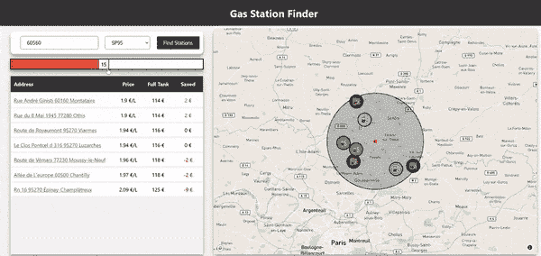

滑块的操作，作者插图

## 保持当前的缩放级别

此时，每次用户操作滑块时，它都会重置 plotly 视图并重新生成布局。问题在于这也重置了缩放，这是我们想要避免的行为，见下图。

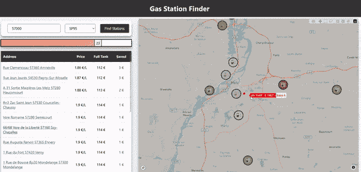

缩放问题，作者插图

解决这个问题的一种方法是通过滑块值来控制缩放，以便它自动适应圆的大小。在我们的例子中，这是一项非常简单的修改，因为我们是逐步增加距离过滤器。因此，最简单的方法是创建一个映射 {当前距离值 -> 所需缩放} 并用它来自动控制缩放级别。在 StationsMap 中：

```py
const mapDistZoom = {
  1: 14.0,
  2: 13.45,
  3: 12.9,
  ...
};

...
const layout = {
  mapbox: {
    accesstoken: REACT_APP_API_KEY,
    center: { lat: props.latCity, lon: props.lonCity },
    style: "streets",
    zoom: mapDistZoom[props.distanceFilter],
  },
  margin: { b: 0, l: 0, r: 0, t: 0 },
  autosize: true,
};
```

*注意：为了进行映射，我简单地迭代寻找了不同值（30,25,20…）下的最佳缩放级别，并对中间值进行了线性插值。*

## 在表格上方添加标题

这是对应用程序的一个小修改，但它为最终用户带来了更多的清晰度。当发出请求时，我们希望标题能够明确显示研究的位置和燃料类型。

API 调用已经提供了城市信息，当点击按钮发起新请求时，燃料类型可以被更新。

我们将很快处理需要修改的内容，因为这主要是重新使用我们到目前为止所做的工作，通过从一个组件传递/更新状态变量到另一个组件。

在 App.js 中，我们创建了两个新的状态变量

```py
const [citySearch, setCitySearch] = useState("");
const [gasTypeSearch, setGasTypeSearch] = useState("");
```

然后我们可以更新 ApiCallAndUpdateState 函数，这个函数在用户点击按钮时被调用。

```py
const ApiCallAndUpdateState = (gasType, postalCode) => {
  fetch(`${APIURL}/stations?oil_type=${gasType}&postal_code=${postalCode}`)
    .then((res) => {
      return res.json();
    })
    .then((data) => {
      ...
      setGasTypeSearch(gasType);
      setCitySearch(data["city"]);
    });
};
```

我们现在可以在 StationsFilter 和 StationsTable 之间简单地添加一个标题：

```py
 <h2 style={{ padding: "1px", margin: "5px", textAlign: "center" }}>
    {citySearch} - {gasTypeSearch}
  </h2>
```

这现在导致表格上方出现了一个标题，显示了研究的当前位置，符合要求。

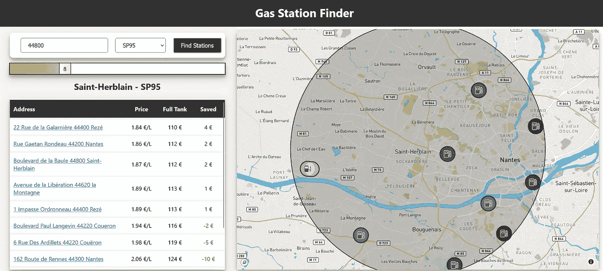

在表格上方添加标题带来了更多的清晰度，用户插图

## 地图上的一致颜色

在 plotly 中，当定义热图时，未准确设置上下限将默认将比例拉伸到人口的最小值和最大值。

这有一个主要的缺点：如果某个站点的价格远低于或远高于平均值，则颜色比例将不再具有相关意义。

另一个可能遇到的问题是，站点的颜色会根据用于过滤的距离而变化，因为站点的数量会改变，最大/最小价格也会改变，因此最终，比例也会变化。

为了避免这个问题，我们需要决定一个最小值和最大值。鉴于使用的发散颜色图，我们还希望这些范围是对称的。这个问题有很多可能的解决方案，我个人决定使用“30 公里半径内的价格平均值 +/- 10%”，假设高于或低于这个平均值 10%的价格无论如何都太高或太低。

要计算平均值，我们需要取未过滤的数据并计算总和。此操作在 Javascript 中使用 reduce 方法完成：

```py
 const sumPrice = stationsData.reduce(
    (total, value) => total + value["price_per_L"],
    0
  );

  const avgPrice = sumPrice / stationsData.length;
```

请注意，sumPrice 和 avgPrice 不需要作为状态变量：它们将始终在更新新的 stationsData 时计算。

我们现在可以像往常一样通过 props 将 avgPrice 传递给 StationsMap：

```py
<StationsMap
  ...
  avgPrice={avgPrice}
/>
```

并通过对价格进行阈值处理来更新图表，以使其高于或低于定义的边界。

```py
const COLOR_PRICE_THRESHOLD = 0.1
const stationsPriceColor = {
    marker: {
      color: props.stationsData.map((e) => {
        var price = e["price_per_L"];
        if (price > props.avgPrice * (1+COLOR_PRICE_THRESHOLD)) {
          price = props.avgPrice * (1+COLOR_PRICE_THRESHOLD);
        }
        if (price < props.avgPrice * (1-COLOR_PRICE_THRESHOLD)) {
          price = props.avgPrice * (1-COLOR_PRICE_THRESHOLD);
        }
        return price;
      }),
      ...
    },
    ...,
  };
```

下一张图展示了标准边界和我们自定义边界之间的区别，这带来了更多对比度：

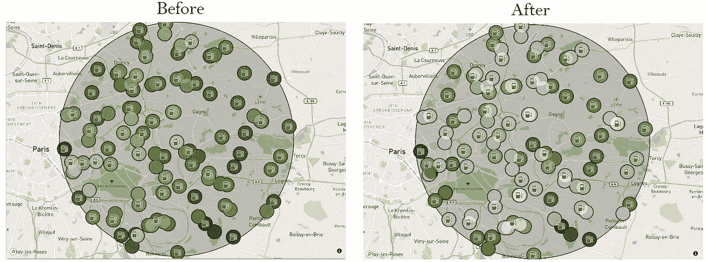

设置上下边界会增加颜色对比度，作者插图

## 清理图表中的悬停信息

需要修复的小细节，plotly 的默认悬停需要一点自定义。目前有两个主要问题：

+   当用户检查一个站点时触发的悬停事件默认也显示 lat/lon，这不是我们想看到的（我们只想看到价格）

+   当鼠标经过黑色轨迹或红点时，也会显示坐标，我们希望移除这种交互

对于第一点，我们可以简单地传递一个**hovertemplate** 参数，该参数控制鼠标悬停时显示的内容。下面的公式仅在“text”属性中包含该参数，<extra></extra> 移除默认的框。

```py
 hovertemplate: '%{text}<extra></extra>'
```

对于第二点，更简单，我们只需传递一个参数

```py
hoverinfo: "skip"
```

这将完全移除轨迹的悬停交互。

## 处理 API 错误

在本文中，我们还将探索最后一件事：处理 API 错误。如果用户尝试一个不在数据库中的邮政编码，API 将返回自定义错误 400。当发生这种情况时，我们希望修改文本字段以使用户理解其输入存在问题，并用红色突出显示输入字段。

让我们开始在 App.js 中添加一个新的状态变量

```py
const [apiError, setApiError] = useState(false);
```

现在我们可以修改我们的 fetch 方法，以便在发生异常时执行某些操作。

第一步是如果我们没有收到 API 的正确响应，则抛出一个错误。

```py
fetch(`${APIURL}/stations?oil_type=${gasType}&postal_code=${postalCode}`)
  .then((res) => {
    if (!res.ok) {
      throw new Error("Problem with the API...");
    }
    return res.json();
  })
  .then((data) => {...})
```

之后，我们需要在处理管道的末尾捕捉此错误，并将 setApiError 设置为“true”。我们还需要确保在请求成功后 apiError 被设置回“false”：

```py
fetch(`${APIURL}/stations?oil_type=${gasType}&postal_code=${postalCode}`)
  .then((res) => {...})
  .then((data) => {
    ...
    setApiError(false);
  })
  .catch((error) => {
    setApiError(true);
  });
```

我们可以最终将 apiError 传递给我们的 StationsForm 组件，并修改邮政编码文本字段的样式。实现这一点的一种方法是，当 apiError 为“true”时向文本字段添加额外的类……

```py
<input
  className={"general-input" + (props.apiError ? " input-error" : "")}
  type="text"
  placeholder="Postal Code"
  onChange={handleChangeTextArea}
  value={postalCode}
/>
```

… 并为该 input-error 类添加额外的 CSS

```py
.input-error {
  border: solid 2px red;
}
```

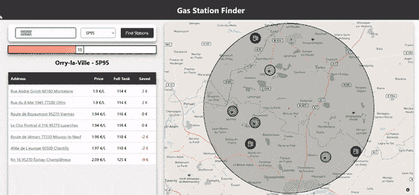

当使用错误的邮政编码时，文本字段会更改为红色边框，作者插图

# 结论

这个最后的实现完全结束了专门用于开发 React 网络应用程序 UI 的章节。

React 在数据科学家/数据分析师社区中越来越受欢迎，尽管学习这个框架需要投入大量时间，但通过这个例子我们看到，一旦掌握，它可以让我们构建出稳健、强大且响应迅速的应用程序。

UI 完成后，我们现在已经完成了原型阶段的一半。在下一篇文章中，我们将讨论服务器端，并准备我们的 API 和数据库。
