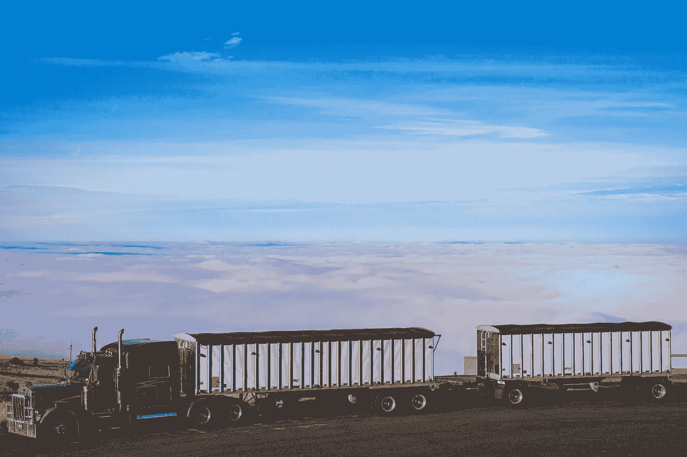
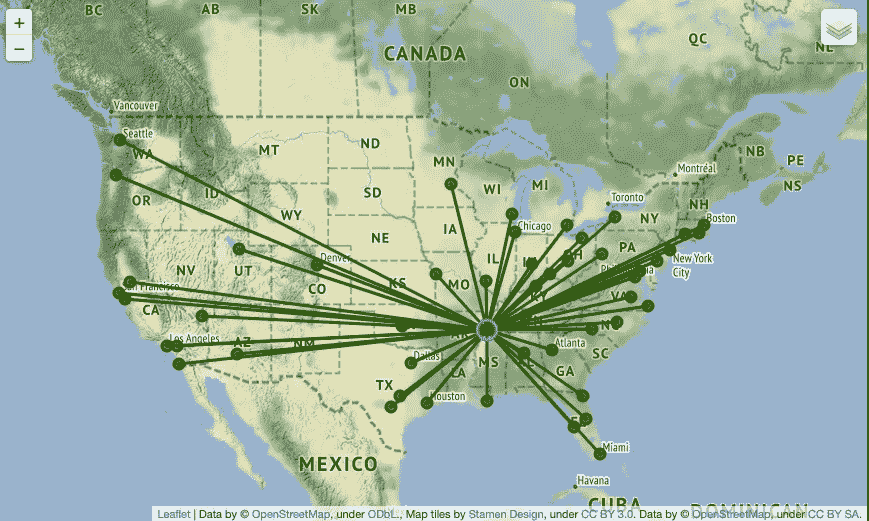
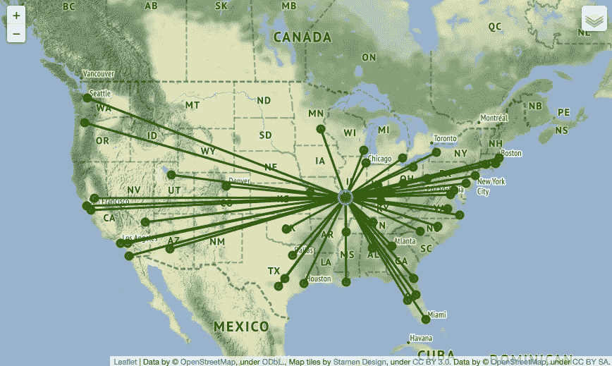
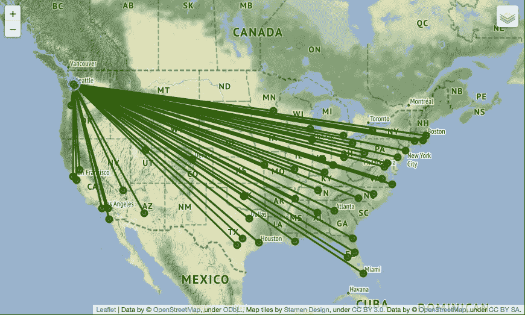
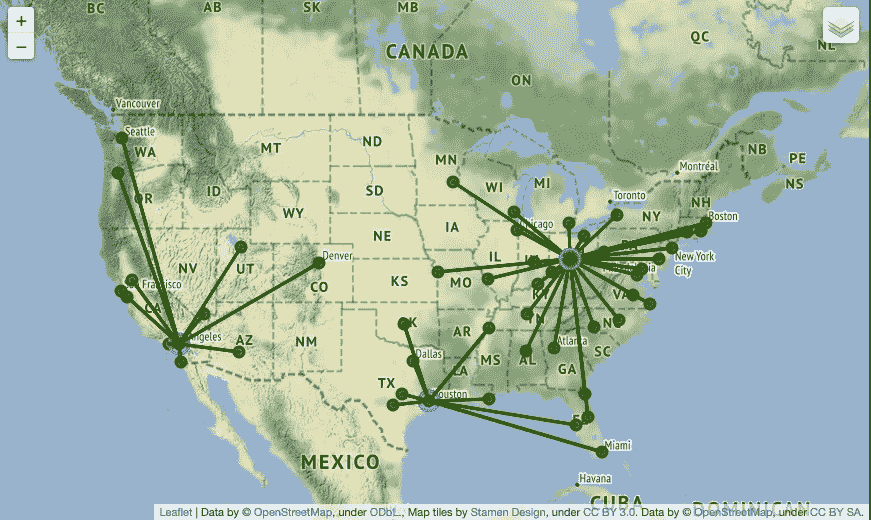

# 带有地理空间计算的可持续供应链模板（Python）

> 原文：[`towardsdatascience.com/a-sustainable-supply-chain-template-with-geospatial-calculations-in-python-f99a20a43df4`](https://towardsdatascience.com/a-sustainable-supply-chain-template-with-geospatial-calculations-in-python-f99a20a43df4)

## 供应链网络足迹应包括运输和配送中心的温室气体计算，而不仅仅是其中之一

 [Sabi Horvat](https://sabolch-horvat.medium.com/?source=post_page-----f99a20a43df4--------------------------------)

·发表于[Towards Data Science](https://towardsdatascience.com/?source=post_page-----f99a20a43df4--------------------------------) ·阅读时间 11 分钟·2023 年 4 月 25 日

--

[照片由 Edelbert Macapagal](https://unsplash.com/ko/@emacapagal?utm_source=medium&utm_medium=referral)提供，来源于[Unsplash](https://unsplash.com/?utm_source=medium&utm_medium=referral)

# 供应链数据科学的可持续性

供应链数据科学家通常需要对各种领域有深入了解，以支持各部门。这种广度有助于优化供应链网络*全球*而非优化*局部*段落；局部优化的组合很少能导致最佳整体解决方案。

可持续性是供应链分析中相对较新的领域。类似于对*全球优化而非局部优化*的期望，我们也希望通过批判性思维来实现可持续性指标下最有价值的结果。

美国环保局（US EPA）计算运输是美国五大经济部门中贡献最大的一项[1]。

**交通是温室气体的重要来源，但供应链计算还需考虑其他来源。**

为美国大多数居民提供商品和服务的供应链网络还依赖于配送中心来存储、重新包装和准备这些产品以备运输。以下结构分享了一种将交通和设施贡献结合起来的方法，示例数据和计算已发布在[GitHub](https://github.com/wpbSabi/sustainable_supply_chain_template)上：

+   交通软件计算温室气体排放

+   使用 Python 生成数据

+   供应链 GHG 排放场景：一个配送中心（DC）

+   供应链 GHG 排放场景：三个配送中心（DCs）

+   结论

+   下一篇文章：多目标优化

# 运输软件计算温室气体排放

许多运输管理系统（TMS）根据里程提供温室气体（GHG）排放的计算。

+   在美国，旅行的距离（以英里计算）可以乘以一个因子，例如每英里 0.36 克的 CO2e，用于小于卡车负载（LTL）卡车。CO2e 指的是二氧化碳当量单位，因为 CO2 只是运输的温室气体副产品之一。

+   温室气体排放可能更具体，比如考虑车辆的具体类型而不是行业平均值、卡车拖车中的重量以及其他因素。

供应链网络设计软件也可以在距离和成本旁边包括 CO2e 量。

**不幸的是，仅考虑运输可能会导致某人错误地认为较短的运输距离意味着较低的 CO2e 排放。**

较短的运输时间通常需要额外的设施，如配送中心或交叉码头。一个运输排放较低的供应链，其*总*排放量可能更大。

本文附带一个可持续供应链模板，发布在[GitHub](https://github.com/wpbSabi/sustainable_supply_chain_template)上，以展示在考虑运输和设施碳足迹时的供应链排放。

# 使用 python 生成数据

以下是考虑供应链可持续性时的关键数据点。我的近似值是在 python 中开发的，但其他工具也可以类似使用。

**配送中心的地理编码位置将作为运输路线上的起点和终点。**

1.  我根据维基百科[2]选择了美国 50 个最大的大都市地区作为数据样本。每个大都市将作为一个目的地，而给定场景的选定起点将位于一个或多个大都市中。

1.  下一步是检索纬度和经度用于距离计算和地图创建。这一过程称为地理编码。虽然我喜欢在 python 中自动化这个工作流程，但也有其他方式使用软件、电子表格、互联网资源等来收集地理信息。

1.  我首选的免费开源 python 方法，[geopy](https://geopy.readthedocs.io/en/stable/)，由于一个依赖暂时无法使用，但在我十天后再次检查时该服务已恢复。对于以下脚本，我使用了 Google Maps API 帐户，幸运的是免除了我为本文下载的$0.32 的地理数据的费用。geopy 方法被注释掉，但在脚本中也有显示。

在以下的 python 脚本中，我提供了城市和州，并返回了每个位置的纬度和经度。我本可以提供邮政编码或完整地址，以获得更准确的地理坐标。

我逐次运行这个脚本，以确保数据验证容易，然后我用最新的城市数据更新了 CSV 文件。有一次，我在 Google Maps API 输入中将“California”写成了“加利福尼亚”，省略了城市名称，但这个过程帮助我立即发现了错误。

**列举位置之间的路线列表**

1.  在这个简化模型中，每条路线将有一个起点位置和一个终点位置。我通常将这些路线称为起点-终点对（或 OD 对）。源点-目的点对或长途路线是其他常见的描述词。

1.  为了拥有我可能在下一步建模场景中使用的所有路线，我想在所有可能的起点和所有可能的终点之间创建路线。为了创建场景，我稍后将根据这些路线的子集过滤数据框。

1.  使用 pandas 的交叉合并，50 个起点和 50 个终点的笛卡尔积结果是 2500 个 OD 对。

**计算位置之间的距离**

1.  下一步是将刚创建的*origin_destinations_pairs*数据框中的每条路线的距离添加进去。

1.  当旅行长距离时，地球的曲率在距离计算中非常重要。haversine 公式辅助函数计算这些大圆距离（GCD）[3]。我在下一步中使用的温室气体计算器也利用了大圆距离。虽然可以获得实际的卡车行驶距离，但使用 haversine 弧线距离通常更简单，并且在这种情况下将确保我在模型中合并的数据格式一致。

1.  我对这些距离结果做了一处修改。一个位置到自身（例如，从休斯顿到休斯顿）的距离为 0 英里。我将这 50 个“自我”路线的距离改为 10 英里，假设同一城市中可能有到其他点的路线。

**计算运输和配送中心的温室气体排放量**

*免责声明：以下因素是基于有限研究的假设。使用这些假设的目的是展示场景结果的变化。我尊重为组织调整这些因素所需的工作量，但这超出了本文的范围。*

1.  对于运输温室气体排放，经过评估几个在线计算器，我决定使用 **每英里 0.36 克 CO2e** 的近似值/假设，这来自 DHL[3] 的特定路线的少于整车装载（LTL）卡车。简而言之，我输入了起点和终点，确认了 CO2e 克数是基于大圆距离（GCD）的，然后除以总英里数以获得每英里的克数。

1.  对于一个普通配送中心的温室气体排放，我结合了每平方英尺的配送中心（DC）能源使用的公共数据 [4] 和该能源的排放影响 [5]，得出了**每天 443 公斤 CO2e**的例子/假设 DC。

1.  模型将假设所有发货都发生在一天内。这样，日常配送中心（DC）排放量和日常发货排放量可以加总为每日总量。

# 供应链温室气体排放场景：一个配送中心（DC）

以下场景演示了在已提到的条件和假设下的总温室气体排放量。利用排放因子，我使用了以下计算来处理利用一个配送中心的场景。

为了简化，这些计算做了（不正确的）假设：

+   所有发货都可以在一天内完成。

+   每辆卡车在返回配送中心的途中也可以找到发货。

第一个函数 *footprint_for_one_dc()* 需要筛选相关场景的路线数据。例如，如果我想了解在田纳西州孟菲斯的一个配送中心及 50 个运输目的地的距离和温室气体排放，那么我筛选的数据框将有 50 行。

第二个函数 *map_supply_chain_network()* 使用 [folium](https://python-visualization.github.io/folium/) 创建配送中心、目的地以及配送中心和目的地之间的“鸟瞰”线路图。这些类型的 OD 配对地图有时被称为蜘蛛图或网络分析图。

**一个位于美国中部的配送中心，位于田纳西州孟菲斯**

对于第一个场景，我筛选了数据框 *distance_between_od_pairs*（如上所述），以孟菲斯为起点，并运行了两个函数以进行计算和地图创建。

孟菲斯配送中心的位置每天的数值为：

+   DC 和运输排放的总量为 467 公斤 CO2e

+   24 公斤 CO2e 的运输排放

使用 Leaflet 和 OpenStreetMap 通过 folium 在 python 中的孟菲斯配送中心（图片来源：作者）

**一个位于美国中部的配送中心，位于密苏里州圣路易斯**

对于第二个场景，我没有筛选孟菲斯的起点，而是筛选了圣路易斯的起点。然后我运行了两个函数以进行计算和地图创建。

圣路易斯的配送中心位置每天的数值为：

+   DC 和运输排放总计 466 kg CO2e

+   运输排放 23 kg CO2e

由于假设每个 DC 的足迹相同，我们可以推断在这个数据情景下，圣路易斯作为单一位置的运输足迹比孟菲斯好 1 kg CO2e。

圣路易斯 DC 使用 Leaflet 和 OpenStreetMap 通过 Python 的 folium 制作（图片由作者提供）

**华盛顿州西雅图的一个配送中心**

在第三种情景中，我选择了西雅图作为 DC 位置，以展示当单个 DC 远离美国中心时的结果。

西雅图的配送中心位置产生了每日值：

+   DC 和运输排放总计 494 kg CO2e

+   运输排放 51 kg CO2e

在我们评估这些情景数据的指标时，选择单一配送中心位置的西雅图可能是最差的选择。

然而，总计 494 kg CO2e 仅比前两个情景高出约 6%。在这些情景的数据中，如果 DC 使用低碳能源，这可能会使单个西雅图配送中心在这些假设下的环境指标上变得更具吸引力。即便有良好的环境指标，运输和总设施成本仍可能是导致选择将 DC 设在其他地点的因素。

西雅图 DC 图片由作者使用 Leaflet 和 OpenStreetMap 通过 Python 的 folium 制作

# 供应链温室气体排放情景：三个 DC

最后，最后一个情景选择了在美国相对均匀分布的三个 DC：加州河滨、德州休斯顿和俄亥俄州哥伦布。

如何选择最优的 DC 集合，请滚动至本文底部，查找关于多目标优化的下一篇文章链接（如有）。

为了计算有更多 DC 的情景的温室气体排放，数据整理过程需要更多步骤：

+   我希望每个配送中心只服务一个目的地；每个目的地仅由最近的 DC 服务。这是一种常见的做法，用于*主要*运输通道，但次要和三级通道通常是选项。

+   配送中心可以更小，以满足相同的目的地需求，因此每个设施的温室气体排放将被更新。我将假设每个 DC 的规模相似，以简化计算和模型。

为了选择最近的 DC，首先我筛选了三个源 DC，类似于早期的情景。接下来，我按最小距离筛选目的地，以选择每个目的地的最近 DC。

由于这三个配送中心将服务于与一个中央配送中心相同的一部分目的地，每个配送中心需要携带更多的库存，以确保在需要时产品可供销售。虽然可以从较远的配送中心发货以弥补较近地点的缺货，但最低库存水平可以通过供应链平方根法则来估算。否则，将需要更复杂的模拟来考虑这种可能性。

供应链平方根法则估算了我们需要多少更多的库存以维持相同的服务水平。例如，对于三个配送中心与一个配送中心：

> square_root(3 / 1) = 1.73

相比于一个配送中心，三个配送中心需要的库存量是 1.73 倍，或者增加 73%。由于有三个配送中心来覆盖这部分数量，如果配送中心的足迹按线性比例扩展，并且每个配送中心都相等，那么每日 433 kg CO2e 的配送中心排放将增加到 766 kg CO2e，或每个较小的配送中心大约 256 kg CO2e。

**加州河畔城、德克萨斯州休斯顿和俄亥俄州哥伦布的三个配送中心**

在第四种情景中，我选择了三个看起来视觉上分开的配送中心。这些配送中心不一定是最优选择，但如何做出最优选择的过程将在下一篇文章中介绍。

河畔城、休斯顿和哥伦布的配送中心总共为：

+   779 kg CO2e 配送中心和运输排放

+   11 kg CO2e 运输排放

与一个中央配送中心相比，这三个配送中心将运输排放减少了 50%以上。但由于额外的配送中心，总排放增加了 40%。

三个配送中心的图像由作者使用 Leaflet 和 OpenStreetMap 通过 python 中的 folium 创建

# 结论

在某些条件下，更多的配送中心和更短的运输距离可能会导致较少的温室气体排放。但这个有限的例子表明，更短的最终运输目的地可能并不总是表示碳足迹较低的供应链网络。

为了设计一个可持续的供应链，需要考虑运输和设施的影响以及其他因素。

要使用模板或贡献改进模板，请访问[GitHub](https://github.com/wpbSabi/sustainable_supply_chain_template)。

# 下一篇文章：多目标优化

尽管本文关注于可持续性，但成本或时间通常是供应链指标的优先考虑因素。

下一篇文章将总结运筹学在平衡复杂数学优化问题中的多种方法。由于最小成本通常不会同时带来最佳服务水平或可持续性指标，因此需要平衡。

如果你希望在下一篇文章发布时收到通知，可以在 Medium 上关注我，并点击我[个人资料](https://medium.com/@sabolch-horvat)上的订阅选项。这里还会包括一个*(更新：)* 和链接：[`sabolch-horvat.medium.com/theres-only-three-ways-to-do-multi-objective-optimization-411a72f35d3c`](https://sabolch-horvat.medium.com/theres-only-three-ways-to-do-multi-objective-optimization-411a72f35d3c)。

*更新 2023 年 10 月 6 日*：分享多目标优化的想法比我预期的要复杂。这是我第一次尝试提供一些我积累的见解。

 [## 只有三种方法可以进行多目标优化

### 我见过的所有方法都使用这三种方法中的一种或多种作为基础框架。

[`sabolch-horvat.medium.com/theres-only-three-ways-to-do-multi-objective-optimization-411a72f35d3c?source=post_page-----f99a20a43df4--------------------------------`](https://sabolch-horvat.medium.com/theres-only-three-ways-to-do-multi-objective-optimization-411a72f35d3c?source=post_page-----f99a20a43df4--------------------------------)

如果你喜欢这篇文章并想阅读（和撰写）更多类似的文章，可以考虑点击我个人资料图片旁的*关注*按钮和/或使用我的推荐链接订阅 Medium 会员：[`sabolch-horvat.medium.com/membership`](https://sabolch-horvat.medium.com/membership)

[1] “温室气体排放源。” 美国环保局，2011 年，[`www.epa.gov/ghgemissions/sources-greenhouse-gas-emissions`](https://www.epa.gov/ghgemissions/sources-greenhouse-gas-emissions)。2023 年 4 月 18 日。

[2] “大都市统计区。” *维基百科*，维基媒体基金会，2023 年 3 月 15 日，[`en.wikipedia.org/wiki/Metropolitan_statistical_area`](https://en.wikipedia.org/wiki/Metropolitan_statistical_area)。

[3] “哈弗森公式。” *维基百科*，维基媒体基金会，202，3 年 4 月 7 日，[`en.wikipedia.org/wiki/Haversine_formula`](https://en.wikipedia.org/wiki/Haversine_formula)。

[4] “碳排放计算器。” *DHL 网站*，访问于 2023 年 4 月 8 日，[`www.dhl-carboncalculator.com/`](https://www.dhl-carboncalculator.com/)。

[5] “建筑活动子类别的电力消费总量和条件强度，2012 年。” *美国能源信息署*，2016 年发布，[`www.eia.gov/consumption/commercial/data/2012/c&e/cfm/pba4.php`](https://www.eia.gov/consumption/commercial/data/2012/c&e/cfm/pba4.php)。

[6] Ries, J.M., Grosse, E.H. 和 Fichtinger, J. (2016)。仓储的环境影响：针对美国的情景分析。《国际生产研究杂志》，doi: 10.1080/00207543.2016.1211342

永久存储链接：[`openaccess.city.ac.uk/id/eprint/17118/`](https://openaccess.city.ac.uk/id/eprint/17118/)
