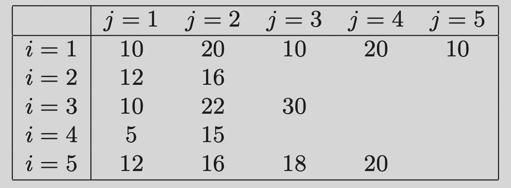

# 实验分析的表格微积分

> 原文：[`towardsdatascience.com/a-tableau-calculus-for-the-analysis-of-experiments-53655dd04eb8`](https://towardsdatascience.com/a-tableau-calculus-for-the-analysis-of-experiments-53655dd04eb8)

## 解开实验分析的基本数据结构

[](https://dataneversleeps.medium.com/?source=post_page-----53655dd04eb8--------------------------------)[](https://towardsdatascience.com/?source=post_page-----53655dd04eb8--------------------------------) [Jared M. Maruskin, PhD](https://dataneversleeps.medium.com/?source=post_page-----53655dd04eb8--------------------------------)

·发布在[Towards Data Science](https://towardsdatascience.com/?source=post_page-----53655dd04eb8--------------------------------) ·21 min read·2023 年 10 月 3 日

--


照片由[Markus Spiske](https://unsplash.com/@markusspiske?utm_source=medium&utm_medium=referral)拍摄，发布在[Unsplash](https://unsplash.com/?utm_source=medium&utm_medium=referral)

实验分析通常涉及分析包含不同数量元素的组；例如，每个层次中的每种处理分配的单位数量不同。因此，我们遇到的对象*类似于矩阵*，但它们不是完美的矩形块；即，它们并不总是“填满”。

在这篇笔记中，我们定义了一种新的结构，称为*表格*，它可以被视为部分填充的矩阵，并寻求形式化在实验分析中使用的表格操作。我们然后展示了如何在各种统计背景中使用*表格符号*来表达关键方程，包括分层、聚类和平方和分解。此外，我们将这些方程以*不变*和*索引*形式表达：

1.  *不变符号（无坐标形式）* — 以*对象*和*运算符*的形式定义，就像矩阵-向量积 A⋅x 一样，

1.  *索引符号（坐标形式）* — 明确以索引数组和多重索引的求和形式定义，就像将矩阵-向量积表示为*∑ⱼAᵢⱼ xⱼ*一样。

## 大纲

本文由四个主要部分组成：

1.  经典符号的回顾，优缺点；

1.  表格微积分的理论发展；

1.  实验的应用（完全随机化、块随机化、调整公式、集群随机化、块集群和 ANOVA 平方和分解）；

1.  Python 实现

# 经典符号：优缺点

在实验分析中，常用的符号风格有三种：

1.  *经典记号* — 处理分配被明确列出：单元*(ijk)*描述了第*i*个处理组第*j*层中的第*k*个单元（见 [1]，[2] 和 [5]）；

1.  *分配记号* — 分配机制被视为一个独立变量，我们考虑对 *ZᵢYᵢ* 或 *Zᵢⱼ Yᵢⱼ* 等量的求和（见 [2]，[3] 和 [4]）；和

1.  *集合记号* — 显式变量指代处理和对照集合；*Yᵗ* 和 *Yᶜ*，或者 *Y⁺ⱼ* 用于第 *j* 个簇的总和，然后 *Y⁺ₜ* 和 *Y⁺_c* 用于处理和对照簇的总和集合，等等（见 [5]）。

经典记号允许以最紧凑的方式表达公式，因为处理分配在响应数组中直接索引，这在描述分层、多层实验和方差分析中非常有用。然而，这种记号在哲学上令人不安，因为单元的列举直接依赖于处理分配。

另一方面，分配记号列举了单元而不考虑处理分配，但需要一个辅助的分配机制 *Z* 和双倍的多重求和，其中一组求和包含因子 *Z*，另一组则包含因子 *(1-Z)*。这一点的不足之处在于不适用于多层次设计。

最后，集合记号大大简化了问题，但需要为每个不同的集合提供特殊定义：在聚类中，*Y⁺ⱼ* 是第 *j* 个簇的总和，*Y⁺ₜ={Y⁺ⱼ : zⱼ=1}*，但这些在区组设计中未使用；即我们必须不断定义不同的记号来指代不同的组、子组或单一基本对象的总和。

Tableau 记号力求兼具各方面优点：其基本世界观与分配记号一致，但我们定义了一种称为 tableau 的结构以及一组操作，这使得可以以不变的形式书写方程，这样可以在不同背景下理解而无需每次定义特定集合。此外，我们将分配机制的全新解释视为*掩码*，从而可以考虑包含处理和对照分配的*子表格*，然后在这些子表格上应用基本操作以表达关键统计公式。

# Tableau 记号

## 入门：表格、形状和索引空间

记住，*l* 维矩阵是由其边长*(n₁, …, nₗ)*指定的矩形数组结构。其 *n₁…nₗ* 组件由一个索引空间索引。

一个 *l* 维 *tableau* *T* 是一个由正整数数组的有限集合 *I ⊂ ℤˡ₊* 中的值索引的 *l* 维数组。所以 tableau 只是一个部分填充的矩阵。

我们说一个表格 *T* 是 *标准形式* 如果每个索引的范围从 1 到某个终端整数（没有跳过），并且索引 *iₖ* 的范围仅依赖于 *（k-1）* 个前面的索引的值。一个 *l*-维标准形式的表格可以由其 *形状 ηˡ* 描述，*ηˡ* 本身是一个 *(l-1)*-维标准表格，定义为当且仅当 *ι=(i₁,…,iₗ)∈I* 当且仅当 *(i₁,…,iₗ₋₁)∈I(ηˡ)* 且 *iₗ ∈ {1,…, ηˡ_{i₁,…,iₗ₋₁}}*。

或者，形状由一系列表格 *⟨η¹,…,ηˡ⟩* 给出，其中 *ηᵏ* 是一个 *(k-1)*-维表格，通过递归地定义为 *ηᵏ⁺¹* 的形状，适用于 *k=(l-1),…,1*。因此，表格 *ηᵏ* 确定了索引 *iₖ* 的范围，因为它依赖于前面的索引。这通过关系 *i₁∈{1,…η¹}* 递归地定义了索引空间。

对于 *k=2, …, l*。注意每个索引的范围可能依赖于前面的索引的值。

在实验中，我们总是 *从标准形式开始*；即，标准形式是对集群、层次等中的实验单元的枚举。然而，我们的表格定义更为一般，以适应我们稍后将遇到的其他结构（即 *掩蔽表格*，在实验的背景下，它们是分配给处理或对照的组件的子集；更多内容稍后介绍）。

**示例 1\.** 作为一个简单的例子，考虑一个形状为 *η³* 的三维表格 *T*，如下所示。



表 1\. 三维表格 T 的形状 η³；图像由作者提供。

这里，*η¹=5*，而 *η²=⟨ 5, 2, 3, 2, 4 ⟩* 表示每行中的元素数量。例如，当 *i=3* 和 *j=2* 时，组件 *k* 的范围是 *k=1,…, 22*，依此类推。

## p-单元格；外部和内部索引空间

对于任何 *p=1, …, l*，一个表格 *T* 的 *p*-单元格是一个子表格，包含所有共享前 *p* 个组件的单元；即，单个 *p*-单元格由 *ιₚ = (i₁, …, iₚ)* 指定，我们称之为 *T_[i₁, …, iₚ]*。在实验的背景下，*cells*，不参考 *p*，通常被假定为 *倒数第二单元格*，其中 *p=l-1*。一个 *p*-单元格是一个 *q*-维表格，*q=l-p*，在空间上进行索引。

我们将其称为 *外部索引空间* 在 *ιₚ*。所有 *p*-单元格的集合由 *内部索引空间* 进行索引。

其中 *Πₚ* 是投影算子。这样，对于任何 *p*，我们可以 *loosely* 将索引空间看作 *bundle structure*

其中 *I_[ιₚ]* 的纤维根据基点 *ιₚ* 的位置而变化。(*注意：我使用这个词* loosely*，因为这些纤维虽然维度相同，但在基空间中位置变化时形状通常不同，这就是它们依赖于 ιₚ* 的原因。)

在继续前一节的例子时，*(3,2)* 处的单元将包含未显示的 22 个组件的一维数组，而 *(3,1)* 处的单元仅包含 10 个组件。内部空间 *I₂* 包含表中显示的 *(ij)* 的 16 种排列。

类似地，*i=4* 处的 1-单元将是一个 2-维表，由外部空间 *i=4* 索引，给出 {*1}* × *{1,…,5} ∪ {2} × {1,…,15}*。内部空间 *I₁* 只是行的枚举：*I₁={1,2,3,4,5}*。

## 总和与部分和

一个表 *T* 的 *总和*，记作 *T*∘，是其所有组件的总和。

给定的 *p*-单元 *(i₁…iₚ)* 的总和称为 *q*-部分和的 *T*，因为它需要 *q=l-p* 次求和，并由以下定义

第二个等式在 *T* 处于标准形式时成立。

因此，对于给定的 *p*，我们可以构造一个由所有 *q*-部分和组成的 *p*-表，用 *⊕_q T* 或 *T_(q)* 表示，其中 *ιₚ* 组件被定义为

对于所有 *ιₚ ∈ I*。

总结来说，对于 *p+q=l*：

+   一个 *p*-单元在 *ιₚ* 处是一个定义在外部索引空间 *I[ιₚ]* 上的 *q*-维子表 *T_[ιₚ]*，其中前 *p* 个索引保持固定；并且

+   第 *q* 个部分和 *⊕_qT* 或 *T_(q)* 是一个定义在内部索引空间 *Iₚ* 上的 *p*-维表，作为单个 *p*-单元的总和。

通常情况下，每当我们有一个操作符 *𝒪* 对一个 *p*-单元进行作用时，它会作用于 *q*-维的 *外部索引空间*（即，纤维），而结果则在 *p*-维的 *内部索引空间*（即，基）中变化；例如，我们会将量 *𝒪(T_{[ιₚ]})* 视作 *Iₚ* 上的 *p*-表。

## 单位表和计数

一个 *单位表* 是一个常数表，值为 1。给定一个表 *T*，其关联的单位表 *U* 只是一个具有相同形状的单位表。*U* 的部分和是对应的 *p*-单元的计数：

当我们希望以不变形式引用此表时，我们将其称为 *nᵖ*。

## 平均值和方差

对于任何具有 *n=|T|* 组件的表 *T*，我们可以将其平均值定义为

及其加权平均值为

注意，*平方* *(T — μ(T))²* 形成了一个与 *T* 具有相同形状的表。因此，我们定义以下 *平方和*：

（标准和加权；请注意，与加权平均的定义不同，这里的权重*不是*自动归一化的）。最后，样本方差和方差：

当对单独的 *p*-单元应用这些操作时，我们将 *p*-单元视为固定，作为操作的目的，但在操作完成后允许 *p*-单元通过 *Iₚ* 变化。例如，*SS(T_[i₁ … iₚ])* 应被视为在内部空间 *Iₚ* 上的 *p*-表，尽管实际的平方和操作是在单个外部空间 *I_[i₁…iₚ]* 上进行的。

## 表的加法和乘法：特殊情况

加法和乘法通常按组件定义（在特殊的矩阵情况下，减少为矩阵和及 Hadamard 乘积）。然而，有两个特殊情况。

考虑两个 tableaus *T* 和 *S*，它们的索引空间分别为 *I_T* 和 *I_S*。那么 *外部和 T+S* 在联合索引空间 *I_T ∪ I_S* 上定义，采用的约定是 *x +* **null** *= x*。

如果 *A* 是在一个更高维度的第二个 tableau *T* 的内部索引空间 *Iₚ* 上定义的 *p*-tableau，那么 (外部投影) 乘积 *AT* 按自然方式定义：

即，tableau *A* 被“投射”到更高的空间，然后按组件进行乘法。（这在群体随机化的背景下会很有用，因为分配是在群体级别进行的，因此表示一个比完整响应 tableau 更低维度的 tableau。）

## 掩码

tableau *T* 的 *掩码 M* 是具有相同形状的二进制 tableau，或任何内部索引空间的形状。其补集也是一个掩码，由 *Mᶜ=1-M = ¬M* 定义。

一个掩码及其补集的和构成单位 tableau，从而创建一个分区。一般来说，如果 *{M₁, …, Mₘ}* 形成 *I* 的一个分区，当且仅当 *M₁+…+Mₘ = U*，其中 *U* 是 *I* 上的单位 tableau。（注意使用*外部和*，因为掩码定义在索引空间的互斥子集上。）

*掩码 tableau* *MT*（也可写作 *T[M]*）是通过将索引空间限制为集合形成的 *T* 的子 tableau

与逐项乘法不同，掩码 tableau 的大小不是原始 tableau 的大小，而是缩减空间的大小，这等同于掩码的总和：*|MT| = M∘*。

*注意：在我们的定义中，掩码的真值选择了底层 tableau 的“活动”组件，这与 numpy 掩码数组使用的相反约定不同*。

# Tableau 试验的记号

关于实验，

1.  实验设计包括确定形状 *η* 和选择分配机制 *Z* 的随机化程序，通常由其固定的部分和约束，我们将用 *a* 表示；

1.  各个单元的反应存储在形状为 *η* 的 tableau *Y* 中；以及

1.  分配机制 *Z* 是 *Y* 上的一个掩码。

如果我们考虑 *潜在结果* Y(1)=Y(Z=1) 和 Y(0)=Y(Z=0)，实际反应由下式给出

*Y = ZY(1) + (1-Z)Y(0)。*

注意这里提供的解释差异：*ZY(1)* 和 *(1-Z)Y(0)* 是 *掩码* 潜在结果，因此它们在各自不重叠的子 tableaux 上定义。

一般来说，实验的目标是估计 *总处理效应*（我将称之为 *Δ* 或 *τ*）：

然而，这种情况是不可观察的，因为我们只能知道任何单一实验单元下的处理反应或对照反应。

对于具有 *m* 种可能处理分配（包括对照）的多级实验，我们让 *Z* 为一个 *分类表格*，其中类别编号为 *1, …, m*，然后定义掩码集

对于 *z=1,…, m*，我们可以将潜在结果公式表示为

## 完全随机设计

在完全随机设计中，我们考虑一组 *n* 单元，其中我们将随机分配 *a* 到处理组。响应 *Y* 是一个范围为 *i=1,…, n* 的一维表格，分配机制 *Z* 是一个相同大小的一维掩码，从空间 *𝔹ⁿ* 随机选择，满足约束 *||Z||₁ = a*。如果我们定义处理和对照的掩码表格为

我们可以将经典的 *均值差异估计量* 表示为：

注意我们对 *Yᵗ* 和 *Yᶜ* 的解释为响应表格的子表格。因此，处理和对照平均值可以用索引符号表示为

由于我们将 *ZY* 解释为掩码表格，我们除以 *a=Z∘*，即处理单元的数量，而不是 *n*；对 *(1-Z)Y* 也是类似。

*T* 统计量定义为

其中组内均方误差定义为

注意，我们只是对通过分配掩码及其补充获得的处理和对照子表格应用平方和操作。在坐标中，这可以表达为

在无效假设下，检验统计量 *T* 服从自由度为 *n-2* 的 *t* 分布。

## 块随机设计

在块随机设计中，我们首先将实验单元划分为 *s* 个层次。然后，我们通过 *(ij)* 索引这些单元，其中 *i=1,…,s* 表示层次，*j=1,…,nᵢ* 表示第 *i* 个层次中的第 *j* 个元素。接下来，我们施加约束，随机分配 *aᵢ* 单元到第 *i* 个层次的处理组，满足 *平衡属性*，要求每个层次包含相同比例的处理单元；即，倾向 *πᵢ=aᵢ/nᵢ* 与 *i* 独立。（这对于上述定义的均值差异估计量是无偏的。）

我们的单元安排定义了一个 *l*-形 *η=⟨s, nᵢ⟩*，因此我们的分配机制 *Z* 是在形状为 *η* 的二维表格上随机选择的，满足 *aᵢ=Zᵢ∘= π nᵢ* 是固定的。

*T* 统计量的公式保持不变，只是现在处理和对照的平均值由以下给出

MSW 由以下给出

注意，平方和操作作用于 1-单元，在每个层次上固定，并被分配机制（处理）或其补充（对照）掩盖。在索引符号中，这等价于

处理和对照层次的平均值以明显的方式定义：

注意我们之前提到的：平均操作在 *外部索引空间* 上进行，因为它作用于 *i* 的 1-单元。结果可以在 *内部索引空间* 上变化，由 *I_1={1, …, s}* 定义。

在无效假设下，测试统计量*T*的分布为具有*n-2s*自由度的*t*分布。

## 调整公式

当*平衡属性*不成立时，这在观察性研究（*自然实验*）中常见，我们用*调整公式*替代上述定义的均值差异估计量：

调整公式是通过取每个层次观察到的经典*均值差异*估计量的*加权*平均来获得的，使用每个层次中单位数*nᵢ*作为权重。

## 集群随机化设计

集群随机化类似于区组设计，只不过分配是在*集群级别*进行的，而不是在每个层次内的单独单位级别。这在准实验中很常见，当个体级别的随机化不切实际或不可能时；例如，在*户外（OOH）*市场推广活动中，随机化可能在*城市*级别进行。

在这种情况下，我们的响应是一个 2 维表格*Y*，范围为*i=1,…, c*和*j=1,…, nᵢ*，其中*i*个集群中有*nᵢ*个单位，每个*c*个集群。

然而，分配机制是一个 1 维表格*Z*，在内索引空间*I₁={1,…,c}*上随机定义，受约束*||Z||₁=a*。注意“外部乘法”规则的重要性，因为我们的掩蔽响应仍然可以通过*Yᵗ = ZY*和*Yᶜ = (1-Z)Y*来描述。还要注意，变量*a=Z∘*表示分配到治疗组的*集群总数*。这是合理的，因为治疗单位是*集群*，而不是个体。总体治疗效果的估计量以其不变形式给出

注意，部分和首先计算，然后在治疗和对照集群之间平均。（右侧版本在这里可能更直观，尽管左侧是“最”不变形式。）

这只是使用治疗集群的*a/c*倾向和对照集群的*(a-c)/a*倾向的汤普森-霍维茨估计量的一个应用。在索引符号中，这等同于

## 区组集群随机化设计

在区组-集群设计中，集群首先被分组到层次中。这在例如将类似大小的城市分组到一个国家内时可能是有用的，以确保治疗分配的平衡。

*(ijk)*处的个体是集群*(ij)*中的*k*个单位，集群*(ij)*是层次*i*中的*j*个集群，其中*i=1,…,s*，*j=1,…,cᵢ*，*k=1,…,nᵢⱼ*。因此，响应由形状为*η=⟨s, cᵢ, nᵢⱼ⟩*的 3 维表格*Y*描述。分配机制*Z*是形状为*η=⟨s, cᵢ⟩*的 2 维表格；即，在内空间*I₂*上随机选择，受限于在*i*层次内的*aᵢ*集群被分配到治疗组，产生*πᵢ=aᵢ/cᵢ*的倾向。

给定我们的外部案例乘法规则，掩蔽量*Yᵗ=ZY*和*Yᶜ=(1-Z)Y*仍然是有意义的。

总体治疗效果的估计由下式给出

注意这个公式、简单簇公式和调整公式之间的相似性。我们首先在每个簇内执行第一次部分和*before*平均；接下来，在每个层内对簇进行平均（因此分别除以*aᵢ*和*cᵢ-aᵢ*），最后，我们应用调整公式以在层间进行平均。

详细分解这些操作：

1.  *Yᵗ=ZY* 是掩蔽的子表格，由处理单元组成，一个 3 维表格仍然按*(ijk)*枚举；

1.  *⊕₁Yᵗ* 是第一次部分和，通过对*(ij)*簇内所有处理单元的响应求和得到，从而得到一个*聚合响应*的 2 维表格；

1.  *⊕₁Yᵗ_[i]* 是 1-单元（由*j*索引），由每个处理簇内的聚合响应组成；

1.  *μ(⊕₁Yᵗ_[i])* 是通过对每层的簇级聚合响应进行平均得到的，得到一个按层* i* 索引的 1 维表格；

1.  最终平均值是加权的层平均值，计算公式为*μ(⊕₁Yᵗ_[i]) — μ(⊕₁Yᶜ_[i])*。

在索引符号中，这等价于

这有点像魔法。

## 方差分析平方和分解

在方差分析（ANOVA）中，我们关心的是总平方和的分解，分为组间平方和和组内平方和。这里，我们有*m*组，其中第*i*组有*nᵢ*个单元。响应*Y*按*(ij)*的范围进行索引。

总平方和（SST）由以下公式给出

分解规则表明这等同于组间平方和（SSB）和组内平方和（SSW）的总和。SSW 由以下公式给出

（注意这与我们在块随机设计中获得的 MSW 公式相匹配。）平方和应用于各个 1-单元（组），结果在组间汇总。

SSB 由以下公式给出

这里，首先计算组平均值，然后在组平均值上进行（加权）平方和操作。

用表格符号表示，平方和分解由以下公式给出

# Python 实现

以下提供了 Python 实现。它由三个类组成：一个 Tableau 类，接着是 CountTableau 和 Mask 类的子类。每个 Tableau 对象构造一个 CountTableau 对象，用于获取单元计数。Mask 类重写了 __init__ 方法，以断言传入的所有值都是布尔值，并重写了 __mul__ 方法，以修改被掩蔽的返回对象的计数。

```py
class Tableau:

    def __init__(self, dim, values):
        self.dim, self.p = dim, dim
        self.values = copy.deepcopy(values)
        self.count = CountTableau(dim, values)

    def __len__(self):
        return self.count.sum()

    def __bool__(self):
        return (len(self) > 0)

    def __getitem__(self, key):
        """ Returns p-cells if dim(key) < self.dim """
        key = [key] if isinstance(key, int) else list(key)
        if len(key) > self.dim:
            key = key[:self.dim]
        dim_out = self.dim - len(key)
        while len(key) < self.dim:
            key.append(slice(None, None, None))
        out = self.values.copy()
        while key:
            out = out[key.pop(0)]
        if dim_out == 0:
            return out 
        return Tableau(dim_out, out)

    def __setitem__(self, key, value):
        key = [key] if isinstance(key, int) else list(key)
        if isinstance(value, Tableau):
            assert len(key) + value.dim == self.dim 
            value = value.values
        def recursive_set(A, key, value):
            i = key.pop(0)
            if key:
                recursive_set(A[i], key, value)
            else:
                A[i] = value
        recursive_set(self.values, key, value)

    def __contains__(self, loc):
        try:
            self[loc]
            return True 
        except:
            return False

    def __call__(self, p):
        self.p = p 
        return self

    def __iter__(self):
        """ for i, x in T(p):  will iterate i in I_p, and return p-cells. """
        def recursive_loop(A, dim, loc=None):
            if loc is None:
                loc = [0] * self.p
            if dim < self.p-1:
                for i, x in enumerate(A):
                    loc[dim] = i
                    yield from recursive_loop(x, dim+1, loc)
            else:
                for i, x in enumerate(A):
                    loc[dim] = i 
                    yield loc 
        for index in recursive_loop(self.values, 0):
            yield tuple(index), self[index]
        self.p = self.dim 

    def __add__(self, other):
        """ Self may be higher dimension than other """
        new = Tableau(self.dim, copy.deepcopy(self.values))
        if np.isscalar(other):
            for i, _ in new:
                new[i] += other 
            return new 
        assert other.dim <= self.dim
        for i, x in other:
            if i in new:
                new[i] = new[i] + x
        return new 

    def __sub__(self, other):
        new = Tableau(self.dim, copy.deepcopy(self.values))
        if np.isscalar(other):
            for i, _ in new:
                new[i] -= other 
            return new 
        assert other.dim <= self.dim

        for i, x in other:
            if i in new:
                new[i] -= x 
        return new         

    def __mul__(self, other):
        """ Self may be lower dimension than other """
        if np.isscalar(other):
            new = Tableau(self.dim, copy.deepcopy(self.values))
            for i, _ in new:
                new[i] *= other 
            return new 

        assert self.dim <= other.dim 
        new = Tableau(other.dim, copy.deepcopy(other.values))
        for i, x in self:
            new[i] *= x 
        return new 

    def __truediv__(self, other):
        if np.isscalar(other):
            new = Tableau(self.dim, copy.deepcopy(self.values))
            for i, _ in new:
                new[i] /= other 
            return new         
        assert self.dim == other.dim 
        new = Tableau(self.dim, copy.deepcopy(self.values))
        for i, x in other:
            new[i] /= x
        return new        

    def __pow__(self, n):
        """ Defines Square of Tableau """
        assert n==2 
        return self * self

    def getPShell(self, p):
        shell = Tableau(p, copy.deepcopy(self.values))
        for i, _ in self(p):
            shell[i] = None 
        return shell

    def sum(self, p=0):
        if p == 0:
            total = 0
            for _, x in self:
                total += x 
            return total 
        S = self.getPShell(p)
        for i, x in self(p):
            S[i] = x.sum()
            if not isinstance(self, CountTableau) and not any(self.count[i].values):
                S.count[i] = 0
        return S 

    def mean(self, p=0, weights=None):
        if weights is None:
            return self.sum(p) / self.count.sum(p)
        weights /= weights.sum()
        Tw = weights * self
        return Tw.sum(p)

    def sumSquares(self, p=0, weights=None):
        if weights is None:
            S = (self - self.mean(p))**2 
        else:
            S = weights * (self - self.mean(p, weights=weights))**2
        return S.sum(p)

class CountTableau(Tableau):

    def __init__(self, dim, values):
        self.dim, self.p = dim, dim
        self.values = copy.deepcopy(values)
        for i, _ in self:
            self[i] = 1

class Mask(Tableau):

    def __init__(self, dim, values):
        super().__init__(dim, values)
        for _, x in self:
            assert x in (0, 1)

    def __len__(self):
        return self.sum() 

    def __mul__(self, other):
        new = super().__mul__(other)
        new.count = super().__mul__(new.count)
        return new 

    def __neg__(self):
        """ Use (-M) for logical negation of M """
        new = Mask(self.dim, copy.deepcopy(self.values))
        return new * (-1) + 1
```

__iter__ 方法使用递归遍历表格，以键值对的形式（类似于 enumerate(some_list)或 k, v in some_dict.items()）。此外，我们实现了 __call__ 方法，可以与迭代结合使用，这样**for k, v in T(2):** 就会遍历内层索引空间*I₂*，返回每个*ιₚ∈ I₂*的纤维*T_{ιₚ}*。

类似地，*mean*和*sumSquares*方法都接受一个可选的参数*p*，计算将会在纤维上进行，并返回一个在内索引空间上的*p*-维 tableau。

如果*A*的维度高于*B*，则定义*A+B*，这对于平方和计算是必需的。乘法则相反，只要*A*的维度低于*B*，则定义*AB*。这对于与低维掩码的左乘兼容性是必需的，这在聚类分析中是必需的。

我们还实现了 __getitem__ 和 __setitem__。前者有一些酷炫的地方，与嵌套数组不同，我们可以使用符号 T[1,2,3]来获取位于*(1,2,3)*的*p*-单元。（我们甚至不需要用*:*填充其余维度；例如，对于 5 维的 tableau，*T[1,2,3]*就可以，而无需写*T[1,2,3,:,:]*！这比处理原始嵌套数组更好，后者需要 A[1][2][3]。）__setitem__ 使用递归设置值，您甚至可以在这里传递一个适当形状的子 tableau。

基本操作如下所示。

```py
def genx(n, maxval=100):
    return list(np.random.randint(0, maxval+1, size=n))

A = [[genx(2), genx(3), genx(4), genx(2), genx(2)], [genx(3), genx(4)], [genx(3), genx(2), genx(3)], [genx(5), genx(1)], [genx(2),genx(4),genx(3),genx(2)]]
T = Tableau(3, A)

for i, x in T(2):
    print(i, x.values)

# Outputs (contains all 2-cells of the tableau; indexed over I_2)
# (0, 0) [31, 75]
# (0, 1) [43, 57, 23]
# (0, 2) [47, 53, 38, 82]
# (0, 3) [69, 87]
# (0, 4) [65, 23]
# (1, 0) [42, 49, 8]
# (1, 1) [61, 13, 69, 37]
# (2, 0) [88, 84, 45]
# (2, 1) [21, 64]
# (2, 2) [83, 21, 83]
# (3, 0) [72, 42, 54, 83, 43]
# (3, 1) [3]
# (4, 0) [14, 55]
# (4, 1) [87, 49, 93, 65]
# (4, 2) [94, 95, 15]
# (4, 3) [27, 71]

T[4].values # same as T[4, :, :].values; returns a 2-tableau
# [[14, 55], [87, 49, 93, 65], [94, 95, 15], [27, 71]]

T[4, 1].values # returns a 1-tableau
# [87, 49, 93, 65]

T[4,1,3] # returns a scalar
# 65 

B = [[genx(2,1), genx(3,1), genx(4,1), genx(2,1), genx(2,1)], [genx(3,1), genx(4,1)], [genx(3,1), genx(2,1), genx(3,1)], [genx(5,1), genx(1,1)], [genx(2,1),genx(4,1),genx(3,1),genx(2,1)]]
M = Mask(3, B)

MT = M * T
len(T), len(M), M.sum(), len(MT)
# (45, 25, 25, 25)

MT.mean() # average of treatment values only
# 52.16
MT.sumSquares(1).values # sum-of-squares at the 1st level
# [19443.3125, 6934.4375, 9796.0, 6443.0, 30566.75]

MT[4].values  # compare with T[4].values, above; this is randomly masked
# [[0, 0], [87, 49, 0, 0], [0, 95, 15], [0, 0]]
```

下面给出了一个块设计的模拟。我们使用了 5 个层次，处理倾向为 30%。在我们的模拟中，处理效应是一个恒定的 10；层次响应服从标准差为 10 的正态分布，层次均值按 10 的增量分隔。每个层次包含 400 到 500 之间的随机单位。我们测量了均值差异为 9.7，并以 95%的置信度拒绝了原假设。

```py
n_strata = 5
pi = 0.3
shape = np.random.randint(400,500, size=n_strata)
n_t = (shape * pi).astype(int)
n_c = shape - n_t
A = [ list(np.random.normal(50+10*i, 10, size=shape[i]))  for i in range(n_strata)]
Z = [ list(np.random.choice([1]*n_t[i] + [0]*n_c[i], size=shape[i], replace=False )) for i in range(n_strata)]

Y = Tableau(2, A)
Z = Mask(2, Z)

Y = Y + (Z * 10)  # add a treatment effect of 10 to treated units

Yt = Z * Y 
Yc = (-Z) * Y

tau_hat = Yt.mean() - Yc.mean()
print(tau_hat)
# 9.74

dof = len(Y) - 2 * n_strata

MSW = (Yt.sumSquares(1).sum() + Yc.sumSquares(1).sum()) / dof
T = tau_hat / sqrt(MSW * (1/len(Yt) + 1/len(Yc)))

T_crit = scipy.stats.t.isf(0.05, dof)
print(T, T_crit, T > T_crit)
#  2.71, 1.65, True
```

最后，给出了一个聚类设计的示例。

```py
n_cluster = 10
pi = 0.5
c_t = int(pi * n_cluster)
c_c = n_cluster - c_t
shape = np.random.randint(40,50, size=n_cluster)

A = [ list(np.random.normal(50+1*i, 10, size=shape[i]))  for i in range(n_cluster)]
Z = list(np.random.choice([1]*c_t + [0]*c_c, size=n_cluster, replace=False ))

Y = Tableau(2, A)
Z = Mask(1, Z)

Y = Y + (Z * 10)  # add a treatment effect of 10 to treated units

Yt = Z * Y 
Yc = (-Z) * Y

tau_hat = n_cluster / len(Y) * ( (Yt.sum(1)).mean() - (Yc.sum(1)).mean() )
print(tau_hat)
# 15.975
```

关于聚类示例的一些说明。首先，我们让聚类均值非常接近。层次化的估计量方差主要依赖于层次内的方差，而在聚类的情况下，它依赖于聚类间的方差。由于我们仅模拟了少量聚类，这是一项非常低功效的结果。最后，请注意，`tau_hat`的公式之所以有效，是因为我们*Tableau*类的*sum*方法末尾的*if not any*逻辑；否则部分和会重置计数表，这会导致除以总聚类数，而不是被掩盖的聚类数。

但我们能否抵挡住做一个块聚类设计的示例？在这里，我们让聚类均值按层次变化，并展示如何实现块聚类公式。

```py
n_strata = 3 
c_shape = [4, 8, 12]
cw = Tableau(1, c_shape)
a_t = [2, 4, 6]

A = [ [  list( np.random.normal(50 + 10 * i, size=np.random.randint(100,200)) )  for j in range(c_shape[i])  ]    for i in range(n_strata)]
Z = [  list( np.random.choice([1]*a_t[i] + [0]*a_t[i], size=c_shape[i], replace=False)    )  for i in range(n_strata)]

Y = Tableau(3, A)
Z = Mask(2, Z)

Y = Y + (Z * 10)

Yt = Z * Y 
Yc = (-Z) * Y

tau_hat = sum(c_shape) / len(Y) * (Yt.sum(2).mean(1) - Yc.sum(2).mean(1)).mean(weights=cw) 
print(tau_hat)
#16.64
```

# 结论

我们定义了一个显式的代数结构叫做*tableau*，它本质上是一个部分填充的矩阵，并对其进行了各种操作。

对于给定维度*p*，我们定义了内外索引空间，并展示了如何在外索引空间上应用操作符对*p*-单元进行操作，返回在内索引空间上变化的量。

我们通过检查各种关键统计公式（均值差异、*T*统计量、集群随机化的估计处理效果、组内和组间平方和），展示了这些基本操作如何促进实验分析，并将其转化为不变形式和指数形式。

最后，我们提供了我们的 Tableau 数据结构的 Python 实现，并展示了如何使用几行代码执行关键公式。

# 参考文献

[1] P.D. Berger, R.E. Mauer, 和 G.B. Celli, *实验设计：在管理、工程和科学中的应用*（2018 年），第 2 版，Springer。

[2] J. Maruskin, [*数据科学三部曲：实验、模型、学习*](https://www.amazon.com/Fundamentals-Data-Science-Trilogy-Experiment-Model-Learn/dp/1941043038/ref=sr_1_5?crid=23E5N6RECFXJF&keywords=jared+maruskin&qid=1695921221&sprefix=jared+maruski%2Caps%2C245&sr=8-5)（2022 年），Cayenne Canyon Press。

[3] P.R. Rosenbaum, *观察研究*（2002 年），第 2 版，Springer。

[4] P.D. Rosenbaum, *观察研究的设计*（2020 年），第 2 版，Springer。

[5] M. Saveski, J. Pouget-Abadie, G. Saint-Jacques, W. Duan, S. Ghosh, Y. Xu, E.M. Airoldi, [检测网络效应：在随机化实验中随机化](https://www.kdd.org/kdd2017/papers/view/detecting-network-effects-randomizing-over-randomized-experiments)（2017 年），KDD 研究论文，哈利法克斯，加拿大。

[6] D. Selvamutha 和 D. Das, *统计方法、实验设计和统计质量控制导论*（2018 年），Springer。

*除非另有说明，所有图片均由作者提供。*
