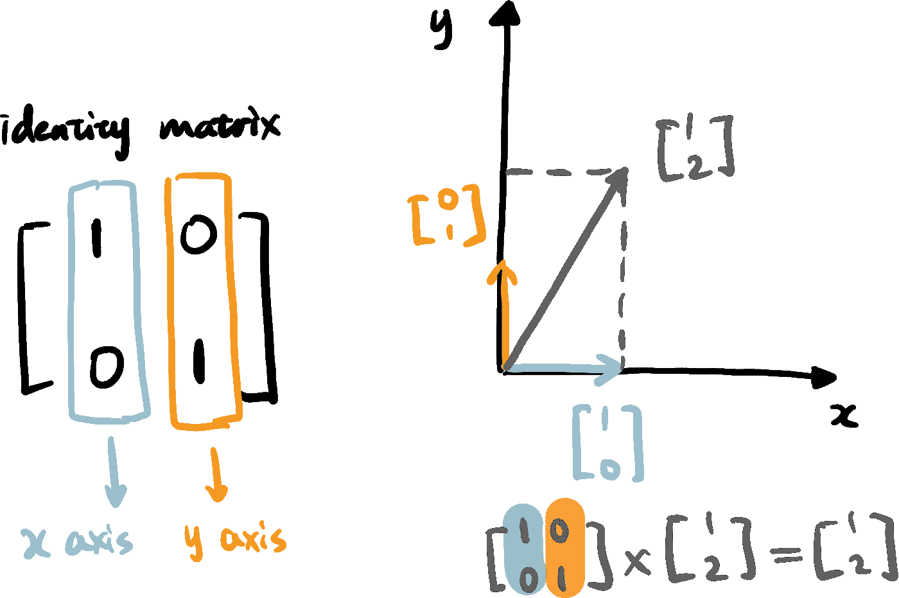

# 视觉学习者指南：解释、实现和解读主成分分析（PCA）

> 原文：[`towardsdatascience.com/a-visual-learners-guide-to-explain-implement-and-interpret-principal-component-analysis-cc9b345b75be`](https://towardsdatascience.com/a-visual-learners-guide-to-explain-implement-and-interpret-principal-component-analysis-cc9b345b75be)

## 机器学习中的线性代数——协方差矩阵、特征向量和主成分

[](https://destingong.medium.com/?source=post_page-----cc9b345b75be--------------------------------)[](https://towardsdatascience.com/?source=post_page-----cc9b345b75be--------------------------------) [Destin Gong](https://destingong.medium.com/?source=post_page-----cc9b345b75be--------------------------------)

·发表于[Towards Data Science](https://towardsdatascience.com/?source=post_page-----cc9b345b75be--------------------------------) ·阅读时间 11 分钟·2023 年 1 月 25 日

--


主成分分析在机器学习中的应用（图片来自我的[网站](https://www.visual-design.net/)）

在我之前的文章中，我们讨论了线性代数在数据表示中的应用，但线性代数在机器学习中的应用远不止于此。

[](/how-is-linear-algebra-applied-for-machine-learning-d193bdeed268?source=post_page-----cc9b345b75be--------------------------------) ## 线性代数如何应用于机器学习？

### 从使用矩阵和向量进行数据表示开始

towardsdatascience.com

本文将介绍更多的线性代数概念，主要关注这些概念如何应用于降维，特别是**主成分分析（PCA）**。在文章的后半部分，我们还将使用 Python scikit-learn 库中的几行代码来实现和解释 PCA。

# 何时使用 PCA？

高维数据是机器学习实践中常见的问题，因为我们通常会提供大量特征用于模型训练。这会导致模型可解释性降低和复杂度增加，这也被称为维度诅咒。当数据集是高维的（即包含许多特征）时，PCA（主成分分析）会有所帮助，并且它被广泛应用于降维。

此外，PCA 还用于发现特征之间的隐藏关系，并揭示可以非常有洞察力的潜在模式。PCA 试图找到线性成分，以捕捉数据中尽可能多的方差，第一个主成分 (PC1) 通常由对模型预测贡献最大的特征组成。

# PCA 是如何工作的？

PCA 的目标是找到表示数据方差的主成分，并将过程展开为以下步骤：

1.  使用 **协方差矩阵** 表示数据方差

1.  **特征向量和特征值** 捕捉低维度中的数据方差

1.  **主成分** 是协方差矩阵的特征向量

要理解 PCA 是如何工作的，我们需要回答协方差矩阵和特征向量/特征值是什么的问题。将矩阵乘法从数学操作的视角转变为视觉变换的视角也很有帮助。

## **矩阵变换**

我们之前介绍了从数学操作的角度计算矩阵点积的方法。我们还可以将点积解释为视觉变换，这有助于理解更复杂的线性代数概念。如下面所示，让我们以 2x2 矩阵为例。我们将矩阵垂直拆分为两个向量，其中左侧的向量表示 x 轴的基向量，而右侧的向量表示 y 轴的基向量。因此，矩阵表示由 x 轴和 y 轴构成的二维空间。



矩阵变换 — 单位矩阵（作者提供的图像）

不难理解，单位矩阵的 `[1,0]` 是 x 轴上的基向量，而 `[0,1]` 是 y 轴上的基向量，因此任何向量与单位矩阵的点积将返回向量本身。

矩阵变换归结为改变轴的尺度和方向。例如，将 x 轴的基向量从 `[1,0]` 改为 `[2,0]` 意味着映射空间在 x 坐标方向上缩放了两倍。


矩阵变换 — x 轴缩放矩阵（作者提供的图像）

我们还可以结合 x 轴和 y 轴进行更复杂的缩放、旋转或剪切变换。一个典型的例子是镜像矩阵，其中我们交换 x 和 y 轴。对于给定的向量 `[1,2]`，经过镜像变换后我们会得到 `[2,1]`。


矩阵变换 — 镜像矩阵（作者提供的图像）

如果你想在 Python 中练习这些变换并跳过手动计算，我们可以使用以下代码来执行这些点积，并使用 `plt.quiver()` 函数可视化变换结果。

```py
import numpy as np
import matplotlib.pyplot as plt
# define matrices and vector
x_scaled_matrix = np.array([[2,0],[0,1]])
mirror_matrix = np.array([[0,1],[1,0]])
v = np.array([1,2])
# matrix transformation
mirrored_v = mirror_matrix.dot(v)
x_scaled_v = x_scaled_matrix.dot(v)
# plot transformed vectors
origin = np.array([[0, 0], [0, 0]])
plt.quiver(*origin, v[0], v[1], color=['black'],scale=10, label='original vector')
plt.quiver(*origin, mirrored_v[0], mirrored_v[1] , color=['#D3E7EE'], scale=10, label='mirrored vector' )
plt.quiver(*origin, x_scaled_v[0], x_scaled_v[1] , color=['#C6A477'], scale=10, label='x_scaled vector')
plt.legend(loc ="lower right")
```


Python 中的矩阵变换结果（图像由作者提供）

## **协方差矩阵**

> *简而言之：协方差矩阵以矩阵形式表示一组变量之间的成对相关性。*

协方差矩阵是 PCA 过程中另一个关键概念，它表示数据集中数据的方差。要了解协方差矩阵的细节，我们首先需要知道**协方差衡量了一个随机变量与另一个随机变量变化的大小**。对于两个随机变量 x 和 y，它们的协方差公式如下，高协方差值表示两个变量之间的相关性更强。


协方差公式（图像由作者提供）

当给定数据集中的一组变量（例如 *x1, x2, … xn*）时，协方差矩阵用于以矩阵格式表示每对变量之间的协方差值。


协方差矩阵（图像由作者提供）

任何向量与协方差矩阵相乘将把它变换到捕捉原始数据集中方差趋势的方向。

让我们用一个简单的例子来模拟这种变换的效果。首先，我们随机生成变量 *x0, x1*，然后计算协方差矩阵。

```py
# generate random variables x0 and x1
import random
x0 = [round(random.uniform(-1, 1),2) for i in range(0,100)]
x1 = [round(2 * i + random.uniform(-1, 1) ,2) for i in x0]

# compute covariance matrix
X = np.stack((x0, x1), axis=0)
covariance_matrix = np.cov(X)
print('covariance matrix\n', covariance_matrix)
```


然后我们通过计算每个随机向量与协方差矩阵的点积来对这些向量进行变换。

```py
# plot original data points
plt.scatter(x0, x1, color=['#D3E7EE'])

# vectors before transformation
v_original = [np.array([[1,0.2]]), np.array([[-1,1.5]]), np.array([[1.5,-1.3]]), np.array([[1,1.4]])]

# vectors after transformation
for v in v_original:
    v_transformed = v.dot(covariance_matrix)
    origin = np.array([[0, 0], [0, 0]])
    plt.quiver(*origin, v[:, 0], v[:, 1], color=['black'], scale=4)
    plt.quiver(*origin, v_transformed[:, 0], v_transformed[:, 1] , color=['#C6A477'], scale=10)

# plot formatting
plt.axis('scaled')   
plt.xlim([-2.5,2.5])
plt.ylim([-2.5,2.5])
```


被协方差矩阵变换的向量（图像由作者提供）

变换前的原始向量为黑色，变换后的向量为棕色。正如你所看到的，指向不同方向的原始向量在变换后变得更加符合原始数据集中显示的一般趋势（即蓝色点）。由于这一特性，协方差矩阵在 PCA 中用于描述特征之间的关系非常重要。

## **特征值和特征向量**

> *简而言之：矩阵 (*A*) 的特征向量 (*v*) 在矩阵变换后保持相同的方向，因此* Av = λv *其中* v *代表相应的特征值。使用特征向量和特征值表示数据可以减少维度，同时尽可能保持数据的方差。*

为了更直观地理解这个概念，我们可以使用一个简单的示例。例如，我们有矩阵 `[[0,1],[1,0]]`，该矩阵的一个特征向量是 `[1,1]`，相应的特征值是 1。


特征向量和特征值（图像由作者提供）

从矩阵变换中，我们知道矩阵`[[0,1],[1,0]]`充当镜像矩阵，交换向量的 x 和 y 坐标。因此，向量`[1,1]`在镜像变换后方向不会改变，因此它符合成为矩阵特征向量的标准。特征值 1 表示向量在变换前后保持相同的尺度和方向。因此，我们能够使用标量*λ*（即 1 维）来表示矩阵变换* A*（即 2 维）的效果，特征值告诉我们特征向量保留了多少方差。

让我们继续使用上述示例，并使用此代码片段叠加具有最大特征值的特征向量（红色）。如你所见，它与数据方差最大的方向对齐。

```py
from numpy.linalg import eig
eigenvalue,eigenvector = eig(covariance_matrix)
plt.quiver(*origin, eigenvector[:,1][0], eigenvector[:,1][1] , color=['red'], scale=4, label='eigenvector')
```


可视化特征向量（图片来源于作者）

## **主成分**

现在我们已经讨论了协方差矩阵可以表示数据方差的情况以及特征向量可以在较低维度中捕捉数据方差。通过计算协方差矩阵的特征向量/特征值，我们得到主成分。一个矩阵有多个特征向量，它们通常按特征值的降序排列，用*PC1, PC2* …*PCn*表示。第一个主成分（*PC1*）是特征值最大的特征向量，即图片中显示的红色向量，它解释了数据中的最大方差。因此，在使用主成分降低数据维度时，我们选择特征值较大的那些，因为它们保留了原始数据集中的更多信息。

**感谢你阅读到这里。如果你想阅读更多我在 Medium 上的文章，我将非常感激你通过注册** [**Medium 会员**](https://destingong.medium.com/membership)☕**。**

# PCA 在机器学习中的实现

我们已经探讨了 PCA 背后的理论，现在让我们进入实际部分。幸运的是，scikit-learn 为我们提供了 PCA 的简单实现。我们将使用来自[fivethirtyeight](https://github.com/fivethirtyeight/data) GitHub 仓库的公开数据集“college major” [1]。

**1. 数据标准化到相同的尺度**

PCA 对不同尺度的数据非常敏感，因为协方差矩阵需要相同尺度的数据来测量特征之间的相关性。为了实现这一点，在 PCA 之前应用数据标准化，即每个特征的均值为零，标准差为一。我们使用以下代码片段进行数据标准化。如果你希望了解更多数据转换技术，如归一化、最小-最大缩放，请访问我关于“[数据转换的 3 种常见技术](https://medium.com/towards-data-science/data-transformation-and-feature-engineering-e3c7dfbb4899)”的文章。

[](/data-transformation-and-feature-engineering-e3c7dfbb4899?source=post_page-----cc9b345b75be--------------------------------) ## 3 种常见的数据变换技术

### 如何为您的数据选择合适的方法

[towardsdatascience.com

```py
from sklearn.preprocessing import StandardScaler
scaler = StandardScaler()
scaled_df = scaler.fit_transform(df)
```

**2\. 在缩放数据上应用 PCA**

然后，我们从`sklearn.decomposition`导入 PCA，并指定生成的组件数量。组件数量由主成分解释的数据方差量决定。在这里，我们将生成 3 个组件，以平衡解释方差和维度之间的权衡。

```py
from sklearn.decomposition import PCA
pca = PCA(n_components=3)
pca_data = pca.fit_transform(scaled_df)
```

**3\. 使用碎石图可视化解释方差**

将原始数据集缩减到较低的维度后会丢失一些信息，因此在限制主成分数量的同时尽可能保留信息非常重要。为了帮助我们进行解释，我们可以使用碎石图可视化解释方差。**解释方差**表示主成分在特征向量方向上的数据方差大小，并与特征值相关。较高的解释方差意味着它保留了更多的信息，具有最高解释方差的主成分是第一个主成分。我们可以使用`explained_variance_ratio_`属性获取解释方差。下面的代码片段可视化了解释方差以及累积方差（即如果我们将前面的主成分加在一起的方差总和）。

```py
import matplotlib.pyplot as plt
principal_components = ['PC1', 'PC2', 'PC3']
explained_variance = pca.explained_variance_ratio_
cumulative_variance = np.cumsum(explained_variance)
plt.figure(figsize=(10, 6))
plt.bar(principal_components, explained_variance, color='#D3E7EE')
plt.plot(principal_components, cumulative_variance, 'o-', linewidth=2, color='#C6A477')

# add cumulative variance as the annotation
for i,j in zip(principal_components, cumulative_variance):
   plt.annotate(str(round(j,2)), xy=(i, j))
```


碎石图（图像由作者提供）

碎石图告诉我们生成三个主成分时的解释方差。第一个主成分（PC1）解释了 60%的方差，前三个组件组合解释了 84%的方差。

**4\. 解释主成分的组成**

主成分还为我们提供了原始特征重要性的一些证据。通过评估每个原始特征系数的大小和方向，我们可以知道该特征是否与主成分高度相关。如下面所示，我们生成了与主成分相关的特征系数。

```py
pca_component_df = pd.DataFrame(pca.components_, columns = df.columns)
pca_component_df
```


组件系数（图像由作者提供）

此外，我们可以使用 seaborn 库中的`heatmap`来突出显示具有高绝对系数值的特征。

```py
import seaborn as sns
# create custom color palette
customPalette = sns.color_palette("blend:#D3E7EE,#C6A477", as_cmap=True)

# create heatmap
plt.figure(figsize=(24,3))
sns.heatmap(pca_component_df, cmap=customPalette, annot=True)
```


组件系数热图（图像由作者提供）

如果我们解释 PC1（即第 0 行），我们可以看到多个特征与 PC1 的关联相对较高，例如“Total”（入学学生人数）、“Employed”、“Full_time”、“Unemployed”等，这表明这些特征对数据方差的贡献更大。此外，你可能会注意到一些特征之间存在直接的相关性，而 PCA 带来了消除这些特征之间多重共线性的额外好处。

**5\. 在机器学习算法中使用主成分**

最后，我们将维度减少到少量的主成分，这些主成分已准备好作为机器学习算法的新特征。为此，我们将使用 PCA 过程输出的转化数据集——`pca_df`。我们可以使用`pca_df.shape`检查此数据集的形状，得到 173 行和 3 列。然后，我们将标签（例如“Rank”）添加回包含 3 个主成分的数据集，这将成为构建机器学习模型的新数据框。

```py
pca_df = pd.DataFrame(pca_data)
new_df = pd.concat([pca_df,label_df], axis = 1)
new_df.columns = ["PC1", "PC2", "PC3", "Rank"]
```


new_df（图像作者提供）

剩余的过程将遵循机器学习生命周期的标准程序，即——将数据集分为训练集和测试集、建立模型，然后进行模型评估。在这里，我们不会深入探讨构建机器学习模型的细节，但如果你感兴趣，可以查看我的关于分类算法的文章作为起点。

[](/top-machine-learning-algorithms-for-classification-2197870ff501?source=post_page-----cc9b345b75be--------------------------------) ## 顶级 6 种机器学习分类算法

### 如何在 Python 中构建机器学习模型管道

towardsdatascience.com

# 主要信息

在上一篇文章中，我们介绍了线性代数在机器学习中的数据表示应用。现在我们介绍了线性代数在机器学习中的另一个常见用例——主成分分析（PCA）。我们首先讨论了 PCA 背后的理论：

1.  使用**协方差矩阵**表示数据方差

1.  使用**特征向量和特征值**来捕捉低维度数据中的方差

1.  **主成分**是协方差矩阵的特征向量和特征值

此外，我们利用 scikit-learn 通过以下程序实现 PCA：

1.  将数据标准化为相同的尺度

1.  在标准化数据上应用 PCA

1.  使用碎石图可视化解释方差

1.  解释主成分的组成

1.  在机器学习算法中使用主成分

## 更多相关文章

机器学习中的线性代数

[](/how-is-linear-algebra-applied-for-machine-learning-d193bdeed268?source=post_page-----cc9b345b75be--------------------------------) ## 线性代数如何应用于机器学习？

### 从使用矩阵和向量进行数据表示开始

towardsdatascience.com 

[Destin Gong](https://destingong.medium.com/?source=post_page-----cc9b345b75be--------------------------------)

## 机器学习实用指南

[查看列表](https://destingong.medium.com/list/practical-guides-to-machine-learning-a877c2a39884?source=post_page-----cc9b345b75be--------------------------------)10 个故事

[Destin Gong](https://destingong.medium.com/?source=post_page-----cc9b345b75be--------------------------------)

## EDA 和特征工程技巧

[查看列表](https://destingong.medium.com/list/eda-and-feature-engineering-techniques-e0696974ed54?source=post_page-----cc9b345b75be--------------------------------)9 个故事

## 参考

[1] 大学专业（FiveThirtyEight。） 来源于 [`github.com/fivethirtyeight/data/tree/master/college-majors`](https://github.com/fivethirtyeight/data/tree/master/college-majors) [[CC-BY-4.0 许可证](https://github.com/fivethirtyeight/data/blob/master/LICENSE)]
