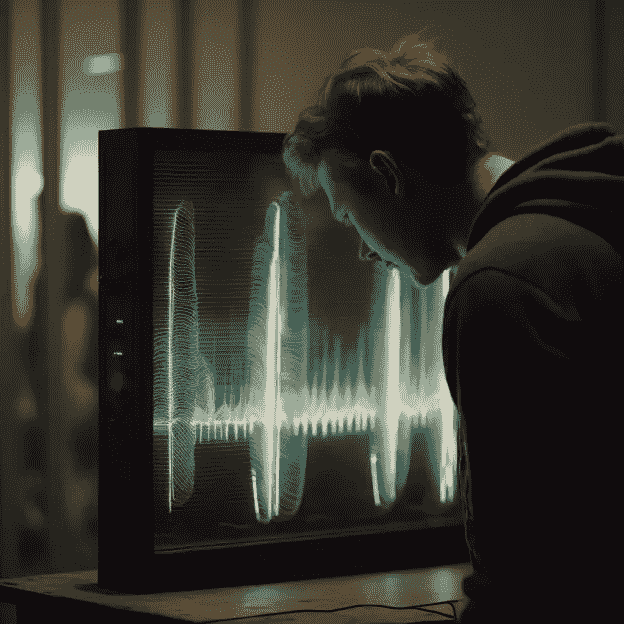

# 一种视觉麦克风？一种能够从图像中提取音频的革命性技术

> 原文：[`towardsdatascience.com/a-visual-microphone-the-revolutionary-tech-that-can-extract-audio-from-images-8a22d111e42b?source=collection_archive---------12-----------------------#2023-01-30`](https://towardsdatascience.com/a-visual-microphone-the-revolutionary-tech-that-can-extract-audio-from-images-8a22d111e42b?source=collection_archive---------12-----------------------#2023-01-30)

## 微妙动作的力量

 [Pavle Marinkovic](https://pmarinko.medium.com/?source=post_page-----8a22d111e42b--------------------------------)

·

[关注](https://medium.com/m/signin?actionUrl=https%3A%2F%2Fmedium.com%2F_%2Fsubscribe%2Fuser%2Fe253e1c83d01&operation=register&redirect=https%3A%2F%2Ftowardsdatascience.com%2Fa-visual-microphone-the-revolutionary-tech-that-can-extract-audio-from-images-8a22d111e42b&user=Pavle+Marinkovic&userId=e253e1c83d01&source=post_page-e253e1c83d01----8a22d111e42b---------------------post_header-----------) 发表在[Towards Data Science](https://towardsdatascience.com/?source=post_page-----8a22d111e42b--------------------------------) ·9 分钟阅读·2023 年 1 月 30 日

--

如果我们能够仅通过视频录制获取声音呢？图像由[Midjourney](https://midjourney.com/)创建

如果我们可以在没有任何录音设备的情况下恢复声音呢？

如果你能*感知*到振动，你就能揭示你周围的世界。

振动无处不在，但许多时候它们是如此**微妙**，以至于我们需要复杂的设备才能看到它们。

但这是值得的，回报丰厚。

**运动模式**可以揭示有关物体的有用信息，例如其内部结构（例如通过[超声波](https://medium.com/p/c4338b32a9e9)判断水果的成熟度）及其属性（例如管道的柔韧性），但它也可以作为**共鸣箱**来增强周围的声音。

这一声学特征为我们提供了之前无法访问的新数据。

通过捕捉和分析这些振动，我们可以**恢复**像*语音*和*音乐*这样的声音，否则这些声音会被丢失。

我们只需要*观察*这些振动。

# 如何从视觉中提取声音

当声波撞击物体时，物体会以特定的模式振动。

这些振动足以**产生视觉信号**，即使它们非常微妙。我们的眼睛看不见，但高速摄像机可以捕捉到这些信号……
