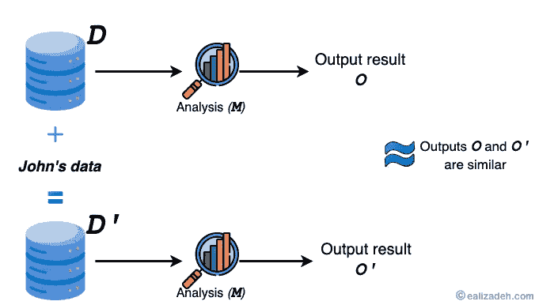
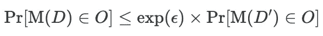
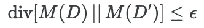
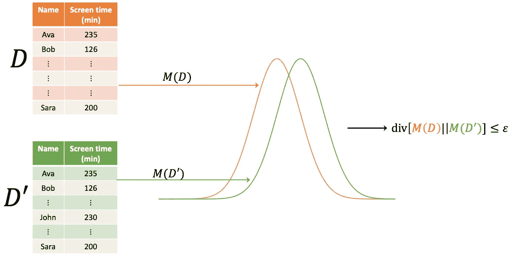
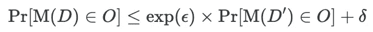

# 差分隐私的 ABC

> 原文：[`towardsdatascience.com/abcs-of-differential-privacy-8dc709a3a6b3`](https://towardsdatascience.com/abcs-of-differential-privacy-8dc709a3a6b3)

## 掌握基础知识

## 理解基本定义和关键原则的指南

 [Essi Alizadeh](https://medium.ealizadeh.com/?source=post_page-----8dc709a3a6b3--------------------------------)

·发表于 [Towards Data Science](https://towardsdatascience.com/?source=post_page-----8dc709a3a6b3--------------------------------) ·阅读时间 8 分钟·2023 年 4 月 27 日

--

作者提供的图像

差分隐私（DP）是一个严谨的数学框架，允许对敏感数据进行分析和处理，同时提供强有力的隐私保障。

DP 的基础是假设一个个体的加入或排除不应该显著改变对整个数据集进行的任何分析或查询的结果。换句话说，算法在比较这两组数据时应该得出相似的发现，从而使得难以识别该个体的任何独特信息。这种安全性可以防止私人信息泄露，但仍然可以从数据中得出有用的见解。

差分隐私最初出现在 Cynthia Dwork 在微软研究院工作期间的研究《Differential Privacy》中[1]。

让我们来看一个例子，更好地理解差分隐私如何帮助保护数据。

# 差分隐私如何保护数据的示例

## 示例 1

在一项研究中，研究人员调查了社会阶层与健康结果之间的关系，要求受试者提供私人信息，如居住地、财富状况和医疗背景[2]。

参与者之一 John 担心他的个人信息可能会泄露，影响他申请人寿保险或抵押贷款。为了确保 John 的担忧得到解决，研究人员可以使用差分隐私。这确保了任何共享的数据不会透露关于他的具体信息。不同级别的隐私可以通过 John 的“退出”情况来展示，在这种情况下，他的数据被排除在研究之外。这保护了他的匿名性，因为分析的结果与他的个人细节无关。

差分隐私旨在保护现实世界中的隐私，就好像数据是在选择退出的情况下查看的一样。由于 John 的数据不参与计算，因此关于他的结果只能与其他人可用的数据一样准确。

差分隐私的准确描述需要正式的数学语言和技术概念，但基本概念是通过限制从发布的数据中可以获取的个人信息量来保护个人隐私，从而确保其敏感信息保持私密。

## 示例 2

美国普查局使用了差分隐私框架作为其披露避免策略的一部分，以在数据收集和报告需求与受访者隐私关切之间找到妥协。有关美国普查局提供的保密保护的更多信息，请访问[这里](https://www.census.gov/library/working-papers/2022/adrm/CED-WP-2022-003.html)。此外，Garfinkel 提供了有关差分隐私在 2020 年美国人口普查数据中应用的解释，请见[这里](https://mit-serc.pubpub.org/pub/differential-privacy-2020-us-census)。

# 定义和关键概念

## “差分隐私”在 DP 领域中的含义

“差分”隐私这个术语指的是其对隐私保护算法在两个数据集上的结果差异的强调，这两个数据集之间仅有一个个体的数据不同。

## 机制 M

一个*机制* *M* 是一种数学方法或过程，用于处理数据以确保在提供有用信息的同时维护隐私。

## Epsilon (ε)

ε是一个隐私参数，它控制由差分隐私机制提供的隐私级别。换句话说，ε调节机制的输出在两个相邻数据库之间的变化程度，并衡量当机制在数据库上运行时隐私丧失的程度[3]。

较小的ε提供了更强的隐私保障，但结果可能因此变得不那么有用[4]。ε控制添加到数据中的噪声量，并显示当一个人的数据被更改时，输出概率分布可以发生的变化。

## Delta (𝛿)

𝛿是一个额外的隐私选项，它允许你设定隐私被泄露的可能性。因此，𝛿控制了极端隐私泄露的概率，即添加的噪声（由ε控制）未能提供足够的保护。

𝛿是一个非负数，用于衡量数据泄露的可能性。它通常非常小且接近于零。这个变化使得在仍然保护隐私的情况下，进行更复杂的研究和机器学习模型变得更加容易（参见[4]）。

如果𝛿很低，那么某人的隐私被泄露的机会较小。但这有代价。如果𝛿太小，可能会引入更多噪声，降低最终结果的质量。𝛿 是一个需要考虑的参数，但必须与 epsilon 和数据的实用性进行平衡。

# 揭示差分隐私背后的数学

考虑两个数据库 D 和 D'，它们只因一条记录不同。

从形式上讲，如果对于任何两个相邻的数据集 D 和 D’以及任何可能的输出 O，以下条件成立，则机制 M 是 ε-差分隐私的：

然而，我们可以将上述方程重新表述为发散量，从而得到以下结果：

图 1：差分隐私在发散量背景下的表现（图像由作者提供）。

这里**div[⋅∣∣⋅]**表示 Rényi 发散量。有关更多信息，请参见 Ilya Mironov 的论文 [Rényi Differential Privacy](https://arxiv.org/abs/1702.07476)。

# (ε, 𝛿)-DP 定义

随机化的*M* 被认为是 (ε, 𝛿)-差分隐私的，如果显著隐私泄露（即，在 ε-差分隐私下不会发生的泄露）的概率不超过𝛿。更正式地说，机制 M 是 (ε, 𝛿)-差分隐私的，如果

如果𝛿 = 0，则 (ε, 𝛿)-DP 将简化为 ε-DP。

> (ε, 𝛿)-DP 机制可以非正式地看作是带有 1 — 𝛿 概率的 ε-DP。

# 差分隐私的属性

## 1\. 后处理免疫

不同 ially 私密的输出可以受到任何函数或分析的影响，结果仍将保持原始的隐私保障。例如，如果你对数据集应用一个不同 ially 私密的机制，然后计算数据集中个体的平均年龄，那么得到的平均年龄仍然是不同 ially 私密的，并将提供与其最初设计时相同水平的隐私保障。

多亏了后处理功能，我们可以像使用通用机制一样使用不同 ially 私密的机制。因此，可以在不牺牲差分隐私完整性的情况下，结合多种不同 ially 私密的机制。

## 2\. 组合

当对相同的数据使用多种不同 ially 私密技术或将查询组合时，组合是确保差分隐私的隐私保障仍然适用的属性。组合可以是顺序的或并行的。如果你在数据集上应用两个机制，*M1* 具有 ε1-DP 和 *M2* 具有 ε2-DP，则 *M1* 和 *M2* 的组合至少是 (ε1 + ε2)-DP。

> 警告：尽管组合具有保护隐私的能力，但组合定理明确表明存在上限；随着ε值的增加，每当使用新机制时，隐私损失的量也会增加。如果ε变得过大，那么差分隐私保证大多是无意义的[3]。

## 3\. 对辅助信息的鲁棒性：

差分隐私对辅助信息攻击者具有抵抗力，这意味着即使攻击者可以访问其他相关数据，他们也无法从差分隐私输出中得知有关某个人的信息。例如，如果医院分享有关个人医疗情况的差分隐私信息，攻击者即使拥有其他医疗记录，也无法通过发布的数字显著增加对某个患者的了解。

# 常见误解

差分隐私的概念在早期的几篇出版物中被误解了，特别是在其早期阶段。Dwork *et al.* 撰写了一篇简短的论文[5]来纠正一些广泛存在的误解。以下是一些常见误解的例子：

1.  差分隐私不是一种算法，而是一种定义。差分隐私是一个数学保证，算法必须满足该保证才能公开数据集的统计信息。有多个不同的算法符合这一标准。

1.  各种算法可以是差分隐私的，同时仍然满足不同的要求。如果有人声称差分隐私，即对概率分布的特定要求，与任何准确度目标不兼容，他们必须提供证据来支持这一主张。这意味着要证明没有任何差分隐私算法能够达到某个指定的标准。这种证明具有挑战性，我们对什么是可行的首个猜测往往不准确。

1.  对任何给定的数据库，没有“好”或“坏”的结果。以保护隐私的方式生成输出（无论是完美隐私还是差分隐私）是关键。

# 结论

差分隐私（DP）已被证明是一种可行的数据隐私保护范式，这在当今机器学习和大数据日益普及的时代尤为重要。本文涵盖了几个关键概念，包括各种差分隐私控制设置如ε和*δ*。此外，我们还提供了差分隐私的几个数学定义，解释了差分隐私的关键特性，并解决了一些最常见的误解。

# 参考文献

[1] Dwork, Cynthia (2006). “Differential Privacy.” In *Proceedings of the 33rd International Colloquium on Automata, Languages and Programming*, 1–12\. Berlin, Heidelberg: Springer Berlin Heidelberg. [`doi.org/10.1007/11787006_1`](https://doi.org/10.1007/11787006_1).

[2] Wood, Alexandra, Micah Altman, Aaron Bembenek, Mark Bun, Marco Gaboardi, James Honaker, Kobbi Nissim, David O’Brien, Thomas Steinke 和 Salil Vadhan (2018). “差分隐私: 为非技术受众准备的入门指南。” *Vand. J. Ent. & Tech. L.* 21 (1): 209–76。 [`doi.org/10.2139/ssrn.3338027`](https://doi.org/10.2139/ssrn.3338027)。

[3] Brubaker, M., 和 S. Prince (2021). “教程 #12: 差分隐私 I: 介绍。” *Borealis AI*. [`www.borealisai.com/research-blogs/tutorial-12-differential-privacy-i-introduction/`](https://www.borealisai.com/research-blogs/tutorial-12-differential-privacy-i-introduction/)。

[4] Dwork, Cynthia, Aaron Roth 等. (2014). “差分隐私的算法基础。” *理论计算机科学基础与趋势* 9 (3–4): 211–407。

[5] Dwork, Cynthia, Frank McSherry, Kobbi Nissim 和 Adam Smith. 2011. “差分隐私 — 为困惑者准备的入门指南。” *联合国欧洲经济委员会/欧洲统计局统计数据保密工作会议* 11。

*最初发布于* [*https://ealizadeh.com*](https://ealizadeh.com/blog/abc-of-differential-privacy/) *于 2023 年 4 月 27 日。*
