# 访问你的个人数据

> 原文：[`towardsdatascience.com/accessing-your-personal-data-569b8991d745`](https://towardsdatascience.com/accessing-your-personal-data-569b8991d745)

## 公司关于你的广泛而常常令人惊讶的数据，准备好供你分析

 [Jeff Braun](https://medium.com/@jbraun_44616?source=post_page-----569b8991d745--------------------------------)

·发表在 [Towards Data Science](https://towardsdatascience.com/?source=post_page-----569b8991d745--------------------------------) ·阅读时间 22 分钟·2023 年 8 月 12 日

--

图片由 DALL-E 2 协助生成

数据隐私法律在全球范围内不断出现，这为你提供了一个独特的机会，让你了解别人如何看待你，同时也能深入了解自己。大多数法律与欧洲联盟的 [通用数据保护条例](https://eur-lex.europa.eu/legal-content/EN/TXT/PDF/?uri=CELEX%3A02016R0679-20160504)，通常称为“GDPR”，类似。该条例包括要求组织告知你他们存储的个人数据类型、存储原因、使用方式以及存储时间长度的条款。

但这些法律还包括一个经常被忽视的要求，通常称为 **数据可携带性**。数据可携带性要求组织在请求时提供你当前存储的关于你的数据的机器可读副本。在 GDPR 中，这一权利在第 15 条中定义，*“数据主体的访问权”*。组织拥有的数据通常包括丰富多样的特征，且数据清洁，为多个数据分析、建模和可视化任务提供了丰富的素材。

在这篇文章中，我分享了我向几家我经常互动的公司请求我的数据的过程。我包括了请求数据的技巧以及在数据科学中使用数据和个人洞察的想法。

认为你对音乐品味有很好的把握吗？我曾认为自己有广泛而多样的音乐品味。然而，根据 Apple 的数据，我更像是一个铁杆摇滚迷。

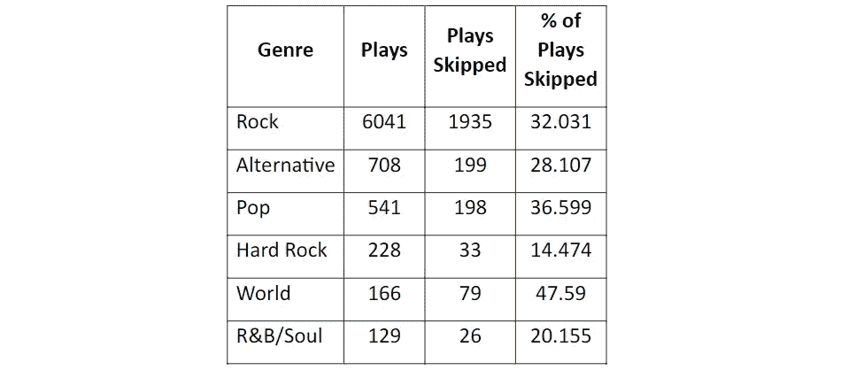

作者提供的表格

想提升你的地理数据映射技能吗？这些数据源提供了大量的地理编码数据供你使用。

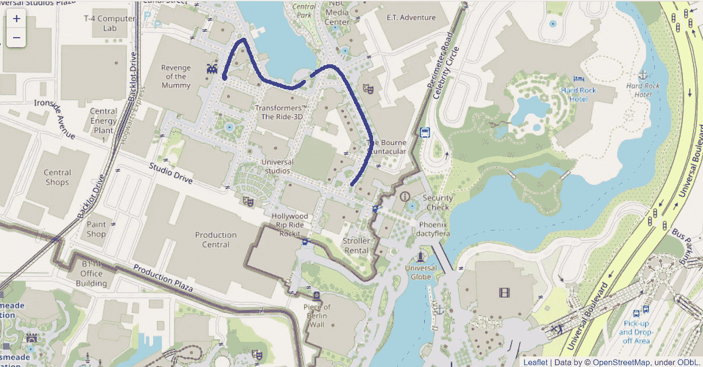

环球影城游览图 — 作者提供的图片

想试试你的时间序列建模技能吗？多个数据集提供了精细的时间序列观察数据。

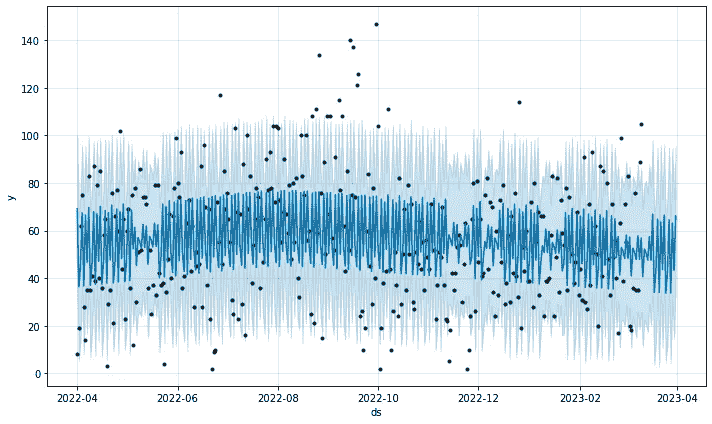

使用 Apple 健康数据进行的运动时间预测——作者绘制的图表

最棒的消息是什么？这***是你的数据***。无需许可证或权限。

系好安全带——你将收到的数据种类繁多。你可以进行的分析和建模类型也都很复杂。你对自己以及他人如何看待你的见解是令人着迷的。

为了专注于数据洞察并简明扼要，我在这篇文章中没有包含代码。虽然大家都喜欢代码，这里有一个[链接](https://github.com/jbraun22/accessing_your_personal_data)，指向一个包含我用来分析数据的多个笔记本的仓库。

**获取数据**

如果你列出有关于你的数据的组织，你会很快意识到这个列表非常庞大。社交媒体公司、在线零售商、移动电话运营商、互联网服务提供商、家庭自动化和安全服务以及流媒体娱乐提供商只是存储你数据的一些组织类别。从所有这些组织中请求数据可能非常耗时。

为了使我的分析可管理，我将数据请求限制在 Facebook、Google、Microsoft、Apple、Amazon 和我的移动运营商 Verizon。以下是总结我在数据请求和响应过程中的经历的表格：

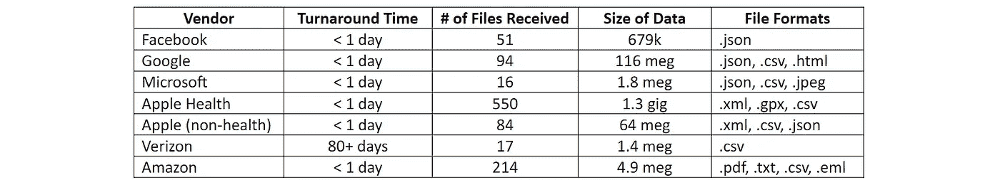

作者提供的表格

这是我用来请求数据的链接以及供应商提供的任何数据文档的信息：

我使用 Apple Watch 来跟踪健康和健身数据。这些数据与从一般 Apple 网站请求的其他 Apple 数据分开访问。因此，我在上述表格中显示了两个单独的 Apple 条目，并在下面的两个主题中讨论了 Apple 数据。

你收到的数据的数量和类型将取决于你与特定公司的互动程度。例如，我不常使用社交媒体。因此，从 Facebook 收到的相对有限的数据并不令人惊讶。相比之下，我大量使用 Apple 产品和服务。从 Apple 那里获得了广泛和大量的数据。

请记住，如果你在一家公司有多个身份，你需要为每个身份请求数据。例如，如果 Google 知道你的 Google Play 账户使用一个电子邮件地址，而你的 Gmail 账户使用另一个电子邮件地址，你需要为每个地址分别进行数据请求，以便全面了解 Google 存储的关于你的数据。

在上表中，我展示了我用来请求数据的目标公司链接。这些链接在本文发布时是最新的，但可能会随着时间的推移而变化。通常，你可以在公司主页上的“隐私”、“隐私权利”或类似链接中找到请求数据的说明。这些链接通常出现在主页的最底部。

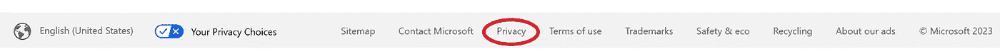

microsoft.com 屏幕底部 — 图片由作者提供

你通常需要阅读描述你隐私权利的文档，并寻找“访问您的数据”、“导出您的数据”、“数据可携带性”或类似主题的链接，以获取实际请求数据的页面链接。

最终，请求数据的过程、响应的及时性以及收到的解释数据的文档质量因公司而异。要有耐心并坚持不懈。你将很快获得大量数据和知识的回报。

**我的数据洞察**

以下是我从每家公司收到的数据文件的回顾，以及在分析了更有趣的文件后的几点观察。我还指出了一些利用这些公司数据进行更深入数据分析和建模的机会。

***Facebook***

我从 Facebook 下载的文件包括 51 个 .json 文件，不包括那些包含我 Facebook Messenger 账户中各个消息线程的众多 .json 文件。Facebook 在下载网站上提供了一些关于其文件的高级文档。

关于我 Facebook 登录活动的数据、我用来登录的设备、我登录的估计地理位置，以及与我账户活动相关的类似管理类型数据分布在几个文件中。尽管这些文件中的内容没有特别有趣，但我会说位置数据似乎出乎意料地准确，因为它通常是从记录活动时的 IP 地址推断出来的。

其中真正有趣的数据出现在一个跟踪我在 Facebook 之外的应用和网络活动的文件中。我可以看到那个文件中的数据，加上 Facebook 从我的 Facebook 个人资料中获得的数据，如何绘制出一个人口统计学的图景，导致我被特定的 Facebook 广告商选为目标。这个 Facebook 之外的文件开始让你感受到 Facebook 的画像和广告过程如何运作。

让我们来看一下这个文件。它的名字是：

> “/apps_and_websites_off_of_facebook/your_off-facebook_activity.json”

它包含了我在过去两年中在 441 个不同的非 Facebook 网站上所采取的 1,860 条记录。以下是记录的网站和行动类型的编辑样本：

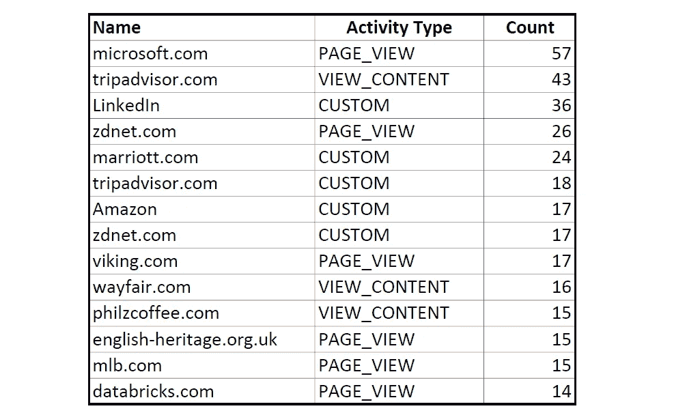

表格由作者提供

几个技术和旅行相关的网站在我的 Facebook 之外活动列表中排名靠前。现在让我们来看一下我的人口统计档案。

文件名：

> “ads_information/other_categories_used_to_reach_you.json”

包含了 Facebook 根据我的 Facebook 个人资料数据、Facebook 好友、我在 Facebook 上的活动以及我在 Facebook 之外的应用和网页活动分配给我的人口统计类别的列表。以下是编辑后的部分人口统计类别示例：

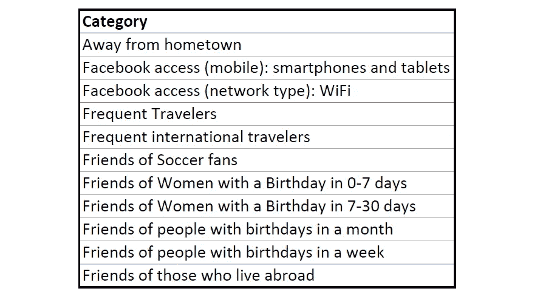

作者的表格

上述大多数类别基于我的个人资料、设备使用模式和我的朋友。类别“Frequent Travelers”和“Frequent International Travelers”我猜来自于我在 Facebook 之外的网页活动。到目前为止，这一切都符合实际情况。

最后，有一个名为：

> “ads_information/advertisers_using_your_activity_or_information.json”

文件标题中的“advertisers_using_your_activity_or_information”让我相信 Facebook 将我的数据提供给其广告商，广告商则利用这些数据通过 Facebook 向我投放广告。因此，该文件列出了那些向我展示广告的广告商，或至少根据我的数据考虑过这样做的广告商。

文件中包含了 1,366 个不同的广告商。以下是这些广告商的小部分示例：

作者的表格

旅行网站、零售商、科技公司、健身中心、汽车维修公司、医疗保险公司、媒体公司（代表广告商）和其他公司出现在列表中。这是一个种类繁多的组织，但在许多情况下，我可以看到它们与我、我的偏好和我的习惯的关系。

Facebook 下载中的其他文件包括 Facebook 搜索历史、搜索时间戳和浏览器 Cookie 数据。

***Google***

Google 的导出功能巧妙地命名为“Takeout”。Takeout 网页列出了你可以请求数据的各种 Google 服务（如 gmail、YouTube、搜索、Nest 等）。它还显示了每项服务的可用文件以及每个文件的导出格式（json、HTML 或 csv）。大多数时候，Google 不会提供对单个文件导出格式的选择。

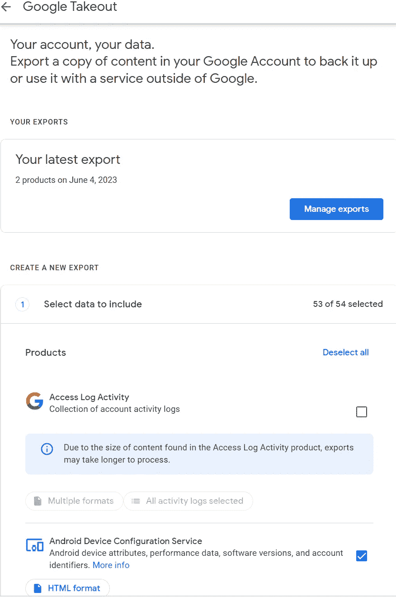

Google Takeout 请求网站的一部分，地址为 takeout.google.com —— 作者的屏幕图像

Google 在提供每个文件目的的高级概述方面做得相当不错。然而，对于单个字段，没有文档说明。

我在提取中收到 94 个文件。与 Facebook 一样，有正常的与设备信息、账户属性、偏好设置和登录/访问数据历史相关的管理文件。

一个有趣的文件是标题为‘…/Ads/MyActivity.json’的文件。它包含了由于搜索而向我展示的广告的历史记录。

Ads/MyActivity 文件中的一些条目包含了点击服务域的 URL，例如：

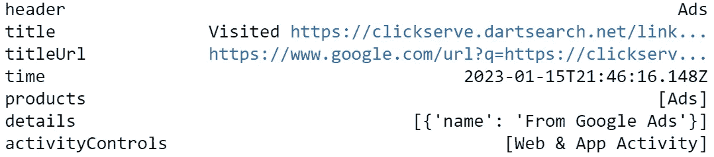

作者的屏幕截图

根据[Google 的 360 广告网站](https://support.google.com/searchads/answer/4490647?hl=en)，这些广告来自 Google 的广告主进行的广告活动，是我点击活动的结果。文件没有提供有关我采取了什么行动导致广告展示的任何信息。

文件中的“标题”列区分了“访问的”站点和“搜索的”主题。“访问的”记录在“详情”列中都标有“来自 Google 广告”（见上例），这让我相信 Google 在我访问特定网站后向我展示了广告。

“搜索的”记录显示了我直接访问的网站（如 macys.com、yelp.com 等）。“详情”列显示了这些网站，而“标题”列显然显示了我在*这些独立网站上*搜索的内容。例如，

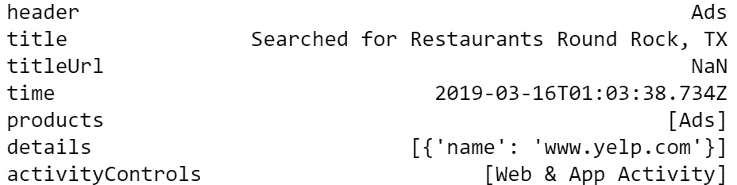

作者截屏

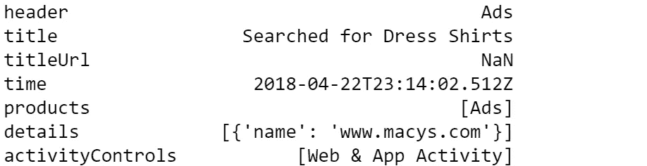

作者截屏

另一个我发现有趣的文件叫做‘…/My Activity/Discover/MyActivity.json’。它是 Google 通过其“Discover”功能在 Google 应用中向我展示的主题建议的历史记录（以前是 Google Feed 功能——有关 Discover 的更多信息，请参见[这里](https://blog.google/products/search/introducing-google-discover/)）。Discover 话题是基于你的网页和应用活动选择的，前提是你允许 Google 使用你的活动来指导 Discover 话题。

尽管我不允许 Discover 使用我的网页和应用活动，Discover 仍然提供了一些与我相关的话题建议。以下是几天内最频繁出现的主题的编辑样本：

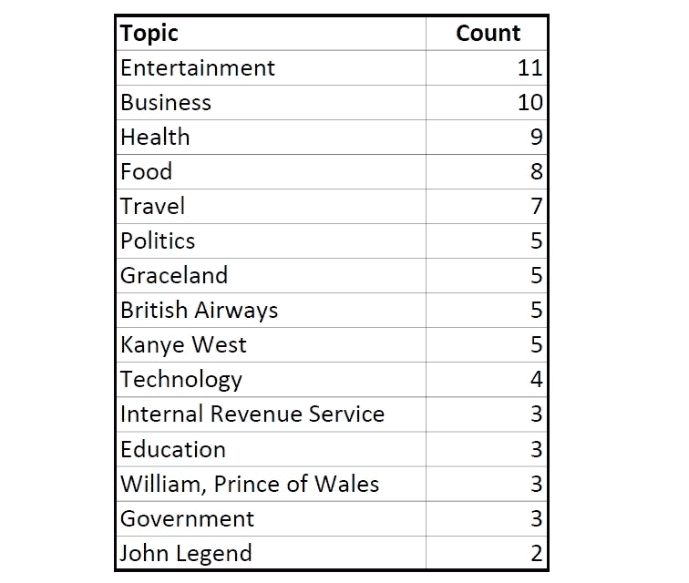

我们在这里看到重复出现的技术和旅行主题，以及一个我们将在 Apple 文件中也看到的新主题——音乐！

Google 在其下载文件中包含了跟踪 Google 产品和服务活动历史的几个文件。例如，我收到了我访问 developers.google.com 和 cloud.google.com 网站的历史记录，这些网站用于培训和文档资源。这些数据没有提供有力的见解，但确实提醒了我一些我想要重新审视和进一步学习的主题。

提取中的其他历史数据包括在我的 gmail 账户中执行的搜索和操作；图片的搜索请求；通过 Google Maps 应用搜索的地点、请求的方向和查看的地图；在网络上进行的视频搜索（YouTube 之外）；在 YouTube 上的搜索和观看历史；以及我在 Google 中存储的联系人，可能是在 gmail 中。

与 Facebook 不同，Google 并没有提供关于 Google 为我构建的任何人口统计信息。

请注意，你可以通过访问[myactivity.google.com](http://myactivity.google.com)来查看你在 Google 产品和应用中的活动数据：

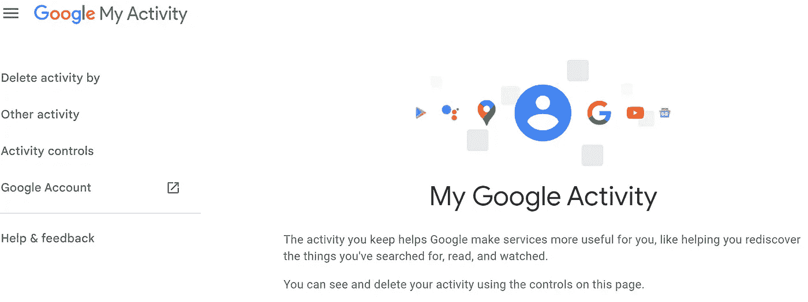

作者截屏

虽然你不能从这个网站导出数据，但你可以浏览数据，从而对你可能想通过 Google Takeout 网站导出的数据类型有个了解。

***微软***

微软允许你通过[微软隐私仪表板](https://account.microsoft.com/privacy)导出你的部分数据。对于隐私仪表板上没有的微软服务（例如，MSDN、OneDrive、Microsoft 365 或 Skype 数据），你可以使用微软[隐私声明页面](https://privacy.microsoft.com/en-us/privacystatement)的“如何访问和控制你的个人数据”部分中的链接。如果你需要的数据通过上述方法无法获得，该页面会引导你提交一个网页表单。

我选择通过隐私仪表板导出所有可用的数据。这包括浏览历史、搜索历史、位置信息、音乐、电视和电影历史，以及应用和服务使用数据。我还要求导出我的 Skype 数据。我的导出包含了四个 csv 文件、六个 json 文件和六个 jpeg 文件。

导出中未包含文件文档，也未在微软网站上找到相关信息。然而，文件中的字段名称相当直观。

从微软文件中有一些有趣的观察：

文件‘…\Microsoft\SearchRequestsAndQuery.csv’包含了我在过去 18 个月内进行的搜索的数据，包括搜索词和，显然，如果有的话，点击的站点。看起来这些数据仅限于我通过 Bing 或 Windows 搜索进行的搜索。

根据数据，我发现我在搜索结果中点击链接的次数仅为 40%（870 次搜索中点击了 347 次）。由此，我猜测那些我未点击链接的搜索，要么是搜索词不佳，返回了无关结果，要么是我通过查看搜索结果中的链接预览就能获得所需的答案。我不记得需要频繁修改搜索词，我知道我经常可以在链接预览中找到需要的答案，因为我的许多搜索是关于编码语法的提醒。不管怎样，我对 40%的点击率感到有些惊讶，我原本期望它会更高。

Skype 数据中没有什么特别有趣的内容。它包含了我和其他 Skype 会议参与者之间的应用内消息线程的历史记录。还包括了一些我的通话中的参与者图片的.jpeg 文件。

***苹果健身***

我必须单独访问我从 Apple 导出的其他数据中的苹果健康和健身数据。这些健康和健身数据可以从 iPhone 上的健康应用中访问。你只需点击健康应用屏幕右上角的图标，它会带你进入个人资料屏幕，然后点击屏幕底部的“导出所有健康数据”链接：

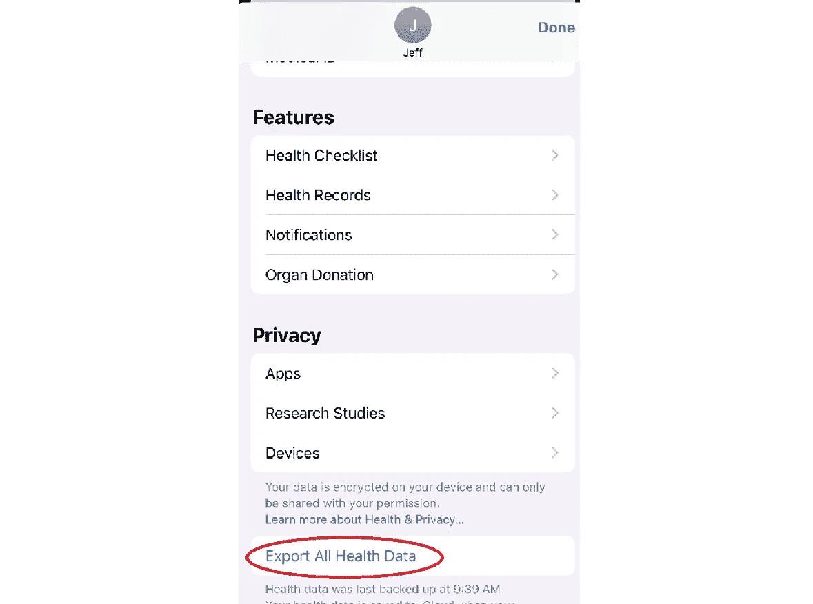

作者截屏

我的健康导出数据包含了不到 500 个[.gpx 文件](https://en.wikipedia.org/wiki/GPS_Exchange_Format)，总共 102 兆字节。它们包含了过去几年记录的锻炼路线信息。另有 48 个文件包含了 5.3 兆字节的心电图数据，来自我在 Apple Watch 上进行的自我测试。

名为‘…/Apple/apple_health_export/export.xml’的文件包含了真正有趣的数据。对我而言，它有 770 兆字节，包含 1,956,838 条记录，涵盖了大约七年内的多种健康和运动测量数据。测量的一些活动类型如下：

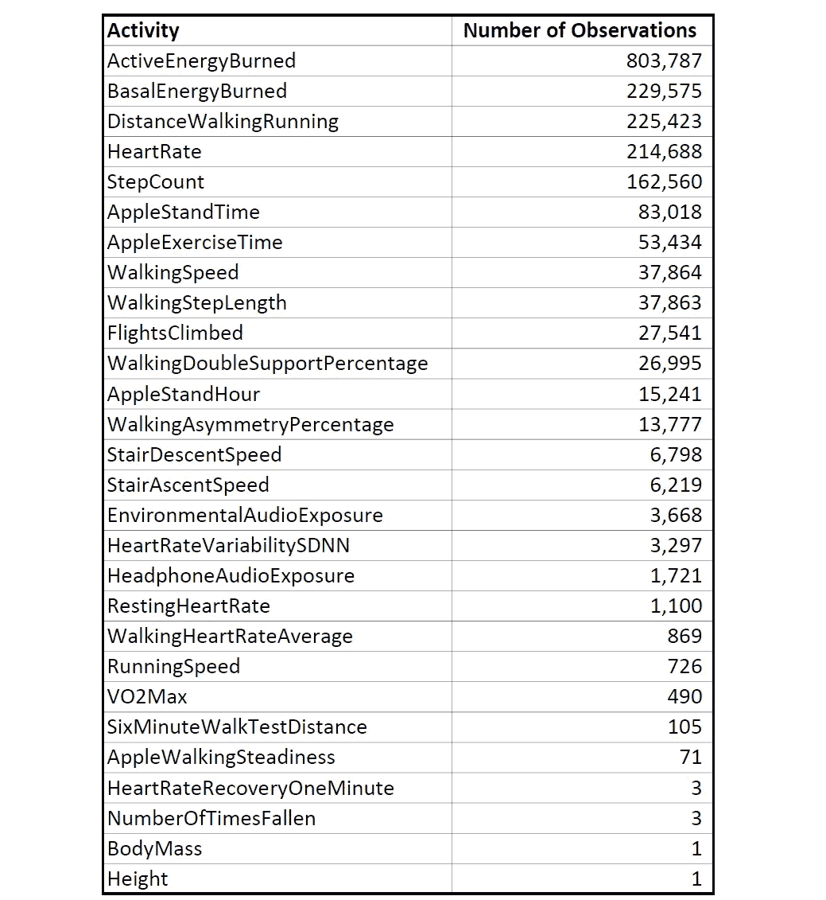

作者提供的表格

请注意，Apple 记录数据的频率因活动类型而异。例如，**主动能量消耗**按小时记录，而**爬楼梯速度**仅在上楼梯时记录，这导致这两种活动类型之间的观察次数差异很大。

每个观察记录的数据包括观察记录的日期/时间、被测活动的开始和结束日期/时间，以及记录活动的设备（iPhone 或 Apple Watch）。

在他出色的 Medium 文章《用 Python 和 Apple Health 分析你的健康》中，[Alejandro Rodríguez](https://medium.com/u/f332a48d4bca?source=post_page-----569b8991d745--------------------------------)提供了我用来解析 export.xml 文件中的 xml 并创建 Pandas 数据框的代码。（谢谢 Alejandro！）在选择了一年的数据子集，并按天和活动类型进行分组和汇总后，我发现了一些有趣的事情。

正如我所怀疑的那样，我在旅行期间的平均活动水平与我在我称之为家的城市（奥斯汀或芝加哥）时的活动水平不同。为了查看这一点，我必须使用前面提到的.gpx 运动路线文件中的纬度和经度数据。这让我能够确定哪些路线是在家城市中，哪些是在旅行中。然后，我将这些位置数据与我的活动总结数据合并。这些数据进一步按活动类型和位置（家城市或旅行）进行了汇总。这里是合并后的模式：

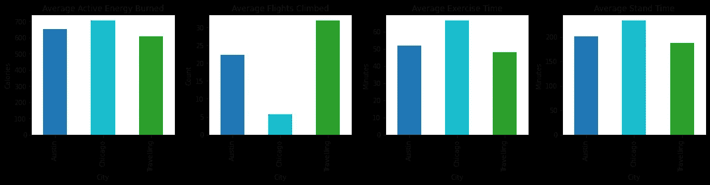

作者提供的图片

在芝加哥期间，我住在有电梯的公寓楼里，所以平均爬楼梯次数的大幅下降并不令人惊讶。令人惊讶的是芝加哥与奥斯汀的活动水平增加。尽管我在两个地点的锻炼习惯非常相似，但我在芝加哥的锻炼量更多。我认为这可以归因于我在芝加哥走到更多地点，而不是大部分时间开车。显然，我需要在奥斯汀增加锻炼量。

像上面这种趋势，在 Apple Health 应用的标准图表中看不到，是健康数据的一个很好的用途。

这些数据也非常适合建模，因为数据非常完整且一般较为干净。例如，下面是基于一年时间段的我的运动分钟数的时间序列预测，使用了 Facebook 的 Prophet 模型：

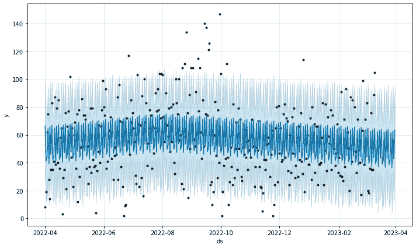

使用默认每周季节性，无年度季节性运动分钟数预测 — 作者提供的图像

这是相同的预测，但启用了年度季节性，并根据我的位置（奥斯汀、芝加哥或旅行中）手动添加了每周季节性：

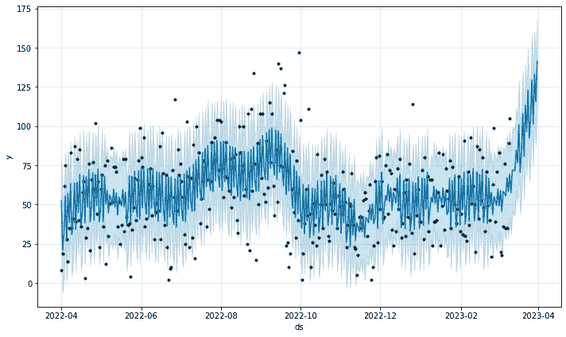

使用年度季节性和手动每周季节性的运动分钟数预测 — 作者提供的图像

上面的默认每周季节性模型（第一个图）对训练数据的拟合效果比添加了自定义季节性项的模型（第二个图）要差。然而，默认的季节性模型在预测未来的运动分钟数方面表现远远更好（尽管仍然不尽如人意）。不用说，调整超参数可以改善这些结果。

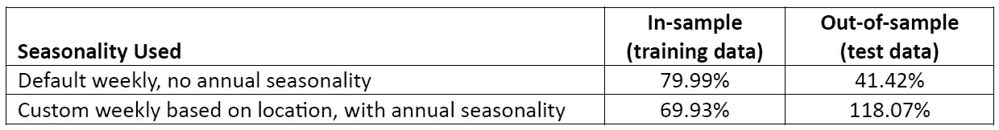

不同模型的平均绝对百分比误差 — 作者提供的图表

这只是一个示例，展示了你可以使用健康数据进行的建模类型。你是否想尝试使用非常详细的时间序列数据？查看运动路线文件。它们记录了你每秒的运动数据，包括纬度、经度、高度和速度字段。

***Apple — 非健身/健康***

你可以从 Apple 的主网站请求下载所有非健身/健康数据。对我来说，这总共是 84 个文件，主要是 .csv 和 .json 文件，还有一些 .xml 文件。我还收到了数百个 .vcf 文件，每个文件对应我在 Apple 设备上的一个联系人。总的来说，我下载了 68MB 的数据，不包括 .vcf 文件。

Apple 突出的特点在于它为每个数据文件提供了详尽的文档。文档包括每个字段的解释，虽然一些定义比其他的更有帮助。这些文档帮助我解释了一些看起来很有趣的数据文件。

与大多数其他导出一样，Apple 的文件包含了正常的行政数据，包括我的应用偏好、登录信息和设备信息。我在这些文件中没有发现任何特别的东西。

有几个与 Apple Music 相关的文件，这是我订阅的服务之一。文件标题类似于：

+   “…/Media_Services/Apple Music — 每日播放历史.csv”；

+   “…/Media_Services/Apple Music — 最近播放的曲目.csv’’；以及，

+   “…/Media_Services/Apple Music 播放活动.csv”

包含的信息包括：

+   歌曲播放的日期和时间；

+   播放持续时间（以毫秒为单位）；

+   每次播放的结束方式（例如，播放到歌曲末尾，或者我跳过了这首歌）；

+   歌曲被播放的次数；

+   歌曲被跳过的次数；

+   歌曲标题；

+   专辑标题（如果有的话）；

+   歌曲的类型；以及，

+   播放歌曲的来源——我的库、播放列表或 Apple 的广播频道。

我的文件包含了 13,900 到 20,700 条记录，这取决于文件的用途。这些数据涵盖了近七年的歌曲播放记录。

Apple 捕捉了多种数据来记录歌曲播放的结束情况，可能是为了推荐其他歌曲给我。歌曲播放结束原因包括：

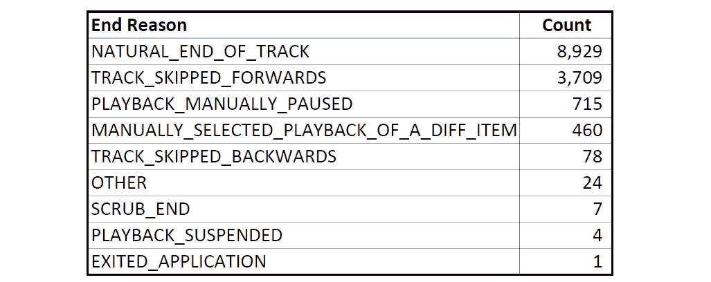

作者绘图

在下面的分析中，我专注于‘NATURAL_END_OF_TRACK’（自然结束）、‘TRACK_SKIPPED_FORWARDS’（跳过前进）和‘MANUALLY_SELECTED_PLAYBACK_OF_A_DIFF_ITEM’（手动选择播放不同项目）结束原因。

有时我会重复播放我喜欢的歌曲。我曾经有一个问题是：“我是否会对喜欢的歌曲进行强迫性播放，一遍又一遍？”我使用 Apple 的数据回答了这个问题：

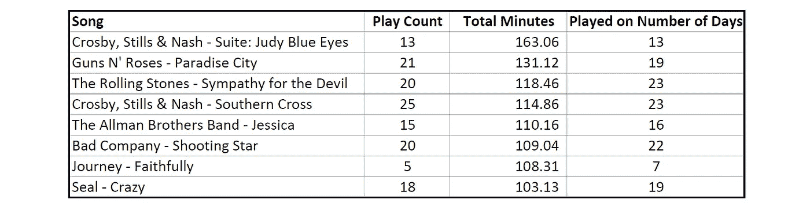

作者绘图

上表总结了我播放一些喜欢的歌曲的次数（‘播放次数’）以及我播放这些歌曲的天数（‘播放天数’）。看起来我一般每天只播放一首歌曲。此外，由于某些歌曲的播放次数少于播放天数，我一定会跳过一些喜欢的歌曲，特别是当我最近听得太多或者歌曲不符合当时的心情时。所以，这里没有强迫症播放的情况！

我也想知道我是否在一周的不同日子、一天的不同时间，甚至一年中的不同月份更偏爱某些类型的歌曲。我的直觉是我确实如此。通过 Apple 的数据，可以轻松地可视化我在不同时间播放的流派。例如，以下是我每个月播放最频繁的流派：

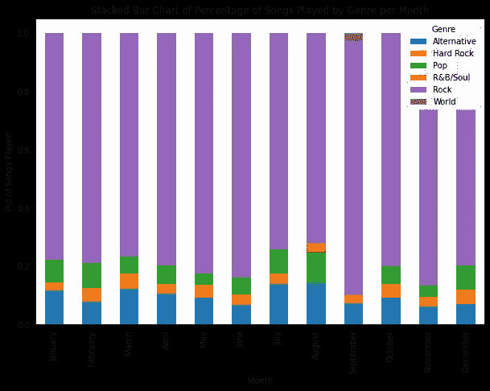

作者提供的图像

我明显偏爱摇滚歌曲，同时偶尔会加入一些另类和流行音乐。七月和八月似乎是我喜欢变化的月份。

尽管如此，我还是对自己播放的摇滚歌曲数量感到惊讶。诚然，我爱摇滚。但我也相信我对音乐的品味相当广泛。

因此，我质疑了 Apple 数据中分配给歌曲的流派的准确性。首先，我文件中的 22,313 次歌曲播放中有 10,083 次没有分配流派。此外，分配的流派似乎有很多重叠。例如，“R&B/Soul”、“Soul and R&B”、“Soul”和“R&B / Soul”都是分配给我数据中不同歌曲的流派。如果我将所有歌曲的流派重新调整为一致的命名方案，上述图表中的总数肯定会有所不同。

我决定不投入时间更新音乐流派，而是进行另一个测试，以确定图表中的趋势是否真正代表了我的播放模式。由于 Apple 在数据中包含了歌曲播放结束原因，我查看了是否我比其他流派更频繁地跳过摇滚歌曲，这表明当摇滚歌曲播放过多时，我会尝试播放其他流派。

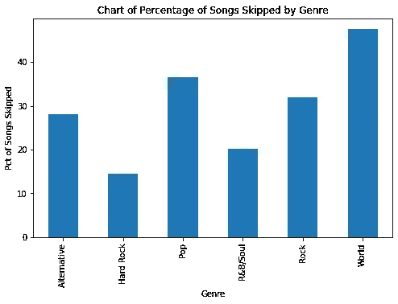

作者绘图

事实证明，我跳过摇滚歌曲的频率并没有明显高于我跳过其他我经常听的音乐类型。我得面对这个事实——我是真正的摇滚迷。

另一个有趣的文件叫做“…/Media_Services/Stores Activity/Other Activity/App Store Click Activity.csv”。虽然我在这里没有分析它，但我推荐给任何想了解零售商可能想跟踪的网站活动类型的人。对我来说，它包含了 4,900 多条记录，详细记录了我在应用商店内的活动历史，以及显然是在 Apple Music 中的活动。我采取的行动类型、日期/时间、A/B 测试标志、搜索词和呈现给我的数据（使用的术语是“印象深刻”）都包括在文件中。

最后一个可能有趣的分析文件是 \\Media_Services\\Stores Activity\\Other Activity\\Apple Music Click Activity V3.csv。它包括了我在使用 Apple Music 时的 IP 地址所在的城市和经纬度。对我来说，该文件有 10,000 条记录。

***Verizon***

在长达 80 多天的等待之后，Verizon 通知我可以下载我的数据。它包括 17 个 csv 文件，总共 1.4 兆字节的数据。大多数文件涵盖了帐户管理信息（手机线描述、设备信息、账单历史、订单历史等）、Verizon 发给我的通知历史和我最近的短信历史（但没有短信内容）。虽然提供了通话记录和数据使用文件，但它们都是空的，只有一个注明数据是“为安全起见已被屏蔽”的说明。

Verizon 提供了两个文档文件。一个包含了可能包含在下载中的 34 个文件的名称和一般描述。包含的文件取决于你使用的 Verizon 服务。第二个文档文件包含了可能出现在这些文件中的 3,091 个数据字段的描述。虽然数据字段描述是有帮助的，但它们缺乏一些细节。例如，许多字段被描述为包含各种用途的代码，但这些代码及其含义并未描述。

一个非常有趣的文件叫做“…/Verizon/General Inferences.csv”。它包含了关于我以及我家其他人的大量人口统计信息。以下是 Verizon 文档对该文件的描述：

> “通用推论文件提供了有关一般假设和推论的信息，以在我们的平台上提供更具相关性和相关性的内容。这可能包括像属性、偏好或意见这样的信息。”

根据人口统计特征的性质，我假设大多数信息是 Verizon 从外部数据聚合商处获取的，而不是直接从我这里收集的。人口统计特征的数量和范围远远超过了我直接提供给 Verizon 的任何信息。

实际上，Verizon 文档提到了另一个名为“General”的信息文件（不包含在我的下载中）。文档称“General”文件包括来自外部信息来源的数据。我的猜测是“总体推断”文件中的信息也来自这些外部来源。“总体推断”文件中的一些财务数据可能来自 Verizon 要求其客户提供的信用报告。

总共有 332 个与我相关的人口特征被包括在我的“总体推断”数据中。以下是一个缩略列表，包括一些比较令人惊讶的特性：

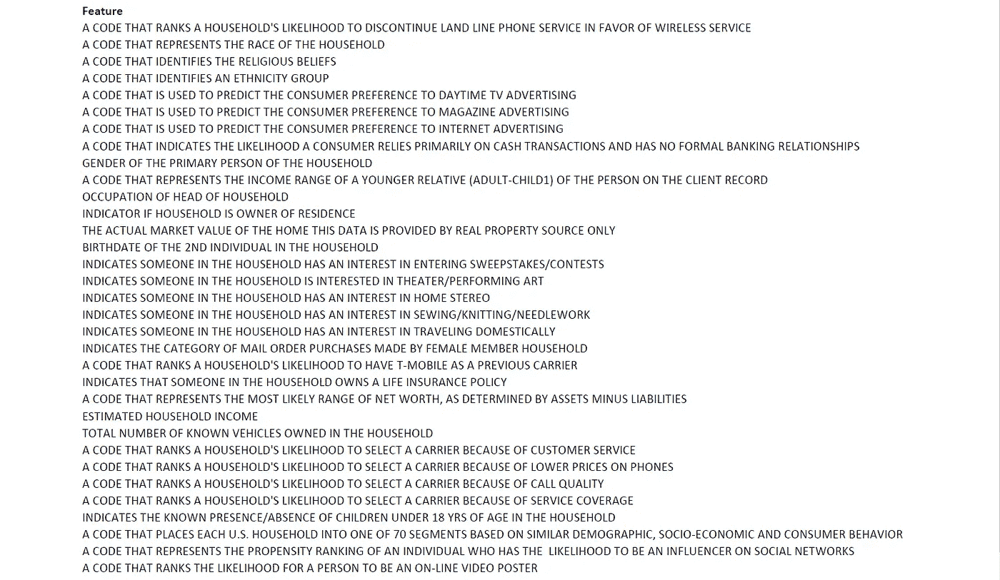

“总体推断”文件的人口特征缩略列表 — 作者表

所有的“总体推断”特性显然被 Verizon 用来向我营销并保留我作为客户。正如上面的列表所示，关于我配偶和我们孩子的特性也被包括在内。你可以在[这里](https://gist.github.com/jbraun22/d2be987db4c9b01c32a70387f3a5d2e2)查看完整的 332 个特性列表。

我发现的一些真正不寻常的特性包括：

作者表

人们不得不怀疑这些数据元素是否真的被 Verizon 所需，以帮助其提供服务，如果是这样，Verizon 是如何使用它们的。

***亚马逊***

亚马逊提供了包含 4.93MB 数据的 214 个文件。几个文件包括：

+   账户偏好；

+   订单历史；

+   履行和退货历史；

+   观看和收听历史（亚马逊 Prime Video 和亚马逊音乐）；

+   Kindle 购买和阅读活动，

+   和包括搜索词在内的搜索历史。

如果我曾是 Alexa 客户或 Ring 客户，我假设我也会收到有关这些服务的活动数据。

六个.txt 文件包含了一些下载数据文件的高级描述。几个.pdf 文件包含下载文件中字段的文档（例如，“Digital.PrimeVideo.Viewinghistory.Description.pdf”文件）。

来自亚马逊的最有趣的文件涉及亚马逊、其广告商或“第三方”与我相关的营销受众。我推测这些第三方是亚马逊从中购买数据的数据供应商。

“.../Amazon/Advertising.1/Advertising.AmazonAudiences.csv”文件包含亚马逊分配给我的受众。以下是 21 个受众的示例：

亚马逊分配给我的受众 — 作者表

当我考虑自己购买或搜索的产品时，无论是为了自己还是代表他人，亚马逊自己分配的受众基本上是准确的。

“.../Amazon/Advertising.1/Advertising.AdvertiserAudiences.csv”文件显然包含了带来自己受众到亚马逊的亚马逊广告商的名单，并且他们的受众名单中包括了我。该文件包含 50 个广告商。以下是一个示例：

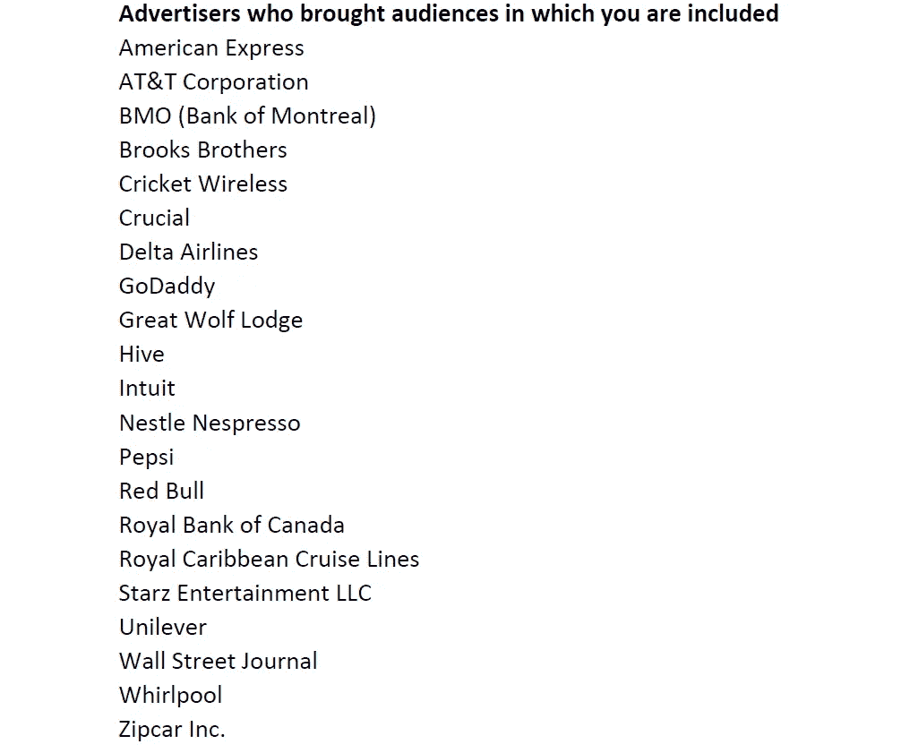

将我列入观众名单的亚马逊广告商 — 表格由作者提供

我与列表中的一些广告商（例如，达美航空、Intuit、Zipcar）有业务往来或拥有他们的产品，因此我理解我如何进入他们的观众名单。我与列表中的其他公司（例如，AT&T、红牛、加拿大皇家银行）没有任何联系，所以我不确定我是如何进入他们的观众名单的。

根据亚马逊的说法，文件

> “…/Amazon/Advertising.1/Advertising.3PAudiences.csv”

包含一个列表

> “你被第三方包含的观众。”

它的准确性很差。总共有 33 个观众被列出，其中 28 个集中在汽车拥有上。剩下的四个涉及性别、教育水平、婚姻状况和抚养人。一个汽车相关观众的示例：

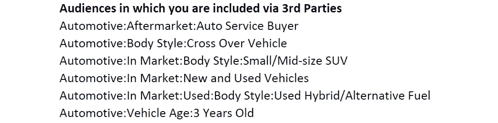

由第三方供应商提供的汽车相关观众分配示例 — 表格由作者提供

虽然文件中的性别/教育水平/婚姻状态类型的分配是准确的，但其中只有少数汽车相关的分配是正确的。大多数是不准确的。而且，我对汽车的兴趣并不足以让 33 个档案分配中有 28 个与汽车相关。幸运的是，亚马逊在向我推荐产品或视频时似乎忽略了这些数据。

**离别感想**

在这篇文章中，我希望向你展示你可以从与你做生意的公司那里获得的各种数据。这些数据使你能够了解这些公司对你的看法，同时也发现一些关于你自己的令人惊讶的事情！

我们已经看到，有些公司正确识别了我对技术和旅行的兴趣，而有一家公司错误地把我看作是一个狂热的汽车爱好者。在一个令人瞩目且略感不安的时刻，我意识到另一家公司掌握了我家庭的广泛人口统计信息。

我了解到，我需要在我称之为家的两个地方中的一个增加锻炼量，尽管我认为我的锻炼在两个地方是等效的。我发现一些公司（facebook，谷歌）对我的个人资料没有强烈的看法。然而，Verizon 对我的人口统计画像却令人震惊地准确。

各公司提供的数据为实验提供了丰富的原材料。这些数据适合于深入分析、建模和可视化活动。例如，许多观察提供了地理坐标和时间戳，使你能够可视化或建模你的移动情况。

我希望你通过下载你的个人数据找到一套有趣的见解。如果你在与我这里未涵盖的公司合作时有值得注意的经历，请告诉我。

这是你的数据 — 现在去利用它吧！

*文章由作者于 2023 年 8 月 16 日编辑以纠正拼写错误。*
