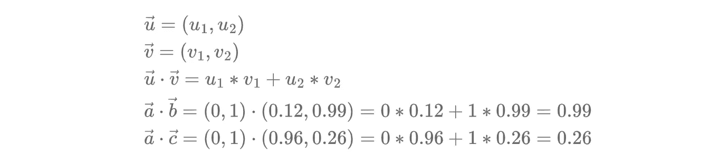

# 检索增强生成（RAG）

> 原文：[`towardsdatascience.com/add-your-own-data-to-an-llm-using-retrieval-augmented-generation-rag-b1958bf56a5a`](https://towardsdatascience.com/add-your-own-data-to-an-llm-using-retrieval-augmented-generation-rag-b1958bf56a5a)

## 学习如何使用一种基于提示的技术，即检索增强生成，将你自己的专有数据添加到预训练的 LLM 中

[](https://medium.com/@bea_684?source=post_page-----b1958bf56a5a--------------------------------)[](https://towardsdatascience.com/?source=post_page-----b1958bf56a5a--------------------------------) [Beatriz Stollnitz](https://medium.com/@bea_684?source=post_page-----b1958bf56a5a--------------------------------)

·发布于 [Towards Data Science](https://towardsdatascience.com/?source=post_page-----b1958bf56a5a--------------------------------) ·21 分钟阅读·2023 年 9 月 29 日

--


照片由 [Joshua Sortino](https://unsplash.com/@sortino?utm_source=medium&utm_medium=referral) 提供，来源于 [Unsplash](https://unsplash.com/?utm_source=medium&utm_medium=referral)

**介绍**

大型语言模型（LLMs）了解很多关于世界的知识，但它们并不知晓所有信息。由于训练这些模型需要很长时间，因此它们最后一次训练的数据可能相当陈旧。尽管 LLMs 了解互联网上的通用信息，但它们不知道你的专有数据，而这通常是你在基于 AI 的应用中所需的数据。因此，将 LLMs 扩展到新数据上，最近在学术界和行业中成为了一个重要的研究领域也就不足为奇了。

在这个大型语言模型的新纪元之前，我们通常通过简单地微调模型来扩展模型的新数据。但现在我们的模型大得多，训练的数据也更多，微调仅适用于少数几种场景。当我们想让我们的 LLM 以不同的风格或语气进行交流时，微调表现特别好。一个很好的微调例子是 OpenAI 将其较旧的完成式 GPT-3.5 模型适配成其较新的对话式 GPT-3.5-turbo（ChatGPT）模型。如果给完成式模型输入“你能告诉我关于寒冷天气帐篷的事吗”，可能会扩展提示：“以及其他寒冷天气露营装备？”另一方面，他们的对话式模型可能会这样回答：“当然！它们设计用来承受低温、高风和雪……”在这种情况下，OpenAI 的重点不是更新模型可以访问的信息，而是改变它与用户对话的方式。为此，微调确实效果显著！

然而，微调在向大型模型添加新数据时表现不佳，这在我发现的商业场景中更为常见。此外，微调 LLM 需要大量高质量数据、用于计算资源的巨额预算以及大量时间——这些对于大多数用户来说都是稀缺资源。

在这篇文章中，我们将介绍一种称为“检索增强生成”（RAG）的替代技术。该方法基于提示，由 Facebook AI Research (FAIR) 和合作伙伴于 2021 年引入。RAG 的概念足够强大，以至于 Bing 搜索和其他高流量网站都在其模型中融入了当前数据，而且又足够简单，以至于我可以在这篇博客文章中深入解释给你。即使你没有大量的新数据、巨额预算或很多时间，它也很有效。

你可以在与这篇博客文章相关的 [GitHub repo](https://github.com/bstollnitz/rag/) 中找到三种简单 RAG 场景的代码实现：一种直接使用 OpenAI APIs，另一种使用开源 LangChain API，第三种实现则使用开源 Semantic Kernel API。我将在这篇博客文章中展示并解释第一个场景的代码，并鼓励你在自己的时间里浏览其他实现。

但在我们深入代码之前，让我们先了解 RAG 的基本概念。

**RAG 概述**

检索增强生成的实现可能有所不同，但在概念层面上，在基于 AI 的应用中使用 RAG 涉及以下步骤：

+   用户输入一个问题。

+   系统搜索可能回答问题的相关文档。这些文档通常由专有数据组成，并存储在某种文档索引中。

+   系统创建一个 LLM 提示，将用户输入、相关文档和 LLM 的指令结合起来，让 LLM 使用提供的文档回答用户的问题。

+   系统将提示发送到 LLM。

+   LLM 根据我们提供的上下文向用户的问题返回答案。这是我们系统的输出。

这是这个一般概念的图示：


我已经给你提供了 RAG 的口语含义，但在实现细节上有所欠缺。让我们深入研究一下介绍这一概念的论文，以开始掌握具体细节。

**RAG 研究论文**

RAG 这个术语首次由 FAIR 和学术合作伙伴于 2021 年引入，在他们题为 [Retrieval-Augmented Generation for Knowledge-Intensive NLP Tasks](https://arxiv.org/pdf/2005.11401.pdf) 的论文中提出。作者提出的这些理念对我们今天使用的行业解决方案产生了巨大影响，因此值得了解。

下面是论文中介绍的架构概览：


我们将在这篇文章中深入探讨这一架构的每一部分。从高层次来看，提出的结构由两个组件组成：检索器和生成器。检索器组件使用查询编码器将输入文本转换为浮点数序列（向量），使用文档编码器以相同方式转换每个文档，并将文档编码存储在搜索索引中。然后，它在搜索索引中搜索与输入向量相关的文档向量，将文档向量转换回文本，并将这些文本作为输出返回。生成器然后接受用户的输入文本和匹配的文档，将它们合并为一个提示，并根据文档中的信息请求 LLM 对用户输入的回复。该 LLM 的输出即为系统的输出。

你可能注意到查询编码器、文档编码器和 LLM 在上图中都以类似方式表示——这是因为它们都是使用 transformers 实现的。传统的 transformers 由两部分组成：编码器和解码器。编码器负责将输入文本转换为大致捕捉单词含义的向量（或向量序列）；解码器负责根据输入文本生成新文本。在论文的架构中，查询编码器和文档编码器使用仅编码器 transformers 实现，因为它们只需将文本片段转换为数字向量。生成器中的 LLM 使用传统的编码器-解码器 transformers 实现。

这种架构是如何训练的？论文建议使用预训练的变换器，并仅对查询编码器和生成器 LLM 进行联合微调。这种微调是使用用户输入和 LLM 预期输出的对应对进行的。文档编码器没有进行微调，因为这样做成本较高，而且作者发现对于良好的性能来说并不必要。

论文提出了实现这种架构的两种方法：

+   **RAG-sequence** — 我们检索*k*个文档，并使用它们生成回答用户查询的所有输出标记。

+   **RAG-token** — 我们检索*k*个文档，使用它们生成下一个标记，然后再检索*k*个文档，使用它们生成下一个标记，依此类推。这意味着在生成单个答案时，我们可能会检索多个不同的文档集。

你现在对 RAG 论文中的架构有了很好的高层次理解。这种模式在行业中非常常见；然而，结果是论文中的每一个细节并不总是按照建议的方式实现。

**行业中使用的 RAG**

在实践中，行业内常见的 RAG 实现方式已从论文中进行了如下适配：

+   在论文中提出的两种方法中，RAG-sequence 的实现几乎在行业中总是被使用。它比另一种方法便宜且更简单，且能产生很好的结果。

+   我们通常不会对任何变换器进行微调。现有的预训练 LLM 已经足够好，不需要进一步微调，而且自己微调的成本也过高。

此外，文档搜索的方法也并不总是完全按照论文中的建议进行。搜索通常借助搜索服务进行，如[FAISS](https://github.com/facebookresearch/faiss)或[Azure Cognitive Search](https://azure.microsoft.com/en-us/products/ai-services/cognitive-search)，这些服务支持与 RAG 配对良好的不同搜索技术。搜索服务通常由以下两个执行步骤组成：

+   **检索**：此步骤将用户的查询与搜索索引中的文档进行比较，并检索出最相关的文档。常见的检索技术有三种：关键词搜索、向量搜索和混合搜索。

+   **排名**：这是一个可选步骤，跟随检索步骤进行。它对检索到的相关文档列表进行排序优化。

让我们详细了解这些内容，从三种检索类型开始。

**关键词搜索**

查找与用户查询相关的文档的最简单方法是进行“关键词搜索”（也称为“全文搜索”）。关键词搜索使用用户输入文本中的精确术语来搜索索引中的匹配文档。匹配仅基于文本进行，不涉及向量。尽管这种技术已经存在了一段时间，但今天仍然相关。这种搜索在寻找用户 ID、产品代码、地址和任何需要高精度匹配的数据时非常有用。以下是这种实现的高层次图示：


在这种情况下，我们的搜索服务保留一个反向索引，该索引将单词映射到使用这些单词的文档。用户的文本输入会被解析以提取搜索词，并分析以找到这些词的标准形式。然后扫描反向索引中的搜索词，每个匹配项都会被评分，最后从搜索服务中返回最相关的匹配文档。

**Vector search**

“向量搜索”（也称为“密集检索”）与关键词搜索的不同之处在于，即使文档中没有搜索词，它也能找到匹配项，但总体思路类似。例如，假设你正在构建一个支持房产租赁网站的聊天机器人。如果用户询问“你有没有推荐靠近海边的宽敞公寓？”而某个特定房产的文档包含“4000 平方英尺的海景房”这一文本，关键词搜索将无法识别为匹配，但向量搜索会识别。向量搜索在我们搜索非结构化文本以获取一般概念时效果最佳，而不是精确的关键词。

这是 RAG 与向量搜索的高层次概述：


如图所示，行业中使用的向量搜索与 RAG 论文中的提议基本相同。只是在这种情况下，我们不对变换器进行微调。

我们通常使用预训练的嵌入模型，如 OpenAI 的 *text-embedding-ada-002* 来编码查询和文档，并使用预训练的 LLM，如 OpenAI 的 *gpt-35-turbo*（ChatGPT）来生成最终输出。嵌入模型用于将输入文本和每个文档转换为相应的“嵌入”。什么是嵌入？它是一个浮点数向量，大致捕捉了它所编码文本的一般思想。如果两个文本相关，我们可以假设它们的嵌入向量是相似的。

我们如何确定两个向量是否相似？我们来通过一个例子来解答这个问题。我们假设使用了我们的嵌入模型来计算以下嵌入向量：

+   **a** = (0, 1) 表示“你有没有推荐靠近海边的宽敞公寓？”

+   **b** = (0.12, 0.99) 表示“4000 平方英尺的海景房”

+   **c** = (0.96, 0.26) 表示“我想要一个甜甜圈”

我们可以将这些向量绘制在图表中：


从图像中，你可以直观地判断出最接近**a**的向量是**b**（而不是**c**）。从编程的角度看，计算向量相似性有三种常见的方法：点积、余弦相似性和欧几里得距离。让我们使用这些方法计算相似性，并看看是否能验证我们的直觉。

点积方法，如你所料，简单地计算两个向量之间的点积（也称为内积）。结果越大，向量之间的相似性就越高：



**a**和**b**之间的点积大于**a**和**c**之间的点积，这确认了我们的直觉，即**a**和**b**更为相似。请记住，点积受到向量长度的强烈影响，实际上只有在所有向量长度相同的情况下才测量相似性。OpenAI 的嵌入向量长度总是为一，为了与 OpenAI 保持一致，我们的示例嵌入向量也具有相同的长度。

余弦相似性计算两个向量之间夹角的余弦值，余弦值越大，向量越相似。计算公式类似于点积，但向量在计算后会被其长度的乘积除以。因此，余弦相似性通过考虑方向而忽略长度，实质上测量了两个向量之间的相似性。


由于我们的向量长度为一，点积和余弦相似性产生完全相同的结果，如上面的计算所示。

欧几里得距离测量两个向量之间的距离，按照通常的定义。两个向量之间的距离越小，它们的相似性就越高。与余弦相似性不同，欧几里得距离考虑了向量的长度和方向。


如你所见，**a**和**b**之间的距离小于**a**和**c**之间的距离，这意味着**a**和**b**最为相似。

我们的示例使用二维向量，以便获得一些直观的视觉效果，但嵌入向量通常具有更多的维度。例如，OpenAI 的*text-embedding-ada-002*模型生成 1536 维的向量。请记住，用于嵌入的维度数量与输入文本的长度无关，因此短查询和长文档都将生成具有相同维度数量的嵌入向量。

目前大多数搜索服务都支持我们讨论的三种相似性方法，并允许你选择想要使用的方法。你应该选择哪种相似性技术？

+   如果你的嵌入向量长度不同，并且你希望考虑这些长度，那么欧氏距离是最佳选择，因为它考虑了长度和方向。

+   如果你的嵌入向量已经被归一化到单位长度，那么所有三种解决方案将给出相同的排序，就像你所看到的。然而，点积计算稍微便宜一点。如果你正在使用的应用或服务知道它处理的是单位长度向量，那么它的余弦相似度实现很可能已经被优化为使用与点积相同的计算方法。所以在这种情况下，余弦相似度的计算与点积计算一样便宜。

为了找到给定输入向量的前文档向量，我们的搜索服务可以简单地使用暴力计算来计算输入向量与每个文档向量之间的相似度，然后选择前几个匹配项。然而，这种简单的算法无法扩展到具有大量文档向量的大型企业应用。因此，搜索服务通常使用某种类型的近似最近邻（ANN）算法，它们通过巧妙的优化在更短的时间内提供近似结果。ANN 的一个流行实现是分层可导航的小世界（HNSW）算法。

**混合搜索**

混合搜索包括关键词搜索和向量搜索的同时使用。例如，假设你有一个客户 ID 和一个文本输入查询，你想进行一种搜索，以同时捕捉客户 ID 的高精度和用户文本的一般含义。这是混合搜索的完美场景。混合搜索将这两种搜索类型分别执行，然后使用一个算法将每种技术的最佳结果进行组合。这种方法在行业中经常使用，尤其是在更复杂的应用中。

**语义排序**

语义排序（也称为“重新排序”）是检索文档后的一个可选步骤。检索步骤尽力根据文档与用户查询的相关性对返回的文档进行排序，但语义排序步骤通常可以改进这一结果。它从检索返回的文档中取出一个子集，使用专门训练的 LLM 计算更高质量的相关性得分，并根据这些得分重新排序文档。


在上面的图像中，我展示了与向量搜索结合的语义排序，但你也可以很容易地将其与关键词搜索结合。我决定在图中展示与向量搜索结合的语义排序，因为这是我在这篇文章的代码中实现的解决方案，我们将接下来查看这个解决方案。

**RAG 的简单实现**

在这一部分，我们将查看将自定义数据添加到 ChatGPT 的代码，使用 RAG 和 Azure Cognitive Search。我在这里展示的代码使用 OpenAI API 直接与 ChatGPT 交互，但在同一个 [GitHub 项目](https://github.com/bstollnitz/rag/) 中，你还会找到两个类似的实现：一个使用 LangChain，另一个使用 Semantic Kernel。这两个是帮助开发者使用大型语言模型构建应用程序的流行开源框架。

这个项目的目标是创建一个聊天机器人，供用户利用它获取有关我们公司销售的产品的更多信息。我们将使用的 [数据](https://github.com/bstollnitz/rag/tree/main/data) 包含了若干个关于我们产品的 markdown 文件。

我们首先查看 [init_search_1.py](https://github.com/bstollnitz/rag/blob/main/src/1_openai/init_search_1.py)：

```py
"""
Initializes an Azure Cognitive Search index with our custom data, using vector search 
and semantic ranking.

To run this code, you must already have a "Cognitive Search" and an "OpenAI"
resource created in Azure.
"""
import os

import openai
from azure.core.credentials import AzureKeyCredential
from azure.search.documents import SearchClient
from azure.search.documents.indexes import SearchIndexClient
from azure.search.documents.indexes.models import (
    HnswParameters,
    HnswVectorSearchAlgorithmConfiguration,
    PrioritizedFields,
    SearchableField,
    SearchField,
    SearchFieldDataType,
    SearchIndex,
    SemanticConfiguration,
    SemanticField,
    SemanticSettings,
    SimpleField,
    VectorSearch,
)
from dotenv import load_dotenv
from langchain.document_loaders import DirectoryLoader, UnstructuredMarkdownLoader
from langchain.text_splitter import Language, RecursiveCharacterTextSplitter

# Config for Azure Search.
AZURE_SEARCH_ENDPOINT = os.getenv("AZURE_SEARCH_ENDPOINT")
AZURE_SEARCH_KEY = os.getenv("AZURE_SEARCH_KEY")
AZURE_SEARCH_INDEX_NAME = "products-index-1"

# Config for Azure OpenAI.
AZURE_OPENAI_API_TYPE = "azure"
AZURE_OPENAI_API_BASE = os.getenv("AZURE_OPENAI_API_BASE")
AZURE_OPENAI_API_VERSION = "2023-03-15-preview"
AZURE_OPENAI_API_KEY = os.getenv("AZURE_OPENAI_API_KEY")
AZURE_OPENAI_EMBEDDING_DEPLOYMENT = os.getenv("AZURE_OPENAI_EMBEDDING_DEPLOYMENT")

DATA_DIR = "data/"

def load_and_split_documents() -> list[dict]:
    """
    Loads our documents from disc and split them into chunks.
    Returns a list of dictionaries.
    """
    # Load our data.
    loader = DirectoryLoader(
        DATA_DIR, loader_cls=UnstructuredMarkdownLoader, show_progress=True
    )
    docs = loader.load()

    # Split our documents.
    splitter = RecursiveCharacterTextSplitter.from_language(
        language=Language.MARKDOWN, chunk_size=6000, chunk_overlap=100
    )
    split_docs = splitter.split_documents(docs)

    # Convert our LangChain Documents to a list of dictionaries.
    final_docs = []
    for i, doc in enumerate(split_docs):
        doc_dict = {
            "id": str(i),
            "content": doc.page_content,
            "sourcefile": os.path.basename(doc.metadata["source"]),
        }
        final_docs.append(doc_dict)

    return final_docs

def get_index(name: str) -> SearchIndex:
    """
    Returns an Azure Cognitive Search index with the given name.
    """
    # The fields we want to index. The "embedding" field is a vector field that will
    # be used for vector search.
    fields = [
        SimpleField(name="id", type=SearchFieldDataType.String, key=True),
        SimpleField(name="sourcefile", type=SearchFieldDataType.String),
        SearchableField(name="content", type=SearchFieldDataType.String),
        SearchField(
            name="embedding",
            type=SearchFieldDataType.Collection(SearchFieldDataType.Single),
            # Size of the vector created by the text-embedding-ada-002 model.
            vector_search_dimensions=1536,
            vector_search_configuration="default",
        ),
    ]

    # The "content" field should be prioritized for semantic ranking.
    semantic_settings = SemanticSettings(
        configurations=[
            SemanticConfiguration(
                name="default",
                prioritized_fields=PrioritizedFields(
                    title_field=None,
                    prioritized_content_fields=[SemanticField(field_name="content")],
                ),
            )
        ]
    )

    # For vector search, we want to use the HNSW (Hierarchical Navigable Small World)
    # algorithm (a type of approximate nearest neighbor search algorithm) with cosine
    # distance.
    vector_search = VectorSearch(
        algorithm_configurations=[
            HnswVectorSearchAlgorithmConfiguration(
                name="default",
                kind="hnsw",
                parameters=HnswParameters(metric="cosine"),
            )
        ]
    )

    # Create the search index.
    index = SearchIndex(
        name=name,
        fields=fields,
        semantic_settings=semantic_settings,
        vector_search=vector_search,
    )

    return index

def initialize(search_index_client: SearchIndexClient):
    """
    Initializes an Azure Cognitive Search index with our custom data, using vector
    search.
    """
    # Load our data.
    docs = load_and_split_documents()
    for doc in docs:
        doc["embedding"] = openai.Embedding.create(
            engine=AZURE_OPENAI_EMBEDDING_DEPLOYMENT, input=doc["content"]
        )["data"][0]["embedding"]

    # Create an Azure Cognitive Search index.
    index = get_index(AZURE_SEARCH_INDEX_NAME)
    search_index_client.create_or_update_index(index)

    # Upload our data to the index.
    search_client = SearchClient(
        endpoint=AZURE_SEARCH_ENDPOINT,
        index_name=AZURE_SEARCH_INDEX_NAME,
        credential=AzureKeyCredential(AZURE_SEARCH_KEY),
    )
    search_client.upload_documents(docs)

def delete(search_index_client: SearchIndexClient):
    """
    Deletes the Azure Cognitive Search index.
    """
    search_index_client.delete_index(AZURE_SEARCH_INDEX_NAME)

def main():
    load_dotenv()

    openai.api_type = AZURE_OPENAI_API_TYPE
    openai.api_base = AZURE_OPENAI_API_BASE
    openai.api_version = AZURE_OPENAI_API_VERSION
    openai.api_key = AZURE_OPENAI_API_KEY

    search_index_client = SearchIndexClient(
        AZURE_SEARCH_ENDPOINT, AzureKeyCredential(AZURE_SEARCH_KEY)
    )

    initialize(search_index_client)
    # delete(search_index_client)

if __name__ == "__main__":
    main()
```

我们的第一个任务是加载 markdown 数据文件，并将其拆分为 6000 个字符的块，每块之间有 100 个字符的重叠。每个数据块将在后续由单个嵌入编码，并添加到搜索索引中。如果我们的文件足够小，我们可以不拆分它们，直接对每个文件进行编码。但如果文件很大，最好将其拆分，因为我们的嵌入有固定大小，无法很好地捕捉所有信息。我们在块之间添加一些重叠，以免丢失跨块的想法。

接下来，我们创建一个包含每个块的字典的列表，字典中指定了块的文本、唯一 ID 和源文件的名称。然后，我们使用 OpenAI 的 *text-embedding-ada-002* 模型计算每个块的嵌入，并将其也插入到块的字典中。这个字典列表包含了填充搜索索引所需的所有信息。

接下来，我们使用 Azure Cognitive Search API 创建搜索索引。我们配置将要在索引中创建的字段，特别指定需要支持向量搜索的嵌入字段。我们通过设置嵌入大小为 1536（这是我们使用的 OpenAI 模型的固定值），指定要使用余弦方法进行向量相似性比较（根据 OpenAI 的推荐），并且使用 Hierarchical Navigable Small World (HNSW) 算法来加快比较搜索速度，来配置我们的向量搜索。我们还指定要为我们的上下文文本字段启用语义排序。我们给索引命名并保存。

最后，我们将数据上传到刚刚创建的搜索索引中。你可以通过访问 [Azure 门户](https://portal.azure.com)，点击你的 Cognitive Search 资源，然后点击资源名称，再点击“Indexes”来确认所有的块是否已被添加到索引中。你应该会在右侧看到你的索引列表及其文档计数，即上传到索引中的块的数量（我在我的索引中有 45 个块）。如果你点击索引名称，可以通过点击“Search Explorer”中的“Search”按钮查看上传到其中的数据。


如果你查看 LangChain 和 Semantic Kernel 文件夹中的等效 *init_search* 文件，你会发现它们包含的代码要少得多。直接使用 Azure Cognitive Search APIs 给你更多的索引配置控制权，而使用库作为中介则隐藏了许多复杂性。最佳选项实际上取决于你的需求。

现在我们已经建立了搜索索引，接下来我们将看到如何在聊天机器人中使用该索引。让我们看看 [main_1.py](https://github.com/bstollnitz/rag/blob/main/src/1_openai/main_1.py) 文件，这是我们聊天机器人的主要可执行文件：

```py
"""
Entry point for the chatbot.
"""
from chatbot_1 import Chatbot

def main():
    chatbot = Chatbot()
    chatbot.ask("I need a large backpack. Which one do you recommend?")
    chatbot.ask("How much does it cost?")
    chatbot.ask("And how much for a donut?")

if __name__ == "__main__":
    main()
```

*main* 函数模拟用户，向聊天机器人提出一系列问题。对于每个问题，代码简单地调用聊天机器人的 *ask* 函数。LangChain 和 Semantic Kernel 版本中的等效文件看起来基本相同。

最后，让我们看看 [chatbot_1.py](https://github.com/bstollnitz/rag/blob/main/src/1_openai/chatbot_1.py) 文件，其中包含了一个记住对话历史并知道如何实现 RAG 的聊天机器人代码：

```py
"""
Chatbot with context and memory.
"""
import os

import openai
from azure.core.credentials import AzureKeyCredential
from azure.search.documents import SearchClient
from azure.search.documents.models import Vector
from dotenv import load_dotenv

# Config for Azure Search.
AZURE_SEARCH_ENDPOINT = os.getenv("AZURE_SEARCH_ENDPOINT")
AZURE_SEARCH_KEY = os.getenv("AZURE_SEARCH_KEY")
AZURE_SEARCH_INDEX_NAME = "products-index-1"

# Config for Azure OpenAI.
AZURE_OPENAI_API_TYPE = "azure"
AZURE_OPENAI_API_BASE = os.getenv("AZURE_OPENAI_API_BASE")
AZURE_OPENAI_API_VERSION = "2023-03-15-preview"
AZURE_OPENAI_API_KEY = os.getenv("AZURE_OPENAI_API_KEY")
AZURE_OPENAI_CHATGPT_DEPLOYMENT = os.getenv("AZURE_OPENAI_CHATGPT_DEPLOYMENT")
AZURE_OPENAI_EMBEDDING_DEPLOYMENT = os.getenv("AZURE_OPENAI_EMBEDDING_DEPLOYMENT")

# Chat roles
SYSTEM = "system"
USER = "user"
ASSISTANT = "assistant"

class Chatbot:
    """Chat with an LLM using RAG. Keeps chat history in memory."""

    chat_history = []

    def __init__(self):
        load_dotenv()
        openai.api_type = AZURE_OPENAI_API_TYPE
        openai.api_base = AZURE_OPENAI_API_BASE
        openai.api_version = AZURE_OPENAI_API_VERSION
        openai.api_key = AZURE_OPENAI_API_KEY

    def _summarize_user_intent(self, query: str) -> str:
        """
        Creates a user message containing the user intent, by summarizing the chat
        history and user query.
        """
        chat_history_str = ""
        for entry in self.chat_history:
            chat_history_str += f"{entry['role']}: {entry['content']}\n"
        messages = [
            {
                "role": SYSTEM,
                "content": (
                    "You're an AI assistant reading the transcript of a conversation "
                    "between a user and an assistant. Given the chat history and "
                    "user's query, infer user real intent."
                    f"Chat history: ```{chat_history_str}```py\n"
                    f"User's query: ```{query}```py\n"
                ),
            }
        ]
        chat_intent_completion = openai.ChatCompletion.create(
            deployment_id=AZURE_OPENAI_CHATGPT_DEPLOYMENT,
            messages=messages,
            temperature=0.7,
            max_tokens=1024,
            n=1,
        )
        user_intent = chat_intent_completion.choices[0].message.content

        return user_intent

    def _get_context(self, user_intent: str) -> list[str]:
        """
        Gets the relevant documents from Azure Cognitive Search.
        """
        query_vector = Vector(
            value=openai.Embedding.create(
                engine=AZURE_OPENAI_EMBEDDING_DEPLOYMENT, input=user_intent
            )["data"][0]["embedding"],
            fields="embedding",
        )

        search_client = SearchClient(
            endpoint=AZURE_SEARCH_ENDPOINT,
            index_name=AZURE_SEARCH_INDEX_NAME,
            credential=AzureKeyCredential(AZURE_SEARCH_KEY),
        )

        docs = search_client.search(search_text="", vectors=[query_vector], top=1)
        context_list = [doc["content"] for doc in docs]

        return context_list

    def _rag(self, context_list: list[str], query: str) -> str:
        """
        Asks the LLM to answer the user's query with the context provided.
        """
        user_message = {"role": USER, "content": query}
        self.chat_history.append(user_message)

        context = "\n\n".join(context_list)
        messages = [
            {
                "role": SYSTEM,
                "content": (
                    "You're a helpful assistant.\n"
                    "Please answer the user's question using only information you can "
                    "find in the context.\n"
                    "If the user's question is unrelated to the information in the "
                    "context, say you don't know.\n"
                    f"Context: ```{context}```py\n"
                ),
            }
        ]
        messages = messages + self.chat_history

        chat_completion = openai.ChatCompletion.create(
            deployment_id=AZURE_OPENAI_CHATGPT_DEPLOYMENT,
            messages=messages,
            temperature=0.7,
            max_tokens=1024,
            n=1,
        )

        response = chat_completion.choices[0].message.content
        assistant_message = {"role": ASSISTANT, "content": response}
        self.chat_history.append(assistant_message)

        return response

    def ask(self, query: str) -> str:
        """
        Queries an LLM using RAG.
        """
        user_intent = self._summarize_user_intent(query)
        context_list = self._get_context(user_intent)
        response = self._rag(context_list, query)
        print(
            "*****\n"
            f"QUESTION:\n{query}\n"
            f"USER INTENT:\n{user_intent}\n"
            f"RESPONSE:\n{response}\n"
            "*****\n"
        )

        return response
```

我们的聊天机器人会在内存中保留一个 *chat_history* 问答列表，以便在整个对话的背景下理解问题。 *Chatbot* 类有一个公共的 *ask* 函数，包含以下步骤：

+   *_summarize_user_intent* 函数使用 LLM 重新措辞用户的问题，同时考虑任何先前的聊天历史。为什么我们需要这一步？假设用户提出的问题本身不太有意义，但在聊天历史的背景下却很有意义；例如，如果一个问题提到“它”指代先前的主题。如果我们仅搜索与用户问题相关的文档，可能不会得到好的结果。但如果我们重新措辞用户的问题以融入缺失的历史，我们将获得更好的文档集。你会在我稍后展示的输出打印中看到一个例子。

+   *_get_context* 搜索我们之前创建的索引，寻找与前一步获得的用户意图相似的文档。

+   *_rag* 根据从我们的搜索和聊天历史中返回的文档向 LLM 请求用户查询的答案。在此步骤中，我们会更新聊天历史记录，包括用户和助手的消息。

如果你查看 LangChain 和 Semantic Kernel 文件夹中的等效文件，你会发现它们都使用模板 API 来构造发送给 LLM 的提示。你还会注意到 LangChain 内置了保持聊天历史记录的支持。另一方面，Semantic Kernel 是围绕函数（可重用的代码片段）和插件（可以被外部应用以标准化方式调用的函数集合）这一概念构建的。

你应该得到类似于以下的输出：

```py
*****
QUESTION:
I need a large backpack. Which one do you recommend?
USER INTENT:
User's intent: The user is looking for a recommendation for a large backpack.
RESPONSE:
Based on the information in the context, the SummitClimber Backpack has a dedicated laptop compartment that can accommodate laptops up to 17 inches and it also has a hydration sleeve and tube port, making it compatible with most hydration bladders for convenient on-the-go hydration. However, it's important to keep in mind the cautionary notes and warranty information provided as well. If you're looking for a backpack larger than the SummitClimber Backpack, I don't have that information available.
*****

*****
QUESTION:
How much does it cost?
USER INTENT:
User's real intent: The user wants to know the price of the SummitClimber Backpack that the assistant recommended.
RESPONSE:
The price of the SummitClimber Backpack is $120.
*****

*****
QUESTION:
And how much for a donut?
USER INTENT:
User's real intent: This query does not seem related to the previous conversation about backpacks and may be a joke or a non-serious question.
RESPONSE:
I'm sorry, I don't understand your question. Is there anything else I can assist you with?
*****
```

除了问题和回答，我还会打印用户意图，以便你了解它的实用性。如你所见，第二个问题在没有聊天历史记录的情况下是模糊的，但对应的用户意图通过融入第一个问题的知识独立存在。

最后的响应展示了系统仅依靠我们提供的文档回答问题，而不是依赖 LLM 在训练过程中学到的信息。

**结论**

在这篇文章中，我们介绍了如何使用自定义数据扩展预训练 LLM 的 RAG 模式。我们讨论了首次提出 RAG 概念的研究论文，它如何适应行业需求，以及常用的搜索技术。最后，我们讨论了一个代码示例，展示了如何使用 OpenAI 和 Azure Cognitive Search 实现 RAG。

如果你正在寻找一个完整的基于 RAG 的聊天应用程序，包括客户端代码和企业级最佳实践，我推荐你查看我在微软的同事们创建的 [Azure Chat repo](https://github.com/microsoft/azurechat)。这个应用程序提供了许多常见问题的解决方案，肯定能为你节省时间。

希望这能激励你在工作中使用 RAG 模式。感谢阅读，祝你的 AI 项目好运！

**注意**

所有图片均由作者提供，除非另有说明。你可以在任何用途下使用这篇博客文章中的任何原始图片，并附上出处链接（指向本文）。
