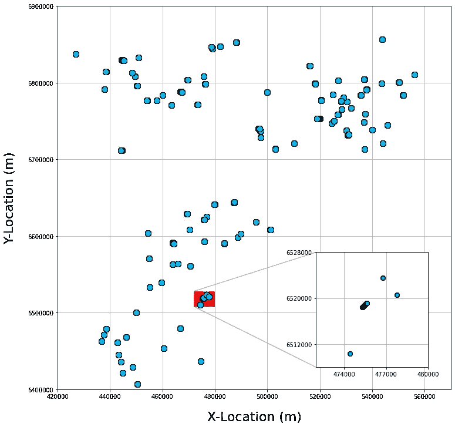

# 将插图坐标轴添加到 Matplotlib 图形中

> 原文：[`towardsdatascience.com/adding-inset-axes-to-matplotlib-figures-811a9482c43c?source=collection_archive---------7-----------------------#2023-11-03`](https://towardsdatascience.com/adding-inset-axes-to-matplotlib-figures-811a9482c43c?source=collection_archive---------7-----------------------#2023-11-03)

## 关于如何将插图坐标轴添加到 Matplotlib 图形中的教程，以提升数据可视化效果

 [Andy McDonald](https://andymcdonaldgeo.medium.com/?source=post_page-----811a9482c43c--------------------------------)

·

[关注](https://medium.com/m/signin?actionUrl=https%3A%2F%2Fmedium.com%2F_%2Fsubscribe%2Fuser%2F9c280f85f15c&operation=register&redirect=https%3A%2F%2Ftowardsdatascience.com%2Fadding-inset-axes-to-matplotlib-figures-811a9482c43c&user=Andy+McDonald&userId=9c280f85f15c&source=post_page-9c280f85f15c----811a9482c43c---------------------post_header-----------) 发表在 [Towards Data Science](https://towardsdatascience.com/?source=post_page-----811a9482c43c--------------------------------) ·6 min read·2023 年 11 月 3 日

--

由作者通过 DALL-E 3 创建的图像。

在 matplotlib 中创建图形时，可能会有需要在主图形中添加一个较小的图形或坐标轴的情况。这可能有多种原因，但最常见的是用来突出显示感兴趣的区域并放大它，或者包含与主图形相关的额外信息。

Matplotlib 使这个过程变得非常简单，通过允许我们在主图形中添加插图坐标轴。然后，可以进一步调整以使信息按我们希望的方式显示。

在这个简短的教程中，我们将学习如何使用网格坐标创建一个简单的井位置图，如下所示。然后我们将添加 inset 轴来突出和放大主地图的一个较小区域。

最终的 matplotlib 图像包含的 inset_axes 突出了更小的一部分井。图片由作者提供。

# 导入库和加载数据

我们教程的第一步是导入我们将要使用的库。

前两个导入语句应该很熟悉：导入 [**pandas**](https://pandas.pydata.org/) 和 [**matplotlib**](https://matplotlib.org/stable/)。
