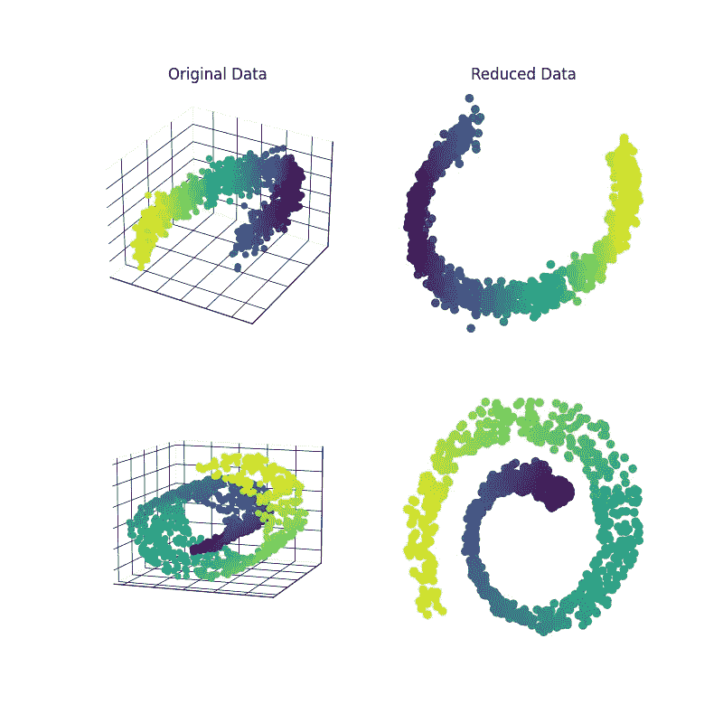
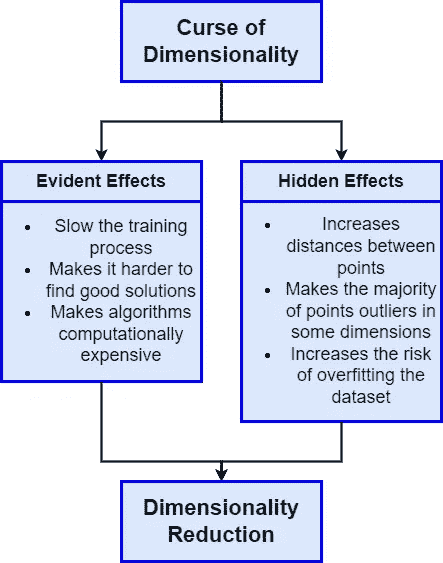
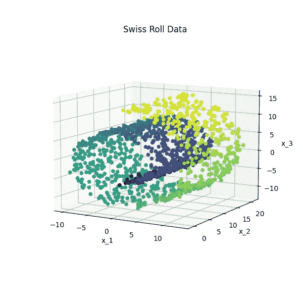
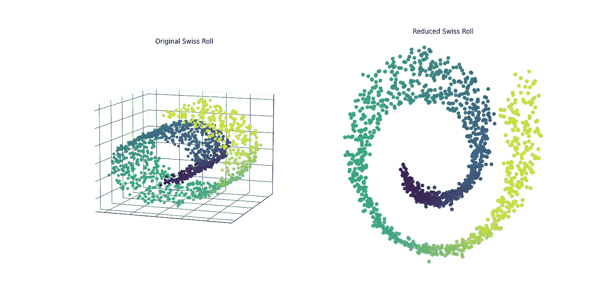
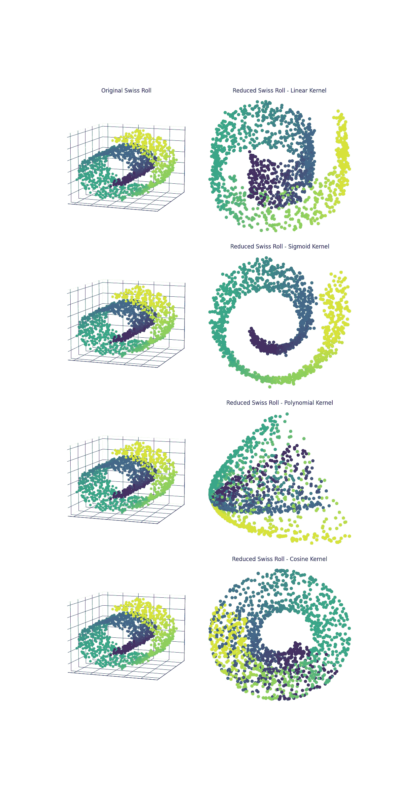
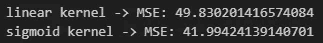
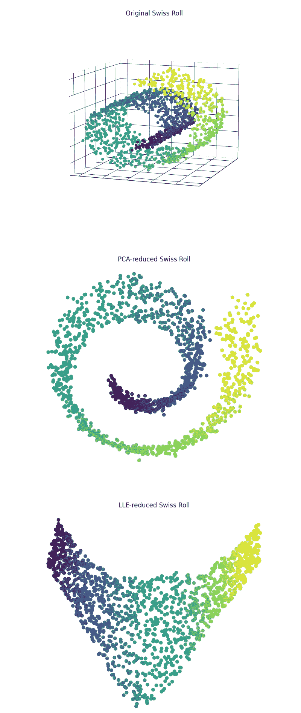
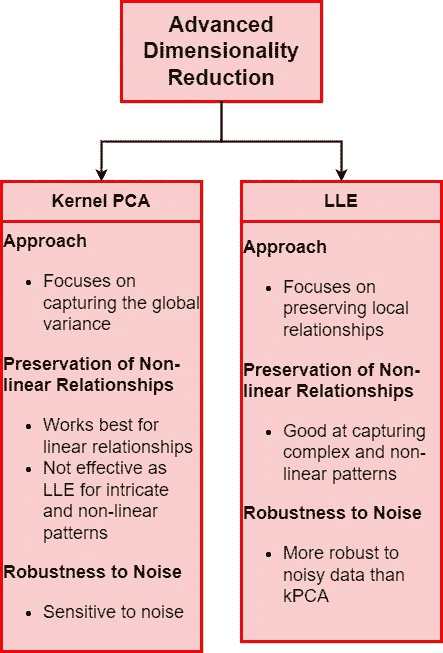

# 高级维度减少模型简明解析

> 原文：[`towardsdatascience.com/advanced-dimensionality-reduction-models-made-simple-639fca351528`](https://towardsdatascience.com/advanced-dimensionality-reduction-models-made-simple-639fca351528)

## 学习如何高效地应用最先进的维度减少方法，并提升你的机器学习模型。

[](https://medium.com/@riccardo.andreoni?source=post_page-----639fca351528--------------------------------)[](https://towardsdatascience.com/?source=post_page-----639fca351528--------------------------------) [Riccardo Andreoni](https://medium.com/@riccardo.andreoni?source=post_page-----639fca351528--------------------------------)

·发布于 [Towards Data Science](https://towardsdatascience.com/?source=post_page-----639fca351528--------------------------------) ·阅读时间 9 分钟·2023 年 11 月 16 日

--


图片来源：[unsplash.com](https://unsplash.com/photos/multicolored-wall-in-shallow-focus-photography-jbtfM0XBeRc)。

当面对机器学习任务时，你是否曾因**特征数量庞大**而感到震惊？

大多数数据科学家每天都会面临这一令人难以承受的挑战。虽然增加特征可以丰富数据，但它往往会**减缓训练过程**并使**发现隐藏模式**变得更加困难，结果就是（不）著名的[**维度诅咒**](https://en.wikipedia.org/wiki/Curse_of_dimensionality)**。**

此外，在高维空间中会发生**惊人的现象**。为了用类比来描述这个概念，可以想象小说《平面国》，其中生活在二维平面世界的角色在遇到三维生物时感到震惊。类似地，我们难以理解在高维空间中，**大多数点都是异常值**，而且**点之间的距离**通常**比预期要大**。所有这些现象如果处理不当，可能对我们的机器学习模型产生**灾难性的影响**。



图片由作者提供。

在这篇文章中，我将解释一些用于缓解这一问题的高级维度减少技术。

在我之前的文章中，我介绍了**维度减少**在机器学习问题中的相关性，以及如何驯服**维度诅咒**，并解释了**主成分分析**算法的理论和 Scikit-Learn 实现。

在接下来的内容中，我将深入探讨更多**降维算法**，例如 [kPCA](http://scikit-learn.org/stable/modules/generated/sklearn.decomposition.KernelPCA.html) 或 [LLE](http://scikit-learn.org/stable/modules/generated/sklearn.manifold.LocallyLinearEmbedding.html)，这些算法克服了 PCA 的局限性。

如果你还没有阅读我的降维介绍，请不要担心。这篇文章是**独立的指南**，因为我会用简单的术语详细讲解每个概念。然而，如果你希望了解更多关于 PCA 的内容，我相信这篇指南会帮助你实现目标：

[](/dimensionality-reduction-with-scikit-learn-pca-theory-and-implementation-aa224e6ee1f6?source=post_page-----639fca351528--------------------------------) [## 使用 Scikit-Learn 进行降维：PCA 理论与实现]

### 维度诅咒是可以被驯服的！学习如何使用 Python 和 Scikit-Learn 来实现它。

towardsdatascience.com

# 维度诅咒

[维度诅咒](https://en.wikipedia.org/wiki/Curse_of_dimensionality)确实是数据科学中的一个**重大挑战**，使得算法在计算上变得复杂。当数据集中的维度增加时，数据点变得稀疏，从而导致非平凡的计算问题。

人类在理解超过 3（有时是 2）维的空间时感到困难，这导致了**高维空间中的意外行为**。

考虑一个二维正方形：随机选取一个点，它不太可能靠近边界。然而，在高维空间中，随机点靠近边界的概率会呈指数增长。在一个 10,000 维的超立方体中，靠近边界的概率超过 99.99999%。一个实验显示，在一个 100,000 维的超立方体中，两个随机点之间的平均距离为 129.09，这突显了高维空间的广阔。我将给你留下代码，供你自己测试这些说法。

[## articles/dimensionality-reduction/curse-of-dimensionality.ipynb at main · andreoniriccardo/articles]

### 通过在 GitHub 上创建帐户来贡献 andreoniriccardo/articles 的开发。

[github.com](https://github.com/andreoniriccardo/articles/blob/main/dimensionality-reduction/curse-of-dimensionality.ipynb?source=post_page-----639fca351528--------------------------------)

对于数据科学从业者来说，这意味着高维数据集**极其稀疏**，训练实例彼此之间相距较远，这增加了过拟合机器学习模型的风险。

由于随着特征的增加所需点数的**指数级增长**，添加更多的训练样本在实际操作中不可行：为了在一个 100 特征的数据集中保持每个训练点之间的距离为 0.1，你需要添加比宇宙中原子数量还多的点。唯一可行的解决方案是维度降低，我将探索在不显著丢失信息的情况下实现这一目标的技术。



作者提供的图片。

关于维度诅咒主题的更广泛介绍，我链接了这篇文章。

现在是展示一些**最先进的维度降低算法**的时候了！

# 核主成分分析

确实，最广泛应用的维度降低模型[主成分分析](https://en.wikipedia.org/wiki/Principal_component_analysis)（PCA），**将数据投影到低维超平面上**，降低了维度数量。

这个简单的概念在处理那些不能有效投影到平面上而不丢失大量原始信息的数据集时会遇到困难。

以合成的瑞士卷数据集为例：



作者提供的图片。

将数据投影到平面上毫无意义：**原始数据的非线性组件被丢失**。

应用 PCA 算法到各种数据集的最直接解决方案是利用[**核技巧**](https://en.wikipedia.org/wiki/Kernel_method#:~:text=The%20kernel%20trick%20avoids%20the,inner%20product%20in%20another%20space%20.)。我在这篇文章中详细介绍了核技巧：

[](/support-vector-machine-with-scikit-learn-a-friendly-introduction-a2969f2ff00d?source=post_page-----639fca351528--------------------------------) ## 使用 Scikit-Learn 进行支持向量机：一个友好的介绍

### 每位数据科学家都应该在工具箱中拥有 SVM。学习如何通过实践掌握这一多功能模型…

towardsdatascience.com

核技巧将低维空间的数据点映射到高维空间。支持向量机利用核技巧在高维空间中绘制线性决策边界，从而在原始特征空间中产生**复杂的非线性边界**。

同样的技术可以应用于 PCA 算法，得到[**核主成分分析**](https://en.wikipedia.org/wiki/Kernel_principal_component_analysis)（kPCA）。

由于 Scikit-learn (sklearn) 库，应用核主成分分析在 Python 中非常简单。在最简单的形式中，我们只需实例化一个 `KernelPCA()` 对象，指定要使用的核类型和输出的维度数。

```py
# Import required libraries
from sklearn.datasets import make_swiss_roll
from sklearn.decomposition import KernelPCA

# Generate synthetic data
X_swiss, t = make_swiss_roll(n_samples=1500, noise=0.3, random_state=2)

# Instantiate a KernelPCA object, specifying the kernel type 
# and the output's dimensions
pca_swiss = KernelPCA(n_components=2, kernel='sigmoid', gamma=1e-3, coef0=1, fit_inverse_transform=True)
# Transform the original data
X_pca_swiss = pca_swiss.fit_transform(X_swiss)

# Plot the original vs. reduced data
```

结果是我们得到以下的降维数据集：



图片由作者提供。

根据我们选择的核函数类型，kPCA 会输出完全不同的结果：



图片由作者提供。

在这个简单的示例中，我实验了 4 种不同类型的核函数：线性、Sigmoid、多项式和余弦。我们可以立即看到线性核和 Sigmoid 核在提供的数据集上产生了令人满意的结果。而多项式核和余弦核似乎不适合这个数据集。

到目前为止，你可能会问以下问题：

> 是否有一种可靠的方法来选择合适的核函数？

下一部分旨在解决这个问题！

## 如何选择核函数

作为**无监督学习模型**的 Kernel PCA，我们不能仅仅使用网格搜索技术并根据性能指标选择最佳超参数。因此，选择使用哪种核函数是棘手的。

如果 kPCA 只是你的机器学习算法的一个预处理步骤，后面跟着分类或回归模型，我们确实可以选择网格搜索方法。这个想法是将 kPCA 的核函数类型视为机器学习模型的一个超参数，并选择产生最佳性能度量的核函数。

如果我们将 kPCA 算法视为一个独立的模型，则可以选择使重建误差最低的核函数作为替代方案。

为了使用 Scikit-learn 实现这一点，我们可以利用`inverse_transform()`方法：

```py
from sklearn.datasets import make_swiss_roll
from sklearn.metrics import mean_squared_error
from sklearn.decomposition import KernelPCA

X_swiss, t = make_swiss_roll(n_samples=1500, noise=0.3, random_state=2)

kPCA_dict = {
    "linear": KernelPCA(n_components=2, kernel='linear', fit_inverse_transform=True),
    "sigmoid": KernelPCA(n_components=2, kernel='sigmoid', gamma=1e-3, coef0=1, fit_inverse_transform=True)
}

X_pca_swiss = {}
X_preimage = {}

for kernel_type in kPCA_dict.keys():
    X_pca_swiss[kernel_type] = kPCA_dict[kernel_type].fit_transform(X_swiss)
    X_preimage[kernel_type] = kPCA_dict[kernel_type].inverse_transform(X_pca_swiss[kernel_type])
    mse = mean_squared_error(X_swiss, X_preimage[kernel_type])
    print('{} kernel -> MSE: {}'.format(kernel_type, mse))
```



我们可以看到，使用 Sigmoid 核的 kPCA 表现略优于使用线性核的 kPCA。

# LLE

与我们迄今所见的完全不同，存在一种强大的降维技术，它不依赖于投影。[**局部线性嵌入**](https://cs.nyu.edu/~roweis/lle/papers/lleintro.pdf)（LLE）专注于**保留数据中的局部关系**。

更简单地说，想象一下你在一个高维空间中有一堆数据点，每个维度代表不同的特征。LLE（局部线性嵌入）关注的是小的邻域点群，而不是一次性查看整个数据集。它尝试在低维空间中表示这些邻近点，同时保持它们之间的关系。

你现在可能会问的随之而来的问题是：

> 维护数据点之间关系意味着什么？

在不涉及复杂数学的情况下，LLE 保留数据点之间的关系意味着在低维空间中**保持数据的内在几何结构**。想象你有一个高维数据集，其中某些点彼此接近，并且共享某种有意义的关系。这个关系可能依赖于多个因素，如接近度、相似性、连通性等。重要的是，LLE 旨在在降低数据维度时保持这些关系。

结果是，LLE 捕捉到**数据的潜在结构**，尤其是当点之间的关系复杂且（或）非线性时。

为了将 LLE 算法与 kPCA 进行比较，我将 LLE 应用于相同的数据集并绘制结果：

```py
from sklearn.datasets import make_swiss_roll
from sklearn.manifold import LocallyLinearEmbedding
from sklearn.decomposition import KernelPCA

X_swiss, t = make_swiss_roll(n_samples=1500, noise=0.3, random_state=2)

lle = LocallyLinearEmbedding(n_components=2, n_neighbors=15)
X_pca_swiss_lle = lle.fit_transform(X_swiss)

pca_swiss = KernelPCA(n_components=2, kernel='sigmoid', gamma=1e-3, coef0=1, fit_inverse_transform=True)
X_pca_swiss_pca = pca_swiss.fit_transform(X_swiss)
```



作者提供的图片。

与 kPCA 不同，LLE 似乎能更好地“理解”数据的模式和关系，并能够**展开瑞士卷数据集**。

# PCA 与 LLE

我想通过描述最常用算法之间的差异，并阐明在何时优先应用某一种算法，来总结这篇关于高级降维技术的文章。

PCA 和 LLE 首先在它们使用的**方法**上有所不同。LLE 在局部视角下扫描数据集，专注于保留“邻近”点之间的关系，而 PCA 采取全局视角，捕捉整体数据集的方差。

这两种不同算法的**应用范围**也有所不同。通过关注小的数据显示集，LLE 能够捕捉复杂且非线性的模式。而 PCA，即使是 kPCA 变体，可能在捕捉像我们之前看到的瑞士卷示例这种更复杂的模式时表现不佳。

最后，这些算法如何受到**噪声**的影响是另一个区别。由于考虑了所有数据点，PCA 往往会受到噪声数据集的更大影响，可能导致准确性下降。



作者提供的图片。

LLE 和 PCA 的这些不同特性使它们适用于**不同的任务集**和**数据集类型**。LLE 在捕捉复杂的局部结构方面表现出色。而当数据集的全局表示和整体方差的保留是关键时，PCA 更受青睐。

最后，由于降维的主题远远超出了简单的 Medium 帖子所能解释的范围，我建议通过阅读“参考”部分提供的材料，深入探讨这一基础的机器学习问题。

如果你喜欢这个故事，可以关注我，以便了解我的即将发布的项目和文章！

这是我过去的一些项目：

[](/outlier-detection-with-scikit-learn-and-matplotlib-a-practical-guide-382d1411b8ec?source=post_page-----639fca351528--------------------------------) ## 使用 Scikit-Learn 和 Matplotlib 进行异常检测：实用指南

### 了解可视化、算法和统计如何帮助你识别机器学习任务中的异常。

towardsdatascience.com [](/social-network-analysis-with-networkx-a-gentle-introduction-6123eddced3?source=post_page-----639fca351528--------------------------------) ## 使用 NetworkX 进行社交网络分析：温和入门

### 了解像 Facebook 和 LinkedIn 这样的公司如何从网络中提取洞察。

towardsdatascience.com [](/use-deep-learning-to-generate-fantasy-character-names-build-a-language-model-from-scratch-792b13629efa?source=post_page-----639fca351528--------------------------------) ## 使用深度学习生成奇幻角色名称：从零构建语言模型

### 语言模型能否发明独特的奇幻角色名称？让我们从头开始构建它。

towardsdatascience.com

# 参考文献

+   [主成分分析 — Sklearn](http://scikit-learn.org/stable/modules/generated/sklearn.decomposition.PCA.html)

+   [Scikit-Learn、Keras 和 TensorFlow 的实战机器学习，第 2 版 — Aurélien Géron](https://www.oreilly.com/library/view/hands-on-machine-learning/9781492032632/)

+   [深入学习 — Aston Zhang, Zachary C. Lipton, Mu Li, 和 Alexander J. Smola](https://d2l.ai/)

+   [Schölkopf, B., Smola, A., & Müller, K. (1998). 作为核特征值问题的非线性分量分析。神经计算，10(5)，1299–1319](https://www.mlpack.org/papers/kpca.pdf)。

+   [Schölkopf, B., & Smola, A. J. (2002). 《学习与核方法：支持向量机、正则化、优化及其他》。MIT 出版社。](https://direct.mit.edu/books/book/1821/Learning-with-KernelsSupport-Vector-Machines)

+   [Mika, S., Schölkopf, B., Smola, A., Müller, K. R., Scholz, M., & Rätsch, G. (1999). 核主成分分析及特征空间去噪。神经信息处理系统进展，11。](https://papers.nips.cc/paper/1491-kernel-pca-and-de-noising-in-feature-spaces)

+   [Roweis, S. T., & Saul, L. K. (2000). 通过局部线性嵌入进行非线性维度约简。科学，290(5500)，2323–2326。](https://www.science.org/doi/10.1126/science.290.5500.2323)

+   [Roweis, S. (2002). PCA 和 SPCA 的 EM 算法。神经信息处理系统进展，15。](https://proceedings.neurips.cc/paper/1398-em-algorithms-for-pca-and-spca.pdf)

+   [Saul, L. K. 和 Roweis, S. T. (2003). 从全球视角思考，本地拟合：低维流形的无监督学习. 机器学习研究期刊, 4(11 月), 119–155.](https://psycnet.apa.org/record/2004-13930-001)
