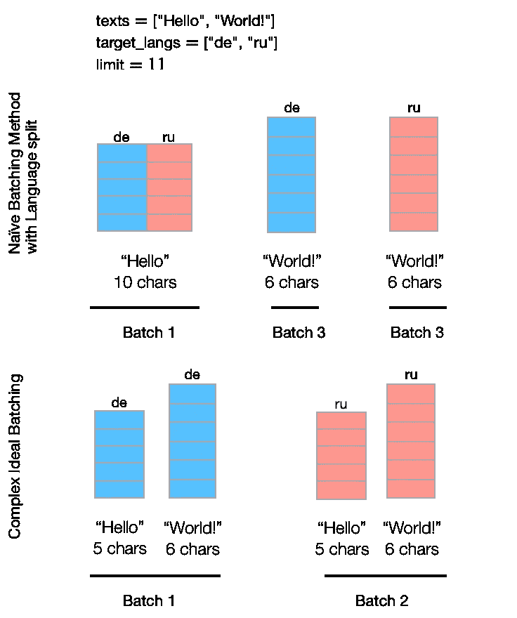
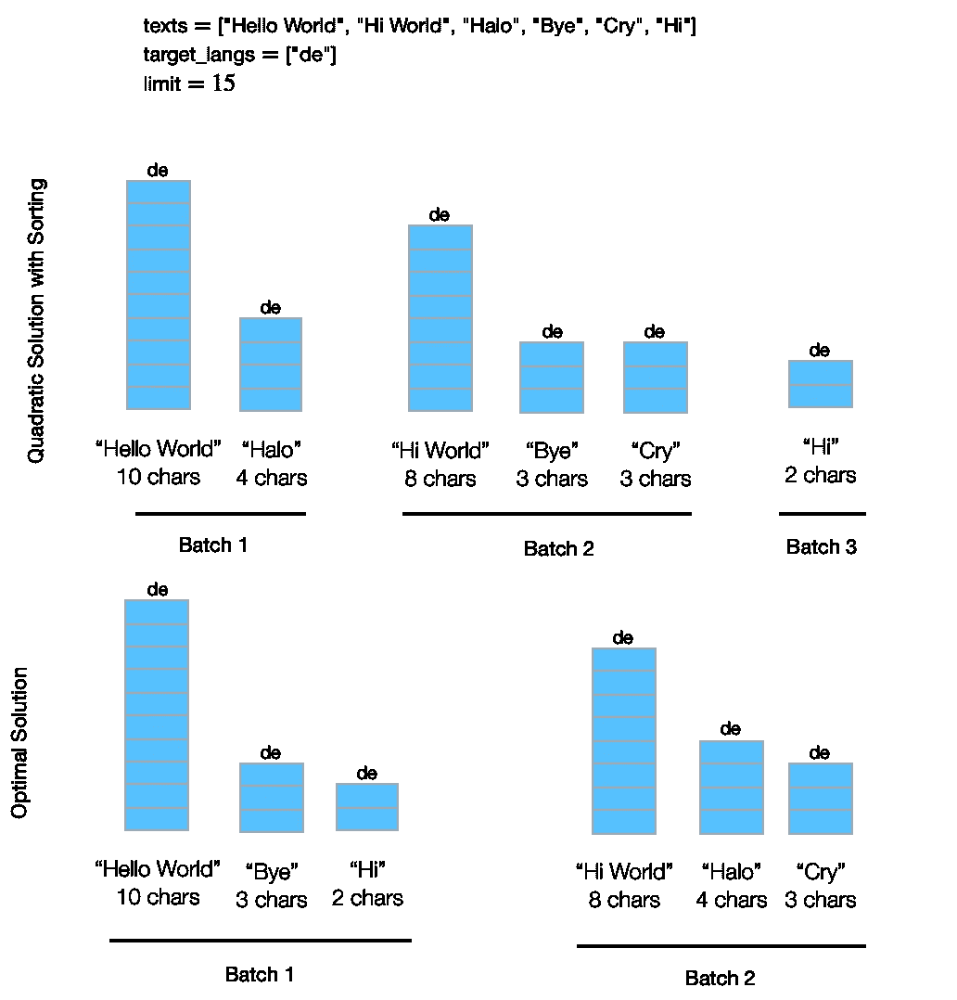
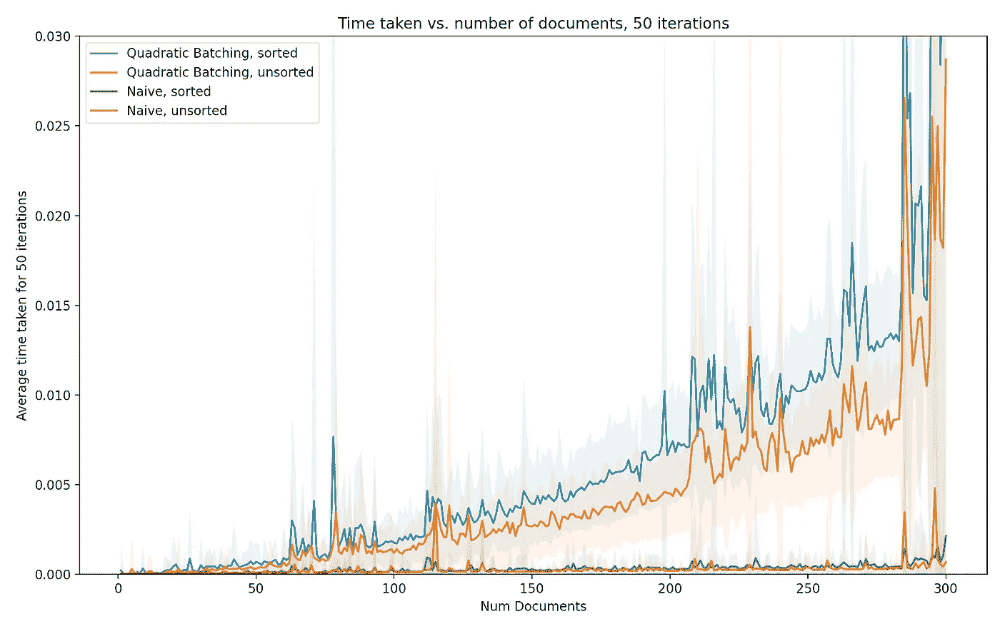
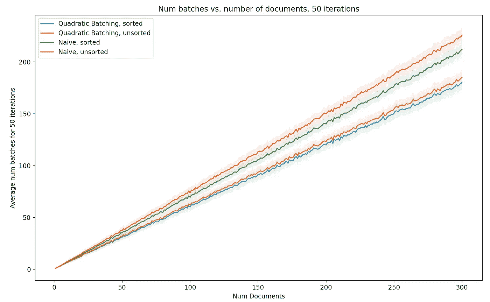
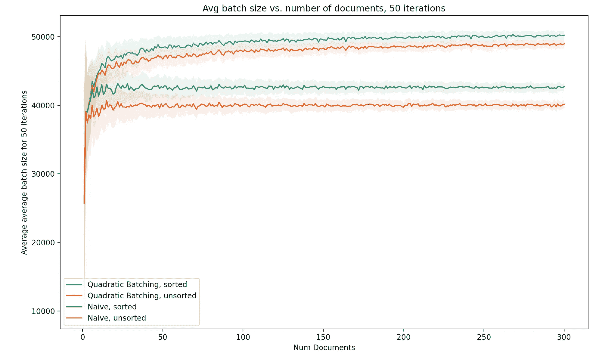

# 高级指南：通过自动批处理输入来避免 Microsoft Translator API 的最大字符限制

> 原文：[`towardsdatascience.com/advanced-guide-avoiding-max-character-limits-on-the-microsoft-translator-api-by-auto-batching-8a106e5f9f80`](https://towardsdatascience.com/advanced-guide-avoiding-max-character-limits-on-the-microsoft-translator-api-by-auto-batching-8a106e5f9f80)

## 最大限度利用免费订阅层

[](https://namiyousef96.medium.com/?source=post_page-----8a106e5f9f80--------------------------------)[](https://towardsdatascience.com/?source=post_page-----8a106e5f9f80--------------------------------) [Yousef Nami](https://namiyousef96.medium.com/?source=post_page-----8a106e5f9f80--------------------------------)

·发布在 [Towards Data Science](https://towardsdatascience.com/?source=post_page-----8a106e5f9f80--------------------------------) ·阅读时间 24 分钟·2023 年 1 月 31 日

--


图片来源于 [Unsplash](https://unsplash.com/photos/5Z8mR4vqJD4)，感谢 [Edurne](https://unsplash.com/@edurnetx)。

Microsoft Translator API [[1](https://www.microsoft.com/en-us/translator/business/translator-api/)] 是设置最简单的翻译服务之一，它功能强大，可以免费访问多种低资源和高资源语言的翻译服务。然而，它每个请求有 **50000 字符的最大限制** [[2](https://learn.microsoft.com/en-us/azure/cognitive-services/translator/request-limits)]，每小时使用有 **200 万字符的最大限制**（在免费版本中）。所以虽然服务本身非常易于设置和使用，但可靠使用却相当困难。

在本文中，我将探讨确保以下方法：

+   可以通过自动批处理输入将任意数量的文本翻译成任意数量的目标语言，同时遵守最大字符限制

+   连续请求会被延迟，以符合每小时最大字符限制

在最坏的情况下（免费订阅），这些方法将减少部分翻译中浪费的字符；在最好的情况下（付费订阅），它们将为你节省开支。

本教程面向对 Microsoft Translator API 有一定了解的用户。如果你不熟悉，并希望获得一个适合初学者的设置指南，请查看下面我的介绍文章：

[](/how-to-integrate-the-microsoft-translator-api-in-your-code-89bad979028e?source=post_page-----8a106e5f9f80--------------------------------) ## 如何在代码中集成 Microsoft Translator API

### 一个全面的适合初学者的指南

towardsdatascience.com

# 简单翻译接口的问题

我原来的翻译代码只是一个 `requests` 的封装，它接受文本列表、目标语言列表以及可选的源语言作为参数，并调用翻译 API 的 **translate** 端点。翻译函数的代码片段如下：

```py
def translate_text(
    text: Union[str, list],
    target_language: Union[str, list],
    source_language: Optional[str] = None,
    api_version: str = '3.0') -> tuple:
    """translates txt using the microsoft translate API

    :param text: text to be translated. Either single or multiple (stored in a list)
    :param target_language: ISO format of target translation languages
    :param source_language: ISO format of source language. If not provided is inferred by the translator, defaults to None
    :param api_version: api version to use, defaults to "3.0"
    :return: for successful response, (status_code, [{"translations": [{"text": translated_text_1, "to": lang_1}, ...]}, ...]))        
    """

    url = f'{MICROSOFT_TRANSLATE_URL}/translate?api-version={api_version}'

    if isinstance(target_language, str):
        target_language = [target_language]

    # extend url with array parameters, e.g. f"{url}&to=de&to=ru"
    url = add_array_api_parameters(
        url,
        param_name='to',
        param_values=target_language
    )

    if source_language:
        url = f'{url}&from={source_language}'

    if isinstance(text, str):
        text = [text]

    body = [{'text': text_} for text_ in text]

    LOGGER.info(f'Translating {len(text)} texts to {len(target_language)} languages')
    resp = requests.post(url, headers=HEADERS, json=body)
    status_code = resp.status_code

    if is_request_valid(status_code):
        return resp.json(), status_code

    return resp.text, status_code
```

在使用过程中，我遇到了导致我的翻译请求失败的挑战：

+   **挑战 1：** 文本的总大小在翻译成所有目标语言时超出了最大字符限制

+   **挑战 2：** 至少有一段我的文本在翻译成所有目标语言时超出了最大字符限制

+   **挑战 3：** 至少有一段我的文本超出了最大字符限制

+   **挑战 4：** 我的文本总大小虽然微不足道，但由于非常频繁地调用端点，我达到了最大请求次数限制

下一部分将介绍一个处理上述四个挑战的翻译函数的初步实现

# 初步实现 — 天真的自动分批

## 挑战 1 — 文本过多，语言过多

第一个问题发生在当你有一组文本时，**没有单一文本**在翻译成目标语言时超出最大字符限制，但**这些文本加起来却会**。

具体来说，这意味着你不能发送一个包含 **n** 段文本的单个请求，其总大小 **S** 超过 50000。根据微软文档 [[2](https://learn.microsoft.com/en-us/azure/cognitive-services/translator/request-limits)]，我们知道文本的**大小**是计算文本的**字符数**乘以其翻译成的**语言数**。在 Python 中：

```py
texts = ["Hi this is a dummy text", "Oh no dummy text"]
target_languages = ["de", "ru"]
n_target_langs = len(target_languages)
text_sizes = [len(text) for text in texts]
total_size = sum(text_sizes) * n_target_langs
assert total_size <= 50000
```

因此，我们需要一个函数将所有输入文本分成批次，每个批次的总大小不超过 50000。我的初步实现结果如下代码：

```py
from typing import Dict, List

def batch_by_size(sizes: Dict[int, int], limit: int, sort_docs: bool = False) -> List[Dict[str, Union[int, List[int]]]]:
    """Given a size mapping such {document_id: size_of_document}, batches documents such that the total size of a batch of documents does not exceed pre-specified limit

    :param sizes: mapping that gives document size for each document_id
    :param limit: size limit for each batch
    :sort_doc: if True sorts `sizes` in descending order
    :return: [{'idx': [ids_for_batch], 'total_size': total_size_of_documents_in_batch}, ...]

    Example:
        >>> documents = ['Joe Smith is cool', 'Django', 'Hi']
        >>> sizes = {i: len(doc) for i, doc in enumerate(documents)}
        >>> limit = 10
        >>> batch_by_size(sizes, limit)
        [{'idx': [0], 'total_size': 17}, {'idx': [1, 2], 'total_size': 8}]
    """
    if sort_docs:
        sizes = {key: size for key, size in sorted(sizes.items(), key=lambda x: x[1], reverse=True)}

    batched_items = []
    sizes_iter = iter(sizes)
    key = next(sizes_iter)
    while key is not None:
        if not batched_items:
            batched_items.append({
                'idx': [key],
                'total_size': sizes[key]
            })
        else:
            size = sizes[key]
            if size > limit:
                LOGGER.warning(f'Document {key} exceeds max limit size: {size}>{limit}')
            total_size = batched_items[-1]['total_size'] + size
            if total_size > limit:
                batched_items.append({
                    'idx': [key],
                    'total_size': size
                })
            else:
                batched_items[-1]['idx'].append(key)
                batched_items[-1]['total_size'] = total_size
        key = next(sizes_iter, None)

    return batched_items
```

上面的 `translate_text` 函数现在可以修改为包含此功能：

```py
MAX_CHARACTER_LIMITS = 50000
def translate_text(
    text: Union[str, list],
    target_language: Union[str, list],
    source_language: Optional[str] = None,
    api_version: str = '3.0') -> tuple:
    """translates txt using the microsoft translate API

    :param text: text to be translated. Either single or multiple (stored in a list)
    :param target_language: ISO format of target translation languages
    :param source_language: ISO format of source language. If not provided is inferred by the translator, defaults to None
    :param api_version: api version to use, defaults to "3.0"
    :return: for successful response, (status_code, [{"translations": [{"text": translated_text_1, "to": lang_1}, ...]}, ...]))        
    """

    url = f'{MICROSOFT_TRANSLATE_URL}/translate?api-version={api_version}'

    if isinstance(target_language, str):
        target_language = [target_language]

    # extend url with array parameters, e.g. f"{url}&to=de&to=ru"
    url = add_array_api_parameters(
        url,
        param_name='to',
        param_values=target_language
    )

    if source_language:
        url = f'{url}&from={source_language}'

    if isinstance(text, str):
        text = [text]

    ### start of new code --------------------------------------------
    n_target_langs = len(target_language)

    # get maximum size of each document

    sizes_dict = {i: len(text_)*n_target_langs for i, text_ in enumerate(text)}
    batched_texts = batch_by_size(sizes_dict, MAX_CHARACTER_LIMITS)

    # for each batch, translate the texts. If successful append to list
    translation_outputs = []
    for batch in batched_texts:
        doc_ids = batch['idx']
        batch_texts = [text[doc_id] for doc_id in doc_ids]
        body = [{'text': text_} for text_ in batch_texts]
        LOGGER.info(f'Translating {len(text)} texts to {len(target_language)} languages')
        resp = requests.post(url, headers=HEADERS, json=body)
        status_code = resp.status_code
        if not is_request_valid(status_code):
            raise Exception(f'Translation failed for texts {doc_ids}')

        translation_output = resp.json()
        translation_outouts += translation_output

    return translation_outouts, status_code
    ### end of new code ----------------------------------------------
```

注意一些关键考虑因素：

+   翻译单个批次的失败会导致整个请求失败

+   批处理函数的复杂度为 O(n)

+   在最坏情况下，翻译循环的复杂度为 O(n)（例如，每个文本大小达到最大限制）。实际情况可能会少一些，但算法不会尝试最小化批次数量，因为它仅仅是线性地遍历文本


## 挑战 2 — 单一文本，语言过多

虽然上述代码适用于大多数情况，但你不可避免地会遇到一个情况，其中有一个**单一文本**，单独来看不会超过最大字符限制，但如果翻译成所有语言则会。在 Python 中：

```py
max_limit = 10
text = "Hello!"
text_size = len(text)  # 6
target_languages = ["de", "ru"]
n_target_langs = len(target_languages)
total_size = text_size * n_target_langs  # 12
assert total_size <= max_limit  # 12 <= 10, raises error!
```

在这种情况下，问题文本必须单独翻译到一批目标语言中，最坏情况下，必须分别为每种语言翻译。不过，到目前为止，我们意识到可以考虑两种批处理策略：

+   批处理大小由`len(text) * n_target_langs`定义：批处理项目解决**挑战 1**。对于大小`S = len(text) * n_target_langs > max_limit`的文本，按目标语言进一步批处理。

+   批处理大小由文本长度和目标语言的最佳组合定义：批处理文本，使每个批次可以关联任意数量的语言，只要`sum(texts_in_batch) * n_target_langs_for_batch <= max_limit`。

下面是一个示意图，展示了第二种方法导致的总体批次数较少的解决方案：



虽然第二种批处理策略是一个有趣的算法设计问题，但在这种用例中，问题超过了任何可能的好处：

+   首先，微软的限制基于消耗的总字符数，而不是请求的数量。因此，减少请求数量的唯一理论好处是速度。

+   其次，设计一个高效的算法是困难的，因此你从减少请求数量中获得的速度提升几乎微不足道，甚至可能不存在。

+   第三，最重要的是，按目标语言拆分文本会使得将它们映射回来非常困难。如果在翻译过程中出现失败，你将会有部分翻译的文本。

> ***注意：** 虽然使用第一种批处理策略时你也会遇到这个问题，但这种失败的频率会很低。对我能想到的大多数情况来说，拥有完整的翻译（例如，翻译成**所有**目标语言的文本）而丢弃有限数量的失败翻译，比为所有文本提供部分翻译（例如，翻译成目标语言子集的文本）更为重要。因为你可以提取失败文本的 ID 来重新翻译失败的示例，而填补部分翻译的空白则要困难得多。

因此，我继续使用第一种批处理策略。这导致了翻译功能的一些修改：

```py
MAX_CHARACTER_LIMITS = 50000
def translate_text(
    text: Union[str, list],
    target_language: Union[str, list],
    source_language: Optional[str] = None,
    api_version: str = '3.0') -> tuple:
    """translates txt using the microsoft translate API

    :param text: text to be translated. Either single or multiple (stored in a list)
    :param target_language: ISO format of target translation languages
    :param source_language: ISO format of source language. If not provided is inferred by the translator, defaults to None
    :param api_version: api version to use, defaults to "3.0"
    :return: for successful response, (status_code, [{"translations": [{"text": translated_text_1, "to": lang_1}, ...]}, ...]))        
    """

    url = f'{MICROSOFT_TRANSLATE_URL}/translate?api-version={api_version}'

    if isinstance(target_language, str):
        target_language = [target_language]

    if source_language:
        url = f'{url}&from={source_language}'

    if isinstance(text, str):
        text = [text]

    n_target_langs = len(target_language)

    # get maximum size of each document

    sizes_dict = {i: len(text_)*n_target_langs for i, text_ in enumerate(texts)}
    batched_texts = batch_by_size(sizes_dict, MAX_CHARACTER_LIMITS)

    # for each batch, translate the texts. If successful append to list
    translation_outputs = []
    for batch in batched_texts:
        doc_ids = batch['idx']
        total_size = batch['total_size']
        ### start of new code --------------------------------------------

        # case where single doc too big to be translated to all languages, but small enough that it can be translated to some languages
        if total_size > MAX_CHARACTER_LIMITS:
            translation_output = [dict(translations=[])]
            doc_size = sizes_dict[doc_ids[0]]  # necessarily only single document in batch
            batch_size = MAX_CHARACTER_LIMITS // doc_size
            batch_range = range(0, n_target_langs, batch_size)
            n_batches = len(batch_range)

            # batch by target languages
            for batch_id, start_lang_idx in enumerate(batch_range):
                end_lang_idx = start_lang_idx + batch_size
                target_languages_ = target_language[start_lang_idx: end_lang_idx]

                # rebuild the url for subset of langs
                url_ = add_array_api_parameters(
                    url,
                    param_name='to',
                    param_values=target_languages_
                )
                body = [{'text': text[doc_ids[0]]}]
                LOGGER.debug(f'Translating batch {batch_id+1}/{n_batches} of text with idx={doc_ids[0]}. Target languages: {target_languages_}')
                resp = requests.post(url_, headers=HEADERS, json=body)
                status_code = resp.status_code
                if not is_request_valid(status_code):
                    raise Exception(f'Translation failed for texts {doc_ids[0]}')
                partial_translation_output = resp.json()
                # concatenate outputs in correct format
                translation_output['translations'] += partial_translation_output['translations']

        else:
            # -- code as before, except translation_output now part of else
            batch_texts = [text[doc_id] for doc_id in doc_ids]
            body = [{'text': text_} for text_ in batch_texts]
            LOGGER.info(f'Translating {len(text)} texts to {len(target_language)} languages')
            # rebuild url for all languages
            url_ = add_array_api_parameters(
                url,
                param_name='to',
                param_values=target_language
            )
            resp = requests.post(url_, headers=HEADERS, json=body)
            status_code = resp.status_code
            if not is_request_valid(status_code):
                raise Exception(f'Translation failed for texts {doc_ids}')

            translation_output = resp.json()
        ### end of new code ----------------------------------------------
        translation_outputs += translation_output

    return translation_outputs, status_code
```

和以前一样，这里有一些关键考虑因素：

+   尽管如此，如果请求中出现失败，我们会失败整个翻译。这部分是因为我们**不知道**如何解决部分翻译的状态码，因为我们的输出期望一个单一的状态码。

+   批处理函数仍然是**O(n)**

+   翻译循环在理论上增加了计算复杂度。在最坏的情况下，我们现在有 **O(n*k)**，其中 **k** 是语言数量。然而，与以前不同，我们现在可以处理文本 **足够大** 以至于无法在一次请求中翻译到 **所有** 目标语言，但 **足够小** 以便可以作为 **单独** 请求翻译到 **部分** 目标语言。

## 挑战 3 — 单个大型文本

我们现在遇到了不可避免的边缘情况：一个超过 50000 个字符的单个文本。在这种情况下，我们之前的批处理方法都不起作用。我们唯一可以考虑的做法是自动拆分文本然后进行翻译。然而，我决定避免这样做，原因如下：

+   **单一职责原则：** 翻译函数的目的是作为 Microsoft Translator API 的封装器。在我看来，任何额外的处理应该在翻译之前完成。

+   **代码复杂性增加：** 支持句子分割需要使用句子分割库，这为一个本应作为微软 API 的封装器的函数增加了不必要的依赖。这还需要大量代码来确保句子分割方法返回相同的输出格式、在句子分割之前保留真实标签，并在翻译后使分割句子能够拼接回一起。

+   **输出模糊性增加：** 句子分割器的选择可能差异很大。这些方法可以是简单的、经典的或神经网络方法。句子分割方法的选择必然会影响翻译的质量，并在将翻译后的分割句子拼接回一起时引发模糊性。原则上，句子分割方法应在翻译函数之外使用，通过某些指标评估分割质量，然后再进行翻译。

基于上述原因，我决定在遇到这种情况时使用日志记录器添加错误。稍后我们将探讨在部分翻译失败的情况下，如何将其与其余代码结合起来以解决模糊性。

```py
 if total_size > MAX_CHARACTER_LIMITS:
            # -- start of new code
            doc_size = sizes_dict[doc_ids[0]]  # necessarily only single document in batch
            batch_size = MAX_CHARACTER_LIMITS // doc_size
            if not batch_size:
                msg = f'Text `{doc_ids[0]}` too large to be translated'
                if raise_error_on_translation_failure:
                    raise Exception(msg)
                LOGGER.error(msg)
            else:            
                batch_range = range(0, n_target_langs, batch_size)
                translation_output = [dict(translations=[])]
                # -- end of new code
```

## 挑战 4 — 请求过多

最终，你遇到的大多数情况不会是边缘情况。它们都将符合最大字符限制。然而，你会遇到的问题是尝试在短时间内调用翻译 API 太多次。

为了避免这种情况，微软建议你的请求每小时不超过 200 万个字符，或每分钟 33300 个字符。我们可以使用以下函数估计我们的请求是否会超过阈值：

```py
MAX_CHARACTER_LIMITS_PER_HOUR = 2000000
def _sleep(time_of_last_success, request_size):
    if time_of_last_success:
        time_diff_since_first_request = time.time() - time_of_last_success
        time_diff_needed_for_next_request = request_size / (MAX_CHARACTER_LIMITS_PER_HOUR / 3600) 
        sleep_time = time_diff_needed_for_next_request - time_diff_since_first_request
        if sleep_time > 0:
            LOGGER.debug(f'Sleeping {sleep_time:.3g} seconds...')
            time.sleep(sleep_time)
```

每次我们发出请求时，都需要更新`time_of_last_success`的值（最初设置为`None`）。`request_size`是我们当前请求的大小，例如**批次中的总字符数 * 语言数量**。根据我的经验，这种方法有助于避免过载微软 API，但并不是最优的。我尝试过在不休眠的情况下运行翻译，并避免过载服务器。但由于不知道微软如何准确计算请求限制，设计一个最优的解决方案（速度方面）还是很困难的。

# 效率、解决歧义和清理代码

在上一节中，我们设计了一个概念验证解决方案，它改进了我们的简单翻译包装器。我们现在可以自动：

+   批处理文档，使每个批次的总大小不超过最大限制

+   按语言批处理文档，对于那些单个文档过大以至于无法翻译到所有目标语言的情况

+   获取因为超过最大限制而无法翻译的文档的 ID

+   通过根据我们在单次会话中发出的请求的总大小来减缓请求速度，避免达到最大请求次数限制

不过，我们仍然存在一些未解答的问题和低效的方法。在本节中，我们将介绍四个改进，以完善翻译功能：

+   **增强 1：** 通过改进批处理功能来减少请求次数

+   **增强 2：** 定义解决部分翻译的策略

+   **增强 3：** 将我们的代码重构为可重用的代码块

## 增强 1 — 减少请求次数

我们之前的数据批处理方法很快，但不是最适合最小化批次数的。相反，我们对其进行修改，使文档分配到每个批次中，从而最小化每个批次的总大小与最大字符限制之间的差异。

```py
def batch_by_size_min_buckets(sizes: Dict[Union[int, str], int], limit: int, sort_docs: bool = True) -> List[Dict[str, Union[int, List[int]]]]:
    """Given dictionary of documents and their sizes {doc_id: doc_size}, batch documents such that the total size of each batch <= limit. Algorithm designed to decrease number of batches, but does not guarantee that it will be an optimal fit

    :param sizes: mapping that gives document size for each document_id, {doc_1: 10, doc_2: 20, ...}
    :param limit: size limit for each batch
    :sort_doc: if True sorts `sizes` in descending order
    :return: [{'idx': [ids_for_batch], 'total_size': total_size_of_documents_in_batch}, ...]

    Example:
        >>> documents = ['Joe Smith is cool', 'Django', 'Hi']
        >>> sizes = {i: len(doc) for i, doc in enumerate(documents)}
        >>> limit = 10
        >>> batch_by_size(sizes, limit)
        [{'idx': [0], 'total_size': 17}, {'idx': [1, 2], 'total_size': 8}]
    """
    if sort_docs:
        sizes = {key: size for key, size in sorted(sizes.items(), key=lambda x: x[1], reverse=True)}

    batched_items = []
    sizes_iter = iter(sizes)
    key = next(sizes_iter)  # doc_id

    # -- helpers
    def _add_doc(key):
        batched_items.append({
            'idx': [key],
            'total_size': sizes[key]
        })

    def _append_doc_to_batch(batch_id, key):
        batched_items[batch_id]['idx'].append(key)
        batched_items[batch_id]['total_size'] += sizes[key]

    while key is not None:

        # initial condition
        if not batched_items:
            _add_doc(key)
        else:
            size = sizes[key]

            if size > limit:
                LOGGER.warning(f'Document {key} exceeds max limit size: {size}>{limit}')
                _add_doc(key)
            else:
                # find the batch that fits the current doc best
                batch_id = -1
                total_capacity = limit - size  # how much we can still fit
                min_capacity = total_capacity
                for i, batched_item in enumerate(batched_items):
                    total_size = batched_item['total_size']
                    remaining_capacity =  total_capacity - total_size  # we want to minimise this

                    # current batch too large for doc, go to next batch
                    if remaining_capacity < 0:
                        continue
                    # current batch is a better fit for doc, save batch_id
                    elif remaining_capacity < min_capacity:
                        min_capacity = remaining_capacity
                        batch_id = i

                    # if perfect fit, break loop
                    if remaining_capacity == 0:
                        break

                if batch_id == -1:
                    _add_doc(key)
                else:
                    _append_doc_to_batch(batch_id, key)

        key = next(sizes_iter, None) 
    return batched_items
```

注意与简单方法的一些比较：

+   批处理功能现在最坏情况下是 O(n²)。虽然这听起来令人担忧，但当我们考虑整个系统时，我们会发现时间上的主要瓶颈来自请求，因此，如果能大幅减少批次数，我们可以为批处理选择 O(n²)

+   虽然这比减少批次数的简单方法有了显著改进，但仍然是一个*近似*解决方案

+   我添加了一个可选的排序参数`sort_docs`以按降序排序大小。我的直觉是，将`sort_docs=True`应能减少批次数。

关于为什么这仍然是一个近似解决方案的说明，请参见下图：



值得注意的是，随机拆分在*理论上*可能会导致最优解。在这种情况下，如果文本按照以下顺序组织[“Hello World”，“Bye”，“Hi”，“Hi World”，“Cry”，“Halo”]（仅作为示例），那么没有排序的算法会导致最优解。然而，我们将看到平均而言，排序会导致更优的解决方案！

为了更好地理解排序如何影响算法，我运行了一些模拟，以下是一些结果：

+   **排序如何影响时间复杂度？**

下图展示了我们拥有的四种批处理策略（对排序和未排序情况分别使用二次和简单策略）的平均时间（经过 50 次迭代）。正如预期的那样，排序稍微减慢了批处理。然而，正如文章中之前所论述的，我们在时间上的主要瓶颈来自请求，而不是批处理，并且方法之间的时间差异不大，因此如果排序减少了批次，我们可以为排序找到合理的理由。



+   **排序如何影响批次数量？**

下图展示了两个重要的方面：

1.  与简单算法相比，二次批处理算法大幅减少了批次数量。

1.  排序减少了简单和二次算法的批次数量。

第一点展示了使用二次批处理的影响。微软翻译器的典型响应延迟为 150 毫秒[[2](https://learn.microsoft.com/en-us/azure/cognitive-services/translator/request-limits)]。如果我们考虑到简单算法和二次算法在 300 个文档时的最小差距，未排序的二次批处理与排序的简单批处理相比，我们有 40 个批次的差异。这意味着在最坏的情况下，二次算法仅请求就能节省 6 秒。与批处理算法的时间复杂度相比，我们发现二次算法的 O(n²)对整体翻译速度的影响可以忽略不计。当然，另一个隐含的好处是，我们有 40 次请求失败的机会减少了！

第二点很有趣，因为它通过实验证明了我的理论，即排序减少了批次的数量。不幸的是，我没有数学证明，所以目前实验证据足够了。



+   **排序如何影响平均批次大小？**

自然地，考虑到批次数量的趋势，我们预期二次算法的平均批次大小会比简单算法高，并且排序会分别增加每种算法的批次大小。这在下图中得到了实证反映。然而，有趣的是，所有情况下的平均批次大小似乎趋于一致。我们还可以看到，排序的二次算法在文档数量接近无限时趋于最大字符限制。



## 增强 2 — 解决部分翻译

之前，我们在遇到单个失败时自动使整个翻译过程失败。然而，在大多数翻译请求已经成功的情况下，或者在没有硬性要求 100% 成功翻译率的情况下，这可能是浪费的。因此，翻译函数的行为应由用户定义。以下是我们应该覆盖的一些显著情况：

+   **情况 1：** 如果有任何失败，则使整个过程失败

+   **情况 2：** 忽略输出中的失败，并移除部分翻译

+   **情况 3：** 忽略输出中的失败，但保留部分翻译

为了实现这些情况，我们添加了两个布尔参数：`raise_error_on_translation_failure` 和 `include_partials_in_output` 。第一个参数将在发生失败时引发错误（例如，在批处理级别或语言级别），如果设置为`True`（如果`False`，我们仍然记录错误！）。这涵盖了**情况 1**。第二个参数仅在 `raise_error_on_translation_failure=False` 时相关，它将在设置为`True` 时保留部分翻译，在设置为`False` 时移除部分翻译。相关代码如下：

```py
def translate_text(
    text: Union[str, list],
    target_language: Union[str, list],
    source_language: Optional[str] = None,
    api_version: str = '3.0', raise_error_on_translation_failure=True, include_partials_in_output=False) -> tuple:
    """translates txt using the microsoft translate API

    :param text: text to be translated. Either single or multiple (stored in a list)
    :param target_language: ISO format of target translation languages
    :param source_language: ISO format of source language. If not provided is inferred by the translator, defaults to None
    :param api_version: api version to use, defaults to "3.0"
    :param raise_error_on_translation_failure: if `True`, raises errors on translation failure. If `False` ignores failed translations in output
    :pram include_partials_in_output: if `True` includes partially translated texts in output, otherwise ignores them
    :return: for successful response, (status_code, [{"translations": [{"text": translated_text_1, "to": lang_1}, ...]}, ...]))        
    """

    url = f'{MICROSOFT_TRANSLATE_URL}/translate?api-version={api_version}'

    if isinstance(target_language, str):
        target_language = [target_language]

    if source_language:
        url = f'{url}&from={source_language}'

    if isinstance(text, str):
        text = [text]

    n_target_langs = len(target_language)

    sizes_dict = {i: len(text_)*n_target_langs for i, text_ in enumerate(text)}
    batched_texts = batch_by_size_min_buckets(sizes_dict, CHARACTER_LIMITS)

    translation_outputs = []
    for batch in batched_texts:
        translation_output = []
        doc_ids = batch['idx']
        total_size = batch['total_size']

        if total_size > CHARACTER_LIMITS:
            doc_size = sizes_dict[doc_ids[0]]
            batch_size = CHARACTER_LIMITS // doc_size

            if not batch_size:
                msg = f'Text `{doc_ids[0]}` too large to be translated'
                # -- new code ------------------------------------------
                if raise_error_on_translation_failure:
                    raise Exception(msg)
                LOGGER.error(msg)
                # -- end of new code ------------------------------------------

            else:
                _translation_output = dict(translations=[])
                batch_range = range(0, n_target_langs, batch_size)
                n_batches = len(batch_range)

                _translation_failed = False  # to track translations at language batching level
                for batch_id, start_lang_idx in enumerate(batch_range):
                    end_lang_idx = start_lang_idx + batch_size
                    target_languages_ = target_language[start_lang_idx: end_lang_idx]

                    url_ = add_array_api_parameters(url, param_name='to', param_values=target_languages_)
                    body = [{'text': text[doc_ids[0]]}]

                    LOGGER.info(f'Translating batch {batch_id+1}/{n_batches} of text with idx={doc_ids[0]}. Target languages: {target_languages_}')
                    resp = requests.post(url_, headers=HEADERS, json=body)
                    status_code = resp.status_code
                    if not is_request_valid(status_code):
                        # -- new code ------------------------------------------
                        msg = f'Partial translation of text `{doc_ids[0]}` to languages {target_languages_} failed.'
                        if raise_error_on_translation_failure:
                            raise Exception(msg)
                        LOGGER.error(msg)
                        _translation_failed = True
                        if not include_partials_in_output:
                            break
                        # -- end of new code-------------------------------------

                    partial_translation_output = resp.json()
                    _translation_output['translations'] += partial_translation_output['translations']

                # -- new code -------------------------------------------
                if not _translation_failed or include_partials_in_output:
                    translation_output.append(_translation_output)
                # -- end of new code ------------------------------------

        else:
            batch_texts = [text[doc_id] for doc_id in doc_ids]
            body = [{'text': text_} for text_ in batch_texts]
            LOGGER.info(f'Translating {len(text)} texts to {len(target_language)} languages')
            # rebuild url for all languages
            url_ = add_array_api_parameters(
                url,
                param_name='to',
                param_values=target_language
            )
            resp = requests.post(url_, headers=HEADERS, json=body)
            status_code = resp.status_code
            if not is_request_valid(status_code):
                # -- new code -----------------------------------
                msg = f'Translation failed for texts {doc_ids}. Reason: {resp.text}'
                if raise_error_on_translation_failure:
                    raise Exception(msg)
                LOGGER.error(msg)
                # -- end of new code --------------------------------
            else:
                translation_output += resp.json()

        translation_outputs += translation_output

    return translation_outputs, status_code
```

## 增强 3 — 清理代码

现在是清理代码并添加有用注释的时候了。然而，由于代码的可重用性高且逻辑复杂，将翻译函数重写为类是有意义的。这还带来了一个额外的好处，即允许我们存储翻译失败的文档/批次的 ID（如果你希望重新运行这些特定翻译，而不是通过日志查找它们，这非常有用！）。我还决定将 `raise_error_on_translation_failure` 更改为 `ignore_on_translation_failure`，并在发生失败且 `ignore_on_translation_failure=False` 时简单地返回错误和状态代码。我决定这样做是因为我不希望 API 函数引发错误（错误应通过状态代码捕获）。

最终代码如下：

```py
CHARACTER_LIMITS = 50000
MAX_CHARACTER_LIMITS_PER_HOUR = 2000000

class MicrosoftTranslator:
    """Class for translating text using the Microsoft Translate API

    :param api_version: api version to use, defaults to "3.0"
    :param ignore_on_translation_failure: if `False`, returns failed translations with error and status code. If `False` ignores failed translations in output, defaults to False
    :param include_partials_in_output: if `True` includes partially translated texts in output, otherwise ignores them, defaults to False

    """
    def __init__(
        self,
        api_version: str = '3.0',
        ignore_on_translation_failure: bool = False,
        include_partials_in_output: bool = False
    ):

        base_url = f'{MICROSOFT_TRANSLATE_URL}/translate?api-version={api_version}'

        self.base_url = base_url
        self.api_version = api_version
        self.ignore_on_translation_failure = ignore_on_translation_failure
        self.include_partials_in_output = include_partials_in_output

    def translate_text(
        self,
        texts: Union[str, list],
        target_languages: Union[str, list],
        source_language: Optional[str] = None
    ) -> tuple:
        """translates txt using the microsoft translate API

        :param texts: text(s) to be translated. Can either be a single text (str) or multiple (list)
        :param target_languages: ISO format of target translation language(s). Can be single lang (str) or multiple (list)
        :param source_language: ISO format of source language. If not provided is inferred by the translator, defaults to None
        :return: for successful response, (status_code, [{"translations": [{"text": translated_text_1, "to": lang_1}, ...]}, ...]))         
        """

        # -- create storage for translation failures and flag for failed translation
        self._set_request_default

        # add source language to url
        if source_language:
            base_url = f'{self.base_url}&from={source_language}'
        else:
            base_url = self.base_url

        # standardise target_languages and texts types
        if isinstance(target_languages, str):
            target_languages = [target_languages]

        if isinstance(texts, str):
            texts = [texts]

        # batch texts for translation, based on doc_size = len(doc)*n_target_langs
        n_target_langs = len(target_languages)
        sizes_dict = {i: len(text)*n_target_langs for i, text in enumerate(texts)}

        profile_texts = self._profile_texts(sizes_dict)
        if profile_texts:
            return profile_texts

        batched_texts = batch_by_size_min_buckets(sizes_dict, CHARACTER_LIMITS, sort_docs=True)

        translation_outputs = []  # variable to store all translation outputs

        for batch in batched_texts:
            batch_translation_output = []  # variable to store translation output for single batch
            doc_ids = batch['idx']
            total_size = batch['total_size']
            texts_in_batch = [texts[doc_id] for doc_id in doc_ids]
            # -- case when batch exceeds character limits
            if total_size > CHARACTER_LIMITS:
                assert len(doc_ids) == 1, 'Critical error: batching function is generating batches that exceed max limit with more than 1 text. Revisit the function and fix this.'

                doc_id = doc_ids[0]
                doc_size = sizes_dict[doc_id] // n_target_langs
                batch_size = CHARACTER_LIMITS // doc_size

                # -- case when a single doc is too large to be translated
                if not batch_size:
                    process_error = self._process_error(f'Text idx={doc_id} too large to be translated', 'Max character limit for request', 400, doc_ids, target_languages)
                    if process_error:
                        return process_error

                # -- case when single doc too big to be translated to all language, but small enough that it can be translated to some languages
                else:
                    _translation_output = dict()  # variable to store translations for single text but different language batches
                    _translation_failed = False  # variable to track if translation is partial

                    batch_range = range(0, n_target_langs, batch_size)
                    n_batches = len(batch_range)

                    # batch by target languages
                    for batch_id, start_lang_idx in enumerate(batch_range):
                        end_lang_idx = start_lang_idx + batch_size
                        target_languages_ = target_languages[start_lang_idx: end_lang_idx]
                        total_size_ = doc_size * len(target_languages_)

                        response_output, status_code = self._post_request(
                            f'Translating batch {batch_id+1}/{n_batches} of text with idx={doc_id}. Target languages: {target_languages_}',
                            base_url, target_languages_, texts_in_batch, total_size_
                        )
                        if not is_request_valid(status_code):
                            process_error = self._process_error(
                                f'Partial translation of text idx={doc_id} to languages {target_languages_} failed. Reason: {response_output}',
                                response_output, status_code, doc_ids, target_languages_)
                            if process_error:
                                return process_error

                            # failure indicates translation is partial. Break loop if we don't case about partials in output
                            _translation_failed = True
                            if not self.include_partials_in_output:
                                break
                        else:
                            self._update_partial_translation(response_output, _translation_output, source_language)

                    if not _translation_failed or self.include_partials_in_output:
                        if _translation_output:
                            batch_translation_output.append(_translation_output)

            # -- case when batch does not exceed character limits
            else:
                response_output, status_code = self._post_request(
                    f'Translating {len(texts)} texts to {len(target_languages)} languages',
                    base_url, target_languages, texts_in_batch, total_size
                )

                if not is_request_valid(status_code):
                    process_error = self._process_error(
                        f'Translation failed for texts {doc_ids}. Reason: {response_output}',
                        response_output, status_code, doc_ids, target_languages
                    )
                    if process_error:
                        return process_error
                else:
                    batch_translation_output += response_output

            translation_outputs += batch_translation_output

        if self.no_failures:
            status_code = 200
        # case when all translations failed, so return translation errors instead
        elif not translation_outputs:
            translation_outputs = self.translation_errors
            status_code = 400
        # case when translations partially failed, modify status code
        else:
            status_code = 206

        return translation_outputs, status_code

    @property
    def _set_request_default(self):
        """Function for resetting translation errors and no_failures flag
        """

        self.translation_errors = {}
        self.no_failures = True

    @property
    def _set_no_failures_to_false(self):
        """Function to explicitly set no failures to False
        """
        self.no_failures = False

    @property
    def _set_success_request_time(self):
        """Function to set the time a request is made
        """
        self.time_of_last_success_request = time.time()

    def _update_partial_translation(self, response_output, partial_translation_output, source_language):

        # concatenate outputs in correct format
        if 'translations' not in partial_translation_output:
            partial_translation_output['translations'] = response_output['translations']
        else:
            partial_translation_output['translations'] += response_output['translations']

        if not source_language:
            if 'detectedLanguage' not in partial_translation_output:
                partial_translation_output['detectedLanguage'] = response_output['detectedLanguage']
            else:
                partial_translation_output['detectedLanguage'] += response_output['detectedLanguage']

        return partial_translation_output

    def _update_translation_errors(self, response_text: str, status_code: int, doc_ids: list, target_languages: list):
        """Add failed translation to errors dictionary

        :param response_text: response text from failed request (status_code not beginning with 2)
        :param status_code: status code from failed request
        :param doc_ids: documents that were to be translated
        :param target_languages: target languages used in request
        """
        doc_ids = tuple(doc_ids)
        if doc_ids not in self.translation_errors:
            self.translation_errors[doc_ids] = dict(
                reason=response_text,
                status_code=status_code,
                target_languages=target_languages
            )
        else:
            self.translation_errors[doc_ids]['target_languages'] += target_languages
            self.translation_errors[doc_ids]['status_code'] = status_code
            self.translation_errors[doc_ids]['reason'] = response_text

    def _process_error(self, msg: str, response_text: str, status_code: int, doc_ids: list, target_languages: list):
        """Processes failed request based on `ignore_on_translation_failure` strategy

        :param msg: message to return or log depending on `ignore_on_translation_failure` strategy
        :param response_text: response text from failed request (status_code not beginning with 2)
        :param status_code: status code from failed request
        :param doc_ids: documents that were to be translated
        :param target_languages: target languages used in request
        """

        self._set_no_failures_to_false

        self._update_translation_errors(response_text, status_code, doc_ids, target_languages)

        if not self.ignore_on_translation_failure:
            return response_text, status_code

        LOGGER.error(msg)

    def _profile_texts(self, sizes: Dict[Union[int, str], int]):
        """Profiles texts to see if the request can be translated

        :param sizes: size mapping for each document, {doc_id_1: size, ...}
        """
        num_texts = len(sizes)
        total_request_size = sum(sizes.values())
        if total_request_size > MAX_CHARACTER_LIMITS_PER_HOUR:
            return 'Your texts exceed max character limits per hour', 400

        LOGGER.info(f'Detected `{num_texts}` texts with total request size `{total_request_size}`')

    def _sleep(self, request_size: int):
        """Function to sleep prior to requests being made based on the size of the request and the time last successful request was made in order to avoid overloading Microsoft servers

        :param request_size: size of the request being made
        """
        if hasattr(self, 'time_of_last_success_request'):
            time_diff_since_first_request = time.time() - self.time_of_last_success_request
            time_diff_needed_for_next_request = request_size / (MAX_CHARACTER_LIMITS_PER_HOUR / 3600) 
            sleep_time = time_diff_needed_for_next_request - time_diff_since_first_request
            if sleep_time > 0:
                LOGGER.debug(f'Sleeping {sleep_time:.3g} seconds...')
                time.sleep(sleep_time)

    def _post_request(self, msg: str, base_url: str, target_languages: list, texts: List[str], request_size: Optional[int] = None) -> Tuple[Union[dict, str], int]:
        """Internal function to post requests to microsoft API

        :param msg: message to log
        :param base_url: base url for making the request
        :param target_languages: list of target languages to translate text to
        :param texts: texts to translate
        :param request_size: size of the request being made for calculating sleep period, defaults to None

        :return: for successful response, (status_code, [{"translations": [{"text": translated_text_1, "to": lang_1}, ...]}, ...]))
        """
        if not request_size:
            n_target_langs = len(target_languages)
            request_size = sum([len(text)*n_target_langs for text in texts])

        self._sleep(request_size)

        url = add_array_api_parameters(base_url, param_name='to', param_values=target_languages)
        LOGGER.info(msg)
        body = [{'text': text} for text in texts]
        resp = requests.post(url, headers=HEADERS, json=body)
        status_code = resp.status_code
        if is_request_valid(status_code):
            self._set_success_request_time
            return resp.json(), status_code
        return resp.text, status_code
```

要访问完整的工作代码，请访问 [代码库](https://github.com/namiyousef/ml-utils/blob/develop/mlutils/external_apis/microsoft.py)。

# 结论

Microsoft 翻译 API 是一个多功能的翻译工具，非常容易设置。然而，它有请求和字符限制，使得有效使用变得困难且成本高。在本文中，我们讨论了通过自动批量处理输入来充分利用翻译 API 的方法。

一些关于进一步方向的最终说明和评论：

+   **速度：** 速度的最大瓶颈是避免 Microsoft 强加的最大请求限制之间的等待时间。然而，作为一种学术练习，批处理算法可以得到改进。当然，这在实际中没有意义，因为我们从更快的批处理中获得的任何好处只有在文档数量接近无穷大时才会变得相关，但由于最大字符限制，我们永远无法超过 50000（例如，50000 个长度为 1 的文档被翻译成单一语言）。如果你感兴趣的话，我建议你阅读一下[装箱问题](https://en.wikipedia.org/wiki/Bin_packing_problem)。

+   **保证：** 目前，代码设计旨在避免大多数请求限制问题。然而，如果发生失败，它不会在所有翻译完成之前重试请求。为此，需要一种工作架构来不断重试失败的翻译（也许使用[指数退避](https://en.wikipedia.org/wiki/Exponential_backoff)），直到所有翻译成功完成。当然，这是否实际也是一个值得考虑的问题，因为当前的翻译器类存储了失败的翻译，使得手动重新翻译成为一个相对简单的任务。

## 作者说明

如果你喜欢这篇文章或学到了新东西，请考虑通过我的推荐链接获取会员：

[](https://namiyousef96.medium.com/membership?source=post_page-----8a106e5f9f80--------------------------------) [## 通过我的推荐链接加入 Medium - Yousef Nami

### 阅读 Yousef Nami 的所有故事（以及 Medium 上其他成千上万的作者的故事）。你的会员费直接支持……

[namiyousef96.medium.com](https://namiyousef96.medium.com/membership?source=post_page-----8a106e5f9f80--------------------------------)

这让你可以无限制地访问 Medium 的所有内容，同时帮助我在不增加额外费用的情况下生成更多内容。

如果你对软件工程和机器学习的深入教程感兴趣，请加入我的邮件列表，以便在我发布新文章时获得通知：

[## 获取通知，了解我发布的新文章

### 获取通知，了解我发布的新文章。注册后，如果你还没有 Medium 账户，你将创建一个……

[medium.com](https://medium.com/subscribe/@namiyousef96?source=post_page-----8a106e5f9f80--------------------------------)

祝学习愉快，下次见！

# 参考列表

[1] [`www.microsoft.com/en-us/translator/business/translator-api/`](https://www.microsoft.com/en-us/translator/business/translator-api/)

[2] [`learn.microsoft.com/en-us/azure/cognitive-services/translator/request-limits`](https://learn.microsoft.com/en-us/azure/cognitive-services/translator/request-limits)

## 项目仓库

[](https://github.com/namiyousef/ml-utils?source=post_page-----8a106e5f9f80--------------------------------) [## GitHub - namiyousef/ml-utils：有用的 ML 实用函数

### 目前无法执行该操作。你在另一个标签页或窗口中登录了。在其他标签页或窗口中退出了…

github.com](https://github.com/namiyousef/ml-utils?source=post_page-----8a106e5f9f80--------------------------------)

*所有图片均由作者提供，除非另有说明*
