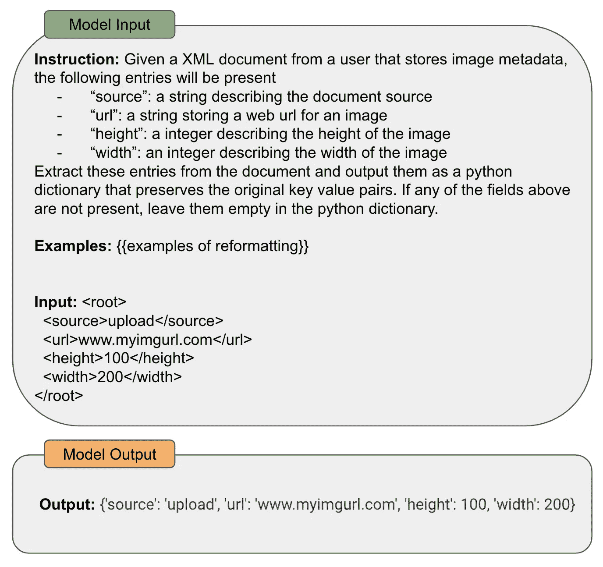

# 高级提示工程

> 原文：[`towardsdatascience.com/advanced-prompt-engineering-f07f9e55fe01?source=collection_archive---------0-----------------------#2023-08-07`](https://towardsdatascience.com/advanced-prompt-engineering-f07f9e55fe01?source=collection_archive---------0-----------------------#2023-08-07)

## 当少样本学习不够用时该怎么办……

 [Cameron R. Wolfe, Ph.D.](https://wolfecameron.medium.com/?source=post_page-----f07f9e55fe01--------------------------------)

·

[关注](https://medium.com/m/signin?actionUrl=https%3A%2F%2Fmedium.com%2F_%2Fsubscribe%2Fuser%2F28aa6026c553&operation=register&redirect=https%3A%2F%2Ftowardsdatascience.com%2Fadvanced-prompt-engineering-f07f9e55fe01&user=Cameron+R.+Wolfe%2C+Ph.D.&userId=28aa6026c553&source=post_page-28aa6026c553----f07f9e55fe01---------------------post_header-----------) 发表在 [Towards Data Science](https://towardsdatascience.com/?source=post_page-----f07f9e55fe01--------------------------------) · 17 分钟阅读 · 2023 年 8 月 7 日

--

（照片由[Mike Tinnion](https://unsplash.com/@m15ky?utm_source=unsplash&utm_medium=referral&utm_content=creditCopyText)拍摄，来源于[Unsplash](https://unsplash.com/photos/3ym6i13Y9LU?utm_source=unsplash&utm_medium=referral&utm_content=creditCopyText)）

大型语言模型（LLMs）的普及彻底改变了我们解决问题的方式。在过去的几年里，使用计算机解决任何任务（例如，重新格式化文档或分类句子）都需要创建一个程序（即，根据某种编程语言精确编写的一组命令）。而有了 LLMs，解决这些问题只需一个文本提示。例如，我们可以通过类似下面的提示来要求 LLM 重新格式化任何文档。

使用提示重新格式化一个 XML 文档（由作者创建）

如上例所示，LLMs 的通用文本到文本格式使我们能够轻松解决各种问题。我们最早在[GPT-3](https://cameronrwolfe.substack.com/p/language-model-scaling-laws-and-gpt) [18]的提案中窥见了这种潜力，显示出足够大的语言模型可以利用[少量学习](https://cameronrwolfe.substack.com/i/117151147/few-shot-learning)以令人惊讶的准确性解决许多任务。然而，随着对 LLMs 的研究进展，我们开始超越这些基本（但仍然非常有效！）的提示技术，如零样本/少量样本学习。

[指令跟随型语言模型](https://cameronrwolfe.substack.com/i/117151147/instruction-prompting)（例如，[InstructGPT](https://cameronrwolfe.substack.com/i/93578656/training-language-models-to-follow-instructions-with-human-feedback) 和 [ChatGPT](https://openai.com/blog/chatgpt)）使我们探讨了语言模型是否能够……
