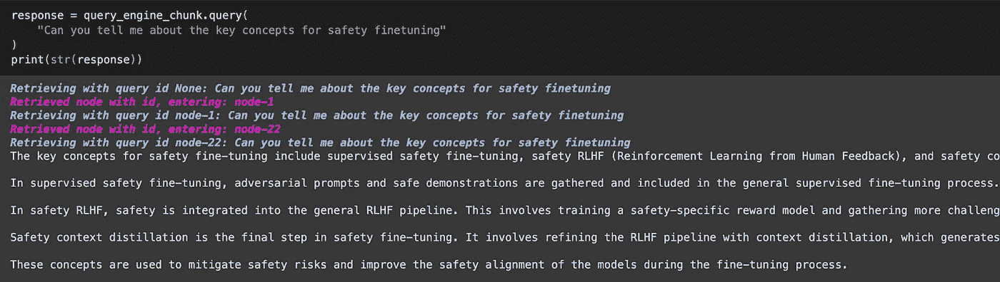

# 高级 RAG 01：从小到大的检索

> 原文：[`towardsdatascience.com/advanced-rag-01-small-to-big-retrieval-172181b396d4?source=collection_archive---------0-----------------------#2023-11-04`](https://towardsdatascience.com/advanced-rag-01-small-to-big-retrieval-172181b396d4?source=collection_archive---------0-----------------------#2023-11-04)

## Child-Parent 递归检索器和 LlamaIndex 的句子窗口检索

[](https://sophiamyang.medium.com/?source=post_page-----172181b396d4--------------------------------)[](https://towardsdatascience.com/?source=post_page-----172181b396d4--------------------------------) [Sophia Yang, Ph.D.](https://sophiamyang.medium.com/?source=post_page-----172181b396d4--------------------------------)

·

[查看](https://medium.com/m/signin?actionUrl=https%3A%2F%2Fmedium.com%2F_%2Fsubscribe%2Fuser%2Fae9cae9cbcd2&operation=register&redirect=https%3A%2F%2Ftowardsdatascience.com%2Fadvanced-rag-01-small-to-big-retrieval-172181b396d4&user=Sophia+Yang%2C+Ph.D.&userId=ae9cae9cbcd2&source=post_page-ae9cae9cbcd2----172181b396d4---------------------post_header-----------) 发布在 [Towards Data Science](https://towardsdatascience.com/?source=post_page-----172181b396d4--------------------------------) ·7 分钟阅读·2023 年 11 月 4 日[](https://medium.com/m/signin?actionUrl=https%3A%2F%2Fmedium.com%2F_%2Fvote%2Ftowards-data-science%2F172181b396d4&operation=register&redirect=https%3A%2F%2Ftowardsdatascience.com%2Fadvanced-rag-01-small-to-big-retrieval-172181b396d4&user=Sophia+Yang%2C+Ph.D.&userId=ae9cae9cbcd2&source=-----172181b396d4---------------------clap_footer-----------)

--

[](https://medium.com/m/signin?actionUrl=https%3A%2F%2Fmedium.com%2F_%2Fbookmark%2Fp%2F172181b396d4&operation=register&redirect=https%3A%2F%2Ftowardsdatascience.com%2Fadvanced-rag-01-small-to-big-retrieval-172181b396d4&source=-----172181b396d4---------------------bookmark_footer-----------)

RAG（检索增强生成）系统从给定的知识库中检索相关信息，从而生成事实性、语境相关且领域特定的信息。然而，RAG 在有效检索相关信息和生成高质量响应方面面临许多挑战。在这一系列的博客文章/视频中，我将介绍高级 RAG 技术，旨在优化 RAG 工作流并解决原始 RAG 系统中的挑战。

第一个技术称为 **小到大的检索**。在基本的 RAG 流水线中，我们对大的文本块进行嵌入以进行检索，并且这个相同的文本块用于合成。但有时对大文本块进行嵌入/检索可能效果不佳。大的文本块中可能包含大量的填充文本，这些文本掩盖了语义表示，导致检索效果较差。如果我们可以基于较小的、更多针对性的块进行嵌入/检索，同时仍然提供足够的上下文供 LLM 合成响应，那将会怎样？具体来说，将用于检索的文本块与用于合成的文本块解耦可能是有利的。使用较小的文本块可以提高检索的准确性，而较大的文本块则提供了更多的上下文信息。小到大检索的概念是在检索过程中使用较小的文本块，然后将包含检索文本的大文本块提供给大语言模型。

主要有两种技术：

1.  **较小的子块引用较大的父块**：在检索过程中首先获取较小的块，然后引用父块的 ID，最后返回较大的块。

1.  **句子窗口检索**：在检索过程中获取单个句子，并返回该句子周围的一段文本。

在这篇博客文章中，我们将深入探讨这两种方法在 LlamaIndex 中的实现。为什么我不在 LangChain 中进行？因为在 LangChain 中已有大量关于高级 RAG 的资源。我宁愿不重复劳动。另外，我同时使用 LangChain 和 LlamaIndex。了解更多工具并灵活使用是最好的。

你可以在这个 [notebook](https://colab.research.google.com/github/sophiamyang/demos/blob/main/advanced_rag_small_to_big.ipynb) 中找到所有代码。

# 基本 RAG 复习

让我们从一个基本的 RAG 实现开始，分为 4 个简单步骤：

**步骤 1\. 加载文档**

我们使用 PDFReader 加载 PDF 文件，并将文档的每一页合并为一个 Document 对象。

```py
loader = PDFReader()
docs0 = loader.load_data(file=Path("llama2.pdf"))
doc_text = "\n\n".join([d.get_content() for d in docs0])
docs = [Document(text=doc_text)]
```

**步骤 2\. 将文档解析成文本块（节点）**

然后我们将文档拆分成文本块，这些块在 LlamaIndex 中称为“节点”，我们将块大小定义为 1024。默认的节点 ID 是随机文本字符串，我们可以将节点 ID 格式化为某种格式。

```py
node_parser = SimpleNodeParser.from_defaults(chunk_size=1024)
base_nodes = node_parser.get_nodes_from_documents(docs)
for idx, node in enumerate(base_nodes):
node.id_ = f"node-{idx}"
```

**步骤 3\. 选择嵌入模型和 LLM**

我们需要定义两个模型：

+   嵌入模型用于为每个文本块创建向量嵌入。这里我们调用了 [FlagEmbedding](https://huggingface.co/BAAI/bge-small-en) 模型来自 Hugging Face。

+   LLM：用户查询和相关文本块被输入到 LLM 中，以便它可以生成带有相关上下文的答案。

我们可以将这两个模型捆绑在 ServiceContext 中，然后在索引和查询步骤中使用它们。

```py
embed_model = resolve_embed_model(“local:BAAI/bge-small-en”)
llm = OpenAI(model="gpt-3.5-turbo")
service_context = ServiceContext.from_defaults(llm=llm, embed_model=embed_model)
```

**步骤 4\. 创建索引、检索器和查询引擎**

索引、检索器和查询引擎是三个基本组件，用于询问有关数据或文档的问题：

+   索引是一种数据结构，允许我们快速检索用户查询的相关信息。向量存储索引将文本块/节点转换为向量嵌入，准备好供 LLM 查询。

```py
base_index = VectorStoreIndex(base_nodes, service_context=service_context)
```

+   Retriever 用于根据用户查询提取和检索相关信息。

```py
base_retriever = base_index.as_retriever(similarity_top_k=2)
```

+   查询引擎建立在索引和检索器之上，提供一个通用接口来提问关于数据的问题。

```py
query_engine_base = RetrieverQueryEngine.from_args(
    base_retriever, service_context=service_context
)
response = query_engine_base.query(
    "Can you tell me about the key concepts for safety finetuning"
)
print(str(response))
```


# 高级方法 1：较小的子块引用更大的父块

在前一部分中，我们使用了固定大小为 1024 的块进行检索和合成。在这一部分中，我们将探讨如何使用较小的子块进行检索，并引用较大的父块进行合成。第一步是创建较小的子块：

**步骤 1：创建更小的子块**

对于每个大小为 1024 的文本块，我们创建更小的文本块：

+   8 个大小为 128 的文本块

+   4 个大小为 256 的文本块

+   2 个大小为 512 的文本块

我们将原始大小为 1024 的文本块附加到文本块列表中。

```py
sub_chunk_sizes = [128, 256, 512]
sub_node_parsers = [
    SimpleNodeParser.from_defaults(chunk_size=c) for c in sub_chunk_sizes
]

all_nodes = []
for base_node in base_nodes:
    for n in sub_node_parsers:
        sub_nodes = n.get_nodes_from_documents([base_node])
        sub_inodes = [
            IndexNode.from_text_node(sn, base_node.node_id) for sn in sub_nodes
        ]
        all_nodes.extend(sub_inodes)

    # also add original node to node
    original_node = IndexNode.from_text_node(base_node, base_node.node_id)
    all_nodes.append(original_node)
all_nodes_dict = {n.node_id: n for n in all_nodes}
```

当我们查看所有的文本块`all_nodes_dict`时，我们可以看到许多更小的块与每个原始文本块相关联，例如`node-0`。实际上，所有更小的块在元数据中引用大块，索引 ID 指向较大块的索引 ID。


**步骤 2：创建索引、检索器和查询引擎**

+   索引：创建所有文本块的向量嵌入。

```py
vector_index_chunk = VectorStoreIndex(
    all_nodes, service_context=service_context
)
```

+   Retriever：关键在于使用**RecursiveRetriever**来遍历节点关系，并根据“引用”提取节点。这个检索器将递归地探索从节点到其他检索器/查询引擎的链接。对于任何检索到的节点，如果任何节点是 IndexNodes，那么它将探索链接的检索器/查询引擎并进行查询。

```py
vector_retriever_chunk = vector_index_chunk.as_retriever(similarity_top_k=2)
retriever_chunk = RecursiveRetriever(
    "vector",
    retriever_dict={"vector": vector_retriever_chunk},
    node_dict=all_nodes_dict,
    verbose=True,
)
```

当我们提出一个问题并检索最相关的文本块时，它实际上会检索指向父块的节点 ID 的文本块，从而检索到父块。


+   现在，按照之前的步骤，我们可以创建一个查询引擎作为通用接口来提问关于我们数据的问题。

```py
query_engine_chunk = RetrieverQueryEngine.from_args(
    retriever_chunk, service_context=service_context
)
response = query_engine_chunk.query(
    "Can you tell me about the key concepts for safety finetuning"
)
print(str(response))
```



# 高级方法 2：句子窗口检索

为了实现更细粒度的检索，我们可以将文档解析为每个块一个单独的句子，而不是使用更小的子块。

在这种情况下，单句子将类似于我们在方法 1 中提到的“子块”概念。句子“窗口”（原句子两侧的 5 个句子）将类似于“父块”概念。换句话说，我们在检索过程中使用单句子，并将检索到的句子与句子窗口一起传递给 LLM。

**步骤 1：创建句子窗口节点解析器**

```py
# create the sentence window node parser w/ default settings
node_parser = SentenceWindowNodeParser.from_defaults(
    window_size=3,
    window_metadata_key="window",
    original_text_metadata_key="original_text",
)
sentence_nodes = node_parser.get_nodes_from_documents(docs)
sentence_index = VectorStoreIndex(sentence_nodes, service_context=service_context)
```

**步骤 2：创建查询引擎**

当我们创建查询引擎时，我们可以使用 MetadataReplacementPostProcessor 替换句子窗口，从而将句子窗口发送到 LLM。

```py
query_engine = sentence_index.as_query_engine(
    similarity_top_k=2,
    # the target key defaults to `window` to match the node_parser's default
    node_postprocessors=[
        MetadataReplacementPostProcessor(target_metadata_key="window")
    ],
)
window_response = query_engine.query(
    "Can you tell me about the key concepts for safety finetuning"
)
print(window_response)
```

句子窗口检索能够回答“你能告诉我安全微调的关键概念吗”：


在这里你可以看到实际检索到的句子和句子的窗口，这提供了更多的背景和细节。


# **结论**

在这篇博客中，我们探讨了如何通过小到大的检索来改进 RAG，重点关注 Child-Parent RecursiveRetriever 和 LlamaIndex 的句子窗口检索。在未来的博客文章中，我们将深入探讨其他技巧和提示。敬请期待更多关于高级 RAG 技术的精彩内容！

# 参考文献：

+   [`docs.llamaindex.ai/en/latest/examples/node_postprocessor/MetadataReplacementDemo.html`](https://docs.llamaindex.ai/en/latest/examples/node_postprocessor/MetadataReplacementDemo.html)

+   [`docs.llamaindex.ai/en/stable/examples/retrievers/recursive_retriever_nodes.html`](https://docs.llamaindex.ai/en/stable/examples/retrievers/recursive_retriever_nodes.html)


. . .

由 [Sophia Yang](https://www.linkedin.com/in/sophiamyang/) 于 2023 年 11 月 4 日发布

在 [LinkedIn](https://www.linkedin.com/in/sophiamyang/)、[Twitter](https://twitter.com/sophiamyang) 和 [YouTube](https://www.youtube.com/SophiaYangDS) 上与我联系，并加入 DS/ML [读书俱乐部](https://dsbookclub.github.io/) ❤️
