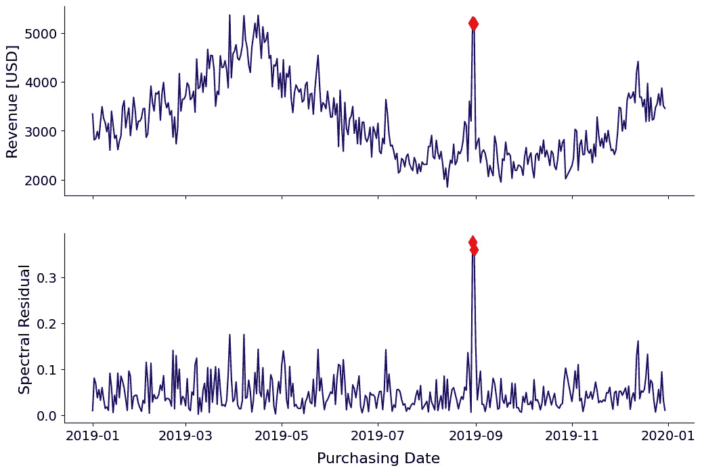

# 使用深度学习进行高级时间序列异常检测在 PowerBI 中

> 原文：[`towardsdatascience.com/advanced-time-series-anomaly-detection-with-deep-learning-in-powerbi-4a69c0273357`](https://towardsdatascience.com/advanced-time-series-anomaly-detection-with-deep-learning-in-powerbi-4a69c0273357)

## 如何将一种复杂且前沿的方法，创造性地借鉴自计算机视觉，仅用几次点击便可实现。

 [Thomas A Dorfer](https://thomasdorfer.medium.com/?source=post_page-----4a69c0273357--------------------------------)

·发布于[Towards Data Science](https://towardsdatascience.com/?source=post_page-----4a69c0273357--------------------------------) ·阅读时间 6 分钟·2023 年 4 月 6 日

--

图片来源：作者

## 介绍

随着全球应用和服务数量的不断增加，时间序列异常检测已成为捕捉度量回归的普遍而不可或缺的工具。

然而，建立异常检测系统显然不是一件简单的事情，通常需要相当多的领域专业知识。在 PowerBI 中，设置只需几次点击，即可在短时间内实现最先进的异常检测系统。

本文将描述 PowerBI 异常检测功能背后的创新算法，并提供如何实现和配置的逐步方法。

## 算法：SR-CNN

PowerBI 的异常检测功能的核心是一个将谱残差（SR）算法与卷积神经网络（CNN）结合的机制——因此得名 SR-CNN。我知道这儿有很多术语。让我们逐一解释。

受计算机视觉的启发，这种[方法论](https://arxiv.org/abs/1906.03821)的作者借用了[视觉显著性检测](https://paperswithcode.com/task/saliency-detection#:~:text=Saliency%20Detection%20is%20a%20preprocessing,Theoretic%20Approach%20to%20Saliency%20Detection)领域的 SR 算法。其背后的动机是相信视觉显著性检测和时间序列异常检测非常相似，因为异常在视觉上通常是显著的。

但视觉显著性究竟是什么呢？它可以被描述为图像中某些特征（如对比度或边缘）突出的程度，从而吸引人类视觉系统的注意。下面的图像说明了这一概念。

左：由[Musa Haef](https://unsplash.com/@musahaef)在[Unsplash](https://unsplash.com/photos/toaX1dyZjcA)上拍摄的照片。右：由作者计算的谱残差。

正如预期的那样，左侧图像中最显著的区域是汽车的刹车灯——它们立即引起我们的注意，并被我们的视觉系统快速识别。这在右侧的 SR 显著性图中也有所反映。

简要来说，SR 算法的工作原理如下：（1）使用傅里叶变换获得对数幅度谱，（2）通过从平均对数幅度谱中减去对数幅度谱来计算 SR，（3）应用逆傅里叶变换将序列转换回空间域。数学细节超出了本文的范围，但可以在原始[论文](https://arxiv.org/abs/1906.03821)中找到。

我们在视觉领域应用的内容也可以应用于时间序列领域。利用微软提供的[示例数据](https://github.com/microsoft/powerbi-desktop-samples/blob/main/Monthly%20Desktop%20Blog%20Samples/2020/2020SU09%20Blog%20Demo%20-%20September.pbix)，我们可以实现 SR 算法，将原始时间序列数据转换为其对应的显著性图。

图片由作者提供。数据使用的许可信息：[MIT 许可证](https://github.com/microsoft/powerbi-desktop-samples/blob/main/LICENSE)。

底部的图表显示了基于 SR 的显著性图，它更清晰地突出异常峰值，并使我们以及——更重要的是——异常检测算法更容易捕捉到它。

现在进入 SR-CNN 的深度学习部分。CNN 直接应用于 SR 模型的结果。更具体地说，作者在合成数据上训练了一个判别模型，这些数据是通过向一组显著性图中引入异常数据点生成的。这里使用显著性图解决了缺乏标记数据的问题，否则如果 CNN 在原始输入上进行训练，则需要标记数据。

CNN 的组成包括两个 1-D 卷积层和两个全连接层，这些层在 sigmoid 输出之前进行堆叠。作者在训练过程中使用了交叉熵损失和[SGD](https://en.wikipedia.org/wiki/Stochastic_gradient_descent)优化器。

使用 F1 分数、精度和召回率，实验结果表明这种方法通常优于其他无监督的最先进基线，例如 [FFT](https://www.springerprofessional.de/en/fourier-transform-based-spatial-outlier-mining/3201890)、[Twitter-AD](https://www.usenix.org/system/files/conference/hotcloud14/hotcloud14-vallis.pdf)、[Luminol](https://github.com/linkedin/luminol)、[DONUT](https://arxiv.org/abs/1802.03903)、[SPOT 和 DSPOT](https://www.kdd.org/kdd2017/papers/view/anomaly-detection-in-streams-with-extreme-value-theory)。

## 在 PowerBI 中的实现

这是最简单的部分。虽然这个异常检测方法背后的算法相当复杂，但其实现其实并不复杂。让我们深入了解在 PowerBI 中应用此方法所需的各个步骤，并通过示例进行说明：

***步骤 1:*** 将你的时间序列数据加载到 PowerBI 中。

***步骤 2:*** 创建一个包含时间序列的*折线图*，并确保 X 轴类型设置为*连续*。

作者提供的图片。

***步骤 3:*** 在*可视化*窗格中，导航到*将进一步分析添加到你的视觉效果*，并启用*查找异常*。

***步骤 4:*** 在*选项*中，微调主要参数：*敏感度*。这个参数越高，最小值和最大值的预期范围越窄，因此将有更多的数据点在此范围之外，从而被标记为异常。

敏感度设置为 80% 的示例：

作者提供的图片。

敏感度设置为 98% 的示例：

作者提供的图片。

PowerBI 还允许你自定义异常点的颜色、标记和大小，以及预期范围的颜色、样式和透明度。

除了异常检测，PowerBI 还提供了可能解释这些回归发生原因的功能。这些解释附有一个*强度*度量，显示了值与异常的相关程度。通过简单地点击折线图中的异常点，可以检索到这些信息。

作者提供的截图。

如果我们点击第一个最强的解释，*‘购买大小’为 $30 — $40*，我们可以看到异常发生日期与收入之间有强相关性，这可能导致了这次突发的高峰。

作者提供的截图。

## 结论

这篇文章展示了一种相当复杂的时间序列异常检测算法，灵感来源于计算机视觉，如何在 PowerBI 中仅需几次点击就能轻松快速地实现和自定义。通过多个抽象层次，这种方法只需要对一个直观的参数进行微调：*敏感度*。最后，用户可以通过简单点击线图中的异常数据点来提取异常的解释信息，这为这些意外峰值的潜在根本原因提供了指导。

## 更多资源：

+   *博客:* [异常检测教程 — Power BI | Microsoft Learn](https://learn.microsoft.com/en-us/power-bi/visuals/power-bi-visualization-anomaly-detection)

+   *算法:* [Azure 异常检测器中的 SR-CNN 算法概述 — Microsoft Community Hub](https://techcommunity.microsoft.com/t5/ai-customer-engineering-team/overview-of-sr-cnn-algorithm-in-azure-anomaly-detector/ba-p/982798)

+   *论文:* [微软的时间序列异常检测服务 (arxiv.org)](https://arxiv.org/pdf/1906.03821.pdf)

## 喜欢这篇文章吗？

让我们联系吧！您可以在 [Twitter](https://twitter.com/ThomasADorfer)、[LinkedIn](https://www.linkedin.com/in/thomasdorfer/) 和 [Substack](https://thomasdorfer.substack.com/) 上找到我。

如果您喜欢支持我的写作，您可以通过 [Medium 会员](https://thomasdorfer.medium.com/membership) 来实现，这将为您提供访问我所有故事的权限，以及 Medium 上其他成千上万作家的故事。

 [## 使用我的推荐链接加入 Medium - Thomas A Dorfer

### 阅读 Thomas A Dorfer 的每一篇故事（以及 Medium 上其他成千上万的作家的文章）。您的会员费将直接支持……

[medium.com](https://medium.com/@thomasdorfer/membership?source=post_page-----4a69c0273357--------------------------------)
