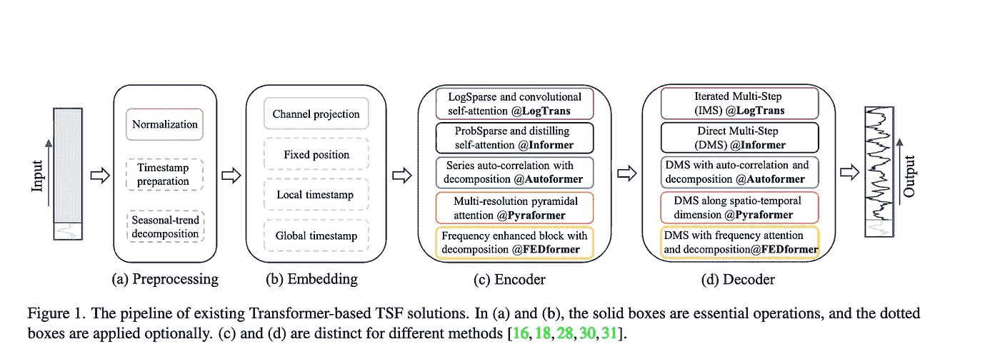
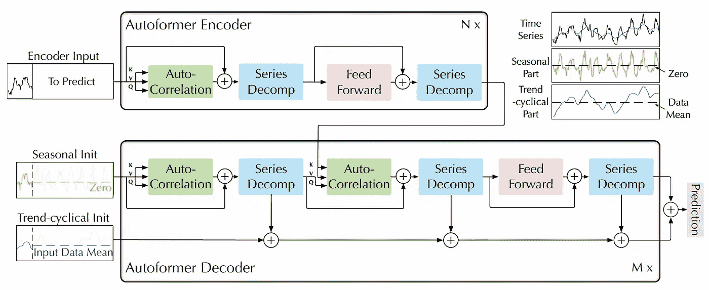
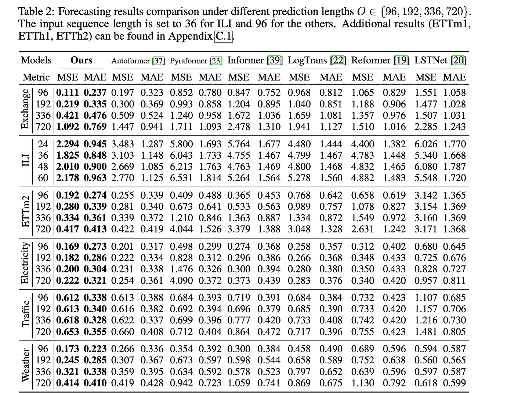
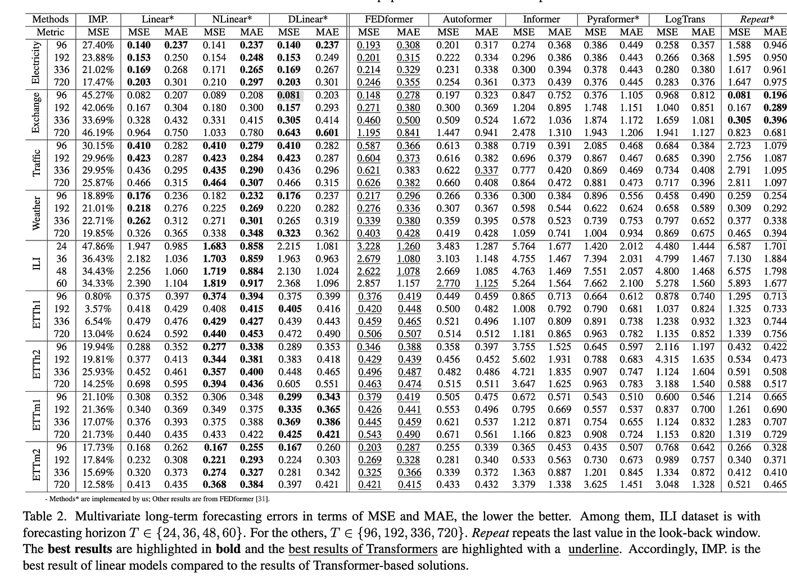
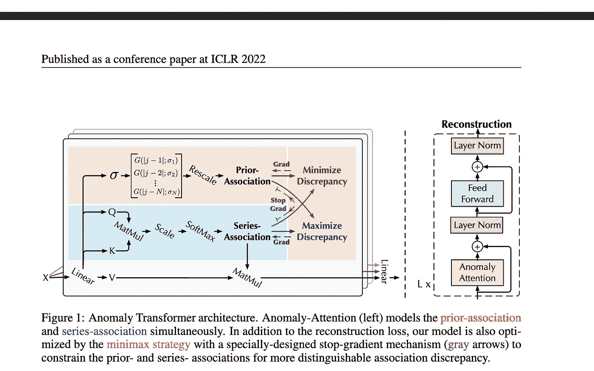
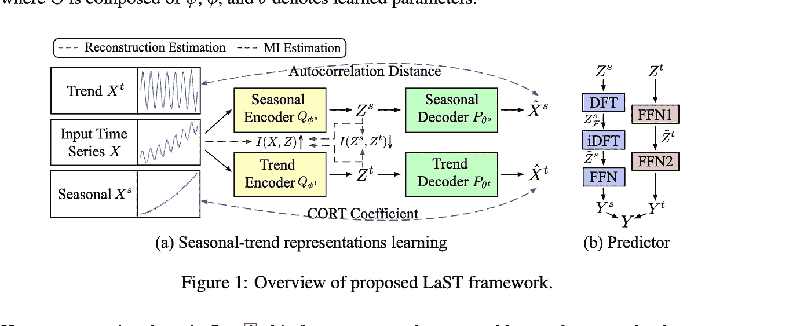
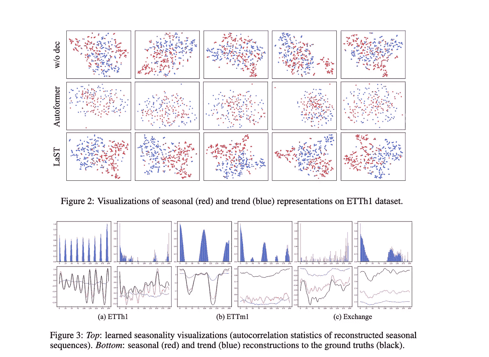
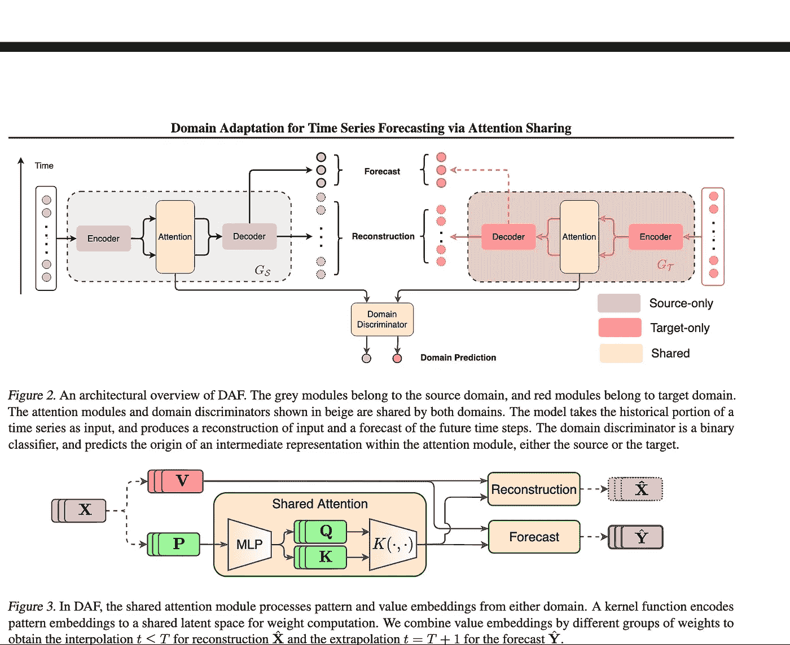

# 时间序列预测与分类中的深度学习进展：2023 年冬季版

> 原文：[`towardsdatascience.com/advances-in-deep-learning-for-time-series-forecasting-and-classification-winter-2023-edition-6617c203c1d1`](https://towardsdatascience.com/advances-in-deep-learning-for-time-series-forecasting-and-classification-winter-2023-edition-6617c203c1d1)

## 时间序列预测中变压器的衰退与时间序列嵌入方法的兴起。此外，还有异常检测、分类和最优(t)干预的进展。

 [Isaac Godfried](https://igodfried.medium.com/?source=post_page-----6617c203c1d1--------------------------------)

·发布于[Towards Data Science](https://towardsdatascience.com/?source=post_page-----6617c203c1d1--------------------------------) ·阅读时间 16 分钟·2023 年 1 月 10 日

--

我自己拍摄的照片（大沙丘国家公园日落时分）

*注意，你可以在 DDS 中找到这篇文章的[2024 年更新版](https://medium.com/deep-data-science/advances-in-deep-learning-for-time-series-forecasting-classification-winter-2024-a3fd31b875b0)。*

自从我上次更新有关时间序列深度学习的状态以来已经有一段时间了。几个会议已经过去，整个领域在多个方面都有所进展。在这里，我将尝试涵盖过去一年左右出现的一些更有前途以及关键的论文，以及对[Flow Forecast](https://github.com/AIStream-Peelout/flow-forecast)框架[FF]的更新。

## [Flow Forecast Framework](https://github.com/AIStream-Peelout/flow-forecast) 更新：

+   在过去的一年里，我们在 FF 的架构和文档方面取得了重大进展。最近，我们推出了对时间序列分类和监督异常检测的全面支持。此外，我们还增加了更多的[教程笔记](https://github.com/AIStream-Peelout/flow_tutorials)并将单元测试覆盖率扩大到超过 77%。

+   我们还添加了一个原始的 GRU 模型，您可以用它进行时间序列预测、分类和异常检测。

+   我在去年的 11 月在 PyData NYC 展示了我最近的一些研究（遗憾的是，他们尚未在线发布视频）。我还编写了一个[关于鳄梨价格预测的教程。](https://medium.com/towards-data-science/deep-time-series-forecasting-with-flow-forecast-part-1-avocado-prices-276a59eb454f)

+   我们正在使用 GitHub 讨论！务必查看我们的[讨论](https://github.com/AIStream-Peelout/flow-forecast/discussions)或开始一个新的讨论。

现在让我们跳转到一些领域更新。

## **变换器相关研究：Autoformer、Pyraformer、Fedformer 等，它们的有效性和问题**

来源于[变换器在时间序列预测中的有效性？](https://arxiv.org/pdf/2205.13504.pdf) 第 3 页的图

***总结***：变换器系列的时间序列预测架构持续增长，如 Autoformer（Neurips 2021）、[Pyraformer](https://openreview.net/forum?id=0EXmFzUn5I)（ICLR 2022）、[Fedformer（ICML 2022）](https://arxiv.org/abs/2201.12740)、[EarthFormer](https://arxiv.org/abs/2207.05833)（Neurips 2022）和[非平稳变换器](https://openreview.net/forum?id=ucNDIDRNjjv)（Neurips 2022）。然而，这些模型是否能准确预测数据并超越现有方法仍然存在疑问，特别是考虑到新研究（我们将稍后讨论）。

[Autoformer](https://arxiv.org/abs/2106.13008):

Autoformer 模型的架构（Neurips 2021）。该模型具有一种季节性分解机制，旨在创建时间数据的季节性和周期性表示。解码器接收三个项目。解码器输出一个季节性部分和一个趋势部分，然后将它们相加得到预测。来自 Autoformer 论文第 2 页的图。

Autoformer 扩展和改进了 Informer 模型的性能。Autoformer 具有一种自相关机制，使模型能够比标准注意力机制更好地学习时间依赖性。它旨在准确分解时间数据的趋势和季节性成分。您可以在[这里](https://github.com/thuml/Autoformer)找到该论文的完整代码。

Pyraformer：在这篇论文中，作者介绍了“金字塔注意力模块（PAM），其中跨尺度树结构总结了不同分辨率下的特征，而同尺度邻接连接则建模不同范围的时间依赖性。”

[Fedformer:](https://arxiv.org/abs/2201.12740) 该模型专注于捕捉时间序列数据中的全球趋势。作者提出了一种季节性趋势分解模块，旨在捕捉时间序列的全球特征。

Earthformer：也许是这一“系列”论文中最独特的，Earthformer 专注于预测地球系统，如天气、气候和农业。该论文展示了一种新的地球立方体注意力机制。我对这篇论文在我的流域和暴雨洪水预测研究中的潜力感到希望，因为许多经典的变换器在这方面表现不佳。

[非平稳变换器](https://openreview.net/forum?id=ucNDIDRNjjv)：这是变换器用于预测领域中的最新出版物。作者旨在更好地调整变换器以处理非平稳时间序列。他们采用了两种机制：去平稳注意力和系列平稳化机制。这些机制可以插入到任何现有的变换器模型中，作者测试了它们在 Informer、Autoformer 和 Vanilla Transformer 中的效果，并且都提升了性能（在附录中，他们还显示它提升了 Fedformer 的性能）。

***讨论/评估***：与 Informer 类似，所有这些模型（地球变换器除外）都在电力（ETTh）、交通、交换和天气数据集上进行了评估。这些模型主要基于均方误差（MSE）和平均绝对误差（MAE）指标进行评估：

非平稳变换器与其他模型的预测结果。见[非平稳变换器](https://openreview.net/pdf?id=ucNDIDRNjjv)第 7 页。

我希望未来所有变换器论文的作者能将他们的模型与更简单的方法如 D-Linear（稍后将讨论）甚至基本的 LSTM/GRU 进行比较。他们还应该超越一些标准数据集，因为我没有看到其他时间序列相关数据集上的良好表现。例如，我在让 Informer 准确预测河流流量时遇到了极大的问题，与 LSTM 或即使是基本的变换器模型相比，其表现普遍较差。由于与计算机视觉不同，图像尺寸至少保持不变，时间序列数据在长度、周期性、趋势和季节性方面可能差异巨大，因此需要更广泛的数据集。

在[OpenReview 上关于非平稳变换器的评论中，一位评审表达了这些担忧](https://openreview.net/forum?id=ucNDIDRNjjv)，然而在最终的元评审中不幸被驳回：

> “由于该模型在变换器领域，且变换器在多个任务上已被证明是最先进的，因此我认为没有必要与其他‘家族’的方法进行比较。”

我个人认为这是一个极具问题的论点，并导致了研究在实际应用中的缺乏。如果某些模型在 NLP 中表现良好，我们是否就应该假设它们在时间序列中也会表现良好？另外，如果评估协议不正确但在以往的出版物中是标准的，那么它是否应该被重复？作为一个在实践中重视最先进方法和创新模型的人，这正是那种会让我看起来像个完全的傻瓜的情况，我花了几个月时间试图让一个所谓的“好”模型工作，结果却被线性回归超越。

也就是说，我并不认为这篇论文应该被拒绝或特别指出，因为所有的变换器论文都同样存在评估有限的问题。相反，我们应该从一开始就要求更严格的比较和清晰的不足之处说明。一个复杂的模型“家族”可能不会总是优于简单模型，但这一点需要在论文中明确指出，而不是被掩盖或简单地假设它在其他领域表现良好。

在另一个更令人愉快的消息中，我对 Earthformer 的评估感到有些印象深刻。Earthformer 在“移动 MNIST 数据集和一个新提出的混沌 N-body MNIST 数据集”上进行了评估，作者们使用这些数据集来验证立方体注意力的有效性。然后，他们对降水现在 casting 和厄尔尼诺循环预测进行了评估。我认为这是一个将物理知识融入模型架构（结合立方体注意力）并设计良好子测试的好例子。

***流量预测集成***：由于许多这些模型遵循相同的基本格式，因此将它们移植到 FF 的工作量不是很大。然而，在某些情况下，我们不得不考虑这些更新的变换器模型在现实世界数据上的表现如何。代码整合是我和其他维护人员需要考虑的另一个领域。之前，我们从作者的实现中复制了大量代码，并尽可能保留（以避免引入新错误）。也就是说，我们可能会在接下来的几个月中添加几个模型（Fedformer，非平稳变换器）。

**变换器在时间序列预测中的有效性（2022）？**

图片来源于[变换器在时间序列预测中的有效性](https://arxiv.org/pdf/2205.13504.pdf)第 2 页。TLDR 基本上是简单模型在几乎所有变换器模型中表现优越，直到 Fedformer 模型（尽管非平稳变换器是后来的工作，但简单模型很可能也会超越它。可能非平稳变换器 + Fedformer 在某些情况下会超过简单模型，但与简单模型相比，这是一个非常大的模型）。

本文探讨了变换器预测数据的能力与基线方法的对比。结果在一定程度上证实了我在许多实验中看到的情况，即变换器通常表现不如简单模型，并且难以调整。文中几个有趣的点包括：

+   作者逐渐用基本的线性层替代自注意力，并发现：“令人惊讶的是，Informer 的性能随着逐步简化而提高，表明自注意力机制和其他复杂模块在现有 LTSF 基准测试中并非必要。”

+   作者们还研究了是否增加回顾窗口会提高变压器的性能，发现：“SOTA 变压器的性能略微下降，这表明这些模型仅捕捉到来自相邻时间序列的相似时间信息。”

+   作者们还探讨了位置嵌入是否真的很好地捕捉时间序列的时间顺序。他们通过将输入序列随机打乱后输入变压器来进行这项研究。他们发现，在多个数据集上，这种打乱并没有影响结果（这显然是相当令人担忧的）。

***讨论：*** 在过去的几年里，我进行了无数次的时间序列实验，使用变压器模型，在绝大多数情况下，结果都不是很好。很长时间我认为我一定是在做错什么或者遗漏了一些小的实现细节。毕竟，这些模型本应成为下一个 SOTA 模型，就像在 NLP 中一样。因此，看到一些研究表明我的实验并非完全有缺陷（至少不是完全的）是很好的。然而，这仍然留下了许多持续的问题，比如下一步该如何走？如果简单模型的性能优于变压器，我们是否应该继续使用变压器？所有变压器是否本质上都有缺陷，还是仅仅是当前机制的问题？我们是否应该回到像 LSTM、GRU 或简单的前馈模型这样的架构？这些问题我不知道答案是什么，而且论文的总体影响尚待观察。现在，我认为答案可能是退一步，专注于学习有效的时间序列表示。毕竟，最初 BERT 在 NLP 上的成功就是通过形成良好的表示来实现的。

尽管如此，我认为我们不应该完全认为时间序列的变压器已经死了。Fedformer 在简单模型基准测试中表现得非常接近，并且在各种消融打乱任务中表现更好。我也从经验上看到，虽然变压器在预测中经常表现不佳，但它们对数据的内部表示往往相当好。我认为需要更多的研究来了解内部表示和实际预测输出之间的脱节。此外，正如作者所建议的，改进位置嵌入可能在提高整体性能方面发挥关键作用。最后，正如我们将看到的，最近有一种基于变压器的模型在各种异常检测数据集上表现非常好。

***流量预测整合：*** 论文确实介绍了一些较简单的模型，这些模型作为复杂变压器方法的良好基准。由于这些模型很简单，所以将它们添加到我们的框架中不会需要太多努力。我们可能会在接下来的几个月内将这些模型添加到 FF 中。与此同时，你可以在这里找到论文的完整代码。

[**异常变压器 (ICLR Spolight 2022)**](https://arxiv.org/abs/2110.02642)**:** 如上所示，已有相当多的研究专注于将变压器应用于预测，但在异常检测方面的研究相对较少。本文介绍了一种（无监督的）变压器用于检测异常。该模型利用了特别构造的异常注意力机制和最小最大策略。

作者开发了一种专门用于异常检测的特殊注意力形式。来自异常变压器论文第 4 页。

*评估*: 本文评估了模型在五个现实世界数据集上的表现，包括服务器机器数据集、汇总服务器指标、土壤湿度主动被动，以及 NeurIPS-TS（它本身包含五个不同的数据集）。尽管人们可能会倾向于对该模型持怀疑态度，特别是关于上述提到的变压器，但这次评估相当严格。Neurips-TS 是一个最近的数据集，专门创建用于提供更严格的异常检测模型评估（更多内容见下面的数据集部分）。因此，这个模型实际上似乎在性能上优于更简单的异常检测模型。

*讨论*: 在这里，作者展示了一种在众多异常检测数据集上表现良好的独特无监督变压器。对我来说，这是过去几年时间序列变压器领域中最有前途的论文之一。

在许多方面，首先创建有效分类和检测时间序列异常的模型似乎更有意义，然后再专注于数据预测。根据我的一般经验，预测比分类甚至异常检测更具挑战性，因为你需要预测未来多个时间步长中的巨大可能值范围。我有点惊讶这么多研究专注于预测而忽视了分类或异常检测，考虑到它们似乎是变压器的更自然的第一步。

*FF 集成:* 未来我希望将该模型添加到 FF 中，因为目前我们只有非常有限的异常检测模型。然而，添加这篇论文可能需要编写一个单独的数据加载器，因为该模型是无监督的，并且可能需要对我们的主要训练循环进行额外检查（FF 训练循环假设数据加载器将返回 X 和 Y 值）。不过，你可以在这里查看模型的完整代码实现。

[**WaveBound: 稳定时间序列预测的动态误差界限**](https://openreview.net/forum?id=vsNQkquutZk) **(Neurips 2022):**

总结：本文介绍了一种新的正则化形式，旨在改善深度时间序列预测模型（特别是上述提到的变压器）的训练。

评估：作者通过将模型插入现有的变换器模型 + LSTNet 来评估其模型。他们发现，在大多数情况下，这显著提高了性能。虽然他们仅通过 Autoformer 测试了模型，而没有测试更近期的模型如 Fedformer。

讨论：新的正则化或损失函数形式总是有用的，因为它们可以经常插入任何现有的时间序列模型中以提高性能。此外，我开始认为如果将 Fedformer + 非平稳机制 + Wavebound 结合起来，可能会在性能上超越简单的 D-Linear。虽然不算完美，但这是一个开始，也许这意味着只要足够的提升，变换器并未完全死去。

FF 集成：作者确实提供了代码实现。我喜欢它可以与 RNN 和变换器兼容（因为我们的代码库包含这两者）。不过，我们可能不会很快添加它，因为其他模型优先级更高。但我们会将其加入我们的路线图。如果有时间，你也可以自己提交 PR！

## 时间序列表示

尽管关于变换器和预测的新闻可能显得有些悲观，但在创建有用的时间序列表示方面已经取得了一些进展。这些发展中的一些与变换器相关的研究有所重叠和并行，但它们主要专注于表示而非最终预测结果。总的来说，我认为这是深度学习时间序列领域中的一个令人印象深刻的新领域，值得更深入地探索。

[**TS2Vec: 朝着时间序列的通用表示（AAAI 2022）**](https://arxiv.org/abs/2106.10466)

总结：TS2Vec 是一个用于学习时间序列表示/嵌入的通用框架。尽管论文本身已经有些过时，但它真正开启了时间序列表示学习论文的趋势。

讨论/评估：评估既包括使用这些表示进行预测，也包括异常检测。该模型在许多模型中表现优于 Informer 和 Log Transformer。

FF 集成：我们计划在接下来的两个月内将这篇论文作为基准时间序列嵌入方法添加。尽管它已被更新的论文超越，但其简洁性和适应性仍然令人满意。

[**学习时间序列预测的潜在季节性-趋势表示**](https://openreview.net/forum?id=C9yUwd72yy) **（Neurips 2022）：**

提议的 LaST 架构的图像（第 3 页）。该模型利用了趋势和季节编码器 + 解码器，生成两个独立的表示，然后输入到简单的 MLP 预测器中用于预测任务。

*总结*：作者创建了一个模型（LAST），通过变分推断来创建季节性和趋势的解耦表示。

评价：作者在类似于 Informer、Autformer 和其他模型的下游预测任务上评估他们的模型。他们通过在表示上添加一个预测器（见上图 B）来实现这一点。他们还提供了有趣的图表，展示了表示的可视化。该模型在多个预测任务中优于 Autoformer 以及 TS2Vec 和 CoST 几乎所有任务。在一些预测任务中，它似乎也可能超越了上述提到的 D-Linear 模型。

论文第 9 页的一个有趣图示。我们可以看到季节性/趋势的学习可视化表示的差异。

*讨论*：虽然目前我对仅在标准预测任务上评估的模型仍持有一定怀疑态度，但我喜欢这个模型更关注表示而不是预测任务本身。如果我们查看论文中展示的一些图表，我们可以看到模型确实似乎学会了区分季节性和趋势。如果能看到不同数据集的表示嵌入到相同空间中的可视化，并且它们展示了实质性的差异，那将会很有趣。

*FF 实现*：我们很可能会在添加 TS2Vec 之前添加这个模型，因为那个模型更简单。然而，我希望在未来的某个时点添加这个模型，因为它确实提供了对不同时间组件的两个良好的独立表示。我猜我们可能会在接下来的两个月内添加这个模型。

[**CoST: Contrastive Learning of Disentangled Seasonal-Trend Representations for Time Series Forecasting**](https://openreview.net/forum?id=PilZY3omXV2) **（ICLR 2022）：**

这是一篇在 2022 年早些时候于 ICLR 上发表的论文，与 LaST 在学习季节性和趋势表示方面非常相似。由于 LaST 在性能上已经大部分超越了它，我不会过多描述。但对于那些想阅读的，可以查看上面的链接。

## 其他有趣的论文

[**Domain Adaptation for Time Series Forecasting via Attention Sharing**](https://arxiv.org/abs/2102.06828) **（ICML 2022）：**

来源于：Domain Adaptation for Time Series Forecasting Via Attention Sharing 论文第 3 页。

总结：当训练数据不足时，DNN 的预测是具有挑战性的。我记得在我研究 COVID-19 预测时，最初缺乏时间历史使得预测非常困难。因此，我希望看到更多论文开始解决时间序列迁移学习场景。本文利用共享注意力层用于数据丰富的领域，然后使用单独的模块用于目标领域。

评估：所提出的模型在合成和真实数据集上都进行了评估。在合成设置中，他们测试了冷启动学习和少量样本学习，并发现他们的模型优于普通的 transformer 和 DeepAR。对于真实世界数据集，他们使用了 Kaggle 零售数据集和电力数据集的一个子集。在这些实验中，模型显著优于基线。

讨论：冷启动、少量样本学习和有限学习是非常重要的主题，但针对时间序列的相关论文却不多。该模型在解决这些问题上迈出了重要的一步。也就是说，我认为他们本可以在更多不同的有限真实世界数据集上进行评估，并与更多基准模型进行比较。此外，如果模型能够更容易地“插入”到现有架构中，那就更好了。微调或正则化的一个好处是你可以在任何架构上进行。

FF 实现：我们在 FF 中已经有一些迁移学习的功能，这在提供 COVID 的早期见解时对我们帮助很大。添加这个模型可能会提供更多帮助，但开销似乎很高，而且该模型不能轻松插入到我们生态系统中的现有模型中。

[**何时干预：学习关键事件的最佳干预策略**](https://openreview.net/pdf?id=rP9xfRSF4F) **(Neurips 2022)：**

*总结*：虽然这不是一篇“典型”的时间序列论文，我选择将其纳入此列表，因为最终大多数公司不仅仅是希望预测值或检测异常，而是希望以某种方式“响应”。这篇文章专注于在机器故障之前找到最佳干预时间。这被称为 OTI 或最佳时间干预。作者

评估：当然，评估 OTI 的问题之一是基础生存分析的准确性问题（如果它不正确，评估也将不正确）。作者将他们的模型与两个静态阈值进行比较，发现表现良好。他们绘制了不同策略的预期性能以及命中与遗漏的比率。

讨论：这是一个有趣的问题，作者提出了一个新颖的解决方案，但在我看来，评估略显不足。一位审稿人指出，“我认为如果有一个图表显示失败概率与预期干预时间之间的权衡，这样可以直观地看到这种权衡曲线的形状，实验会更有说服力。”

FF 集成：在 Flow Forecast 中，OTI 和时间数据上的强化学习都是有趣的未来潜在方向。不幸的是，目前它们不是优先级很高的方向，因为我们首先要让框架在预测、异常检测和分类上非常稳固。不过，我确实认为将来我们可以考虑创建一个更“可操作”的框架来更好地支持决策。

[**FiLM: 改进的频率勒让德记忆模型用于长期时间序列预测**](https://openreview.net/forum?id=zTQdHSQUQWc) **（Neurips 2022）：** C[ode](https://github.com/tianzhou2011/FiLM/)。

**调整神经网络中的自相关误差以用于时间序列（Neurips 2021）**: 代码在这里。

[**动态稀疏网络用于时间序列分类：学习“看到”什么**](https://openreview.net/forum?id=ZxOO5jfqSYw) **（Neurips 2022）：**

## （相对）近期的数据集/基准

+   [**莫纳什时间序列预测档案**](https://forecastingdata.org/) **（Neurips 2021）：** 最近我们看到许多深度时间序列模型在相同的数据集上进行评估。虽然这对于基本基准测试是可以的，但它们在不同的时间任务上往往表现不佳。该档案旨在形成一个“主列表”来汇总不同的时间序列数据集，并提供更权威的基准。该库包含超过 20 个不同的数据集，涵盖了包括健康、零售、拼车、人口统计等多个行业。

+   [**季节性预测微软**](https://www.microsoft.com/en-us/research/project/subseasonal-climate-forecasting/) **（2021）：** 这是微软公开发布的数据集，旨在促进机器学习在季节性预测（例如未来两到六周）中的应用。季节性预测帮助政府机构更好地准备天气事件以及农民的决策。微软为这一任务提供了几个基准模型，并且总体上，深度学习模型的表现相比其他方法相当差。最佳的深度学习模型是一个简单的前馈模型，而 Informer 表现非常糟糕。

+   [**重新审视时间序列异常检测：定义与基准**](https://openreview.net/forum?id=r8IvOsnHchr) 这篇论文批评了许多现有的异常/离群点检测数据集，并提出了 35 个新的合成数据集和 4 个真实世界数据集用于基准测试。

## **结论**

在过去两年里，深度学习在时间序列领域发生了许多变化。我们见证了变压器在时间序列预测中的兴起和可能的衰退。我们也看到了时间序列嵌入方法的兴起以及在异常检测和分类方面的进一步突破。Flow Forecast 继续作为一个框架增长，我们希望继续整合最新的突破性研究。

我们希望增加更多的可解释性、可视化和基准测试方法，以便研究人员和行业数据科学家都能清楚地了解他们的模型表现如何，以及模型性能具体在哪些方面出现了问题。此外，我们希望增加更多的正则化、预处理和迁移学习形式，以提升性能。也许变换器（transformers）对时间序列预测效果很好，或者可能不适用，但我们将继续支持它们及其替代方案！如往常一样，欢迎在下方留下任何问题或见解。感谢阅读到最后。
