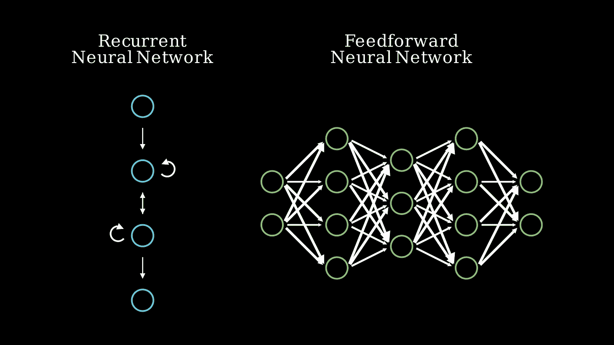
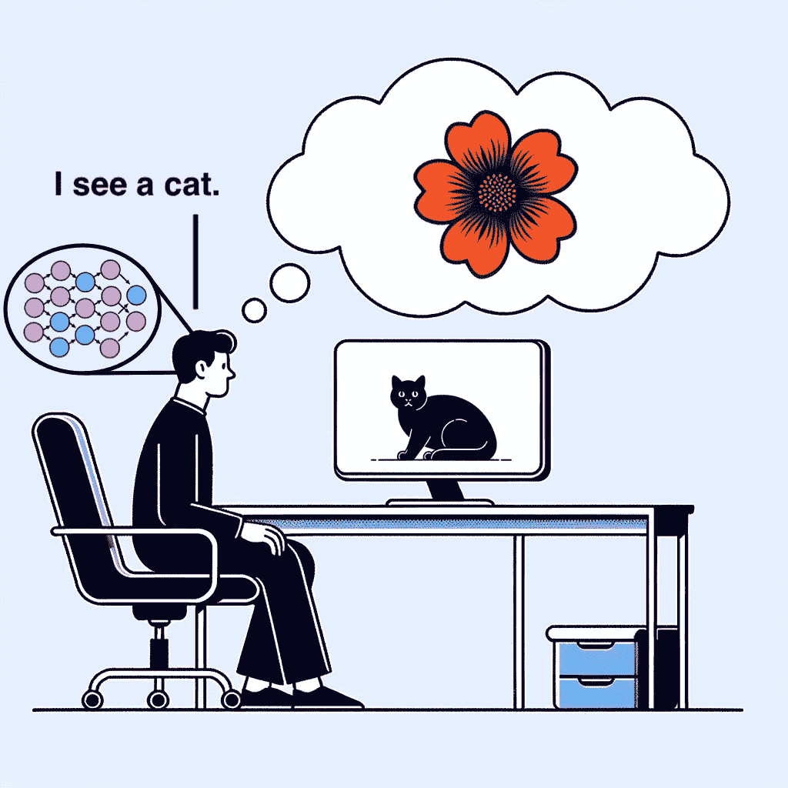

# AI 意识展开

> 原文：[`towardsdatascience.com/ai-consciousness-unfolded-48f83e78a771`](https://towardsdatascience.com/ai-consciousness-unfolded-48f83e78a771)

## 挑战综合信息理论

 [Mike Perrotta](https://mikeperrotta.medium.com/?source=post_page-----48f83e78a771--------------------------------)

·发表于[Towards Data Science](https://towardsdatascience.com/?source=post_page-----48f83e78a771--------------------------------) ·阅读时间 19 分钟·2023 年 12 月 11 日

--

我们如何知道人工智能是没有感觉的算法还是体验感觉和情绪的意识存在？这个问题的答案对我们施加于 AI 的伦理准则有重大影响。如果我们认为未来的 AI 体验痛苦和快乐，我们会以不同于对待像 Excel 公式这样简单算法的方式对待它。我们能知道 AI 正在经历什么吗？意识理论旨在揭示导致意识的因素，并可能帮助确定 AI、动物甚至树木是否具有意识。

最重要的理论之一，[综合信息理论](https://www.doi.org/10.1371/journal.pcbi.1003588) (IIT) 的独特之处在于它提供了一个计算任何事物意识程度的方程式。人脑的分数非常高，而一堆石头的分数为零。从厨房灯具到 ChatGPT 的电子电路可以有广泛的分数范围。关于后者和其他人工智能，IIT 提出了一个有趣的预测：由复杂的循环结构构建的 AI 将至少具有一定的意识，而来自线性前馈网络的 AI（包括 ChatGPT）将没有意识。

如果这个理论能够被证明是正确的，它将对 AI 伦理的未来极具价值，更不用说对理解人类意识的帮助了。目前，这一理论已经被用来预测植物人患者是否真正无意识，还是仅仅被锁定，无法移动但仍能感知周围环境。然而，综合信息理论的可证明性最近受到质疑，一篇[2019 年的论文《逐步展开的论点》](https://doi.org/10.1016/j.concog.2019.04.002)对此提出了挑战。该论点并不说 IIT 必须是错误的，而是认为它永远无法被证明是真实的。它的核心在于 IIT 预测了不同形状但行为相同的网络不同的意识水平。

为了全面理解这个论点以及它对我们理解意识的意义，让我们深入探讨意识、IIT、递归网络与前馈网络，以及展开中的论点。

如果我们能够用无意识的人工智能重现人类行为，这将对意识理论意味着什么？所有图像均由作者提供。

# 什么是意识

要理解像 IIT 这样的理论，我们需要明确‘意识’这个词的含义。在这个背景下，意识是你对世界的主观体验：你对视觉、听觉、感觉和思维的体验，这些体验对你的第一人称视角是独特的。它是你入睡时消失的东西，也是你醒来（或做梦）时重新出现的东西。

将自己与一个具有摄像头作为眼睛、麦克风作为耳朵、扬声器作为嘴巴的机器人进行比较。你现在口袋里可能就有这样一个机器人，如果不是在手里。你和机器人都处理外部数据并将其转化为行动，但只有你*体验*这些视觉和声音。你的手机显然没有内在世界；它在关机时不会失去任何体验。你可以用手机拍摄日落，但它不会像你那样有意识地*看到*日落。

你的头骨中那个三磅重的胶状块是什么让你拥有独特的意识？为什么我们不在没有经历的情况下处理数据，就像我们的手机一样内心空虚？如 IIT 的意识理论旨在回答这些问题。

# 综合信息理论

综合信息理论（IIT）是当今领先的科学意识理论之一。IIT 认为，系统中元素的“正确”配置会导致意识体验。这些元素可以是大脑中的神经元、计算机中的晶体管，甚至森林中的树木。

IIT 在意识理论中是独一无二的，因为它提供了一个数学方程来计算一个被称为意识的量。这个量称为综合信息，用希腊字母 Φ（phi）表示，根据系统的当前状态及其随时间的变化来计算。根据 IIT，一个拥有高综合信息（Φ）的系统（无论是大脑还是由硅构成的人工网络）会体验到意识，而一个没有 Φ 的系统则没有主观体验。

IIT 背后的数学相当复杂，我们在这里不会尝试完全理解它（但可以参考[IIT 作者的这份可视化解释](https://doi.org/10.1371/journal.pcbi.1006343.s001)）。不过，为了展开讨论，我们需要对 IIT 的数学和其含义有一些了解。首先，让我们了解一下什么是综合信息。

在 IIT 的背景下，*信息* 是指一组元素对于系统其他部分所能提供的了解程度。如果一组神经元具有高信息量，这些神经元的状态将会告诉你很多关于整个大脑的前后状态。*整合* 是指这些信息在多大程度上依赖于这组神经元作为一个统一的整体，而不是一群孤立的神经元。如果一组神经元被称为 AB 组，对大脑有 100 单位的信息，但 A 组和 B 组分别单独来看只有 50 单位的信息，那么 AB 组就没有*整合*的信息。

我们需要理解的 IIT 的最后一个方面是 Φ 的公式需要关于系统过去和未来状态的信息。在测量 Φ 时，我们首先查看一组神经元对整个大脑过去状态的了解程度，然后查看它对大脑未来状态的了解程度，然后取这两个值中的较小者。只有当一组神经元对系统的*过去*和*未来*状态都有信息时，它才能对意识有所贡献。

这一事实对展开的论点至关重要，因为这意味着前馈网络没有整合信息。让我们看看原因。

# 循环网络与前馈网络

循环网络具有一个循环的架构，任何神经元可以连接到任何其他神经元，包括它自己或“上游”的神经元，这些神经元与它连接。另一方面，前馈网络则以单一方向处理信息，意味着每个神经元从上游神经元那里接收信息并将其传递给下游神经元；信息永远不会流回到早期的神经元。

循环网络有循环连接，而前馈网络仅有单向连接。所有图形均由作者提供。

为什么前馈网络的 Φ 必然为零？在前馈网络中，最早的神经元将对系统的过去状态一无所知（因为没有神经元连接回它们），而最远的下游神经元将对系统的未来状态一无所知（因为它们不连接到任何进一步的神经元）。由于整合信息是过去和未来信息的最小值，根据 IIT，前馈网络具有零整合信息和零意识。

展开论点的核心在于任何递归神经网络都可以展开为一个与递归网络行为相同的前馈神经网络。前馈网络可能需要比递归网络更多的神经元，但它仍然可以模拟递归网络的行为。当我们谈论行为时，我们指的是网络的“输入-输出”函数。对于任何给定的输入，我们的网络将有一个特定的输出。例如，一个人工神经网络可以将语音录音作为输入并输出一串文本。这些语音转文本算法（你在通过语音发短信时使用的）传统上是递归神经网络，但可以作为前馈网络实现，效果相同。

我们知道任何递归网络都可以展开为前馈网络的一个方法是所有神经网络都是“通用函数近似器”。这意味着，只要有足够的神经元和层数，神经网络可以近似*任何*输入-输出函数。迈克尔·尼尔森在[这里写了一篇有趣的互动证明](http://neuralnetworksanddeeplearning.com/chap4.html)。无论我们是否允许网络具有递归连接，还是要求它是一个仅有单向连接的前馈网络，我们的网络都可以近似任何输入-输出函数。这意味着，对于任何递归网络，我们都可以创建一个具有相同输入-输出函数的前馈网络。

## 展开网络

让我们看看如何展开一个非常简单的递归网络。以以下四个神经元的网络为例。每个神经元的下一个状态是根据连接到它的神经元计算得出的。这是一个递归网络，因为一些神经元从“下游”获得信息。例如，节点 B 不仅依赖于节点 A，还依赖于节点 C。下面的动画展示了这个递归网络如何将输入转化为输出。

这是一个递归网络，因为节点连接到上游和下游节点。一个异或节点如果输入不同则开启，如果输入相同则关闭。

虽然我们可以将这一过程展开为一个前馈网络的方式没有尽头，但我们先来看一种简单的方法。以下网络“存储”之前的输入到缓冲区，然后利用这些历史记录来计算输出。不需要递归连接；没有神经元会连接回之前的神经元。

这是一个前馈网络，因为节点只依赖于来自上游节点的信息。这个网络近似于上述递归网络的输入-输出函数。

请注意，只有前五个输出与我们的递归网络匹配。这是因为我们仅展开了网络的一小部分。如果我们将其展开为一个具有更大缓冲区的网络，则会匹配更多的输出。

使用足够大的前馈网络，我们可以非常接近地逼近递归网络的输入输出函数。

尽管这种简单的展开仅模拟了有限时间内的输入输出函数，[展开论证的作者声明](https://doi.org/10.1016/j.concog.2021.103261)：“著名的数学定理证明，对于任何前馈神经网络（Φ = 0），都有递归网络（Φ > 0）具有相同的输入输出函数，反之亦然。”

让我们以我们的简单网络为例，使用 IIT 计算每个网络中的集成信息量。使用 IIT 的[python 库 PyPhi](https://pypi.org/project/pyphi/)，我们看到完全符合预期：递归网络具有非零的集成信息量（Φ = 1.5），而前馈网络的集成信息量为零（Φ = 0）。尽管它们的行为相同，IIT 预测递归网络会有意识，而前馈网络不会。[你可以在这个笔记本中自行运行计算](https://colab.research.google.com/drive/1K_AC2aAweBno_oelkRCmrLvAgJXC4XBq?usp=sharing)。

如果这些关于 IIT（整合信息理论）和神经网络的简要概述没有让你感到自己是该领域的专家，不用担心。你需要从前面的部分中记住的唯一一点是，任何网络都可以被调整，使其行为保持不变，但其意识水平（如 IIT 所预测的）会发生变化。

# 展开论证

我们已经了解了为什么 IIT 预测递归网络会有意识而非前馈网络，也了解了如何将递归网络重建为具有相同行为的前馈网络，但这一切对 IIT 意味着什么呢？

考虑大脑：一个高度递归的神经网络，具有高度集成的信息。展开论证要求我们将这个递归神经网络展开成一个具有相同输入输出函数的前馈神经网络。我们可以将大脑的输入输出函数视为感官输入（光线照射到你的眼睛或空气压力波进入你的耳朵）如何导致运动输出（肌肉收缩导致的运动或言语的产生）。尽管这是一个非常复杂的输入输出函数，但它可以通过前馈神经网络重建。理论上能够创建一个与有意识的大脑行为相同的非有意识大脑，这有什么含义？

考虑一个参与 IIT 验证研究的实验参与者。也许我们展示给参与者一些图片的时间非常短，并询问他们是否意识到这些图片。为了验证 IIT，我们观察他们的大脑活动，并希望看到他们在报告看到图片时，视觉皮层中的集成信息比他们没有意识到图片时要高，或者其他关于他们大脑状态的数据来验证 IIT 对意识的预测。（请注意，由于网络的规模，计算整个大脑的集成信息是不可行的，实际上，代理测量代替了Φ。）

在这个假想的研究中，参与者看到一张猫的图片，并报告他们是否见过这张图片。

通过查看参与者大脑中的集成信息，并将其与他们关于意识体验的报告相关联，我们可以尝试验证像 IIT 这样的理论。一切顺利，但这里是展开论点的关键。

重复同样的实验，但这次将参与者的大脑展开成一个前馈网络。这个前馈大脑将与原始大脑表现完全一致，但根据 IIT，没有意识体验。由于展开的大脑具有与原始大脑相同的输入-输出功能，我们的新参与者将与我们的原始参与者表现完全相同。如果我们的原始参与者会说“我看到了一只猫”，那么我们的展开参与者也会这样说，尽管没有集成信息。

如果参与者的大脑被替换成一个行为与他们原始大脑相同的前馈网络，他们仍然会说他们看到了一只猫，但根据 IIT，他们将没有内部体验。

对这一结果有两种解释方式。第一种是 IIT 是错误的；意识不是集成信息。毕竟，参与者告诉你他们对图片有意识，但他们的大脑却没有集成信息。

第二种解释，同样有效，是 IIT 是真的，而参与者的报告是假的。毕竟，没有保证他们的口头报告与他们的内部体验相符。我们无法直接知道他们的内部体验是什么，所以我们能做的就是从他们的报告中推断，而这可能是虚假的。事实上，如果 IIT 是真的，肯定会有某些情况下，某人的报告与他们的内部体验不一致，因为我们可以改变他们大脑中的集成信息量而不改变他们的行为。

在第一种解释中，IIT 是错误的。在第二种解释中，IIT 是真的，但无法证明其错误，因为没有办法将参与者对他们意识的报告与 IIT 对其意识的预测进行关联。我们唯一能科学确认 IIT 正确的方法是观察到某人的意识随着其综合信息的变化而变化，但我们无法直接看到他们的意识在变化；我们只能依赖他们的报告。你可能会说，我们可以假设他们的意识在变化，因为他们的综合信息在变化，但只有当 IIT 被证明为真时，我们才能得出这个结论。证明 IIT 为真的唯一方法是使用循环逻辑，假设它已经是真的。

总结来说，没有办法证明 IIT 是真的，因为我们必须依赖某人的报告来将他们的意识与他们的大脑状态关联起来，但我们不能相信他们的报告准确地代表了他们的意识。如果我们能找到一种直接了解参与者内部体验的方法，而不依赖他们可能有缺陷的报告，那就好了。

# 独特的参与者

你身上有些特别的东西。只有你自己能够接触到你内部的体验。好吧，这是真的，其他人也能接触到他们自己的内部体验——但如果你在寻找一个可以直接接触其体验的研究参与者，一个你不需要依赖其口头报告的人，那只有一个人适合这个工作：你。把自己放在参与者的角色中，能否拯救 IIT 免于即将展开的争论？

[争论的作者说不行](https://doi.org/10.1016/j.concog.2021.103261)，因为这不是科学的。科学依赖于收集可以与其他科学家共享的数据，如果你的“数据”是你的内部体验，那么这不是科学的、可共享的数据。

让我们接受这个观点，即 IIT 不能被科学地证明，并继续前进。如果你能证明 IIT，即使只是对自己呢？当然，这不会让你获得任何科学出版物，但*你*将知道 IIT 是否准确地预测了你的意识行为。

让我们进行一个思想实验，你在尝试验证 IIT 时仅依赖你自己的内部体验。你将回答一个非常简短的问题：“你有意识吗？”现在就进行这个实验的一部分吧。你有意识吗？你有内部的、主观的体验吗？回答这个问题是什么感觉？也许你环顾四周，考虑你的环境，确认你正在体验它们，然后回答‘是’。在我们的思想实验中，你将回答这个问题，然后我们会展开你的大脑，你会再次回答它。

既然这只是一个思维实验，而不是一个 NSF 资助的项目，我们可以提出一些科幻技术，这些技术理论上可以用来展开你大脑的递归网络。首先，我们使用无害的病毒将纳米机器人送到你每个神经元中，这些纳米机器人能够读取神经元的活动以及改变这些活动。纳米机器人具有无线功能，可以向任何其他纳米机器人或中央控制器发送和接收信息。接下来，我们在一个非常大的培养皿中培养脑组织，并将这些神经元也注入纳米机器人。这样，我们可以在神经元之间创建人工连接：神经元可以通过无线纳米机器人连接从其他神经元接收输入，而不是依赖于物理突触。我们的虚拟突触和大量的外部神经元意味着我们可以去除你大脑中的任何不需要的连接，并创建一个按照我们希望的方式连接的更大网络。我们仍然拥有由有机神经元构成的大脑，但现在我们可以调整这个网络，使其成为具有相同输入输出功能的前馈网络（前提是有足够大的培养皿提供额外的神经元）。一按按钮，研究助理可以将你的大脑从原始的递归结构切换到展开的前馈结构。

当 DALL·E 创造了我们思维实验的这个表现形式时，它是否感受到了什么？

如前所述，你将在这个切换前后回答“我有意识吗？”这个问题。如果 IIT 是正确的，你在回答问题时会失去意识。唯一确定的是：你对这个问题的回答不会改变。由于你的展开大脑被设计为具有与原始大脑相同的输入输出功能，因此当你的大脑被展开时，你对问题的回答将保证与如果你的大脑没有被切换时你会给出的答案一致。你的回答不会依赖于你的大脑是折叠还是展开；你的回答独立于你大脑中的综合信息。

你的研究助理不会知道你的内在体验是否发生了变化，因为你的行为没有变化，但这就是为什么你将自己放在那个位置。你可以访问这种内在体验，并确认 IIT 是否正确预测了你已经失去意识。当然，如果你真的失去了意识，你很难知道这一点。你无法意识到自己正在失去意识。更进一步说，你甚至不能将大脑重置到原始状态并期望得到任何有用的答案。由于你的输入输出功能从未改变，当被问到“当我们展开你的大脑时，你*实际上*有意识吗，还是只是这么说的？”时，你的回答将和你的大脑从未被展开时的回答一样。即使你当时并没有意识到，你甚至可能会记得曾在那时回答了原始问题。

假设 IIT 不正确，并且在展开之后你的意识没有发生任何变化。你的行为和内在体验都没有改变。当被问到“你是否有意识？”时，你会回答“是的，我确实有意识，IIT 是错误的！我感觉和你展开我的大脑之前没有任何不同。”不过请注意，即使 IIT 是正确的，你也会*完全一样*地回答这个问题。我们怎么能这么确定呢？希望现在答案已经很明显了：你的输入输出功能不会改变，你的回答也不会改变。

让我们避免让你完全失去意识。展开论证的作者在其核心论点的基础上提出了一个有趣的观点。IIT 不仅预测一个系统的意识程度，还预测它意识到的*具体内容*。事实证明我们可以破解这一点：我们不改变你的大脑，而是调整网络，使你对眼前的猫的图像没有意识，而是看到一朵花的图像。再次强调，我们可以在不改变网络的输入输出功能的情况下进行这种更改。你的行为不会受到影响，但你的内在体验会有所不同。

存在一个网络，它不会改变参与者的行为（所以他们仍然说他们看到的是猫），同时改变他们的体验，使他们看到的是一朵花，而不是猫。

我们展示给你一只猫，把你的大脑转变为“感知花朵”模式，并询问你意识到的内容。你肯定会说你看到了一只猫，因为如果我们没有干扰你的大脑，你会这么说。但是，在内心深处，你看到的却是一朵花。那么，你会知道 IIT 是错误的吗？也许会，但你永远无法利用这个信息。你可以希望自己跳起来告诉研究助理“等一下，我实际上看到了一朵花，IIT 是正确的！”但如果这不是你在大脑处于原始状态、看到猫时的反应，那么现在也不会如此。再一次，如果你将大脑重置到原始状态，希望能告诉大家你实际上经历了什么，你会感到失望。你的行为将继续表现得好像你一直看到的是猫，我怀疑你甚至会相信情况就是这样。根据 IIT，你的意识体验可以完全与行为解耦。

所以即使你可以调整自己的综合信息，希望在不依赖第三方报告的情况下确认 IIT，你也至多只能在内部了解结果，而无法付诸实践。似乎依赖你自己的第一人称体验无法拯救 IIT。

展开论证归结为此：科学依赖于从实验中收集数据，在意识科学中，这些数据包括一个人对自己意识体验的报告。然而，这些报告并不依赖于整合信息；相同的意识报告可以在整合信息量发生变化时收集，反之亦然。无论意识是否随整合信息的变化而变化，*报告*关于意识的内容都与整合信息脱节，因此我们不能知道意识和整合信息是否同时变化。因此，我们不能证明 IIT 的真实性。

# 在展开论证之后

展开论证提供了一个有力的理由，认为整合信息理论（IIT）是不可证明的。这对意识研究的未来意味着什么？如果 IIT 确实成立，会有什么影响？

展开论证的关键在于一个系统的Φ（IIT 认为这等同于意识）与该系统的行为是独立的：一个可以改变而另一个保持不变。这个论证同样适用于任何定义意识度量并且与行为无关的理论。我们为何专注于 IIT？因为 IIT 是唯一提供意识量化度量的理论。其他理论提供框架和概念，提出了意识的形成机制，但只有 IIT 提供了计算意识的方程；只有 IIT 是*形式化*的。正是这一大胆且开创性的步骤使我们能够将逻辑应用于如展开论证这样的理论。

重要的是要记住，展开论证并没有否定 IIT。在展开论证的思想实验中，有两种解释：IIT 是错误的*或者*IIT 是真的但不可证明。宇宙中决定意识如何产生的规律真的可能不可证明吗？当然可能。宇宙不一定只能包含可证明的规律。

如果 IIT 是正确的，并且系统中整合信息的量等同于意识，那么接下来会怎样？我们永远无法证明这一事实，但我们会看到支持它的科学结果。事实上，我们已经看到了。例如，考虑大脑的两个部分：小脑和大脑皮层。小脑拥有大脑约四分之三的神经元，但缺失一个几乎不会影响主观体验（主人可能会注意到一些协调问题）。但如果移除一小块皮层，大约是粉红指甲盖的大小，你可以预期会看到意识体验的剧烈变化。

小脑的结构使得尽管它的神经元数量很高，但它的综合信息却非常低。相对而言，大脑皮层的综合信息非常高。如果 IIT 是正确的，并且 Φ 等同于意识，那么我们会预期这种结果：小脑的低 Φ 意味着它对主观体验几乎没有贡献，而大脑皮层的高 Φ 意味着它有很大的贡献。

然而，根据正在展开的论点，我们可以构造一个机器人，它的小脑功能完全像人类的小脑，但 Φ 非常高，而皮层则像人类一样，但 Φ 为零。IIT 表示，去除机器人的小脑而不是皮层会对其意识产生影响，尽管我们无法知道，因为机器人会表现得与一个去除了小脑的人类一样。尽管证据支持 IIT，但它不能用来证明 IIT。

这是否意味着 IIT 没有用？当然不是。即使我们永远无法证明 Φ *是* 意识，我们可能会发现它是人类意识的一个良好指标。意识可能是除了综合信息以外的其他东西，但无论这其他东西是什么，人脑中的综合信息或多或少会随之变化。拥有一个人类意识的指标将非常有用。目前，Φ 的代理测量已经被用于预测植物人患者是否有意识。[这是如何工作的](https://www.anilseth.com/being-you/): 向患者的大脑发送电磁冲击，并监听由此产生的活动回声。回声越复杂，假定的综合信息和意识越高。使用这些值证明一个昏迷状态的患者是否真的处于昏迷状态，还是处于一种意识但无法回应的锁定状态，是一个好的预测指标。

然而，我们不能将这些结果推广到人脑以外的情况。即使 Φ 是人类意识的一个良好指标，它可能对 AI 的意识没有任何说明。也许 Φ 与人类意识的变化有关，是因为我们大脑的结构和限制，但与人工大脑的意识没有相关性。

如果我们忽略这种可能性并假设 IIT 是正确的，那么我们会认为像 ChatGPT 这样的 AI（它是一个前馈网络）没有意识，而一个与它完全相同的折叠递归版本却有意识。假设情况如此将是危险的，因为我们尚未且不能证明 Φ 是意识。我们可以将 Φ 作为人类意识的有用标记，但在关于 AI 的伦理辩论中，我们永远无法转向 IIT。

展开论证并没有反驳整合信息理论（IIT），但确实揭示了 IIT 关于意识（无论是我们自己的还是人工智能的）能告诉我们的重要限制。它告诉我们，意识的整合信息理论永远无法被证明，也无法用于指导我们关于人工智能伦理的讨论。在人类历史的这个关键时刻，我们可能很快就会见到类人 AI，因此尽可能深入了解这些创造物的内在世界至关重要。
