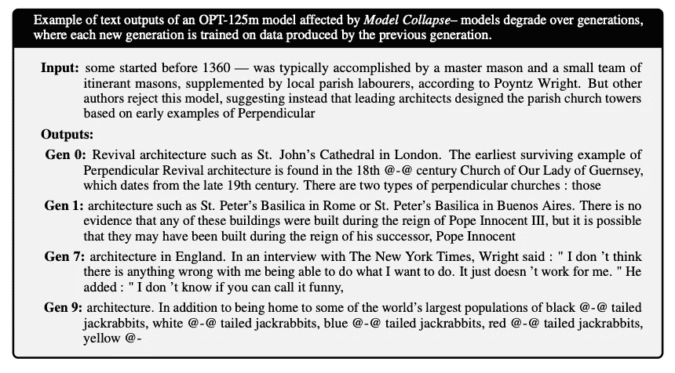
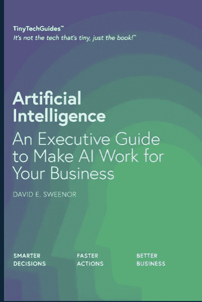

# AI 熵：AI 生成内容的恶性循环

> 原文：[`towardsdatascience.com/ai-entropy-the-vicious-circle-of-ai-generated-content-8aad91a19d4f?source=collection_archive---------2-----------------------#2023-07-14`](https://towardsdatascience.com/ai-entropy-the-vicious-circle-of-ai-generated-content-8aad91a19d4f?source=collection_archive---------2-----------------------#2023-07-14)

## 理解和缓解模型坍塌

 [David Sweenor](https://medium.com/@davidsweenor?source=post_page-----8aad91a19d4f--------------------------------)

·

[关注](https://medium.com/m/signin?actionUrl=https%3A%2F%2Fmedium.com%2F_%2Fsubscribe%2Fuser%2Fec7aed1f3ef1&operation=register&redirect=https%3A%2F%2Ftowardsdatascience.com%2Fai-entropy-the-vicious-circle-of-ai-generated-content-8aad91a19d4f&user=David+Sweenor&userId=ec7aed1f3ef1&source=post_page-ec7aed1f3ef1----8aad91a19d4f---------------------post_header-----------) 发布在 [Towards Data Science](https://towardsdatascience.com/?source=post_page-----8aad91a19d4f--------------------------------) ·10 分钟阅读·2023 年 7 月 14 日

--

照片由作者 — David E Sweenor

# 简介

想象一下，如果你能克隆自己，同时出现在多个地方，轻松处理所有责任。还记得科幻喜剧电影《多重人格》（1996 年），道格·金尼（迈克尔·基顿 饰）克隆自己来管理工作和个人生活。然而，随着越来越多的道格被创建，每个后续克隆体展现出与前一版本相比的夸张特征和降低的智力。最初旨在减少混乱的克隆体，最终在金尼的生活中造成更多混乱和熵。

在人工智能（AI）的世界中，当大型语言模型（LLM）在由早期版本生成的数据上训练时，会出现类似的现象。就像《多人复制》中的克隆体一样，AI 模型开始失去对原始数据分布的把握，导致混乱和困惑的增加——这在 AI 世界中被称为“模型崩溃”。

# 模型崩溃现象

就像《多人复制》中 Doug 在创造更多克隆体时面临的混乱一样，当 AI 模型在由早期版本生成的数据上递归训练时，它们面临类似的命运。随着时间的推移，它们变得更加愚蠢和夸张。

# 什么是模型崩溃？

模型崩溃指的是一个退化过程，随着时间的推移，AI 模型丧失对原始内容（数据）分布的信息。由于 AI 模型是在由其前任生成的数据上训练的，它们开始“遗忘”真实的底层数据分布，导致其生成能力的缩小。

虽然对此的技术解释超出了本博客的范围，但你可能会在一些 AI 图像生成器中注意到这一点——当它们开始生成几乎相同的图像时，可能说明模型已经崩溃。一个更熟悉的例子是 AI 生成的新闻网站、评论和内容农场。这些网站本质上是自动生成事实不准确的文章，并以惊人的速度传播虚假信息。[1]

现在，这其中的一些现象可能与 AI 幻觉有关，但也很可能这些 AI 内容生成器正在从其他 AI 生成的文章中抓取并自动重写。许多这样的内容立即显而易见——通常充满了广告和弹窗，几乎没有有意义的内容。

这就像是《多人复制》中的克隆体每一代变得越来越不智能和夸张。

# 这是如何发生的？

模型崩溃可能由多种因素引起，比如训练数据的多样性不足、偏见的放大和模型过拟合。当一个 AI 模型在 AI 生成的数据上训练时，它实际上是在学习自己的一种反射。这种反射就像“电话游戏”一样，随着每次迭代变得越来越扭曲。

> 当我们在 AI 上训练 AI 时，它变得越来越愚蠢。

比如说，看看这张冲浪者的照片。

作者照片 — 大卫·E·斯威诺

这是 Midjourney 从照片中创建的四个描述之一：

> “在夏威夷檀香山穿着泳衣的冲浪者雕像，风格为浅青铜和粉色，[Frank Frazetta](https://goo.gl/search?artist+frank+frazetta=)，传统的非洲、澳大拉西亚和美洲艺术，对称排列，扭曲的树枝，街头艺术美学，叙事驱动的视觉讲故事 — ar 4:3”

这是我的照片的四个 AI 生成版本：

Midjourney 拍摄 — 原始冲浪者照片的第一次迭代

是的，这些确实很粉色，但第一个看起来最接近原始图像，我之前并不知道 Frank Frazetta 是谁，但我要求它描述那张图片，最后选择了第一张。

> “一个站在粉色冲浪板上的冲浪者雕像，周围有一些花朵，风格为光线追踪、单色构图、reefwave、低角度拍摄、华丽、多彩的街景，开启 rttx — ar 77:58”

使用上述描述，下面四张图像被生成了。

Midjourney 拍摄 — 原始冲浪者照片的第二次迭代

这些确实很有趣，但似乎并没有以任何方式代表原始图像。这仅仅是与原始图像隔了两代……如果我们这样做 100 次、1000 次或 10000 次会怎样？现在，这并不是退化学习的完美示例，而是人工智能熵的一个例子。系统趋向于越来越多的混乱状态。

# 智慧人士的见解

一篇题为“[递归的诅咒：在生成的数据上训练数据使模型遗忘](https://arxiv.org/pdf/2305.17493v2.pdf)”的研究论文讨论了模型崩溃的技术细节。作者展示了这可能发生在所有模型上，而不仅仅是生成性人工智能模型。

# 模型变得更蠢（退化学习）

研究中的一个关键见解是“退化学习”的概念。在人工智能模型的背景下，退化学习指的是随着时间的推移，模型失去准确表示原始数据分布的多样性和复杂性的能力。

作者引用了以下示例：

研究论文中的模型崩溃示例

正如你所看到的，如果你在基于前几代产生的数据上训练每个模型，它将变得毫无意义。

这发生的原因有几个，包括：

+   **稀有事件的丧失**：随着模型在由自身的前一个版本生成的数据上进行训练，它们倾向于关注最常见的模式，并开始忘记稀有或不太可能发生的事件。这类似于模型失去了其“长期记忆”——类似于《多重人格》中的道格。稀有事件通常是数据中的重要信号——无论它们是否代表制造过程中的异常或欺诈交易。理解和维护稀有事件是重要的。例如，在文本分析项目中，常见的做法是去除“垃圾”词——这些可能是代词、定冠词和不定冠词等等。然而，对于欺诈案例来说——代词才是欺诈的信号。欺诈者往往使用第三人称而不是第一人称。

+   **偏见的放大**：对人工智能生成的数据进行每次训练都可能放大现有偏见。由于模型的输出基于其训练数据，任何训练数据中的偏见都会随着时间的推移得到强化和夸大——这与多个道格的情况类似。我们已经在传统人工智能领域看到了偏见的放大，这导致了歧视性的招聘、医疗领域的种族偏见或歧视性的推文。我们需要制定控制措施来检测和减轻这些偏见的持续存在。

+   **生成能力的狭窄**：随着模型受到自身现实投影的影响变大，生成能力开始变窄。模型开始生成越来越同质化的内容，代表原始数据中多样性和稀有事件的能力降低。当一切开始回归均值和同质状态时，这将导致原创性的丧失（我们已经在食谱网站上看到了这种现象）。对于大规模语言模型而言，变化赋予每个作者或艺术家独特的语调和风格。

+   **功能逼近误差**：论文提到，如果函数逼近器表达能力不足，可能会出现功能逼近误差。通过使用更具表达力的模型可以最小化这种误差，但过多的表达力可能会放大噪声并导致过拟合。

> 退化学习的特点是模型在对人工智能生成内容进行每次训练后，学习和准确表示数据的能力逐渐恶化，形成恶性循环。

这对人工智能模型生成内容的质量和可靠性具有重要影响。

# 模型崩溃的影响

理解模型崩溃现象很有趣，但同样重要的是认识到其影响。模型崩溃可能会产生深远的后果，影响人工智能生成内容的质量、可靠性和公平性。如果没有适当考虑，你的组织可能会面临风险。

# 质量和可靠性

随着人工智能模型进行退化学习，它们生成的内容的质量和可靠性可能会显著下降。这是因为模型与原始数据分布的联系丧失，并且更受自身现实投影的影响。例如，用于生成新闻文章的人工智能模型可能开始生成不准确、过于同质化或完全虚假的内容！

# 公平性和代表性

模型崩溃可能对公平性和代表性产生严重影响。随着模型遗忘稀有事件和生成能力变窄，与边缘化群体或较少见主题相关的内容可能会被低估或误呈现。这可能会加剧偏见和刻板印象，助长某些声音和观点的排斥。

# 伦理问题

关于模型崩溃的伦理问题是显著的。当 AI 生成的内容用于决策、教育或信息传播时，内容的完整性至关重要。模型崩溃可能导致传播有偏见、不准确或同质化的内容，这可能带来伦理问题，特别是当这些内容影响到人们的生活、观点或机会时。

# 经济和社会影响

在经济和社会层面，模型崩溃可能会影响对 AI 技术的信任和采纳。如果企业和消费者不能依赖 AI 模型生成的内容，他们可能会更不愿意采纳这些技术。这可能对严重依赖 AI 的行业产生经济影响，并对公众对 AI 的认知和信任产生社会影响。

# 减轻模型崩溃的策略

模型崩溃具有深远的影响，必须制定策略来减轻其影响。以下是可以用来防止或减轻 AI 系统模型崩溃的一些策略：

## 保留原始人工生成的数据集

研究论文中的一个关键见解是保留原始人工生成数据集的重要性。定期在这些数据上重新训练模型可以帮助确保模型保持在现实基础上，并继续代表人类经验的多样性和复杂性。最近的一篇[来自微软研究院的研究论文](https://arxiv.org/abs/2306.11644)建议，在可靠的数据如教科书上训练大型语言模型可能有助于提高其准确性。

## 引入新的人工生成数据集

除了保留原始数据集之外，将新的、干净的人工生成数据集引入训练过程是有益的。这可以帮助防止模型生成能力的缩小，并确保它继续学习和适应新信息。随着公司开始在其专有企业数据上微调大型语言模型，这可能有助于防止模型性能下降。

## 监控和定期评估

定期监控和评估 AI 模型的表现至关重要。通过设定评估指标和基准，可以检测到模型崩溃的早期迹象。这允许及时采取干预措施，如调整训练数据或调整模型参数。这与我们传统的模型监控指导没有区别，企业需要实施 MLOps 框架，以持续监控模型和数据的漂移。不仅需要检测这些问题，还需要额外的机制来确保模型不会产生虚假信息，并生成与公司目标一致的结果，这将是许多组织的新能力。

## 多样化训练数据

确保训练数据的多样性和代表不同观点与经历的特征有助于防止偏见并确保 AI 生成内容的公平性。这包括确保少数群体和稀有事件的代表性。不言而喻，组织需要了解用于训练模型的源数据，以确保其与现实对齐并代表社会的最佳面貌。盲目使用充满负面、偏见和虚假信息的互联网数据是灾难的根源。

## 社区协调与合作

模型崩溃不仅是技术挑战，也是一项伦理和社会挑战。涉及 AI 公司、内容生产者、研究人员和政策制定者的社区范围内的协调至关重要。共享信息、最佳实践和共同制定标准与指南对于解决模型崩溃问题具有重要作用。尽管指南和框架很重要，但类似于[联合国 AI 伦理框架](https://unite.un.org/news/unite-paper-framework-ethical-ai-united-nations)，在地缘政治边界上实施和获得支持将面临挑战。

# 摘要

在*Multiplicity*中，Doug 试图通过克隆自己来管理责任，结果导致了意想不到的混乱和熵。这一情景在 AI 世界中找到了平行点，即在 AI 生成的数据上训练模型可能导致一种称为模型崩溃的熵。

就像电影中的克隆随着每一代变得更愚蠢和混乱一样，AI 模型在对自身输出进行训练时也可能失去准确代表原始数据多样性和复杂性的能力。

模型崩溃类似于*Multiplicity*中的熵，对 AI 生成内容的质量、可靠性和公平性具有深远的影响。这提醒我们，无论是电影中的克隆还是 AI 对自身数据的训练，未经控制的复制都可能导致信息丧失和混乱增加。

然而，与*Multiplicity*中的不受控制的克隆不同，我们拥有管理和缓解 AI 系统模型崩溃的工具和知识。通过保留原始人类生成的数据集、多样化训练数据、定期监控 AI 模型以及促进社区协调，我们可以对抗熵，并确保 AI 保持可靠和有益的工具。

随着 AI 的不断发展，牢记*Multiplicity*中的教训、熵以及模型崩溃的研究至关重要。通过集体努力，我们可以负责任地使用 AI，确保其保持现实基础，并服务于所有社区的多样化需求，而不陷入混乱。

本质上，通过积极管理 AI 数据的‘克隆过程’并注意其可能产生的熵，我们可以将 AI 发展引导到创新且负责任的方向上。

如果你想了解更多关于人工智能的内容，请查看我的书籍 [《人工智能：让 AI 为您的业务服务的高管指南》在亚马逊上](https://www.amazon.com/Artificial-Intelligence-Executive-Guide-Business/dp/B09X4KTYS4)。

《人工智能高管指南》在亚马逊上

[1] Thompson, Stuart A. 2023\. “A.I.-生成内容在新闻网站、内容农场和产品评论中被发现。”《纽约时报》，2023 年 5 月 19 日，第技术版。[`www.nytimes.com/2023/05/19/technology/ai-generated-content-discovered-on-news-sites-content-farms-and-product-reviews.html`](https://www.nytimes.com/2023/05/19/technology/ai-generated-content-discovered-on-news-sites-content-farms-and-product-reviews.html)
