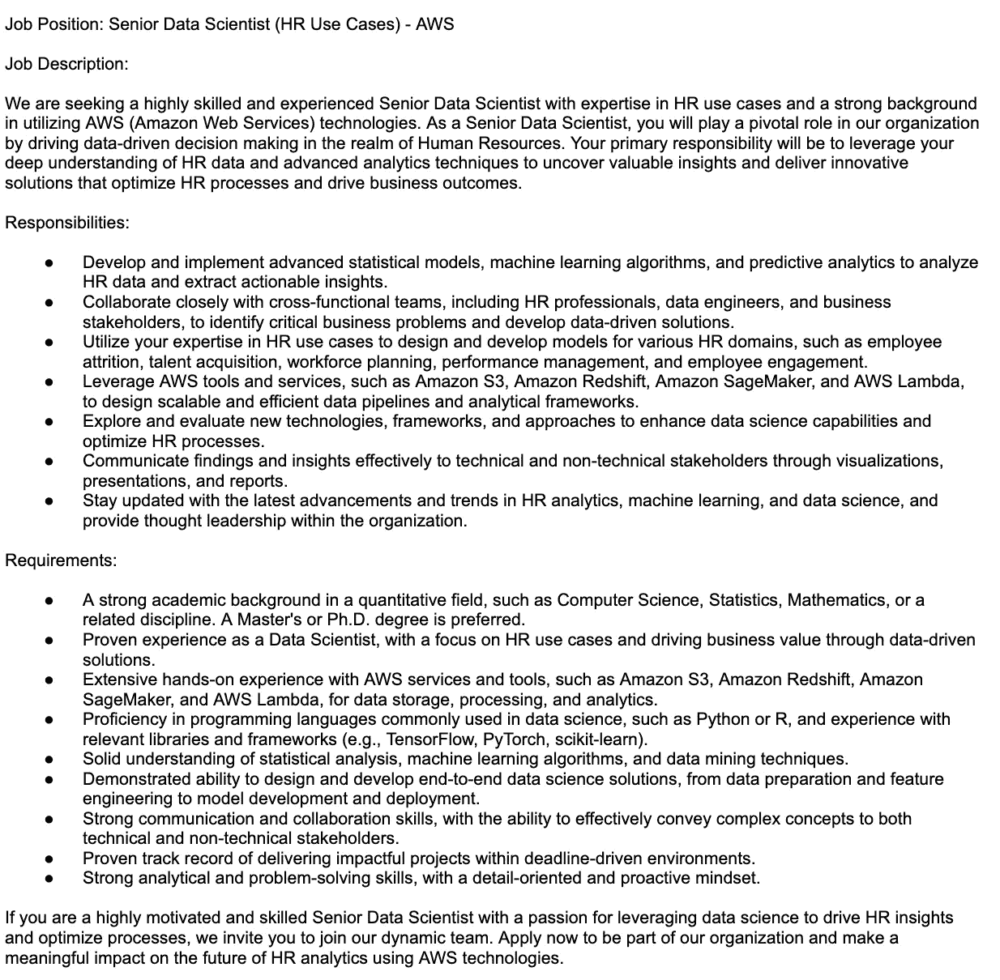

# AI 前沿系列：人力资源

> 原文：[`towardsdatascience.com/ai-frontiers-series-human-resources-fd245fc0c1c?source=collection_archive---------16-----------------------#2023-06-20`](https://towardsdatascience.com/ai-frontiers-series-human-resources-fd245fc0c1c?source=collection_archive---------16-----------------------#2023-06-20)

## 人工智能难题的介绍

 [Ezequiel Ortiz Recalde](https://medium.com/@eortizrecalde?source=post_page-----fd245fc0c1c--------------------------------)

·

[关注](https://medium.com/m/signin?actionUrl=https%3A%2F%2Fmedium.com%2F_%2Fsubscribe%2Fuser%2F2939b50adecd&operation=register&redirect=https%3A%2F%2Ftowardsdatascience.com%2Fai-frontiers-series-human-resources-fd245fc0c1c&user=Ezequiel+Ortiz+Recalde&userId=2939b50adecd&source=post_page-2939b50adecd----fd245fc0c1c---------------------post_header-----------) 发表在 [Towards Data Science](https://towardsdatascience.com/?source=post_page-----fd245fc0c1c--------------------------------) ·16 分钟阅读·2023 年 6 月 20 日

--

图像由[Midjourney](https://www.midjourney.com/)生成

回顾我近三年前的第一次“跨行业头脑风暴会议”，我对机器学习概念从曾经被认为雄心勃勃到如今对人力资源部门变得可实现感到惊讶。人工智能的快速发展正在转变各个行业，从制造业到医疗保健。然而，人力资源领域在接受这场数字革命方面却较为迟缓。

尽管人力资源中的定性和定量任务的混合可能表明它不太可能成为人工智能应用的候选者，但这一假设忽视了人工智能为人力资源领域带来的潜力。本文旨在探讨这种尚未开发的潜力。我们将关注人力资源行业的关键挑战、重要绩效指标以及人工智能技术如何帮助克服这些挑战。这与传统人员分析解决方案的局限性形成了鲜明的对比。

与[**前一篇文章**](https://medium.com/towards-data-science/ai-frontiers-series-supply-chain-f5fa008570ad)讨论的供应链数据问题不同，这里的主要关注点不仅仅是高质量数据的可用性。数据的处理和遵守数据规范同样至关重要。在接下来的章节中，我们将讨论如何解决这些因素，以解锁人工智能在人力资源中的变革力量。

然而，在深入这些用例之前，需要注意的是，你的组织应首先评估其实施这些策略的准备情况，正如 Chowdhury, S., et al.,（2023）所推荐的。此外，正如我不断强调的，检查一些更广泛的要求肯定会大有帮助（你可以参考这篇[**文章**](https://medium.com/towards-data-science/14-requirements-to-make-your-machine-learning-project-a-success-part-i-80c288be503d)）。

# 人力资源管理中的挑战

产生有价值的想法的一个简单方法是首先了解与特定行业、领域、公司等相关的关键绩效指标（KPI）。一旦我们对所有这些问题都有了答案，就可以开始考虑其他“可有可无”的解决方案。在这方面，所有人力资源部门都面临相同的一系列挑战，包括**人才招聘和留存**、**员工参与**、**绩效管理**、**多样性和包容性**以及**合规性**（**Pereira, V., et al., 2023**）。

一些典型的人力资源关键绩效指标（KPI）包括：

+   招聘时间（time-to-hire）

+   成本每次招聘（cost-per-hire）

+   员工流失率（employee turnover rate）

+   员工参与评分（employee engagement score）

+   多样性比例（diversity ratios）

需要强调的是，这些指标所测量的过程需要**定量分析与人类理解的微妙平衡**。因此，为了充分理解人工智能在人力资源中的潜力，我们必须首先对每个 KPI 测量的过程的现状提出一些问题。请注意，这是你在处理任何机器学习[**项目**](https://medium.com/towards-data-science/14-requirements-to-make-your-machine-learning-project-a-success-part-i-80c288be503d)时应该遵循的标准程序。在这方面，我们将通过使用一些触发问题来逐步探讨每个过程的步骤。

## **1. 人才招聘挑战**

在招聘新人才时，人力资源专业人士需要发布职位描述，筛选大量简历，进行初步筛选，安排面试，最后根据硬数据和软技能的综合评估做出招聘决策。但他们是否拥有有效且透明地执行这些任务的工具？我们如何确保某些过程没有偏见？让我们来分析整个过程。

**1.1\. 职位创建与发布**

你们公司是否仍然在没有人工智能辅助的情况下编写职位描述？在确定招聘需求后，任何招聘流程的初步步骤包括在自己拥有的平台或第三方平台（如 LinkedIn）上创建并发布职位描述。编写这些描述可能相当费力；然而，这一步骤对于吸引顶尖人才并在当今迅速发展的就业市场中展现专业形象至关重要。此外，鉴于我们将在本文中讨论的解决方案，职位描述的模糊定义可能会在某些用例中限制我们获得的结果质量（我会在稍后详细说明）。

表述不清的职位描述可能会使合格的候选人却步，吸引不适合的人选，并使招聘过程变得复杂。此外，它们还可能损害公司的公共形象，暗示缺乏专业性。模糊的描述可能会因工作期望不明确和潜在的歧视性语言而导致法律问题，侵犯平等就业机会法。相反，精心撰写的职位描述能够吸引顶级人才，加快招聘速度，支持多样性和包容性，并提升公司的声誉。因此，组织必须投入足够的资源来创建全面、准确和包容的职位描述，从而确保有效的招聘、法律合规和增强的公共形象。

一个简单的解决方案是利用人工智能文本生成的强大功能。通过利用前沿的工具——大型语言模型（LLMs），你可以优化职位描述模板，并取得令人印象深刻的结果。

举个例子，考虑一个针对专门从事人力资源工作的高级数据科学家职位，要求精通 AWS。利用人工智能，提示可以在不到 10 秒的时间内编写完成，这不仅高效而且非常有效。

作者提供的图片

请注意，我们可以提供更准确的提示，以反映组织的价值观以及在招聘过程其余部分中应评估的主题。

在发布了全面且引人入胜的职位描述后，看到大量的候选人群体以及随之而来的申请激增是很自然的。这一进展无缝地引导我们进入招聘过程的下一阶段：详尽而繁琐的简历分析任务。

**1.2\. 简历分析**

你还在手动筛选每一份进入邮箱的简历吗？你的 HR 人才招聘专员是否在分析数百甚至上千份申请时投入了宝贵的时间，即便已经找到合适的候选人？你是否曾经考虑过你的招聘人员在决策时权衡的具体变量，或者他们如何利用数据库中留下的简历来匹配未来的职位招聘？

如果这些问题曾经困扰过你，那么很明显你已经认识到在数据驱动的时代，手动审阅简历和分析大量申请的传统方法已经不再奏效。

自动化简历解析解决方案确实是一个重大进步，使我们能够相对轻松地从简历中提取相关信息。但这还不是终点。在解析阶段之后，我们面临着一堆看起来令人不知所措和难以处理的数据。仅仅将这些数据分类到表格中并进行基本分析已不再够用。

此外，虽然我们可能假设领先的 HR 平台已经掌握了简历解析的艺术，但现实往往令人失望。当简历偏离常规格式时，它们的表现可能较差，导致关键候选人信息的丢失。

克服这些障碍的一个解决方案是**语义匹配**。在机器学习中，这一概念指的是理解和比较不同文本或数据的意义或语义的过程。它涉及评估单词、短语、句子甚至整个文档之间的相似性或相关性。目标是确定不同文本在其基本意义上的对齐程度，而不仅仅是依赖表面模式或确切的单词匹配。语义匹配在各种自然语言处理（NLP）任务中扮演着至关重要的角色，如信息检索、问答、情感分析和文本分类。它有助于弥合人类对语言的理解与机器学习模型的计算能力之间的差距。

我们如何在这种情况下使用它？通过**总结职位简介**、基于**解析的数据**进行**语义匹配**与**职位**，可以生成一个**评分**。这个评分反映了个人简介的每个属性与职位要求的对齐程度。通过语义匹配，你可以有效地根据候选人对所申请职位（以及其他职位）的适配性进行优先排序和评估（全部自动化）。**请注意，如果职位定义不明确，结果的质量可能会有所欠缺。**

如果语义匹配听起来不够令人信服，仍然有其他替代方案可以在很大程度上解决这个问题。

+   **自动化预筛选**：实施机制以筛选出不符合特定标准或最低资格的候选人。这可以通过基于规则的系统或在历史招聘数据上训练的机器学习模型实现。当然，要做到这一点，你应该有一个解析器解决方案。

+   **基于 ML 的排名**：开发一个根据各种属性（如技能、经验和资格）自动打分和排名候选人的排名系统。这种方法使数据驱动的决策成为可能，并消除了评估过程中的偏见。

请注意，投资于这些变更的实施可能会比你预期的更具影响力。这些技术可以在多个方面惠及你的 HR 操作：

+   **可扩展性和效率**：随着业务的扩展和申请量的增加，手动处理工作负荷变得越来越具挑战性。提到的技术可以通过高效处理和评估大量简历来提供可扩展性，确保对所有申请进行一致和全面的分析。此外，通过自动化简历分析的初始阶段，公司可以显著减少审查不合格候选人所花费的时间和资源。这使 HR 团队可以将精力集中在更具战略性的任务上，如面试和评估最有前途的候选人。

+   **减少偏见**：实施描述的解决方案具有减少候选人评估过程中的偏见的巨大潜力。通过关注职位要求和候选人特征之间的语义对齐，评估变得更加客观，不易受到可能影响人工简历筛选的无意识偏见的影响。

+   **持续学习**：基于机器学习的方法可以不断学习和改进。通过利用历史数据和招聘人员的反馈，这些系统可以适应组织的特定需求，优化匹配算法，变得更加准确和有效地识别最合适的候选人。因此，现在打下基础将来肯定会带来十倍的好处。

分析完简历后，让我们进入候选人面试的关键阶段。

**1.3. 候选人面试 2.0**

在面试过程中，招聘人员通常需要帮助来简化流程并确保与候选人之间的有效沟通。为了解决这一需求，我们的团队正在开发一个创新的应用程序，该应用程序采用语音转文本模型和先进的算法。这个应用程序旨在为招聘人员在面试过程中提供实时支持。

通过利用这个应用程序，招聘人员可以增强面试的结构，确保关键问题得到解决。该应用程序利用各种元素，包括职位描述、标准面试问题列表、候选人简历以及对话的实时记录。

通过使用大型语言模型（LLMs），该应用程序分析面试内容并生成相关问题和反馈。招聘人员可以自定义接收这些帮助的频率，以满足他们的偏好和需求。

提供这个应用程序的目的是优化面试过程，为招聘人员和候选人节省时间，同时促进高效且富有洞察力的对话。

**1.4\. 全流程自动化？**

你现在是否计划完全自动化招聘过程？请注意，我从未建议使用 AI 聊天机器人或其他方法来自动化整个招聘过程。为什么？嗯，我不认为我们已经达到那个阶段，我们可以通过保留人为因素获得更多的好处。虽然自动化和先进技术可以大大增强人才获取过程，但认识到人类判断和专业知识的价值也很重要。采用人机协作的方法，其中自动化技术的结果由人工招聘人员审查和验证，可以确保一个平衡且准确的评估，结合了人类智慧和机器学习算法的优点。

作为一个有趣的结尾，我留给你一个值得深思的问题：如果我们通过 AI 聊天机器人等工具来自动化过程，候选人也可以利用 AI 学习如何在一种强化学习过程中说服这些聊天机器人……

## **2\. 人才留任挑战**

一旦你成功雇佣了一个候选人，接下来就是拼图中最重要的部分，即留住人才，以避免浪费在招聘过程中付出的所有努力，并避免员工离职对组织造成的损害。关于这个问题，你可以做几件事。

**2.1\. 员工离职预测**

你的组织是否在预测每个员工在下一个季度/学期/年度离开公司的概率？成功的员工留任往往依赖于在问题出现之前采取的主动措施。你的组织有多少次在员工已经决定离职时才提出反报价？可能太多了，难以计算。因此，解决这个挑战至关重要的是，在员工到达离职点之前检测出高风险的员工。

在这种情况下，可以开发玻璃盒子机器学习模型来预测员工在接下来的*n*个月内离职的可能性，并识别导致这种概率的因素。与黑箱模型不同，玻璃盒子模型提供了可解释性，使我们可以清晰地了解预测背后的原因。这一点至关重要，因为我们处理的是敏感的员工数据，而模型推断推荐的行动可能会对员工的职业轨迹产生重大影响。因此，完全透明和理解模型的工作原理是至关重要的。

有鉴于此，我和我的同事们开发了一个模型，以解决主流“解决方案”中常见的不足之处。要详细了解如何按照正确框架处理这个问题，我推荐参考这篇 [**文章**](https://medium.com/towards-data-science/cracking-the-employee-attrition-problem-with-machine-learning-6ee751ec4aae)。

**2.2\. 个性化员工发展**

你的组织是否提供定制的职业发展路径？员工通常在竞争力的薪酬和职业成长机会之间寻求平衡。虽然这两个方面都很重要，但例如年轻专业人士可能会优先考虑有机会发展技能并在所选领域中晋升。认识到这一点，组织可以利用个性化学习和发展计划，通过满足这种隐性期望来增强员工的留任率。

AI 驱动的推荐系统在这方面可以发挥重要作用。这些系统利用员工绩效数据，分析个人的优势、劣势和职业目标。它们还考虑了“相似”员工的信息，这些员工在类似角色或职业路径中取得了成功。通过整合这些见解，组织可以为培训和“技能提升”机会制定量身定制的推荐，以符合每位员工的具体需求和期望。

此外，在主流方面，AI 驱动的推荐系统可以通过建议与每位员工的发展计划相一致的相关学习材料、课程、指导机会或网络活动，提供持续的指导。通过适应个人偏好和不断变化的职业路径，这些系统确保员工在与组织的旅程中始终获得相关且有趣的学习体验。

接下来，紧密关联的留任问题就是参与度问题。

## 3\. 员工参与度挑战

员工参与度，即员工对工作环境的情感和实际投入的程度，对于组织的成功至关重要。它有助于提高绩效、工作满意度和留任率。目前，参与度通常通过定期调查与工作满意度一起衡量，但这种方法存在两方面的不足：

+   **频率**：这些调查的不频繁性导致了参与度的过时快照。

+   **复杂性**：这些评估通常需要多维度分析，这对人类来说是很难准确执行的。

为了应对这些问题，我们提出了一种将组织视为相互作用节点网络的方式，提供了一个全面的视角。

**3.1\. 组织网络分析**

组织网络分析（ONA）使用图论中的技术来系统地探索和理解组织的网络，包括管理结构、人际关系和信息流（Barabási, A. L., 2013）。

要实施组织网络分析（ONA），网络可以通过提名调查或使用工作空间平台的数字足迹（注意数据保护问题）来构建。在建立网络后，可以使用传统图算法来确定每个成员的中心性及其在组织中的影响力。这些指标与员工特征和过去的调查见解相结合，然后可以用来开发一个预测员工参与度的模型。

通过利用 ONA，组织可以获得对内部动态的宝贵见解，识别关键影响者，评估每个个体的角色，并预测员工的参与水平。然而，必须确保在整个过程中数据隐私和保护。数据收集和分析期间应严格遵守数据保护协议和伦理考虑。

**请注意 ONA 不是 AI**……而是收集相关数据的一种初步步骤，这将使我们能够创建或补充我们当前的模型开发。例如，我们可以提取有关组织内部互动或连接水平的有价值数据，并将这些信息作为流失模型或参与模型的特征，用于预测组织中任何给定时刻的参与水平。对于那些有兴趣深入了解这个话题的人，我建议你参考这篇[**文章**](https://medium.com/towards-data-science/an-introduction-to-organizational-network-analysis-cfa91a0e2fda)。

**3.2\. AI 参与助手**

你是否考虑过从书面满意度表单中提取定量和定性见解？AI 在这里可以发挥关键作用。我们建议将其用于收集关于公司改进机会的匿名反馈，而不是创建监控员工的 AI 助手——这有可能贬低人类因素。这些反馈可以被分析和结构化，供人力资源部门提取可操作的见解，类似于之前提议的面试助手的功能。

这种方法对于更具体的任务也可能很有价值。例如，在寻求关于研讨会的反馈时，不妨鼓励参与者提供详细的书面反馈，而不是使用传统的 1 到 5 评分量表。这些定性数据可以使用大型语言模型（LLM）进行分析，以揭示更深层次、更有意义的见解。

尽管书面反馈有时可能缺乏质量和具体性，但它提供的丰富背景使其成为一个值得探索的途径。

接下来，我们探讨参与度、保留率和绩效管理的相互挑战。

## 4\. 绩效评估挑战

传统的绩效评估流程通常面临质量不均、信息不全和时间消耗等问题。

质量不均：源于经理在提供反馈时写作技巧和沟通能力的差异。构造不良或不清晰的反馈可能无法积极影响员工，未能有效地解决改进领域或认可成就。

信息不全源于在评估期间遗漏的成就或改进领域。这种反馈的缺失可能导致错失引导员工改善表现或认可其成功的机会。

制作详细的绩效评审过程耗时，这可能会将经理们宝贵的时间从更具生产力的活动（如员工培训或指导）中转移出来。

这些挑战需要一种高效、精简的绩效评估方法，以优化资源利用，确保公平，并提高反馈的质量和完整性。

**4.1\. 评估助手**

对于那些在进行多个员工评审时难以记住关键细节的人，解决方案可能在于利用总结模型。事实上，我们已经为此问题构建了一个[**解决方案**](https://www.linkedin.com/posts/javierdelgado_thinkhuman-workdigital-activity-7061958057412415488-qy5F?utm_source=share&utm_medium=member_desktop)。

想象一下我们有一个名为“TheBestCompany”的组织。在 TheBestCompany，他们利用 LLMs 模型处理多个数据源并生成员工评审。各种数据源，如反馈、参与的项目和客户反馈，会被汇总并输入 LLM，LLM 然后区分出成就和改进领域，并将这些反馈整合到一个绩效评估模板中，当前的人工评审员可以对其进行修改。

这个自动化评审生成过程节省了时间和资源，最小化了偏见和错误，生成了详细且准确的评审。LLMs 的灵活性允许根据组织需求进行定制，提升绩效评估的准确性、效率和公平性。这一解决方案使组织能够专注于其他重要任务和目标。

## 5\. 解决多样性和包容性挑战

多样性和包容性在许多组织中是持久的挑战，这些挑战不仅存在于招聘过程中，还包括晋升和绩效评估。这些领域中的主观性可能无意中掩盖一个员工的优点和另一个员工的不足（Rodgers, W., et al., 2023）。

有两个策略可以帮助缓解这个问题。第一个策略涉及开发忽略敏感变量（如年龄、性别、种族和宗教）的算法。这些算法侧重于资格、技能和表现，鼓励客观评估，从而减少偏见并确保公平的决策。

第二种策略利用考虑这些敏感变量的模型来理解它们对某些结果的影响。通过分析历史数据，这些模型可以揭示与特定属性相关的潜在偏见，帮助组织主动识别和纠正系统性问题，促进平等机会和包容性。

然而，必须记住，算法和模型应当补充人类的判断和专业知识，而不是替代它们。此外，这些工具应定期进行审计，以确保它们不会无意中延续偏见。

## 6. 数据质量挑战

数据质量是人力资源中的一个常见障碍，手动输入可能导致潜在错误、不一致的格式或人力资源平台（如 Workday 或 SAP HR）中的不完整记录。这些问题可能会影响机器学习算法的准确性和可靠性，正如“垃圾进，垃圾出”这一短语所概括的。因此，实施细致的 ETL（提取、转换、加载）过程对数据完整性至关重要，同时需要考虑伦理问题和即将到来的数据保护挑战。事实上，几乎 90% 的时间都应该花在 ETL 过程上。

## 7. 数据保护挑战

人力资源数据通常包含敏感的个人信息，需要强有力的数据保护措施。为了保护这些数据，组织必须采用强大的数据治理实践，包括严格的安全措施、访问控制和数据加密技术（Hamilton, R. H., & Davison, H. K., 2022）。

建立明确的数据处理、存储和共享政策至关重要，只允许授权人员访问。通过优先考虑数据保护和遵守法律法规，组织可以在保护人力资源数据的隐私和机密性的同时，与员工建立信任。

与法律和合规团队密切合作也是必要的，以满足所有适用的法律法规，特别是如欧盟的 GDPR 这样的特定数据保护法律。在所有这些过程中，寻求法律顾问和数据保护专业人士的建议以确保遵守当地法律法规是非常重要的。

# 结束语

总的来说，我们已经看到，人工智能与人力资源的交集开辟了一个等待探索的可能性领域。在这种情况下，数据科学家和商业专业人士面临的挑战是将这些可能性转化为切实可行的解决方案，从而简化人力资源流程，同时保留宝贵的人文元素。这既涉及利用人工智能的力量，又涉及理解人力资源管理的细微差别。毫无疑问，这种平衡将推动未来，创造一个更有效、更具包容性和同理心的人力资源行业。

敬请关注本系列更多深入的文章，随着我们共同努力通过创新解决方案的民主化来改善世界。

# 参考文献

[1] Chowdhury, S., Dey, P., Joel-Edgar, S., Bhattacharya, S., Rodriguez-Espindola, O., Abadie, A., & Truong, L. (2023). 通过**人工智能能力框架**解锁人工智能在人力资源管理中的价值。*人力资源管理评论*, *33*(1), 100899。

[2] Pereira, V., Hadjielias, E., Christofi, M., & Vrontis, D. (2023). 关于人工智能对工作场所结果影响的系统文献综述：一个多过程视角。*人力资源管理评论*, *33*(1), 100857。

[3] Barabási, A. L. 2013\. 网络科学。*皇家学会 A 卷：数学、物理与工程科学的哲学学报*, 371(1987), 20120375。

[4] Rodgers, W., Murray, J. M., Stefanidis, A., Degbey, W. Y., & Tarba, S. Y. (2023). 一种人工智能算法方法在**人力资源管理过程**中的伦理决策。*人力资源管理评论*, *33*(1), 100925。

[5] Hamilton, R. H., & Davison, H. K. (2022). 人力资源在机器学习中的法律与伦理挑战。*员工责任与权利期刊*, *34*(1), 19–39。
