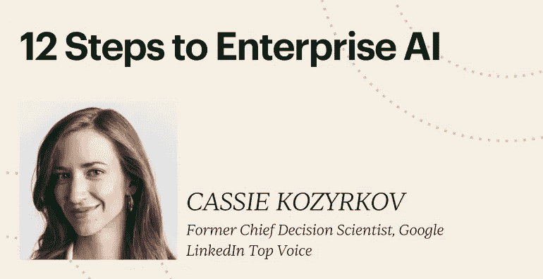

# AI 生成的合成数据

> 原文：[`towardsdatascience.com/ai-generated-synthetic-data-913b73494062`](https://towardsdatascience.com/ai-generated-synthetic-data-913b73494062)

## 与 AI 交朋友

## 用猫咪以最佳方式解释：

 [Cassie Kozyrkov](https://kozyrkov.medium.com/?source=post_page-----913b73494062--------------------------------)

·发表在[Towards Data Science](https://towardsdatascience.com/?source=post_page-----913b73494062--------------------------------) ·阅读时间 4 分钟·2023 年 7 月 21 日

--

为什么[AI 生成的合成数据](https://bit.ly/quaesita_synthguide3)现在这么受欢迎？在这篇文章中，我将用猫咪来解释我最喜欢的方式！

假设我想从头开始训练一个[猫咪-非猫咪分类器](http://bit.ly/quaesita_tiger)，但我只有一张照片可用：

作者的猫，赫胥黎。

*(以下内容都是对人们如何处理表格数据和文本数据的类比，因此不仅限于图像数据。)*

理想情况下，我需要一个包含数千张猫咪和非猫咪照片的数据集。如果我有相机和大量的猫咪，我可以拍摄一堆像我已经拥有的照片一样的照片，确保得到我所设计的数据集[我设计的](https://bit.ly/quaesita_philadelphia)：

我在伊斯坦布尔的一个公园拍的照片。

但如果我没有相机，并且在月球上没有猫怎么办？我可以从[a vendor](https://bit.ly/quaesita_datasearch)那里获取我需要的图像，不过我得小心，因为[继承的数据](https://bit.ly/quaesita_notyours)比原始数据更危险。

感谢，[Pixabay](https://pixabay.com/photos/cat-puss-kitten-siamese-siam-path-1656796/)，成为一个优秀的（免费的）猫咪照片供应商。

但如果没有供应商愿意卖我一些猫咪照片怎么办？（是的，互联网猫咪照片用尽的情况比在月球上生活更像科幻，但请耐心一点。）

好吧，如果我不能收集它们，也不能购买它们，那么我就得自己制作它们。瞧，这是我的创作：

你的作者是一位真正的[米开朗基罗](https://en.wikipedia.org/wiki/Michelangelo)。

不好？是的，绘画从来不是我的强项。另一种制作假数据的方法是复制现有的数据点，不过这对提供教学多样性帮助不大。

这种方法不会欺骗任何人。我目前只有一个有效的数据点。

这就像通过重复相同的例子来教一个人类学生，这样他们学到的就是那一个东西。如果我的数据集包含 30,000 张这张赫胥黎照片和 30,000 个灰色方块，我的模型将不知道如何处理火鸡的照片。

我也在[Pixabay](https://pixabay.com/photos/cute-animal-portrait-eye-to-sit-3333100/)上找到了这只感恩节火鸡。

如果我有更多的照片，并且不想制作完全相同的副本，我会考虑通过将它们融合在一起来制作一个前所未见的新猫……当人们用[表格数据](https://bit.ly/quaesita_synthguide2)做同样的事时，它的效果就像这个美丽的例子一样拗口：

对不起，Pixabay，我对你们的猫做了这样的事。

所以，如果我没有相机、供应商、真实世界的数据集，或者自己生成数据的能力，我就没有其他选择了吗？不。

这正是 AI 发挥作用的地方。

我可以通过站在巨人的肩膀上——这些巨大的猫照片收藏者！——并使用生成性 AI 来创建数据集：

使用 Midjourney 创建

使用 AI 可以制作出非常逼真的假货，可能会欺骗人的眼睛。不过，也有一些不会：

使用 Midjourney 创建

这些猫来自哪里？你基本上是在模拟 AI 模型从其训练数据中学到的“猫性”分布，这是你希望拥有但却负担不起的无数猫照片。这就像所有那些涉及从统计分布中模拟的[统计学内容](http://bit.ly/quaesita_sims)，它具有许多相同的优缺点，加上一个额外的缺点，就是你实际上对你所绘制的猫的分布了解甚少。*

为什么 AI 生成的合成数据如此令人兴奋？它让你可以利用你无法自己获得的数据（即使这些数据是由其他人处理过的）。由于最近 AI 的进步，机器制造的假货对人类来说非常逼真。不幸的是，即使它们对*你*来说看起来很逼真，当用来[训练](http://bit.ly/quaesita_mrbean)你自己的 AI 系统时，它们可能有一个你无法用肉眼发现的致命缺陷……

要了解这个缺陷是什么，请继续关注即将发布的合成数据的利弊清单！（别忘了点击订阅按钮，以免错过。）

# 感谢阅读！要来个课程吗？

如果你在这里玩得很开心，并且你正在寻找一个适合初学者和专家的有趣应用 AI 课程，[这是一个](https://bit.ly/funaicourse)我为你的娱乐而制作的：

课程链接: [`bit.ly/funaicourse`](https://bit.ly/funaicourse)

*附言：你是否尝试过在 Medium 上点击掌声按钮多次，看看会发生什么？* ❤️

# 注脚

*我的同行们，[统计学家](http://bit.ly/quaesita_battle)会将这视为模拟他人[核密度估计](https://en.wikipedia.org/wiki/Kernel_density_estimation)的一个亲戚，而完全不了解他们的基础数据或代码，这太粗糙了。*
