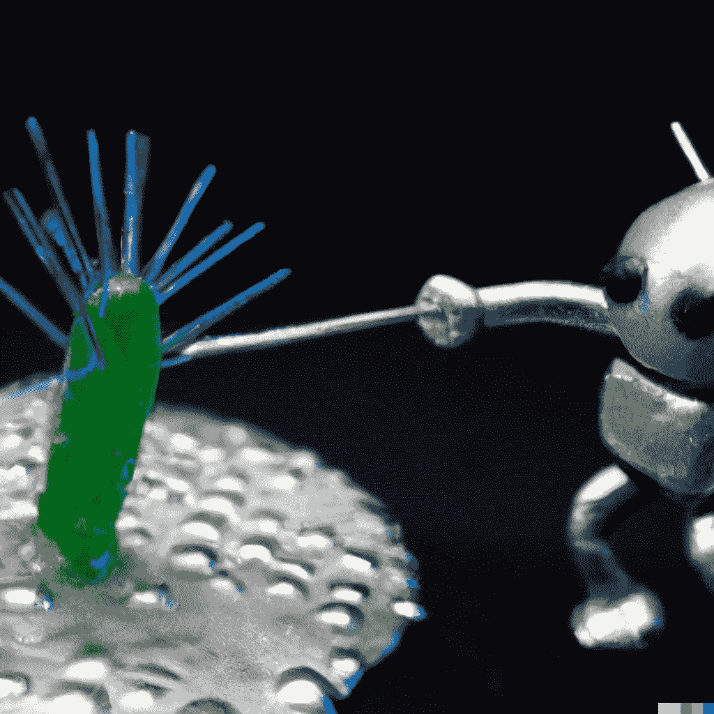

# AI 在行动：指导新抗生素的发现以针对多重耐药细菌

> 原文：[`towardsdatascience.com/ai-in-action-guiding-the-discovery-of-new-antibiotics-to-target-multidrug-resistant-bacteria-58fec477d424?source=collection_archive---------1-----------------------#2023-06-03`](https://towardsdatascience.com/ai-in-action-guiding-the-discovery-of-new-antibiotics-to-target-multidrug-resistant-bacteria-58fec477d424?source=collection_archive---------1-----------------------#2023-06-03)

## AI 对重要问题的应用

## 通过我对一篇新论文的通俗描述，了解有关 AI 在化学应用中的数据科学。

 [LucianoSphere (Luciano Abriata, PhD)](https://lucianosphere.medium.com/?source=post_page-----58fec477d424--------------------------------)

·

[关注](https://medium.com/m/signin?actionUrl=https%3A%2F%2Fmedium.com%2F_%2Fsubscribe%2Fuser%2Fd28939b5ab78&operation=register&redirect=https%3A%2F%2Ftowardsdatascience.com%2Fai-in-action-guiding-the-discovery-of-new-antibiotics-to-target-multidrug-resistant-bacteria-58fec477d424&user=LucianoSphere+%28Luciano+Abriata%2C+PhD%29&userId=d28939b5ab78&source=post_page-d28939b5ab78----58fec477d424---------------------post_header-----------) 发表在 [Towards Data Science](https://towardsdatascience.com/?source=post_page-----58fec477d424--------------------------------) ·6 min read·2023 年 6 月 3 日

--

Dall-E-2 对人工智能如何帮助抗击细菌的“想法”。继续阅读以了解这一现实中正在开始发生的实际工作。

**发现新的抗生素以对抗耐药细菌是一个迫切的需求，因为细菌对现有抗生素产生了耐药性，但这是一项极具挑战性且成本高昂的任务。因此，任何新方法能够更快、更高效地开发新抗生素都是*非常*受欢迎的。**

**最近发表于《自然化学生物学》的研究展示了机器学习（ML）在加速抗生素发现方面的强大能力。研究人员使用了先进的算法筛选了数千种分子，并发现了一种名为** [**abaucin**](https://en.wikipedia.org/wiki/Abaucin) **的有前途的化合物，该化合物专门针对一种名为*Acinetobacter baumannii*的病原体，这种病原体现在对医院中通常用于治疗感染的大多数抗生素产生了耐药性——这被称为“多重耐药病原体”。将机器学习应用于抗生素（搜索和）研究的新突破凸显了人工智能在革新该领域中的潜力，预示着未来抗生素开发将更加快速、更加可靠且成本更低。**
