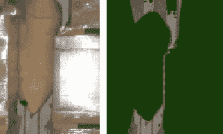

# AI 在物流中的应用：利用计算机视觉优化集装箱装载率

> 原文：[`towardsdatascience.com/ai-in-logistics-optimizing-container-fill-rate-with-computer-vision-192b89eea242?source=collection_archive---------4-----------------------#2023-12-24`](https://towardsdatascience.com/ai-in-logistics-optimizing-container-fill-rate-with-computer-vision-192b89eea242?source=collection_archive---------4-----------------------#2023-12-24)

## 利用 AI 实现更智能的物流管理，并从数据驱动的角度提升集装箱利用率，最大化效率和投资回报率

[](https://jonathanlawhh.medium.com/?source=post_page-----192b89eea242--------------------------------)[](https://towardsdatascience.com/?source=post_page-----192b89eea242--------------------------------) [Jonathan Law](https://jonathanlawhh.medium.com/?source=post_page-----192b89eea242--------------------------------)

·

[关注](https://medium.com/m/signin?actionUrl=https%3A%2F%2Fmedium.com%2F_%2Fsubscribe%2Fuser%2F8d14b4b30a02&operation=register&redirect=https%3A%2F%2Ftowardsdatascience.com%2Fai-in-logistics-optimizing-container-fill-rate-with-computer-vision-192b89eea242&user=Jonathan+Law&userId=8d14b4b30a02&source=post_page-8d14b4b30a02----192b89eea242---------------------post_header-----------) 发表在 [Towards Data Science](https://towardsdatascience.com/?source=post_page-----192b89eea242--------------------------------) ·8 min read·2023 年 12 月 24 日

--

[](https://medium.com/m/signin?actionUrl=https%3A%2F%2Fmedium.com%2F_%2Fbookmark%2Fp%2F192b89eea242&operation=register&redirect=https%3A%2F%2Ftowardsdatascience.com%2Fai-in-logistics-optimizing-container-fill-rate-with-computer-vision-192b89eea242&source=-----192b89eea242---------------------bookmark_footer-----------)

图片由 [Elevate](https://unsplash.com/@elevatebeer?utm_source=medium&utm_medium=referral) 提供，发布在 [Unsplash](https://unsplash.com/?utm_source=medium&utm_medium=referral)

物流中最明显的低效之一就是空闲空间的问题。集装箱，全球贸易的命脉，往往部分填充，浪费了宝贵的空间和资源。这种低效导致运营成本增加，损害了业务和环境的可持续性。

**运输成本增加**

承运商根据集装箱的尺寸来收取费用，而不是根据其装载的货物量。这意味着即使是部分填充的集装箱，费用也与完全填满的集装箱相同。举个例子，根据[Statista](https://www.statista.com/statistics/1314913/ap-moeller-maersk-container-freight-rates/)（2018–2023）报道，A.P. Moller — Maersk 在 Covid-19 大流行期间，运费显著上涨。因此，运输部分填充的集装箱实际上就是在为空余空间付费，而不是有价值的货物，这影响了你的投资回报率。

**供应链碳足迹增加**

将原本可以放入一个容器的负载分开运输意味着需要双倍的运输手段。

**货物损坏增加**

空间增大使得货物不再紧密堆积。这使得箱子、托盘和货物在运输过程中，特别是由于振动和突然停车，能够更自由地移动。


作者提供的图片

为了在集装箱密封并发货之前帮助识别这一根本问题，开发了一种[集装箱填充率分析仪](https://github.com/jonathanlawhh/container-fill-rate-ai)，该分析仪使用计算机视觉和人工智能（AI）来了解每层托盘在集装箱中的填充率。集装箱的填充率是指可用空间中被货物占据的百分比。

借助 AI 的计算机视觉技术，可以消除人工判断每张图像的填充率的任务，并将重点放在解决实际问题上。

[集装箱填充率 AI Github 代码](https://github.com/jonathanlawhh/container-fill-rate-ai)

# 门户

+   方法

+   SAM 自动掩码生成

+   基于提示的分割

+   结果

+   限制

+   关闭

# 方法

解决这一挑战的方法有很多。一种方法是使用[单次检测器](https://www.tensorflow.org/lite/examples/object_detection/overview)（SSD）或[你只看一次](https://pjreddie.com/darknet/yolo/)（YOLO）模型来检测托盘，然后从中计算填充率。Arcgic 在其文档页面[这里](https://developers.arcgis.com/python/guide/how-ssd-works/)详细解释了 SSD 的工作原理。

然而，目的是测试 Meta 的[Segment Anything Model](https://github.com/facebookresearch/segment-anything/tree/main) (SAM)在这个特定用例中的表现。在 Meta AI 博客[这里](https://ai.meta.com/blog/segment-anything-foundation-model-image-segmentation/)中，Meta 分享了一个演示平台以及 SAM 的功能概述。这个方法当然不如为这个特定任务训练模型那样领域特定，但通用模型已经取得了长足的进步，值得测试这种任务的可行性。

SAM 非常多才多艺，提供了两种检测方法，一种是自动掩码生成，它会分割图像上的所有内容，另一种是基于提示的分割，其中图像上的坐标引导分割。Meta 在[这里](https://ai.meta.com/blog/segment-anything-foundation-model-image-segmentation/)分享了 SAM 构建的详细帖子。

## SAM 自动掩码生成

```py
# Initialize Segement Anything and pass in the image for auto mask generation
mask_generator = SamAutomaticMaskGenerator(sam)
masks = mask_generator.generate(input_layer_img)
```

这种方法效果很好，只需 2 行 Python 代码即可轻松设置，所有内容都会在图像中被分割，无需任何指令。


异物分割（作者提供的图像）

然而，挑战在于决定奇怪大小的托盘或异物是否属于该层。在上图中，气囊、一些填充包装物和纸板被分割出来，看起来像是一个托盘。


多重分割（作者提供的图像）

有时，由于带子或松散的包装，这些也会被分割出来，如上图所示。

## 基于提示的分割

基于提示的分割需要提示来指导 SAM 了解焦点区域的位置和方式。与自动掩码生成方法相比，基于提示的分割方法对该项目更为可行。

以下是程序执行流程的伪代码和代码片段。

```py
# Read the input image
input_layer_img: np.ndarray = cv2.imread(img_fp)

# Downscale image for performance
input_layer_img = downscale(input_layer_img)

# First, find all the labels in the image
# The label position can help prompt SAM to generate segments better
label_points: list[list[int, int]] = pallet_label_detector(input_layer_img)

# Send the labels position to SAM and get a segment mask
segmented_mask: np.ndarray = prompt_segment(label_points, input_layer_img)

# Draw on the original image with values from the mask
segment_color = np.random.random(3) * 100

segmented_img = input_layer_img.copy()
segmented_img[segmented_mask] = segment_color
mask = cv2.inRange(segmented_img, segment_color - 10, segment_color + 10)

# Based on the segmented image, find the fill rate
fill_rate: float = fill_rate_calculation(label_points, mask, segmented_img)
```

在这种情况下，可以将每个标签在托盘上的坐标传递给 SAM 进行分割。标签提取可以使用计算机视觉技术完成，例如定义感兴趣区域、颜色过滤和轮廓。这个过程是业务领域特定的，但通常大多数标签接近白色。

更准确的标签检测方式是扫描[序列运输容器代码](https://www.gs1us.org/resources/data-hub-help-center/about-the-serial-shipping-container-code-sscc#:~:text=The%20Serial%20Shipping%20Container%20Code%20%28SSCC%29%20is%20an%2018%2D,units%20through%20the%20supply%20chain.) (SSCC) 条形码，但图像质量不足以检测条形码。

```py
lower_val = np.array([150, 150, 150], dtype=np.uint8)
upper_val = np.array([255, 255, 255], dtype=np.uint8)

# preparing the mask to overlay
mask = cv2.inRange(layer_img, lower_val, upper_val)

# find contours
contours = cv2.findContours(thresh, cv2.RETR_EXTERNAL, cv2.CHAIN_APPROX_SIMPLE)[0]

new_mask = np.ones(img.shape[:2], dtype="uint8") * 255
prompt_points = []

for c in contours:
    x, y, w, h = cv2.boundingRect(c)

    # only select points in our region of interest
    if is_outside_roi(layer_img, x, y):
        continue

    if w * h < 1000:
        continue

    cv2.rectangle(new_mask, (x, y), (x + w, y + h), (0, 0, 255), -1)

    # We calculate the center of the label to be passed for prompting
    prompt_points.append([int(x + (w / 2)), int(y + (h / 2))])

res_final = cv2.bitwise_and(layer_img, layer_img, mask=cv2.bitwise_not(new_mask))
cv2.imshow("Labels only", res_final)
```

对输入图像应用 150 到 255 之间的颜色滤镜，如上面的 Python 代码所示，掩码从输入图像中提取。


选择标签的 res_final 输出（作者提供的图像）

提示标签位置将使 SAM 产生更具领域聚焦的结果。尽管提取的标签尺寸不完全准确，但估计足以让提示分割所需部分。

```py
# prompt_points contains the coordinates of the labels
# [ [x, y], [x, y]...]
input_point_nd = np.array(prompt_points, dtype=np.int32)

# As all the prompt points are labels, we are giving them a category of 1
input_label = np.ones(len(prompt_points), dtype=np.int32)

predictor.set_image(segment_img)
masks, scores, _ = predictor.predict(
    point_coords=input_point_nd,
    point_labels=input_label,
    multimask_output=False,
)
```


另一张图片的 SAM 输出（图片来源于作者）

分割输出如上图所示。采用了一种简单的方法来计算容器的边界，如红色框所示。随后，图像被转换为黑白图像以进行填充率计算。


填充率使用输出（图片来源于作者）

```py
# Sum of white pixels
total_white = np.sum(fill_rate_used[tallest:ch, cx: cw] == 255)

# Sum of black pixels
total_black = np.sum(fill_rate_used[tallest:ch, cx: cw] == 0)

# Percentage of white
fill_rate = round(total_white / (total_white + total_black), 2)
```

估计的填充率将是占用的彩色空间与未占用空间（即容器边界中的黑色像素）的比较。可以应用少量形态学操作，如膨胀，以填补箱子之间的间隙。

# 结果


样本结果（图片来源于作者）

根据个人环境中的当前测试案例，结果接近现实。这显著减少了分析每个容器填充率的人工工作量，并且填充率百分比的判断更加一致。考虑到标签会被检测到，奇形 pallets 也被纳入考量，同时由于标签坐标的提示，减少了不必要的分割。

利用每层加载的结果，公司现在可以分析部分装载的原因，并决定是否存在操作或计划过程中的缺口。在操作上，决定在运输前封闭容器时，也可以将填充率指标作为一个因素。

通过跟踪结果的时间推移，可以建立一个可视化趋势，以查看加载过程是否有所改善。

# 限制

**Pallets 层**


分层检测（图片来源于作者）

其中一个限制是，如果颜色过于接近，后面的 pallets 有时会与前面的 pallets 被分割在一起。这会导致填充率的错误计算，因为实际情况是隔间被认为是空的。为克服这些限制，基于提示的分割可能不理想，但可以结合自动掩膜生成和标签检测。

**异物**



气囊误检测（图片来源于作者）

另一个挑战是气囊的分割。在某些情况下，气囊与 pallets 融为一体，导致分割被归为一组。


最近箱体检测（图片来源于作者）

克服这种限制的一种选择是尽可能绘制框，去除奇形分割。然而，这对奇形 pallets 又带来了另一挑战，比如非折叠椅子的 pallets。

# 结论

通过使用计算机视觉，公司中的团队和同事可以做出数据驱动的决策，而无需麻烦地手动分析单独的图像。

这个项目有很多扩展的方式。其中一些包括：

+   装载卡车甚至小型货车（最后一公里配送）

+   实时估计/从视频中分析装船结束情况

+   将填充率转化为货币价值和潜在的立方米（m³）损失

+   基于填充率阈值计算货物损坏的概率

确保良好输出的最大因素是拥有一致且标准化的输入图像或流。这将大大改善容器高度估计和托盘放置检测。最理想的方式是检测 SSCC 条形码，并利用条形码的位置来提示分割，然而这会需要更昂贵的摄像头。

每个人都可以根据[container-fill-rate-ai Github](https://github.com/jonathanlawhh/container-fill-rate-ai)的代码进行适配，遵循[Meta SAM Apache License](https://github.com/facebookresearch/segment-anything/blob/main/LICENSE)。这个项目并不完美，还有很多改进空间。

为自己的业务/用例扩展这个项目可能需要理解代码并调整 Python 文件中的参数。更重要的是，在进入代码之前，了解业务流程的领域知识是必不可少的。这将帮助你理解如何将代码适配到业务中。

要了解更多关于这个项目的信息，请随时联系：

网站：[`jonathanlawhh.com/`](https://jonathanlawhh.com/)

邮箱：jon_law98@hotmail.com
