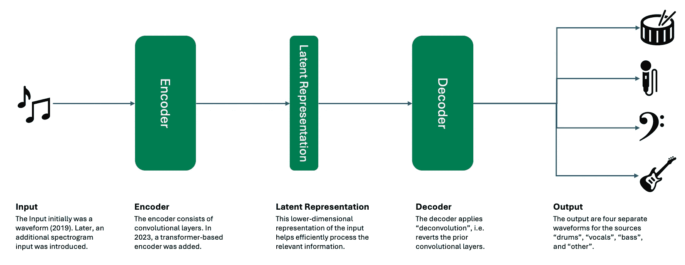

# AI 音乐源分离：如何运作以及为何如此困难

> 原文：[`towardsdatascience.com/ai-music-source-separation-how-it-works-and-why-it-is-so-hard-187852e54752`](https://towardsdatascience.com/ai-music-source-separation-how-it-works-and-why-it-is-so-hard-187852e54752)

## 源分离 AI 的解释

 [Max Hilsdorf](https://medium.com/@maxhilsdorf?source=post_page-----187852e54752--------------------------------)

·发表于[Towards Data Science](https://towardsdatascience.com/?source=post_page-----187852e54752--------------------------------) ·阅读时间 9 分钟·2023 年 9 月 21 日

--

图片由作者提供。

# 源分离

## 什么是源分离？

在信号处理领域，源分离描述了将音频信号拆分成多个源音频信号的任务。这个概念不仅适用于音乐，也适用于语音或机器声音。例如，您可能希望将播客中两个说话者的声音分开，以便可以分别编辑这些声音。

## 为什么源分离如此困难？

不是每个人都是音乐家。真正对数据和 AI 有兴趣的音乐家更少。通常，当我与非音乐家交谈时，我觉得他们认为你可以简单地“把声音从音频中去除”。这很合理，因为否则为什么专辑的 B 面会有伴奏，或者为什么在每个酒吧都有数以千计的流行歌曲的卡拉 OK 版本呢？事实上，分离人声和伴奏实际上非常简单——当你可以访问混音的单独轨道时… 

然而，在现实世界中，我们只有波形。波形是我们能够最接近真实物理音频事件的计算机表示。波形也是将数字音频转回真实声音的前提，例如通过扬声器。这意味着如果你想将一段音乐分离成两个源（人声和乐器），你需要找到一种方法，将组合波形拆分成两个独立的波形，每个波形准确且独占地捕捉一个源。

为了突出这一点，您可以在下面的图中找到三个波形。第一个代表吉他，第二个捕捉到吉他伴奏上的人声。第三个波形是吉他和人声的组合，即整首歌曲。

吉他和人声的波形。图片由作者提供。

对于我这个曲目的制作人来说，提供你们人声和乐器的音频是一个微不足道的任务，因为我可以简单地把这两者的原始录音发给你。然而，作为他人创作的音乐的消费者，我们只能接触到合成的波形。这使得提取过程异常困难，因为没有人能够确切说明我们需要对这个波形做什么才能提取出原始音源。每个音乐音符都由多个在不同频率下振荡的声波组成。这意味着，当我们弹奏吉他的六根弦并在其上演唱旋律时，吉他和人声之间的声波重叠，使得几乎不可能重建原始信号。

## 深度学习如何提供帮助

由于多个音频源的合成波形非常复杂，至今还没有研究团队提出明确的规则集来使计算机重新分离它们。然而，这正是深度学习发挥作用的地方。深度学习是一种机器学习技术，允许计算机从大量数据中学习，以检测高度复杂数据（如文本、图像或音频）中的相关模式，然后用这些模式来进行预测或解决创造性任务。

深度学习在音乐 AI 领域已经使用了超过 10 年。你能否准确描述“摇滚”和“金属”有什么不同，使这些规则能构成一个准确的音乐类型分类器？不能？我也不能。然而，如果我们将 1 万首摇滚曲目和 1 万首金属曲目输入深度学习模型，它将为我们完成这个模式识别任务，并轻松解决问题。不幸的是，这听起来比实际操作要简单得多。

为了教导一个深度学习模型从一段音乐中分离乐器和人声，我们需要一个包含数万首曲目的大数据集（或更多），所有曲目都需要有原始音频源（即乐器和人声）作为独立的波形数据。至今，收集这样一个庞大的数据集仍然是一个巨大的挑战。然而，事实证明，我们可以应用一些技巧来解决这个问题，即使没有这样一个大数据集。这就是 DEMUCS 发挥作用的地方。

# 源分离的工作原理

## DEMUCS — 一个可靠的源分离模型

由于源分离是一个活跃的研究领域，存在几种不同的技术方法。在这篇文章中，我将重点介绍最著名的源分离框架之一：DEMUCS。DEMUCS 于 2019 年首次提出**[1,2]**，并在随后的几年中逐步改进**[3,4]**。这使得它成为一个很好的示例，因为它允许我们首先查看 AI 模型的基本架构和用于训练它的方法，然后再阐述导致研究人员更新 DEMUCS 的趋势和进展。

## DEMUCS 是基于哪个数据集训练的？

为了训练深度学习模型，我们通常需要一个*真实标签*。对于源分离，这意味着我们需要大量的曲目以及它们各自的乐器来源。对于 DEMUCS，作者使用了流行的 MusDB 数据集，其中包含 150 首以 44.1k Hz 采样的歌曲，每首歌曲都有单独的“鼓”、“贝斯”、“人声”和“其他”波形。此外，作者还收集了 150 首更多的乐器来源的曲目，这些曲目很可能来自他们的个人音乐项目（或朋友）。

然而，由于生成音乐模型如 MusicLM 或 MusicGen 是在**数千小时的音乐**上训练的，300 首曲目显然不足以在源分离上取得突破。不幸的是，这就是他们能够获得的所有数据。这就是为什么作者决定使用一些技巧，以充分利用现有资源。

## 数据集是如何增强的？

小数据集的问题在于模型无法学习到它在现实世界中会遇到的输入的多样性。300 首歌曲真的能反映人们在 DEMUCS 发布后会使用的所有类型的音乐吗？不能。缓解数据集偏差的常用技术是执行数据增强技术。这意味着对现有曲目进行轻微的信号处理，以便它们听起来不同，同时保持其核心特征。

在原始 DEMUCS 研究中，作者使用了不同的技术组合，如音高移位、时间拉伸/加速或改变单个乐器来源的音量。这样，就能覆盖更广泛的声音范围，而不会引入完全不合理的数据。这就是我们称这些方法为**自然数据增强**的原因。

然而，在他们 2021 年的后续研究**[3]**中，作者在数据增强方面更进一步。这时，他们开始将不同曲目的乐器来源组合起来，制作全新的歌曲。为了确保一定程度的音乐真实性，他们在将“外来”乐器来源放入现有曲目之前，进行了音高移位、起始点检测和节奏调整。虽然这不是一种自然数据增强形式，但作者通过这种技术在之前的工作基础上取得了改进。

如果数据增强对你有趣，你可能会喜欢我几个月前写的这篇博客：

 ## 使用 Spotify 的 Pedalboard 进行自然音频数据增强

### 提供现成的 Python 代码和预设

[towardsdatascience.com

## DEMUCS 是什么样的 AI 模型？

DEMUCS 的高级模型架构。作者提供的图像。

所有版本的 DEMUCS 都基于一个**编码器-解码器神经网络**。在上图中，你可以看到这种神经网络的基本结构。本质上，**编码器**接收音轨作为输入，并将其转换为我们称之为**潜在表示**（或嵌入）**。** 潜在表示的目的是简单地减少输入音轨的大小。由于一个波形需要数万个数字来存储和处理每秒的音频，因此计算机处理起来很困难。潜在表示具有较低的维度，从而降低了复杂性，同时（希望）保留了所有相关的信息，如乐器、音高、和声、节奏和音色。利用这些压缩的信息，**解码器**为每个乐器源（低音、鼓、声乐和其他）生成新的波形。

**针对技术人员的更技术性描述：** 前三个版本的 DEMUCS 基于 Wave-U-Net（2018）**[5]**，而 Wave-U-Net 本身则基于著名的 U-Net（2015）**[6]**架构。这个网络本质上是一个基于卷积和反卷积的编码器-解码器模型。在 2021 年**[3]**，DEMUCS 通过使用两个神经网络进行了改进，一个处理音轨的波形，另一个处理其声谱图，然后将这两个网络结合以完成最终的源分离步骤。DEMUCS 的最新版本**[4]**用一个变换器编码器层替代了 Wave-U-Net 中的一些卷积层。

## DEMUCS 的效果如何？

你可以在这个 HuggingFace 空间上自己试用：[`huggingface.co/spaces/akhaliq/demucs`](https://huggingface.co/spaces/akhaliq/demucs)

不幸的是，这个在线演示有点慢。如果你是编码员，我建议你通过这个[GitHub 仓库](https://github.com/facebookresearch/demucs)在本地运行 DEMUCS。

（最后检查时间：2023 年 9 月 16 日。如果有任何链接无法使用，请告知我！）

# 其他方法

与任何技术一样，重要的是指出 DEMUCS 建立在前人的基础上，他们完成了 DEMUCS 可以构建的所有基础工作——从数据集到评估标准，再到模型架构。此外，其他研究人员最近提出了创造性的方法，提供了源分离的新视角。

在 2023 年 8 月，一篇名为“Separate Anything You Describe”**[7]**的论文引起了音乐 AI 社区的兴奋。这篇论文实现了一个完全基于文本的源分离工具，可以通过自然语言进行查询，并适用于各种音频：语音、声音或音乐。这是通过将源分离过程连接到 AI 模型 CLAP 来实现的，该模型允许你用词汇捕捉声音的意义，反之亦然。

这种方法看起来很有前景，因为当前源分离系统的一个关键限制是它们被绑定到特定的输出结构。例如，DEMUCS 只能将音轨分离为“低音”、“人声”、“鼓”和“其他”。从多乐器混合中提取吉他或钢琴是不可能的。通过自然语言查询，你只需告诉模型从混音中提取“钢琴”、“竖琴”或“背景中的那个有趣的声音”。

另一方面，提取的音源质量仍然低于像 DEMUCS 这样的传统源分离系统。这意味着目前你在质量和灵活性之间进行权衡。因此，一个专门针对特定、常用乐器但又能保持对自然语言查询灵活的混合系统可能是值得期望的。

# 结论

> 源分离并非易事，因为以受控和可靠的方式分离一组复杂的声学波形是困难的。通过像 DEMUCS 这样的深度学习方法，近年来我们见证了越来越多能力强大的 AI 模型。此外，自然语言查询已经进入该领域，并可能进一步提高 AI 源分离工具的实用性。

我经常写关于 AI 和音乐的文章。以下是一些你可能也会喜欢的文章：

+   [通过源分离使音乐标记 AI 可解释](https://medium.com/towards-data-science/making-music-tagging-ai-explainable-through-source-separation-2d9493547a7e)

+   Meta 的 AI 如何基于参考旋律生成音乐

+   谷歌如何利用虚假数据集训练生成音乐 AI+

另外，可以考虑在 [Medium](https://medium.com/@maxhilsdorf) 上关注我以获取更多文章，并在 [LinkedIn](https://www.linkedin.com/in/max-hilsdorf/) 上关注我以获取有关 AI 和音乐的最新动态。

# 参考文献

**[1] Défossez 等 (2019)**。Demucs：使用额外未标记数据混合的深度音乐源提取器。 [`arxiv.org/abs/1909.01174`](https://arxiv.org/abs/1909.01174)

**[2] Défossez 等 (2019)**。波形域中的音乐源分离。 [`arxiv.org/abs/1911.13254`](https://arxiv.org/abs/1911.13254)

**[3] Défossez (2021)**。混合频谱图和波形源分离。 [`arxiv.org/abs/2111.03600`](https://arxiv.org/abs/2111.03600)

**[4] Rouard, Massa & Défossez (2023)**。用于音乐源分离的混合变换器。 [`arxiv.org/abs/2211.08553`](https://arxiv.org/abs/2211.08553)

**[5] Stoller, Evert, Dickson (2018)**。Wave-U-Net：用于端到端音频源分离的多尺度神经网络。 [`arxiv.org/abs/1806.03185`](https://arxiv.org/abs/1806.03185)

**[6] Ronneberger, Fischer, Brocks（2015）**. U-Net：用于生物医学图像分割的卷积网络。 [`arxiv.org/abs/1505.04597`](https://arxiv.org/abs/1505.04597)

**[7] 刘等人（2023）**. 分离你描述的任何事物。 [`arxiv.org/abs/2308.05037`](https://arxiv.org/abs/2308.05037)
