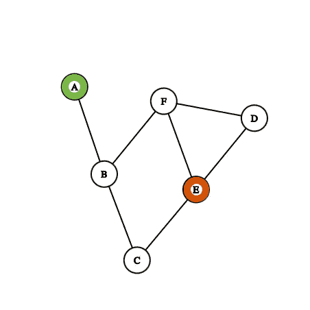
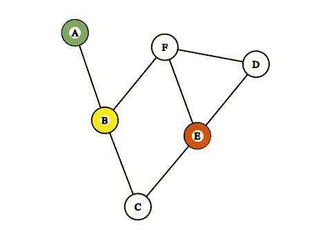
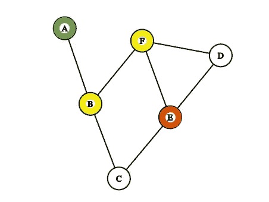
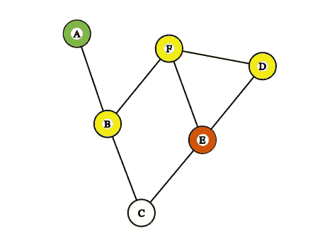
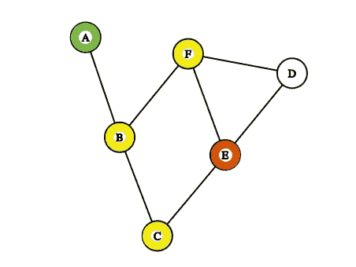
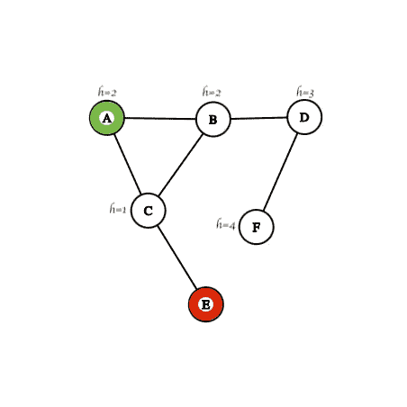
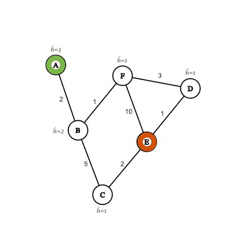
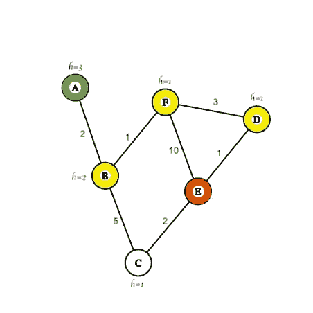

# 人工智能搜索算法：深入了解最受欢迎的算法

> 原文：[`towardsdatascience.com/ai-search-algorithms-a-deep-dive-into-the-most-popular-ones-2760679368bb`](https://towardsdatascience.com/ai-search-algorithms-a-deep-dive-into-the-most-popular-ones-2760679368bb)

## 介绍四种最常用的人工智能搜索算法

[](https://polmarin.medium.com/?source=post_page-----2760679368bb--------------------------------)[](https://towardsdatascience.com/?source=post_page-----2760679368bb--------------------------------) [Pol Marin](https://polmarin.medium.com/?source=post_page-----2760679368bb--------------------------------)

·发布于 [Towards Data Science](https://towardsdatascience.com/?source=post_page-----2760679368bb--------------------------------) ·阅读时间 11 分钟·2023 年 8 月 23 日

--


由 [Mitchell Luo](https://unsplash.com/@mitchel3uo?utm_source=medium&utm_medium=referral) 在 [Unsplash](https://unsplash.com/?utm_source=medium&utm_medium=referral) 提供的照片

就好像地球上人类还不够一样，我们已经尝试了多年创造行为类似于我们的机器。我们创建数学模型或代理，行为理性，以便我们不必依赖其他人的决策。

搜索算法曾经是最常用的，但随着机器学习和深度学习的兴起，它们的使用有所减少。然而，我认为所有的数据科学家都应该了解它们，因为它们是一个极其有用的工具集，在许多情况下都能发挥作用。

这些算法可以应用于许多情况，但最具代表性的是游戏：井字棋、迷宫、甚至国际象棋……我们将用这些来解释今天将要讨论的算法。

我们将介绍四种最著名的搜索算法，并将通过一些实用和直观的例子对它们进行详细讲解。

和往常一样，请参阅本文底部的 **资源** 部分以获取更多信息和代码。

但在此之前，我们需要介绍一些定义，以便理解一些关键术语。

## 术语

+   **代理**：它是与环境互动的人、模型或算法。

+   **状态**：在特定时刻表示问题的环境或元素集合。

+   **状态空间**：所有可能到达的状态的集合。

+   **目标状态**：最终状态，满足特定条件的状态。

+   **动作**：代理在给定状态下必须做出的功能或决策，以便转移到下一个状态。

我们可以定义更多术语，但这些是最基本的术语，足以涵盖今天的主题。

## 表示

人工智能搜索算法通常使用图来解释，今天我们不会改变现状。

这里是一个示例图：



我们将用来解释概念的示例图——作者提供的图像

在图中，每个节点是一个状态。我们总是有**初始状态**（在这个例子中是 A，绿色）和**目标状态**（我决定是 E，红色）。正是通过我们在前一节中定义的**动作**，我们的代理才能从一个状态移动到下一个状态，并反复执行，直到达到目标状态。

从 A 到 F 的所有节点定义了**状态空间**。

那么不同之处在于我们从 A 到 E 的算法。这就是我们接下来要开始探索的内容。

## 深度优先搜索

深度优先搜索（DFS）[1] 算法是**非信息型搜索算法**之一，其中我们只有在问题定义中提供的信息。

换句话说，在一个非信息型搜索算法中，我们知道我们想要去哪里——我们想达到目标状态 E——但我们不知道距离目标有多近或多远。

深度优先搜索特别是不断向前移动，直到到达叶节点。在每个可能遇到的分叉点，它随机选择一个方向并继续前进。

如果我们到达的叶节点是目标状态，那我们就完成了。但如果不是，那它会再次上升到最后的分叉点，并继续向前移动。这个过程会递归重复，直到我们到达目标状态。

现在我们来看看：



第一个应用的动作——作者提供的图像

从初始状态 A，我们只能移动到 B。因此，在动作发生后，我们的代理将处于那个第二个状态。然后到达分叉点，我们需要做出选择。由于 DFS 是一个非信息型算法，它会随机选择，因为我们不知道哪个是最佳选择。假设它选择了 F 而不是 C。



DFS 第二次决策——作者提供的图像

由于算法被训练为深入探索，直到探索其他分支，它将不得不再次在 D 和 E 之间做出决定。如果它选择了 E，那我们就完成了。但这次我们运气不好，它随机选择了 D。



可能的 DFS 实现——作者提供的图像

此时，算法已经访问了 A、B、F 和 D。处于 D 时，只剩一个方向，它将我们带到 E。在那里，我们就完成了。

这个算法在多个情况下简单有效。它遵循先进后出的策略，这就是为什么可以使用栈来实现它。

在我们的例子中，最优解决方案将我们从 A 到 E 需要 3 步，但这并不保证。事实上，我们遵循的例子用了 4 个动作。

## 广度优先搜索

广度优先搜索（BFS）[2] 是另一种无信息搜索算法，我们可以说它是深度优先搜索（DFS）的对立面：它不会在探测到前一层所有节点之前进入下一层深度。

当我们在 DFS 中使用栈时，这里我们使用队列：它遵循先进先出策略。

再次，让我们通过图形可视化来看。它从 A 到 B，如我们之前所见，我们没有其他选择。然后我们到达 B 的分叉点，由于这是一个无信息算法，我们只是随机选择 C 和 F 之间的一个。我们基本上会探索两个，只是探测的顺序不同而已。



BFS 的第二步：我们已经探索了 A、B、C 和 F——图片由作者提供

我们已经探索了第 1 层（节点 A），第 2 层（节点 B），和第 3 层（节点 C 和 F）。现在我们进入第 4 层，探索最终的叶子节点——E 和 D。

再次，无论我们是先探索 E 还是 D，这完全是一个任意的决定：

+   如果 C 在 B 的分叉点先被探索，那么我们将紧接着到达 E。

+   但如果 F 先被探索，那么会随机决定是先探索 D 还是 E。

BFS 和 DFS 都有其潜力，但两者都有缺陷。一个在某些情况下会表现最好，但在其他情况下则效率低下。这些是简单的算法，虽然仍然有用，但我们应当寻求更多。

## 贪婪最佳优先搜索

这是我们今天要介绍的第一个**有信息搜索算法**。在这种算法中，我们确实有关于目标状态的信息，我们的任务是利用这些信息在每一步之前做出明智的选择。我们将*启发式*定义为这段信息，它告诉我们离目标有多近或多远。

**贪婪最佳优先搜索**（GBFS）[3] 算法很简单：我们只是朝向那些使我们更接近目标节点的节点移动，而启发式 *h(x)* 是衡量接近度的。

在典型的迷宫游戏中，接近度可以通过我们与目标之间的像素/瓦片距离来表达，无论是垂直方向还是水平方向。

假设一个例子，我们想从 A 到 B，并且已经玩到了一个棘手的决策点。如果我们使用 BFS 或 DFS，选择将是随机的。但我们现在使用的是有信息的算法。

查看以下迷宫，每个瓦片上都有一个数字，定义了我们距离目标的瓦片数量。换句话说，启发式定义了从当前瓦片到目标所需的步数，假设迷宫没有墙壁，我们只能水平或垂直移动：


带有接近度启发式值的样本迷宫——图片由作者提供

如果我们使用 GBFS，我们使用的接近启发式建议我们向上移动，因为如果我们向上移动，到达 B 所需的步骤从 2 减少到 1，而如果我们向下移动，则从 2 增加到 3。换句话说，如果我们向上移动，我们离目标更近，而如果我们向下移动，我们则离目标更远。

这并不完美，因为我们只是考虑了离 B 的距离，而没有考虑到我们与目标状态之间的实际障碍。这是 GBFS 无法控制的。

为了保持一致性，让我回到我们一直使用的图形表示，只不过这次会是全新的图。我们仍然想从 A 到 E，但如我们所知，我们现在有关于每个节点的更多信息，了解我们离最终状态的距离。

我们将使用字母 h 来提供启发式的虚拟值。



带有启发式的示例图 — 图片由作者提供

提出的示例与迷宫的工作方式相同：从一个状态移动到另一个状态的每一个动作要么使我们离目标更近一单位，要么使我们更远一单位，或者让我们保持不变。最优路径是明确的：从 A 到 C 再到 E。如果有分叉点，那就朝着 *h(x)* 较小的节点移动。

但情况可能会有所不同。想象一下，如果启发式不仅仅依赖于节点之间最大差异的单位，而是依赖于多个环境因素。如果是这样的话，在我们的例子中最优路径不会改变，因为它非常简单，但在更复杂的图中情况会完全不同。

贪婪最佳优先搜索是一种强大的算法，但它并不完美。虽然它考虑了我们离目标有多近，但它没有考虑到到达这一点的实际费用。

信不信由你，到达一个状态或节点的成本和贪婪搜索的成本同样重要。

为下一个算法做好准备。

## A* 搜索

**A* 搜索算法**[4] 是 GBFS 算法的一种变体，但如前所述，我们考虑了到达每个节点的成本。换句话说，通过不同的边进行遍历可能会有不同的成本。

我们将定义：

+   **前向成本** — *h(x)*。这是 GBFS 中使用的相同启发式：当前状态与目标状态之间的距离。

+   **后向成本** — g(x)。这是从初始状态到当前状态的成本。它是一个累积成本，意思是它将所有之前的成本加起来。

A* 搜索的目标是找到一种路径，使得两种费用的总和最小。用数学术语来说，节点 *x* 的总成本为 ***f(x) = g(x) + h(x)。***

为了说明这一点，我将使用我们已经使用过的初始图。我们仍然想从 A 到 E，现在的费用如下所示：



新图以执行 A* 搜索 — 图片由作者提供

花一点时间思考一下这里可能的**最佳路径**。节点周围的数字是前向成本，靠近线条的数字是后向成本。

现在让我们一步一步解码：

1.  我们别无选择，只能从 A 到 B。到达 B 的成本是 *f(B) = 2 + 2 = 4*。

1.  从 B 开始，我们可以选择去 C 或 F。这里我们暂停并检查哪一个更低。我们看到 *f(C) = 7 + 1 = 8* 和 *f(F) = 3+1 = 4*。然后，我们确定**F**是最佳方案。

1.  从 F 开始，我们又有两个选择：我们可以去 E 并达到目标状态，或前往 D。大多数人会选择 E，因为不需要额外的步骤，但我们聪明，我们让数学来做工作：*f(D) = 6+1 = 7* 和 *f(E) = 13+0 = 13*。因此，D 比 E 更好。

    不过，请记住我们在 B 还有一条未走的路径，我们可以前往 C。但从 B 到 C 的成本是 8，仍高于 7，所以我们仍将继续向 F->D 方向移动。

1.  从 D 我们只能去 E（或返回 F，这没有意义）。成本是 *f(E) = 7+0 = 7*。由于它仍然低于 f(C)，所以我们到此为止。

所以最终的**最佳路径**是 A->B->F->D->E。



使用 A*搜索的**最佳路径**— 作者提供的图片

## 结论

把这些知识付诸实践。

我们没有使用任何代码，因为我相信自己动手构建是理解这些算法如何工作的最佳方式。然而，在下面的资源部分你会找到一个我创建的 GitHub 仓库[5]的链接，我在其中实现了今天看到的四种算法中的三种。

我的实现很简单，不是最有效的。提供代码的目的是让你玩转它，并通过将迭代函数改为递归函数、创建更复杂的类等方式改进它。

继续尝试用 DFS、BFS、GBFS 或 A*搜索实现你自己的迷宫解决方案。不要只是复制我的代码，而是将其作为模板使用（你可能会发现一些惊喜）。

要有创造力和资源 fulness，千万不要停下来。尝试其他我们没有覆盖的算法，如 minimax 或 uniform cost search。Google 是你的好帮手。

今天我讲解了这四种算法的基础知识，展示了它们如何通过视觉示例和一系列步骤工作。我使用了简单的示例，但在较大的图上过程是一样的。

关键是，作为数据科学家，要理解这些算法，知道如何使用它们，更重要的是识别它们对我们有用的情况。

搜索算法只是 AI 的一部分，尽管它们已经存在一段时间，但仍然是关键。

继续尝试这些算法吧！

```py
**Thanks for reading the post!** 

I really hope you enjoyed it and found it insightful.

Follow me and subscribe to my mail list for more 
content like this one, it helps a lot!

**@polmarin**
```

如果你想进一步支持我，可以考虑通过下面的链接订阅 Medium 的会员：这不会额外花费你任何费用，但会帮助我完成这个过程。

[](https://medium.com/@polmarin/membership?source=post_page-----2760679368bb--------------------------------) [## 通过我的推荐链接加入 Medium - Pol Marin

### 阅读 Pol Marin 的每一个故事（以及 Medium 上成千上万的其他作家）。你的会员费直接支持 Pol…

medium.com](https://medium.com/@polmarin/membership?source=post_page-----2760679368bb--------------------------------)

## 资源

[1] [深度优先搜索 — 维基百科](https://en.wikipedia.org/wiki/Depth-first_search)

[2] [广度优先搜索 — 维基百科](https://en.wikipedia.org/wiki/Breadth-first_search)

[3] [最佳优先搜索 — 维基百科](https://en.wikipedia.org/wiki/Best-first_search)

[4] [A* 搜索算法 — 维基百科](https://en.wikipedia.org/wiki/A*_search_algorithm)

[5] [AI 搜索算法库 — GitHub](https://github.com/polmarin/ai_search_algorithms)

## 额外资源

+   [AI 中的搜索算法 — Geeks For Geeks](https://www.geeksforgeeks.org/search-algorithms-in-ai/)
