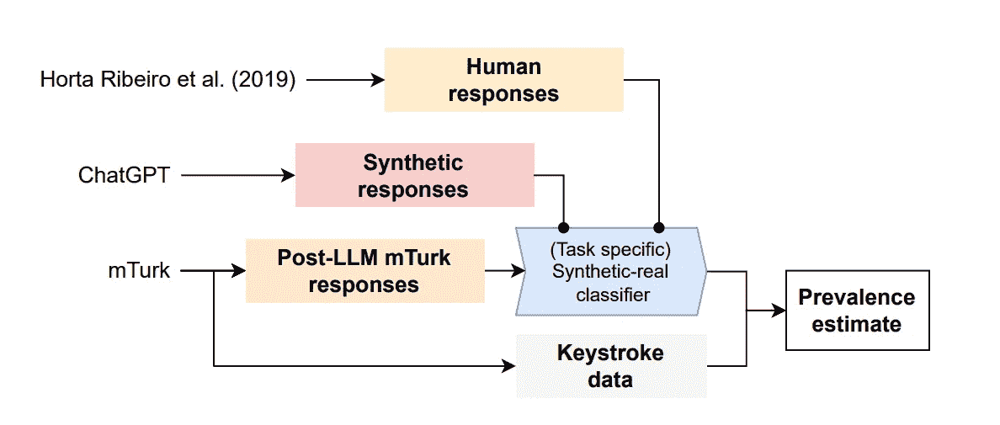
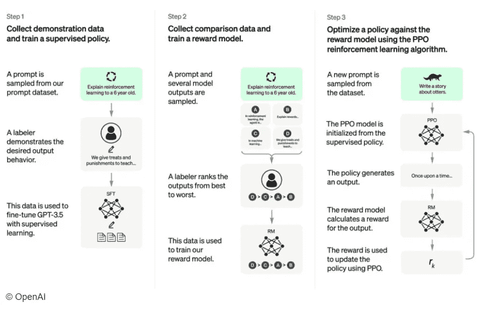
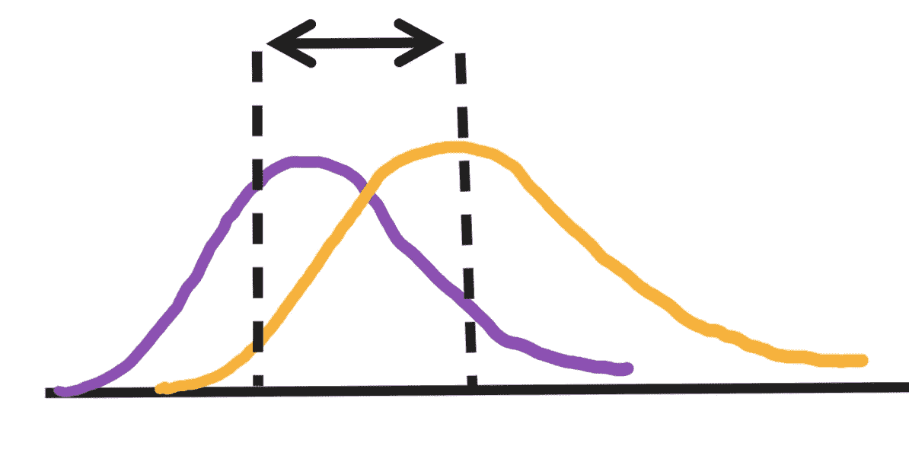
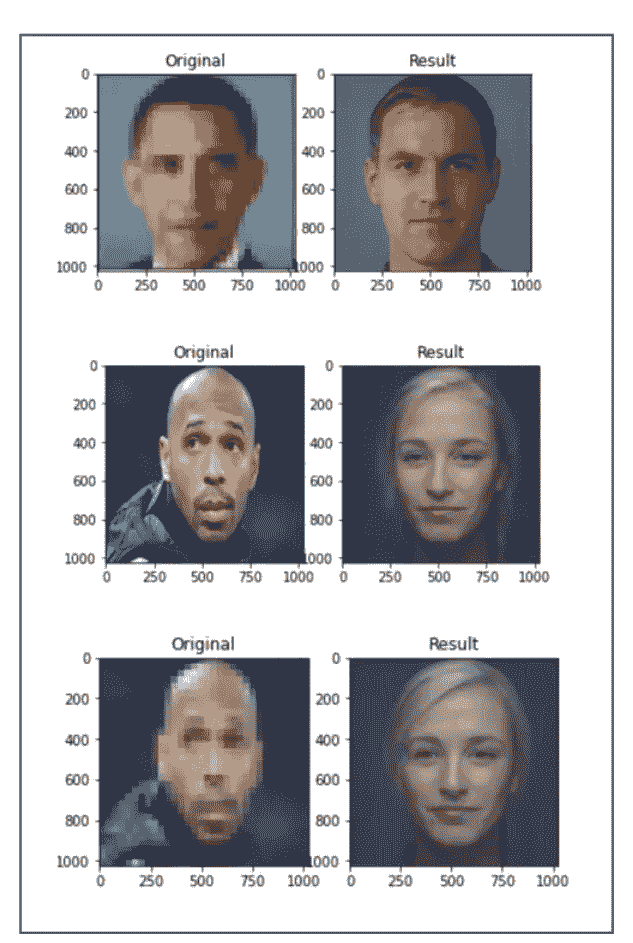
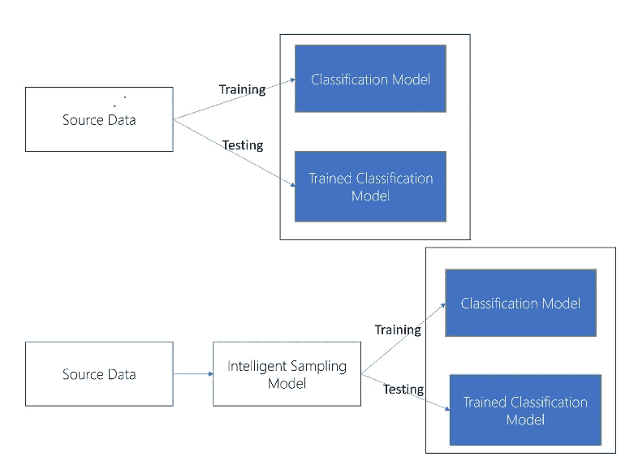

# 人工智能培训外包给人工智能而非人类

> 原文：[`towardsdatascience.com/ai-training-outsourced-to-ai-and-not-humans-4ab616a2a84d`](https://towardsdatascience.com/ai-training-outsourced-to-ai-and-not-humans-4ab616a2a84d)

图片由 [davide ragusa](https://unsplash.com/@davideragusa?utm_source=medium&utm_medium=referral) 提供，来源于 [Unsplash](https://unsplash.com/?utm_source=medium&utm_medium=referral)

## 引入模型进一步错误的风险

 [Mastafa Foufa](https://medium.com/@mastafa.foufa?source=post_page-----4ab616a2a84d--------------------------------)

·发布于 [Towards Data Science](https://towardsdatascience.com/?source=post_page-----4ab616a2a84d--------------------------------) ·11 分钟阅读·2023 年 7 月 18 日

--

> “我们在 Amazon Mechanical Turk 上重新进行了一个文献中的摘要总结任务，通过键击检测和合成文本分类的结合，估计 33%–46%的众包工人在完成任务时使用了 LLM。尽管这一结果是否可以推广到其他不那么友好 LLM 的任务尚不明确，但我们的结果呼吁平台、研究人员和众包工人寻找新的方法来确保人类数据保持人性，也许可以将这里提出的方法作为一个踏脚石。” 引自 [Veselovsky, V., Ribeiro, M.H. 和 West, R.](https://arxiv.org/pdf/2306.07899.pdf)

最近，**瑞士联邦理工学院**（EPFL）的一项研究发现，33%到 46%接受报酬培训 AI 模型的临时工可能正在将他们的工作外包给 AI。[详细信息请见这里。](https://arxiv.org/pdf/2306.07899.pdf)

[MIT 科技评论](https://www.technologyreview.com/2023/06/22/1075405/the-people-paid-to-train-ai-are-outsourcing-their-work-to-ai/) 讨论了这篇研究论文，并解释了那些被支付来培训 AI 的人确实在**将他们的工作外包给 AI**。文章解释了 AI 现在可以用来创建数据集和标签，这些任务传统上是由人类完成的。它还讨论了这一趋势的影响，例如 AI 可能从其他 AI 中学习，从而进一步整合偏见。

**资源**：来自 [Veselovsky, V., Ribeiro, M.H. 和 West, R.](https://arxiv.org/pdf/2306.07899.pdf) 一个模型来区分由人工生成的 mTurks 响应和由 AI 生成的响应。作者使用一个分类器（真实 vs AI 生成）对真实的 MTurk 响应进行分类（工人可能或可能没有依赖于 LLMs），估计 LLM 使用的普及率。

## 我们如何训练 AI 系统？

AI 系统可以被视为机器学习模型。在监督环境下，这些系统需要黄金标准标签来构建高质量的训练数据。这可以在内部完成，特别是在像微软或谷歌这样的科技公司中。然后，对于涉及大型数据集的复杂任务，数据标注也可以外包给通常被期望成为领域专家的供应商。

然而，他们也可以是**在线零工，没有特定的主题专业知识。** 确实，你可以在像 [Mechanical Turk](https://www.mturk.com/) 这样的平台上找到零工，以完成通常难以自动化的任务。

> “**亚马逊** Mechanical Turk (MTurk) 是一个众包市场，使个人和企业更容易将他们的过程和工作外包给可以虚拟执行这些任务的分布式劳动力。这可能包括从进行简单的数据验证和研究到更主观的任务，如调查参与、内容审查等。MTurk 使公司能够利用全球劳动力的集体智慧、技能和见解来优化业务流程、增强数据收集和分析，并加速机器学习开发。” 来自 [`www.mturk.com/`](https://www.mturk.com/)。

了解这可能有害的原因是关键。为此，让我们以 Chat GPT 为例，它利用人类标注员来获得高性能。

## 例如：Chat GPT

Chat GPT 是一个需要大量人工标注员的模型的良好示例。在下图中概述了训练 OpenAI 模型所采取的步骤，我们可以注意到标注员在训练时帮助完善提示的重要性。如果 Chat GPT 本质上是依赖于未标注数据（如维基百科语料库）的另一个大型语言模型，它由于人类标注员在采样提示上展示的期望输出行为而达到独特的性能。这样，基础模型尝试接近由人类标注员自身提供的输出。

> **记住**。Chat GPT 是一个大型语言模型，因为它使用大量文本数据来训练一个神经网络，该网络可以生成对自然语言查询的连贯和多样的响应。语言模型是一个系统，根据单词或符号序列在给定上下文中发生的可能性来分配概率。大型语言模型特别能够捕捉单词之间复杂和长期的依赖关系。

**资源**：来自 [OpenAI](https://openai.com/blog/chatgpt)。

换句话说，其中一个目标函数是减少 AI 输出与人类输出之间的距离。这自然假设标注者掌握了真相。

**资源**：来自**作者**。减少 AI 预测（紫色高斯）与人类预测（橙色高斯）之间的距离。

现在，为了减轻对标注者的依赖问题，我们通常会提供明确的指令来定义“什么是好的”以及“什么是坏的”。

这样的标签很重要，因为 AI 模型本质上是将某些输入数据映射到某些输出数据的数学函数。这包括像 Chat GPT 这样的庞大语言模型，它本质上是根据一系列标记（*输入*）预测下一个标记（*输出*）。

一旦训练数据构建并可用，在有监督的设置中训练一个机器学习模型涉及使用优化算法，例如梯度下降，该算法迭代地更新模型的参数以最小化损失函数。损失函数是一种衡量模型拟合数据的好坏或预测误差的标准。通常，优化算法通过计算损失函数相对于模型参数的梯度来工作，这表明减少损失的变化方向和幅度。然后，算法通过在梯度的相反方向上采取小步更新参数，预计这将降低损失。这个过程重复进行，直到损失达到最小值或满足收敛标准。

换句话说，可以想象在每一步，模型都在预测需要朝着人工标注者的方向发展的事物，直到找到一个局部最优解。

也可以有一个**正则化**机制来**防止模型过拟合数据**。这可以粗略地看作是一种避免模型死记硬背所有数据而无法对新的未见数据进行泛化的方法。将噪声作为训练数据的一部分进行处理是一种添加正则化的方法，相当于在损失函数中增加惩罚项。然而，相对于最接近真实底层数据的部分，噪声的影响应该是微不足道的。

因此，更重要的是定义什么应该接近真实的黄金数据。为此，给标注者的指令同样重要。

为了更好地理解通常给出的指令类型，我们可以参考“计划”，这是由 Open Assistant 设计的，Open Assistant 是 Chat GPT 的一个开源竞争者。根据作者的描述，**OpenAssistant** 是一个**基于聊天的助手**，它能够理解**任务**，与**第三方系统**互动，并**动态检索信息**以完成任务。

设计的[计划](https://github.com/LAION-AI/Open-Assistant)包括受[InstructGPT](https://openai.com/blog/instruction-following/)启发的 3 个关键步骤。

1.  通过众包过程收集高质量的人类生成的指令完成样本（提示+回应），设置排行榜以激励社区，并为顶级贡献者提供奖励。

1.  对每个提示进行多样化的完成样本，并让用户按从最好到最差的顺序对它们进行排名。

1.  使用收集的排名数据训练奖励模型，然后使用提示和奖励模型训练 RLHF。

请注意，即使外包给人类标注者，拥有经过筛选的训练数据也非常具有挑战性。确实，外包需要意识到许多潜在的偏见，特别是当外包是**免费并对任何个人开放**时。

## 风险

> “再次，这应该是众包进行的，例如，我们需要处理**不可靠且可能恶意的用户。** 至少**需要收集多个独立用户的投票以衡量总体一致性。**” [OpenAI Assistant.](https://github.com/LAION-AI/Open-Assistant)

**标注者基础人群的代表性偏见。**

如果标注者都来自相同的人口统计群体、种族、年龄、性别或社会经济地位，他们可能会在训练的模型中带入严重的文化偏见。因此，确保标注者在关键特征如国家、年龄、性别等方面尽可能多样化是关键。

这是大科技公司非常清楚的事情，因此它们现在将其集成到招聘的核心。那些在这些科技公司中构建产品的工程师需要对各种各样的终端用户有更好的了解，包括不同的国籍、性别、年龄、种族等。这样，在构建产品时，特别是在训练 AI 系统时，他们就能确保不是仅从他们自己的视角出发，而是从终端用户的视角出发。然而，鉴于固有的人类偏见，应对这种情况的最佳方法是确保构建产品的工程师的人口代表性与终端用户的代表性相似。

**恶意用户**

之前的方面总体上是无意的，但也可能存在恶意意图。在这种情况下，创建不符合预期的模型的风险更高。协调攻击确实存在，特别是针对大科技公司，它们现在可能在训练阶段发生，对目标 AI 系统造成更大的负面影响。

**尽管有明确的指示，但整体上标签质量差**

如果指令总是与标注者共享，任务与其执行之间可能会出现不一致。例如，在下图中，可以注意到总结文本的指令。它们需要尽可能清晰，以便与数据处理和传递给 AI 的方式保持一致。然而，尽管如此，我们仍然可以发现一些质量较差的人类输出。

**资源**：改编自图 2，[`arxiv.org/pdf/2306.07899.pdf`](https://arxiv.org/pdf/2306.07899.pdf)。

这可能构成实际风险，特别是当有时间限制迫使 AI 推向生产时。

例如，改进**谷歌** Bard 聊天机器人的承包商表示，由于时间限制，他们被要求优先考虑工作速度而非质量。因此，这可能[导致生成不准确的信息。](https://www.theregister.com/2023/06/21/google_bard_trainers/)

> “你可能只会被给到两分钟时间来完成实际上需要 15 分钟来验证的任务”来自[The Register。](https://www.theregister.com/2023/06/21/google_bard_trainers/)

## 解决方案

在**计算机视觉**这一与自然语言处理相似的领域，我们已经观察到由于偏见训练数据而产生的问题。Face-Depixelizer 是基于“PULSE: Self-Supervised photo upsampling via latent space exploration of generative models”模型的，于 2020 年发布，能够从像素化版本中输出原始图片。更严格地说，它会输出最接近的已知去像素化图片。

然而，由于偏见和上述风险，导致了对黑人面孔的问题，这实际上构成了模型未知的子集。

**资源**：由**作者**生成。PULSE 获取了一个非常远的图片作为像素化输出的重建。这是由于偏见训练数据造成的。

在[我在 TDS 分享的一篇文章中](https://medium.com/towards-data-science/the-danger-of-bias-in-ai-c3ce68eabbcc)，我强调了 Yann Lecun 对这一现象的精彩解释。它揭示了 AI 的工作方式及其对训练数据的依赖。因此，我们理解遵循清晰指令和拥有高质量训练数据的极端重要性。

+   *Lecun 在推特上解释说：“当数据有偏见时，机器学习系统也会有偏见。这个面孔上采样系统让每个人看起来都是白人，因为网络是在主要包含白人图片的 FlickFaceHQ 上进行预训练的。对一个来自塞内加尔的数据集进行* ***完全相同的*** *训练，大家都会看起来是非洲人。”*

1.  **通过采样高质量训练数据来创建系统**

避免这一点的一个解决方案，按照 Lecun 的解释，是拥有一个专注于训练数据质量的客观系统。这个系统应确保质量与当前任务对齐。例如，使用 Face-Depixeliser 时，训练集应包含来自整个群体的面孔，包括黑人。

然而，正如我在另一篇文章中概述的那样，这样的系统并不容易建立。确实，评估你的数据集是否足够多样化在许多情况下并非易事。不过，一个始终要牢记的问题可能是：“**我的数据是否代表了我感兴趣的群体？**”如果我对分类猫和狗感兴趣，我是否在猫的样本中有足够的多样性来展示所有可能的猫品种？对于新员工也是如此：如果公司倡导多样性和包容性，那么感兴趣的群体在年龄、教育、性别、性取向等方面是否足够多样化？

一种简化的方法是拥有一个专注于准确采样的系统。确实，人们可以将采样模型视为 ML 管道中的一个重要模型。这样的模型通过正确地从源数据中采样，允许对基础群体进行更好的表征。下图展示了它如何被集成到 ML 管道中。

**资源**：来自**作者**。简化（顶部）与智能采样模型（底部）。上面的管道中的第一步是从源数据中随机抽样，并获取经典的 80% 训练数据和 20% 测试数据。底部管道中的第一步则关注关键特征，以帮助确保数据的多样性。例如，性别可能是基于图 2 中所示模型的关键特征。一旦我们提供了合理的性别分布，我们就可以从这个过滤后的数据集中抽样，并得到一个训练数据集和一个测试数据集。

“智能采样模型”（ISM）可以看作是一个考虑性别和年龄等关键特征，以及这些特征在基础人口中预期分布的函数。然后，基于此，ISM 可以从源数据中抽样，并确保预期的分布在抽样数据中得到紧密体现。下图展示了 ISM 的通用思想，用于一个简单的使用案例。

**资源**：来自**作者**。ISM 的通用思想。ISM 允许你从源数据中抽样，遵循基于性别等关键特征的某些预定义要求。在这个例子中，用户对性别设置了先验，ISM 确保这种分布在输出中得到了紧密体现。我们将从 70% 男性，30% 女性的分布，转变为 52% 男性和 48% 女性的分布。

2\. **创建一个检测 AI 生成数据风险的系统**

[Veselovsky, V., Ribeiro, M.H. 和 West, R.](https://arxiv.org/pdf/2306.07899.pdf)详细介绍了构建能够检测 AI 生成训练数据的模型。他们的检测合成文本的方法使我们能够确保我们可以依赖于外包给人类的训练数据。

该分类器是一个 e5-base 预训练模型（Wang 等，2022），经过在 MTurk 特定数据集上的微调。它的作用是分类给定的文本是否由 Chat GPT 生成，还是由真正的人类生成。

令人惊讶的是，他们的研究表明，这并不是一个可以忽视的现象，因为他们的分类器成功地检测到了大量由 LLM 生成的输入。

> “我们得出结论，尽管大型语言模型（LLMs）仍处于初期阶段，但通过众包收集的文本数据在很大程度上是由机器生成的，而非由雇佣的人工众包工作者生成的。” [Veselovsky, V., Ribeiro, M.H. 和 West, R.](https://arxiv.org/pdf/2306.07899.pdf)

## 结论

这篇文章表明，在追求最高人工智能性能的过程中，许多公司将其人工智能模型的训练和增强工作委托给供应商。但这可能会适得其反，因为一些供应商可能会由于各种因素而**做得很糟**或**通过使用另一种人工智能来完成任务进行作弊**。这带来了许多风险，其中一些在本文中进行了探讨。从本质上讲，偏向我们的人工智能工具可能对我们的社会产生**巨大的影响，可能是我们无法预见的，特别是在当前大型语言模型流行的情况下。**

## 👋 最后一点——想要联系一下吗？

> 我是微软的数据科学家，也是巴黎 EPITA 的前任讲师。我拥有 8 项人工智能领域的专利，并持续推动人工智能的前沿发展。
> 
> 我希望你能成为我的前 1,000 名关注者之一。

*此外，请在* [*LinkedIn*](https://www.linkedin.com/in/mastafa-foufa-666a1a109/)* 上关注我。*
