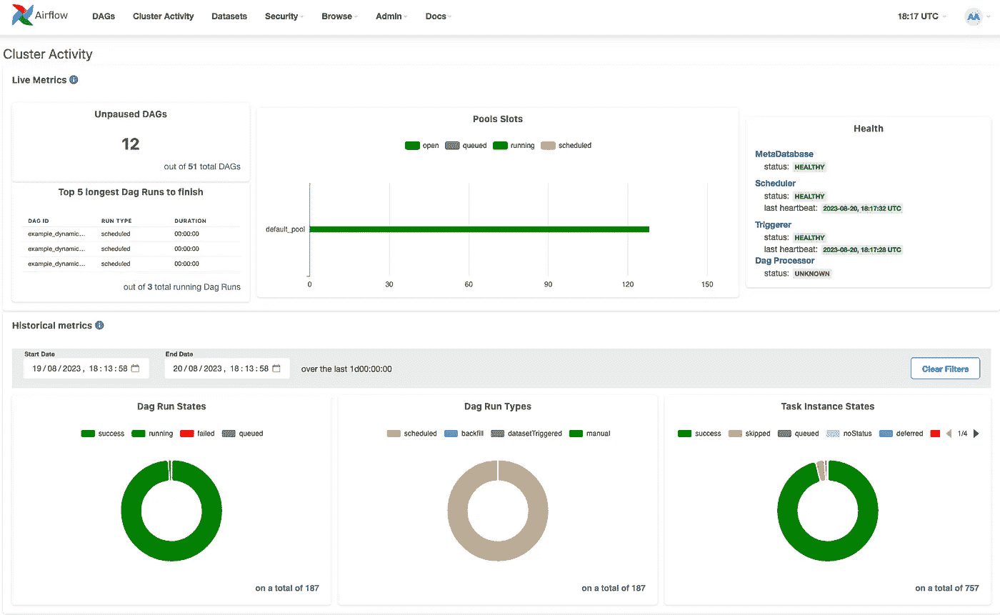

# Airflow 2.7 现已发布

> 原文：[`towardsdatascience.com/airflow-2-7-0-505f7cda9fd4?source=collection_archive---------3-----------------------#2023-08-22`](https://towardsdatascience.com/airflow-2-7-0-505f7cda9fd4?source=collection_archive---------3-----------------------#2023-08-22)

## 这里是一些最重要的功能更新，这些更新将使你的生活更轻松，并节省时间

 [Giorgos Myrianthous](https://gmyrianthous.medium.com/?source=post_page-----505f7cda9fd4--------------------------------)

·

[关注](https://medium.com/m/signin?actionUrl=https%3A%2F%2Fmedium.com%2F_%2Fsubscribe%2Fuser%2F76c21e75463a&operation=register&redirect=https%3A%2F%2Ftowardsdatascience.com%2Fairflow-2-7-0-505f7cda9fd4&user=Giorgos+Myrianthous&userId=76c21e75463a&source=post_page-76c21e75463a----505f7cda9fd4---------------------post_header-----------) 发表在 [Towards Data Science](https://towardsdatascience.com/?source=post_page-----505f7cda9fd4--------------------------------) · 5 分钟阅读 · 2023 年 8 月 22 日

--

图片由 DALL-E-2 生成，使用了提示词“数据从外部系统流入目标系统的系统设计图，数字艺术”

Apache Airflow 2.7.0 终于发布了，我们都很兴奋看到这些显著的新功能在最新版本中得以实现。新版本包含了 40 个新特性、53 个错误修复、49 项改进和 15 个文档更新。

本次发布的主要关注点是安全性，但同时也提供了许多令人兴奋的非安全相关功能。

## 新的集群活动 UI

从 Airflow 2.7.0 开始，Airflow UI 的顶级菜单中新增了一个标签，称为 **Cluster Activity**（集群活动）。

新的集群活动用户界面提供了整体集群状态的概览，包括组件健康状态（如 MetaDatabase、Scheduler、Triggerer 和 DAG 处理器），以及 DAG/任务运行状态和 DAG 运行类型的详细信息。

新的集群活动用户界面作为 Airflow 2.7.0 新版本的一部分发布 — 来源：作者

## 查看源代码最后一次被解析的时间

过去我非常烦恼，因为我无法真正看到我所做的更改是否…
