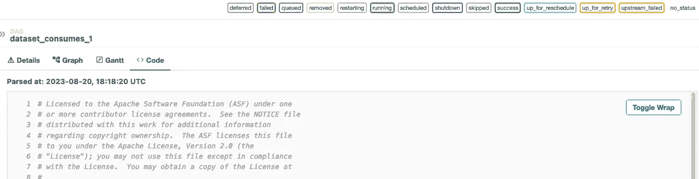
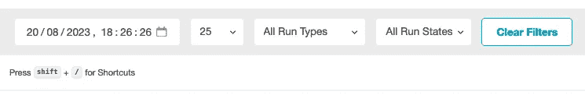
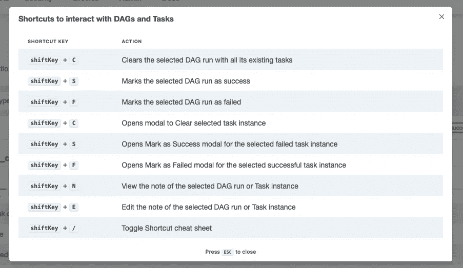
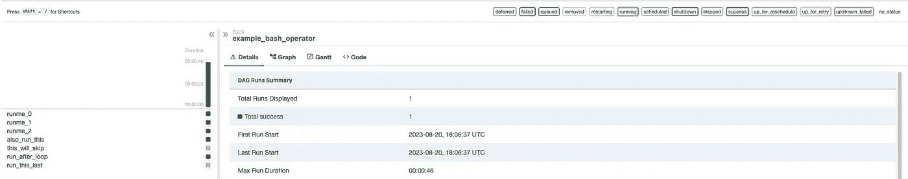

# Airflow 2.7 现已发布

> 原文：[`towardsdatascience.com/airflow-2-7-0-505f7cda9fd4`](https://towardsdatascience.com/airflow-2-7-0-505f7cda9fd4)

## 这里是一些重要的功能更新，将使您的生活更轻松，并节省您的时间

[](https://gmyrianthous.medium.com/?source=post_page-----505f7cda9fd4--------------------------------)[](https://towardsdatascience.com/?source=post_page-----505f7cda9fd4--------------------------------) [Giorgos Myrianthous](https://gmyrianthous.medium.com/?source=post_page-----505f7cda9fd4--------------------------------)

·发表于[Towards Data Science](https://towardsdatascience.com/?source=post_page-----505f7cda9fd4--------------------------------) ·5 分钟阅读·2023 年 8 月 22 日

--


图像由 DALL-E-2 生成，使用提示“数据从外部系统流入目标系统作为系统设计图，数字艺术”

Apache Airflow 2.7.0 终于发布了，我们都很兴奋看到这些显著的新功能出现在最新版本中。新版本包括 40 个新功能、53 个错误修复、49 个改进和 15 个文档更新。

此次发布的主要关注点是安全性，但同时也推出了许多令人兴奋的非安全相关功能。

## 新的集群活动用户界面

从 Airflow 2.7.0 开始，Airflow UI 的顶级菜单中引入了一个新标签，称为**集群活动**。


主 Airflow 菜单中的新集群活动标签——来源：作者

新的集群活动用户界面概览了整体集群状态，包括组件健康（如 MetaDatabase、Scheduler、Triggerer 和 DAG 处理器）以及 DAG/任务运行状态和 DAG 运行类型的详细信息。


新的集群活动用户界面作为 Airflow 2.7.0 版本的一部分发布——来源：作者

## 查看源代码最后一次解析的时间

过去，我常常因为无法确认对特定 DAG 源代码所做的更改是否被解析而感到烦恼。我通常需要刷新页面（多次）并开始查找源代码中的特定区域，以确保这些更改已被解析，从而重新触发 DAG。

新版本的 Airflow 在 DAG 的代码标签中引入了`Parsed at`字段，指示 DAG 源代码最后更新的时间戳。



新的代码标签包括一个时间戳，指示 DAG 源代码上次被解析的时间 — 来源：作者

简单但有用的补充！

## 键盘快捷键支持

Airflow 网格视图现在也支持键盘快捷键。进入 DAG 的网格屏幕后，您会注意到过滤部分下方有一个注释，表示您可以通过键入 `shift` + `/` 访问支持的快捷键列表。



shift + / 快捷键将列出所有可用的快捷键，以便与 Airflow DAG 和任务进行交互 — 来源：作者

您可以通过键盘快捷键执行的操作包括清除 DAG 运行以及将其标记为成功或失败等。



与 Airflow DAG 和任务交互的快捷键完整列表 — 来源：作者

## 图表和甘特图视图集中在一个地方。

甘特图和图表视图现在被移动到 DAG 的网格视图中，这样在任务详细信息、图表、日志和甘特视图之间导航会更容易 — 尤其是在查看更复杂的 DAG 时。



现在，可以在网格视图下找到甘特图和图表视图 — 来源：作者

请注意，旧的图表视图已被移除，新图表视图是默认视图。

## 设置和拆解任务

在设计数据管道时，通常会创建一个资源来执行某项工作，然后将其拆除。新的 Airflow 版本引入了设置和拆解任务，使这种模式成为可能。

假设我们有一个 DAG，它创建了一个计算资源，运行一个查询，然后最后拆除先前创建的资源。通常，我们需要创建三个任务并指定如下的依赖关系：

```py
create_resource >> run_query >> delete_resource
```

使用新功能，我们现在可以轻松地将第一个和最后一个任务分别标记为设置和拆解：

```py
create_resource.as_setup() >> run_query >> delete_resource.as_teardown()
create_resource >> delete_resource

# equivalent notation
create_resource >> run_query >> delete_resource.as_teardown(setups=create_resource)
```

注意：

+   当 `run_query` 任务被清除时，`create_resource`（设置）和 `delete_resource`（拆解）任务也会被清除。

+   当 `run_query` 失败时，拆解任务 `delete_resource` 仍会运行。

+   `create_resource` 和 `delete_resource` 状态将不再用于确定 DAG 运行的成功。这意味着即使只有 `run_query` 任务成功，DAG 也会被标记为成功。

## 放弃对终止生命周期的 Python 3.7 的支持。

此外，Airflow 2.7.0 已经放弃对终止生命周期 Python 3.7 的支持。为了使用 Airflow 2.7.0，您需要拥有以下 Python 版本之一：

+   3.8

+   3.9

+   3.10

+   或 3.11

请注意，Python 3.7 已不再受到 Python 社区的支持。如果您仍在使用它（即使在 Airflow 的上下文之外），请确保升级到更高版本。

## `airflow db migrate` 命令

`db init` 和 `db upgrade` 命令现已弃用。取而代之的是，您应该使用 `airflow db migrate` 命令来创建或升级 Airflow 数据库。

同样，`load_default_connections` 配置选项也已被弃用。为了创建默认连接，你需要在运行 `airflow db migrate` 后，执行 `airflow connections create-default-commenctions` 命令。

## 一些安全更新

如前所述，最新的 Airflow 版本主要集中在提升安全性上。以下是一些与安全相关的更改：

+   连接测试功能现在默认被禁用。如果你仍然需要启用它，你可以在 `airflow.cfg` 的 `core` 部分中指定 `test_connection` 标志，或通过设置环境变量 `AIRFLOW__CORE__TEST_CONNECTION`。

+   `/dags/*/dagRuns/*/taskInstances/*/xcomEntries/*` API 端点现在禁用了 `deserialize` 选项

+   现在，使用 SMTP SSL 连接时，上下文使用 Python 的默认 `default_ssl_contest` 上下文

## 尝试 Airflow 2.7

如果你想测试新功能，我建议通过在本地机器上运行 Airflow 的 Docker 版本来进行。你可以在下面的链接中找到一个逐步指南，帮助你在不到一分钟的时间内启动并运行 Airflow。

[## 如何使用 Docker 本地运行 Airflow](https://towardsdatascience.com/run-airflow-docker-1b83a57616fb?source=post_page-----505f7cda9fd4--------------------------------)

### 在本地机器上使用 Docker 运行 Airflow 的逐步指南

[如何使用 Docker 运行 Airflow](https://towardsdatascience.com/run-airflow-docker-1b83a57616fb?source=post_page-----505f7cda9fd4--------------------------------)

## 最后的想法..

跟上最新的 Airflow 版本可以确保你获得最新的功能以及任何新的安全补丁，从而避免让自己夜不能寐。

最新的 Airflow 版本带来了大量的新功能、改进、错误修复、文档更新和安全补丁。测试一下它是很重要的，如果可能的话，升级你的生产实例，以便充分利用这些新特性，同时增强安全性。

在本文中，我们仅覆盖了 Airflow 2.7.0 中引入的一小部分更改。你可以在[发布说明](https://airflow.apache.org/docs/apache-airflow/2.7.0/release_notes.html#airflow-2-7-0-2023-08-14)中查看完整的更改列表。

👇**你可能还会喜欢的相关文章**👇

[## 如何在 Airflow DAG 中跳过任务](https://towardsdatascience.com/airflow-skip-task-a5a6ab319378?source=post_page-----505f7cda9fd4--------------------------------) [如何在 Airflow 中运行 dbt](https://levelup.gitconnected.com/run-dbt-airflow-b6107d849ddb?source=post_page-----505f7cda9fd4--------------------------------)

### 根据特定条件跳过 Airflow DAG 中的任务

[## 如何在 Airflow 中运行 dbt](https://levelup.gitconnected.com/run-dbt-airflow-b6107d849ddb?source=post_page-----505f7cda9fd4--------------------------------) [如何跳过 Airflow DAG 中的任务](https://towardsdatascience.com/airflow-skip-task-a5a6ab319378?source=post_page-----505f7cda9fd4--------------------------------)

### 在 Apache Airflow 上自动化渲染 dbt 项目

[如何在 Airflow 中运行 dbt](https://levelup.gitconnected.com/run-dbt-airflow-b6107d849ddb?source=post_page-----505f7cda9fd4--------------------------------)
