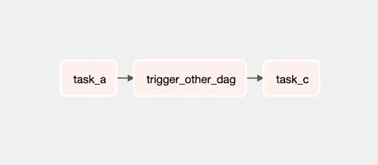
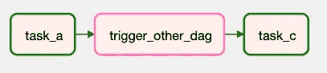

# 如何在 Airflow DAGs 中跳过任务

> 原文：[`towardsdatascience.com/airflow-skip-task-a5a6ab319378`](https://towardsdatascience.com/airflow-skip-task-a5a6ab319378)

## 根据特定条件跳过 Airflow DAGs 中的任务

[](https://gmyrianthous.medium.com/?source=post_page-----a5a6ab319378--------------------------------)[](https://towardsdatascience.com/?source=post_page-----a5a6ab319378--------------------------------) [Giorgos Myrianthous](https://gmyrianthous.medium.com/?source=post_page-----a5a6ab319378--------------------------------)

·发表于 [Towards Data Science](https://towardsdatascience.com/?source=post_page-----a5a6ab319378--------------------------------) ·9 分钟阅读·2023 年 2 月 8 日

--


图片由 [Hello I’m Nik](https://unsplash.com/@helloimnik?utm_source=unsplash&utm_medium=referral&utm_content=creditCopyText) 提供，来源于 [Unsplash](https://unsplash.com/photos/l4ADb9OVqTY?utm_source=unsplash&utm_medium=referral&utm_content=creditCopyText)

最近，我尝试在现有的 Airflow DAG 中添加一个仅在特定星期几运行的新任务。然而，我惊讶地发现，在 Airflow 中跳过任务并不像我预期的那样简单。

在本文中，我将演示如何在 Airflow DAGs 中跳过任务，特别是专注于在使用 `PythonOperator` 或继承自内置操作符的操作符（如 `TriggerDagRunOperator`）时使用 `AirflowSkipException`。

最后，我将讨论 `BranchPythonOperator` 和 `ShortCircuitOperator` 的使用方式，以及它们如何潜在地决定何时跳过任务。

[](/run-airflow-docker-1b83a57616fb?source=post_page-----a5a6ab319378--------------------------------) ## 如何在本地使用 Docker 运行 Airflow

### 本地机器上使用 Docker 运行 Airflow 的逐步指南

towardsdatascience.com

现在假设我们有一个包含三个任务的 Airflow DAG


包含三个 `` `PythonOperator` ta ``sks 的示例 DAG — 来源：作者

```py
from datetime import datetime

from airflow import DAG
from airflow.operators.python import PythonOperator

with DAG(
    dag_id='test_dag',
    start_date=datetime(2021, 1, 1),
    catchup=False,
    tags=['example'],
) as dag:

  first_task = PythonOperator(task_id='task_a', python_callable=lambda: print('Hi from task_a'))
  second_task = PythonOperator(task_id='task_b', python_callable=lambda: print('Hi form task_b'))
  third_task = PythonOperator(task_id='task_c', python_callable=lambda: print('Hi form task_c'))

  first_task >> second_task >> third_task
```

## 跳过 PythonOperator 任务

跳过通过 `PythonOperator` 创建的任务的最直观方法是抛出 `[AirflowSkipException](https://airflow.apache.org/docs/apache-airflow/stable/_api/airflow/exceptions/index.html#airflow.exceptions.AirflowSkipException)`。这意味着通过 `PythonOperator` 执行的 `python_callable` 函数需要实现决定何时抛出异常的逻辑。

让我们回到之前讨论的示例 DAG，并考虑一个场景，即`task_b`必须仅在每年的每周周一运行。

```py
from datetime import datetime

from airflow import DAG
from airflow.exceptions import AirflowSkipException
from airflow.operators.python import PythonOperator

def my_func(**context):
    # If the DagRun start date is not a Monday, then skip this task
    dag_run_start_date = context['dag_run'].start_date
    if dag_run_start_date.weekday() != 0:
        raise AirflowSkipException

    # Anything beyond this line will be executed only if the
    # task is not skipped, based on the condition specified above
    print('Hi from task_b')

with DAG(
    dag_id='test_dag',
    start_date=datetime(2021, 1, 1),
    catchup=False,
    tags=['example'],
) as dag:
    first_task = PythonOperator(task_id='task_a', python_callable=lambda: print('Hi from task_a'))
    second_task = PythonOperator(task_id='task_b', python_callable=my_func)
    third_task = PythonOperator(
        task_id='task_c',
        python_callable=lambda: print('Hi form task_c'),
        trigger_rule='none_failed'
    )

    first_task >> second_task >> third_task
```

如果 DagRun 的开始日期不是周一，则`task_b`将被跳过，并以粉红色显示（这表示 UI 中的跳过任务）。


满足跳过条件，`task_c`的`trigger_rule`设置为`none_failed`——来源：作者

重要的是要注意传递给`third_task`的`trigger_rule`关键字参数的`'none_failed'`值。如果我们跳过此配置，那么每当`task_b`也被跳过时，`task_c`也会被跳过。


由于`trigger_rule`将得到默认的`all_success`值，`task_c`也会被跳过——来源：作者

默认情况下，`trigger_rule`设置为`all_success`，这意味着只有在所有上游任务未被跳过且成功的情况下，任务才会被执行。

如果 DagRun 的开始日期是周一，那么`task_b`将被执行：


跳过条件不满足——来源：作者

## 跳过内置操作符任务

假设我们有另一个包含三个任务的 DAG，其中包括一个用于触发另一个 DAG 的`TriggerDagRunOperator`。

```py
from datetime import datetime

from airflow import DAG
from airflow.operators.python import PythonOperator
from airflow.operators.trigger_dagrun import TriggerDagRunOperator

with DAG(
  dag_id='test_dag',
  start_date=datetime(2021, 1, 1),
  catchup=False,
  tags=['example'],
) as dag:
  first_task = PythonOperator(
      task_id='task_a', 
      python_callable=lambda: print('Hi from task_a'),
    )
    trigger_task = TriggerDagRunOperator(
      task_id='trigger_other_dag', 
      trigger_dag_id='example_branch_operator',
    )
    last_task = PythonOperator(
        task_id='task_c',
        python_callable=lambda: print('Hi from task_c'),
        trigger_rule='none_failed',
    )

  first_task >> second_task >> third_task
```



一个包含 TriggerDagRunOperator 的 DAG——来源：作者

如果你正在考虑跳过使用内置操作符（甚至继承自内置操作符的自定义操作符）创建的任务，那么情况会复杂一些。为此，我们可以考虑几个不同的选项。在本节中，我将提供所有这些选项，具体选择哪个最适合你的需求由你决定。

我们的**第一个选项**是使用`**BranchPythonOperator**`来创建分支逻辑，使 DAG 可以根据某些条件逻辑采取特定方向。再一次，假设`trigger_other_dag`——本质上使用`TriggerDagRunOperator`来触发另一个 Airflow DAG——需要仅在周一执行。

我们可以使用带有两个分支的`BranchPythonOperator`和一个底层分支逻辑的可调用对象来选择何时跳过一个任务。

```py
def choose_branch(**context):
    dag_run_start_date = context['dag_run'].start_date
    if dag_run_start_date.weekday() != 0:  # check if Monday
        return 'task_a'
    return 'trigger_other_dag'
```

现在让我们继续创建 Airflow 任务。

```py
from datetime import datetime

from airflow import DAG
from airflow.operators.dummy import DummyOperator
from airflow.operators.python import BranchPythonOperator, PythonOperator
from airflow.operators.trigger_dagrun import TriggerDagRunOperator

with DAG(
  dag_id='test_dag',
  start_date=datetime(2021, 1, 1),
  catchup=False,
  tags=['example'],
) as dag:
  branch_task = BranchPythonOperator(
    task_id='branching', 
    python_callable=choose_branch,
  )

  first_task = PythonOperator(
    task_id='task_a', 
    python_callable=lambda: print('Hi from task_a'),
  )
  trigger_task = TriggerDagRunOperator(
    task_id='trigger_other_dag', 
    trigger_dag_id='example_branch_operator',
  )
  last_task = PythonOperator(
      task_id='task_c',
      python_callable=lambda: print('Hi from task_c'),
      trigger_rule='none_failed',
  )
  dummy_task = DummyOperator(task_id='skip', )

  first_task >>branch_task >> [trigger_task, dummy_task] >> last_task
```


使用`BranchPythonOperator`来决定何时跳过任务——来源：作者

请注意，分支操作符不能有空路径，因此我们不得不使用`DummyOperator`创建一个虚拟任务，并对应于跳过任务。每当需要跳过触发任务时，`skip`操作符将被执行（实际上并不是这样）：


跳过`trigger_other_dag`任务——来源：作者

我们的**第二个选项**是使用`**ShortCircuitOperator**`来实现条件逻辑，以决定何时跳过特定任务。

> ShortCircuitOperator 继承自 PythonOperator，并评估`python_callable`的结果。如果返回结果为`False`或虚值，管道将短路。下游任务将根据配置的短路模式被标记为“跳过”。如果返回结果为`True`或真值，下游任务将正常进行，并推送返回结果的`XCom`。
> 
> — [Airflow 文档](https://airflow.apache.org/docs/apache-airflow/stable/_api/airflow/operators/python/index.html#airflow.operators.python.ShortCircuitOperator)

```py
from datetime import datetime

from airflow import DAG
from airflow.operators.python import PythonOperator, ShortCircuitOperator
from airflow.operators.trigger_dagrun import TriggerDagRunOperator

def is_monday(**context):
  return context['dag_run'].start_date.weekday() == 0

with DAG(
  dag_id='test_dag',
  start_date=datetime(2021, 1, 1),
  catchup=False,
  tags=['example'],
) as dag:
  is_monday_task = ShortCircuitOperator(
    task_id='is_not_monday',
    python_callable=is_monday,
    ignore_downstream_trigger_rules=False,
  )

  first_task = PythonOperator(
    task_id='task_a',
    python_callable=lambda: print('Hi from task_a'),
  )

  trigger_task = TriggerDagRunOperator(
    task_id='trigger_other_dag',
    trigger_dag_id='example_branch_operator',
  )

  last_task = PythonOperator(
    task_id='task_c',
    python_callable=lambda: print('Hi from task_c'),
    trigger_rule='none_failed',
  )

  first_task >> is_monday_task >> trigger_task >> last_task
```


使用 ShortCircuitOperator 跳过 Airflow 任务—来源：作者

现在，如果`is_monday()`的结果为 False，Airflow 将跳过所有下游任务。然而，这是一种默认行为，这意味着如果我们只想跳过一个任务，我们还需要在创建`ShortCircuitOperator`实例时提供`ignore_downstream_trigger_rules=False`。这个配置将考虑下游任务的相应触发规则，并决定哪些任务仍需跳过或执行（注意我们最后一个任务`task_c`中的触发规则）。


如果`is_monday` ShortCircuitOperator 返回 False，则只跳过—来源：作者

如果`python_callable`的结果为`True`，则下游任务也将被执行。


如果`is_monday` ShortCircuitOperator 返回 True，则所有下游任务将被执行—来源：作者

最后，**第三种选项**涉及到**实现一个从内置操作符继承的子类**，例如`TriggerDagRunOperator`。

以下自定义操作符继承自内置的`TriggerDagRunOperator`，并接受一个额外的可调用参数，用于决定是否会引发`AirflowSkipException`。

```py
from airflow.utils.decorators import apply_defaults
from airflow.exceptions import AirflowSkipException
from airflow.operators.trigger_dagrun import TriggerDagRunOperator

from typing import Any, Dict, Callable, TypeVar

Context = TypeVar('Context', bound=Dict[Any, Any])

class ConditionalTriggerDagRunOperator(TriggerDagRunOperator):
    """
    This is a custom operator that will execute TriggerDagRunOperator only if
    `conditional_checker_callable` callable result  evaluates to `True`. Otherwise, the task will
    be skipped by raising a `AirflowSkipException`
    """

    @apply_defaults
    def __init__(
        self,
        conditional_checker_callable: Callable[[Context], bool],
        **kwargs: Any,
    ) -> None:
        super().__init__(**kwargs)
        self.conditional_checker_callable = conditional_checker_callable

    def execute(self, context: Context) -> None:
        if not self.conditional_checker_callable(context):
            raise AirflowSkipException

        super().execute(context)
```

如果`conditional_checker_callable`的结果返回`True`，则操作符将被执行，否则将被跳过。现在，我们的 DAG 的完整代码变为：

```py
from datetime import datetime

from airflow import DAG
from airflow.exceptions import AirflowSkipException
from airflow.operators.python import PythonOperator
from airflow.operators.trigger_dagrun import TriggerDagRunOperator

from typing import Any, Dict, Callable, TypeVar

Context = TypeVar('Context', bound=Dict[Any, Any])

class ConditionalTriggerDagRunOperator(TriggerDagRunOperator):
    """
    This is a custom operator that will execute TriggerDagRunOperator only if
    `conditional_checker_callable` callable result  evaluates to `True`. Otherwise, the task will
    be skipped by raising a `AirflowSkipException`
    """

    def __init__(
        self,
        conditional_checker_callable: Callable[[Context], bool],
        **kwargs: Any,
    ) -> None:
        super().__init__(**kwargs)
        self.conditional_checker_callable = conditional_checker_callable

    def execute(self, context: Context) -> None:
        if not self.conditional_checker_callable(context):
            raise AirflowSkipException

        super().execute(context)

def is_monday(**context):
    return context['dag_run'].start_date.weekday() == 0

with DAG(
    dag_id='test_dag',
    start_date=datetime(2021, 1, 1),
    catchup=False,
    tags=['example'],
) as dag:
    first_task = PythonOperator(
        task_id='task_a',
        python_callable=lambda: print('Hi from task_a'),
    )

    trigger_task = ConditionalTriggerDagRunOperator(
        task_id='trigger_other_dag',
        conditional_checker_callable=is_monday,
        trigger_dag_id='example_branch_operator',
    )

    last_task = PythonOperator(
        task_id='task_c',
        python_callable=lambda: print('Hi from task_c'),
        trigger_rule='none_failed',
    )

    first_task >> trigger_task >> last_task
```


创建一个可以被跳过的自定义操作符。注意，对于这个选项，不需要额外的任务—来源：作者

现在，如果条件结果为`False`，使用我们自定义操作符创建的任务将被跳过。



如果条件为 False，则跳过任务—来源：作者

同样地，如果条件为`True`，任务将被执行。


如果条件为 True，则执行任务—来源：作者

注意，对于这个特定选项，我们不需要像在前两个示例中那样创建额外的任务使用`BranchPythonOperator`和`ShortCircuitOperator`，这点我个人很喜欢，因为它使我们的 DAG 更简洁。

注意，类似的行为可以通过继承`SkipMixin` Mixin Airflow 类的功能来实现。有关更多信息，请随时查看文档。

就我个人而言，我喜欢最后一种方法，因为它在 Airflow UI 中的 DAG 可视化时更为清晰，同时，通过从内置操作符创建一个子类来实现跳过逻辑，你还可以将其重用到其他 DAG 中。但这取决于具体的用例和你的任何偏好，所以请随意选择最适合你需求的方法。

## 最后的想法

在编写 Airflow DAG 时跳过任务是一个非常常见的需求，它使工程师能够以更动态和复杂的方式协调任务。

在本文中，我们演示了许多不同的选项，用于实现需要条件执行的 Airflow 任务逻辑。更具体地说，我们演示了如何通过引发`AirflowSkipException`来实现这种功能。

此外，我们还演示了几种不同的方法，用于跳过使用内置操作符创建的任务，除了`PythonOperator`。根据你的具体用例，你可以决定采用哪种方法。

尽管跳过任务是一个常见需求，但似乎 Airflow 没有内置的功能来在特定的 DAG 中执行条件运行。我期待能够让开发者在特定任务中指定触发条件的功能，但我很确定这种功能迟早会被实现并打包进未来的 Airflow 版本中。

👉 [**成为会员**](https://gmyrianthous.medium.com/membership) **并阅读 Medium 上的每一篇故事。你的会员费直接支持我和你阅读的其他作者。你还将获得 Medium 上每个故事的完整访问权限。**

[](https://gmyrianthous.medium.com/membership?source=post_page-----a5a6ab319378--------------------------------) [## 通过我的推荐链接加入 Medium — Giorgos Myrianthous

### 作为 Medium 会员，你的部分会员费会流向你阅读的作者，并且你将获得对每个故事的完整访问权限……

gmyrianthous.medium.com](https://gmyrianthous.medium.com/membership?source=post_page-----a5a6ab319378--------------------------------)

👇**你可能还喜欢的相关文章** 👇

[](/etl-vs-elt-68e221d78719?source=post_page-----a5a6ab319378--------------------------------) ## ETL 与 ELT：有什么区别？

### 数据工程背景下 ETL 与 ELT 的比较

towardsdatascience.com [](/dbt-55b35c974533?source=post_page-----a5a6ab319378--------------------------------) ## 什么是 dbt（数据构建工具）

### 对正在颠覆数据世界的 dbt 的温馨介绍

[towardsdatascience.com [](/apache-airflow-architecture-496b9cb28288?source=post_page-----a5a6ab319378--------------------------------) ## Apache Airflow 架构

### 深入探讨 Apache Airflow 架构及其如何协调工作流

[towardsdatascience.com
