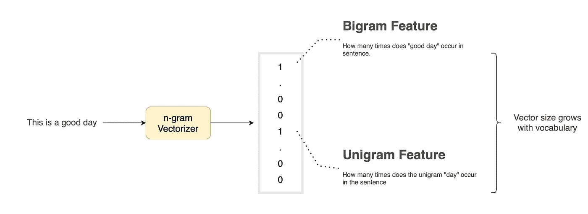

# AI 的句子嵌入，解密

> 原文：[`towardsdatascience.com/ais-sentence-embeddings-demystified-7c9cce145dd2?source=collection_archive---------11-----------------------#2023-08-01`](https://towardsdatascience.com/ais-sentence-embeddings-demystified-7c9cce145dd2?source=collection_archive---------11-----------------------#2023-08-01)

## 弥合计算机与语言之间的鸿沟：AI 句子嵌入如何革新自然语言处理

  [Ajay Halthor](https://medium.com/@dataemporium?source=post_page-----7c9cce145dd2--------------------------------)

·

[关注](https://medium.com/m/signin?actionUrl=https%3A%2F%2Fmedium.com%2F_%2Fsubscribe%2Fuser%2Fb0a3e7e495ca&operation=register&redirect=https%3A%2F%2Ftowardsdatascience.com%2Fais-sentence-embeddings-demystified-7c9cce145dd2&user=Ajay+Halthor&userId=b0a3e7e495ca&source=post_page-b0a3e7e495ca----7c9cce145dd2---------------------post_header-----------) 发表在 [数据科学前沿](https://towardsdatascience.com/?source=post_page-----7c9cce145dd2--------------------------------) ·10 分钟阅读·2023 年 8 月 1 日

--

图片由 [Steve Johnson](https://unsplash.com/@steve_j?utm_source=medium&utm_medium=referral) 提供，来自 [Unsplash](https://unsplash.com/?utm_source=medium&utm_medium=referral)

在这篇博文中，让我们解密计算机如何理解句子和文档。为此，我们将回顾早期的句子表示方法，从 n-gram 向量和 TF-IDF 向量开始。后续章节将讨论从神经词袋到我们今天看到的句子变换器和语言模型的词向量聚合方法。将会涉及很多有趣的技术。让我们从简单优雅的 n-gram 开始我们的旅程。

# 1\. N-gram 向量

计算机不能理解文字，但它们能理解数字。因此，我们在处理计算机时需要将文字和句子转换为向量。句子作为向量的最早表示之一可以追溯到[克劳德·香农于 1948 年的论文](https://people.math.harvard.edu/~ctm/home/text/others/shannon/entropy/entropy.pdf)，他是信息论的奠基人。在这项开创性的工作中，句子被表示为一个 n-gram 词向量。*这是什么意思？*

图 1：从句子生成 n-gram 向量。（图像由作者提供）
