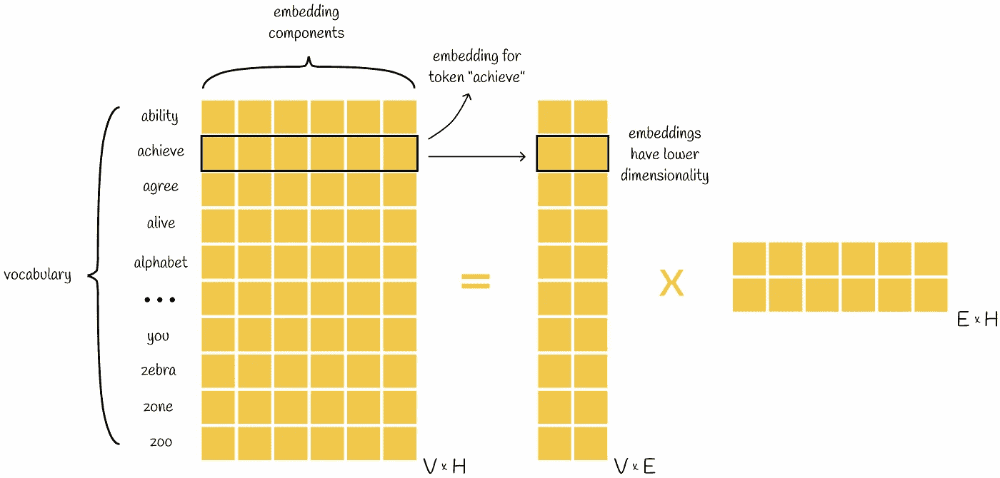
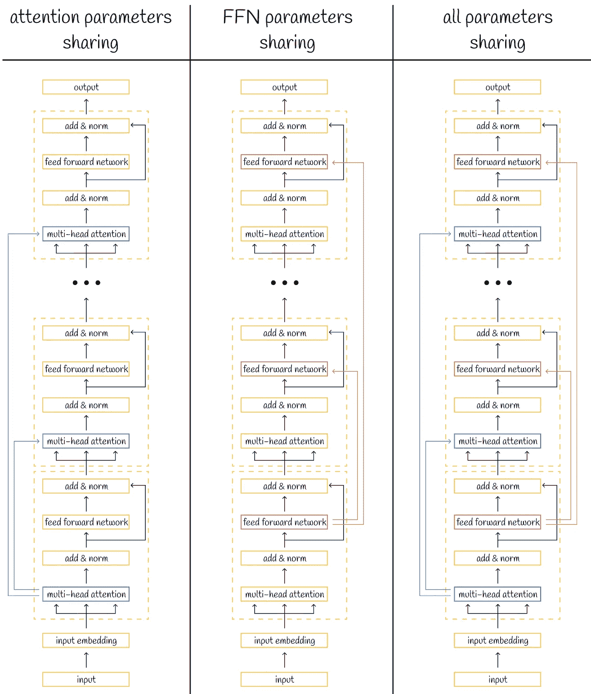
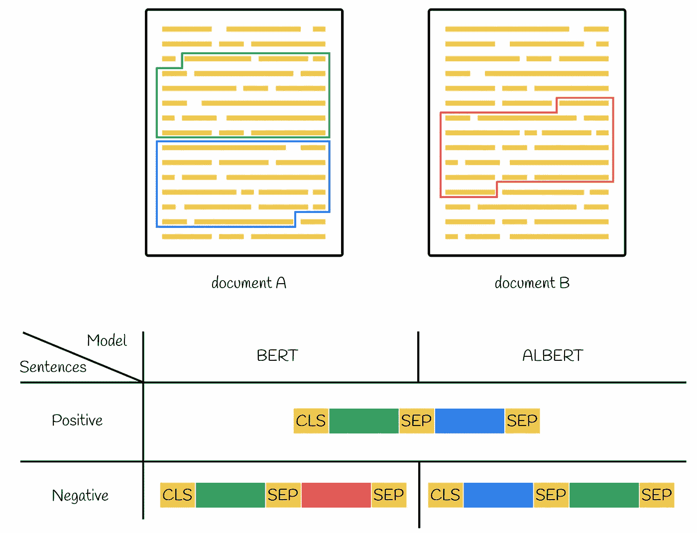
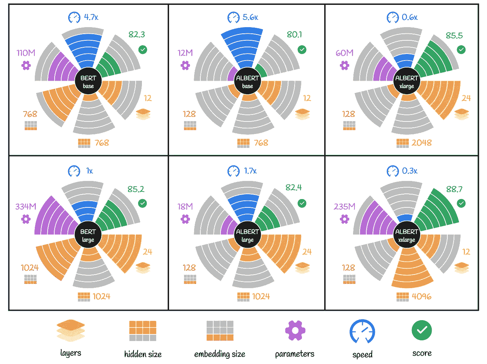
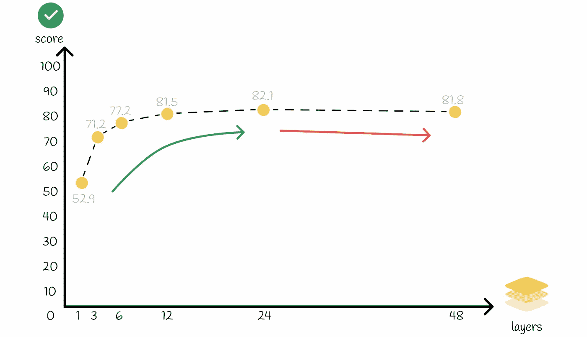
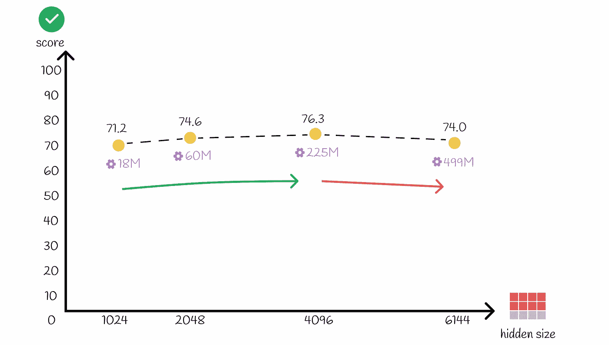

# 大型语言模型，ALBERT——用于自监督学习的轻量级 BERT

> 原文：[`towardsdatascience.com/albert-22983090d062?source=collection_archive---------4-----------------------#2023-11-07`](https://towardsdatascience.com/albert-22983090d062?source=collection_archive---------4-----------------------#2023-11-07)

## 理解 BERT 架构选择背后的基本技术，以生产出紧凑而高效的模型

 [Vyacheslav Efimov](https://medium.com/@slavahead?source=post_page-----22983090d062--------------------------------)

·

[关注](https://medium.com/m/signin?actionUrl=https%3A%2F%2Fmedium.com%2F_%2Fsubscribe%2Fuser%2Fc8a0ca9d85d8&operation=register&redirect=https%3A%2F%2Ftowardsdatascience.com%2Falbert-22983090d062&user=Vyacheslav+Efimov&userId=c8a0ca9d85d8&source=post_page-c8a0ca9d85d8----22983090d062---------------------post_header-----------) 发布于 [Towards Data Science](https://towardsdatascience.com/?source=post_page-----22983090d062--------------------------------) · 7 分钟阅读 · 2023 年 11 月 7 日

--

# 介绍

近年来，大型语言模型的发展迅猛。BERT 成为了最受欢迎和高效的模型之一，能够以高精度解决广泛的 NLP 任务。在 BERT 之后，出现了一系列其他模型，表现也非常出色。

显而易见的趋势是，**随着时间的推移，大型语言模型（LLMs）趋向于通过指数增加其参数和训练数据的数量变得更复杂**。深度学习的研究表明，这种技术通常会带来更好的结果。不幸的是，机器学习领域已经处理过几个有关 LLMs 的问题，而可扩展性已成为有效训练、存储和使用它们的主要障碍。

因此，最近开发了新的大语言模型（LLMs）以解决可扩展性问题。在本文中，我们将讨论 ALBERT，它在 2020 年被发明，目标是显著减少 BERT 参数。

# ALBERT

为了了解 ALBERT 的潜在机制，我们将参考其[官方论文](https://arxiv.org/pdf/1909.11942.pdf)。大部分情况下，ALBERT 从 BERT 派生出相同的架构。模型架构选择上有三个主要区别，下面将进行说明和解释。

> ALBERT 的训练和微调过程类似于 BERT。与 BERT 一样，ALBERT 在英文维基百科（2500M 单词）和 BookCorpus（800M 单词）上进行预训练。

# 1\. 分解参数嵌入

当输入序列被标记化时，每个标记被映射到词汇嵌入中的一个。这些嵌入用于 BERT 的输入。

设 *V* 为词汇大小（可能的嵌入总数）和 *H* — 嵌入维度。那么，对于每个 *V* 个嵌入，我们需要存储 *H* 个值，从而形成一个 *V x H* 的嵌入矩阵。实际上，这个矩阵通常具有巨大的尺寸，并且需要大量内存来存储。但是，更大的问题是，大多数情况下，嵌入矩阵的元素是可训练的，这需要大量资源来使模型学习合适的参数。

例如，以 BERT 基础模型为例：它有 30K 个词汇，每个词汇由 768 维嵌入表示。总共，这导致了 23M 权重需要存储和训练。对于更大的模型，这个数字甚至更大。

这个问题可以通过使用矩阵分解来避免。原始词汇矩阵 *V x H* 可以分解成一对较小的矩阵，尺寸为 *V x E* 和 *E x H*。

词汇矩阵分解

因此，使用*O(V x H)*参数的情况下，分解结果仅需 *O(V x E + E x H)* 权重。显然，当 *H >> E* 时，这种方法是有效的。

**矩阵分解的另一个伟大方面是它不会改变获取标记嵌入的查找过程**：左分解矩阵 *V x E* 的每一行以与原始矩阵 *V x H* 相同的简单方式将标记映射到其对应的嵌入。这样，嵌入的维度从 *H* 降低到 *E*。

然而，对于分解矩阵而言，为了获得 BERT 的输入，需要将映射的嵌入投影到隐藏的 BERT 空间：这通过将左矩阵的相应行与右矩阵的列相乘来完成。

# 2\. 跨层参数共享

减少模型参数的一种方法是使它们可共享。这意味着它们共享相同的值。大部分情况下，这只是减少了存储权重所需的内存。然而，**标准算法如反向传播或推理仍需在所有参数上执行**。

> **共享权重的最优方式之一是将它们放置在模型中不同但相似的块中**。将它们放入相似的块中会导致在前向传播或反向传播过程中大多数可共享参数的计算相同，从而提供更多设计高效计算框架的机会。

上述思想在 ALBERT 中得到了实现，ALBERT 由一组结构相同的变压器块组成，使得参数共享更高效。事实上，在变压器中跨层共享参数存在几种方法：

+   仅共享注意力参数；

+   仅共享前向神经网络（FNN）参数；

+   共享所有参数（用于 ALBERT）。

不同的参数共享策略

> 通常，可以将所有变压器层分成 N 组，每组大小为 M，每组内的层共享参数。研究人员发现，组大小 M 越小，结果越好。然而，减少组大小 M 会显著增加总参数量。

# 3\. 句子顺序预测

BERT 在预训练时专注于掌握两个目标：掩码语言模型（MSM）和下一句预测（NSP）。一般来说，MSM 旨在提高 BERT 获取语言知识的能力，而 NSP 的目标是提升 BERT 在特定下游任务上的表现。

然而，多项研究表明，去除 NSP 目标可能是有益的，因为与 MLM 相比，它过于简单。基于这一理念，ALBERT 的研究人员决定去除 NSP 任务，并用句子顺序预测（SOP）问题替代，其目标是预测两个句子是否按正确或相反顺序排列。

说到训练数据集，所有输入句子的正对会在同一文本段落中按顺序收集（与 BERT 中的方法相同）。对于负句子，原则相同，只是两个句子的顺序相反。

BERT 和 ALBERT 中正负训练对的组合

> 研究表明，使用 NSP 目标训练的模型不能准确解决 SOP 任务，而使用 SOP 目标训练的模型在 NSP 问题上表现良好。这些实验证明了 ALBERT 在解决各种下游任务方面比 BERT 更为适应。

# BERT 与 ALBERT

BERT 和 ALBERT 的详细比较在下面的图中展示。

BERT 和 ALBERT 模型不同变体的比较。在相同配置下测量的速度显示了模型迭代训练数据的速度。速度值是相对每个模型显示的（BERT large 作为基线，其速度等于 1x）。准确性评分是在 GLUE、SQuAD 和 RACE 基准上测量的。

这里是一些最有趣的观察结果：

+   尽管 xxlarge 版本的 ALBERT 仅有 BERT large 70%的参数，但在下游任务中表现更佳。

+   相比于 BERT large，ALBERT large 在性能上可比，并且由于大规模的参数压缩，其速度提高了 1.7 倍。

+   所有 ALBERT 模型的嵌入大小为 128。如论文中的消融研究所示，这是一项最优值。增加嵌入大小，例如，达到 768，会改善指标，但绝对值提升不超过 1%，考虑到模型复杂性的增加，这一提升并不算多。

+   尽管 ALBERT xxlarge 处理单次数据迭代的速度比 BERT large 慢 3.3 倍，但实验表明，如果将这两种模型训练相同的时间，那么 ALBERT xxlarge 在基准测试中显示了明显更好的平均性能（88.7% vs 87.2%）。

+   实验表明，具有较宽隐藏层大小（≥ 1024）的 ALBERT 模型从增加层数中获益不大。这也是为什么 ALBERT large 的层数从 24 减少到 xxlarge 版本的 12 的原因之一。

ALBERT large（1800 万参数）在增加层数时的性能表现。图中的模型具有≥ 3 层，这些模型都是从之前模型的检查点进行微调的。可以观察到，在达到 12 层后，性能提升变得更慢，并且在 24 层后逐渐下降。

+   类似的现象发生在隐藏层大小增加时。将其增加到大于 4096 的值会导致模型性能下降。

ALBERT large（来自上图的 3 层配置）在增加隐藏层大小时的性能表现。4096 的隐藏大小是最优值。

# 结论

初看，ALBERT 似乎是一个比原始 BERT 模型更好的选择，因为它在下游任务中表现优于它们。然而，由于其更长的结构，ALBERT 需要更多的计算。例如，ALBERT xxlarge 具有 2.35 亿个参数和 12 层编码器。这 2.35 亿个权重中的大多数属于单个变换器块。这些权重随后被共享到 12 层中。因此，在训练或推理过程中，算法必须在超过 20 亿个参数上执行！

由于这些原因，ALBERT 更适合于在速度可以权衡的情况下实现更高的准确性。*最终*，NLP 领域从未停滞不前，并且不断向新的优化技术发展。ALBERT 的速度很可能在不久的将来得到改善。论文的作者已经提到了如**稀疏注意力**和**块注意力**等方法，作为 ALBERT 加速的潜在算法。

# 资源

+   [ALBERT：用于自监督学习语言表示的轻量级 BERT](https://arxiv.org/pdf/1909.11942.pdf)

*除非另有说明，否则所有图片均由作者提供*
