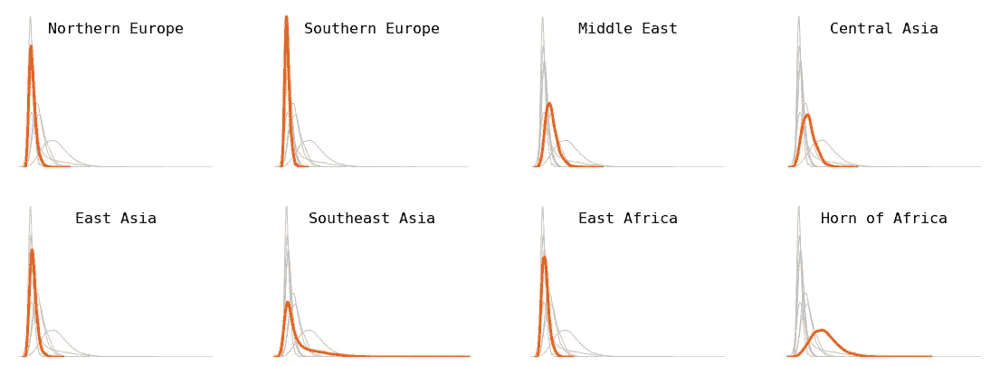

# 所有语言并非（tokenized）平等

> 原文：[`towardsdatascience.com/all-languages-are-not-created-tokenized-equal-cd87694a97c1`](https://towardsdatascience.com/all-languages-are-not-created-tokenized-equal-cd87694a97c1)

## 语言模型在某些语言上的成本远高于其他语言

 [Yennie Jun](https://medium.com/@artfish?source=post_page-----cd87694a97c1--------------------------------)

·发表于 [Towards Data Science](https://towardsdatascience.com/?source=post_page-----cd87694a97c1--------------------------------) ·阅读时间 12 分钟·2023 年 5 月 3 日

--

“hey” 翻译成 52 种不同语言。文本的大小按比例缩放，以对应于在相应语言中表示消息所需的 token 数量。图片由作者创建。

*原始文章发布在我的* [*博客*](https://www.artfish.ai/p/all-languages-are-not-created-tokenized)*。*

大型语言模型如 ChatGPT 通过首先将文本拆分为称为**tokens**的小单位来处理和生成文本序列。下图中，每个彩色块代表一个独特的 token。短的或常见的词如“you”、“say”、“loud”和“always”是其自身的 token，而较长或不常见的词如“atrocious”、“precocious”和“supercalifragilisticexpialidocious”则被拆分为更小的子词。

使用 [OpenAI’s tokenizer website](https://platform.openai.com/tokenizer) 进行短文本的 tokenization 可视化。截图由作者拍摄。

这种**tokenization**过程在不同语言中并不统一，导致在不同语言中对等表达产生的 token 数量存在差异。例如，**缅甸语或阿姆哈拉语中的一句话可能需要比英文中类似的信息多 10 倍的 tokens。**

同一消息翻译成五种语言的示例以及 token 化该消息所需的相应 token 数量（使用 OpenAI 的 tokenizer）。文本来自 [Amazon’s MASSIVE dataset](https://www.amazon.science/blog/amazon-releases-51-language-dataset-for-language-understanding)。

在本文中，我探讨了 tokenization 过程及其在不同语言中的变化：

+   对短消息并行数据集中翻译成 52 种不同语言的 token 分布的分析

+   一些语言，如亚美尼亚语或缅甸语，标记长度是英语的**9 到 10 倍**，以标记类似的消息

+   语言差异的影响

+   **这一现象在 AI 中并不新鲜**——这与我们在摩尔斯电码和计算机字体中观察到的情况一致

## 亲自尝试一下！

[尝试一下我在 HuggingFace Spaces 上制作的探索性仪表板](https://huggingface.co/spaces/yenniejun/tokenizers-languages)。在这里，你可以比较不同语言和不同 Tokenizers 的标记长度（这在本文中没有探讨，但我鼓励读者自行探索）。

语言 Tokenizers 仪表板的截图。

# 数据

[MASSIVE](https://arxiv.org/abs/2204.08582) 是一个由 [Amazon](https://github.com/alexa/massive) 介绍的平行数据集，包含 100 万个现实的、跨 52 种语言和 18 个领域的短文本翻译。我使用了数据集的 `dev` 切分，包含**2033 个翻译成每种语言的文本**。该数据集 [可在 HuggingFace 上获取](https://huggingface.co/datasets/AmazonScience/massive) 并根据 [CC BY 4.0 许可证](https://huggingface.co/datasets/AmazonScience/massive/blob/main/massive.py) 进行授权。

# 专注于 OpenAI 的 Tokenizers

虽然存在许多其他语言模型 Tokenizer，但本文主要关注 [OpenAI 的 Byte Pair Encoding (BPE) Tokenizer](https://platform.openai.com/tokenizer)（ChatGPT 和 GPT-4 使用的）有三个主要原因：

+   首先，[Denys Linkov 的文章](https://denyslinkov.medium.com/why-is-gpt-3-15-77x-more-expensive-for-certain-languages-2b19a4adc4bc) 比较了几种 Tokenizer，并发现 GPT-2 的 Tokenizer 在不同语言之间的 Token 长度差异最大。这促使我专注于 OpenAI 模型，包括 GPT-2 及其后续版本。

+   其次，由于我们缺乏对 ChatGPT 完整训练数据集的深入了解，调查 OpenAI 的黑箱模型和 Tokenizers 有助于更好地理解它们的行为和输出。

+   最后，ChatGPT 在各种应用中的广泛采用（从语言学习平台如 [Duolingo](https://blog.duolingo.com/duolingo-max/) 到社交媒体应用如 [Snapchat](https://newsroom.snap.com/say-hi-to-my-ai)）突显了理解 Tokenization 细微差别的重要性，以确保在不同语言社区中公平的语言处理。

为了计算文本包含的 Token 数量，我使用了 [tiktoken](https://github.com/openai/tiktoken) 上的 `cl100k_base` Tokenizer，这是 OpenAI ChatGPT 模型（`gpt-3.5-turbo` 和 `gpt-4`）使用的 BPE Tokenizer。

# 结果

## 一些语言的标记长度始终较长

以下分布图比较了五种语言的标记长度分布。英语的曲线高而窄，这意味着英语文本通常被标记为较少的标记数。另一方面，像印地语和缅甸语这样的语言的曲线短而宽，这意味着这些语言的文本标记数要多得多。

所有 2033 条消息和 52 种语言的标记长度分布。五种语言被加粗并着色，其余的用灰色显示。图表由作者创建。

## 英语的中位数标记长度最短

对于每种语言，我计算了数据集中所有文本的中位数标记长度。以下图表比较了部分语言。英语文本的中位数长度最小，为 7 个标记，而缅甸语文本的中位数长度最大，为 72 个标记。西班牙语、法语和葡萄牙语等罗曼语族语言通常产生的标记数与英语相似。

52 种语言的一个子集及其标记长度的中位数。图表由作者创建。

由于英语的中位数标记长度最短，我计算了其他语言的中位数标记长度与英语的比例。像印地语和孟加拉语这样的语言（有超过 8 亿人讲这两种语言）其标记长度约为英语的 5 倍。亚美尼亚语的比例是英语的 9 倍，缅甸语则超过了英语的 10 倍。换句话说，**为了表达相同的情感，一些语言需要多达 10 倍的标记数**。

52 种语言的一个子集及这些语言的中位数标记长度与英语的中位数标记长度之比。图表由作者创建。

# 讨论

## 标记语言差异的影响

总体来说，需要更多标记（在不同语言中标记相同的信息）意味着：

+   你受限于可以在提示中放入的信息量（因为上下文窗口是固定的）。截至 2023 年 3 月，GPT-3 最多可以处理 4K 个标记，而 GPT-4 最多可以处理 8K 或 32K 个标记 [1]

+   成本更高

+   运行时间更长

OpenAI 的模型在英语不是主流语言的国家越来越多地被使用。根据 SimilarWeb.com 的数据，美国在 2023 年 1 月至 3 月仅占 ChatGPT 流量的 10%。

2023 年 1 月至 3 月，向 chat.openai.com 发送流量最多的前五个国家。数据来源于[similarweb.com](https://www.similarweb.com/website/chat.openai.com/#traffic)，数据截取于 2023 年 5 月 2 日。截图由作者拍摄。

此外，ChatGPT 曾被用于[在巴基斯坦为一桩青少年绑架案件申请保释](https://interestingengineering.com/culture/pakistani-court-utilizes-chatgpt-4-to-grant-bail)和[在日本进行行政任务](https://www.japantimes.co.jp/news/2023/04/20/national/chatgpt-yokosuka-trial/)。随着 ChatGPT 和类似模型在全球产品和服务中的日益融合，理解和解决这些不平等现象至关重要。

## 自然语言处理中的语言差异

自然语言处理（NLP）中的数字鸿沟是一个活跃的研究领域。70%的计算语言学会议上发表的研究论文仅评估了英语。2 多语言模型在低资源语言上的 NLP 任务表现不如在高资源语言（如英语）上的表现。3 根据[W3Techs](https://w3techs.com/)（全球互联网技术调查），英语在互联网内容中占据了超过一半（55.6%）。4

各种内容语言的网站百分比（截至 2023 年 4 月 30 日）。数据来源：[`w3techs.com/technologies/overview/content_language.`](https://w3techs.com/technologies/overview/content_language.) 图表由作者创建。

同样，英语占[超过 46%的 Common Crawl 语料库](https://commoncrawl.github.io/cc-crawl-statistics/plots/languages)（来自互联网的数十亿网页[被抓取了十多年](https://commoncrawl.org/the-data/)），其版本已被用于训练许多大型语言模型，如谷歌的 T5 和 OpenAI 的 GPT-3（以及可能的 ChatGPT 和 GPT-4）。Common Crawl 占 GPT-3 训练数据的 60%。5

解决 NLP 中的数字鸿沟对确保 AI 驱动技术中的公平语言表现和表现至关重要。弥合这一差距需要研究人员、开发者和语言学家共同努力，优先考虑和投资于低资源语言的发展，从而在自然语言处理领域促进更加包容和多样化的语言环境。

## 历史例子：使用摩尔斯电码表示中文排版

这种技术成本的语言差异对于人工智能甚至计算机领域来说并不新鲜。

一百多年前，电报作为当时的革命性技术（“那个时代的互联网”），面临着与今天的大型语言模型类似的语言不平等现象。尽管电报承诺开放交流和合作，但在不同语言之间的速度和成本上存在差异。例如，用中文编码和传输一条消息（与用英语传输的同等消息相比）需要

+   成本是原来的 2 倍

+   花费了 15 到 20 倍的时间

听起来很熟悉？

电报通信“首先为西方字母语言，尤其是英语设计”。6 摩尔斯电码为点和划线分配了不同的长度和成本，从而形成了对英语成本高效的系统。然而，依赖表意文字的中文在电报通信中面临了挑战。一位名叫 Viguier 的法国人设计了一个将汉字映射到摩尔斯电码的系统。

本质上，每个汉字被映射为四位数的代码，然后必须转换为摩尔斯电码。这需要很长时间查找代码簿中的代码（其中缺乏有意义的关联），而且传输成本更高（因为每个字符由四个数字表示，而单个数字比单个字母的传输成本更高）。这一做法使得中文在电报速度和成本上相对于其他语言处于劣势。

左侧手稿来自张德霖的 *电信新法*，1873 年。丹麦国家档案馆。[`www5.kb.dk/permalink/2006/manus/350/eng/32/.`](http://www5.kb.dk/permalink/2006/manus/350/eng/32/.) 红圈由作者绘制。

## 另一个例子：字体表现的不平等

起初，我尝试在一个词云中可视化所有 52 种语言。结果得到了类似这样的效果，其中大多数语言渲染不正确。

词云可视化了“hey”在 52 种语言中的表现。许多语言（包括阿拉伯语、印地语和韩语）无法通过单一字体渲染（所示为[默认的 WordCloud 字体](https://amueller.github.io/word_cloud/generated/wordcloud.WordCloud.html) DroidSansMono）。大小与表示“hey”在该语言中所需的令牌数量相对应。图形由作者创建。

这使我陷入了寻找可以渲染所有语言脚本的字体的困境。我去了 Google Fonts 查找这个完美的字体，发现并不存在这样一种字体。下图展示了这些 52 种语言在 Google Fonts 的三种不同字体中的渲染效果。

为了生成本文开头的词云，我（嗯）手动下载了 17 个字体文件，这些字体文件是渲染所有语言脚本和显示单词所必需的。虽然我得到了预期的效果，但这比起例如所有语言都使用相同脚本（如拉丁字母）要费时得多。

# 结论

在这篇文章中，我通过观察语言模型如何通过分词处理文本，探讨了语言模型中的语言差异。

+   使用翻译成 52 种语言的平行文本数据集，我展示了有些语言表达相同的信息需要比英语多出多达 10 倍的令牌。

+   我分享了一个[可以探索不同语言和分词器的仪表板](https://huggingface.co/spaces/yenniejun/tokenizers-languages)

+   我讨论了这种差距对某些语言在性能、经济成本和时间上的影响。

+   我展示了这种语言技术差距的模式并不新鲜，将这一现象与中国摩尔斯电码和电报的历史案例进行了比较。

自然语言处理中的语言差异揭示了人工智能面临的紧迫问题：公平性和包容性。由于 ChatGPT 等模型主要训练于英语，非印欧语系和非拉丁字母语言因标记化成本高而面临障碍。解决这些差距对确保人工智能未来的包容性和可及性至关重要，*最终造福全球多样的语言社区*。

*感谢阅读这篇文章！如果你喜欢这篇文章，请查看我在* [*博客*](https://blog.yenniejun.com/) *上的类似文章！*

# 附录

## 字节对编码标记化

在自然语言处理领域，分词器在使语言模型能够处理和理解文本方面发挥着关键作用。不同的模型使用不同的方法来分词，比如将句子拆分为单词、字符或词的部分（也称为子词，例如将“constantly”拆分为“constant”和“ly”）。

一种常见的标记化方法称为 [字节对编码](https://en.wikipedia.org/wiki/Byte_pair_encoding)（BPE）。这是 OpenAI 用于其 ChatGPT 模型的编码方法。BPE 旨在将稀有词汇分解为有意义的子词，同时保持常用词汇不变。BPE 算法的详细解释可以在 [HuggingFace Transformers 课程](https://huggingface.co/docs/transformers/tokenizer_summary) 中找到。

## 深入探讨语言的标记分布

我通过使用每种语言的 Wikipedia 页面中的信息框部分，增加了 Amazon 的 MASSIVE 数据集，获取了诸如书写脚本（例如拉丁字母、阿拉伯字母）和该语言主要使用的地理区域（如适用）等信息。我还使用了 [语言结构世界图集](https://wals.info) 的元数据，以获取诸如 [语言家族](https://en.wikipedia.org/wiki/Language_family)（例如印欧语系、汉藏语系）等信息。7

请注意，本文中的以下分析遵循了 Wikipedia、语言结构世界图集和 Amazon MASSIVE 数据集所做的假设。由于我不是语言学专家，我不得不假设 Wikipedia 和世界图集中的内容在主导地理区域或语言家族方面被正典地接受为正确。

此外，对于什么构成语言与方言也存在争议。例如，虽然中文和阿拉伯语有不同的形式可能互相难以理解，但它们仍被称为单一语言。另一方面，印地语和乌尔都语非常相似，有时被归为一个称为印地斯坦语的语言。由于这些挑战，我们在决定什么算作语言或方言时需要谨慎。

**按语言的细分。** 我选择了[12 种最常用语言](https://en.wikipedia.org/wiki/List_of_languages_by_total_number_of_speakers)（包括第一语言和第二语言使用者）。

按语言分布的代币。图由作者创建。

**按语言家族的细分。** 印欧语言（例如瑞典语、法语）、南岛语系语言（例如印尼语、塔加洛语）和乌拉尔语言（例如匈牙利语、芬兰语）产生的代币较短。德拉维族语言（例如泰米尔语、卡纳达语）则趋向于较长的代币。

按语言家族分布的代币。图由作者创建。

**按主要地理区域的细分。** 并非所有语言都特定于单一地理区域（例如阿拉伯语、英语和西班牙语，它们分布于多个区域）——这些语言已从本部分移除。主要在欧洲使用的语言代币长度通常较短，而主要在中东、中亚和非洲之角使用的语言代币长度则较长。

按主要地理区域分布的代币。图由作者创建。

**按书写脚本的细分。** 除了拉丁字母、阿拉伯字母和西里尔字母外，所有其他语言使用其独特的脚本。尽管后者结合了许多非常不同的独特脚本（如韩文、希伯来文和格鲁吉亚文），这些独特的脚本确实生成了较长的代币。相比之下，基于拉丁字母的脚本生成的代币较短。

按书写脚本分布的代币。图由作者创建。

## 英语几乎总是排名第 1。

对于数据集中每个文本，我根据代币数量对所有语言进行了排名——代币最少的语言排名第 1，代币最多的语言排名第 52。然后，我绘制了每种语言的*排名*分布图。基本上，这应该显示每种语言的代币长度与数据集中其他语言的比较。在下面的图中，我标记了一些语言（其他语言则显示为背景中的灰色线条）。

虽然有少数情况下某些语言的标记比英语少（例如印尼语或挪威语中的一些例子），但英语几乎总是排名第一。这对任何人来说有惊讶吗？让我最惊讶的是没有明确的第二或第三名。英语文本一致地生成最短的标记，而其他语言的排名波动较大。

其他语言的标记排名分布。图由作者制作。

## 使用地球移动者距离量化标记分布的差异

为了量化两种语言之间标记长度分布的差异，我计算了[地球移动者距离](https://en.wikipedia.org/wiki/Earth_mover%27s_distance)（也称为[瓦瑟斯坦距离](https://docs.scipy.org/doc/scipy/reference/generated/scipy.stats.wasserstein_distance.html)）。本质上，这个度量计算了将一个分布转换为另一个分布所需的最小“工作量”。较大的值意味着分布之间的距离较远（差异较大），而较小的值则意味着分布之间非常相似。

这里是语言的一个小子集。请注意，距离并不表示标记的长度，只是两个语言的标记长度分布的相似程度。例如，阿拉伯语和俄语的分布相似，即使这些语言在语言学上并不相似。

显示子集语言之间地球移动者距离的热图。图由作者制作。

1. OpenAI。[“模型”](https://platform.openai.com/docs/models)。*OpenAI API*。[存档](https://web.archive.org/web/20230317000210/https://platform.openai.com/docs/models)于 2023 年 3 月 17 日的原始页面。检索于 2023 年 3 月 18 日。

2. 塞巴斯蒂安·鲁德尔、伊万·弗利奇和安德斯·索高德。2022 年。[自然语言处理中的方差偏差：朝向多维度研究范畴的探索](https://aclanthology.org/2022.findings-acl.184)。见于*计算语言学协会：ACL 2022*，第 2340–2354 页，都柏林，爱尔兰。计算语言学协会。

3. 吴世杰和马克·德雷泽。2020 年。[多语言 BERT 中所有语言是否平等？](https://aclanthology.org/2020.repl4nlp-1.16)。见于*第五届自然语言处理表示学习研讨会论文集*，第 120–130 页，在线。计算语言学协会。

4. [网站内容语言的使用统计](https://w3techs.com/technologies/overview/content_language)。[存档](https://archive.ph/RzLBr)于 2023 年 4 月 30 日的原始页面。

5. 布朗，汤姆，等。“语言模型是少样本学习者。”*神经信息处理系统进展* 33 (2020)：1877–1901。

6. Jin Tsu. 《文字的王国：使中国现代化的语言革命》。纽约：Riverhead Books, 2022（第 124 页）。

7. Dryer, Matthew S. & Haspelmath, Martin (编辑) 2013\. WALS Online (v2020.3) [数据集]。Zenodo。 [`doi.org/10.5281/zenodo.7385533.`](https://doi.org/10.5281/zenodo.7385533.) 在线获取 [`wals.info,`](https://wals.info,) 访问日期为 2023 年 4 月 30 日。
