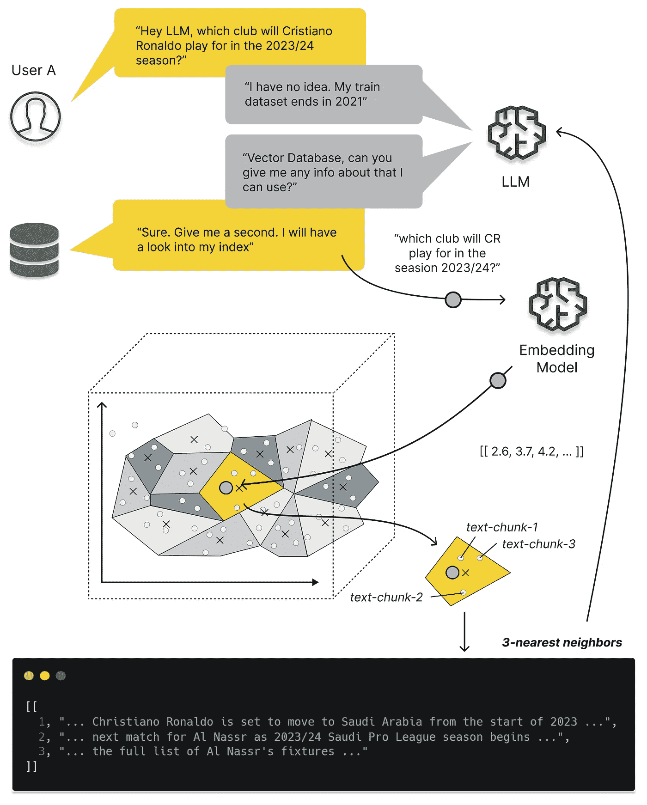

# 关于向量数据库的所有信息以及如何使用它们来增强你的 LLM 应用

> 原文：[`towardsdatascience.com/all-you-need-to-know-about-vector-databases-and-how-to-use-them-to-augment-your-llm-apps-596f39adfedb?source=collection_archive---------0-----------------------#2023-09-17`](https://towardsdatascience.com/all-you-need-to-know-about-vector-databases-and-how-to-use-them-to-augment-your-llm-apps-596f39adfedb?source=collection_archive---------0-----------------------#2023-09-17)

## 逐步指南：发现并利用向量数据库的强大功能

 [Dominik Polzer](https://dmnkplzr.medium.com/?source=post_page-----596f39adfedb--------------------------------)

·

[关注](https://medium.com/m/signin?actionUrl=https%3A%2F%2Fmedium.com%2F_%2Fsubscribe%2Fuser%2F3ab8d3143e32&operation=register&redirect=https%3A%2F%2Ftowardsdatascience.com%2Fall-you-need-to-know-about-vector-databases-and-how-to-use-them-to-augment-your-llm-apps-596f39adfedb&user=Dominik+Polzer&userId=3ab8d3143e32&source=post_page-3ab8d3143e32----596f39adfedb---------------------post_header-----------) 发表在 [Towards Data Science](https://towardsdatascience.com/?source=post_page-----596f39adfedb--------------------------------) ·24 分钟阅读·2023 年 9 月 17 日

--

为什么我们需要向量存储来支持 LLM 应用 — 图片来源于作者

# 目录

**介绍**

向量数据库有何特别之处？

我们如何将句子的含义映射到数值表示？

这如何帮助我们的 LLM 应用？

为什么我们不能直接将所有数据提供给 LLM？

**实践教程 — 文本到嵌入和距离度量**

1\. 文本转嵌入

2\. 使用 PCA 将 384 维数据绘制到 2 维

3\. 计算距离度量

**面向向量存储**

如何加速相似度搜索？

我们可以选择哪些不同的向量存储？

**动手教程 — 设置你的第一个向量存储**

1\. 安装 chroma

2\. 获取/创建一个 chroma 客户端和集合

3\. 将一些文本文件添加到集合中

4\. 将数据库中的所有条目提取到 Excel 文件

5\. 查询集合
