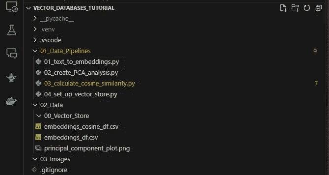
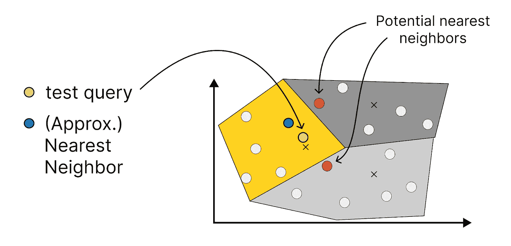

# 关于向量数据库及其如何增强你的 LLM 应用，你需要了解的一切

> 原文：[`towardsdatascience.com/all-you-need-to-know-about-vector-databases-and-how-to-use-them-to-augment-your-llm-apps-596f39adfedb`](https://towardsdatascience.com/all-you-need-to-know-about-vector-databases-and-how-to-use-them-to-augment-your-llm-apps-596f39adfedb)

## 逐步指南：发现并利用向量数据库的力量

[](https://dmnkplzr.medium.com/?source=post_page-----596f39adfedb--------------------------------)[](https://towardsdatascience.com/?source=post_page-----596f39adfedb--------------------------------) [Dominik Polzer](https://dmnkplzr.medium.com/?source=post_page-----596f39adfedb--------------------------------)

·发布于[Towards Data Science](https://towardsdatascience.com/?source=post_page-----596f39adfedb--------------------------------) ·24 分钟阅读·2023 年 9 月 17 日

--


为什么我们需要用于 LLM 应用的向量存储——作者提供的图片

# 目录

**简介**

向量数据库有什么特别之处？

我们如何将句子的含义映射为数值表示？

这对我们的 LLM 应用有什么帮助？

为什么我们不能直接将所有数据提供给 LLM？

**动手教程——文本到嵌入和距离度量**

1\. 文本到嵌入

2\. 使用 PCA 在 2 维中绘制 384 个维度

3\. 计算距离度量

**迈向向量存储**

如何加速相似性搜索？

我们可以选择哪些不同的向量存储？

**动手教程——设置你的第一个向量存储**

1\. 安装 chroma

2\. 获取/创建 chroma 客户端和集合

3\. 将一些文本文档添加到集合中

4\. 从数据库中提取所有条目到 Excel 文件

5\. 查询集合

**总结****参考文献**

向量数据库目前是一个热门话题。公司们不断筹集资金以开发他们的向量数据库，或为现有的 SQL 或 NoSQL 数据库添加向量搜索功能。


向量存储资助——作者提供的图片（Chroma，2023；Cook，2022；Miller，2022）

# 向量数据库有什么特别之处？

向量数据库使得快速搜索和比较大量向量变得可能。这非常有趣，因为最新的嵌入模型能够高度理解单词背后的语义/含义，并将其转换为向量。这使得我们能够高效地比较句子之间的关系。

**好吧，但我们为什么要关心这个呢？**

对于大多数大型语言模型（LLM）应用程序，我们依赖于这种能力，因为我们的 LLM 不可能知道一切。它仅仅看到的是世界的一个冻结版本，这取决于 LLM 的训练数据集。


为什么 LLM 应用需要向量存储 — 作者提供的图片

因此，我们需要为模型提供额外的数据，这些信息是 LLM 自己不可能知道的。而且所有这些都需要在应用程序的运行时完成。所以我们必须有一个过程，尽可能快地决定我们要为模型提供哪些额外数据。

使用传统的关键词搜索，我们会遇到限制，主要是因为两个问题：

+   **语言是复杂的。在大多数语言中，你可以用 20 种不同的方式提出相同的问题。** 仅仅搜索关键词通常是不够的。我们需要一种将单词和句子背后的含义映射到相关内容的方式。

+   我们还需要确保搜索在毫秒级完成，而不是秒或分钟。因此，我们需要一个步骤，以尽可能高效地搜索向量集合。

# 首先 — 我们如何将句子的含义映射到数值表示？

在我们能够搜索数据库之前，我们需要将文本内容转换为捕捉单词和句子含义的向量。来自 OpenAI、Google、MetaAI 或开源社区的预训练嵌入模型帮助我们做到这一点。它们从大量文本语料库中学习单词的常见用法及其上下文。它们利用这些提取的知识将单词映射到多维向量空间中。新数据点在向量空间中的位置告诉我们哪些单词彼此相关。

在下面的简单示例中，我们将各种水果和蔬菜的“意义”排列在一个简单的二维向量空间中。如果嵌入模型正常工作，我们期望苹果和梨比苹果和洋葱更接近（至少，这就是我根据对语言和水果的有限了解所期望的）。相似性可以受到各种特征的影响。对于水果和蔬菜，这可能包括：大小、颜色、味道、原产国等。这一切都取决于你想描述的对象。


不同类型水果和蔬菜之间的相似度评分 — 作者提供的图片

嵌入模型通过观察词汇在上下文中的使用方式来学习，这类似于人类学习语言的方式。你在成长过程中，通过听对话和阅读书籍来学习词汇的含义。

我们模型的训练过程并没有太大不同。经过训练后，它学会了“pears and apples”更可能在一个句子中出现，而不是“apples and onions”，因此它认为它们有某些共同点。因此，在涉及食物时，最重要的可能是不同类型的食物是否一起食用。

对象、词汇和句子具有许多不适合二维空间的特征。为了解决这个问题，现代嵌入模型将词汇和句子转化为具有数百或数千维的向量。

通过将我们的内容转化为向量，我们可以测量它们之间的距离。下面的二维示例很简单，但当向量具有数百或数千维时，它可能变得更复杂，需要更多的计算能力。

> **这就是向量数据库发挥作用的地方**。

他们结合了几种技术，允许我们高效地存储和搜索我们的文本内容集合。一旦我们拥有了向量集合，我们希望将它们相互比较，并以某种方式量化它们之间的相似性。通常我们对 k-最近邻感兴趣，所以我们在向量空间中最接近查询向量的数据点。在下面的示例中，我们的查询将是“apple”这个词。但当然不是“apple”这个词本身，我们使用的是从嵌入模型中得到的向量。


不同种类的水果和蔬菜之间的相似度分数 — 图片由作者提供

# **这对我们的 LLM 应用有什么帮助？**

当 LLM 自身达到知识的极限时，我们在许多 LLM 应用中使用这种方法：

LLM 自带的不具备的知识：

+   **数据过于新颖** — 关于时事、最近的创新等的文章。即在 LLM 训练集收集之后创建的任何新内容。

+   **数据不公开** — 个人数据、公司内部数据、机密数据等。


LLM 知道什么和不知道什么 — 图片由作者提供

# **我们为什么不能直接给模型所有的数据？**

*简短回答：* 模型有一个限制，即令牌限制。

如果我们不想训练或微调模型，我们必须在提示中提供所有必要的信息。我们必须尊重模型的令牌限制。


LLMs 及其令牌限制 — 图片由作者提供

LLM 的令牌限制**出于实际和技术原因**。OpenAI 最新的模型令牌限制大约为 4,000–32,000 个令牌，而开源 LLM LLama 的令牌限制为 2,048 个令牌（如果未经过微调）。您可以通过微调来增加最大令牌数，但更多的数据不一定更好。32,000 个令牌的限制允许我们一次性将大量文本打包到提示中。这是否合理是另一回事。（Lample, 2023; OpenAI, 2023）

数据的质量比数据的数量更为重要，无关的数据可能对结果产生负面影响。

甚至在提示中重新组织信息也可以显著影响 LLM 理解任务的准确性。斯坦福大学的研究人员发现，当重要信息位于提示的开头或结尾时，答案通常更准确。如果相同的信息位于提示的中间，准确性可能会显著下降。我们必须仔细考虑提供给模型的数据以及如何构建提示。（Liu et al., 2023; Raschka, 2023）


LLM 如何理解提示 — 图像由作者提供

*输入数据的质量对我们 LLM 应用的成功至关重要，因此实施一个准确识别相关内容并避免添加过多不必要数据的过程是必要的。为确保这一点，我们必须使用有效的搜索过程来突出最相关的信息。*

# 向量数据库如何帮助我们实现这一点？

向量数据库由多个部分组成，这些部分帮助我们快速找到所需的信息。索引是最重要的部分，只需在将新数据插入数据集时进行一次。之后，搜索会快得多，节省了时间和精力。


向量数据库及其组成部分 — 图像由作者提供

要将数据输入到我们的向量数据库中，我们首先需要将所有内容转换为向量。正如本文第一部分所述，我们可以使用所谓的嵌入模型。由于更方便，我们通常使用 OpenAI、Google 等公司的现成服务。

在下图中，您可以看到一些可供选择的嵌入模型。


可用的嵌入模型集合 — 图像由作者提供

# 实践教程 — 文本到向量

以我们的示例为例，我们需要使用 Hugging Face API 和句子转换器模型“all-MiniLM-L6-v2”。要开始使用，只需访问 [`huggingface.co/settings/tokens`](https://huggingface.co/settings/tokens) 并获取您的令牌。

使用下面的代码片段，我们：

1.  将文本片段转换为 384 维的向量（取决于您使用的嵌入模型）。这使我们能够在向量中捕捉句子的含义。

1.  然后我们可以通过计算句子之间的距离来识别数据点之间的相似性。

1.  为了在一个简单的二维图中可视化，我们使用主成分分析将 384 维缩减为两个维度。这可能会导致大量信息丢失，但值得一试！

在下面的示例中，我生成了 10 个随机样本句子：

```py
text_chunks = [
    "The sky is blue.",
    "The grass is green.",
    "The sun is shining.",
    "I love chocolate.",
    "Pizza is delicious.",
    "Coding is fun.",
    "Roses are red.",
    "Violets are blue.",
    "Water is essential for life.",
    "The moon orbits the Earth.",
]
```

如果你想自己尝试这个教程，我已将步骤拆分为可以独立运行的数据管道。

使用**.venv**创建一个新的虚拟环境：

安装“requirements.txt”中的所有模块：

> **pip install -r requirements.txt**

```py
anyio==4.0.0
backoff==2.2.1
bcrypt==4.0.1
certifi==2023.7.22
charset-normalizer==3.2.0
chroma-hnswlib==0.7.3
chromadb==0.4.10
click==8.1.7
colorama==0.4.6
coloredlogs==15.0.1
contourpy==1.1.1
cycler==0.11.0
exceptiongroup==1.1.3
fastapi==0.99.1
filelock==3.12.4
flatbuffers==23.5.26
fonttools==4.42.1
fsspec==2023.9.1
h11==0.14.0
httptools==0.6.0
huggingface-hub==0.16.4
humanfriendly==10.0
idna==3.4
importlib-resources==6.0.1
joblib==1.3.2
kiwisolver==1.4.5
matplotlib==3.8.0
monotonic==1.6
mpmath==1.3.0
numpy==1.26.0
onnxruntime==1.15.1
overrides==7.4.0
packaging==23.1
pandas==2.1.0
Pillow==10.0.1
posthog==3.0.2
protobuf==4.24.3
pulsar-client==3.3.0
pydantic==1.10.12
pyparsing==3.1.1
PyPika==0.48.9
pyreadline3==3.4.1
python-dateutil==2.8.2
python-dotenv==1.0.0
pytz==2023.3.post1
PyYAML==6.0.1
requests==2.31.0
scikit-learn==1.3.0
scipy==1.11.2
six==1.16.0
sniffio==1.3.0
starlette==0.27.0
sympy==1.12
threadpoolctl==3.2.0
tokenizers==0.14.0
tqdm==4.66.1
typing_extensions==4.7.1
tzdata==2023.3
urllib3==2.0.4
uvicorn==0.23.2
watchfiles==0.20.0
websockets==11.0.3
```

如果你想跟随教程，你可以简单地设置一个类似的文件夹结构，包括一个数据管道文件夹和数据文件夹（或者在管道中更改.csv 文件的路径）。



数据管道概述 — 作者提供的截图

## 1\. 文本到嵌入

第一个管道“01_text_to_embeddings.py”使用嵌入模型转换 10 个样本句子。结果保存在一个名为“embeddings_df”的数据框中，然后导出到名为“embeddings_df.csv”的 CSV 文件中。确保用你自己的 token 替换 HuggingFace Token。


从文本块到嵌入 — 作者提供的图像

```py
##########################################################################################################
'''
The following script translates the list of strings "text_chunks" into vector embeddings and
saves the DataFrame including "text_chunks" and "embeddings" in the csv file "embeddings_df.csv"
'''
##########################################################################################################

import os
import requests
import pandas as pd
import numpy as np

# hugging face token
os.environ['hf_token'] = os.environ.get('HF_TOKEN')
# os.environ['hf_token'] = 'testtoken123'

# example text snippets we want to translate into vector embeddings
text_chunks = [
    "The sky is blue.",
    "The grass is green.",
    "The sun is shining.",
    "I love chocolate.",
    "Pizza is delicious.",
    "Coding is fun.",
    "Roses are red.",
    "Violets are blue.",
    "Water is essential for life.",
    "The moon orbits the Earth.",
]

def _get_embeddings(text_chunk):
    '''
    Use embedding model from hugging face to calculate embeddings for the text snippets provided

    Parameters:
        - text_chunk (string): the sentence or text snippet you want to translate into embeddings

    Returns:
        - embedding(list): list with all embedding dimensions
    '''
    # define the embedding model you want to use
    model_id = "sentence-transformers/all-MiniLM-L6-v2"

    # you can find the token to the hugging face api in your settings page https://huggingface.co/settings/tokens
    hf_token = os.environ.get('hf_token')

    # API endpoint for embedding model
    api_url = f"https://api-inference.huggingface.co/pipeline/feature-extraction/{model_id}"
    headers = {"Authorization": f"Bearer {hf_token}"}

    # call API
    response = requests.post(api_url, headers=headers, json={"inputs": text_chunk, "options":{"wait_for_model":True}})

    # load response from embedding model into json format
    embedding = response.json()

    return embedding

def from_text_to_embeddings(text_chunks):
    '''
    Translate sentences into vector embeddings

    Attributes:
        - text_chunks (list): list of example strings

    Returns:
        - embeddings_df (DataFrame): data frame with the columns "text_chunk" and "embeddings"
    '''
    # create new data frame using text chunks list
    embeddings_df = pd.DataFrame(text_chunks).rename(columns={0:"text_chunk"})

    # use the _get_embeddings function to retrieve the embeddings for each of the sentences
    embeddings_df["embeddings"] = embeddings_df["text_chunk"].apply(_get_embeddings)

    # split the embeddings column into individuell columns for each vector dimension
    embeddings_df = embeddings_df['embeddings'].apply(pd.Series)
    embeddings_df["text_chunk"] = text_chunks

    return embeddings_df

# get embeddings for each of the text chunks
embeddings_df = from_text_to_embeddings(text_chunks)

# save data frame with text chunks and embeddings to csv
embeddings_df.to_csv('../02_Data/embeddings_df.csv', index=False)
```

现在你应该能在“02_Data”文件夹中找到名为“embeddings_df.csv”的 csv 文件。它应该类似于以下内容：


## 2\. 使用主成分分析将 384 维向量绘制为 2 维

现在你已经在“02_Data”文件夹中拥有了包含向量的 csv 文件“embeddings_df.csv”，让我们尝试可视化它。我们可以使用主成分分析提取两个最重要的“主成分”并进行可视化。我们不能在二维中捕捉所有的原始信息，但也许它能给我们一个在将文本转换为向量时发生了什么的感觉。


将主成分分析应用于嵌入向量 — 作者提供的图像

为第二个管道创建一个新文件，我称之为：**“02_create_PCA_analysis.py”**

第二个管道包含：

1.  从“embeddings_df.csv”加载嵌入

1.  使用 scikit-learn 执行主成分分析以创建和查找两个最重要的（主）成分

1.  创建一个散点图在二维图中可视化结果

```py
##########################################################################################################
# Create PCA plot using embeddings df
##########################################################################################################
import pandas as pd
from sklearn.decomposition import PCA
import matplotlib.pyplot as plt

def create_pca_plot(embeddings_df):
    '''
    The function performs a principal component analysis to reduce the dimensions to 2 so we can print them in a plot

    Parameters
        - embeddings_df (DataFrame): data frame with the columns "text_chunk" and "embeddings"

    Returns
        - df_reduced (DataFrame): data frame with the 2 most relevant Principal Components
    '''
    # Perform PCA with 2 components
    pca = PCA(n_components=2)

    # apply principal component analysis to the embeddings table
    df_reduced = pca.fit_transform(embeddings_df[embeddings_df.columns[:-2]])

    # Create a new DataFrame with reduced dimensions
    df_reduced = pd.DataFrame(df_reduced, columns=['PC1', 'PC2'])

    ############################################################################################
    # Create a scatter plot
    ############################################################################################
    def create_scatter_plot(df_reduced):
        plt.scatter(df_reduced['PC1'], df_reduced['PC2'], label=df_reduced['PC2'])

        # Add labels and title
        plt.xlabel('X')
        plt.ylabel('Y')
        plt.title('Scatter Plot')

        # Add labels to each dot
        for i, label in enumerate(embeddings_df.iloc[: , -1].to_list()):
            plt.text(df_reduced['PC1'][i], df_reduced['PC2'][i], label)

        # Save and display the plot
        plt.savefig('../02_Data/principal_component_plot.png', format='png')

    # create and save scatter plot
    create_scatter_plot(df_reduced=df_reduced)

    return df_reduced

# Load embeddings_df.csv into data frame
embeddings_df = pd.read_csv('../02_Data/embeddings_df.csv')

# use the function create_pca_plot to
df_reduced = create_pca_plot(embeddings_df)
```


截图仓库

我不确定这个示例有多好，但你至少可以看到，关于食物和饮料的句子倾向于位于图的右侧，描述天气的两个句子在左侧靠近，而关于花卉的两个句子在图的底部靠近。我把这作为一种“非科学性”的证据，证明该模型在一定程度上成功地映射了词语/短语背后的语义。


句子到向量（前两个主成分） — 作者提供的图像

作为人类，当数据点绘制在简单的二维空间中时，判断哪些点更接近是相对容易的。但是我们如何在有数百或数千维的向量空间中量化这一点？——我们需要一个度量，一个描述相似度的度量。因此，我们计算空间中点之间的距离。

## 3\. 计算距离

> **距离是如何定义的？**

在统计学中，我们有几种度量数据点之间距离的指标。一个常用的指标是“余弦相似度”。我们将在下面的示例中使用这个指标。


不同的距离度量 — 作者提供的图像

我们在向量数据库中要做的是尽可能快地找到相似条目。但是什么使得向量数据库如此特别，为什么我们不能仅仅通过计算与每个数据点的距离指标来进行相似度搜索呢？

为了更容易理解为什么我们需要另一种方法，我创建了一个简单的过程来找到最接近的数据点。它通过计算与每个数据点的距离，然后对其进行排序以找到最近的邻居。

对于下面的示例，我们使用了之前在这篇文章中已经转换为向量格式的 10 段文本。

因此，我们数据库的一个常见查询可能如下所示：

假设我们有一个新的句子（用户查询），这里是：**“百合是白色的。”**

+   首先，我们获取新句子的嵌入向量。这个向量给了我们在嵌入空间中的位置，使我们可以将它们与我们集合中的其他文本块进行比较。


距离作为相似度分数 — 作者提供的图像

+   然后我们计算与每个数据点的距离（这里指：余弦相似度）。


计算与查询向量的余弦相似度 — 作者提供的图像

+   通常，我们对最近的 k 个邻居感兴趣。我们只是过滤出与我们的新查询向量距离最小的那些。

对于这个简单的示例，我们使用句子“百合是白色的。”并尝试通过计算它们之间的距离来描述与数据集中其他句子的相似度。

为此，我们创建了第三个管道，我称之为：**“03_calculate_cosine_similarity.py”**

```py
##########################################################################################################
# Calculate cosine similarity between the query vector and all other embedding vectors
##########################################################################################################
import numpy as np
from numpy.linalg import norm
import time
import pandas as pd
import os
import requests

def _get_embeddings(text_chunk):
    '''
    Use embedding model from hugging face to calculate embeddings for the text snippets provided

    Parameters:
        - text_chunk (string): the sentence or text snippet you want to translate into embeddings

    Returns:
        - embedding(list): list with all embedding dimensions
    '''
    # define the embedding model you want to use
    model_id = "sentence-transformers/all-MiniLM-L6-v2"

    # you can find the token to the hugging face api in your settings page https://huggingface.co/settings/tokens
    hf_token = os.environ.get('HF_TOKEN')

    # API endpoint for embedding model
    api_url = f"https://api-inference.huggingface.co/pipeline/feature-extraction/{model_id}"
    headers = {"Authorization": f"Bearer {hf_token}"}

    # call API
    response = requests.post(api_url, headers=headers, json={"inputs": text_chunk, "options":{"wait_for_model":True}})

    # load response from embedding model into json format
    embedding = response.json()

    return embedding

def calculate_cosine_similarity(text_chunk, embeddings_df):
    '''
    Calculate the cosine similarity between the query sentence and every other sentence
    1\. Get the embeddings for the text chunk
    2\. Calculate the cosine similarity between the embeddings of our text chunk und every other entry in the data frame

    Parameters:
        - text_chunk (string): the text snippet we want to use to look for similar entries in our database (embeddings_df)
        - embeddings_df (DataFrame): data frame with the columns "text_chunk" and "embeddings"
    Returns:
        -
    '''

    # use the _get_embeddings function the retrieve the embeddings for the text chunk
    sentence_embedding = _get_embeddings(text_chunk)

    # combine all dimensions of the vector embeddings to one array
    embeddings_df['embeddings_array'] = embeddings_df.apply(lambda row: row.values[:-1], axis=1)

    # start the timer
    start_time = time.time()
    print(start_time)

    # create a list to store the calculated cosine similarity
    cos_sim = []

    for index, row in embeddings_df.iterrows():
        A = row.embeddings_array
        B = sentence_embedding

        # calculate the cosine similarity
        cosine = np.dot(A,B)/(norm(A)*norm(B))

        cos_sim.append(cosine)

    embeddings_cosine_df = embeddings_df
    embeddings_cosine_df["cos_sim"] = cos_sim
    embeddings_cosine_df.sort_values(by=["cos_sim"], ascending=False)

    # stop the timer
    end_time = time.time()

    # calculate the time needed to calculate the similarities
    elapsed_time = (end_time - start_time)
    print("Execution Time: ", elapsed_time, "seconds")

    return embeddings_cosine_df

# Load embeddings_df.csv into data frame
embeddings_df = pd.read_csv('../02_Data/embeddings_df.csv')

# test query sentence
text_chunk = "Lilies are white."

# calculate cosine similarity
embeddings_cosine_df = calculate_cosine_similarity(text_chunk, embeddings_df)

# save data frame with text chunks and embeddings to csv
embeddings_cosine_df.to_csv('../02_Data/embeddings_cosine_df.csv', index=False)

# rank based on similarity
similarity_ranked_df = embeddings_cosine_df[["text_chunk", "cos_sim"]].sort_values(by=["cos_sim"], ascending=False)
```


计算出的相似度 — 作者提供的截图

如果我们查看相似度分数，“‘紫罗兰是蓝色的。’”和“‘玫瑰是红色的。’”与我们的查询句子“‘百合是白色的。’”相比，显著地更相似，而“‘编程很有趣。’”则不然。

有道理，我想。

**相似度搜索似乎有效。那么我们为什么还需要另一种方法呢？**

使用*time.time()*函数，我记录了计算我们查询向量与其他 10 个向量之间的余弦相似度所需的时间。

根据这个方法，搜索我们这 10 条数据大约需要 0.005 秒。


将每一个点与其他每一个点进行比较被称为“穷举搜索”，这种方法需要线性时间。例如，如果比较 10 个点需要 0.005 秒，那么比较 100 万条文本数据可能需要几分钟。


穷举搜索的计算时间 — 作者提供的图片

我们需要找到一种高效的方法来加快相似性搜索过程。

## 如何加速相似性搜索？

近似最近邻算法用于寻找最接近的邻居，即使它们可能不是最准确的。这种将准确性与速度进行权衡的做法通常对于 LLM 应用是可以接受的，因为速度更重要，而且通常相同的信息会出现在多个文本片段中。 [(Trabelsi, 2021)](https://www.zotero.org/google-docs/?GbBH8V=)

我认为对于普通用户来说，对索引技术有深入了解并不是必要的。但我不想让你完全不了解。为了让你至少对这些技术有一个基本的了解，这里有一个如何使用倒排文件索引的例子。这样，你可以了解使用这些技术时可能会丢失的准确性。

倒排文件索引（IFV）是一种流行的找到不同项目之间相似性的方法。它通过创建一个数据库索引来存储内容，并将其连接到表格或文档中的位置。我们将整个项目集合分成多个分区及其质心。每个项目一次只能属于一个分区。当我们进行相似性搜索时，使用分区质心来快速找到我们所寻找的项目。


使用倒排文件索引（IFV）进行近似最近邻搜索 — 作者提供的图片

如果我们在寻找附近的点，通常只会在离我们点最近的质心中进行搜索。但如果有些点靠近邻近质心的边缘，我们可能会错过它们。



使用 ANN 算法时我们丢失的信息 — 作者提供的图片

为了避免这个问题，我们搜索多个分区，而不是仅仅一个。然而，根本问题仍然存在。我们会失去一些准确性。但通常这是可以接受的，速度更为重要。

Chroma 支持多种近似最近邻（ANN）算法，包括 HNSW、IVFADC 和 IVFPQ。 [(Yadav, 2023)](https://www.zotero.org/google-docs/?k2HoPI=)

+   **层次导航小世界（HNSW）：** HNSW 是一种创建层次图结构的算法，用于快速存储和搜索高维向量，同时内存使用最小化。

+   **倒排文件与产品量化（IVFPQ）：** IVFPQ 使用产品量化在索引之前压缩向量，从而实现高准确度的搜索，能够处理大规模数据集。


最常用的近似最近邻算法之一 — 作者提供的图片

如果你想详细了解不同的索引方法是如何工作的，我可以推荐 [James Briggs](https://www.youtube.com/watch?v=QvKMwLjdK-s) 的 YouTube 频道。我也喜欢 [Peggy Chang](https://peggy1502.medium.com/) 的关于倒排文件索引（IVF）、产品量化（PQ）等的博客文章。

**什么对我们真正重要？**

我认为我们需要知道的是，通过索引步骤，我们将嵌入以一种允许我们快速找到“相似”向量的形式存储，而不需要每次都计算与所有数据点的距离。通过这样做，我们在速度和准确性之间做了权衡。


如何在向量存储中存储文本 — 作者提供的图片

任务的准确性对于我们尝试做的大多数事情来说仍然足够好。毕竟，将语言转换为嵌入并不是一门精确的科学。相同的词语在不同的上下文或世界不同地区中可能具有不同的含义。因此，如果我们丢失了一些准确性点通常是可以接受的，但更重要的是响应的速度。

Google 快速的响应时间是其成功的关键。每个过程步骤的速度对于我们的应用尤其重要，因为我们不仅需要执行向量搜索，还需要将问题和上下文传递给我们的 LLM。

不过，这个过程比 Google 稍微长一些，这也是（我猜）为什么 Bing Chat（及其 LLM 支持）尚未征服世界的原因。它只比 Google 慢几毫秒或几秒，但这一小点差距足以让 Google 继续领先。

**为了说明这些步骤 — 假设我们想要创建一个像 Bing Chat 这样的聊天机器人**

我们仍然有（传统的）搜索部分，它寻找最相关的内容和新闻。只有当我们找到一些常见结果时，我们才将它们提供给我们的 LLM，让它解释数据并形成一个合理的回答。


使用 LLM 模型的聊天机器人流程图 — 作者提供的图片

我们的向量存储负责在加载数据时进行分词、嵌入和索引。一旦数据进入存储，我们可以用新的数据点进行查询。

## **假设我们决定使用向量存储 — 我们有哪些选项？**

向量数据库有不同的形态。我们区分：

+   纯向量数据库

+   SQL、NoSQL 或文本搜索数据库中的扩展功能

+   简单向量库


不同类型的向量存储 — 作者提供的图片

**文本搜索数据库**可以在大量文本中搜索特定的单词或短语。最近，这些数据库中的一些开始使用向量搜索，以进一步提升找到所需内容的能力。在上届[微软开发者大会](https://www.youtube.com/watch?v=5Qaxz2e2dVg&t=584s)上，Elasticsearch 解释了他们如何结合传统搜索和向量搜索来创建一个“混合评分”系统，从而提供最佳的搜索结果。


Elasticsearch：结合传统搜索和向量搜索改善搜索结果 — 作者提供的图片

向量搜索也逐渐被越来越多的**SQL 和 NoSQL 数据库，如 Redis、MongoDB 或 Postgres** 采用。例如，Pgvector 是用于 Postgres 的开源向量相似性搜索工具。它支持 (Github, 2023):

+   精确和近似最近邻搜索

+   L2 距离、内积和余弦距离

对于较小的项目，**向量库**是一个很好的选择，提供了大部分所需的功能。

**Facebook AI Research 在 2017 年发布了第一个向量库之一，FAISS**。FAISS 是一个高效搜索和聚类密集向量的库，能够处理任何大小的向量集，即使那些无法完全载入内存的向量集也不在话下。它用 C++ 编写，并配有 Python 封装，使数据科学家能够轻松集成到他们的代码中。（FAISS 文档, 2023）


向量存储的演变 — 作者提供的图片

**另一方面，Chroma、Pinecone、Weaviate 是纯粹的向量数据库**，可以存储您的向量数据，并像其他数据库一样进行搜索。在本文中，我将教您如何使用 Chroma 设置一个向量数据库，并如何将您的向量数据填充其中。如果您在寻找快速解决方案，像 FAISS 这样的向量库可以帮助您轻松开始，提供所有必要的索引方法。

**那么我们应该选择哪个？**

我想你们需要为自己的具体项目回答这个问题，但不要让事情变得过于复杂。Andre Karpathy 在 Twitter 上这样描述了它：（Andrej Karpathy, 2023）：

> “Np.array — 现在人们对复杂的东西期望过高” — [Andrew Karpathy](https://twitter.com/karpathy/status/1647374645316968449?lang=de)

如果您只需要搜索几页 PDF 或文本文件，您可以简单地使用 np.array 或 pandas 数据框来存储您的嵌入。向量数据库的能力在处理数百、数千或数百万个向量时变得有趣，这些向量我们希望定期搜索。本文中，我使用的是 Chroma，但相同的原理适用于所有数据库。

# 实操教程 — 设置您的第一个向量存储

为了将我们的内容存储为向量并提高相似性搜索的性能，我们需要建立自己的向量数据库。Chroma 是一个很好的开源选择，因为它可以免费使用并且具有 Apache 2.0 许可证。其他选择，如 FAISS、Weaviate 和 Pinecone，也存在。这些选项中有些是开源并且可以免费使用的，而有些则仅作为商业服务提供。

只需几个步骤，我们就能让 chromadb 运行起来。我们需要做的就是使用我们的包管理器**pip**下载**chromadb**库。一旦我们有了它，我们就可以开始设置我们的第一个向量存储数据库并开始使用。

## 1\. 安装 chroma

[`pypi.org/project/chromadb/`](https://pypi.org/project/chromadb/)

```py
pip install chromadb
```

## 2\. 获取/创建一个 chroma 客户端和集合

集合是你嵌入、文档和任何附加元数据的指定存储。如果你想保存它，以便以后使用你的索引和集合，你可以使用“persist_directory”


从文本块到嵌入 — 作者插图

```py
import chromadb
from chromadb.config import Settings
import pandas as pd

# vector store settings
VECTOR_STORE_PATH = r'../02_Data/00_Vector_Store'
COLLECTION_NAME = 'my_collection'

# Load embeddings_df.csv into data frame
embeddings_df = pd.read_csv('../02_Data/embeddings_df.csv')

def get_or_create_client_and_collection(VECTOR_STORE_PATH, COLLECTION_NAME):
    # get/create a chroma client
    chroma_client = chromadb.PersistentClient(path=VECTOR_STORE_PATH)

    # get or create collection
    collection = chroma_client.get_or_create_collection(name=COLLECTION_NAME)

    return collection

# get or create collection
collection = get_or_create_client_and_collection(VECTOR_STORE_PATH, COLLECTION_NAME)
```

## 3\. 向集合中添加一些文本文档

Chroma 使得存储和组织你的文本文档变得容易。它为你处理标记化、嵌入和索引过程，如果你已经创建了自己的嵌入，你可以将它们直接加载到 Chroma 的向量存储中。

我们想将已经创建的数据框“embeddings_df”存储到我们的新数据存储中：

```py
# Load embeddings_df.csv into data frame
embeddings_df = pd.read_csv('../02_Data/embeddings_df.csv')

def add_to_collection(embeddings_df):
    # add a sample entry to collection
    # collection.add(
    #     documents=["This is a document", "This is another document"],
    #     metadatas=[{"source": "my_source"}, {"source": "my_source"}],
    #     ids=["id1", "id2"]
    # )

    # combine all dimensions of the vector embeddings to one array
    embeddings_df['embeddings_array'] = embeddings_df.apply(lambda row: row.values[:-1], axis=1)
    embeddings_df['embeddings_array'] = embeddings_df['embeddings_array'].apply(lambda x: x.tolist())

    # add data frame to collection
    collection.add(
        embeddings=embeddings_df.embeddings_array.to_list(),
        documents=embeddings_df.text_chunk.to_list(),
        # create a list of string as index
        ids=list(map(str, embeddings_df.index.tolist()))
    )

# add the embeddings_df to our vector store collection
add_to_collection(embeddings_df)
```


## 4\. 从数据库提取所有条目到 Excel 文件

如果你想导出向量存储中的所有条目，可以使用：

```py
def get_all_entries(collection):
    # query collection
    existing_docs = pd.DataFrame(collection.get()).rename(columns={0: "ids", 1:"embeddings", 2:"documents", 3:"metadatas"})
    existing_docs.to_excel(r"..//02_Data//01_vector_stores_export.xlsx")
    return existing_docs

# extract all entries in vector store collection
existing_docs = get_all_entries(collection)
```

## 5\. 查询集合

Chroma 使得查找与查询文本最相似的***n***个结果变得容易：

```py
def query_vector_database(VECTOR_STORE_PATH, COLLECTION_NAME, query, n=2):
    # query collection
    results = collection.query(
        query_texts=query,
        n_results=n
    )

    print(f"Similarity Search: {n} most similar entries:")
    print(results["documents"])
    return results

# similarity search
similar_vector_entries = query_vector_database(VECTOR_STORE_PATH, COLLECTION_NAME, query=["Lilies are white."])
```


对于这个例子，我们将返回向量存储中最相似的两个条目。

下面你可以找到一个总结

```py
##########################################################################################################
'''
Includes some functions to create a new vector store collection, fill it and query it
'''
##########################################################################################################
import chromadb
from chromadb.config import Settings
import pandas as pd

# vector store settings
VECTOR_STORE_PATH = r'../02_Data/00_Vector_Store'
COLLECTION_NAME = 'my_collection'

# Load embeddings_df.csv into data frame
embeddings_df = pd.read_csv('../02_Data/embeddings_df.csv')

def get_or_create_client_and_collection(VECTOR_STORE_PATH, COLLECTION_NAME):
    # get/create a chroma client
    chroma_client = chromadb.PersistentClient(path=VECTOR_STORE_PATH)

    # get or create collection
    collection = chroma_client.get_or_create_collection(name=COLLECTION_NAME)

    return collection

# get or create collection
collection = get_or_create_client_and_collection(VECTOR_STORE_PATH, COLLECTION_NAME)

def add_to_collection(embeddings_df):
    # add a sample entry to collection
    # collection.add(
    #     documents=["This is a document", "This is another document"],
    #     metadatas=[{"source": "my_source"}, {"source": "my_source"}],
    #     ids=["id1", "id2"]
    # )

    # combine all dimensions of the vector embeddings to one array
    embeddings_df['embeddings_array'] = embeddings_df.apply(lambda row: row.values[:-1], axis=1)
    embeddings_df['embeddings_array'] = embeddings_df['embeddings_array'].apply(lambda x: x.tolist())

    # add data frame to collection
    collection.add(
        embeddings=embeddings_df.embeddings_array.to_list(),
        documents=embeddings_df.text_chunk.to_list(),
        # create a list of string as index
        ids=list(map(str, embeddings_df.index.tolist()))
    )

# add the embeddings_df to our vector store collection
add_to_collection(embeddings_df)

def get_all_entries(collection):
    # query collection
    existing_docs = pd.DataFrame(collection.get()).rename(columns={0: "ids", 1:"embeddings", 2:"documents", 3:"metadatas"})
    existing_docs.to_excel(r"..//02_Data//01_vector_stores_export.xlsx")
    return existing_docs

# extract all entries in vector store collection
existing_docs = get_all_entries(collection)

def query_vector_database(VECTOR_STORE_PATH, COLLECTION_NAME, query, n=2):
    # query collection
    results = collection.query(
        query_texts=query,
        n_results=n
    )

    print(f"Similarity Search: {n} most similar entries:")
    print(results["documents"])
    return results

# similarity search
similar_vector_entries = query_vector_database(VECTOR_STORE_PATH, COLLECTION_NAME, query=["Lilies are white."])
```

我们将使用这些 k-最近邻来为我们的 LLM 提供数据。围绕它构建一个简单的提示模板，将找到的文本块插入其中，然后你可以将其发送到 GPT、LLama 或你选择的任何其他 LLM。我在[我之前的一篇文章中](https://example.org/all-you-need-to-know-to-build-your-first-llm-app-eb982c78ffac)描述了这如何工作

# **总结**

向量搜索越来越受欢迎，因为机器学习模型现在可以准确地将各种内容转换为向量。不仅越来越多的专用向量数据库出现，而且现有的 SQL、NoSQL 和文本搜索数据库也将向量搜索功能整合到其产品中。这是为了改善它们的搜索机制或为那些特别寻找具备向量搜索能力的数据库的用户提供产品。

对向量存储的兴趣只增不减。得益于近年来 Transformer 模型的进步，我们现在可以自信地将文本模块转换为向量。这在处理文本时解锁了数学上的各种可能性。

> *喜欢这个故事吗？*

+   [*免费订阅*](https://dmnkplzr.medium.com/subscribe) *以便在我发布新故事时获得通知。*

+   *想每月阅读超过 3 篇免费故事吗？ — 成为 Medium 会员，费用为 5 美元/月。注册时使用我的* [*推荐链接*](https://dmnkplzr.medium.com/membership) *，你可以支持我。我将获得佣金，而你无需支付额外费用。*

> *随时通过* [*LinkedIn*](https://www.linkedin.com/in/polzerdo/) *与我联系！*
> 
> 你可以在 [Github](https://github.com/polzerdo55862/vector-store-tutorial) 找到所有代码片段。祝玩得愉快 :)

# 参考文献

Andrej Karpathy. (2023 年 4 月 15 日). *@sinclanich np.array people keep reaching for much fancier things way too fast these days* [推文]. Twitter. [`twitter.com/karpathy/status/1647374645316968449`](https://twitter.com/karpathy/status/1647374645316968449)

Chroma. (2023 年 4 月 7 日). *Chroma 融资 1800 万美元种子轮*。 [`www.trychroma.com/blog/seed`](https://www.trychroma.com/blog/seed)

Cook, J. (2022 年 3 月 1 日). *SeMI Technologies 获得 1600 万美元 A 轮融资 — Business Leader News*。 Business Leader. [`www.businessleader.co.uk/semi-technologies-secures-16-million-in-series-a-round/`](https://www.businessleader.co.uk/semi-technologies-secures-16-million-in-series-a-round/)

Github. (2023 年 8 月 23 日). *Pgvector Github Repo*。 [`github.com/pgvector/pgvector`](https://github.com/pgvector/pgvector)

Lample, G. (2023 年 8 月 3 日). *关于 Llama 能够处理的最大 token 数量的查询 · Issue #148 · facebookresearch/llama*。 GitHub. [`github.com/facebookresearch/llama/issues/148`](https://github.com/facebookresearch/llama/issues/148)

Liu, N. F., Lin, K., Hewitt, J., Paranjape, A., Bevilacqua, M., Petroni, F., & Liang, P. (2023). *迷失在中间：语言模型如何使用长上下文* (arXiv:2307.03172)。 arXiv. [`arxiv.org/abs/2307.03172`](http://arxiv.org/abs/2307.03172)

Miller, R. (2022 年 3 月 29 日). *Pinecone 宣布为数据科学家量身定制的数据库完成 2800 万美元 A 轮融资 | TechCrunch*。 [`techcrunch.com/2022/03/29/pinecone-announces-28m-series-a-for-purpose-built-database-aimed-at-data-scientists/?guccounter=1&guce_referrer=aHR0cHM6Ly93d3cuZ29vZ2xlLmNvbS8&guce_referrer_sig=AQAAAMIKiexS9AALbi0ePIRFgGd-Ck3yS3U6t1VCv3yX_OwLRX-zH0-EVXFnHmq1wCH3blQOZncsBjmEU6H4LunP98AK7H_CJDYnILkchAazm6IF8SuDhf5On1JfywlFOfNC1teEpTpChfnEVt-lZ72KG0Y_yiUM5wdb6-I1-aUOtyiG`](https://techcrunch.com/2022/03/29/pinecone-announces-28m-series-a-for-purpose-built-database-aimed-at-data-scientists/?guccounter=1&guce_referrer=aHR0cHM6Ly93d3cuZ29vZ2xlLmNvbS8&guce_referrer_sig=AQAAAMIKiexS9AALbi0ePIRFgGd-Ck3yS3U6t1VCv3yX_OwLRX-zH0-EVXFnHmq1wCH3blQOZncsBjmEU6H4LunP98AK7H_CJDYnILkchAazm6IF8SuDhf5On1JfywlFOfNC1teEpTpChfnEVt-lZ72KG0Y_yiUM5wdb6-I1-aUOtyiG)

OpenAI. (2023 年 7 月 24 日). *OpenAI 平台*。 [`platform.openai.com`](https://platform.openai.com)

Raschka, S. (2023 年). *LinkedIn Sebastian Raschka*。 [`www.linkedin.com/posts/sebastianraschka_llm-ai-machinelearning-activity-7083427280605089792-MS_N/?utm_source=share&utm_medium=member_desktop`](https://www.linkedin.com/posts/sebastianraschka_llm-ai-machinelearning-activity-7083427280605089792-MS_N/?utm_source=share&utm_medium=member_desktop)

Trabelsi, E. (2021 年 9 月 8 日). *近似最近邻算法综合指南*。Medium。 [`towardsdatascience.com/comprehensive-guide-to-approximate-nearest-neighbors-algorithms-8b94f057d6b6`](https://towardsdatascience.com/comprehensive-guide-to-approximate-nearest-neighbors-algorithms-8b94f057d6b6)

Yadav, R. (2023 年 5 月 3 日). *对向量数据库系统的评估：特性与应用案例*。Medium。 [`blog.devgenius.io/an-evaluation-of-vector-database-systems-features-and-use-cases-9a90b05eb51f`](https://blog.devgenius.io/an-evaluation-of-vector-database-systems-features-and-use-cases-9a90b05eb51f)
