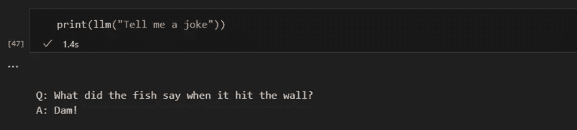

# 构建你的第一个 LLM 应用所需知道的一切

> 原文：[`towardsdatascience.com/all-you-need-to-know-to-build-your-first-llm-app-eb982c78ffac`](https://towardsdatascience.com/all-you-need-to-know-to-build-your-first-llm-app-eb982c78ffac)

## 一步一步的教程，涵盖文档加载器、嵌入、向量存储和提示模板

[](https://dmnkplzr.medium.com/?source=post_page-----eb982c78ffac--------------------------------)[](https://towardsdatascience.com/?source=post_page-----eb982c78ffac--------------------------------) [Dominik Polzer](https://dmnkplzr.medium.com/?source=post_page-----eb982c78ffac--------------------------------)

·发表于 [Towards Data Science](https://towardsdatascience.com/?source=post_page-----eb982c78ffac--------------------------------) ·阅读时长 26 分钟·2023 年 6 月 22 日

--


使用上下文注入构建自己的聊天机器人 — 作者图像

## 目录

> 如果你只是想找一个简短的教程，说明如何构建一个简单的 LLM 应用，你可以跳到第 “6\. 创建向量存储” 部分，在那里你可以找到构建最小化 LLM 应用所需的所有代码片段，包括向量存储、提示模板和 LLM 调用。

**简介**

为什么我们需要 LLM

微调 vs. 上下文注入

什么是 LangChain？

**逐步教程**

1\. 使用 LangChain 加载文档

2\. 将文档拆分成文本块

3\. 从文本块到嵌入

4\. 定义你想使用的 LLM

5\. 定义我们的提示模板

6\. 创建一个向量存储


目录

# 为什么我们需要 LLM

语言的发展使我们人类走得非常远。它使我们能够高效地分享知识并以我们今天所知道的形式进行合作。因此，我们大部分的集体知识仍然通过无组织的书面文本保存和传递。

在过去二十年里，数字化信息和过程的举措通常专注于在关系数据库中积累越来越多的数据。这种方法使传统的分析机器学习算法能够处理和理解我们的数据。

尽管我们广泛努力以结构化的方式存储越来越多的数据，但仍然无法捕获和处理我们全部的知识。

> **大约 80% 的公司数据是非结构化的，例如工作描述、简历、电子邮件、文本文件、PowerPoint 幻灯片、语音录音、视频和社交媒体**


企业中的数据分布 — 作者提供的图片

GPT3.5 的开发和进步标志着一个重要的里程碑，因为它使我们能够有效地解释和分析各种数据集，无论其结构如何。如今，我们拥有能够理解和生成多种内容形式的模型，包括文本、图像和音频文件。

> **那么我们如何利用它们的能力来满足我们的需求和数据呢？**

# 微调与上下文注入

一般来说，我们有两种基本的方法来使大型语言模型回答 LLM 无法知道的问题：**模型微调**和**上下文注入**

## **微调**

微调指的是使用额外的数据对现有的语言模型进行训练，以使其优化特定任务。

不同于从零开始训练语言模型，使用预训练模型如 BERT 或 LLama，并通过添加特定任务的训练数据来适应特定任务的需求。

斯坦福大学的一个团队使用了 LLM Llama，并通过使用 50,000 个用户/模型交互的示例对其进行了微调。结果是一个与用户互动并回答查询的聊天机器人。这一步微调改变了模型与最终用户的交互方式。

**→ 关于微调的误解**

PLLMs（预训练语言模型）的微调是一种调整模型以适应特定任务的方法，但它并不能真正将您的领域知识注入模型。这是因为模型已经在大量的通用语言数据上进行过训练，而您的特定领域数据通常不足以覆盖模型已经学到的内容。

因此，当你微调模型时，它可能偶尔会提供正确的答案，但它通常会失败，因为它在很大程度上依赖于在预训练期间学到的信息，这些信息可能不准确或与您的特定任务无关。换句话说，微调帮助模型适应它的交流方式，但不一定是它交流的内容。（保时捷股份公司，2023）

这就是上下文注入发挥作用的地方。

## **上下文学习 / 上下文注入**

在使用上下文注入时，我们并没有修改 LLM，而是专注于提示本身，并将相关的上下文注入到提示中。

因此，我们需要考虑如何为提示提供正确的信息。在下图中，您可以看到整个过程的示意图。我们需要一个能够识别最相关数据的过程。为此，我们需要使计算机能够比较文本片段。


我们非结构化数据中的相似性搜索 — 作者提供的图片

这可以通过嵌入（embeddings）来完成。通过嵌入，我们将文本转换为向量，从而允许我们在多维嵌入空间中表示文本。在空间中彼此更接近的点通常用于相同的上下文。为了防止这种相似性搜索耗时过长，我们将向量存储在向量数据库中并对其进行索引。

> 微软向我们展示了这可能如何在 Bing Chat 中实现。Bing 结合了 LLM 理解语言和上下文的能力与传统网络搜索的效率。

这篇文章的目标是展示创建一个简单解决方案的过程，使我们能够分析自己的文本和文档，然后将从中获得的见解融入到解决方案返回给用户的答案中。我将描述实现端到端解决方案所需的所有步骤和组件。

那么我们如何利用 LLM 的能力来满足我们的需求呢？让我们一步一步地来看看。

## 步骤教程 — 你的第一个 LLM 应用

接下来，我们希望利用 LLM 来回应有关我们个人数据的询问。为此，我开始将个人数据的内容转移到向量数据库中。这个步骤至关重要，因为它使我们能够高效地搜索文本中的相关部分。我们将利用来自数据的信息和 LLM 的能力来解释文本，以回答用户的问题。

我们还可以指导聊天机器人仅根据我们提供的数据回答问题。这样，我们可以确保聊天机器人专注于手头的数据，并提供准确且相关的回应。

为了实现我们的用例，我们将大量依赖 LangChain。

# LangChain 是什么？

**“LangChain 是一个用于开发语言模型驱动应用程序的框架。”（Langchain, 2023）**

因此，LangChain 是一个 Python 框架，旨在支持各种 LLM 应用程序的创建，如聊天机器人、摘要工具以及基本上任何你想创建以利用 LLM 能力的工具。该库结合了我们所需的各种组件。我们可以将这些组件连接成所谓的链。

Langchain 最重要的模块是（Langchain, 2023）：

1.  **模型：** 各种模型类型的接口

1.  **提示：** 提示管理、提示优化和提示序列化

1.  **索引：** 文档加载器、文本分割器、向量存储 — 实现对数据的更快、更高效的访问

1.  **链：** 链超越了单一的 LLM 调用，它们允许我们设置调用的序列

在下图中，你可以看到这些组件的作用。我们使用索引模块中的文档加载器和文本分割器来加载和处理我们自己的非结构化数据。提示模块允许我们将找到的内容注入到我们的提示模板中，最后，我们通过模型模块将提示发送给我们的模型。


你为 LLM 应用所需的组件 — 作者提供的图像

**5\. 代理：** 代理是使用 LLM 做出关于采取哪些行动的选择的实体。在采取行动后，它们观察该行动的结果，并重复该过程，直到完成任务。


代理自主决定如何执行特定任务 — 作者提供的图片

我们在第一步中使用 LangChain 加载文档，分析它们并使其高效可搜索。在我们索引了文本之后，识别与回答用户问题相关的文本片段应该变得更加高效。

我们的简单应用程序所需的当然是一个 LLM。我们将通过 OpenAI API 使用 GPT3.5。然后我们需要一个向量存储库，以便我们可以将自己的数据提供给 LLM。如果我们想对不同的查询执行不同的操作，我们还需要一个代理来决定每个查询应该发生什么。

我们从头开始。我们首先需要导入我们自己的文档。

以下部分描述了 LangChain 的 Loader 模块中包含哪些模块，以从不同来源加载不同类型的文档。

# 1\. 使用 LangChain 加载文档

LangChain 能够从各种来源加载多个文档。你可以在 LangChain 的[文档](https://python.langchain.com/en/latest/modules/indexes/document_loaders.html)中找到可能的文档加载器列表。其中包括 HTML 页面、S3 存储桶、PDF 文件、Notion、Google Drive 等等的加载器。

对于我们的简单示例，我们使用的数据可能未包含在 GPT3.5 的训练数据中。我使用关于 GPT4 的维基百科文章，因为我假设 GPT3.5 对 GPT4 的知识有限。

对于这个简单的示例，我没有使用任何 LangChain 加载器，只是直接从维基百科 [许可: CC BY-SA 3.0] 抓取文本，使用了***BeautifulSoup.***

> **请注意，抓取网站内容应仅按照网站的使用条款以及你希望使用的文本和数据的版权/许可状态进行。**

```py
import requests
from bs4 import BeautifulSoup

url = "https://en.wikipedia.org/wiki/GPT-4"
response = requests.get(url)

soup = BeautifulSoup(response.content, 'html.parser')

# find all the text on the page
text = soup.get_text()

# find the content div
content_div = soup.find('div', {'class': 'mw-parser-output'})

# remove unwanted elements from div
unwanted_tags = ['sup', 'span', 'table', 'ul', 'ol']
for tag in unwanted_tags:
    for match in content_div.findAll(tag):
        match.extract()

print(content_div.get_text())
```


# 2\. 将文档拆分成文本片段

接下来，我们必须将文本分成较小的部分，称为文本块。每个文本块代表嵌入空间中的一个数据点，使计算机能够确定这些块之间的相似性。

以下文本片段利用了 langchain 的文本分割模块。在这种特定情况下，我们指定了 100 的块大小和 20 的块重叠。虽然使用更大的文本块很常见，但你可以尝试一下以找到适合你用例的最佳大小。你只需要记住，每个 LLM 都有一个令牌限制（GPT 3.5 为 4000 令牌）。由于我们将文本块插入到提示中，我们需要确保整个提示不超过 4000 个令牌。

```py
from langchain.text_splitter import RecursiveCharacterTextSplitter

article_text = content_div.get_text()

text_splitter = RecursiveCharacterTextSplitter(
    # Set a really small chunk size, just to show.
    chunk_size = 100,
    chunk_overlap  = 20,
    length_function = len,
)

texts = text_splitter.create_documents([article_text])
print(texts[0])
print(texts[1])
```


这将我们的整个文本分割如下：


Langchain 文本分割器 — 作者提供的图片

# 3. 从文本块到嵌入

现在我们需要使文本组件对我们的算法可理解和可比。我们必须找到一种将人类语言转换为数字形式（由比特和字节表示）的方法。

这张图片提供了一个简单的例子，对大多数人类来说可能显而易见。然而，我们需要找到一种方法，让计算机理解“Charles”这个名字与男性相关，而不是女性，并且如果 Charles 是男性，他是国王而不是女王。


使语言对我们的计算机可理解 — 作者提供的图片

近年来，出现了可以做到这一点的新方法和模型。我们所希望的是一种将单词的含义转换为 n 维空间的方法，以便能够比较文本块之间的相似性，甚至计算它们之间的相似度度量。

嵌入模型通过分析单词通常使用的上下文来尝试学习这一点。由于 tea、coffee 和 breakfast 经常在相同的上下文中使用，它们在 n 维空间中彼此更接近，而不是，例如，tea 和 pea。Tea 和 pea 听起来相似，但很少一起使用。（AssemblyAI，2022）


嵌入分析了单词使用的上下文，而不是单词本身 — 作者提供的图片

嵌入模型为嵌入空间中的每个单词提供了一个向量。最终，通过使用向量表示它们，我们能够执行数学计算，例如计算单词之间的相似性，作为数据点之间的距离。


随机的英文单词在二维嵌入空间中 — 作者提供的图片

将文本转换为嵌入有几种方法，例如 Word2Vec、GloVe、fastText 或 ELMo。

**嵌入模型**

为了捕捉嵌入中单词之间的相似性，Word2Vec 使用了一个简单的神经网络。我们用大量的文本数据训练这个模型，并希望创建一个能够将每个单词分配到 n 维嵌入空间中的点，并以向量的形式描述其含义的模型。

在训练过程中，我们将输入层中的每个独特单词分配给一个神经元。在下面的图片中，你可以看到一个简单的例子。在这个例子中，隐藏层只包含两个神经元。两个神经元是因为我们希望将单词映射到二维嵌入空间中。（现有的模型实际上要大得多，因此在更高维空间中表示单词——例如，OpenAI 的 Ada 嵌入模型使用的是 1536 维）在训练过程后，单独的权重描述了在嵌入空间中的位置。

在这个例子中，我们的数据集由一个句子组成：“Google is a tech company.” 句子中的每个词作为神经网络（NN）的输入。因此，我们的网络有五个输入神经元，每个词一个。

在训练过程中，我们的重点是预测每个输入词的下一个词。当我们从句子的开头开始时，与“Google”相关的输入神经元接收到值 1，而其余神经元接收到值 0。我们的目标是训练网络在这种情况下预测出“is”这个词。


Word2Vec: 学习词嵌入 — 图片由作者提供

实际上，有多种方法可以学习嵌入模型，每种方法都有其独特的预测输出的方式。两种常用的方法是 CBOW（连续词袋模型）和 Skip-gram。

在 CBOW 中，我们将周围的词作为输入，目标是预测中间的词。相反，在 Skip-gram 中，我们将中间的词作为输入，并尝试预测其左侧和右侧的词。然而，我不会深入探讨这些方法的细节。可以说，这些方法为我们提供了嵌入，这些嵌入是通过分析大量文本数据的上下文来捕捉词语之间关系的表示。


CBOW 与 Skip-gram — 图片由作者提供

如果你想了解更多关于嵌入的内容*，互联网上有大量的信息。然而，如果你更喜欢视觉和逐步指导，你可能会觉得观看 Josh* [*Starmer 关于词嵌入和 Word2Vec 的 StatQuest*](https://www.youtube.com/watch?v=viZrOnJclY0&t=204s)* *很有帮助。*

**回到嵌入模型**

我刚刚用一个简单的二维嵌入空间示例来解释的内容也适用于更大的模型。例如，标准的 Word2Vec 向量有 300 维，而 OpenAI 的 Ada 模型有 1536 维。这些预训练的向量使我们能够精确地捕捉词语及其含义之间的关系，以至于我们可以用它们进行计算。例如，使用这些向量，我们可以发现法国 + 柏林 — 德国 = 巴黎，同时，*快速* + *温暖* — *快速* = *更温暖*。 (Tazzyman, n.d.)


使用嵌入进行计算 — 图片由作者提供

在接下来，我们希望使用 OpenAI API，不仅使用 OpenAI 的 LLM，还利用它们的嵌入模型。

*注意：嵌入模型和 LLM 之间的区别在于，嵌入模型专注于创建词语或短语的向量表示，以捕捉它们的含义和关系，而 LLM 则是多功能的模型，经过训练可以根据提供的提示或查询生成连贯且符合上下文的文本。*

**OpenAI 嵌入模型**

与 OpenAI 的各种 LLM 类似，您还可以在 Ada、Davinci、Curie 和 Babbage 等各种嵌入模型之间进行选择。其中，Ada-002 目前是最快和最具成本效益的模型，而 Davinci 通常提供最高的准确性和性能。然而，您需要自己尝试，找到适合您使用案例的最佳模型。如果您对 OpenAI Embeddings 有详细了解的兴趣，可以参考[OpenAI 文档](https://platform.openai.com/docs/guides/embeddings/what-are-embeddings)。

我们使用 Embedding Models 的目标是将文本块转换为向量。在第二代 Ada 的情况下，这些向量具有 1536 个输出维度，这意味着它们在 1536 维空间中表示一个特定的位置或方向。

OpenAI 在其文档中描述了这些嵌入向量如下：

“数值上相似的嵌入也在语义上相似。例如，“canine companions say”的嵌入向量将比“meow”的嵌入向量更接近“woof”的嵌入向量。”（OpenAI，2022）

让我们尝试一下。我们使用 OpenAI 的 API 将文本片段转换为嵌入，如下所示：

```py
import openai

print(texts[0])

embedding = openai.Embedding.create(
    input=texts[0].page_content, model="text-embedding-ada-002"
)["data"][0]["embedding"]

len(embedding)
```


我们将文本，例如包含“2023 text-generating language model”的第一个文本块，转换为 1536 维的向量。通过对每个文本块进行这种处理，我们可以在 1536 维空间中观察哪些文本块彼此更接近，更相似。

让我们尝试一下。我们的目标是通过为问题生成嵌入，并将其与空间中的其他数据点进行比较，从而将用户的问题与文本块进行比较。


哪个文本片段在语义上更接近用户的问题？— 作者提供的图像

当我们将文本块和用户的问题表示为向量时，我们能够探索各种数学可能性。为了确定两个数据点之间的相似度，我们需要计算它们在多维空间中的接近程度，这可以通过距离度量实现。计算点之间距离的方法有很多种。Maarten Grootendorst 在他的 Medium 帖子中总结了其中的九种。

常用的距离度量是余弦相似度。因此，让我们尝试计算问题与文本块之间的余弦相似度：

```py
import numpy as np
from numpy.linalg import norm
from langchain.text_splitter import RecursiveCharacterTextSplitter
import requests
from bs4 import BeautifulSoup
import pandas as pd
import openai

####################################################################
# load documents
####################################################################
# URL of the Wikipedia page to scrape
url = 'https://en.wikipedia.org/wiki/Prime_Minister_of_the_United_Kingdom'

# Send a GET request to the URL
response = requests.get(url)

# Parse the HTML content using BeautifulSoup
soup = BeautifulSoup(response.content, 'html.parser')

# Find all the text on the page
text = soup.get_text()

####################################################################
# split text
####################################################################
text_splitter = RecursiveCharacterTextSplitter(
    # Set a really small chunk size, just to show.
    chunk_size = 100,
    chunk_overlap  = 20,
    length_function = len,
)

texts = text_splitter.create_documents([text])

####################################################################
# calculate embeddings
####################################################################
# create new list with all text chunks
text_chunks=[]

for text in texts:
    text_chunks.append(text.page_content)

df = pd.DataFrame({'text_chunks': text_chunks})

####################################################################
# get embeddings from text-embedding-ada model
####################################################################
def get_embedding(text, model="text-embedding-ada-002"):
   text = text.replace("\n", " ")
   return openai.Embedding.create(input = [text], model=model)['data'][0]['embedding']

df['ada_embedding'] = df.text_chunks.apply(lambda x: get_embedding(x, model='text-embedding-ada-002'))

####################################################################
# calculate the embeddings for the user's question
####################################################################
users_question = "What is GPT-4?"

question_embedding = get_embedding(text=users_question, model="text-embedding-ada-002")

# create a list to store the calculated cosine similarity
cos_sim = []

for index, row in df.iterrows():
   A = row.ada_embedding
   B = question_embedding

   # calculate the cosine similarity
   cosine = np.dot(A,B)/(norm(A)*norm(B))

   cos_sim.append(cosine)

df["cos_sim"] = cos_sim
df.sort_values(by=["cos_sim"], ascending=False)
```


现在我们可以选择我们希望提供给 LLM 以回答问题的文本块数量。

下一步是确定我们希望使用的 LLM。

# 4. 定义您要使用的模型

Langchain 提供了各种模型和集成，包括 OpenAI 的 GPT 和 Huggingface 等。如果我们决定使用 OpenAI 的 GPT 作为我们的大型语言模型，第一步是定义我们的 API 密钥。目前，OpenAI 提供了一些免费的使用额度，但一旦我们超过每月的令牌数量，我们将需要切换到付费账户。

如果我们像使用 Google 一样用 GPT 来回答简短的问题，成本会相对较低。然而，如果我们使用 GPT 来回答需要提供大量背景信息的问题，例如个人数据，查询很快就会累积成千上万的令牌。这会显著增加成本。但不用担心，你可以设置一个成本限制。

**什么是令牌？**

简而言之，令牌基本上是一个单词或一组单词。然而，在英语中，单词可以有不同的形式，比如动词时态、复数或复合词。为了解决这个问题，我们可以使用子词令牌化，它将一个单词拆分成更小的部分，如词根、前缀、后缀和其他语言学元素。例如，单词“tiresome”可以拆分为“tire”和“some”，而“tired”可以分为“tire”和“d”。通过这样做，我们可以识别出“tiresome”和“tired”共享相同的词根，并具有类似的词源。（Wang, 2023）

OpenAI 在其网站上提供了一个令牌计算器，让你了解什么是令牌。根据 OpenAI 的说法，一个令牌通常对应于大约 4 个常见英文字符。这大约相当于 ¾ 个单词（因此 100 个令牌 ≈ 75 个单词）。你可以在 [OpenAI 网站上的令牌计算器](https://platform.openai.com/tokenizer) 找到一个应用，帮助你了解什么实际上算作一个令牌。

> **设置使用限制**
> 
> 如果你担心成本，你可以在 OpenAI 用户门户中找到一个选项来限制每月费用。

你可以在 OpenAI 的用户账户中找到 API 密钥。最简单的方法是用 Google 搜索“OpenAI API key”。这会直接带你到设置页面，以创建新的密钥。

要在 Python 中使用，你必须将密钥保存为名为 “OPENAI_API_KEY” 的新环境变量：

```py
import os
os.environ["OPENAI_API_KEY"] = "testapikey213412"
```

当你选择要使用的语言模型（LLM）时，可以预设一些参数。 [OpenAI Playground](https://platform.openai.com/playground) 让你在决定使用什么设置之前，可以先试验一下不同的参数。

在 Playground WebUI 的右侧，你会找到 OpenAI 提供的几个参数，这些参数允许我们影响 LLM 的输出。两个值得探索的参数是模型选择和温度。

你可以从各种不同的模型中进行选择。目前，Text-davinci-003 模型是最大的、最强大的。另一方面，像 Text-ada-001 这样的模型更小、更快、成本更低。

下面，你可以看到[OpenAI 定价](https://openai.com/pricing)列表的总结。Ada 的费用低于最强大的模型 Davinci。因此，如果 Ada 的表现满足我们的需求，我们不仅可以节省资金，还能实现更短的响应时间。

你可以首先使用 Davinci，然后评估是否可以使用 Ada 获得足够好的结果。

所以让我们在 Jupyter Notebook 中试试吧。我们正在使用 langchain 连接到 GPT。

```py
from langchain.llms import OpenAI

llm = OpenAI(temperature=0.7)
```

如果你想查看包含所有属性的列表，请使用 __dict__：

```py
llm.__dict__
```


如果我们没有指定特定的模型，langchain 连接器默认使用“text-davinci-003”。

现在，我们可以直接在 Python 中调用模型。只需调用 llm 函数并将提示作为输入提供。



现在你可以向 GPT 提问任何关于常见人类知识的问题。


GPT 只能提供有限的信息，关于其训练数据中未包含的主题。这包括不公开的具体细节或训练数据最后更新后发生的事件。


**那么，我们如何确保模型能够回答有关当前事件的问题呢？**

如前所述，这里有一种方法可以做到这一点。我们需要在提示中提供模型所需的信息。

为了回答有关英国现任首相的问题，我使用了来自维基百科文章“英国首相”的信息。为了总结这个过程，我们正在：

+   加载文章

+   将文本拆分成文本块

+   计算文本块的嵌入

+   计算所有文本块与用户问题的相似度

```py
import requests
from bs4 import BeautifulSoup
from langchain.text_splitter import RecursiveCharacterTextSplitter
import numpy as np
from numpy.linalg import norm
import pandas as pd
import openai

####################################################################
# load documents
####################################################################
# URL of the Wikipedia page to scrape
url = 'https://en.wikipedia.org/wiki/Prime_Minister_of_the_United_Kingdom'

# Send a GET request to the URL
response = requests.get(url)

# Parse the HTML content using BeautifulSoup
soup = BeautifulSoup(response.content, 'html.parser')

# Find all the text on the page
text = soup.get_text()

####################################################################
# split text
####################################################################
text_splitter = RecursiveCharacterTextSplitter(
    # Set a really small chunk size, just to show.
    chunk_size = 100,
    chunk_overlap  = 20,
    length_function = len,
)

texts = text_splitter.create_documents([text])

####################################################################
# calculate embeddings
####################################################################
# create new list with all text chunks
text_chunks=[]

for text in texts:
    text_chunks.append(text.page_content)

df = pd.DataFrame({'text_chunks': text_chunks})

# get embeddings from text-embedding-ada model
def get_embedding(text, model="text-embedding-ada-002"):
   text = text.replace("\n", " ")
   return openai.Embedding.create(input = [text], model=model)['data'][0]['embedding']

df['ada_embedding'] = df.text_chunks.apply(lambda x: get_embedding(x, model='text-embedding-ada-002'))

####################################################################
# calculate similarities to the user's question
####################################################################
# calcuate the embeddings for the user's question
users_question = "Who is the current Prime Minister of the UK?"
question_embedding = get_embedding(text=users_question, model="text-embedding-ada-002")
```

现在我们尝试找到与用户问题最相似的文本块：

```py
from langchain import PromptTemplate
from langchain.llms import OpenAI

# calcuate the embeddings for the user's question
users_question = "Who is the current Prime Minister of the UK?"
question_embedding = get_embedding(text=users_question, model="text-embedding-ada-002")

# create a list to store the calculated cosine similarity
cos_sim = []

for index, row in df.iterrows():
   A = row.ada_embedding
   B = question_embedding

   # calculate the cosine similiarity
   cosine = np.dot(A,B)/(norm(A)*norm(B))

   cos_sim.append(cosine)

df["cos_sim"] = cos_sim
df.sort_values(by=["cos_sim"], ascending=False)
```


文本块看起来相当混乱，但让我们试试，看 GPT 是否足够聪明来处理它。

现在我们已经识别出可能包含相关信息的文本段落，我们可以测试我们的模型是否能够回答这个问题。为了实现这一点，我们必须以一种清晰地传达我们期望任务的方式构建我们的提示。

# 5\. 定义我们的提示模板

现在我们有了包含我们所寻找的信息的文本片段，我们需要构建一个提示。在提示中我们还指定模型回答问题所需的模式。当我们定义模式时，我们在指定 LLM 生成答案的期望行为风格。

LLM 可以用于各种任务，以下是一些广泛可能性的例子：

+   **总结：** “将以下文本总结成 3 段，以供高管参考：[TEXT]”

+   **知识提取：** “基于这篇文章：[TEXT]，人们在购买房屋之前应该考虑哪些问题？”

+   **撰写内容（例如邮件、消息、代码）：** 写一封邮件给简，询问我们项目文档的最新情况。使用非正式、友好的语气。”

+   **语法和风格改进：** “将其改为标准英语，并将语气改为更友好的： [TEXT]”

+   **分类：** “将每条消息分类为支持票据的类型：[TEXT]”

在我们的例子中，我们希望实现一个从维基百科提取数据并像聊天机器人一样与用户互动的解决方案。我们希望它能够像一个积极、乐于助人的帮助台专家一样回答问题。

为了引导 LLM 向正确方向发展，我在提示中添加了以下指令：

**“你是一个喜欢帮助别人的聊天机器人！仅使用提供的上下文回答以下问题。如果你不确定且答案在上下文中没有明确给出，请说‘对不起，我不知道如何帮助你。’”**

通过这样做，我设定了一个限制，只允许 GPT 利用我们数据库中的信息。这种限制使我们能够提供聊天机器人生成回应时所依赖的来源，这对追踪来源和建立信任至关重要。此外，它有助于解决生成不可靠信息的问题，并使我们能够提供可用于公司决策的答案。

作为上下文，我仅使用与问题最相似的前 50 个文本块。更大的文本块可能会更好，因为我们通常可以用一到两个文本段落回答大多数问题。但我将把找到最佳大小的任务留给你来完成。

```py
from langchain import PromptTemplate
from langchain.llms import OpenAI
import openai
import requests
from bs4 import BeautifulSoup
from langchain.text_splitter import RecursiveCharacterTextSplitter
import numpy as np
from numpy.linalg import norm
import pandas as pd
import openai

####################################################################
# load documents
####################################################################
# URL of the Wikipedia page to scrape
url = 'https://en.wikipedia.org/wiki/Prime_Minister_of_the_United_Kingdom'

# Send a GET request to the URL
response = requests.get(url)

# Parse the HTML content using BeautifulSoup
soup = BeautifulSoup(response.content, 'html.parser')

# Find all the text on the page
text = soup.get_text()

####################################################################
# split text
####################################################################
text_splitter = RecursiveCharacterTextSplitter(
    # Set a really small chunk size, just to show.
    chunk_size = 100,
    chunk_overlap  = 20,
    length_function = len,
)

texts = text_splitter.create_documents([text])

####################################################################
# calculate embeddings
####################################################################
# create new list with all text chunks
text_chunks=[]

for text in texts:
    text_chunks.append(text.page_content)

df = pd.DataFrame({'text_chunks': text_chunks})

# get embeddings from text-embedding-ada model
def get_embedding(text, model="text-embedding-ada-002"):
   text = text.replace("\n", " ")
   return openai.Embedding.create(input = [text], model=model)['data'][0]['embedding']

df['ada_embedding'] = df.text_chunks.apply(lambda x: get_embedding(x, model='text-embedding-ada-002'))

####################################################################
# calculate similarities to the user's question
####################################################################
# calcuate the embeddings for the user's question
users_question = "Who is the current Prime Minister of the UK?"
question_embedding = get_embedding(text=users_question, model="text-embedding-ada-002")

# create a list to store the calculated cosine similarity
cos_sim = []

for index, row in df.iterrows():
   A = row.ada_embedding
   B = question_embedding

   # calculate the cosine similiarity
   cosine = np.dot(A,B)/(norm(A)*norm(B))

   cos_sim.append(cosine)

df["cos_sim"] = cos_sim
df.sort_values(by=["cos_sim"], ascending=False)

####################################################################
# build a suitable prompt and send it
####################################################################
# define the LLM you want to use
llm = OpenAI(temperature=1)

# define the context for the prompt by joining the most relevant text chunks
context = ""

for index, row in df[0:50].iterrows():
    context = context + " " + row.text_chunks

# define the prompt template
template = """
You are a chat bot who loves to help people! Given the following context sections, answer the
question using only the given context. If you are unsure and the answer is not
explicitly writting in the documentation, say "Sorry, I don't know how to help with that."

Context sections:
{context}

Question:
{users_question}

Answer:
"""

prompt = PromptTemplate(template=template, input_variables=["context", "users_question"])

# fill the prompt template
prompt_text = prompt.format(context = context, users_question = users_question)
llm(prompt_text)
```

通过使用那个特定模板，我将上下文和用户的问题都纳入了我们的提示中。生成的回应如下：


出乎意料的是，即使是这个简单的实现也似乎产生了一些令人满意的结果。让我们继续向系统提出更多关于英国首相的问题。我将保持一切不变，只替换用户的问题：

```py
users_question = "Who was the first Prime Minister of the UK?"
```


它似乎在某种程度上正在运行。然而，我们现在的目标是将这个缓慢的过程转变为一个强大且高效的过程。为此，我们引入了一个索引步骤，在向量存储中存储我们的嵌入和索引。这将提高整体性能并减少响应时间。

# 6\. 创建向量存储（向量数据库）

向量存储是一种优化用于存储和检索可以表示为向量的大量数据的数据存储类型。这些类型的数据库允许根据各种标准（如相似性度量或其他数学操作）高效查询和检索数据的子集。

将我们的文本数据转换为向量是第一步，但这对于我们的需求还不够。如果我们将向量存储在数据框中，并在每次收到查询时逐步搜索单词之间的相似性，那么整个过程将会非常缓慢。

为了高效地搜索我们的嵌入，我们需要对它们进行索引。索引是向量数据库的第二个重要组成部分。索引提供了一种将查询映射到向量存储库中最相关的文档或项目的方法，而无需计算每个查询与每个文档之间的相似性。

近年来，已经发布了许多向量存储库。尤其在 LLM 领域，对向量存储库的关注激增：


近年来发布的向量存储库 — 图片来自作者

现在我们来选择一个并试用一下我们的用例。类似于我们在前面部分所做的，我们再次计算嵌入并将其存储在向量存储库中。为此，我们使用了来自 LangChain 和 chroma 的合适模块作为向量存储库。

1.  **收集我们想要用来回答用户问题的数据：**


图片来自作者

```py
import requests
from bs4 import BeautifulSoup
from langchain.embeddings.openai import OpenAIEmbeddings
from langchain.text_splitter import CharacterTextSplitter
from langchain.vectorstores import Chroma
from langchain.document_loaders import TextLoader

# URL of the Wikipedia page to scrape
url = 'https://en.wikipedia.org/wiki/Prime_Minister_of_the_United_Kingdom'

# Send a GET request to the URL
response = requests.get(url)

# Parse the HTML content using BeautifulSoup
soup = BeautifulSoup(response.content, 'html.parser')

# Find all the text on the page
text = soup.get_text()
text = text.replace('\n', '')

# Open a new file called 'output.txt' in write mode and store the file object in a variable
with open('output.txt', 'w', encoding='utf-8') as file:
    # Write the string to the file
    file.write(text)
```

**2\. 加载数据并定义如何将数据拆分为文本块**


图片来自作者

```py
from langchain.text_splitter import RecursiveCharacterTextSplitter

# load the document
with open('./output.txt', encoding='utf-8') as f:
    text = f.read()

# define the text splitter
text_splitter = RecursiveCharacterTextSplitter(    
    chunk_size = 500,
    chunk_overlap  = 100,
    length_function = len,
)

texts = text_splitter.create_documents([text])
```

**3\. 定义要用来计算文本块嵌入的嵌入模型，并将其存储在向量存储库中（这里使用：Chroma）**


图片来自作者

```py
from langchain.embeddings.openai import OpenAIEmbeddings
from langchain.vectorstores import Chroma

# define the embeddings model
embeddings = OpenAIEmbeddings()

# use the text chunks and the embeddings model to fill our vector store
db = Chroma.from_documents(texts, embeddings)
```

**4\. 计算用户问题的嵌入，找到向量存储库中相似的文本块，并使用它们来构建我们的提示**


图片来自作者

```py
from langchain.llms import OpenAI
from langchain import PromptTemplate

users_question = "Who is the current Prime Minister of the UK?"

# use our vector store to find similar text chunks
results = db.similarity_search(
    query=user_question,
    n_results=5
)

# define the prompt template
template = """
You are a chat bot who loves to help people! Given the following context sections, answer the
question using only the given context. If you are unsure and the answer is not
explicitly writting in the documentation, say "Sorry, I don't know how to help with that."

Context sections:
{context}

Question:
{users_question}

Answer:
"""

prompt = PromptTemplate(template=template, input_variables=["context", "users_question"])

# fill the prompt template
prompt_text = prompt.format(context = results, users_question = users_question)

# ask the defined LLM
llm(prompt_text)
```


# 概述

为了使我们的 LLM 能够分析和回答有关我们数据的问题，我们通常不会对模型进行微调。相反，在微调过程中，目标是提高模型有效响应特定任务的能力，而不是教它新的信息。

在 Alpaca 7B 的案例中，LLM（LLaMA）经过微调，以表现和互动像一个聊天机器人。重点是完善模型的回应，而不是教它完全新的信息。

为了能够回答关于我们自己数据的问题，我们使用上下文注入方法。创建一个具有上下文注入的 LLM 应用程序是一个相对简单的过程。主要挑战在于组织和格式化要存储在向量数据库中的数据。这一步对于高效检索上下文相似信息并确保可靠结果至关重要。

本文的目标是展示使用嵌入模型、向量存储和 LLMs 处理用户查询的极简方法。它展示了这些技术如何协同工作，即使面对不断变化的事实，也能提供相关且准确的答案。

> *喜欢这个故事吗？*

+   [*免费订阅*](https://dmnkplzr.medium.com/subscribe) *以便在我发布新故事时收到通知。*

+   *想每月阅读超过 3 篇免费故事？— 成为 Medium 会员，每月 5 美元。您可以通过使用我的* [*推荐链接*](https://dmnkplzr.medium.com/membership) *来支持我。您不会增加额外费用，但我将获得佣金。*

> *随时通过* [*LinkedIn*](https://www.linkedin.com/in/polzerdo/) *联系我！*

## 参考文献

AssemblyAI (导演). (2022 年 1 月 5 日). 完整的词嵌入概述. [`www.youtube.com/watch?v=5MaWmXwxFNQ`](https://www.youtube.com/watch?v=5MaWmXwxFNQ)

Grootendorst, M. (2021 年 12 月 7 日). 数据科学中的 9 种距离度量. Medium. `towardsdatascience.com/9-distance-measures-in-data-science-918109d069fa`

Langchain. (2023). 欢迎使用 LangChain — 🦜🔗 LangChain 0.0.189\. [`python.langchain.com/en/latest/index.html`](https://python.langchain.com/en/latest/index.html)

Nelson, P. (2023). 搜索与非结构化数据分析趋势 |

Accenture. 搜索与内容分析博客. [`www.accenture.com/us-en/blogs/search-and-content-analytics-blog/search-unstructured-data-analytics-trends`](https://www.accenture.com/us-en/blogs/search-and-content-analytics-blog/search-unstructured-data-analytics-trends)

OpenAI. (2022). 介绍文本和代码嵌入. [`openai.com/blog/introducing-text-and-code-embeddings`](https://openai.com/blog/introducing-text-and-code-embeddings)

OpenAI (导演). (2023 年 3 月 14 日). 你可以用 GPT-4 做什么？ [`www.youtube.com/watch?v=oc6RV5c1yd0`](https://www.youtube.com/watch?v=oc6RV5c1yd0)

Porsche AG. (2023 年 5 月 17 日). ChatGPT 与企业知识：“我如何为我的业务部门创建一个聊天机器人？” #NextLevelGermanEngineering. [`medium.com/next-level-german-engineering/chatgpt-enterprise-knowledge-how-can-i-create-a-chatbot-for-my-business-unit-4380f7b3d4c0`](https://medium.com/next-level-german-engineering/chatgpt-enterprise-knowledge-how-can-i-create-a-chatbot-for-my-business-unit-4380f7b3d4c0)

Tazzyman, S. (2023). 神经网络模型. NLP-Guidance. [`moj-analytical-services.github.io/NLP-guidance/NNmodels.html`](https://moj-analytical-services.github.io/NLP-guidance/NNmodels.html)

Wang, W. (2023 年 4 月 12 日). 深入了解基于变换器的模型. Medium.
