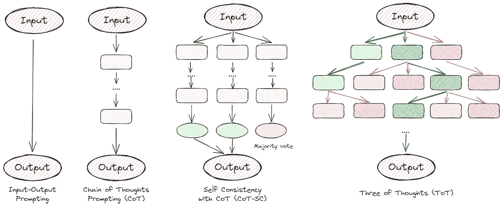
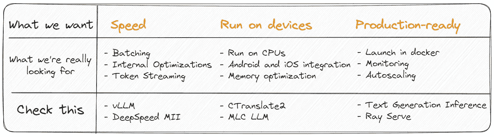

# 开发大型语言模型所需了解的一切

> 原文：[`towardsdatascience.com/all-you-need-to-know-to-develop-using-large-language-models-5c45708156bc?source=collection_archive---------0-----------------------#2023-11-15`](https://towardsdatascience.com/all-you-need-to-know-to-develop-using-large-language-models-5c45708156bc?source=collection_archive---------0-----------------------#2023-11-15)


图像由 Stable Diffusion 生成

## 用简单的术语解释启动开发 LLM 基础应用所需的核心技术。

[](https://slgero.medium.com/?source=post_page-----5c45708156bc--------------------------------)[](https://towardsdatascience.com/?source=post_page-----5c45708156bc--------------------------------) [Sergei Savvov](https://slgero.medium.com/?source=post_page-----5c45708156bc--------------------------------)

·

[关注](https://medium.com/m/signin?actionUrl=https%3A%2F%2Fmedium.com%2F_%2Fsubscribe%2Fuser%2F227c6aaec11a&operation=register&redirect=https%3A%2F%2Ftowardsdatascience.com%2Fall-you-need-to-know-to-develop-using-large-language-models-5c45708156bc&user=Sergei+Savvov&userId=227c6aaec11a&source=post_page-227c6aaec11a----5c45708156bc---------------------post_header-----------) 发表在 [Towards Data Science](https://towardsdatascience.com/?source=post_page-----5c45708156bc--------------------------------) · 12 min read · 2023 年 11 月 15 日[](https://medium.com/m/signin?actionUrl=https%3A%2F%2Fmedium.com%2F_%2Fvote%2Ftowards-data-science%2F5c45708156bc&operation=register&redirect=https%3A%2F%2Ftowardsdatascience.com%2Fall-you-need-to-know-to-develop-using-large-language-models-5c45708156bc&user=Sergei+Savvov&userId=227c6aaec11a&source=-----5c45708156bc---------------------clap_footer-----------)

--

[](https://medium.com/m/signin?actionUrl=https%3A%2F%2Fmedium.com%2F_%2Fbookmark%2Fp%2F5c45708156bc&operation=register&redirect=https%3A%2F%2Ftowardsdatascience.com%2Fall-you-need-to-know-to-develop-using-large-language-models-5c45708156bc&source=-----5c45708156bc---------------------bookmark_footer-----------)

本文的目的是用简单的术语解释开始开发基于 LLM 的应用程序所需的关键技术。它面向对机器学习概念有基本了解并希望深入学习的软件开发人员、数据科学家和人工智能爱好者。文章还提供了许多有用的链接供进一步学习。内容会很有趣！

# 1. 大型语言模型（LLM）简介

我想你已经听了无数次关于 LLM 是什么，所以我不会再过多赘述。我们只需知道：大型语言模型（LLM）是一个**大型**神经网络模型，根据先前预测的 token 来预测下一个 token。就是这样。


模型参数数量的比较。**只需看看 GPT-3 有多大。**而且没人知道 GPT-4 的情况……

LLMs 的受欢迎程度归因于其多功能性和有效性。它们可以完美地完成翻译、摘要、意义分析等任务。


LLMs 的能力

使用 LLMs 的一些项目示例：

+   [**Notion AI**](https://www.notion.so/product/ai)——帮助提高写作质量，生成内容，纠正拼写和语法，编辑语音和语调，翻译等。

+   [**GitHub Copilot**](https://github.com/features/copilot)——通过提供自动补全样式的建议来改进你的代码。

+   [**Dropbox Dash**](https://blog.dropbox.com/topics/product/introducing-AI-powered-tools)——提供自然语言搜索功能，并特别指出答案来源于哪些文件。

如果你想详细了解 LLMs 的工作原理，我**强烈推荐**阅读 [Mark Riedl](https://medium.com/u/7247bdeb9655?source=post_page-----5c45708156bc--------------------------------) 的优秀文章“[一种非常温和的介绍大型语言模型，没有炒作](https://medium.com/@mark-riedl/a-very-gentle-introduction-to-large-language-models-without-the-hype-5f67941fa59e)”。

# 2\. 开源与闭源模型

虽然有很多差异，我强调以下几点作为主要差异：

+   **隐私**——大型公司选择自托管解决方案的最重要原因之一。

+   **快速原型制作**——非常适合小型初创公司快速测试他们的想法，而不需要过多开支。

+   **生成质量**——要么为你的特定任务对模型进行微调，要么使用付费 API。

没有明确的答案说明什么更好或更差。我总结了以下几点：


如果你对深入了解细节感兴趣，我建议你阅读我的文章“[你真的不需要托管的 LLMs，对吧？](https://medium.com/better-programming/you-dont-need-hosted-llms-do-you-1160b2520526)”。

## **流行的开源模型**

+   [LLaMA-2](https://huggingface.co/meta-llama/Llama-2-7b-chat-hf) 由**Meta**提供

+   [Falcon](https://huggingface.co/tiiuae/falcon-7b) 由**阿布扎比技术创新研究所**提供

+   [Mistral](https://huggingface.co/mistralai/Mistral-7B-v0.1) 由**Mistral AI**提供

## **流行的闭源模型**

+   [GPT-4](https://openai.com/gpt-4) 由**OpenAI**提供

+   [Bard](https://bard.google.com/) 由**Google**提供

+   [Claude](https://www.anthropic.com/) 由**Anthropic**提供

探索 [LLM Collection](https://www.promptingguide.ai/models/collection) 以查看所有模型。

# 3\. 提示工程的艺术

我知道，很多人认为这是一门伪科学或只是暂时的炒作。但事实是，我们仍然没有完全理解 LLM 的工作原理。为什么它们有时能提供高质量的回答，而有时却编造事实（[幻觉](https://medium.com/better-programming/fixing-hallucinations-in-llms-9ff0fd438e33)）？或者为什么在提示中添加“让我们逐步思考”会突然提高质量？


添加情感色彩会提高任何模型的质量。[来源](https://arxiv.org/pdf/2307.11760.pdf)

正因为如此，科学家和爱好者只能尝试不同的提示，试图使模型表现得更好。



示意图，展示了用 LLM 解决问题的各种方法

我不会用复杂的提示链来让你感到无聊，而是给你一些能立即提高性能的示例：

1.  [***“让我们逐步思考”***](https://arxiv.org/pdf/2205.11916.pdf) — 对推理或逻辑任务效果很好。

1.  [***“深呼吸，逐步解决这个问题”***](https://arxiv.org/pdf/2309.03409.pdf) — 是前一点的改进版。它可以再提高几个百分点的质量。

1.  [***“这对我的职业生涯非常重要”***](https://arxiv.org/pdf/2307.11760.pdf) — 只需将其添加到提示的末尾，你会注意到质量提高 5–20%。

另外，我会立即分享一个有用的提示模板：

> 让我们结合我们的**X**命令和清晰的思维，以逐步的方法快速准确地解读答案。提供详细信息并在答案中包括来源。这对我的职业生涯非常重要。
> 
> 其中**X**是你解决任务的行业，例如编程。

我强烈建议你花几晚时间探索提示工程技术。这不仅能让你更好地控制模型的行为，还能帮助提高质量并减少幻觉。为此，我推荐阅读[**提示工程指南。**](https://www.promptingguide.ai/introduction/basics)

## 有用链接：

+   [prompttools](https://github.com/hegelai/prompttools) — 提示测试和实验，支持 LLM（例如 OpenAI，LLaMA）。

+   [promptfoo](https://github.com/promptfoo/promptfoo) — 测试和评估 LLM 输出质量。

+   [Awesome ChatGPT Prompts](https://github.com/f/awesome-chatgpt-prompts) — 一系列用于 ChatGPT 模型的提示示例集合。

# 4\. 融入新数据：检索增强生成（RAG）

RAG 是一种将 LLM 与外部知识库结合的技术。这使得模型能够添加原始训练集中未包含的相关信息或特定数据。

尽管名字听起来吓人（有时我们会在其前面加上“reranker”一词），但它实际上是一种相当古老且出乎意料简单的技术：


RAG 工作原理的示意图

1.  您将文档转换为数字，我们称之为**嵌入**。

1.  然后，您还使用同一模型将用户的搜索查询转换为嵌入。

1.  找到前 K 个最接近的文档，通常基于[余弦相似度](https://en.wikipedia.org/wiki/Cosine_similarity)。

1.  要求 LLM 基于这些文档生成响应。

## 适合使用时

+   **需要当前信息时：** 当应用程序需要不断更新的信息，例如新闻文章时。

+   **领域特定应用程序：** 对于需要 LLM 训练数据之外的专业知识的应用程序，例如内部公司文档。

## 不适合使用时

+   **通用对话应用程序：** 信息需要是通用的，不需要额外的数据。

+   **有限资源场景：** RAG 的检索组件涉及搜索大型知识库，这可能计算成本高且速度慢 — 尽管仍然比微调更快且更便宜。

## 使用 RAG 构建应用程序

一个很好的起点是使用[LlamaIndex 库](https://github.com/run-llama/llama_index)。它允许您快速将数据连接到 LLM。为此，您只需要几行代码：

```py
from llama_index import VectorStoreIndex, SimpleDirectoryReader

# 1\. Load your documents:
documents = SimpleDirectoryReader("YOUR_DATA").load_data()

# 2\. Convert them to vectors:
index = VectorStoreIndex.from_documents(documents)

# 3\. Ask the question:
query_engine = index.as_query_engine()
response = query_engine.query("When's my boss's birthday?")
print(response)
```

在实际应用中，事情显然更加复杂。与任何开发一样，您会遇到许多细微差别。例如，检索的文档可能并不总是与问题相关，或者可能存在速度问题。然而，即使在这个阶段，您也可以显著提高搜索系统的质量。

## 读什么 & 有用的链接

+   [为生产环境构建基于 RAG 的 LLM 应用程序](https://www.anyscale.com/blog/a-comprehensive-guide-for-building-rag-based-llm-applications-part-1) — 一篇关于 RAG 主要组成部分的优秀详细文章。

+   为何在生产环境中您的 RAG 不可靠 — 由[Ahmed Besbes](https://medium.com/u/adc8ea174c69?source=post_page-----5c45708156bc--------------------------------)撰写的一篇很棒的文章，清楚地解释了在使用 RAG 时可能出现的困难。

+   [使用 LlamaIndex 导航知识图谱的 7 种查询策略](https://betterprogramming.pub/7-query-strategies-for-navigating-knowledge-graphs-with-llamaindex-ed551863d416) — 来自[Wenqi Glantz](https://medium.com/u/ce7cd5b8b74a?source=post_page-----5c45708156bc--------------------------------)的信息丰富的文章，详细而微妙地探讨了使用 LlamaIndex 构建 RAG 管道。

+   [OpenAI 检索工具](https://platform.openai.com/docs/assistants/tools/knowledge-retrieval) — 如果你想要最小的工作量，可以使用 OpenAI 的 RAG。

# 5\. 微调您的 LLM

微调是继续在特定数据集上训练预训练大语言模型（LLM）的过程。你可能会问，如果我们已经可以通过 RAG 添加数据，为什么还需要进一步训练模型。简单的回答是，只有微调才能使你的模型适应特定领域或定义其风格。例如，我[通过在个人通信上进行微调创建了自己的副本](https://medium.com/better-programming/unleash-your-digital-twin-how-fine-tuning-llm-can-create-your-perfect-doppelganger-b5913e7dda2e)：


微调模型在作者通信上的演示

好吧，如果我已经说服了你它的重要性，让我们来看看它是如何工作的（**剧透** — 其实并不难）：


*经典的微调领域特定数据的方法（所有图标来自* [*flaticon*](http://flaticon.com/)*)*

1.  选择一个经过训练的大语言模型，有时称为基础 LLM。你可以从[HuggingFace](https://huggingface.co/spaces/HuggingFaceH4/open_llm_leaderboard)下载它们。

1.  准备你的训练数据。你只需要编译指令和响应。[这里有一个例子](https://huggingface.co/datasets/databricks/databricks-dolly-15k)的这样的数据集。你也可以[使用 GPT-4 生成合成数据](https://www.promptingguide.ai/applications/generating)。

1.  选择合适的微调方法。[LoRA](https://github.com/microsoft/LoRA)和[QLoRA](https://github.com/artidoro/qlora)目前很受欢迎。

1.  在新数据上微调模型。

## 何时使用

+   **小众应用：** 当应用涉及专业或非常规话题时。例如，需要理解和处理法律术语的法律文件应用。

+   **自定义语言风格：** 对于需要特定语调或风格的应用。例如，创建一个[AI 角色](https://beta.character.ai/)，无论是名人还是书中的角色。

## 何时不使用

+   **广泛应用：** 当应用的范围较广，不需要专业知识时。

+   **有限的数据：** 微调需要大量相关的数据。然而，你始终可以[使用另一个 LLM 生成数据](https://www.confident-ai.com/blog/how-to-generate-synthetic-data-using-llms-part-1)。例如，[Alpaca 数据集](https://github.com/gururise/AlpacaDataCleaned)包含 52k 个 LLM 生成的指令-响应对，用于创建今年早些时候的第一个微调[Llama v1](https://arxiv.org/abs/2302.13971)模型。

## 微调你的 LLM

你可以找到大量关于模型微调的文章。仅在 Medium 上，就有成千上万篇。因此，我不想过于深入这个话题，会向你展示一个高级库，[Lit-GPT](https://github.com/Lightning-AI/lit-gpt)，它隐藏了所有的魔法。是的，它不允许对训练过程进行太多自定义，但你可以快速进行实验并获得初步结果。你只需要几行代码：

```py
# 1\. Download the model:
python scripts/download.py --repo_id meta-llama/Llama-2-7b

# 2\. Convert the checkpoint to the lit-gpt format:
python scripts/convert_hf_checkpoint.py --checkpoint_dir checkpoints/llama

# 3\. Generate an instruction tuning dataset:
python scripts/prepare_alpaca.py  # it should be your dataset

# 4\. Run the finetuning script
python finetune/lora.py \
    --checkpoint_dir checkpoints/llama/
    --data_dir your_data_folder/
    --out_dir my_finetuned_model/ 
```

就这样！你的训练过程将开始：


> 请注意，这个过程可能需要很长时间。在单个 A100 GPU 上微调 Falcon-7B 大约需要**10 小时**和**30 GB**内存。

当然，我稍微简化了一下，我们只触及了表面。实际上，微调过程要复杂得多，要获得更好的结果，你需要了解各种适配器、它们的参数以及更多内容。不过，即使经过如此简单的一轮，你也将拥有一个按照你的指示运行的新模型。

## 阅读内容 & 有用链接

+   [用微调的 LLM 创建一个你自己的克隆](https://medium.com/better-programming/unleash-your-digital-twin-how-fine-tuning-llm-can-create-your-perfect-doppelganger-b5913e7dda2e) — 我的文章，讲述了数据集的收集、使用的参数以及提供了关于微调的有用建议。

+   [理解大型语言模型的参数高效微调](https://lightning.ai/pages/community/article/understanding-llama-adapters/) — 如果你想深入了解微调概念和流行的参数高效替代方案，这是一份极好的教程。

+   [使用 LoRA 和 QLoRA 微调 LLM：来自数百次实验的见解](https://lightning.ai/pages/community/lora-insights/) — 我最喜欢的文章之一，用于了解 LoRA 的能力。

+   [OpenAI 微调](https://platform.openai.com/docs/guides/fine-tuning) — 如果你想以最小的努力微调 GPT-3.5。

# 6\. 部署你的 LLM 应用程序

有时候，我们只希望简单地按下“部署”按钮……


幸运的是，这相当可行。有大量专注于部署大型语言模型的框架。是什么让它们如此优秀？

+   许多预构建的包装器和集成。

+   丰富的模型选择。

+   众多的内部优化。

+   快速原型开发。

## 选择合适的框架

部署 LLM 应用程序的框架选择取决于多种因素，包括模型的大小、应用程序的可扩展性要求和部署环境。目前，框架的种类并不多，因此理解它们的差异应该不会太难。下面，我为你准备了一份速查表，帮助你快速入门：



此外，在我的文章“[7 种用于服务 LLM 的框架](https://medium.com/better-programming/frameworks-for-serving-llms-60b7f7b23407)”中，我提供了对现有解决方案的更详细概述。如果你打算部署你的模型，我建议查看一下。


LLM 推理框架的比较

## 部署示例代码

让我们从理论转向实践，尝试使用[文本生成推理](https://github.com/huggingface/text-generation-inference)部署 LLaMA-2。正如你可能猜到的，你只需几行代码：

```py
# 1\. Create a folder where your model will be stored:
mkdir data

# 2\. Run Docker container (launch RestAPI service):
docker run --gpus all --shm-size 1g -p 8080:80 \
    -v $volume:/data \
    ghcr.io/huggingface/text-generation-inference:1.1.0
    --model-id meta-llama/Llama-2-7b

# 3\. And now you can make requests:
curl 127.0.0.1:8080/generate \
    -X POST \
    -d '{"inputs":"Tell me a joke!","parameters":{"max_new_tokens":20}}' \
    -H 'Content-Type: application/json'
```

就这些！你已经设置了一个内置日志记录的 RestAPI 服务，带有用于监控的 Prometheus 端点、令牌流式传输，并且你的模型已完全优化。难道这不是很神奇吗？


API 文档

## 该读什么 & 有用的链接

+   [7 种用于服务 LLM 的框架](https://medium.com/better-programming/frameworks-for-serving-llms-60b7f7b23407) —— 一份详尽的指南，介绍了 LLMs 推理和服务的详细比较。

+   [推理端点](https://huggingface.co/inference-endpoints) —— HuggingFace 的一个产品，可以让你通过几次点击部署任何 LLMs。当你需要快速原型时，这是一个不错的选择。

# 7. 什么在幕后仍然存在

尽管我们已经涵盖了开发基于 LLM 的应用所需的主要概念，但仍然有一些方面你可能会在未来遇到。因此，我想留下一些有用的链接：

## 优化

当你启动第一个模型时，你不可避免地会发现它没有你期望的那么快，而且消耗了大量资源。如果是这种情况，你需要了解如何优化它。

+   [7 种加速托管 LLM 推理的方法](https://medium.com/better-programming/speed-up-llm-inference-83653aa24c47) —— 加速 LLMs 推理的技术，以提高令牌生成速度和减少内存消耗。

+   [在 PyTorch 中优化 LLM 的内存使用](https://lightning.ai/pages/community/tutorial/pytorch-memory-vit-llm/) —— 文章提供了一系列技术，可以在不牺牲建模性能和预测准确性的情况下，将 PyTorch 中的内存消耗减少约 20 倍。

## 评估

假设你有一个微调后的模型。但你如何确保其质量有所提高？我们应该使用什么指标？

+   [关于评估大语言模型的一切](https://explodinggradients.com/all-about-evaluating-large-language-models) —— 一篇关于基准和指标的好概述文章。

+   [evals](https://github.com/openai/evals) —— 最受欢迎的评估 LLMs 和 LLM 系统的框架。

## 向量数据库

如果你使用 RAG，某个时候你会从将向量存储在内存中转到数据库中。为此，了解市场上的当前产品及其局限性非常重要。

+   你需要知道的关于向量数据库的所有信息 — [Dominik Polzer](https://medium.com/u/3ab8d3143e32?source=post_page-----5c45708156bc--------------------------------) 提供的逐步指南，帮助你发现并利用向量数据库的力量。

+   [选择向量数据库：2023 年的比较和指南](https://benchmark.vectorview.ai/vectordbs.html) — 对 Pinecone、Weviate、Milvus、Qdrant、Chroma、Elasticsearch 和 PGvector 数据库的比较。

## LLM 代理

在我看来，这是 LLMs 中最有前景的发展。如果你想让多个模型协同工作，建议你探索以下链接。

+   [基于 LLM 的自主代理调查](https://github.com/paitesanshi/llm-agent-survey#-more-comprehensive-summarization) — 这可能是关于 LLM 代理的最全面的概述。

+   [autogen](https://github.com/microsoft/autogen) — 一个框架，使得开发使用多个能够相互对话以解决任务的 LLM 应用程序成为可能。

+   [OpenAgents](https://github.com/xlang-ai/OpenAgents) — 一个开放平台，用于在实际环境中使用和托管语言代理。

## 来自人类反馈的强化学习（RLHF）

一旦你允许用户访问你的模型，你就开始承担责任。如果它回应粗鲁？或者泄露炸弹制作成分？为避免这种情况，请查看这些文章：

+   [说明来自人类反馈的强化学习（RLHF）](https://huggingface.co/blog/rlhf) — 详细介绍 RLHF 技术的概述文章。

+   [RL4LMs](https://github.com/allenai/RL4LMs) — 一个模块化的 RL 库，用于将语言模型微调到人类偏好。

+   [TRL](https://github.com/huggingface/trl) — 一套用于训练变换器语言模型的工具，从监督微调步骤（SFT）、奖励建模步骤（RM）到近端策略优化（PPO）步骤。

# 结论

尽管有些炒作让我们感到有些厌倦，LLMs 将长期存在，而理解其堆栈并编写简单应用程序的能力可以为你带来显著的提升。我希望我能让你在这个领域中稍作沉浸，并展示它并不复杂或令人恐惧。

感谢你的关注，请继续关注新文章！

> **免责声明**：本文中的信息截至 2023 年 11 月，但请注意之后可能会有所变动。

*除非另有说明，所有图片均由作者提供。*

如果你有任何问题或建议，请随时通过[LinkedIn](https://www.linkedin.com/in/sergey-savvov/)联系我。
