# 数据驱动故事讲述的替代可视化

> 原文：[`towardsdatascience.com/alternative-visualizations-for-data-driven-storytelling-65c873709fcc`](https://towardsdatascience.com/alternative-visualizations-for-data-driven-storytelling-65c873709fcc)

## 为什么选择它们，以及如何创建它们

[](https://medium.com/@michalszudejko?source=post_page-----65c873709fcc--------------------------------)[](https://towardsdatascience.com/?source=post_page-----65c873709fcc--------------------------------) [Michal Szudejko](https://medium.com/@michalszudejko?source=post_page-----65c873709fcc--------------------------------)

·发表于 [Towards Data Science](https://towardsdatascience.com/?source=post_page-----65c873709fcc--------------------------------) ·阅读时间 16 分钟·2023 年 11 月 2 日

--


来源：作者在 ChatGPT 和 DALL-e 3 中生成的图像。

**你知道所有 F1 赛车必须将一块大木板作为其组成部分之一吗？**

> 一块木板？
> 
> 是的，确实如此！

F1 赛车使用一块木板，即**“滑板块”，**安置在车底。这确保了赛车在比赛过程中高度保持在法律规定的范围内。此外，木板作为一个重要的安全功能，通过与赛道摩擦来保护赛车的重要部件免受接触路缘时可能造成的损坏。值得注意的是，它对性能的影响很小。滑板块由木材和纤维的复合材料制成，设计为以稳定的速度磨损。¹

**我为什么提到这一点？** 这个轶事突显了即使在技术先进的领域，如 F1，仍然可以有效利用一个(*理论上*)简单的组件。这一平行也延伸到数据可视化领域。正如我多次论述的，**大多数数据驱动的见解可以通过三种基本图表类型：柱状图、折线图和饼图，来熟练地传达。**

**但是，如果这三种类型无法捕捉我们试图解释的现象的本质呢？** 或者如果我们使用多个简单图表，而不是一个稍微复杂的图表会怎样？或者，回到我们的 F1 示例，我们决定用碳纤维替代木材，并绘制一些更花哨的东西？**在这篇文章中，我将探讨在这种情况下可供选择的替代方案。**

# 那么，你可以从这篇文章中期待什么？

目标是提供替代数据可视化形式的概述。**所以，我将讨论超越传统的柱状图、折线图和饼图这三种选择的图表选项，我认为这三种图表在大多数情况下是默认选择。**

尽管如此，我完全认识到还有许多其他可视化选项。我通常会在传统三种方式不适用时考虑使用它们。在这里，我将向你介绍一些我认为特别有价值的可视化形式。我还会指导你如何使用各种实用且免费的工具创建它们。值得注意的是，在这篇文章中，我假设你会使用存储在电脑上的本地数据来制作可视化，除非有其他特定优势的替代方法，我会重点说明。公平地说，我将写这篇文章视为学习这些工具的机会，我必须说，学习这些东西非常有趣（除了实际的价值）。**希望对你也是如此！**

# 可视化的十诫

在我们探索广阔而多样的数据可视化领域之前，我想向你介绍一个我开发的新颖想法：**“可视化十诫。”** 这是一个简单的指南汇编，可以帮助你制作基于数据的视觉效果，无论你选择基本的可视化格式如柱状图，还是决定探索我们随后讨论的更复杂的替代方案。

1.  **从目的开始。** 总是以明确的目的开始进行可视化工作。

1.  **使眼动追踪更容易。** 将接受者的注意力引导到源自目的的关键信息上。

1.  **减少认知负担。** 移除所有不符合目的的或使追踪关键信息变得困难的多余元素。

1.  **选择精确的可视化属性**，例如形状、方向或大小，而不是颜色或体积。

1.  **简化。** 移除图表中所有技术元素，除非它们有助于实现这十诫中的第 1 到第 4 点。

1.  **最大化数据墨水比。**

1.  **战略性使用颜色。** 减少颜色数量，并清楚区分图表中的重要信息和不重要信息。

1.  **保持设计的完整性和一致性。** 在你的展示或报告中一致地应用用于可视化的风格。

1.  **确保包容性。** 例如，为视力障碍者提供必要的照顾。

1.  **不要操控可视化。** 避免使用操控性的技巧。

如果你有兴趣了解更多关于这些规则的内容，请欢迎访问我的 [博客](https://www.michalszudejko.pl/post/decalogue-of-visualization-dekalog-przygotowywania-wizualizacji)。我深入讨论了这些要点，并分享了一些我所说的具体要点的视觉示例。文章有英文和波兰文两种版本。

# 替代的可视化形式

好的，让我们回到主要讨论的话题。我挑选了一些与传统的柱状图、折线图和饼图不同的可视化类型。我将详细介绍这些图表。每一种图表的选择都是因为它们满足了特定的需求，我将会列出这些需求。当基本图表类型无法满足需求时，考虑将这些可视化图表整合到你的工作中。如果你只是想打破三种基础图表类型的单调，也可以选择这些图表。这可能有助于新鲜而吸引人地吸引你的观众注意。

## **注意！**

我遇到过无数数据可视化图表，这些图表被其创作者称为替代性、创意性或创新性的。公平地说，他们完全有权做出这样的声明。然而，从我的角度来看，这些图表中的大多数缺乏实际应用。它们通常过于复杂，需要大量的努力才能提取有意义的见解，或者过于装饰性。因此，我在选择替代性图表时可能会比较保守。**放心，我选择的每一个可视化图表都经过了严格的“实地测试”。** 因此，我可以自信地证明它们的实用性和适用性，特别是在企业环境中。

## 桑基图

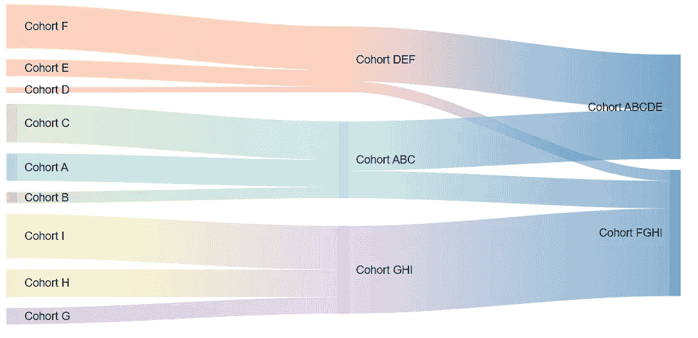

**桑基图。** 来源：由作者在 Google Charts 中生成的图表。

**桑基图**³是一种特殊类型的流动图，其特点是连接线的厚度与它们代表的流量成比例。这些图通常用于科学和商业应用。

**桑基图由两个主要组件组成：**

+   **节点**代表流动过程中的各种状态或阶段。

+   **连接线**，表示从一个节点到另一个节点的流动。

每条连接线的宽度与相应节点之间的总流量成正比。

**桑基图可以用于多种目的，包括**：

+   **跟踪客户迁移**，例如从一个 CRM 系统转移到另一个。

+   **分析现金流**在一个企业或更广泛的经济范围内。

+   **检查信息**在计算机网络中的流动。

+   **调查生产过程中的材料使用情况**。

我使用了[**Google Charts**](https://developers.google.com/chart)，这是由科技巨头 Google / Alphabet 开发的全面图表服务，来绘制上述图表。Google Charts 是一个 JavaScript 库，使用户能够根据其数据输入创建图表。一旦输入了必要的信息并指定了格式化偏好，Google Charts 将生成图表并提供嵌入到网站所需的 HTML/JavaScript 代码。

以下是我为上面展示的图表生成的代码。这是从 Google Charts 网站复制的几个代码元素加上我自己的数据。这段代码可以保存为纯 HTML，并像我上面那样嵌入到网站中。你也可以在 [JSFiddle](https://jsfiddle.net/) 等工具中执行它。

```py
<head>
    <script type="text/javascript" src="https://www.gstatic.com/charts/loader.js"></script>
    <script type="text/javascript">
      google.charts.load('current', {'packages': ['sankey']});
      google.charts.setOnLoadCallback(drawChart);

      function drawChart() {
        var data = new google.visualization.DataTable();
        data.addColumn('string', 'From');
        data.addColumn('string', 'To');
        data.addColumn('number', 'Weight');
        data.addRows([
          ['Cohort A','Cohort ABC',5],
          ['Cohort B','Cohort ABC',2],
          ['Cohort C','Cohort ABC',7],
          ['Cohort D','Cohort DEF',1],
          ['Cohort E','Cohort DEF',3],
          ['Cohort F','Cohort DEF',8],
          ['Cohort G','Cohort GHI',3],
          ['Cohort H','Cohort GHI',5],
          ['Cohort I','Cohort GHI',8],
          ['Cohort ABC','Cohort ABCDE',9],
          ['Cohort ABC','Cohort FGHI',5],
          ['Cohort DEF','Cohort ABCDE',10],
          ['Cohort DEF','Cohort FGHI',2],
          ['Cohort GHI','Cohort FGHI',16],
        ]);
    var colors = ['#a6cee3', '#b2df8a', '#fb9a99', '#fdbf6f',
                  '#cab2d6', '#ffff99', '#1f78b4', '#33a02c'];
        // Sets chart options.
        var options = {
          width: 600, height: 290,
      sankey: {
        node: {
          colors: colors
        },
        link: {
          colorMode: 'gradient',
          colors: colors
        }
      }
        };

        // Instantiates and draws our chart, passing in some options.
        var chart = new google.visualization.Sankey(document.getElementById('sankey_basic'));
        chart.draw(data, options);
      }
</script>
</head>
  <body>
    <div id="sankey_basic" style="width: 600px; height: 300px;"></div>
  </body>
</html>
```

## 漏斗图

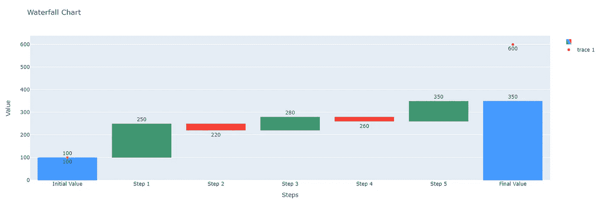

**在 Google Colab 中生成的漏斗图。** 来源：作者提供的图片。

**漏斗图** 在财务专家如预算控制员或财务分析师中“非常受欢迎”。就我个人而言，我不喜欢它，因为我看到了太多次。不过，我使用漏斗图是因为我认为它们具有很大的客观价值。

漏斗图是一种图形表示，特别适用于预算演示或财务报告。这种图表在说明两个点或场景（例如执行和预算）之间的变化时非常有用，突出显示其组成部分。

漏斗图旨在展示一个初始值如何通过一系列正负变化演变，最终形成一个结果值。它由可以垂直或水平排列的柱子组成。这些柱子表示导致初始值变化的各个因素。通常，正变化用绿色柱子表示，而负变化用红色柱子表示。图表的第一个柱子显示起始值，最后一个柱子表示结束值，中间的柱子则标出使从初始值到绝对值转变的个别变化。

**以下是用于漏斗图的 Python 代码，利用了 Plotly 库。我使用了 ChatGPT (GPT 3.5) 来编写这段代码。**

```py
import plotly.graph_objects as go

# Input data - sample values for different steps
steps = ['Initial Value', 'Step 1', 'Step 2', 'Step 3', 'Step 4', 'Step 5', 'Final Value']
values = [100, 150, -30, 60, -20, 90, 250]  # Sample changes in values at each step

# Calculate the final value based on the input data
final_value = sum(values)

# Create the waterfall chart
fig = go.Figure(go.Waterfall(
    name="",
    orientation="v",
    measure=["absolute", "relative", "relative", "relative", "relative", "relative", "total"],
    x=steps,
    textposition="outside",
    texttemplate="%{y}",
    y=values,
    connector={"mode": "spanning", "line": {"width": 0}},
))

# Add initial and final values to the chart
fig.add_trace(go.Scatter(x=['Initial Value', 'Final Value'], y=[100, final_value], mode='markers+text',
                         text=[str(100), str(final_value)], textposition='bottom center'))

# Configure the chart
fig.update_layout(
    title="Waterfall Chart",
    xaxis_title="Steps",
    yaxis_title="Value",
)

# Save the chart to an HTML file
fig.write_html("waterfall_chart.html")

# Display the chart
fig.show()
```

代码在 [Google Collab](http://colab.research.google.com/) 中执行。你可以在这段话的开头查看最终产品。

如果你不想使用 Google Colab 并希望将数据保留在本地，我推荐使用 [**Anaconda Distribution**](https://docs.anaconda.com/free/anaconda/getting-started/what-is-distro/)。具体来说，我将以下代码粘贴到 [**Spyder IDE**](https://www.spyder-ide.org/) 中，这是在 Anaconda 中安装的。可能需要安装 Plotly 库，你可以在 **Anaconda Powershell Prompt** 中进行安装（使用以下命令行：*pip install plotly* 或 *pip install -U plotly* 以获取最新版本）。

## 哑铃图

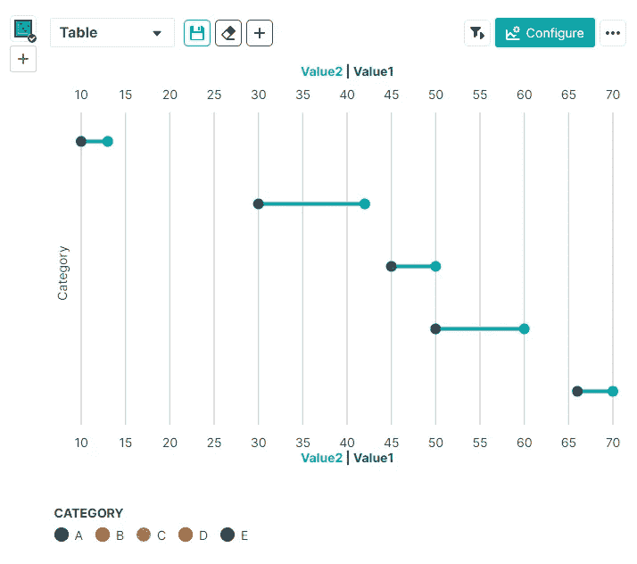

**哑铃图的示例。** 来源：作者截屏。

**哑铃图⁴** 是一种旨在说明两个不同时间点或两个类别之间值变化的图表。这种可视化技术在比较跨不同类别或实体的两个数据点之间的差异时非常有价值。

哑铃图的结构包括每个类别（或单位）的两个不同点，通过一条线连接。这些点显示了两个不同时间点或两个不同类别的值。连接线表示这两个点之间的值变化，便于直接比较哪些类别随着时间发生了最大变化，或者哪些单位在两个类别之间的变化最大。

**以下是几个示例，展示了哑铃图的潜在应用：**

1.  **产品价格变化：** 可以用来比较两个不同年份的产品价格，哑铃图的一端代表第一个年份的价格，另一端代表第二个年份的价格。

1.  **医学测试结果比较：** 哑铃图可以用于比较患者治疗前后的诊断测试结果。

1.  **生产中的变化：** 对于那些希望评估两个不同季度生产绩效的公司，哑铃图可以简洁地比较各个季度生产的单位数。

1.  **员工评级变化：** 人力资源部门可以利用哑铃图来比较两个评估周期之间员工的评级。

1.  **销售比较：** 市场部门可以利用哑铃图来评估广告活动启动前后的产品销售表现。

我使用[**Noteable**](https://app.noteable.io)和**Data Prism**设计了上述的哑铃图。Data Prism 是 Noteable 的内置功能。⁵

Noteable 是一个分析平台和协作数据工作区。它既可以作为网站访问，也可以作为 ChatGPT 的集成功能。

使用 Noteable 创建图表的一个潜在缺点是，根据我的了解，图表不能在本地复制。然而，这个平台仍然值得探索，主要是因为它包含了创新的 Data Prism 功能。该工具使用户可以通过简单的点击生成大量的数据可视化。通过不同可视化的实验过程中的简便性和速度，提高了发现数据中先前未注意到的趋势、依赖关系或异常值的可能性。

首先，我们需要在 Noteable 中创建一个空间和笔记本。

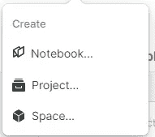

**在 Noteable 中创建空间和笔记本。** 来源：作者截图。

然后，在新创建的笔记本中，我们可以输入数据。这里我创建了一个数据框，但你也可以上传一个 *.csv（逗号分隔）文件（首先需要将文件上传到项目中，然后添加到笔记本）。

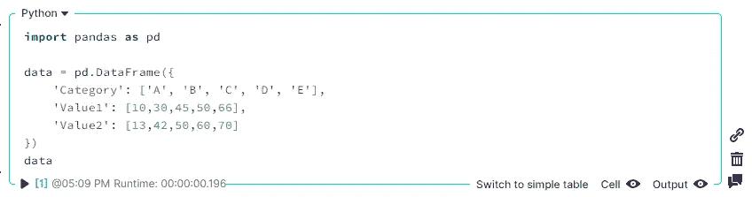

**输入到 Noteable 的数据。** 来源：作者截图。

这是上述代码的展示。

```py
import pandas as pd
data = pd.DataFrame({
    'Category': ['A', 'B', 'C', 'D', 'E'],
    'Value1': [10,30,45,50,66],
    'Value2': [13,42,50,60,70]
})
data
```

接下来，我们点击“配置”，然后选择“Data Prism Suggestions”。

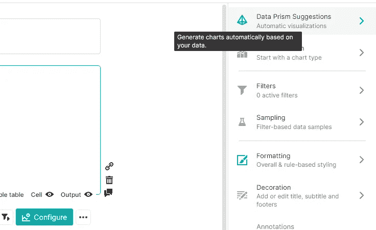

**启动 Data Prism 建议。** 来源：作者截图。

然后我们会得到多个选项，可以选择并进一步处理。

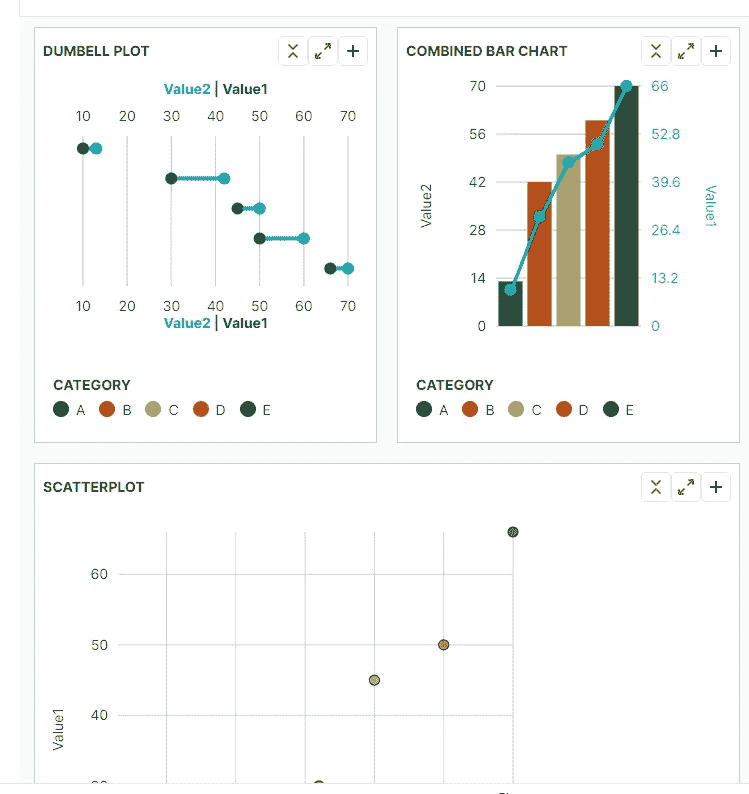

**Data Prism 推荐的图表。** 来源：作者图片。

最后，我们可以将图表导出为*.png（不幸的是，除非是我电脑上的问题，否则效果不好）。我们也可以将其发布然后嵌入到我们的网站上。

## 雷达图

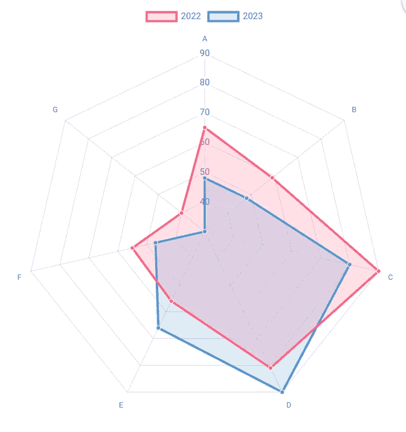

**在 Chart.js 中制作的雷达图。** 来源：作者截图。

**雷达图**是一种用于在二维图表格式中显示多变量数据的可视化工具，其中三个或更多定量变量在从同一中心点发出的坐标轴上表示。这些坐标轴在圆周上均匀分布，每个变量的值沿着这些坐标轴绘制。然后，绘制的点通过线连接形成一个形状。由线条形成的形状和点相对于坐标轴的位置揭示了数据的见解。

**以下是雷达图的一些实际应用：**

1.  **运动表现分析：** 雷达图在运动分析中经常被用来比较运动员在速度、敏捷性和力量等各种指标上的表现。

1.  **产品比较：** 企业通常使用雷达图来比较各种产品的特征或属性，包括竞争对手的产品。

1.  **技能评估：** 人力资源部门可以利用雷达图评估个人在多个领域的技能或能力。

1.  **客户分析：** 分析师可能会使用雷达图来可视化客户满意度评分，包括产品质量、客户服务和性价比等维度。

上面是我使用**Chart.js**库创建的图表示例。⁶

**Chart.js** 是一个提供全面的常用图表类型的库，配有各种插件和自定义选项以满足你的需求。除了标准图表外，你还可以利用由[社区](https://discord.com/invite/HxEguTK6av)维护的其他图表类型。Chart.js 的一个显著特点是能够将不同的图表类型结合成一个组合图表，从而提供更多灵活性以展示你的数据。此外，Chart.js 支持自定义插件，使你能够集成各种功能，如注释、缩放和拖放，以增强图表的互动性和可用性。

这是上图的脚本代码。它从 Chart.js 网站复制过来，并用我的样本数据进行了调整。它也准备好可以嵌入到网站中。

```py
<html>
  <head>
    <title>Radar Chart Example</title>
    <script src="https://cdnjs.cloudflare.com/ajax/libs/Chart.js/3.9.1/chart.min.js"></script>
  </head>
  <body>
    <canvas id="radarChart"></canvas>
    <script>
      var canvas = document.getElementById("radarChart");
      var chart = new Chart(canvas, {
        type: "radar",
        data: {
          labels: [
            'A',
            'B',
            'C',
            'D',
            'E',
            'F',
            'G'
          ],
          datasets: [{
            label: '2022',
            data: [65, 59, 90, 81, 56, 55, 40],
            fill: true,
            backgroundColor: 'rgba(255, 99, 132, 0.2)',
            borderColor: 'rgb(255, 99, 132)',
            pointBackgroundColor: 'rgb(255, 99, 132)',
            pointBorderColor: '#fff',
            pointHoverBackgroundColor: '#fff',
            pointHoverBorderColor: 'rgb(255, 99, 132)'
          }, {
            label: '2023',
            data: [48, 48, 80, 90, 66, 47, 30],
            fill: true,
            backgroundColor: 'rgba(54, 162, 235, 0.2)',
            borderColor: 'rgb(54, 162, 235)',
            pointBackgroundColor: 'rgb(54, 162, 235)',
            pointBorderColor: '#fff',
            pointHoverBackgroundColor: '#fff',
            pointHoverBorderColor: 'rgb(54, 162, 235)'
          }]
        }
      });
    </script>
  </body>
</html>
```

## **子弹图**

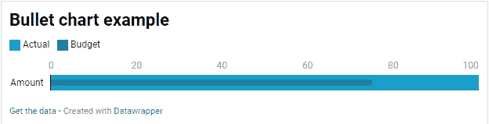

**子弹图。** 作者截图。

**子弹图** 是一种数据可视化，用于显示相对于预定义目标或基准的绩效数据。它由以下元素组成：

1.  **条形图** 代表一个主要度量（例如当前业绩或年初至今的收入）。

1.  **标记线** 代表一个比较度量（例如目标或前一年业绩）。

1.  它还可以显示 **范围**，使用颜色的不同深浅或其他颜色来表示定性绩效，例如差、满意和良好。

主要度量与比较度量和定性范围进行对比，以便迅速评估业绩是否达标或符合基准。**子弹图通常用于业务绩效管理的仪表板和报告中。**

以下是我使用[**Datawrapper**](https://app.datawrapper.de/)制作的一个子弹图示例。Datawrapper 是一个在线工具，能够创建高效、美观且视觉上引人注目的可视化效果。无需掌握 HTML 或 Python 等特定 IT 知识——所有操作都可以通过图形界面完成。*不幸的是*，这是一个完全在线的工具，没有本地安装选项。因此，为了获得可视化效果，你需要将数据直接上传到工具中。Datawrapper 允许将可视化保存为 *.png 文件或嵌入到网站上。

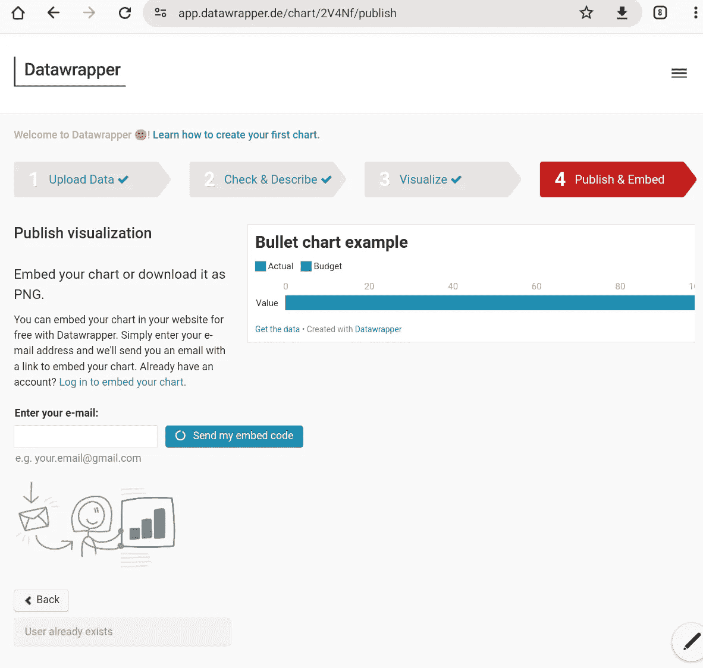

来源：作者打印屏幕截图。

## **仪表/速度计**

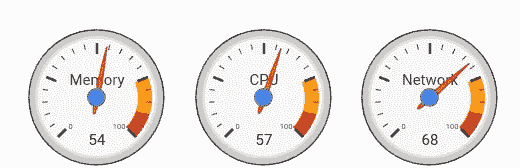

来源：作者打印屏幕截图。

仪表可以与子弹图发挥类似的功能。仪表或速度计图是一种数据可视化，类似于汽车的速度计，表示一个值在一系列值中的位置。它通常用于展示关键绩效指标（KPI）、目标达成情况或其他业务数据。

以下是仪表图的主要组成部分：

1\. **指针或指示器：** 代表数据值。

2\. **刻度盘或刻度：** 一个圆形或半圆形刻度，显示可能值的范围。

3\. **弧形或带状：** 不同颜色的区域通常代表性能范围。

通过观察指针在彩色弧形或带中的位置，观众可以迅速了解值在范围中的上下文，以及它如何与预定义的性能水平相关联。这种视觉表现使得轻松判断性能是否正常、低于预期或超出目标。⁷

你可以使用 Google Charts 轻松准备如上所示的仪表。然而，下面是另一个示例，这次是使用 ChatGPT 和 Noteable 创建的。实际上，这种工具组合不是免费的，你仍然可以在 ChatGPT 免费版中生成这种可视化的代码，然后将其粘贴到 Noteable 笔记本中。

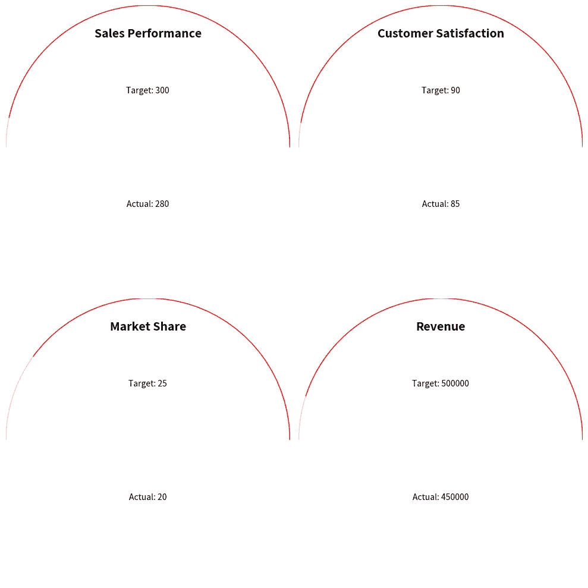

**另一种类型的仪表。** 来源：作者在 ChatGPT 和 Noteable 中生成的图像。

## **迷你图或火花图**

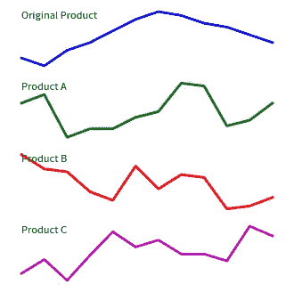

火花图是紧凑的图表，旨在同时显示多个数据系列的趋势或变化，通常在电子表格单元格或小报告部分内。与标准图表不同，火花图通常缺乏坐标轴标签和图例。它们的主要目的是提供清晰而简明的数据趋势视觉表示，而不占用太多空间。火花图可以有效地展示股价趋势、天气模式、销售数据等。我还将它们用作导航工具；用户可以点击火花图以访问完整大小的图表，如果他们发现了有趣的内容。⁸

**以下是一些场景，其中火花图非常有用：**

1.  **销售报告：** 展示每种产品在目录或电子表格中的月度销售趋势。

1.  **股票市场分析：** 在财务报告中显示多家公司历史股价趋势。

1.  **网站分析：** 显示网站流量或用户参与度指标的趋势。

1.  **库存管理：** 描绘各种产品库存水平的波动。

以上是我创建的火花图示例。对于这个特定练习，我再次使用了 ChatGPT 和 Noteable 插件。这一次，我在一个 Android 设备上的网站上完成了这个工作。我为图表生成了随机样本数据和图表代码（代码见下文）。

```py
import numpy as np

np.random.seed(0)
sales_a = [200 + np.random.randint(0, 21) for _ in range(12)]
sales_b = [300 - np.random.randint(0, 21) for _ in range(12)]
sales_c = [250 + np.random.randint(-20, 21) for _ in range(12)]

fig, axs = plt.subplots(4, 1, figsize=(4, 4))

axs[0].plot(df['Sales'], color='b', linewidth=2)
axs[0].axis('off')

axs[1].plot(sales_a, color='g', linewidth=2)
axs[1].axis('off')

axs[2].plot(sales_b, color='r', linewidth=2)
axs[2].axis('off')

axs[3].plot(sales_c, color='m', linewidth=2)
axs[3].axis('off')

plt.show()
```

# 摘要

**本文旨在拓展数据可视化的世界，超越条形图、折线图和饼图。还有许多其他更高级的选项值得考虑，以产生有洞察力和吸引力的可视化。附带的还有对各种免费工具的审查和“实地测试”，这些工具可以用来制作这样的可视化。**

我特别讨论了使用案例，展示了优缺点，并演示了如桑基图、瀑布图、雷达图、哑铃图、仪表盘、火花图和子弹图等复杂图表的示例。我使用了多种工具来制作这些可视化，包括 Google Charts、Noteable、Python 和 Plotly。

我的主要目标是帮助你发掘这些可视化的潜力，使你能够用数据编织出更具吸引力的叙述。**无论我是否成功，我鼓励你尝试这些替代图表类型，以了解它们的特点，测试各种应用，并进一步增强你的数据驱动叙事工具库。**

> 你喜欢这篇文章吗？考虑订阅以获得新故事的通知，关注我，或简单地留下一个 👏。

# 参考资料

1.  Wikipedia，[滑块](https://en.m.wikipedia.org/wiki/Skid_block)

1.  Michal Szudejko，[可视化十诫](https://www.michalszudejko.pl/post/decalogue-of-visualization-dekalog-przygotowywania-wizualizacji)

1.  Google Charts，[桑基图](https://developers.google.com/chart/interactive/docs/gallery/sankey)

1.  Tessica Dall, 需要在仪表板中强调变化？忘掉条形图，改用哑铃图！

1.  Elijah Meeks, [介绍 Data Prism 自动图表生成器](https://medium.com/@Elijah_Meeks/introducing-data-prism-the-automatic-chart-builder-26b5e72c9d5c)

1.  Chart.js, [雷达图](https://www.chartjs.org/docs/latest/charts/radar.html)

1.  Bernardita Calzon, [发现仪表盘图表的力量：定义、最佳实践和示例](https://www.datapine.com/blog/gauge-chart-examples/)

1.  维基百科, [火花图](https://en.wikipedia.org/wiki/Sparkline)
