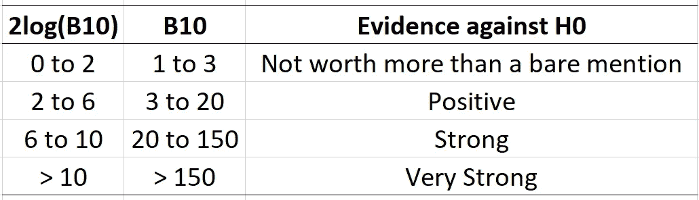
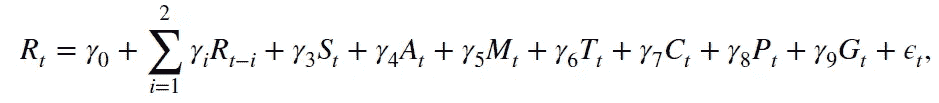
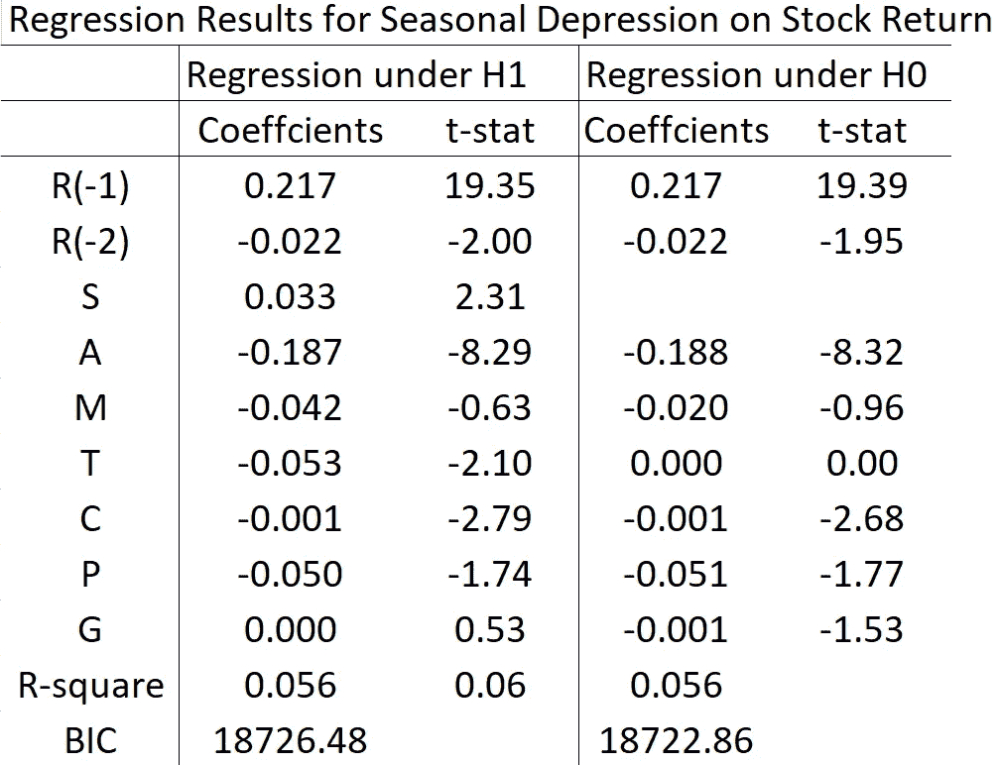
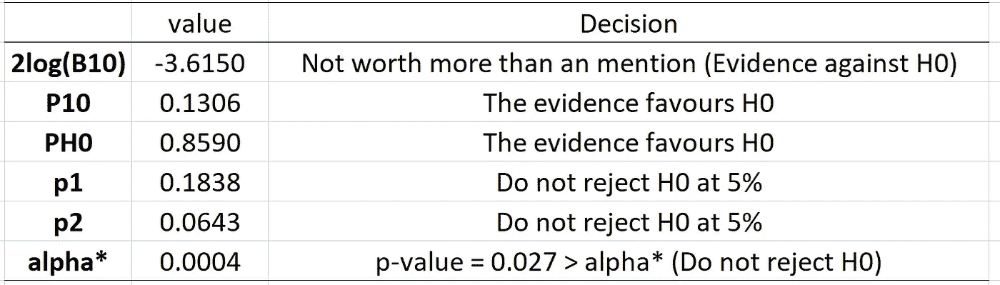

# p 值标准的替代方法（带 R 代码）

> 原文：[`towardsdatascience.com/alternatives-to-the-p-value-criterion-for-statistical-significance-with-r-code-222cfc259ba7`](https://towardsdatascience.com/alternatives-to-the-p-value-criterion-for-statistical-significance-with-r-code-222cfc259ba7)

## 更好的统计决策方法

[](https://medium.com/@jaekim8080?source=post_page-----222cfc259ba7--------------------------------)[](https://towardsdatascience.com/?source=post_page-----222cfc259ba7--------------------------------) [Jae Kim](https://medium.com/@jaekim8080?source=post_page-----222cfc259ba7--------------------------------)

·发表于 [Towards Data Science](https://towardsdatascience.com/?source=post_page-----222cfc259ba7--------------------------------) ·阅读时长 8 分钟·2023 年 3 月 12 日

--


图片由 [Rommel Davila](https://unsplash.com/@rommeldav22?utm_source=medium&utm_medium=referral) 提供，来源于 [Unsplash](https://unsplash.com/?utm_source=medium&utm_medium=referral)

在确定统计显著性时，p 值标准几乎被普遍使用。该标准是在 p 值低于显著性水平（*α*）时，拒绝零假设（H0），支持替代假设（H1）。这一决策阈值的传统值包括 0.05、0.10 和 0.01。

根据定义，p 值衡量样本信息与 H0 的一致性：即 P(D|H0)，在 H0 下数据（D）的概率或可能性。然而，正如美国统计协会（[Wasserstein 和 Lazar，2016](https://www.tandfonline.com/doi/full/10.1080/00031305.2016.1154108)）的声明所明确指出的，p 值标准作为决策规则存在许多严重缺陷。主要缺陷包括

1.  p 值是样本量的递减函数；

1.  该标准完全忽略了 P(D|H1)，即数据与 H1 的一致性；并且

1.  *α* 的传统值（如 0.05）是任意的，几乎没有科学依据。

其中一个后果是，当 p 值标准在实际无关的范围内拒绝 H0 时，这种情况尤其在样本量较大时更为明显。这种情况发生的原因是，虽然 p 值是样本量的递减函数，但其阈值（*α*）是固定的，不随样本量的增加而减少。在这一点上，[Wasserstein 和 Lazar (2016](https://www.tandfonline.com/doi/full/10.1080/00031305.2016.1154108)) 强烈建议用其他替代方法补充甚至替代 p 值。

在这篇文章中，我介绍了一系列简单但更为合理的备选方法，以克服上述提到的缺陷。它们可以分为三类：

1.  平衡 P(D|H0) 和 P(D|H1)（贝叶斯方法）；

1.  调整显著性水平（*α*）；以及

1.  调整 p 值。

这些备选方法计算简单，并且能够提供比仅基于 p 值标准的推断结果更为合理的结论，这将通过一个包含 R 代码的应用进行演示。

# **背景**

考虑一个线性回归模型

Y = β0 + β1 X1 + … + βk Xk + u，

其中 Y 是因变量，X 是自变量，u 是一个随机误差项，服从均值为零且方差固定的正态分布。我们考虑检验

H0: β1 = … = βq = 0，

针对 H1，即 H0 不成立（q ≤ k）。一个简单的例子是 H0: β1 = 0; H1: β1 ≠ 0，其中 q =1。

借用贝叶斯统计推断，我们定义以下概率：

**Prob(H0|D)**：H0 的后验概率，即在研究者观察到数据 D 后 H0 的概率或可能性；

**Prob(H1|D) ≡ 1 — Prob(H0|D)**：H1 的后验概率；

**Prob(D|H0)**：在 H0 下数据的（边际）似然；

**Prob(D|H1)**：在 H1 下数据的（边际）似然；

**P(H0)：** H0 的先验概率，表示研究者在观察到数据之前对 H0 的信念；

**P(H1) = 1 - P(H0)**：H1 的先验概率。

这些概率通过贝叶斯规则有关联，如下所示

主要组件如下：

**P10**：H1 相对于 H0 的后验比率，即 H1 的后验概率与 H0 的后验概率之比；

**B10 ≡ P(D|H1)/P(D|H0)**，称为贝叶斯因子，即 H1 下的（边际）似然与 H0 下的（边际）似然之比；

**P(H1)/P(H0)**：先验比率。

请注意，后验比率是贝叶斯因子与先验比率的乘积，且如果 Prob(H0) = Prob(H1) = 0.5，那么 P10 = B10。

决策规则是，如果 **P10 > 0**，证据支持 H1 相对于 H0。这意味着在研究者观察到数据后，如果 P(H1|D) > P(H0|D)**，** 即 H1 的后验概率高于 H0 的后验概率，那么她倾向于 H1。

对于 B10，[Kass 和 Raftery (1995)](https://www.tandfonline.com/doi/abs/10.1080/01621459.1995.10476572) 提出了如下决策规则：



作者创建的图像

例如，如果 B10 = 3，则 **P(D|H1) = 3 × P(D|H0)**，这意味着数据与 H1 的兼容性是与 H0 兼容性的三倍。请注意，贝叶斯因子有时表示为 2log(B10)，其中 log() 是自然对数，与似然比检验统计量的尺度相同。

# 备选方法的公式

## 贝叶斯因子

[Wagenmakers (2007)](https://link.springer.com/article/10.3758/BF03194105) 提供了贝叶斯因子的简单近似公式：

**2log(B10) = BIC(H0) — BIC(H1)**，

其中 BIC(Hi) 表示在 Hi (i = 0, 1) 下的贝叶斯信息准则值。

## 后验概率

[Zellner 和 Siow (1979)](https://link.springer.com/article/10.1007/BF02888369) 提供了 P10 的公式：

图片由作者创建

其中 F 是用于 H0 的 F 检验统计量，Γ() 是伽马函数，v1 = n-k0-k1–1，n 是样本大小，k0 是 H0 下的受限参数数量；k1 是 H0 下的不受限参数数量（k = k0+k1）。

[Startz (2014)](http://dx.doi.org/10.1561/0800000028) 提供了一个公式用于计算**P(H0|D)**，即 H0 的后验概率，用于检验 H0: βi = 0：

图片由作者创建

其中 t 是用于 H0: βi = 0 的 t 统计量，ϕ() 是标准正态密度函数，s 是用于估计 βi 的标准误差估计器。

## 对 p 值的调整

[Good (1988)](https://www.jstor.org/stable/2245388) 提出了以下对 p 值的调整：

图片由作者创建

其中 *p* 是 H0: βi = 0 的 p 值。该规则通过考虑贝叶斯因子对尖锐零假设的收敛速度来获得。调整后的 p 值（***p*1**）随样本大小 *n* 增加。

[Harvey (2017)](https://onlinelibrary.wiley.com/doi/abs/10.1111/jofi.12530) 提出了所谓的贝叶斯化 p 值

图片由作者创建

其中 PR ≡ P(H0)/P(H1)，MBF = exp(-0.5t²) 是最小贝叶斯因子，而 t 是 t 统计量。

## 显著性水平调整

[Perez 和 Perichhi (2014)](https://www.sciencedirect.com/science/article/abs/pii/S0167715213003611) 提出了一个显著性水平的自适应规则，该规则通过调和贝叶斯推断方法和似然比原则得出，如下所示：

图片由作者创建

其中 *q* 是 H0 下的参数数量，*α* 是初始显著性水平，例如 0.05，*χ*²(*α*,*q*) 是具有 *q* 自由度的卡方分布的 *α* 水平临界值。简而言之，该规则将显著性水平调整为样本大小 *n* 的递减函数。

# 应用 R 代码

在本节中，我们将上述替代指标应用于大样本回归，并检验这些推断结果与仅基于 p 值标准得到的结果有何不同。也提供了这些指标计算的 R 代码。

[Kamstra et al. (2003)](https://www.jstor.org/stable/3132178) 研究了与季节性情感障碍相关的抑郁症对股票收益的影响。他们声称阳光时长可以系统地影响股票收益的变化。他们估计了以下形式的回归模型：



图片由作者创建

其中 *R* 是第 t 天的股票回报率；*M* 是一个星期一的虚拟变量；*T* 是税年最后一个交易日或前五个交易日的虚拟变量；*A* 是秋季天数的虚拟变量；*C* 是云覆盖；*P* 是降水量；*G* 是温度，而 *S* 测量阳光的长度。

他们争辩说，随着阳光时间的增加，投资者的心情更好，他们倾向于购买更多股票，这将提高股价和回报。基于此，他们的零假设和备择假设是

H0: γ3 = 0；H1: γ3 ≠ 0。

他们的回归结果使用美国股市数据进行重复，数据时间从 1965 年 1 月到 1996 年 4 月（7886 个观测值）。数据范围受到云覆盖数据的限制，只有 1965 年至 1996 年的数据可用。完整结果及更多细节请参见 [Kim (2022)](https://link.springer.com/article/10.1007/s11846-021-00504-6)。



作者创建的图像

上表总结了在 H0 和 H1 下的回归结果。零假设 H0: γ3 = 0 在 5% 显著性水平下被拒绝，系数估计值为 0.033，t 统计量为 2.31，p 值为 0.027。因此，基于 p 值标准，阳光的长度对股票回报具有统计学意义：预计股票回报会因阳光长度增加 1 单位而提高 0.033%。

虽然这对股票市场效率的暗示形成了证据，但可以争辩说，这一效应是否足够大以至于在实际中重要仍然值得怀疑。

备择测量值和相应的决策如下所示：



作者创建的图像

请注意，P10 和 p2 是在假设 P(H0)=P(H1) 的情况下计算的，这意味着研究者在 H0 和 H1 之间是 *a priori* 公正的。从上表中的结果可以清楚地看出，所有对 p 值标准的备择方案都强烈支持 H0 而不是 H1，或者在 5% 显著性水平下无法拒绝 H0。[Harvey (2017)](https://onlinelibrary.wiley.com/doi/abs/10.1111/jofi.12530) 的贝叶斯化 p 值表明在 10% 显著性水平下拒绝 H0。

因此，我们可以得出结论，[Kamstra 等人 (2003)](https://www.jstor.org/stable/3132178) 的结果仅基于 p 值标准，在备择决策规则下并不那么令人信服。鉴于效果量的可疑性和模型的拟合优度几乎可以忽略不计（R² = 0.056），基于这些备择方法的决策似乎更为合理。

以下 R 代码展示了这些备择方案的计算（完整代码和数据可向作者索取）：

```py
# Regression under H1
Reg1 = lm(ret.g ~ ret.g1+ret.g2+SAD+Mon+Tax+FALL+cloud+prep+temp,data=dat)
print(summary(Reg1))
# Regression under H0
Reg0 = lm(ret.g ~ ret.g1+ret.g2+Mon+FALL+Tax+cloud+prep+temp, data=dat)
print(summary(Reg0))

# 2log(B10): Wagenmakers (2007)
print(BIC(Reg0)-BIC(Reg1))

# PH0: Startz (2014)
T=length(ret.g); se=0.014; t=2.314
c=sqrt(2*3.14*T*se²); 
Ph0=dnorm(t)/(dnorm(t) + se/c)
print(Ph0)

# p-valeu adjustment: Good (1988) 
p=0.0207
P_adjusted = min(c(0.5,p*sqrt(T/100))) 
print(P_adjusted)

# Bayesianized p-value: Harvey (2017)
t=2.314; p=0.0207
MBF=exp(-0.5*t²)
p.Bayes=MBF/(1+MBF)
print(p.Bayes)

# P10: Zellner and Siow (1979)
t=2.314
f=t²; k0=1; k1=8; v1 = T-k0-k1- 1
P1 =pi^(0.5)/gamma((k0+1)/2)
P2=(0.5*v1)^(0.5*k0)
P3=(1+(k0/v1)*f)^(0.5*(v1-1))
P10=(P1*P2/P3)^(-1)
print(P10)

# Adaptive Level of Significance: Perez and Perichhi (2014)
n=T;alpha=0.05
q = 1                           # Number of Parameters under H0
adapt1 = ( qchisq(p=1-alpha,df=q) + q*log(n) )^(0.5*q-1)
adapt2 = 2^(0.5*q-1) * n^(0.5*q) * gamma(0.5*q)
adapt3 = exp(-0.5*qchisq(p=1-alpha,df=q))
alphas=adapt1*adapt3/adapt2
print(alphas)
```

# **结论**

p 值标准存在许多缺陷。单纯依赖这一决策规则在科学研究中产生了严重问题，包括错误的典型事实积累、研究诚信和研究可信度：见美国统计学会的声明（[Wasserstein and Lazar, 2016](https://www.tandfonline.com/doi/full/10.1080/00031305.2016.1154108)）。

本帖子介绍了几种 p 值标准的替代方法用于统计证据。通过考虑多种替代方案的信息，可以做出更平衡和知情的统计决策。盲目使用单一决策规则可能会导致误导性决策，这可能代价高昂且影响深远。这些替代方案计算简单，可以补充 p 值标准，以便做出更好、更明智的决策。

## 请关注我，以获取更多有趣的帖子！
