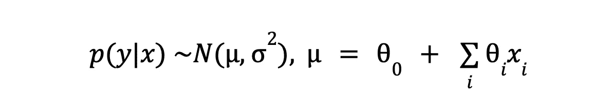
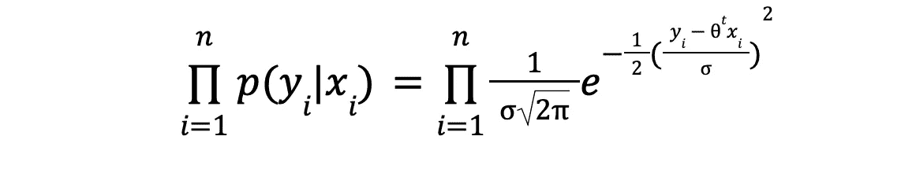
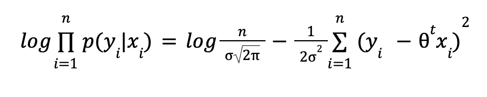
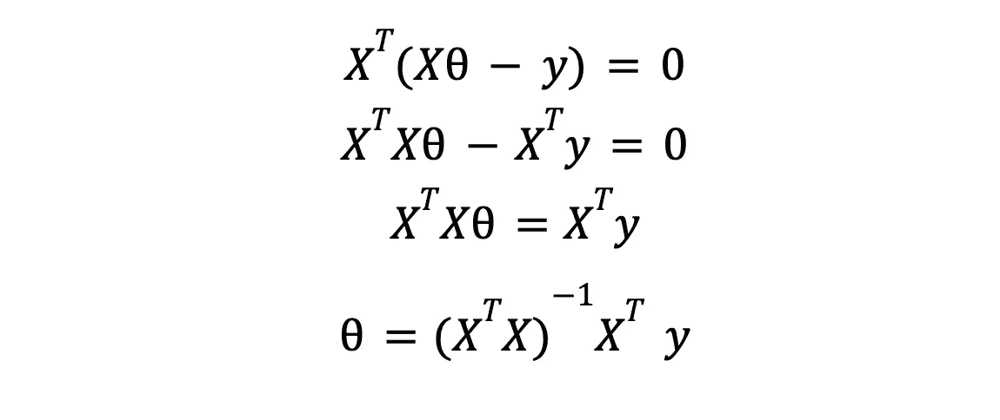
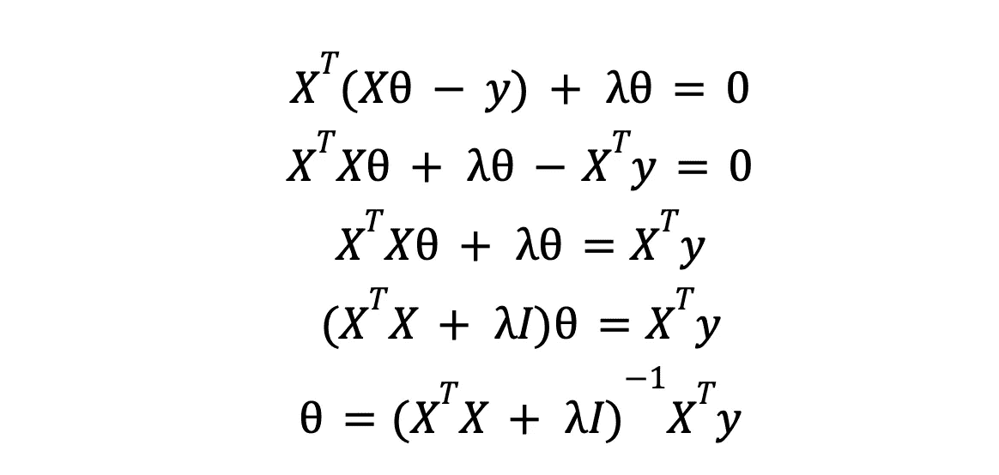

# 线性回归的易懂推导

> 原文：[`towardsdatascience.com/an-accessible-derivation-of-linear-regression-69fa6aefbd93?source=collection_archive---------8-----------------------#2023-08-23`](https://towardsdatascience.com/an-accessible-derivation-of-linear-regression-69fa6aefbd93?source=collection_archive---------8-----------------------#2023-08-23)

## 模型背后的数学，从加法假设到伪逆矩阵

 [威廉·凯塞多-托雷斯博士](https://william-caicedo.medium.com/?source=post_page-----69fa6aefbd93--------------------------------)

·

[关注](https://medium.com/m/signin?actionUrl=https%3A%2F%2Fmedium.com%2F_%2Fsubscribe%2Fuser%2F7a925ed40bb4&operation=register&redirect=https%3A%2F%2Ftowardsdatascience.com%2Fan-accessible-derivation-of-linear-regression-69fa6aefbd93&user=William+Caicedo-Torres%2C+PhD&userId=7a925ed40bb4&source=post_page-7a925ed40bb4----69fa6aefbd93---------------------post_header-----------) 发表在 [Towards Data Science](https://towardsdatascience.com/?source=post_page-----69fa6aefbd93--------------------------------) ·9 分钟阅读·2023 年 8 月 23 日

--

图片由 [Saad Ahmad](https://unsplash.com/@saadahmad_umn?utm_source=medium&utm_medium=referral) 提供，来源于 [Unsplash](https://unsplash.com/?utm_source=medium&utm_medium=referral)

***技术免责声明***：可以在没有正态性假设的情况下推导出模型。我们选择这个路径是因为它足够简单易懂，并且通过假设模型输出的正态性，我们可以推理预测的不确定性。

本文面向那些已经了解线性回归是什么（并可能使用过一两次）并希望深入了解其背后数学原理的人。

需要一些基本概率（概率分布、联合概率、互斥事件）、线性代数和统计学的背景知识，以充分理解接下来的内容。废话不多说，我们开始吧：

机器学习世界充满了惊人的联系：指数族、正则化和先验信念、KNN 和 SVM、最大似然和信息理论——这一切都连接在一起！（我喜欢[黑暗](https://www.themoviedb.org/tv/70523-dark)）。这次我们将讨论如何推导出指数族的另一个成员：线性回归模型，在这个过程中，我们将看到均方误差损失在理论上是有良好动机的。与任何回归模型一样，我们将能够用它来预测数值型连续目标。它是一个简单却强大的模型，恰好是统计推断和实验设计中的一个重要工具。然而，我们将仅关注其作为预测工具的使用。这里没有烦人的推断（更别说因果）问题。

好的，让我们开始。我们想根据其他东西来预测某物。我们将把***预测的***东西叫做 y，将***其他东西***叫做 x。作为一个具体的例子，我提供以下玩具情境：你是一名在银行工作的信用分析师，你希望自动找出银行客户的正确信用额度。你也恰好拥有一个关于过去客户的数据库，其中包含了为他们批准的信用额度（即***预测的***东西），以及一些他们的特征，如人口信息、过去的信用表现、收入等（即***其他东西***）。

因此，我们有一个很好的想法，写下一个模型，该模型根据你拥有的特征来解释信用额度，模型的主要假设是每个特征以加法方式对观察到的输出有所贡献。由于信用额度只是一个激励性（和人为设计的）例子，我们回到纯数学的球形牛世界中，我们的模型变成了如下形式：

我们仍然有预测的东西（y）和用于预测的其他东西（x）。我们承认某种噪声是不可避免的（无论是由于测量不完美还是我们的盲点），我们能做的最好是假设我们观察到的数据背后的模型是随机的。其结果是我们可能会看到相同输入的略微不同的输出，因此我们不再是精确的点估计，而是“困在”以输入（x）为条件的输出（y）的概率分布中：

y 中的每个数据点都被一个小的钟形曲线替代，其均值位于观察到的 y 值中，并且具有一些我们目前不关心的方差。然后，我们的小模型将取代分布均值的位置。

假设所有这些钟形曲线实际上是正态分布，并且它们的均值（y 中的数据点）彼此独立，则观察到数据集的（联合）概率为

对数和一些代数来拯救我们：

对数是很酷的，不是吗？对数将乘法转化为加法，除法转化为减法，幂运算转化为乘法。从代数和数值的角度来看都非常方便。去掉与此无关的常数项，我们得到以下最大似然问题：

好吧，这等于

我们即将最小化的表达式非常接近著名的 **均方误差** 损失。实际上，在优化目的上它们是等价的。

那么接下来呢？这个最小化问题可以通过求导精确解决。我们将利用损失是二次的这一事实，这意味着它是凸的，即有一个全局最小值；这允许我们对其进行求导，设置为零并求解 theta。这样我们将找到使损失的导数为零的参数 theta 的值。为什么？因为正是导数为零的点，损失达到其最小值。

为了让一切变得更简单一些，让我们用向量表示法来表达损失：

在这里，X 是一个 *NxM* 矩阵，表示我们的整个数据集，其中包含 N 个示例和 M 个特征，而 y 是一个包含每个训练示例期望响应的向量。对其进行求导并将其设置为零，我们得到

这就是我们将原始机器学习问题转化为的优化问题的解决方案。如果你继续将这些参数值代入你的模型，你将拥有一个经过训练的机器学习模型，准备使用一些保留数据集（或通过交叉验证）进行评估。

如果你觉得最终的表达式看起来非常像线性系统的解，

正是因为它确实如此。额外的内容来自于这样一个事实：为了使我们的问题等同于一个普通的线性系统，我们需要相等数量的特征和训练样本，以便我们可以反转 X。由于这种情况很少出现，我们只能希望得到一个“最佳拟合”解决方案——在某种意义上的最佳——借助 X 的 Moore-Penrose 伪逆，这是一种广义的逆矩阵。相关的[*wikipedia*](https://en.wikipedia.org/wiki/Moore–Penrose_inverse#Definition) 条目非常有趣。

## 对正则化的小探讨

从现在开始，我假设你可能听说过“正则化”这个术语，也许你知道它的意思。无论如何，我会告诉你我对它的理解：正则化是你对模型所做的任何事情，以使其在样本外的表现更好，虽然这可能会牺牲样本内的表现。为什么这是一个问题？因为最终，样本外（即实际生活中的）表现才是重要的——没有人会关心你的训练误差有多低，或者你的 AUC 在训练集上有多么惊人，除非你的模型在实际应用中表现得相对较好。而且我们发现，如果我们不小心，会遇到所谓的过拟合问题，在这种情况下，你的模型会记住训练集直到噪声，可能对样本外预测无用。我们还知道模型复杂性与样本外表现之间存在权衡（Vapnik 的统计学习理论），正则化可以看作是试图控制模型复杂性，希望实现更好的泛化能力（这里的泛化是样本外表现的另一种说法）。

正则化可以采取多种形式，但本文仅讨论一种常用于线性回归模型的方法。记住我说过，通过正则化我们是为了控制复杂性，对吗？好吧，不需要的复杂性主要通过两种方式潜入：1. 输入特征过多和 2. 对应的 theta 值过大。事实证明，所谓的 L2 正则化可以帮助解决这两个问题。记住我们的损失吗？

我们之前只关心最小化预测值和观察值 y 之间的平方差，而不考虑其他任何因素。这种狭隘的关注可能会成为问题，因为原则上你可以利用系统，不断添加特征，直到误差微乎其微，即使这些额外的特征与我们尝试学习的信号无关。如果我们对与问题相关的事物有完美的了解，我们就不会包含无用的特征！（公平地说，我们本来不会使用机器学习，但我扯远了）。为了弥补我们的无知并减少引入不必要复杂性的风险，我们将向损失中添加一个额外的项：

这有什么作用，你可能会问。我告诉你——我们刚刚引入了一个激励，以使参数的幅度尽可能接近零。换句话说，我们希望保持复杂性在最小化。现在，我们不再只有一个目标（最小化预测误差），我们多了一个（最小化复杂性），解决整体问题的方案将需要平衡这两个目标。通过那个闪亮的新 lambda 系数，我们对这种平衡有一定的发言权：它越大，我们就越重视低复杂性的目标。

说了这么多。让我们看看额外的项对最优 theta 的影响。新的向量化形式的损失是

计算其导数，将其设置为零并求解 theta：

事实证明，新解决方案与之前的方案并没有太大区别。我们多了一个额外的对角矩阵，它将处理任何可能导致我们无法反转 XTX 矩阵的秩问题，通过在混合中加入一些“抖动”。这揭示了另一种可能引入不必要复杂性的方式：共线特征，即线性变换（缩放和移动版本）的特征。就线性回归而言，两个共线特征实际上是同一个特征，只算作一列，额外的特征不会为训练模型提供任何新的信息；这使得 XTX 矩阵的秩不足，即无法反转。通过正则化，在 XTX 的每一行中，lambda（抖动）会影响不同的列——从而阻止任何可能的共线性，并使其变为满秩。我们看到，添加随机变量作为预测器实际上可能破坏整个学习过程。幸运的是，正则化可以拯救这一切（请不要误解我对正则化的赞美为在选择预测器时可以粗心大意——绝不是这样）。

所以，就这样，一个正则化的线性回归模型准备好了。接下来我们怎么做？嗯，你可以扩展正则化编码了关于参数空间的先验信念的想法，揭示其与贝叶斯推断的联系。或者你可以深入研究其与支持向量机的联系，并最终与像 KNN 这样的非参数模型的联系。同时，你还可以思考线性和逻辑回归中的那些华丽梯度看起来非常相似的事实。请放心，我将在未来的文章中触及这些主题！
