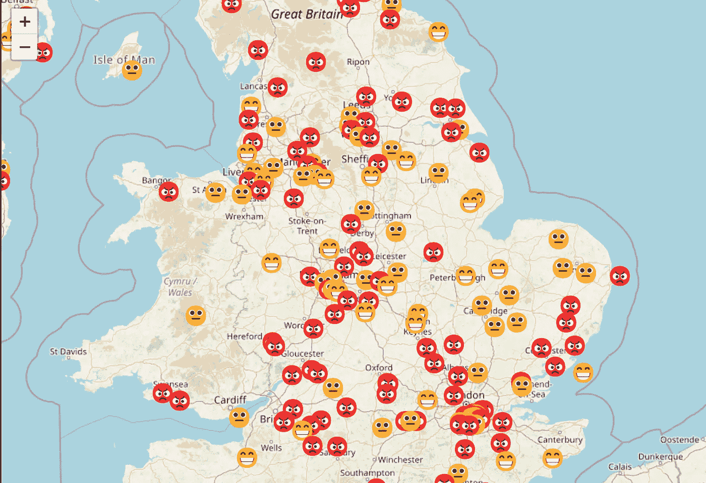

# 通过推文对我们邮政服务进行 AI 驱动的分析

> 原文：[`towardsdatascience.com/an-ai-powered-analysis-of-our-postal-service-through-tweets-fa1764409905?source=collection_archive---------9-----------------------#2023-03-22`](https://towardsdatascience.com/an-ai-powered-analysis-of-our-postal-service-through-tweets-fa1764409905?source=collection_archive---------9-----------------------#2023-03-22)

## 用 AI 解读客户声音

## 深入探讨机器学习、主题建模和情感分析，以揭示宝贵的客户观点

 [John Adeojo](https://johnadeojo.medium.com/?source=post_page-----fa1764409905--------------------------------)

·

[关注](https://medium.com/m/signin?actionUrl=https%3A%2F%2Fmedium.com%2F_%2Fsubscribe%2Fuser%2Ff933e1637e40&operation=register&redirect=https%3A%2F%2Ftowardsdatascience.com%2Fan-ai-powered-analysis-of-our-postal-service-through-tweets-fa1764409905&user=John+Adeojo&userId=f933e1637e40&source=post_page-f933e1637e40----fa1764409905---------------------post_header-----------) 发表在 [Towards Data Science](https://towardsdatascience.com/?source=post_page-----fa1764409905--------------------------------) · 13 min 阅读 · 2023 年 3 月 22 日 

--

作者提供的图像：为 #royalmail 生成的 AI 情感和主题

# 引言

我和我的伙伴通常经历着极好的邮政服务。大多数时候，信件都会在未打开的情况下及时送到我们家。因此，当我们的邮件几周没有到达时，我们觉得非常奇怪。经过一些细致的网络搜索，我们发现这次服务中断的最可能原因是罢工。作为一名数据科学家，这整件事让我思考了很多…

> 有没有办法利用在线数据来追踪这些类型的事件？

对这个问题的回答是肯定的，我已经构建了一个原型供你使用。我建议你在继续阅读之前先试用一下，这样可以让你在进入技术细节之前对事物有个初步了解。

🌏 [探索这个应用](https://john-adeojo-royalmail-dash-scriptsstreamlitstreamlit-rm-o2f2wo.streamlit.app/) — 最好在电脑上打开，尽管它也可以在手机上使用。
