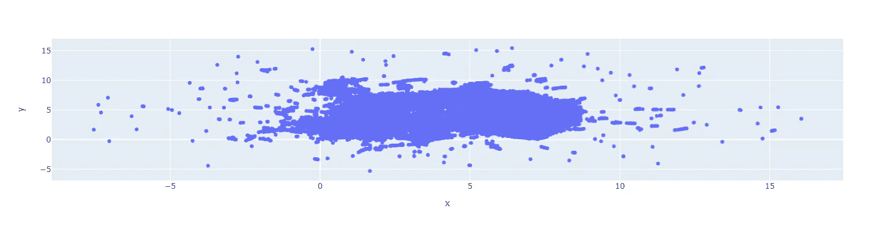
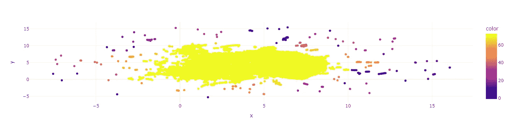
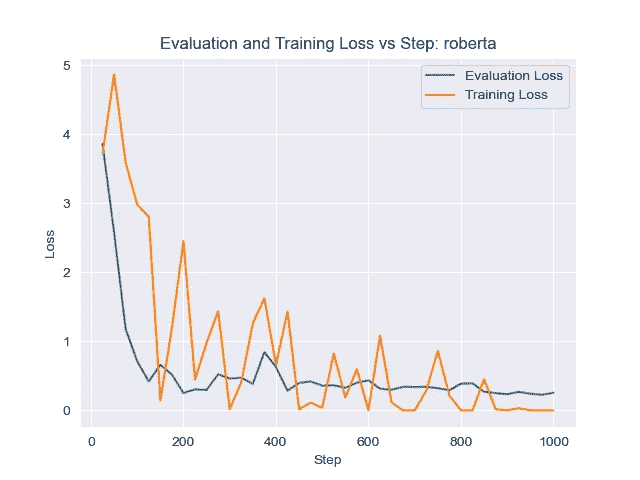
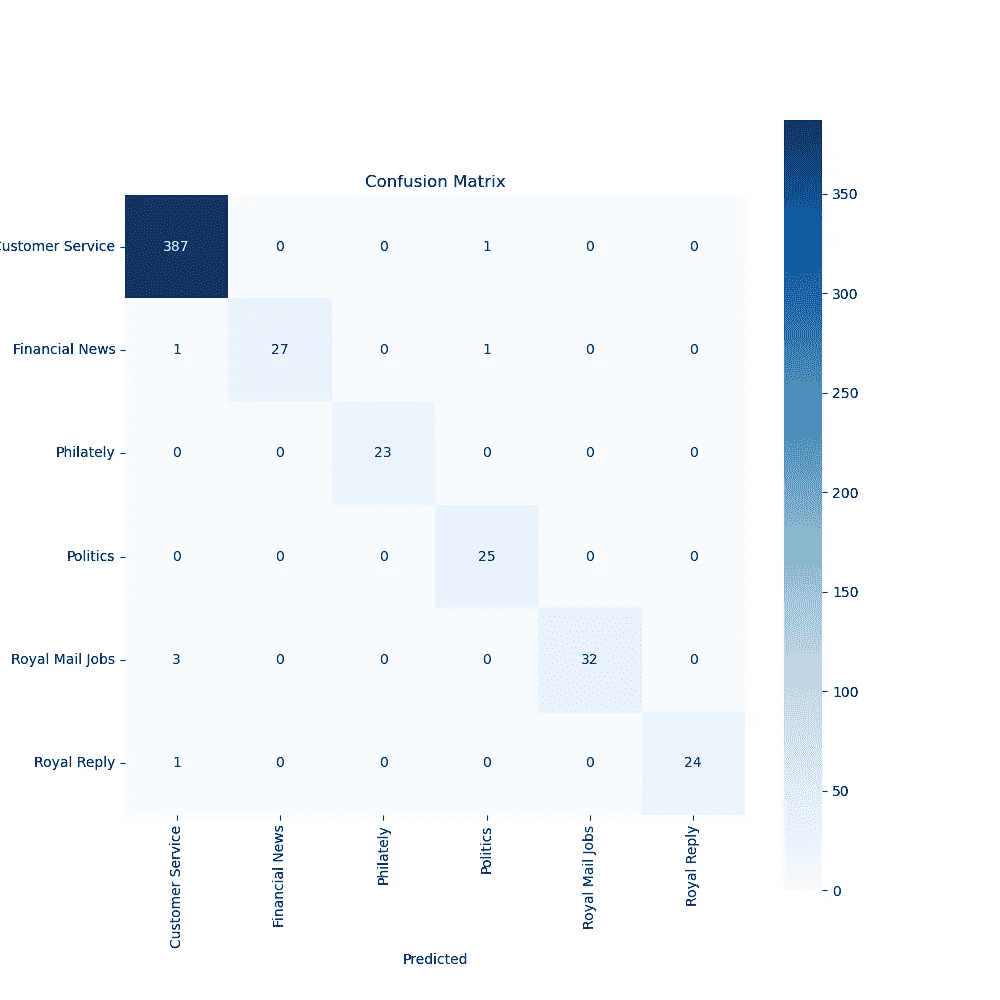
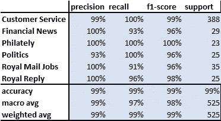

# 通过推文对我们邮政服务的 AI 驱动分析

> 原文：[`towardsdatascience.com/an-ai-powered-analysis-of-our-postal-service-through-tweets-fa1764409905`](https://towardsdatascience.com/an-ai-powered-analysis-of-our-postal-service-through-tweets-fa1764409905)

## 用 AI 解码客户声音

## 深入探讨机器学习、主题建模和情感分析，以揭示有价值的客户观点

[](https://johnadeojo.medium.com/?source=post_page-----fa1764409905--------------------------------)[](https://towardsdatascience.com/?source=post_page-----fa1764409905--------------------------------) [John Adeojo](https://johnadeojo.medium.com/?source=post_page-----fa1764409905--------------------------------)

·发布于 [Towards Data Science](https://towardsdatascience.com/?source=post_page-----fa1764409905--------------------------------) ·13 分钟阅读·2023 年 3 月 22 日

--


图片作者：AI 生成的情感和主题分析 #royalmail

# 介绍

我和我的搭档通常体验到优质的邮政服务。大多数时候，信件会及时到达我们家，并且没有被拆开。因此，当我们的邮件几周没到时，我们觉得非常奇怪。在经过一番认真的网络搜索后，我们发现这次服务中断最可能的原因是罢工。作为数据科学家，这整个事件让我开始思考……

> 是否有办法利用在线数据追踪这些类型的事件？

对这个问题的回答是肯定的，我已经构建了一个原型，你可以试玩一下。我建议在继续阅读之前先试用一下，这样可以让你在进入技术细节之前对事物有一个了解。

🌏 [探索应用](https://john-adeojo-royalmail-dash-scriptsstreamlitstreamlit-rm-o2f2wo.streamlit.app/) — 最好在电脑上打开，尽管手机也能使用。

我将在这篇文章的剩余部分带你了解我是如何回答这个问题的。这几乎是一个端到端的机器学习项目，涉及软件工程、社交媒体数据挖掘、主题建模、变压器、自定义损失函数、迁移学习和数据可视化等方面。如果这些对你有吸引力，拿个小吃或饮料，坐下来，因为这可能会比较长，但希望值得一读。

**免责声明**：本文是对包含 #royalmail 标签的推文的独立分析，与 Royal Mail Group Ltd 没有任何关联、认可或赞助。本文中表达的观点和发现仅代表作者个人观点，不代表 Royal Mail Group Ltd 或其任何子公司的观点或官方立场。

# 方法

在寻求了解人们的想法时，Twitter 总是一个很好的起点。人们在 Twitter 上发布的大部分内容是公开的，并且可以通过其 API 轻松访问。这是你可以找到大量客户服务见解的那种不受限制的言语领域。我感到好奇，自己进行了一个简单的 Twitter 搜索，从‘#royalmail’开始。瞧！一堆推文。

确定了数据源后，我做的下一步是找出如何“挖掘”那些推文中提出的问题。主题建模立即浮现在脑海中。我认为对推文进行某种类型的聚类可以揭示一些潜在的主题。我将花费剩下的篇幅深入一些技术细节。这不会是逐步的过程，而是窥视我的肩膀以及对我在这个项目中思考过程的窗口。

# 软件工程

**开发环境**：我大多数的机器学习项目都是用 python 完成的，所以我偏好使用 Jupyter labs。我发现能够快速切换 Jupyter notebooks、python 脚本和终端非常有用。

**文件结构**：这是一个相当复杂的项目，如果我这么说的话。这里有几个过程需要考虑，因此这不是一个可以仅从 Jupyter notebook 的安全环境中完成的任务。列出所有这些过程，我们有：数据提取、数据处理、主题建模、机器学习和数据可视化。为了帮助创建一些秩序，我通常会先建立一个合适的文件结构。你可以，也应该利用 bash 脚本来完成这个任务。

```py
│   README.md
│   setup.py
│   __init__.py
│
├───data
│   ├───01_raw
│   │       tweets_details2023-03-15_20-43-36.csv
│   │
│   ├───02_intermediate
│   ├───03_feature_bank
│   ├───04_model_output
│   └───05_Reports
├───data_processing
│       collect_tweets.py
│       preprocess_tweets_lite.py
│       preprocess_tweets_rm.py
│       __init__.py
│
├───machine_learning
│       customer_trainer.py
│       makemodel.py
│       preprocess_ml.py
│       train_models.py
│       __init__.py
│
├───notebooks
│       HDBSCAN_UMAP_notebook.ipynb
│       Twitter Model Analysis Notebook .ipynb
│
└───topic_modeling
        bert_umap_topic.py
        tfidf.py
        twitter_roberta_umap_topic.py
        __init__.py
```

**模块化**：我将每个过程分解为模块，使其易于重用、调整和修改以适应不同的使用场景。模块还帮助保持代码的“干净”。如果没有模块化的方法，我会得到一个长达数千行的 Jupyter notebook 或 python 脚本，非常不吸引人且难以调试。

**版本控制**：对于复杂的项目，你不想丢失进度、覆盖重要内容或搞得一团糟。GitHub 是一个完美的解决方案，因为它使得搞砸的可能性很小。我首先创建一个远程仓库并将其克隆到本地机器上，这样我可以安心地知道我所有的辛勤工作都有备份。GitHub desktop 允许我在提交到远程仓库之前仔细跟踪任何更改。

**包：** 我利用了大量的开源包，下面我将列出关键的包并提供链接。

+   [Transformers](https://huggingface.co/docs/transformers/installation)：hugging face 大型语言模型的 API。

+   [Pytorch](https://pytorch.org/get-started/locally/)：用于构建和定制变换器的框架。

+   [Streamlit](https://streamlit.io/)：用于构建 web 应用程序。

+   [Scikit Learn](https://scikit-learn.org/stable/install.html)：机器学习框架。

+   [UMAP](https://umap-learn.readthedocs.io/en/latest/)：UMAP 算法的开源实现。

+   [HDBSCAN](https://hdbscan.readthedocs.io/en/latest/how_hdbscan_works.html)：HDSCAN 算法的开源实现。

+   [Folium](https://python-visualization.github.io/folium/#:~:text=folium%20makes%20it%20easy%20to,as%20markers%20on%20the%20map.)：用于地理数据可视化。

+   [CUDA](https://docs.nvidia.com/cuda/cuda-installation-guide-microsoft-windows/)：利用 GPU 功能的并行计算平台。

+   [Seaborn](https://seaborn.pydata.org/)：用于 Python 中数据可视化的库。

+   [Pandas](https://pandas.pydata.org/)：处理结构化数据的库。

+   [Numpy](https://numpy.org/)：在 Python 中执行数值操作的库。

**环境管理**：虽然互联网提供了丰富的库，但环境管理很容易变得混乱。为了管理这种复杂性，我喜欢在开始新项目时执行干净环境政策。每个项目严格一个环境。我选择使用 [Anaconda](https://www.anaconda.com/) 作为我的环境管理器，因为它提供了很大的灵活性。

*注意：出于这个项目的目的，我确实为 streamlit web 应用程序和主题建模创建了单独的环境和 GitHub 仓库。*

# 数据

我使用 Twitter API 提取了大约 30k 条公开可用的推文，搜索 #royalmail。我想强调的是，只有公开的数据才能通过 Twitter API 提取，这减轻了一些可能存在的数据隐私问题。

Twitter 数据非常混乱，对于任何自然语言处理（nlp）任务都极其困难。它是充满表情符号、语法不一致、特殊字符、脏话、网址以及所有其他自由文本带来的障碍的社交媒体数据。我为这个特定项目编写了自己的自定义脚本来清理数据。主要是去除网址和烦人的停用词。我提供了“简化”版本的代码片段，但在聚类过程中也使用了更高级的版本。

用于清理推文中的网址的模块

*请注意，这符合 Twitter 的服务条款。他们允许通过* [*他们的 API*](https://developer.twitter.com/en/developer-terms/agreement-and-policy)*对公开可用的数据进行分析和聚合。这些数据既允许用于* [*非商业和商业用途*](https://developer.twitter.com/en/developer-terms/commercial-terms#:~:text=Know%20that%20if%20you%20are,access%20are%20available%20for%20free).&text=Your%20product%20or%20service%20is%20monetized%20if%20you%20earn%20money%20from%20it.)*。*

# 主题建模

我使用的主题建模方法受到 BERT 主题¹ 的启发。我最初尝试了潜在狄利克雷分配（Latent Dirichlet Allocation），但难以得到连贯的结果。BERT 主题是一个很好的参考点，但我注意到它并没有专门设计来从混乱的 Twitter 数据中提取主题。按照与 BERT 主题类似的逻辑步骤，我对方法进行了稍微的调整以适应这个任务。

从高层次来看，BERT 主题使用 BERT 模型生成嵌入，进行降维和聚类以揭示文档中的潜在主题。

我的做法利用了 twitter-xlm-roberta-base² 模型来生成嵌入。这个变换器已经在 Twitter 数据上进行过预训练，捕捉了所有复杂的细微差别，包括表情符号。嵌入只是以数字形式表示句子的一种方式，从而保留了语法和语义信息。嵌入是通过自注意力机制由变换器学习的。所有最近的大型语言模型领域的创新令人惊叹的是，人们可以利用最先进的模型为自己的目的生成嵌入。

我使用 UMAP 算法将推文嵌入投影到二维空间中，并使用 HDBSCAN 识别簇。将每个簇视为一个文档，我生成了 TF-IDF 分数，以提取一个关键字列表，大致‘定义’每个簇，从而形成我的初步主题。

*TF-IDF 是一种便捷的方式来衡量一个词在某个簇中的重要性，考虑它在该簇中出现的频率以及它在更大簇组中的稀有程度。它有助于识别每个簇中独特且有意义的词。*

*这些降维方法有时一开始可能难以理解。我发现这些资源对帮助我掌握算法很有用。*

[*理解 UMAP*](https://pair-code.github.io/understanding-umap/) *— 一个出色的资源，帮助你可视化和理解调整超参数的影响。*

[*HDBSCAN 文档*](https://hdbscan.readthedocs.io/en/latest/how_hdbscan_works.html) *— 我能找到的对 HDBSCAN 最连贯的解释是文档本身提供的。*

最后，我通过对主题和推文本身之间的余弦相似度进行评分，测试生成主题的连贯性。这在纸面上看起来相当公式化，但我可以保证这并非简单的任务。这种无监督机器学习的性质就是反复试验。我花费了几十次迭代和人工努力来找到正确的参数，以从这些推文中提取连贯的主题。因此，与其详细讨论我使用的所有超参数，不如谈谈那些对这种方法至关重要的四个关键参数。

**距离度量**：在主题建模中，距离度量实际上是形成连贯主题与仅生成随机单词列表之间的区别。对于 UMAP 和 HDBSCAN，我选择了余弦距离。考虑到我的目标是建模主题，这个选择毫无疑问是正确的。主题是语义上相似的文本群体，而衡量语义相似度的最佳方法是余弦距离。

**词汇数量**：生成聚类后，我希望通过 TF-IDF 了解这些聚类的“内容”。这里选择的关键指标是每个聚类返回多少个单词。这可能从一个单词到整个文本语料库中唯一单词的数量不等。单词太多，你的主题会变得不连贯；单词太少，你的聚类覆盖率会很差。选择这个数量是一个反复试验的过程，经过几次迭代，我最终选择了每个主题 4 个单词。

**评分**：主题建模不是一门精确的科学，因此需要一些人工干预以确保主题有意义。我可以对几百甚至几千条推文进行此操作，但十几万条呢？那就不切实际了。因此，我使用了一个数值上的“黑客”方法，通过对生成的 TFIDF 主题与推文本身之间的余弦相似度进行评分。虽然这涉及很多反复试验，但经过几次迭代，我发现余弦相似度的适当截止值大约为 0.9。这使得原本 30k 条推文中大约有 3k 条被较好地分类。最重要的是，这提供了一个足够大的样本量来进行一些监督机器学习。

**二维主题：** UMAP 提供了一种方便的方式来可视化主题。我们可以看到，中心有一大块主题被聚集在一起，而一些较小的利基主题则在边缘。这实际上让我想起了一个星系。经过一些侦查工作（手动浏览电子表格），我发现这确实有意义。中心的大块主题主要围绕客户服务，通常是投诉。我认为特别吸引人的是模型能够实际隔离出非常利基的领域。这些领域包括政治、经济、就业和集邮（这不是某个小明星，而是集邮！）。当然，TF-IDF 返回的主题远没有这么一致，但我能够从分析中识别出 6 个良好分类的主题。我最终的 6 个主题是客户服务、政治、皇家回复、工作、财经新闻和集邮。

**TF-IDF 在集群上生成的四个词汇主题列表，并考虑了与推文的 0.9+ 余弦相似度。**

+   学徒，广告工作，工作，标签：**工作**

+   最大，老板，叛乱，年：**政治**

+   出生，回复，皇家信件，皇家回复：**皇家回复**

+   收集，包装，集邮爱好者，集邮：**集邮**

+   声明，股份公司，职位，简短：**财经新闻**

+   确定的，集邮爱好者，集邮，演示：**集邮**

+   驾驶，信息申请，工作，办公室：**工作**

+   驾驶，工作，sm1jobs，suttonjobs：**工作**

+   FTSE，RMG，股票，股息：**财经新闻**

+   德国，皇家，皇家信件，皇家回复：**皇家回复**

+   毕业工作，毕业生计划，求职，收听：**工作**

+   劳工，自由民主党，保守党，英国：**政治**

+   信件，邮件，服务，罢工：**客户服务**

+   卢森堡，皇家，皇家信件，皇家回复：**皇家回复**

+   新，利润，股东，世界：**财经新闻**

+   股份公司，职位，减少，WACE：**财经新闻**



作者图片：应用 UMAP 后的嵌入二维表示



作者图片：应用 HDBSCAN 后的主题视图。黄色区域是与客户服务相关

*主题建模繁琐，绝对不是你想持续依赖以生成洞见的东西。就我而言，这应该是你每隔几个月进行一次的练习（取决于数据的保真度），以防出现任何新情况。*

# 转移学习

在完成艰巨的主题建模任务后，我获得了一些标签和一个接近 3k 观察数据的合适数据集，用于训练模型。利用预训练的变换器意味着不必从头开始训练，也不需要构建自己的架构，能够利用模型现有知识的力量。

## 数据拆分

我使用标准的训练、验证和测试拆分，80% 的观察数据用于训练。请参见下面的脚本：

数据拆分脚本

## 实现自定义训练器的焦点损失

模型训练结果比我预期的要复杂，这并不是因为硬件要求，而是数据本身。我要处理的是一个高度不平衡的多类分类问题。客户服务观察在数据集中至少比下一个最突出类别多十倍。这导致模型性能被客户服务类别所压倒，从而导致其他不突出类别的召回率和精确度较低。

我最初从简单的类权重和交叉熵损失开始，但这没有奏效。经过快速的 Google 搜索，我发现焦点损失函数在解决类别不平衡问题上取得了成功。焦点损失重新塑造了交叉熵损失，以“降低”分配给分类良好示例的损失³。

*焦点损失的原始论文关注于计算机视觉任务，其中图像具有浅景深。下面的图像是浅景深的一个例子，前景突出但背景分辨率很低。这种极端的前景与背景之间的不平衡类似于我在分类推文时需要处理的不平衡。*


照片由[Raphael Wild](https://unsplash.com/@veloradio?utm_source=medium&utm_medium=referral)拍摄，发布于[Unsplash](https://unsplash.com/?utm_source=medium&utm_medium=referral)

下面是我在自定义训练器对象中实现焦点损失的过程。

*注意，类权重（alpha）是硬编码的。如果你想用于自己的目的，需要调整这些权重。*

焦点损失的实现。自定义训练器只是标准训练器加上了焦点损失

## 模型训练

在进行了一些自定义调整后，我成功地拟合了一个模型（得益于我的 GPU 和 CUDA，时间不到 7 分钟）。Focal loss 与时间的关系给我们提供了一些证据，表明模型接近收敛。



作者提供的图像：Focal loss 与时间步长的关系

模型训练脚本。注意这里导入并实现了客户自定义的训练器。

## 模型性能

模型在包括 525 个随机选择的标记样本的测试数据集上进行了评估。性能表现令人印象深刻，各类的精确度和召回率都相当高。我需要强调的是，由于样本量较小，测试性能可能过于乐观，并且样本之外的推文性质可能有更多变化。然而，我们处理的是一个相对狭窄的领域（#royalmail），因此变化可能比更通用的领域要小。



作者提供的图像：混淆矩阵（测试数据集）



作者提供的图像：模型在测试集上的性能指标

# 地理可视化

为了有效地可视化我收集的大量信息，我决定创建一个情感地图。通过利用我训练的模型，我为 2023 年 1 月至 3 月之间的推文生成了话题。此外，我使用了来自 Cardiff NLP 的预训练 `[twitter-roberta-base-sentiment](https://huggingface.co/cardiffnlp/twitter-roberta-base-sentiment-latest)` 模型来评估每条推文的情感。为了构建最终的网络应用程序，我使用了 Streamlit。

生成 Streamlit 网络应用程序的脚本

# 商业应用

当前的应用程序作为一个基本原型存在，但可以扩展以揭示更深刻的见解。我将在下面简要讨论一些潜在的扩展：

1.  **时间过滤**：加入日期范围过滤器，允许用户在特定时间段内浏览推文。这有助于识别趋势和情感随时间的变化。

1.  **互动可视化**：实现互动图表和可视化工具，使用户能够探索数据集中情感、话题和其他因素之间的关系。

1.  **实时数据**：将应用程序连接到实时 Twitter 数据，启用实时分析和可视化情感及话题。

1.  **高级过滤**：提供更多高级过滤选项，如按用户、话题标签或关键字过滤，以便对特定对话和趋势进行更有针对性的分析。

通过扩展应用程序这些功能，你可以为用户提供一个更强大、更有洞察力的工具，以探索和理解推文中的情感和话题。

[GitHub 仓库](https://github.com/john-adeojo/twitter_issues_dashboard)

感谢阅读！

[](https://medium.com/@johnadeojo/membership?source=post_page-----fa1764409905--------------------------------) [## 通过我的推荐链接加入 Medium - John Adeojo

### 我分享数据科学项目、经验和专业知识，以帮助你在旅程中。你可以通过…注册 Medium。

[medium.com](https://medium.com/@johnadeojo/membership?source=post_page-----fa1764409905--------------------------------) [](https://www.john-adeojo.com/?source=post_page-----fa1764409905--------------------------------) [## 主页 | John Adeojo

### 关于我 一名经验丰富的数据科学家和机器学习（ML）专家，专注于构建定制的 ML 解决方案…

[www.john-adeojo.com](https://www.john-adeojo.com/?source=post_page-----fa1764409905--------------------------------)

# 引用

[1]Grootendorst, M. (2022). *BERTopic: 使用基于类的 TF-IDF 程序进行神经主题建模*. Paperswithcode.com. [`paperswithcode.com/paper/bertopic-neural-topic-modeling-with-a-class`](https://paperswithcode.com/paper/bertopic-neural-topic-modeling-with-a-class)

[2]Barbieri, F., Anke, L. E., & Camacho-Collados, J. (2022). *XLM-T: 多语言语言模型在 Twitter 上的情感分析及更多*. Paperswithcode.com. [`arxiv.org/abs/2104.12250`](https://arxiv.org/abs/2104.12250)

[3]Lin, T.-Y., Goyal, P., Girshick, R., He, K. 和 Dollar, P. (2018). Focal Loss for Dense Object Detection. *Facebook AI Research (FAIR)*. [在线] 可用网址: [`arxiv.org/pdf/1708.02002.pdf`](https://arxiv.org/pdf/1708.02002.pdf) [访问于 2023 年 3 月 21 日]。
