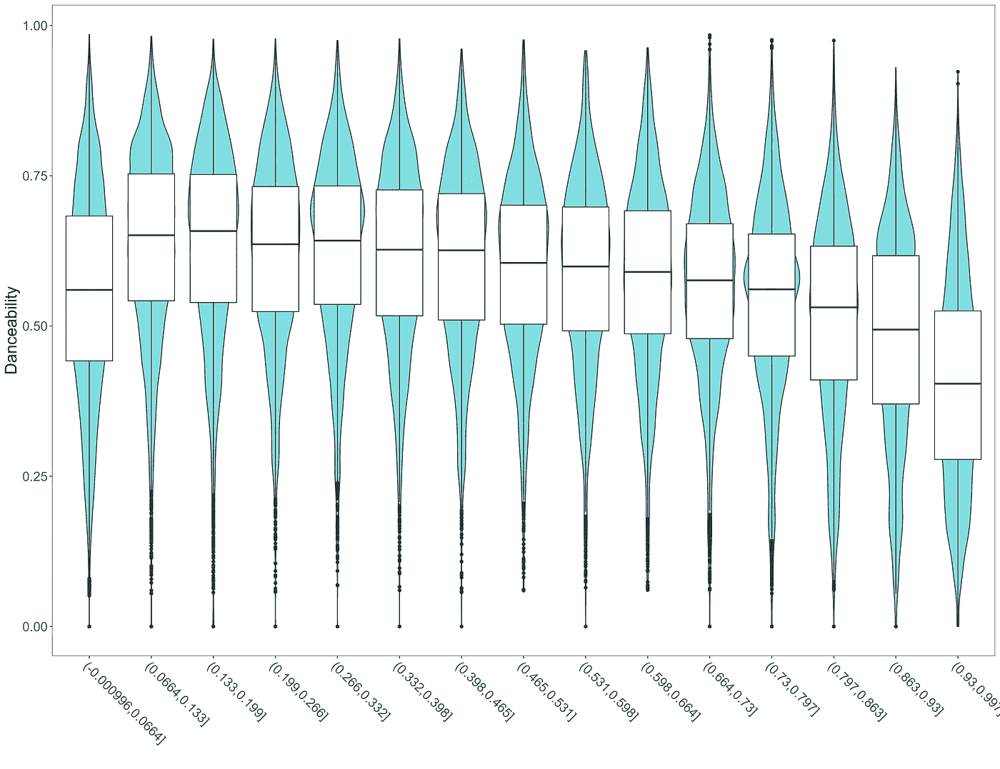
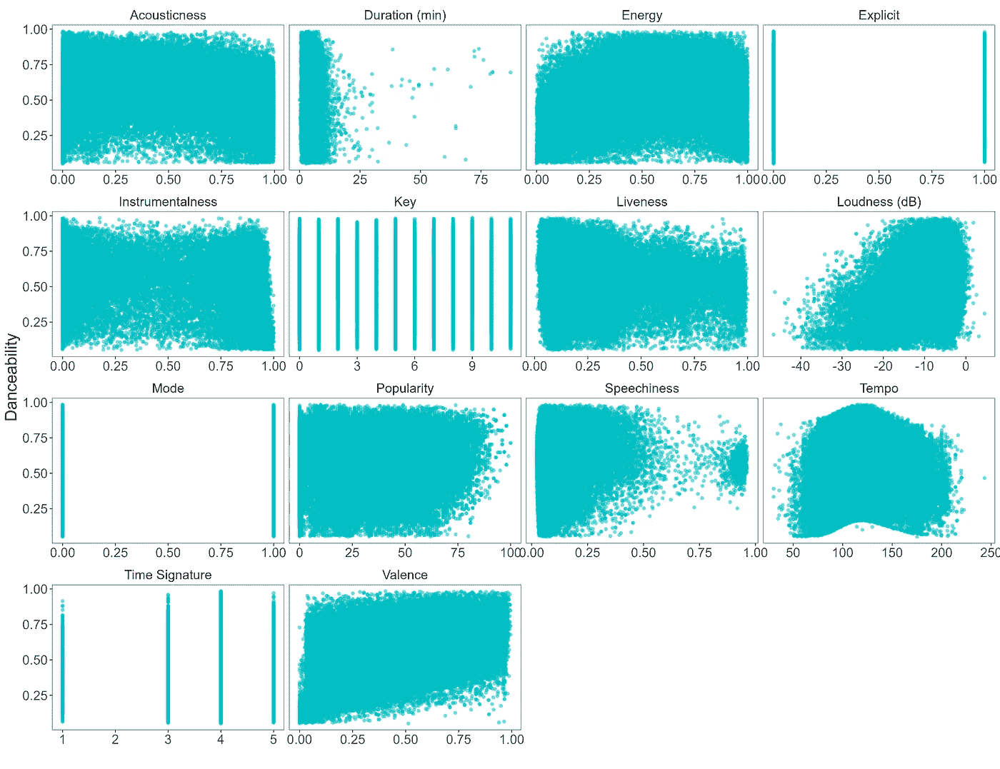
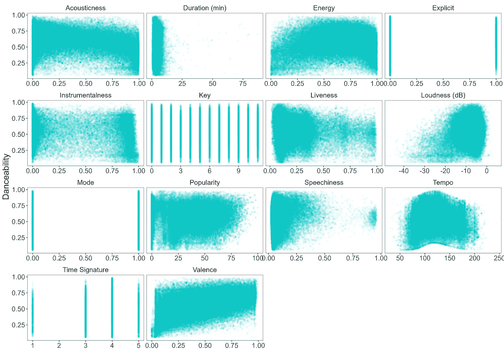

# 一种替代的大型数据集特征关系可视化方法

> 原文：[`towardsdatascience.com/an-alternative-approach-to-visualizing-feature-relationships-in-large-datasets-925ab257d772`](https://towardsdatascience.com/an-alternative-approach-to-visualizing-feature-relationships-in-large-datasets-925ab257d772)

## 如何使那些拥挤的散点图更具信息量

[](https://medium.com/@zvonimir.boban.mef?source=post_page-----925ab257d772--------------------------------)[](https://towardsdatascience.com/?source=post_page-----925ab257d772--------------------------------) [佐沃尼米尔·博班](https://medium.com/@zvonimir.boban.mef?source=post_page-----925ab257d772--------------------------------)

·发表于 [Towards Data Science](https://towardsdatascience.com/?source=post_page-----925ab257d772--------------------------------) ·阅读时间 5 分钟·2023 年 9 月 28 日

--



作者提供的图片

理解数据特征之间关系的最简单方法是通过可视化它们。在数值特征的情况下，这通常意味着生成散点图。

如果点的数量较少，这样做没问题，但对于大型数据集，观察重叠的问题会出现。对于中型数据集，可以通过使点半透明来部分缓解，但对于非常大的数据集，即使这样也无济于事。

那么应该怎么做呢？我将展示一种使用公开可用的 [Kaggle 上的 Spotify 数据集](https://www.kaggle.com/datasets/maharshipandya/-spotify-tracks-dataset)的替代方法。

数据集包含 114000 首 Spotify 曲目的音频特征，例如舞曲性、节奏、时长、语音度等。作为本帖的示例，我将检查舞曲性与所有其他特征之间的关系。

首先导入数据集并稍作整理。

```py
#load the required packages
library(dplyr)
library(tidyr)
library(ggplot2)
library(ggthemes)
library(readr)
library(stringr)

#load and tidy the data
spotify <- readr::read_csv('spotify_songs.csv') %>% 
  select(-1) %>%
  mutate(duration_min = duration_ms/60000, 
         track_genre = as.factor(track_genre)) %>%
  mutate(across(c(2:4, 20), toupper)) %>%
  relocate(duration_min, .before = duration_ms) %>%
  select(-duration_ms)
```

# ❔问题

如我之前所提，最简单的可视化双变量关系的方法是绘制每个点代表一首歌曲的散点图。前四列包含曲目 id 信息，因此我将其省略。我还重命名了特征，使第一个字母大写，然后重塑数据以便绘图。

```py
spotify %>%
  select(5:19) %>%
  mutate(across(everything(), as.numeric)) %>%
  rename_with(str_to_title) %>% #capitalize first letters of feature names
  rename("Duration (min)" = Duration_min,
         "Loudness (dB)" = Loudness,
         "Time Signature" = Time_signature) %>%
  pivot_longer(-Danceability, names_to = "parameter", values_to = "value") %>%
  ggplot(aes(value, Danceability)) +
  geom_point(col = "#00BFC4", alpha = 0.5) + #reduce point opacity with the alpha argument
  facet_wrap(~ parameter, scales = "free_x") +
  labs(x = "", y = "Danceability") +
  theme_few() +
  theme(text = element_text(size = 20))
```



作者提供的图片

尽管使用了降低点的不透明度（alpha = 0.5，相对于默认值 1），但重叠仍然过高。虽然我们可以检测到一些一般趋势，但由于点重叠过多，图表的可读性不强。

我们可以尝试进一步降低不透明度至 alpha = 0.05。



图片来源：作者

这改善了情况，有些人可能认为图表现在已经足够信息丰富。然而，我不同意，因为我仍然需要过度关注才能提取趋势和价值分布信息。

# 💡 另一种方案

从上述散点图中我们可以看到，数据集包含了序数特征（显式度、模式、键、时间签名）和数字特征。在分类特征的情况下，简化方案很明显——我们可以使用箱线图等汇总图。

那么数字特征呢？这个想法是将点分组到多个相等宽度的区间内，有效地将它们转化为序数特征，并启用上述描述的方法。

尽管箱线图是最常用的汇总图，但我还会在背景中添加小提琴图。这样，除了箱线图提供的分箱点的汇总统计（中位数、四分位范围）之外，我们还可以轻松看到特定分箱范围内的值分布。

这种强大的组合减少了图表杂乱，使趋势的识别更加容易。

我们可以尝试一下声学特性-舞蹈性图，然后再将所有特征一起可视化。

```py
#turn numeric features into ordinal by binning with the cut function
spotify_plot <- spotify %>%
  mutate(time_signature = as.numeric(as.character(time_signature))) %>%
  mutate(across(-c(1:4, 7, 8, 10, 12, 19, 20), ~ cut(., breaks = 15))) %>%
  mutate(across(c(7, 10, 12, 19), as.factor)) %>% #turn thr existing ordinal variables to factors
  select(-c(1:4, 20)) #remove unnecessary track id columns

spotify_plot %>%
    select(danceability, acousticness) %>%
    ggplot(aes(acousticness, danceability)) +
    geom_violin(fill = "#00BFC4", alpha = 0.5) +
    geom_boxplot() +
    labs(x = "", y = "Danceability") +
    theme_few() +
    theme(text = element_text(size = 20), 
    #tilt the axis labels to prevent overlap
    axis.text.x = element_text(angle = -45, hjust = 0, vjust = 1)) 
```


*图片来源：作者*

好多了！随着声学特性的增加，歌曲的舞蹈性下降的趋势现在更加明显。我们还可以看到，由于背景中加入了小提琴图，舞蹈性呈现出比较正常的分布，零舞蹈性离群点通过箱线图函数被识别出来，并作为单独的点绘制。

让我们将我们的解决方案推广到所有其他特征，并创建一个完整的特征关系面板。

```py
spotify_plot %>%
                   rename_with(str_to_title) %>%
                   rename("Duration (min)" = Duration_min,
                          "Loudness (dB)" = Loudness,
                          "Time Signature" = Time_signature) %>%
                   pivot_longer(-Danceability, names_to = "parameter", values_to = "value") %>%
                   arrange(parameter, value) %>%
                   ggplot(aes(value, Danceability)) +
                   geom_violin(fill = "#00BFC4", alpha = 0.5) +
                   geom_boxplot() +
                   facet_wrap(~ parameter, scales = "free_x") +
                   labs(x = "", y = "Danceability") +
                   theme_few() +
                   theme(axis.text.x = element_blank(),
                         text = element_text(size = 20))
```


图片来源：作者

尽管与原始散点图面板相比，我们失去了一些细节，但现在更容易检测到潜在的趋势。请注意，与上面的单一图表不同，我去掉了 x 轴上的区间范围，以减少在一次可视化所有特征时的杂乱。

考虑到这些可视化效果，最具影响力的特征应该是持续时间、能量、响度、节奏、时间签名和情感。声学特性、显式度、现场感、流行度和言语性显示出一定的效果，但不如前面提到的特征那么显著。键、器乐性和模式特征对舞蹈性评分似乎没有强烈的影响。

# 🗒️总结

这篇文章就到这里。我展示了如何绕过在分析大型数据集时重叠点的杂乱。我希望当你遇到大型数据集并希望轻松识别特征关系中的趋势时，你会发现提出的解决方案有用。如果你有任何评论、问题、建议或对其他自定义图表的请求，请在评论中告诉我。

当然，如果你喜欢这篇文章，请关注我获取更多类似内容😉。
