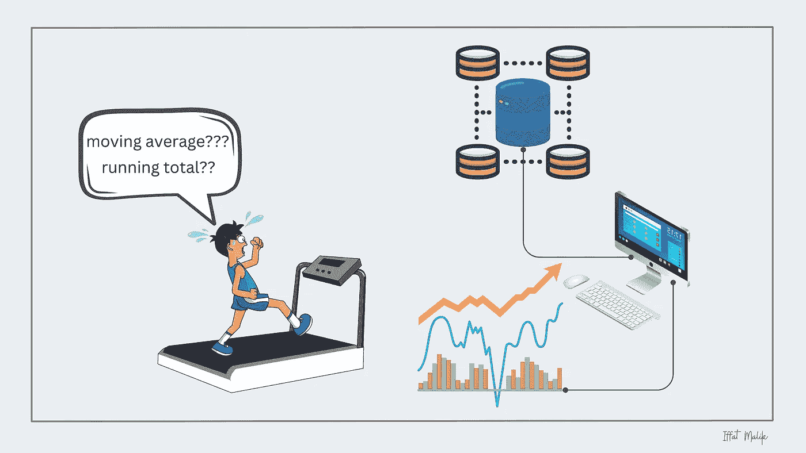

# SQL 中移动平均和运行总和的简单指南

> 原文：[`towardsdatascience.com/an-easy-guide-to-master-moving-average-and-running-total-in-sql-f1fa7acc9b59?source=collection_archive---------5-----------------------#2023-07-11`](https://towardsdatascience.com/an-easy-guide-to-master-moving-average-and-running-total-in-sql-f1fa7acc9b59?source=collection_archive---------5-----------------------#2023-07-11)

## 解锁 SQL 中的高级数据分析

 [Iffat Malik](https://iffatm.medium.com/?source=post_page-----f1fa7acc9b59--------------------------------)

·

[关注](https://medium.com/m/signin?actionUrl=https%3A%2F%2Fmedium.com%2F_%2Fsubscribe%2Fuser%2F88491120e677&operation=register&redirect=https%3A%2F%2Ftowardsdatascience.com%2Fan-easy-guide-to-master-moving-average-and-running-total-in-sql-f1fa7acc9b59&user=Iffat+Malik&userId=88491120e677&source=post_page-88491120e677----f1fa7acc9b59---------------------post_header-----------) 发表在 [Towards Data Science](https://towardsdatascience.com/?source=post_page-----f1fa7acc9b59--------------------------------) · 10 分钟阅读 · 2023 年 7 月 11 日 

--

作者图片

如果你从事数据工作，你可能经常遇到术语 *“移动平均”* 和 *“运行总和”*。数据专业人士通常会引用这句谚语，

> “ 趋势是你的朋友。 ”

清晰理解趋势对于做出准确预测和明智决策至关重要。然而，确定趋势并不总是简单的任务。这时，简单的移动平均就派上用场了。通过跟踪定义时间段内的趋势，它有助于识别和减轻噪音，同时平滑数据波动。这种技术增强了我们有效分析模式和做出可靠预测的能力。

在深入代码演示之前，让我们先熟悉一些关键术语。

## 什么是移动平均？

*移动平均* 也被称为 *滚动平均*、*运行平均* 或 *滚动均值*。它的计算方法是取一组值在特定时间段内的平均值。

它提供了一种标准化且简洁的数据总结和分析方式，揭示了整体趋势，使数据专业人士和决策者能够……
