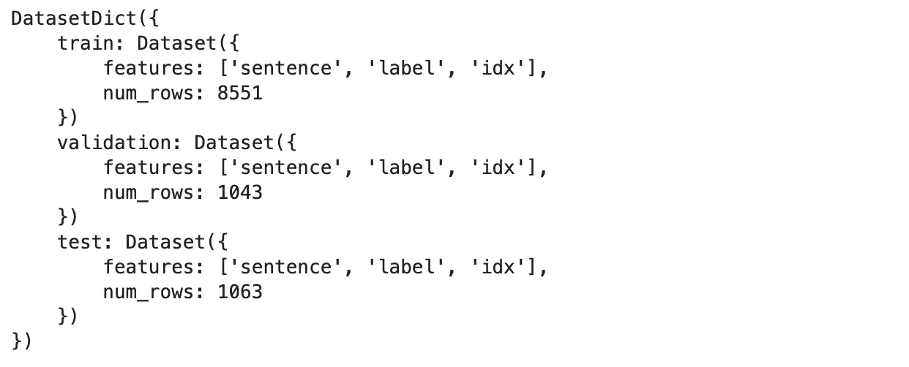
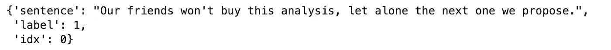
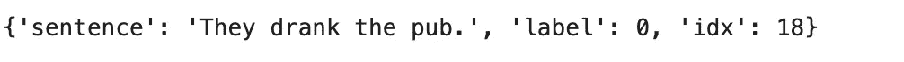
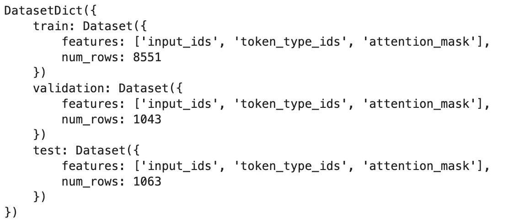
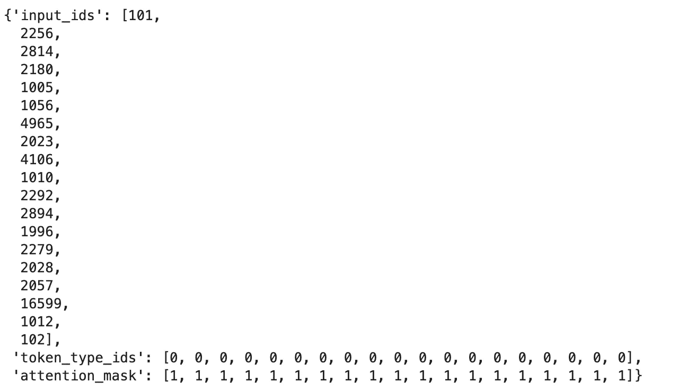
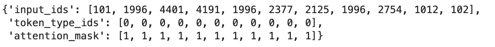
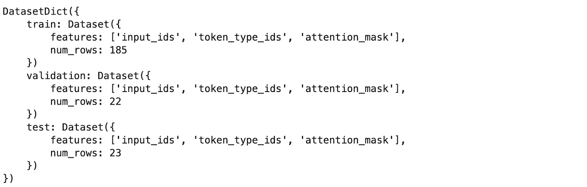
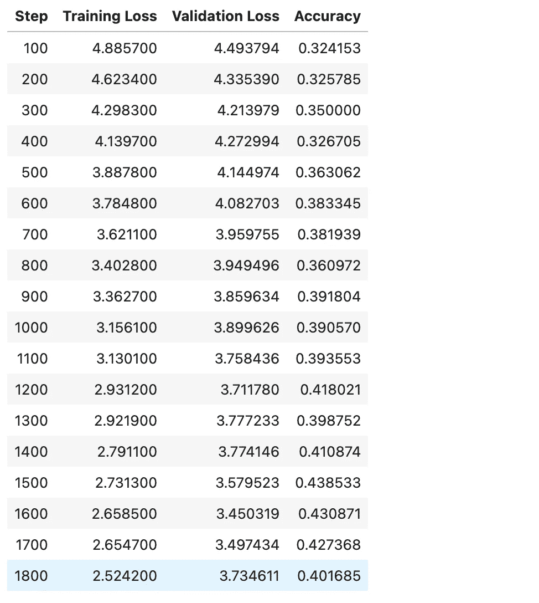

# 进入 HuggingFace 的切入点

> 原文：[`towardsdatascience.com/an-entry-point-into-huggingface-2f3d1e60ad5a`](https://towardsdatascience.com/an-entry-point-into-huggingface-2f3d1e60ad5a)

## 为初学者提供的基础知识的逐步指南

[](https://medium.com/@mina.ghashami?source=post_page-----2f3d1e60ad5a--------------------------------)[](https://towardsdatascience.com/?source=post_page-----2f3d1e60ad5a--------------------------------) [Mina Ghashami](https://medium.com/@mina.ghashami?source=post_page-----2f3d1e60ad5a--------------------------------)

·发布在 [Towards Data Science](https://towardsdatascience.com/?source=post_page-----2f3d1e60ad5a--------------------------------) ·15 分钟阅读·2023 年 11 月 26 日

--


图片来自 [unsplash](https://unsplash.com/photos/person-holding-ac-receiver-_J3oTl6acVg)

如果你不知道从哪里开始学习，HuggingFace 可能会显得复杂和困难。进入 HuggingFace 仓库的一个切入点是 [run_mlm.py](https://github.com/huggingface/transformers/blob/main/examples/pytorch/language-modeling/run_mlm.py) 和 [run_clm.py](https://github.com/huggingface/transformers/blob/main/examples/pytorch/language-modeling/run_clm.py) 脚本。

在这篇文章中，我们将通过 [run_mlm.py](https://github.com/huggingface/transformers/blob/main/examples/pytorch/language-modeling/run_mlm.py) 脚本进行讲解。这个脚本从 HuggingFace 中选择一个掩码语言模型，并在数据集上微调它（或者从头开始训练）。如果你是初学者，对 HuggingFace 代码了解甚少，这篇文章将帮助你理解基础知识。

> 我们将选择一个掩码语言模型，从 HuggingFace 加载数据集，并在数据集上微调模型。最后，我们将评估模型。这一切都是为了理解代码结构，因此我们的重点不在于任何特定的应用案例。

让我们开始吧。

# 关于微调的几句话

微调是深度学习中的一种常见技术，用于调整预训练的神经网络模型，以更好地适应新的数据集或任务。

当你的数据集不足以从头训练一个深度模型时，微调效果很好！因此，你可以从一个已经训练好的基础模型开始。

在微调中，你会采用一个在大数据源上预训练的模型（例如，图像的 ImageNet 或 NLP 的 BooksCorpus），然后在你的数据集上继续训练，以使模型适应你的任务。这比从随机权重开始训练需要的额外数据和周期要少得多。

# 微调在 HuggingFace 中

HuggingFace (HF) 提供了许多内置功能，让我们可以用少量代码微调预训练模型。主要步骤如下：

1.  加载预训练模型

1.  加载预训练的 tokenizer

1.  加载你想用于微调的数据集

1.  使用 tokenizer 对上述数据集进行分词

1.  使用 Trainer 对象在分词数据集上训练预训练模型

让我们看看代码中的每个步骤。我们将故意省略许多细节，以便给出整体结构的概览。

## 1) HF：加载预训练模型

例如，要加载`bert-base`模型，请编写以下内容：

```py
model = AutoModelForMaskedLM.from_pretrained("bert-base-cased")
```

访问模型名称的完整列表请见[*https://huggingface.co/models*](https://huggingface.co/models)。

## 2) HF：加载预训练的 tokenizer

通常，tokenizer 的名称与模型名称相同：

```py
tokenizer = AutoTokenizer.from_pretrained("bert-base-cased")
```

## 3) HF：加载用于微调的数据集

这里，我们以非流式方式加载 squad 数据集。

```py
raw_datasets = load_dataset(
            'squad',
            cache_dir='./cache',
            streaming=False
        )
```

## 4) HF：对数据集进行分词

我们定义了一个分词函数，并将样本批量传递给它。

```py
def tokenize_function(examples):
    return tokenizer(examples['text'], return_special_tokens_mask=True)

tokenized_datasets = raw_datasets.map(
    tokenize_function,
    batched=True 
)
```

## 5) HF：训练模型的 trainer

最后但同样重要的是负责训练模型的 Trainer 对象。

```py
trainer = Trainer(
        model=model,
        args=training_args,
        train_dataset=train_dataset if training_args.do_train else None,
        eval_dataset=eval_dataset if training_args.do_eval else None,
        tokenizer=tokenizer,
        data_collator=data_collator,
        compute_metrics=compute_metrics if training_args.do_eval and not is_torch_tpu_available() else None,
        preprocess_logits_for_metrics=preprocess_logits_for_metrics
        if training_args.do_eval and not is_torch_tpu_available()
        else None,

trainer.train()
```

> 将这五个步骤结合起来，我们可以从 HuggingFace 微调模型。

在此之前，我们从一个被忽略的细节开始：**输入参数**。如上所示，代码中涉及许多超参数，例如 `model_name`、`dataset_name`、`training_args` 等。这些超参数是我们在进行上述任何步骤之前应指定的输入参数。让我们看看 HuggingFace 中有哪些参数。

## HuggingFace 中的参数组

通常有三到四个不同的参数组：

1.  `ModelArguments`：与我们将微调或从头训练的模型/配置/tokenizer 相关的参数。

1.  `DataTrainingArguments`：与训练数据和评估数据相关的参数。

1.  `TrainingArguments`：与训练超参数和配置相关的参数。

1.  `PEFTArguments`：与模型的参数高效训练相关的参数。这是可选的，你可以选择不以参数高效模式训练模型，这样你将没有这个参数组。

你可能之前见过每一个参数都被定义为 `dataclass`。例如，`ModelArguments` 如下：（有点长，但只是所有与建模相关的超参数）

```py
@dataclass
class ModelArguments:
    """
    Arguments pertaining to which model/config/tokenizer we are going to fine-tune, or train from scratch.
    """
model_name_or_path: Optional[str] = field(
        default=None,
        metadata={
            "help": (
                "The model checkpoint for weights initialization. Don't set if you want to train a model from scratch."
            )
        },
    )
    model_type: Optional[str] = field(
        default=None,
        metadata={"help": "If training from scratch, pass a model type from the list: " + ", ".join(MODEL_TYPES)},
    )
    config_overrides: Optional[str] = field(
        default=None,
        metadata={
            "help": (
                "Override some existing default config settings when a model is trained from scratch. Example: "
                "n_embd=10,resid_pdrop=0.2,scale_attn_weights=false,summary_type=cls_index"
            )
        },
    )
    config_name: Optional[str] = field(
        default=None, metadata={"help": "Pretrained config name or path if not the same as model_name"}
    )
    tokenizer_name: Optional[str] = field(
        default=None, metadata={"help": "Pretrained tokenizer name or path if not the same as model_name"}
    )
    cache_dir: Optional[str] = field(
        default=None,
        metadata={"help": "Where do you want to store the pretrained models downloaded from huggingface.co"},
    )
    use_fast_tokenizer: bool = field(
        default=True,
        metadata={"help": "Whether to use one of the fast tokenizer (backed by the tokenizers library) or not."},
    )
    model_revision: str = field(
        default="main",
        metadata={"help": "The specific model version to use (can be a branch name, tag name or commit id)."},
    )
    token: str = field(
        default=None,
        metadata={
            "help": (
                "The token to use as HTTP bearer authorization for remote files. If not specified, will use the token "
                "generated when running `huggingface-cli login` (stored in `~/.huggingface`)."
            )
        },
    )
    use_auth_token: bool = field(
        default=None,
        metadata={
            "help": "The `use_auth_token` argument is deprecated and will be removed in v4.34\. Please use `token` instead."
        },
    )
    trust_remote_code: bool = field(
        default=False,
        metadata={
            "help": (
                "Whether or not to allow for custom models defined on the Hub in their own modeling files. This option"
                "should only be set to `True` for repositories you trust and in which you have read the code, as it will "
                "execute code present on the Hub on your local machine."
            )
        },
    )
    low_cpu_mem_usage: bool = field(
        default=False,
        metadata={
            "help": (
                "It is an option to create the model as an empty shell, then only materialize its parameters when the pretrained weights are loaded. "
                "set True will benefit LLM loading time and RAM consumption."
            )
        },
    )
    def __post_init__(self):
        if self.config_overrides is not None and (self.config_name is not None or self.model_name_or_path is not None):
            raise ValueError(
                "--config_overrides can't be used in combination with --config_name or --model_name_or_path"
            )
```

为了初始化这些并解析它们，我们使用 `HFArgumentParser`。

## HfArgumentParser

`HfArgumentParser` 是**HuggingFace 参数解析器**。你可以看到它的定义如下：

```py
parser = HfArgumentParser((ModelArguments, DataTrainingArguments, TrainingArguments))
```

**让我们看看如何传递参数**：你可以通过三种方式传递参数：

**1) 通过命令行**：打开终端并在命令行中传递参数。以下是一个示例：

```py
python train.py --model_name_or_path bert-base-uncased --per_device_train_batch_size 4 --output_dir ./output --dataset_name squad
```

然后按照以下方式读取：

```py
parser = HfArgumentParser((ModelArguments, DataTrainingArguments, TrainingArguments))
model_args, data_args, training_args = parser.parse_args_into_dataclasses()
```

解析器将自动将这些参数分配到正确的组。

**2) 通过传递 json 文件**：JSON 文件应包含与参数名称对应的键。以下是一个 json 文件的示例：

```py
{
    "output_dir": "./output",
    "model_name_or_path": "bert-base-cased",
    "config_name": "some-config.json",
    "cache_dir": "/tmp/", 
    "dataset_name": "glue", 
    "dataset_config_name": "mrpc",
    "max_seq_length": 128,
    "overwrite_cache": false
}
```

注意不要在最后一行后面加`,`，否则会出错。按如下方式调用`train.py`脚本：

```py
python train.py './args.json'
```

并在`train.py`中接收参数如下：

```py
parser = HfArgumentParser((ModelArguments, DataTrainingArguments, TrainingArguments))
model_args, data_args, training_args = parser.parse_json_file(json_file=os.path.abspath(sys.argv[1]))
```

**3) 通过字典传递：**

当然，如果你可以通过 json 文件传递，你也可以通过字典传递参数：

```py
args_dict = {
    'model_name_or_path': 'prajjwal1/bert-tiny',
    'per_device_train_batch_size': 1,
    'per_device_eval_batch_size': 1,
    "dataset_name": "glue",
    "output_dir": "./bert_output",
    "do_train": True,
    "do_eval": True,
    "max_seq_length": 512,
    "learning_rate": 0.001 ,
    "num_train_epochs": 10,
    "logging_strategy": "steps",
    "logging_steps": 100,
    "evaluation_strategy": "steps",
    "eval_steps": 100, 
    "save_strategy": "steps",
    "save_steps": 100,
}

model_args, data_args, training_args = parser.parse_dict(args_dict)
```

要点是`HfArgumentParser`允许灵活传递参数。

## 整体代码

将以上五个步骤综合起来：

首先导入所有必要的库。

```py
import logging
import math
import os
import sys
import warnings
from dataclasses import dataclass, field
from itertools import chain
from typing import Optional

import datasets
import evaluate
from datasets import load_dataset

import transformers
from transformers import (
    CONFIG_MAPPING,
    MODEL_FOR_MASKED_LM_MAPPING, # from here: https://huggingface.co/transformers/v3.3.1/_modules/transformers/modeling_auto.html
    AutoConfig,
    AutoModelForMaskedLM,
    AutoTokenizer,
    DataCollatorForLanguageModeling,
    HfArgumentParser,
    Trainer,
    TrainingArguments,
    is_torch_tpu_available,
    set_seed,
)
from transformers.trainer_utils import get_last_checkpoint
from transformers.utils import check_min_version, send_example_telemetry
from transformers.utils.versions import require_version

logger = logging.getLogger(__name__)
MODEL_CONFIG_CLASSES = list(MODEL_FOR_MASKED_LM_MAPPING.keys())
MODEL_TYPES = tuple(conf.model_type for conf in MODEL_CONFIG_CLASSES)
```

其次，我们定义了三组参数。注意我们已经导入了`TrainingArguments`。所以不需要再定义它。首先，我们定义`ModelArguments`。

```py
 @dataclass
class ModelArguments:
    """
    Arguments pertaining to which model/config/tokenizer we are going to fine-tune, or train from scratch.
    """

    model_name_or_path: Optional[str] = field(
        default=None,
        metadata={
            "help": (
                "The model checkpoint for weights initialization. Don't set if you want to train a model from scratch."
            )
        },
    )
    model_type: Optional[str] = field(
        default=None,
        metadata={"help": "If training from scratch, pass a model type from the list: " + ", ".join(MODEL_TYPES)},
    )
    config_overrides: Optional[str] = field(
        default=None,
        metadata={
            "help": (
                "Override some existing default config settings when a model is trained from scratch. Example: "
                "n_embd=10,resid_pdrop=0.2,scale_attn_weights=false,summary_type=cls_index"
            )
        },
    )
    config_name: Optional[str] = field(
        default=None, metadata={"help": "Pretrained config name or path if not the same as model_name"}
    )
    tokenizer_name: Optional[str] = field(
        default=None, metadata={"help": "Pretrained tokenizer name or path if not the same as model_name"}
    )
    cache_dir: Optional[str] = field(
        default=None,
        metadata={"help": "Where do you want to store the pretrained models downloaded from huggingface.co"},
    )
    use_fast_tokenizer: bool = field(
        default=True,
        metadata={"help": "Whether to use one of the fast tokenizer (backed by the tokenizers library) or not."},
    )
    model_revision: str = field(
        default="main",
        metadata={"help": "The specific model version to use (can be a branch name, tag name or commit id)."},
    )
    token: str = field(
        default=None,
        metadata={
            "help": (
                "The token to use as HTTP bearer authorization for remote files. If not specified, will use the token "
                "generated when running `huggingface-cli login` (stored in `~/.huggingface`)."
            )
        },
    )
    use_auth_token: bool = field(
        default=None,
        metadata={
            "help": "The `use_auth_token` argument is deprecated and will be removed in v4.34\. Please use `token` instead."
        },
    )
    trust_remote_code: bool = field(
        default=False,
        metadata={
            "help": (
                "Whether or not to allow for custom models defined on the Hub in their own modeling files. This option"
                "should only be set to `True` for repositories you trust and in which you have read the code, as it will "
                "execute code present on the Hub on your local machine."
            )
        },
    )
    low_cpu_mem_usage: bool = field(
        default=False,
        metadata={
            "help": (
                "It is an option to create the model as an empty shell, then only materialize its parameters when the pretrained weights are loaded. "
                "set True will benefit LLM loading time and RAM consumption."
            )
        },
    )

    def __post_init__(self):
        if self.config_overrides is not None and (self.config_name is not None or self.model_name_or_path is not None):
            raise ValueError(
                "--config_overrides can't be used in combination with --config_name or --model_name_or_path"
            ) 
```

以及`DataTrainingArguments`类：

```py
 @dataclass
class DataTrainingArguments:
    """
    Arguments pertaining to what data we are going to input our model for training and eval.
    """

    dataset_name: Optional[str] = field(
        default=None, metadata={"help": "The name of the dataset to use (via the datasets library)."}
    )
    dataset_config_name: Optional[str] = field(
        default=None, metadata={"help": "The configuration name of the dataset to use (via the datasets library)."}
    )
    train_file: Optional[str] = field(default=None, metadata={"help": "The input training data file (a text file)."})
    validation_file: Optional[str] = field(
        default=None,
        metadata={"help": "An optional input evaluation data file to evaluate the perplexity on (a text file)."},
    )
    overwrite_cache: bool = field(
        default=False, metadata={"help": "Overwrite the cached training and evaluation sets"}
    )
    validation_split_percentage: Optional[int] = field(
        default=5,
        metadata={
            "help": "The percentage of the train set used as validation set in case there's no validation split"
        },
    )
    max_seq_length: Optional[int] = field(
        default=None,
        metadata={
            "help": (
                "The maximum total input sequence length after tokenization. Sequences longer "
                "than this will be truncated."
            )
        },
    )
    preprocessing_num_workers: Optional[int] = field(
        default=None,
        metadata={"help": "The number of processes to use for the preprocessing."},
    )
    mlm_probability: float = field(
        default=0.15, metadata={"help": "Ratio of tokens to mask for masked language modeling loss"}
    )
    line_by_line: bool = field(
        default=False,
        metadata={"help": "Whether distinct lines of text in the dataset are to be handled as distinct sequences."},
    )
    pad_to_max_length: bool = field(
        default=False,
        metadata={
            "help": (
                "Whether to pad all samples to `max_seq_length`. "
                "If False, will pad the samples dynamically when batching to the maximum length in the batch."
            )
        },
    )
    max_train_samples: Optional[int] = field(
        default=None,
        metadata={
            "help": (
                "For debugging purposes or quicker training, truncate the number of training examples to this "
                "value if set."
            )
        },
    )
    max_eval_samples: Optional[int] = field(
        default=None,
        metadata={
            "help": (
                "For debugging purposes or quicker training, truncate the number of evaluation examples to this "
                "value if set."
            )
        },
    )
    streaming: bool = field(default=False, metadata={"help": "Enable streaming mode"})

    def __post_init__(self):
        if self.streaming:
            require_version("datasets>=2.0.0", "The streaming feature requires `datasets>=2.0.0`")

        if self.dataset_name is None and self.train_file is None and self.validation_file is None:
            raise ValueError("Need either a dataset name or a training/validation file.")
        else:
            if self.train_file is not None:
                extension = self.train_file.split(".")[-1]
                if extension not in ["csv", "json", "txt"]:
                    raise ValueError("`train_file` should be a csv, a json or a txt file.")
            if self.validation_file is not None:
                extension = self.validation_file.split(".")[-1]
                if extension not in ["csv", "json", "txt"]:
                    raise ValueError("`validation_file` should be a csv, a json or a txt file.")
```

然后调用`HfArgumentParser`将输入参数解析到各个类中：

```py
parser = HfArgumentParser((ModelArguments, DataTrainingArguments, TrainingArguments))
## if arguments are passed as a json file
if len(sys.argv) == 2 and sys.argv[1].endswith(".json"):
    model_args, data_args, training_args = parser.parse_json_file(json_file=os.path.abspath(sys.argv[1]))
## if they are passed as command line arguments
else:
    model_args, data_args, training_args = parser.parse_args_into_dataclasses()
```

但为了我们的使用场景，我们将它们定义为一个字典并传递：

```py
args_dict = {
    'model_name_or_path': 'bert-base-uncased', 
    'per_device_train_batch_size': 1,
    "dataset_name": "glue",
    "output_dir": "./bert_output",
    "do_train": True,
    "do_eval": True
}
## parse the dictionary of arguments
model_args, data_args, training_args = parser.parse_dict(args_dict)
```

现在，让我们打印`model_args, data_args, training_args`：

```py
ModelArguments(model_name_or_path='bert-base-uncased', model_type=None, config_overrides=None, config_name=None, tokenizer_name=None, cache_dir=None, use_fast_tokenizer=True, model_revision='main', token=None, use_auth_token=None, trust_remote_code=False, low_cpu_mem_usage=False)
```

```py
DataTrainingArguments(dataset_name='glue', dataset_config_name=None, train_file=None, validation_file=None, overwrite_cache=False, validation_split_percentage=5, max_seq_length=None, preprocessing_num_workers=None, mlm_probability=0.15, line_by_line=False, pad_to_max_length=False, max_train_samples=None, max_eval_samples=None, streaming=False)
```

`training_args`是一个长属性列表。我在这里部分打印出来：

```py
TrainingArguments(
_n_gpu=1,
adafactor=False,
adam_beta1=0.9,
adam_beta2=0.999,
adam_epsilon=1e-08,
auto_find_batch_size=False,
bf16=False,
bf16_full_eval=False,
data_seed=None,
dataloader_drop_last=False,
dataloader_num_workers=0,
dataloader_pin_memory=True,
ddp_bucket_cap_mb=None,
ddp_find_unused_parameters=None,
ddp_timeout=1800,
debug=[],
deepspeed=None,
disable_tqdm=False,
do_eval=True,
do_predict=False,
do_train=True,
....
```

**接下来，我们加载一个数据集。** 在这里，我们加载的是`glue — cola`数据集，即“语言接受性语料库”。它包含了从语言学理论的书籍和期刊文章中提取的英文接受性判断。每个示例是一个带有语法标注的单词序列[1]。

```py
raw_datasets = load_dataset(
            data_args.dataset_name,
            'cola',
            data_args.dataset_config_name,
            cache_dir=model_args.cache_dir,
            token=model_args.token,
            streaming=data_args.streaming
        )
```

数据集有三个分割：train — validation — test。注意我们在训练集中有 8551 个数据点。同时注意这是一个监督数据集，因为它有一个标签；但在这篇文章中我们不会使用标签，我们将以*自监督的方式*（掩蔽标记）使用此数据集来微调模型。



图片由作者提供

让我们看一个训练中的例子：

```py
raw_datasets['train'][0]
```



图片由作者提供

我们看到`label = 1`因为`sentence`在语法上是正确的。现在让我们看另一个`label = 0`的例子。



图片由作者提供

这句话“They drank the pub”在语法上是不正确的，所以`label = 0`。

**好了，数据部分讲解完了。让我们加载分词器**：

```py
tokenizer_kwargs = {
        "cache_dir": model_args.cache_dir,
        "use_fast": model_args.use_fast_tokenizer,
        "revision": model_args.model_revision,
        "token": model_args.token,
        "trust_remote_code": model_args.trust_remote_code,
    }

tokenizer = AutoTokenizer.from_pretrained(model_args.model_name_or_path, **tokenizer_kwargs)
```

打印分词器显示如下：

```py
BertTokenizerFast(name_or_path='bert-base-uncased', vocab_size=30522, model_max_length=512, is_fast=True, padding_side='right', truncation_side='right', special_tokens={'unk_token': '[UNK]', 'sep_token': '[SEP]', 'pad_token': '[PAD]', 'cls_token': '[CLS]', 'mask_token': '[MASK]'}, clean_up_tokenization_spaces=True)
```

**接下来，加载模型**并检查模型的`embedding_size`；这显示了模型的嵌入维度，并且如果它与分词器的词汇表大小匹配。如果不匹配，我们将调整模型的嵌入矩阵。

```py
model = AutoModelForMaskedLM.from_pretrained(
            model_args.model_name_or_path,
            from_tf=bool(".ckpt" in model_args.model_name_or_path),
            config=config,
            cache_dir=model_args.cache_dir,
            revision=model_args.model_revision,
            trust_remote_code=model_args.trust_remote_code,
            low_cpu_mem_usage=model_args.low_cpu_mem_usage,
        )

# We resize the embeddings only when necessary to avoid index errors. If you are creating a model from scratch
# on a small vocab and want a smaller embedding size, remove this test.
embedding_size = model.get_input_embeddings().weight.shape[0]
print(embedding_size, len(tokenizer))

if len(tokenizer) > embedding_size:
    model.resize_token_embeddings(len(tokenizer))
```

在我们的情况下，由于我们没有向分词器添加任何特殊标记，它们匹配且都是*30522*。所以没问题。

**接下来，设置上下文长度并告知分词器从数据中读取哪一列：**

```py
# Preprocessing the datasets.
# First we tokenize all the texts.
column_names = list(raw_datasets["train"].features)
text_column_name = "text" if "text" in column_names else column_names[0]
print(text_column_name) # prints sentence

# set context length 
max_seq_length = min(data_args.max_seq_length, tokenizer.model_max_length)
# this prints 512
```

**接下来，编写分词函数：**

```py
 def tokenize_function(examples):
    return tokenizer(examples[text_column_name], return_special_tokens_mask=False)

if not data_args.streaming:
    tokenized_datasets = raw_datasets.map(
        tokenize_function,
        batched=True,
        num_proc=data_args.preprocessing_num_workers,
        remove_columns=column_names,
        load_from_cache_file=not data_args.overwrite_cache,
        desc="Running tokenizer on every text in dataset",)
```

让我们看看分词后的数据：



图片由作者提供

第一个数据点如下所示：



图片由作者提供

第 10 个数据点如下所示：



图片由作者提供

请注意，不同的数据点自然具有不同的大小（input_ids 在不同数据点中的长度不同）。稍后，数据收集器会对其进行填充或截断，以确保它们的长度相同。

**以及打包函数**：

```py
# Main data processing function that will concatenate all texts from our dataset and generate chunks of
# max_seq_length.
def group_texts(examples):
    # Concatenate all texts.
    concatenated_examples = {k: list(chain(*examples[k])) for k in examples.keys()}
    total_length = len(concatenated_examples[list(examples.keys())[0]])
    # We drop the small remainder, and if the total_length < max_seq_length  we exclude this batch and return an empty dict.
    # We could add padding if the model supported it instead of this drop, you can customize this part to your needs.
    total_length = (total_length // max_seq_length) * max_seq_length
    # Split by chunks of max_len.
    result = {
        k: [t[i : i + max_seq_length] for i in range(0, total_length, max_seq_length)]
        for k, t in concatenated_examples.items()
    }
    return result

tokenized_datasets = tokenized_datasets.map(
                    group_texts,
                    batched=True,
                    num_proc=data_args.preprocessing_num_workers,
                    load_from_cache_file=not data_args.overwrite_cache,
                    desc=f"Grouping texts in chunks of {max_seq_length}",
                )
```

打包后的数据如下所示：



作者提供的图片

你可以看到数据的大小从 8551 行减少到 185 行。这是因为打包形成了长度为`context_length=512`的序列。因此，在`group_texts`函数之后，我们在训练集中有 185 个数据点，每个数据点的长度为`512`个 tokens。

现在数据已经被标记化并打包成上下文长度的批次，让我们来看看我们的训练集和评估集：

```py
train_dataset = tokenized_datasets["train"]
eval_dataset = tokenized_datasets["validation"]
```

```py
def preprocess_logits_for_metrics(logits, labels):
    if isinstance(logits, tuple):
        # Depending on the model and config, logits may contain extra tensors,
        # like past_key_values, but logits always come first
        logits = logits[0]
    return logits.argmax(dim=-1)

metric = evaluate.load("accuracy")

def compute_metrics(eval_preds):
    preds, labels = eval_preds
    # preds have the same shape as the labels, after the argmax(-1) has been calculated
    # by preprocess_logits_for_metrics
    labels = labels.reshape(-1)
    preds = preds.reshape(-1)
    mask = labels != -100
    labels = labels[mask]
    preds = preds[mask]
    return metric.compute(predictions=preds, references=labels)
```

最后，我们定义了数据收集器和训练器对象。如果你不熟悉数据收集器，可以查看[这篇文章](https://medium.com/towards-data-science/data-collators-in-huggingface-a0c76db798d2)。

[](/data-collators-in-huggingface-a0c76db798d2?source=post_page-----2f3d1e60ad5a--------------------------------) ## HuggingFace 中的数据收集器

### 它们是什么以及它们的作用

towardsdatascience.com

只需知道数据收集器负责确保批次中的所有序列具有相同的长度，因此它会进行截断和填充。

```py
data_collator = DataCollatorForLanguageModeling(
        tokenizer=tokenizer,
        mlm_probability=data_args.mlm_probability,
        pad_to_multiple_of=8,
    )

# Initialize our Trainer
trainer = Trainer(
    model=model,
    args=training_args,
    train_dataset=train_dataset if training_args.do_train else None,
    eval_dataset=eval_dataset if training_args.do_eval else None,
    tokenizer=tokenizer,
    data_collator=data_collator,
    compute_metrics=compute_metrics if training_args.do_eval and not is_torch_tpu_available() else None,
    preprocess_logits_for_metrics=preprocess_logits_for_metrics
    if training_args.do_eval and not is_torch_tpu_available()
    else None,
)
```

让我们训练模型并查看结果：

```py
train_result = trainer.train(resume_from_checkpoint=None)
trainer.save_model()  # Saves the tokenizer too for easy upload
metrics = train_result.metrics
```



作者提供的图片

你可以看到我们每 100 步都有验证结果和指标（我们选择的是准确率），这是因为在`data_args`中我们设置了以下内容：

```py
 "evaluation_strategy": "steps",
    "eval_steps": 100, 
```

# 结论

在这篇文章中，我们简要介绍了[run_mlm.py](https://github.com/huggingface/transformers/blob/main/examples/pytorch/language-modeling/run_mlm.py)脚本，这个脚本是进入 HuggingFace 的入口点。我们看到了在 HuggingFace 上微调（或从头开始训练）模型的基本步骤。如果你对 HuggingFace 了解甚少，这篇文章可以帮助你了解基本步骤。

# 参考文献

1.  [`huggingface.co/datasets/glue`](https://huggingface.co/datasets/glue)
