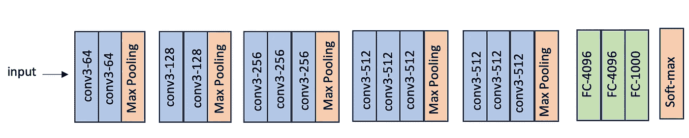

# VGG 实现

> 原文：[`towardsdatascience.com/an-implementation-of-vgg-dea082804e14?source=collection_archive---------6-----------------------#2023-10-31`](https://towardsdatascience.com/an-implementation-of-vgg-dea082804e14?source=collection_archive---------6-----------------------#2023-10-31)

## 一个适合初学者的教程

[](https://medium.com/@mina.ghashami?source=post_page-----dea082804e14--------------------------------)[](https://towardsdatascience.com/?source=post_page-----dea082804e14--------------------------------) [Mina Ghashami](https://medium.com/@mina.ghashami?source=post_page-----dea082804e14--------------------------------)

·

[关注](https://medium.com/m/signin?actionUrl=https%3A%2F%2Fmedium.com%2F_%2Fsubscribe%2Fuser%2Fc99ed9ed7b9a&operation=register&redirect=https%3A%2F%2Ftowardsdatascience.com%2Fan-implementation-of-vgg-dea082804e14&user=Mina+Ghashami&userId=c99ed9ed7b9a&source=post_page-c99ed9ed7b9a----dea082804e14---------------------post_header-----------) 发表在 [Towards Data Science](https://towardsdatascience.com/?source=post_page-----dea082804e14--------------------------------) ·9 分钟阅读·2023 年 10 月 31 日[](https://medium.com/m/signin?actionUrl=https%3A%2F%2Fmedium.com%2F_%2Fvote%2Ftowards-data-science%2Fdea082804e14&operation=register&redirect=https%3A%2F%2Ftowardsdatascience.com%2Fan-implementation-of-vgg-dea082804e14&user=Mina+Ghashami&userId=c99ed9ed7b9a&source=-----dea082804e14---------------------clap_footer-----------)

--

[](https://medium.com/m/signin?actionUrl=https%3A%2F%2Fmedium.com%2F_%2Fbookmark%2Fp%2Fdea082804e14&operation=register&redirect=https%3A%2F%2Ftowardsdatascience.com%2Fan-implementation-of-vgg-dea082804e14&source=-----dea082804e14---------------------bookmark_footer-----------)

在这篇文章中，我们探讨了 VGG 实现及其在 STL10 [2, 3] 数据集上的训练。

我们在 [上一篇文章](https://medium.com/towards-data-science/image-classification-for-beginners-8546aa75f331) 中回顾了 VGG 架构。如果你不熟悉，请查看一下。

[](/image-classification-for-beginners-8546aa75f331?source=post_page-----dea082804e14--------------------------------) ## 初学者的图像分类

### VGG 和 ResNet 架构来自 2014 年

towardsdatascience.com

总之，

> ***VGG*** *代表* ***视觉几何组*** *，是牛津大学的一个研究小组。2014 年，他们设计了一个用于图像分类任务的深度卷积神经网络架构，并以他们的名字命名；即 VGG [1]。*

VGGNet 有几种配置，如 VGG16（具有 16 层）和 VGG19（具有 19 层）。

VGG16 的架构如下：它有 13 个卷积层和 3 个全连接层。



作者提供的图片

# 模型实现

让我们在 PyTorch 中实现 VGG16。

```py
import torch
import torch.nn as nn
import torch.optim as optim
import torch.nn.functional as F
import torchvision
import torchvision.transforms as transforms
import numpy as np
import matplotlib.pyplot as…
```
